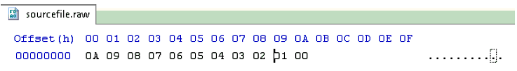
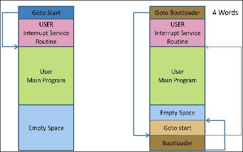
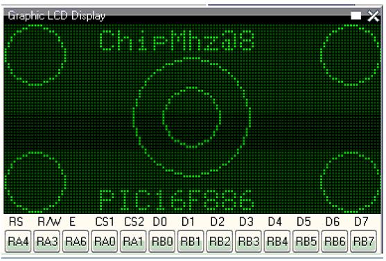
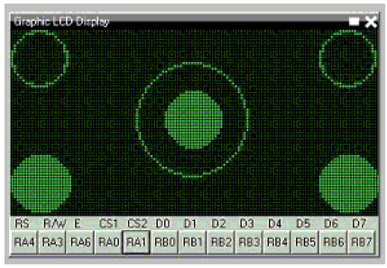

== Documentazione su Great Cow BASIC.  

 
Il team di sviluppo di Great Cow BASIC al 2019.
 
 
 

== Introduzione a Great Cow BASIC.

<<<

****
.Great Cow BASIC Guide.
Italian version of the guide in English, Written by `_Evan Venn_.`

*Note:* errors, translation and typing reports are welcome via the Forum. `_Thanks for collaboration._`

****

****
.Guida di Great Cow BASIC.
Versione Italiana, della guida in lingua Inglese, scritta da `_Evan Venn_`.

Traduzione dell'ultimo pdf del 2019. Versione 0.98.06 2019-06-12 del compilatore Great Cow BASIC.

*Nota:* sono gradite segnalazioni di errori, di traduzione e battitura, tramite Forum. `_Grazie per la collaborazione_`.

****

<<<

Benvenuto nell'Help di Great Cow BASIC. Questo file di aiuto ha lo scopo di fornire approfondimenti e conoscenza per usare Great Cow BASIC.

Per informazioni sull'installazione di Great Cow BASIC e diversi altri programmi che potrebbero essere utili, per favore vedi http://www.Getting Started with Great Cow BASIC.
 
Se sei nuovo alla programmazione, dovresti provare i programmi dimostrativi di Great Cow BASIC, spiega tutto in modo graduale e non presuppone conoscenze preliminari.

Se ai programmato in un'altro linguaggio, puoi seguire passo passo, i programmi dimostrativi, e il modo migliore per imparare.
Se c'è qualcos'altro su cui ai bisogno di aiuto, visita http://www.sougeforge.net/forum?group_id=169286

=== Usare Great Cow BASIC.

Ai bisogno di compilare un programma con Great Cow BASIC, ma non sai da dove cominciare? Prova queste semplici Istruzioni:

* Completa l'installazione utilizzando i valori predefiniti: seleziona tutti i programmatori ma non quelli in modalità portatile.
* Il programma di installazione avvierà automaticamente l'IDE.
* Quando viene aperto un file di origine di Great Cow BASIC, consulta il menu "Strumenti GCB" (strumenti IDE / strumenti GCB
): attraverso questo menu è possibile accedere ai comandi con un click. Oppure prova il tasto destro del mouse, puoi accedere alle stesse opzioni.
* I comandi IDE Tools (tasti funzione F5 - F8) avviano un'utility, Great Cow BASIC chiama il file
batch per compilare codice sorgente e programmazione (della memoria flash) (1) del microcontrollore target. 
Seleziona il programmatore appropriato in "Modifica preferenze programmatore" (strumenti IDE / strumenti GCB / Modifica le preferenze del programmatore o premendo Ctrl + Alt + E).
Trova il tuo programmatore nella lista e trascinalo in alto sotto la voce "Programmatori da usare (in ordine)". Great Cow BASIC ora tenterà di programmare il microcontrollore 
con quel programmatore per prima cosa quando fai clic su "Make HEX and FLASH" (F5) o "FLASH previus made hexfile" (F8).
* Nel caso improbabile che il tuo programmatore non sia elencato, puoi aggiungerlo premendo "Aggiungi ..." in "Modifica"
Preferenze del programmatore ". Dovresti conoscere la directory di lavoro e le opzioni della riga di comando
ecc. per il programmatore. Vedere i suggerimenti della guida in basso facendo clic sui campi.
* Per programmare il microcontrollore con memoria flash specifico del progetto è possibile modificare i programmatori correnti in "Modifica preferenze programmatore"
per soddisfare le tue esigenze facendo clic su "Modifica ...". Usa il parametro " "Use If:" per scegliere il programmatore preferito. 
Vedi i suggerimenti di aiuto. Il modello di chip è riconosciuto automaticamente dall'IDE per l'uso in "Use IF:" o in opzioni da riga di comando, ecc.
* Alcuni programmatori usano un file .hex per programmare il microcontrollore com memoria flash. Selezionando "Esegui HEX" (F5), Great Cow BASIC compilerà il programma e creerà un file .hex nella stessa directory di Great Cow BASIC. 
Questo metodo può anche essere usato per verificare gli errori nel programma Great Cow BASIC prima di programmare il microcontrollore.
Il software per i programmatori incluso ed è:

* Avrdude per AVR,

* PICPgm per PIC,

* PicKit2 e PicKit3,

* TinyBootLoader,

* Microchip Xpress Board e molti altri ancora.

(1) E necessario un programmatore adatto e le istruzioni dovrebbero essere incluse con il programmatore su come scaricare i programmi sul microcontrollore.

*Realease Formale <>*

 
[options="header,footer"]
|======================= 
^|Riferimento  ^|Orario Stampa  
^|ASCIIDOCs presentato|20-01-2019
23:10:56 Ora standard GMT
^|Informazioni ToC master|12-01-2019
23:00:06 Ora standard GMT
 
|=======================  

=== Cambiamenti 

*Realease Formale del Compilatore Great Cow Basic  v0.98.04.*

*Gli aggiornamenti dell'HELP sono i seguenti:*

* Aggiunta nuova sezione NT7108C.

* Aggiornata la sezione G77DST7735 per cancellare i colori, aggiunti i colori TFT alla sezione panoramica di GLCD.

* Aggiunto supporto per il canale 8 PMW.
 
* Sezione PWM rivista per quanto riguarda i potenziali canali PWMN.

* Rivisto ST7735 GLCD per supportare OLED.
 
*Release 0.98.03.*
 
* Aggiornata la sezione Randomize.

* Aggiunto il supporto PCA9685 alla sezione Libreria.

* Sezione Libreria aggiornata per includere l'elenco completo dei driver di libreria.

* Aggiunto HPWM_CCPTimerN.

* Aggiunto GLCD ILI9326.

* Aggiunta la sezione macOS di Apple.

* Aggiunta la sezione optionReserveHighProg.

* Aggiunti test condizionali TRUE.

* Added LCD_IO_3.

* Aggiunta nuova sezione HEFM.

* Aggiunta nuova sezione SAFM.

*Release 0.98.02.*

* Aggiornata sezione chip.  

* Corretta sezione ReadAD.  

* Corretta sezione Array.  

* Corretta sezione Dir.  

* Aggiunta sezione SSD1331. 

* aggiornate sezione parametri a liea di comando con /S e /F[O].

* Aggiornato il compilatore perchè inserisca commenti nel file ASM e aggiornato i parametri a linea di comando.

* Sezione del convertitore aggiornata per correggere lo stato deletetarget = Y o N eliminare = Y o N.

* Aggiunto HSerPrintStringCRLF.

* Aggiornato sezione HPWMUpdate per chiarire che tipo di variabile usare.

* Aggiornato i parametri per GLCDCLS per vedere i colori sui dispositivi GLCD.

* Agiunto il metodo Scale.  

* Aggiunta la costante LCD_WIDTH.  

* Impostazione delle Variabili aggiornate.

* Aggiunta sezione display Nextion.

* Informazioni sul formato corrette sulla pagina della riga di comando. 

*Release 0.98.01.*

* Aggiornata la sezione ILI9341 per i font OLED.

* Aggiornato I2C per il modulo I2C: nuove costanti e comandi.

* Aggiornato per il PWM modello fisso.

* Aggiornato per PWM con risoluzione a 10 bit e CCP / PWM.

* Aggiunte pagine di contorno PWM a 16 bit.

* Revisionate le informazioni di ReadTable.

* Aggiunta sezione GLCD HX8347.

* Aggiunti nuovi comandi GLCDPrintString, GLCDPrintStringLN e GLCDLocateString.

*Release 0.98.00.*

* Gli esempi #define aggiornati USART_TX_BLOCKING.

* Pagina delle condizioni aggiornate con i vincoli noti dell'uso delle funzioni come condizioni di prova.

* Sezione SPI aggiornata, aggiungendo il metodo FastHWSPIT Transfer.

* Sezione GLCD rivista per supportare SSD 13030 128 * 32 pixel.

* Sezione ADC aggiornata per supportare tutte e tre le opzioni di lettura per ReadAD, ReadAD10 e ReadAD12.

* Sezione Input / Output aggiornata per chiarire il supporto degli AVR.

* Aggiunta sezione GLCD ILI9341.

* Aggiunta sezione GLCD ILI9486L.

* Sezione della tabella di ricerca aggiornata.

* Aggiornata la sezione OtherDirectives e aggiunte informazioni migliorate su ChipFamily.

* Aggiornata la sezione PWM per vedere il supporto per i canali PWM3 e PWM4.

* Sezione PWM rivista per migliorare le informazioni.

* Aggiunta sezione HPWMUpdate.

* Sezione subroutine aggiornata per utilizzo della memoria dei 16f.

* Aggiunta la sezione 47xxx con una nuova sottosezione di memoria.

* Aggiunto PWM per la sezione AVR.

* Aggiornata la sezione Altre direttive con le informazioni sui chip.

* Aggiunta sezione timer SMT.

* Sezione di manutenzione aggiornata.

* Aggiornata la sezione timer, di nuovo.

* Aggiornata la sezione PWM per includere le funzionalità degli AVR.

* Aggiornata la sezione Interrupt - rimuovendo errori di battitura e aggiungendo altri esempi.

* Aggiornati i driver GCLD per aggiungere parametri per la gestione del colore.

* Aggiunta sezione FVR.

* STR aggiornato per includere STR32, STRInteger e un altro esempio.

* Aggiornato VAL per includere Val32 e un altro esempio.

* Aggiornata la sezione GLCD per includere la configurazione di memoria insufficiente SSD1306 e la tabella del GLCD
funzionalità.

* Aggiornata la sezione GLCD per includere la configurazione di memoria insufficiente SSD1306 e SH1106 e aggiungere esempi.

* Aggiunto Ellipse e FilledEllipse.

* Aggiunto Triangolo e Filled Triangolo.

* Aggiunto TO range a Select Case.

* Aggiornato vincolo di stringa concatenato. 

* Informazioni LCD_Backlight aggiornate per le modalità LCD 0, 4, 8 e 404.

* Aggiunte informazioni OLED solo alla sezione SSD1306. I font OLED sono supportati solo su SSD1306
GLCD in questa versione.

* Aggiunto #SameVar e #SameBit.

* Aggiunto prefisso [canskip] e SettingVariables.

*Release 0.97.00.*

* Sezione #Startup rivista per documentare le ultime modifiche alla priorità delle subroutine di avvio.

* Aggiunta sezione di manutenzione.

* Revised inittimer 1,3,5 e 7 per riflettere ulteriori sorgenti di clock.

* Aggiornate tutte le sezioni PPS per far vedere #startup come metodo consigliato.

* Revisionato Pulsein e aggiunto PulseInInv.

* Aggiunto PORTCHANGE alla sezione OnInterrupt.

* Informazioni aggiornate sul compilatore per il registro TRISIO.

* Revisionato LCD_IO 2_74xx164 per aggiungere il collegamento allo schema elettrico.

* Aggiunta dell'utilizzo dell'output ad altre direttive.

* Aggiunto il supporto per SDD1306 per SPI alla sezione GLCD.

* Aggiunta sezione GetUserID.

* Aggiunta sezione Seriale software (ottimizzata).

*Release 0.96.00.*

* Uso delle stringhe rivisto ed esempi di stringhe per mostrare l'uso delle virgolette all'interno di una stringa.

* Revisionato OtherDirectives per includere le costanti mancanti.

* Aggiunto DisplaySegment e Rivisto DisplayChar.

* Aggiornato initimer2 / 4 e 6 per mostrare i prescalers.

* Ripristinati operazioni bit a bit e SetWith.

*Release 0.95.010.*

* Aggiunti miglioramenti a SerSend e SerPrint. 

* Sezione 7 segmenti riveduta per fornire chiarezza, migliorare il codice e rimuovere gli errori. 

* Sezione CCP e PWM riveduta per includere le funzionalita.

* Revisione della sezione ADC e aggiunta costante ADReadPreReadCommand.

*Release 0.95.009.*

* Aggiunto il driver GLCD SH1106.

*Release 0.95.008.*

* Solo numero di versione aggiornato.

*Release 0.95.007a.*

* Aggiunto #option explicit.

* Aggiunta spiegazione variabile lifecycle.

* Sezione PlayRTTTL rivista e migliorata.

* Sezioni Wait e SPIMode riviste.

*Release 0.95.007*

* Aggiunte nuove funzionalita per supportare la gamma di microcontrollori 16F1885x.

* Nuovi comandi PMW: supporto per hardware PWM.

* Nuova opzione Initimer0 per supportare moduli timer a 8 e 16 bit.

* Nuove costanti disponibili ChipADC e ChipIO.

* Nuovi comandi per supportare PPS. LOCKPPS e UNLOCKPPS.

* Aggiunto comando I2CStartoccurred. Mancava dalla Guida.

* Ulteriori informazioni per gli script.

* Rimozione generale degli errori di battitura nei file della Guida.

* Aggiornato la sezione FnLSL rimuovendo l'errore.

* La rimozione di SetWith, FnEQUBit e FnNOTBit dovrebbe ora essere sostituita dalle operazioni incorporati nel compilatore. 
I bit vengono ora gestiti correttamente dall'operatore Not.

* Nuovo comando #option volatile. I pin sensibili possono essere contrassegnati come volatili e gli operatori di assegnazione nativi si imposteranno senza problemi, sostituendo SetWith.

* Aggiunte nuove sezioni sull'ottimizzazione del codice ADC e PWM.

* Aggiunto il nuovo comando I2C per il software I2C use_I2C_timeout.

*Release 0.95.006.*

* Riscrittura completata del file di aiuto.

* Nuovo file di aiuto in PDF.

* Nuovo file di guida in XML.

* Nuovo file di aiuto in HTML5.

* Nuovo file di aiuto in HTML per Web.

* Sezione Linux riveduta.

* Sezione SPIMode rivista.

*Release 0.95.005a.*

* Sezione hardware RS232 riveduta per migliorare la leggibilita.

*Release 0.95.005*

* Aggiunto LeftPad.

*Release 0.95.004.*

* Aggiornati i comandi HSerial per supportare AVR 1, 2, 3 e 4.

*Release 0.95.*

* Aggiunto set di comandi per pullup.

* Aggiunto utilizzo della RAM durante la definizione della Array.

* Aggiunto un nuovo metodo per usare una costante per definire un'Array.

* Aggiunte informazioni su come impostare l'indirizzo sui moduli mjkdz I2C LCD 1602.

* Aggiunte nuove costanti ChipWords e ChipEEPROM.

* Aggiunto un nuovo metodo di definizione della tabella.

* Aggiunte nuove funzionalita alle tabelle di ricerca.

* Aggiunte nuove funzionalita a READAD per i microcomputer AVR.

* Aggiunte istruzioni per compilare Great Cow BASIC sotto Linux.

* Aggiunto un nuovo comando per invertire un display GLCD KS0108.

* Aggiunto nuovo codice di esempio: FLASH_LED.

* Aggiunto come impostare la velocita del chip a velocita non standard.

* Aggiunto un nuovo parametro di comando al set di comandi hardware USART.

* Il set di comandi HI2C2.

* Aggiunto un nuovo set di comandi per la seconda porta USART.

* Aggiunto il nuovo set di comandi del driver GLCD ILI9340.

* Aggiunto il set di comandi del driver GLCD SDD1289.

* Aggiunto codice di esempio. Misurazione della durata dell'impulso alla risoluzione del sub-microsecondo.

* Generazione di impulsi accurati mediante una macro. Come passare un indirizzo di porta alla routine usando una macro.

* Aggiunta sezione di supporto .NET.

* Parametri del comando SPIMode rivisti.

* Aggiunto #option NoContextSave.

* Aggiunto su Intterupt: il gestore predefinito.

* Aggiunte nuove opzioni del compilatore sotto-sezione, spostate le opzioni dalle Direttive del compilatore.

* Aggiunto il nuovo supporto per i caratteri per GLCD.

* Aggiunto il nuovo supporto per i colori per GLCD.

* Aggiunto LCD_IO_1 e cambia LCD_IO_2 per supportare 74xx164 e 74xx174.

* Revisionata la maggior parte della sezione Timer per supportare le informazioni corrette.

* Aggiunto il supporto del controller touchscreen ADS7843.

* Aggiunto il set di comandi Play e PlayRTTL.

* Aggiunto comando DIFFerence.

* Aggiunti tre metodi bit a bit. FnNotBit, FnLSL e FnLSR.

* Domande frequenti aggiornate con "come impostare una porta.

* Aggiunto il metodo bitwise FnequBit.

* Aggiunti i dettagli di Timer6, Timer7, Timer8, Timer10 e Timer12 su On Interrupt.

* Aggiunto un nuovo esempio di on interrupt.

* Aggiunta la riga di comando / WX.

* Aggiunti HI2CWaitMSSP e HI2CWaitMSSPTimeout alla sezione I2C hardware.

* Parametri della riga di comando aggiornati.

* Aggiunto il comando Fill.

* Sezione Array rivisto.

* Aggiunto il comando ReadAD12.

* Aggiunta la spiegazione di dividere e divisione.

* Aggiunto Str32 e Val32.

* Aggiunto supporto per USART2. HSerReceive1 e HserReceive2.

* Aggiunto HserRecieveFrom.

* Aggiunto HserGetNum.HSertGetString.

* Aggiunta modalita di misurazione a canale singolo e modalita di misurazione del canale differenziale a ADC. 

* Panoramica.

*Release 0.94b.*

* Aggiunto il supporto HEFM.

* Aggiunto il supporto del driver GLCD SSD 1306.

*Release v0.91.*

* Aggiunto USART_TX_BLOCKING.

* Aggiunto LCD_SPEED.

* Sezione LCD migliorata.

*Release v0.9ho*

* Aggiornamento del parametro passato alle routine secondarie.

* Sezione LCD nuova e rivista per includere LCD_IO 10 e 12.

* Rimuovere la LAT dove appropriato.

* LAT e stato deprecato. Il compilatore reindirizzera tutte le scritture pin I / O da PORTx a LATx registri su PIC 16F1 / 18F.

* Utilizzare #option nolatch se si verificano problemi.

* ADFormat modificato in deprecato.

* Aggiungi l'azione predefinita a #CHIP quando non viene specificata alcuna frequenza.

*Release v0.9h.*

* Corretti gli errori nella sezione PWM e esempi migliorati.

*Release v0.9hn.*

* Modifiche agli array. Il numero di elementi e ora limitato a 10.000 per dispositivi 12F e 16F o, la RAM disponibile.

* Tabelle di ricerca aggiornate per supportare i nuovi metodi di compilazione delle tabelle.

1. un singolo valore su ciascuna linea.

2. piu elementi su una singola riga separati da virgole.

3. Sono consentite costanti e calcoli all'interno delle voci della tabella di dati a riga singola.

* Repeat loop modificato per supportare EXIT REPEAT.

* Nuovo comando Pad. Il metodo Pad viene utilizzato per creare una stringa su una lunghezza specifica che viene estesa con un carattere specifico.

* Aggiunto il set di comandi DS18B20.

*v0.9hm.*

* Aggiornato I2C - software e hardware. Il codice dimostrativo ora utilizza la scheda dimostrativa Chipino. Modificato nella sezione I2C seriale con questi nuovi esempi.

* Nuovi comandi funzionali:

-LCDDisplayOn.

-LCDDisplayOff.

-LCDBackLight ( On | Off ).

* I nuovi Define per supportare le funzionalita LCD sono:

-LCD_SPEED FAST.

-LCD_SPEED MEDIUM.

-LCD_SPEED SLOW.

* Funzionalita Revisionata LCDHex supporta ora la stampa degli zeri iniziali quando il numero HEX e inferiore a 0x10. chiamare LCDHex come segue per assicurarsi che siano presenti zeri iniziali.

* LCDHex byte_value, LeadingZeroActive parameter called LeadingZeroActive.

* Nuovo supporto per i dispositivi GLCD PCD8544.

* Sezione GLCD modificata dell'aiuto per supportare il nuovo dispositivo.

*v0.9hl.*

* HSERPRINTCLRF - Aggiunto parametro per ripetere il numero di CRLF inviato.

* Aggiunto set di comandi I2C hardware. Questa e una funzionalita riveduta per fornire supporto al modulo MSSP.

*0.9hk.*

* File della guida aggiornato per correggere l'immissione di potenza, era nella sezione errata. Spostato nella sezione Matematica e altri errori minori.

* Correggere le informazioni del timer0. Revisionato per mostrare le costanti e il codice del timer e stato corretto.

*v0.9hj*

* Queste informazioni si riferiscono alla Release del 11 maggio 2014.  
Dove la funzionalita non e supportata dalle versioni precedenti di GCB, effettuare l'aggiornamento. Alcune funzioni non 
funzioneranno nelle versioni precedenti di Great Cow Basic.

* Nuovi comandi funzionali.
 
* xref:anchor-1[Circle] Disegna un cerchio sullo schermo del GLCD. xref:anchor-2[FilledCircle] Riempie un cerchio sullo schermo del GLCD. xref:anchor-3[Log] function(s) Power funzione. 
registro funzione(i) Comandi funzionali modificati.

* xref:anchor-4[Line] Ora disegna linee tra due punti qualsiasi sul display GLCD. 
#define GLCD_PROTECTOVERRUN. 
Controlla il disegno di cerchi per impedire il superamento del cerchio a estremi di  isualizzazione.

* #define Line OldLine. 
Aggiungendo questa definizione si tornera alle vecchie routine di disegno a linee. Questo e stato aggiunto per compatibilita con le versioni precedenti.

* Aiuto e revisione dei file.

* Aggiunto xref:anchor-5[PunlseIn].

* Aggiunto esempio di intestazione xref:anchor-6[IR_Remote].  

* Aggiunto esempio di dimostrazione e rivisto xref:anchor-7[GLCD demonstration]. 

* Aggiunto esempio di controllo xref:anchor-217[RGB LED Control]  
Aggiunta sezione per mostrare il metodo di documentazione inline,vedere Code Documentation. 

*v0.9hk.*

* Metodo documentato per la documentazione GCGB.

* Aggiunto MATHS.H.

* Aggiunta la funzione SQRT.

*v0.9hi.*

* Supporto per ST7735 documentato. Funzionalita aggiunta a GLCD.h.

* Supporto per dispositivo grafico ST7920 LCD 128 * 64.

* Sezione GLCD modificata per includere un dispositivo nuovo, e uno non documentato.

* Nuovi comandi per il supporto diGLCD.
 
 ST7920GLCDEnableGraphics 
 ST7920GLCDDisableGraphics 
 ST7920GLCDClearGraphics 
 ST7920Locate  
 ST7920gTile 
 ST7920Tile 
 ST7920cTile 
 ST7920SetIcon 
 ST7920GraphicTest 
 ST7920LineHs 
 ST7920gLocate 
 ST7920lineh 
 ST7920linev
 
* Supporto documentato per GLCD ST7735.

* Revisionati i comandi GLCD con retro compatibilita:

* GLCDCLS.

* GLCDPrint - supporta le modalita LCD e GLCD.

* GLCDDrawString - supporto per la gestione delle stringhe.

         GLCDDrawChar - Colore opzionale
         Box
         FilledBox
         Line
         PSet
         GLCDReady

* InitGLCD, include la correzione per la routine di avvio per i dispositivi KS0108

* Le funzioni per ST7920 possono essere utilizzate secondo necessita ..

     ST7920WriteCommand
     ST7920WriteData
     ST7920WriteByte
     ST7920gReaddata
     ST7920GLCDReadByte
     GLCDTimeDelay

* Informazioni test condizionali aggiornate.

* Informazioni aggiornate sul KeyPad.

* Informazioni aggiornate sulla tabella di ricerca.

* Aggiunte informazioni sulla macro.

* Aggiunta nuova sezione matematica Trig.

* Aggiunti due nuovi esempi di Circle

* Aggiunte altre informazioni sulle direttive.

* Aggiunti programmi di esempio.

* Cerchi punto medio.

* Cerchi per trigonometria.

*v0.9hg.*

* Pagine di visualizzazione GLCD ad anodo comune  corrette.

*v0.9hf.*

* Sezione 7 segmenti riveduta per supportare il catodo comune. Ci sono ora due opzioni disponibili.

*v0.9he.*

* Nuovi comandi. Richiesto dopo marzo 2014 LCD.h:

LCDHOME, LCDSPACE, LCDCreateGraph, LCDCursor, LCDCmd

* Aggiunta della concatenazione.

* Aggiornato DisplayValue per mostrare il supporto per i valori HEX.

Richiesto dopo marzo 2014 7Segment.h.

* Codice di esempio GLCD aggiornato per garantire che l'esempio

sia compilato senza file esterni.

* Aggiunti Trigonometria e l'applicazione di esempio

* Aggiornamento della panoramica LCD per includere il supporto LATx per una maggiore velocita di clock. Post richiesto Marzo 2014 LCD.h

*v0.9hd.*

* Revisionato Ruota per chiarire i tipi di byte supportati.

*v0.9hc Mar 2014.*

* Revisione di HSERPRINT per mostrare integer e long, sono supportati e il testo modificato è corretto.

* Aggiunti HserPrintByteCRLF e HserPrintCRLF.

* Aggiunto esempio alla tabella sine.

* TABELLA Revisionata per mostrare la limitazione rispetto all'utilizzo di WORDS quando si posizionano TABLES in EEPROM.

*v0.9hb Mar 2014.*

* Aggiunto PulseOutInv.

* I2CRestart.

* Aggiungi nuove varianti per l'uso dei commenti.

* Aggiunta sezione Assembler.

*14 Gennaio.*

* Nuovi comandi:

Len, Asc, Chr, Trim, Ltrim, Rtrim, Swap4, Swap, Abs, Average, Trim, Ltrim, Rtrim, Wordtobin, Bytetobin, GLCD, DectoBCD, BCDtoDec.

Uso delle variabili.

Altro su costanti e variabili.

Ringraziamenti.

* Cambia in:

Str, Hex, Poke, Else, Readtable, Exit (era exitsub).

Parametri della riga di comando Domande frequenti.

* Corretti errori di battitura.

* Valore di ripetizione massimo REPEAT aggiornato.

* Aggiornamento della maggior parte delle pagine per il layout.

Risolti i collegamenti alle pagine esterne. Questa volta scaricato come pagine html complete, per POT e LC.

Aggiunto LABEL, Bootloader e revisione Selezione, aggiunto READAD10

Corretto Double SWAP

*v0.9hg.*

* Corrected GLCD Common Anode display pages

*v0.9hf.*

* Revised 7 Segment section to support Common Cathode. Split 7 Segment entry to show the two options available.

*v0.9he.*

* Nuovi comandi. Richiesto dopo marzo 2014 LCD.h:

LCDHOME, LCDSPACE, LCDCreateGraph, LCDCursor, LCDCmd.

* Aggiunta della concatenazione.

* Aggiornato DisplayValue per mostrare il supporto per i valori HEX.

Obbligatorio post marzo 2014 7Segment.h.

* Codice di esempio GLCD aggiornato per garantire che l'esempio sia compilato senza file esterni.

* Aggiunto Trigonometria e l'applicazione di esempio.

* Aggiornamento della panoramica LCD per includere il supporto

LATx per una maggiore velocita di clock. Post richiesto Marzo 2014

LCD.h.

*v0.9hd.*

* Revisionato Rotate per chiarire i tipi di byte supportati.

*v0.9hc Mar 2014.*

* HSERPRINT rivisto per mostrare i numeri, integer e long sono supportati e il testo modificato e corretto. 

*v0.9hb Mar 2014.*

* Added PulseOutInv 

* I2CRestart 

* Add new variants to use of Comments 

* Added Assembler Section 

*14 Gennaio.*

* Nuovi comandi:

* [red]#Len, sc, Chr, Trim, Ltrim, Rtrim, Swap4, Swap, Abs, Average, Trim, Ltrim, Rtrim, Wordtobin, Bytetobin, GLCD, DectoBCD, BCDtoDec.#

* Uso delle variabili.

* Altro su costanti e variabili.

Ringraziamenti.

Cmbiati in:

* [red]#Str, Hex, Poke, Else, Readtable, Exit (era exitsub).#

* Parametri della riga di comando Domande frequenti.

* Corretti errori di battitura.

* Valore di ripetizione massimo REPEAT aggiornato.

* Aggiornamento della maggior parte delle pagine per il layout.

* Risolti i collegamenti alle pagine esterne. Questa volta scaricato come pagine html complete, per POT e LC.

* Aggiunto LABEL, Bootloader e revisione Selezione, aggiunto READAD10.

* Corretto Double SWAP.

*v0.9h*

* Pagine di visualizzazione degli anodi comuni GLCD corrette.

*v0.9h.*

* Sezione 7 segmenti riveduta per supportare la modalità a  catodo comune.

Dividi la voce di 7 segmenti per mostrare le due opzioni disponibili.

*v0.9he.*

* Nuovi comandi. Richiesto dopo marzo 2014 LCD.h:

[red]#LCDHOME, LCDSPACE, LCDCreateGraph, LCDCursor, LCDCmd.#

* Aggiunta della concatenazione.

* Aggiornato DisplayValue per mostrare il supporto per i valori HEX.

Richiesto dopo marzo 2014.

7Segment.h

* Codice di esempio GLCD aggiornato per garantire che l'esempio.

sia compilato senza file esterni.

* Aggiunti Trigonometria e l'applicazione di esempio.

* Aggiornamento della panoramica LCD per includere il supporto.

LATx per una maggiore velocita di clock. Post richiesto.

Marzo 2014 LCD.h

*v0.9hd.*

* Revisionato Rotate per chiarire i tipi di byte supportati.

*v0.9hc Mar 2014.*

* HSERPRINT rivisto per mostrare i numeri integer e long sono supportati e ha cambiato il testo corretto.

* Aggiunti HserPrintByteCRLF e HserPrintCRLF.

* Aggiunto esempio di tabella sinusoidale.

* TABLE Rrivista per mostrare la limitazione rispetto all'utilizzo di WORDS quando si inseriscono TABELLE in EEPROM.

*@v0.9hb Mar 2014.*

* Aggiunto PulseOutInv

* I2CRestart

* Aggiungi nuove varianti per l'uso dei commenti

* Aggiunta sezione Assembler

14 gennaio

*Nuovi Comandi):*

* [red]#Len, sc, Chr, Trim, Ltrim, Rtrim, Swap4, Swap, Abs, Average, Trim, Ltrim, Rtrim, Wordtobin, Bytetobin, GLCD, DectoBCD, BCDtoDec.#

* Usare le variabili.

* Altro su costanti e variabili.

* Ringraziamenti.

*Cambia in:*

* [red]#Str, Hex, Poke, Else, Readtable, Exit# (era exitsub).

* Parametri della riga di comando. 

* Domande frequenti.

* Corretti errori di battitura.

* Valore di ripetizione massimo REPEAT aggiornato.

* Aggiornamento della maggior parte delle pagine per il layout.

* Risolti i collegamenti alle pagine esterne. Questa volta scaricato come pagine html complete, per POT e LC.

* Aggiunto LABEL, Bootloader e revisione di Select, aggiunto READAD10.

* Corretto Double SWAP.

=== Paremetri della riga di comando.

****
*Informazioni sui parametri della riga di comando*

GCBASIC [/O:output.asm] [/A:assembler] [/P:programmer] [/K:\{C|A}] [/V] [/L] [/NP] nomefile 

GCBASIC [/O:output.asm] [/A:assembler] [/P:programmer] [/K:{C|A}] [/V] [/L] [/WX]  [/NP] nomefile 

GCBASIC [/O:output.asm] [/A:assembler] [/P:programmer] [/K:{C|A}] [/V] [/L] [/WX] [/S:Use.ini] [/NP] nomefile

GCBASIC [/O:output.asm] [/A:assembler] [/P:programmer] [/K:{C|A}] [/V] [/L] [/WX]  [/S:Use.ini] [/F[O]] [/NP] nomefile
GCBASIC /version

****

[options="header,footer"]
|======================= 
^|Switch  ^|Descrizione  ^|Default  
^|/:filename  |Imposta il nome del file assembly generato nel nome file.
  |Stesso nome del file di input, ma con estensione .asm.
  
^|/A:assmber |File batch utilizzato per chiamare l'assemblatore (1). Se / A: GCASM è dato, Great Cow BASIC userà il suo assemblatore interno.
  |Il programma non verrà assemblato
  
^|/P:programmer  |File batch utilizzato per chiamare il programmatore (1). Questo parametro viene ignorato se il programma non è assemblato.
  |File batch utilizzato per chiamare l'assemblatore (1). Se / A: GCASM è dato, Great Cow BASIC userà il suo assemblatore interno.
  
^|/K:[C A]|Conserva il codice originale nell'output dell'assieme.  |Nessun codice originale lasciato in uscita.

^|/V[:[O  F][1 T] |Modalità dettagliata: il compilatore fornisce informazioni più dettagliate sulle sue attività. / Vx sovrascriverà qualsiasi configurazione nel file utente ini |-

^|/L  |Mostra la licenza e esci.   |- 
  
^|/NP  |Non mettere pausa sugli errori. Utilizzare con IDE.   |Pausa quando si verifica un errore e attendere che l'utente preme un tasto.
  
^|/WX  |Forza il compilatore per garantire che tutti i file inclusi siano validi.   |  
^|/version |Data di implementazione  e versione del compilatore.   |  

^|/S  |Carica le impostazioni da un file specificato, piuttosto che utilizzare i valori predefiniti. |/S:use.ini
  
^|/F[:[0 F][1T]  |Utilizzato per ignorare la compilazione quando non è necessario, il compilatore verificherà che le impostazioni di configurazione nel file già compilato corrispondano a quelle richieste per il programmatore. In caso contrario, una ricompilazione sarà forzata. Salta la compilazione se il file hex è aggiornato se ha la configurazione corretta. / F: x (F o 0) per forzare una nuova compilazione indipendentemente da ciò che ini specifica.   | 

^|/FO  |Utilizzato per ignorare solo la compilazione e il programma. Il compilatore verificherà che le impostazioni di configurazione nel file già compilato corrispondano a quelle richieste per il programmatore. In caso contrario, una ricompilazione sarà forzata.   |  
|nome del file   |Il file da compilare.
 
|======================= 

(1) Per i / A: e / P: switches, ci sono opzioni speciali disponibili. Se %FILENAME% e presente, sara sostituito dal nome del file .asm.

%FN_NOEXT% verra sostituito dal nome del file .asm ma senza un'estensione e %CHIPMODEL% verra sostituito con il nome del chip. Il nome del chip sara uguale a quello sul file di dati del chip. Un 
file batch per caricare l'ASM da Great Cow BASIC in MPASM. La riga di comando dovrebbe essere cosi:

 C:\progra~1\microc~1\mpasms~1\MPASMWIN /c- /o- /q+ /l- /x- /w1 %code%.asm

Un file batch da compilare in Great Cow BASIC quindi caricare l'ASM da Great Cow BASIC in GPASM.

La riga di comando dovrebbe essere cosi:

 gcbasic.exe %1 /NP /K:A /A:"..\gputils\bin\gpasm.exe %~d1%~p1%~n1.asm"
 
Per istruire MAKEHEX.BAT per utilizzare GPASM, ai installato

GPUTILS. Il file batch deve essere modificato come segue:

 REM Create the ASM
 gcbasic.exe /NP /K:A %1
 REM Use GPASM piping to the GCB error log
 gpasm.exe "%~d1%~p1%~n1.asm" -k -i -w1 >> errors.txt

Per riassumere, puoi utilizzare uno dei seguenti:

 gcbasic.exe filetocompile.gcb /A:GCASM /P:"icprog -L%FILENAME%" /V /O:compiled.asm

Great Cow BASIC compilerà il file, quindi assemblerà il programma ed eseguira questo comando:

 "icprog -Lcompiled.hex"

Puoi anche creare / modificare il file gcbasic.ini:

 'Assembler settings
 Assembler = C:\Program Files\Microchip\MPASM Suite\mpasmwin
 AssemblerParams = /c- /o- /q+ /l+ /x- /w1 "%FileName%"
 'Programmer settings
 Programmer = C:\Program Files\WinPic\Winpic.exe
 ProgrammerParams = /device=PIC%ChipModel% /p "%FileName%"

Questo esempio utilizzera MPASM per assemblare il programma. 

Avvia il programma specificato in assembler = line, e dargli questi.

parametri:

 `/c- /o- /q+ /l+ /x- /w1 "compiled.asm"`

Quindi, chiamera il programmatore e assegnera questi parametri:

 `/device=PIC16F88 /p "compiled.hex"`

%ChipModel% verra rimpiazzato dal chip che stai usando, quindi questo chip Great Cow BASIC lo passera a WinPIC.

===  Errors.txt

****
Il compilatore produce solo il file errors.txt se c'e un errore. La creazione del file errors.txt rende piu facile per gli IDE rilevare se il programma e stato compilato correttamente, se il file non e stato prodotto quindi l'IDE non sara in grado di presentare il messaggio di errore all'utente. Il file error.txt viene sempre prodotto nella stessa cartella del compilatore. Tipicamente:C: \ GCB @ Syn \ GreatCowBasic \ Errors.txt

****

===  Errori frequenti.

****
[red]#Errori frequenti, che si commettono utilizzando i microcontrollori, durante le fasi iniziali, e anche dopo.#

* Frequenza dell'oscillatore dichiarata, diversa da quella realmente utilizzata.

* Tenere presente che, oltre la frequenza bisogna settare anche il tipo di oscillatore, interno o esterno. 

. Se non dichiarato Great Cow BASIC usa una frequenza prestabilita adatta a far funzionare il microcontrollore, con l'oscillatore interno.
. Se il chip utilizzato non ha l'oscillatore interno, e non è presente neanche quello esterno, Great Cow BASIC da un messaggio di errore.

. Se il chip non ha un oscillatore interno, allora Great Cow BASIC assumerà che il chip dovà funzionare alla sua massima frequenza di clock possibile, usando un cristallo esterno.

* Le porte settate come uscite quando invece devono funzionare come ingressi e viceversa. 

* Livelli analogici, applicati sui pin definiti come ingressi digitali. Possono causare un consumo di corrente nel buffer di ingresso, è possibile danneggiare il dispositivo.

* Corrente prelevata dalle uscite del microcontrollore, superiore a quella massima consentita (non tutti i pin erogano la stessa corrente).

* Il Watchdog Timer (WDT) abilitato e poi non utilizzato o non resettato per tempo.

* Un interrupt mal controllato (in alcuni casi impedisce l'esecuzione dell'intero programma).

* Il circuito non alimentato.

* Il microcontrollore non presente o diverso da quello prestabilito.

* Il microcontrollore inserito in modo errato nell'apposito zoccolo.

* Collegamenti tra programmatore e circuito errati.

* Valori delle resistenze del circuito esageratamente errati. 

* Scambio dei pin TX e RX della seriale, nei collegamenti con il convertitore dei livelli, ttl / rs232, ttl / usb, ttl / WIFI.

* Velocità della seriale, diversa da quella settata nel circuito con il quale si intende comunicare o viceversa.

* Scambio dei pin SDA SCL, nei collegamenti del bus TWI (I^2^C).

* Calcolo di eventuali temporizzazioni riferiti alla frequenza dell'oscillatore, senza tenere conto della divisione per 4. AVR Esclusi.

* Le variabili dichiarate non sono sufficienti a contenere i valori che si intende elaborare.

* Il programma caricato nel microcontrollore non é quello presupposto.

****

=== Glossario

 

[red]#ADC:#		convertitore analogico digitale.

[red]#Alimentazione negativa:#	riferimento al punto comune dell'alimentazione del circuito, chiamata massa del circuito.

[red]#Alias:#		nome alternativo assegnato ad una entità preesistente.

[red]#Array:#		variabile in grado di trattare numeri da 0 a 255.

[red]#ASCII:#		acronimo di American Standard Code for information interchange. ASCII è un codice per la rappresentazione di caratteri Inglesi come numeri.

[red]#Assembler:# applicazione software per Personal Computer che, converte il linguaggio assembly in linguaggio macchina. In questa guida Assembler si riferisce a quello di Great Cow BASIC.

[red]#Binary:#		sistema numerico con base 2, in cui ci sono solo due valori possibili per ogni cifra: 0 e 1.

[red]#Bit:#		il più piccolo elemento di memoria del computer. È una singola cifra in un numero binario (0 o 1). Bit è anche un tipo di variabile in Great Cow BASIC.

[red]#Bitwise:#	trattare con bit e stati binari, invece di numeri o logica.

[red]#Byte:# variabile a 8 bit, valore da 0 a 255 (2^8^-1), è anche un tipo di variabile in Great Cow BASIC.

[red]#Boolean:#	relativo ad un sistema combinatorio ideato da George Boole, che unisce le proposizioni con gli operatori logici AND, OR e IF THEN, eccetto NOT.

[red]#Ciclo macchina:#	frequenza oscillatore /4, per i PIC (non dimenticare il PLL ove presente).
	
[red]#Code:# l'area di memoria in un microcontrllore che contiene il codice programma.

[red]#Comment:#	note di promemoria collocate nel programma.

[red]#Compiler:# applicazione software per PC, che converte un linguaggio di alto livello come il BASIC, in linguaggio assembly. In questa guida “Compiler” si riferisce a Great Cow BASIC.

[red]#Compile-Time:#	agisce durante la compilazione, e non è eseguito come un comando quando il programma è in esecuzione sul microcontrollore.

[red]#Costant:#	un nome che sta per un valore definito nel programma. Il valore viene sostituito al posto del nome quando il programma viene compilato e assemblato. Non viene memorizzato nella RAM e, non può essere modificato durante l'esecuzione del programma.

[red]#D:#	digitale.

[red]#Data Space:# è uno spazio di memoria in un PIC o AVR che è destinato per l'archiviazione dei valori, memoria EEPROM on chip. I dati sono accessibili in Great Cow BASIC utilizzando i comandi EpRead e EpWrite per leggere e scrivere. Molti microcontrollori PIC non dispongono della memoria EEprom, ma di una HEF vedere xref:anchor-52[HEF] e il resto.

[red]#DC:#	corrente continua.

[red]#Dw:# riferito a un pulsante o azioni atte alla variazione di qualsiasi valore, è inteso come “decrementa”.
	
[red]#Debug:# usato per localizzare eventuali errori, per risolvere i problemi incontrati quando il programma viene eseguito.  

[red]#Decimal:#	sistema numerico con base 10, composto da 10 numeri da 0 a 9 compresi. Il “punto” in un numero con base 10 separa la parte intera dalla parte inferiore a 1.

[red]#Device programmer:# è uno strumento che “scrive” il codice in linguaggio macchina nel microcontrollore PIC o AVR.

[red]#Directive:# istruzione destinata al compilatore o assemblatore. Non è un comando o un'istruzione del compilatore.

[red]#EMI:# Interferenze Elettromagnetiche.

[red]#EPROM:# erasable programmable read only memory (memoria programmabile e cancellabile a sola lettura).

[red]#EEPROM:# un tipo di memoria che conserva i dati anche in mancanza di tensione, può essere cancellata e riscritta 100000 volte circa.

[red]#Expression:#	una variabile, costante, o combinazione che rappresenta un valore memorizzato o calcolato.

[red]#Esadecimale:#	sistema numerico con base 16. Numeri da 0 a 9, lettere da A a F (0123456789ABCDEF)

[red]#Firmware:# programma compilato e assemblato, adatto per essere caricato nella memoria programma, di un dispositivo programmabile.

[red]#Fosc:# frequenza oscillatore.

[red]#f.s.:# fondo scala.

[red]#GUI:# Interfaccia Utente Grafica (Grafical User Interface)

[red]#Hex:#	estensione del file assemblato in esadecimale.

[red]#IDE:#	ambiente di sviluppo integrato, ambiente software che funge da editor del codice, e controlla i vari strumenti di programmazione per realizzare lo sviluppo del software.

[red]#Impostare:# scrivere in un registro o variabile, la condizione richiesta dalla funzione che deve svolgere.

[red]#I/O:#	ingressi/uscite.

[red]#Integer:#	variabile a 32 (2^32^-1) bit, il cui valore varia da  -32768 a 32767. è anche un tipo di variabile per Great Cow BASIC.

[red]#Interrupt:# l'uso di un segnale predefinito o condizione che interrompe l'esecuzione normale, in favore di una speciale procedura con priorità elevata.

[red]#I / V:# corrente / tensione.

[red]#Kbit/s:# mille bit per secondo.

[red]#Keywords:# parole chiave per Great Cow BASIC.

[red]#Label:# parola che contrassegna una posizione in un programma.

[red]#Least-significant:#	in riferimento a numeri binari, un bit o gruppi di bit che comprendono il bit “proprio”. Il bit più a destra o il gruppo di bit, quando un numero è scritto in binario.

[red]#Linguaggio Assembly:#	il linguaggio di programmazione che corrisponde più da vicino con i codici in linguaggio macchina. Ogni produttore di microcontrollori ha una versione di assembly, ottimizzata per i propri prodotti.

[red]#Livelli di tensione:#		in questa guida si fa riferimento a livelli TTL, quindi circa 0 Volt per il livello basso e circa 5 Volt o il Vdd del microcontrollore per il livello alto.

[red]#Livello 0:#	equivalente al livello basso.

[red]#Livello 1:#	equivalente al livello alto.

[red]#Livello alto:# presenza di tensione, riferita al particolare di cui si sta parlando.

[red]#Livello basso:# assenza di tensione, tensione prossima a zero.

[red]#Long:# entità numerica composta da 32 bit binari, valore da 0 a 4294967295 (2^32^-1) è un tipo di variabile in Great Cow BASIC.

[red]#MEMORIA FLASH:#	memoria non volatile, elettricamente riscrivibile numerose volte, chiamata anche flash/rom.

[red]#Microchip:#	società che produce i microcontrollori PIC, ora anche AVR

[red]#Mips:# Mega istruzioni per secondo.

[red]#ms:#	millisecondi.

[red]#Modifier:# (Modificatore)	parola chiave che in qualche modo cambia l'interpretazione o comportamento associato con un comando o variabile che viene scritto prima o dopo il modificatore.

[red]#Most-significant:#	in riferimento a numeri binari, il bit o gruppo di bit che includono il bit che indica la massima potenza di due. Il bit più a sinistra o gruppo di bit quando un numero è scritto in binario.

[red]#Nibble:#	una quantità in binario a 4 bit, può spesso utilizzato per fare riferimento ai 4 bit più significativi o meno significativi di byte di 8 bit. Una singola cifra esadecimale rappresenta un un nibble in binario. Non è un tipo di variabile in Great Cow BASIC.

[red]#ns:#	nanosecondi.

[red]#NC:#	non connesso o, normalmente chiuso (dipende dal contesto).

[red]#Overflow:# 	l'evento che si verifica quando un valore in una variabile viene aumentato oltre la capacità del tipo di variabile, determinando un risultato errato.

[red]#PC o pc:#		program counter.

[red]#Port:#		porta del microcontrollore

[red]#Porta:#		porta a.

[red]#Portb:#		porta b.

[red]#Portc:#		porta c.

[red]#Portd:#		porta d.

[red]#Porte:#		porta e.

[red]#Pos o pos:#	postscaler.

[red]#Ps o ps:#    Prescaler

[red]#Programmer:# 	(Programmatore) tu. La persona che scrive il programma.

[red]#RAM:#	l'area di memoria in un PIC MCU che viene utilizzata per contenere le variabili. L'accesso alla RAM è più veloce di altre aree di memoria, i valori RAM vengono persi quando viene interrotta l'alimentazione.
 
[red]#Register:# una posizione di memoria a 8 bit che svolge una funzione speciale in un microcontrollore. Registri che (Microchip chiama SFR) sono integrati nel microcontrollore e le loro funzioni sono descritte nella scheda tecnica pubblicata per il dispositivo.

[red]#ROM:#	Read Only Memory (memoria a sola lettura, può essere scritta una sola volta). 	

[red]#Run-time:#	eseguito dal microcontrollore quando il programma viene eseguito (quando è in esecuzione).

[red]#Save to context:#	salvare e ripristinare nel context dell'interrupt, variabili importanti nei registri SFR.

[red]#Sistema Emdedded:# dispositivo controllato da un programma, in grado di svolgere autonomamente funzioni anche complesse, comunicare con altri dispositivi simili e architettura diversa, con il personal computer , con una rete locale e direttamente via web.	

[red]#SFR:# registri con funzione speciale. In grado di rappresentare o di elaborare numeri negativi e positivi.

[red]#Stack:# memoria RAM indipendente disposta a Pila. In questa memoria viene salvata la posizione, in cui bisogna ritornare dopo aver processato un interrupt o una routine o una chiamata con Gosub. Lo stack è quantificato in livelli, il cui numero dipende dal tipo di MCU.

[red]#String:# 	in grado di trattare numeri lettere e simboli, è anche un tipo di variabile in Great Cow BASIC.
 
[red]#TMR o tmr:#	timer.

[red]#TWI:#	Bus I^2^C.

[red]#Two'complement:# (complemento a 2) un sistema che consente che i numeri negativi siano rappresentati in binario.

[red]#Typecasting:# specifica un tipo di variabile per il compilatore.

[red]#Tp:# test point.

[red]#Up:# riferito a un pulsante o azioni atte alla variazione di qualsiasi valore, è inteso come “incrementa”.

[red]#Underflow:# l'evento che si verifica quando un valore in una variabile senza segno diminuisce sotto zero (numero negativo), o quando una variabile viene diminuita al di sotto del valore limite in senso negativo, determinando un risultato errato.

[red]#Unsigned:# solo in grado di rappresentare o la trasformazione di numeri positivi. I numeri negativi non sono validi nelle variabili di tipo intero.

[red]#Variabile:# un nome che è un sinonimo di un valore che è memorizzato nella RAM e può essere letto e modificato durante l'esecuzione del programma.

[red]#Word# un'entità numerica composta da 16 bit binari. Valore da 0 a 65535 (2^16^-1), è anche un tipo di variabile in Great Cow BASIC.

[red]#V / I:#	tensione / corrente.

[red]#µs o us:#	microsecondi.

=== Domande frequenti

*Perchè non succede nulla quando eseguo GCBASIC.exe?*

Great Cow BASIC è un compilatore a linea di comando. Per compilare un file, puoi trascinarlo e rilasciarlo sull'Icona di GCBASIC.exe. Sono disponibili anche diversi ambienti di sviluppo integrati, o IDE Great Cow BASIC. Questi ti daranno un'area in cui puoi modificare il tuo programma e un pulsante da inviare il programma per il chip. Diversi sono elencati sul sito web di Great Cow BASIC.

*Quali microcontrollori Pic Microchip e Atmel AVR hanno il supporto di Great Cow BASIC?*

Si spera che tutti i microcontrollori a 8 bit Pic Microchip e Atmel AVR (quelli in PIC10, PIC12, PIC16 e Famiglie PIC18). Se trovi quello che Great Cow BASIC non funziona correttamente, per favore pubblicalo nella sezione Problemi del compilatore del forum di Great Cow BASIC.

*Case sensitive, Great Cow BASIC è sensibile ai caratteri maiuscoli o minuscoli?*
*No!* Ad esempio, Set, SET, set, SeT, ecc. Sono tutti trattati allo stesso modo da Great Cow BASIC.

*Posso specificare il bit di una variabile e modificarli usando un'altra variabile?*
L'impostazione di una variabile con altre variabili è prevista. Great Cow BASIC supporta assegnazioni bit a bit. Come segue:

 portc.0 = !porta.1

Puoi anche usare una funzione di spostamento. Come in altri linguaggi, usando la funzione Shift FnLSL. UN esempio è:

 MyVar = FnLSL( 1, BitNum) è Equivalente a "MyVar = 1<<BitNum"

Per impostare un bit di una porta, per evitare glitches durante l'aggiornamento dell'output, utilizzare questo metodo.

 'aggiungere la seguente opzione per la porta specifica.
 #option volatile portc.0 ' poi nel tuo codice
 portc.0 = !porta.1

è possibile utilizzare questo metodo per impostare un bit di una porta. Inserito nel metodo SetWith, questo elimina anche qualsiasi problema durante l'aggiornamento, utilizzare questo metodo.

 SetWith(MyPORT, MyPORT OR FnLSL( 1, BitNum))
 
Per cancellare un bit di una porta, utilizzare questo metodo.
 
 MyPORT = MyPORT AND NOT FnLSL( 1, BitNum))
 
Per impostare un bit all'interno di un array, utilizzare questo metodo.

 video_buffer_A1(video_adress) = video_buffer_A1(video_adress) OR FnLSL( 1, BitNum)

Vedere anche  xref:anchor-9[Set], xref:anchor-10[FnLSL], xref:anchor-11[FnLSR]  e xref:anchor-12[Rotate]

*Why e x la funzione non è implementata?*

Perchè non è stato pensato, o nessuno è stato in grado di implementarlo! Se ci sono delle caratteristiche che ti piacerebbe vedere in Great Cow BASIC, per favore pubblicali nella sezione "Open Discussion" del Forum di Great Cow BASIC. Oppure, se puoi, prova ad aggiungere la funzione da solo!

*Quando si utilizza un file include questo usa molta memoria?*

Quando si utilizzano i file include, in questo caso include <ds3231.h>, se non si utilizzano tutte le funzioni del file include, GCB sa di non includere le funzioni non utilizzate all'interno del file include durante la compilazione, o include tutto comunque. Ad esempio, se non utilizzo l'hardware I2C, tutto il codice relativo all'hardware I2C viene ancora compilato nel codice? 

Great Cow BASIC compila solo funzioni e subroutine se vengono chiamate. Great Cow BASIC inizia a compilare dalla routine principale, quindi qualsiasi cosa chiamata da li. Ogni volta che trova una nuova subroutine chiamata, la compila e tutto ciò che chiama. Se una subroutine non è necessaria, non viene compilata.

*Il mio LCD non funzionerà  come previsto?*

Aggiungi. #define LCD_SPEED SLOW

Questo rallenterà  la scrittura sul display LCD.

*L'utilizzo della memoria di Atmel AVR è errata?*

I valori di memoria di Atmel AVR sono specificati in WORD in Great Cow BASIC. Il compilatore di Great Cow BASIC utilizza le Word, non i byte, per la coerenza tra microcontrollori Pic Microchip e Atmel AVR. Questo mantiene le parti del compilatore più semplici.

*Non riesco ad aprire il file di aiuto della finestra?*

Vedere http://www.digital.ni.com/public.nsf/allkb/B59D2B24D624B823862575FC0056F3D0

=== Risoluzione dei problemi

 
[options="header,footer"]
|======================= 
^|Problema  ^|Causa comune  ^|Assistenza  
|Impossibile compilare il programma  |C'è un errore nel programma. È
Great Cow BASIC segnala un errore ad particolare linea di codice?  |Great Cow BASIC Forums  
|   |Great Cow BASIC non è stato
installato correttamente - reinstallarlo.   |Great Cow BASIC Forums  
|   |C'è un bug in Great Cow BASIC   |Pubblica sul forum Great Cow Basic.
Assicurati di indicare la versione del tuo
compilatore e allega il tuo codice come un ZIP.  
|Il programma viene compilato
e caricato regolarmente,
ma non funziona  |Oscillatore non selezionato.  |xref:anchor-193[Configurazione] 

|=======================

=== Statistiche del Compilatore

Questa sezione fornirà  alcune informazioni su ciò che fa il compilatore.

*Come si comporta il compilatore con i registri di sola lettura nella gamma famiglia PIC12?*

All'interno di questo intervallo di chip, il registro delle opzioni è un registro di sola scrittura. La lettura del registro non è consentita.

Great Cow BASIC ha bisogno di aggiornare questo quando l'utente vuole cambiare la configurazione del processo Sleep è un esempio di una modifica dell'utente.

Il compilatore gestisce questo con la creazione della variabile di byte Option_reg. Questo byte è creato dal compilatore per gestire il processo di scrittura richiesto.

La variabile Option_reg è una cache, che il compilatore creerà  se sono stati impostati bit di option_reg manualmente.

Se l'utente cambia uno dei bit in un programma, il compilatore troverà  qualsiasi utilizzo dell'opzione istruzioni e li inserisce in "movwf OPTION_REG" immediatamente prima dell'istruzione dell'opzione per memorizzare nelil registro il valore nel buffer. 

Se i bit Option_reg non sono impostati individualmente, quindi option_reg non viene creato, non viene fatto nulla di speciale con l'istruzione opzionale.

Essenzialmente il compilatore mantiene una variabile speciale e gestisce l'Intero processo senza che l'utente sia consapevole.

*Come fa il compilatore a far fronte al registro TRIS nei PIC10f?*

Il compilatore assicura che una cache TRIS corrisponda al registro TRIS attuale. il registro TRIS è una variabile byte chiamata TRISIO. il registro TRISIO è necessaria poichè TRIS è un registro di sola scrittura. 

Tutte le porte predefinite per l'input (dove tutti i bit TRIS sono a 1) al reset. Pertanto, si presume che sia il valore 255. 

TRISIO viene aggiornato quando richiesto dal codice utente e quindi utilizzato nella scrittura nel registro corretto.

Il codice utente di esempio e l'assieme associato con l'assembly mostra il registro TRISIO in uso. Questo metodo è conforme con la scheda tecnica.

Codice utente

	'set as input	
	dir gpio.0 in	
	gpio0State = gpio.0	'impostato come output, sarà  necessario impostare TRIS GPIO utilizzando il registro TRISIO.	
	dir gpio.0 out	
	gpio.0 = 1
	
ASM

 	'dir gpio.0 in
    bsf TRISIO,0
    movf TRISIO,W
    tris GPIO
    'gpio0State = gpio.0
    clrf GPIO0STATE
    btfsc GPIO,0
    incf GPIO0STATE,F
    'dir gpio.0 out
    bcf TRISIO,0
    movf TRISIO,W
    tris GPIO
    'gpio.0 = 1
    bsf GPIO,0

Ovunque sia impostato / azzerato un singolo bit TRIS cambia la direzione della porta, il bit cambia anche nella cache del registro e poi viene scritto nel registro TRIS.

=== Forzare l'assembler a contenere commenti: 

Potrebbe essere utile forzare i commenti nel file ASM. La modalità  dettagliata di creazione dell'ASM lo farà  include TUTTO il programma sorgente come commenti, ma potrebbe essere utile avere commenti specifici in ASM per facilitare la comprensione del codice, o per supportare il debug. Per forzare un commento in assembly, utilizzare quanto segue:

          asm showdebug `commento`

Dove 'commento' verrà  inserito nel file ASM.

Esempio.

Il file sorgente contiene quanto segue, dove si trova il testo del commento OSCCON type is 100

       asm showdebug OSCCON type is 100             
       OCCON1 = 0x60

L'assembly generato sarà  il seguente: questo presuppone che la modalità  dettagliata non sia selezionata.

        INITSYS
        'osccon type is 100               
        movlw 96                
        banksel OSCCON1
		
        
=== Panoramica - Librerie    

Infomazioni sulle librerie 

Great Cow BASIC (come con la maggior parte degli altri linguaggi di programmazione dei microcontrollori) supporta le librerie.

Puoi creare la tua libreria specifica per il tuo dispositivo, non sei limitato a quelli mostrati di seguito. Se crei una nuova libreria specifica per dispositivo - si prega di inviare per l'inclusione nella prossima versione tramite il Forum di Great Cow BASIC.

La manutenzione di queste librerie è completata dal team di sviluppo di Great Cow BASIC. Se vuoi, puoi adattare queste librerie, dovresti creare una copia locale, modificare e salvare all'interno della struttura del tuo file di sviluppo. Il team di sviluppo può aggiornare queste librerie come parte di una release e non vogliamo perdere le modifiche locali. 

Per utilizzare una libreria, è sufficiente includere quanto segue nel codice utente:

     #include <3PI.H> 'questo includerà  le funzionalità  3PI all'interno del programma  Per utilizzare una copia locale di una libreria, è sufficiente includere quanto segue nel codice utente
     
     #include "C: \ mydev \ library \ 3pi.h"
     
     'questo includerà  una copia locale di 3pi nel tuo programma  Great Cow BASIC supporta le seguenti librerie di dispositivi.

 
[options="header,footer"]
|======================= 
^|Libreria  ^|Classe  ^|Uso  
|3PI  |Polulu 3pi robot  |libreria che interfaccia il PWM per pilotare i motori.
 
|47XXX_EERAM.H  |Memoria I2C EERAM   |libreria specifica per dispositivo e classi di dispositivi EERAM Microchip
  
|ALPS-EC11  |Rotary Encoder  |libreria specifica per un dispositivo encoder rotativo.
  
|ADS7843  |Touch Shield |libreria che si interfaccia con il touch screen ADS7843.
  
|BME280  |Sensore di temperatura, umidità e pressione  |libreria che si interfaccia con il sensore BME280 e BMP280.
  
|CHIPINO  |Shield  |libreria che interfaccia la scheda Chipino con indirizzi di porta come quelli di Arduino UNO.
  
|DHT  |Temperatura e umidità |libreria che supporta i sensori di temperatura e umidità DHT22 e DHT11.
  
|DS1307  |Clock  |libreria ch supporta il clock timer e le funzioni NVRAM.
  
|DS1672  |Clock  |libreria che supporta il clock del timer e le funzioni della NVRAM.
  
|DS18B20  |Temperature  |libreria che supporta le funzioni di temperatura.
  
|DS18SB0MultiPort  |Temperature  |libreria che supporta le funzioni di temperatura con dispositivi collegati a più porte.
  
|DS18S20  |Temperature  |libreria che supporta le funzioni di temperatura.
  
|DS2482  |Clock  |libreria che supporta le funzioni 1-Wire e I2C di Dallas Semiconduttor .
  
|DS3231  |Clock  |libreria che supporta il timer clock e le funzioni NVRAM.
  
|DUEMILANOVE  |Shield  |libreria che interfaccia la scheda Duemilanove con indirizzi di porta come Arduino.
  
|EMC1001  |Temperature  |libreria che supporta le funzioni di temperatura e le altre funzionalità del dispositivo.
  
|FRAM  |I2C Eeprom  |libreria che supporta le funzioni di memoria.
  
|GETUSERID  |Microchip read ID  |libreria che supporta l'identificazione dei microcontrollori Microchip.
  
|GLCD  |Graphical LCD  |libreria di base per il supporto grafico LCD.
  
|GLCD_HX8347  |Graphical LCD  |libreria specifica per un LCD grafico.
  
|GLCD_ILI9340  |LCD grafico |libreria specifica per un LCD grafico.
  
|GLCD_ILI9341  |LCD grafico |libreria specifica per un LCD grafico.
  
|GLCD_ILI9481  |Graphical LCD  |LCD grafico |libreria specifica per un LCD grafico.
 
|GLCD_ILI9486L  |Graphical LCD  |libreria specifica per dispositivo per un LCD grafico.
  
|GLCD_IMAGESANDFONTS_ADDIN3  |Graphical LCD  |LCD grafico |libreria specifica un LCD grafico.
  
|GLCD_KS0108  |Graphical LCD  |LCD grafico |libreria specifica per un LCD grafico.
  
|GLCD_NEXTION  |Graphical LCD  | LCD grafico |libreria specifica per un LCD grafico.
 
|GLCD_PCD8544  |Graphical LCD  | LCD grafico |libreria specifica per un LCD grafico.
 
|GLCD_SH1106  |Graphical LCD  |libreria specifica per un LCD grafico.
  
|GLCD_SSD1289  |Graphical LCD  |libreria specifica per un LCD grafico.
  
|GLCD_SSD1306  |Graphical LCD  |libreria specifica per un LCD grafico.
  
|GLCD_SSD1331  |Graphical LCD  |libreria specifica per un LCD grafico.
  
|GLCD_ST7735  |Graphical LCD  |libreria specifica per un LCD grafico.
  
|GLCD_ST7920  |Graphical LCD   |libreria specifica per un LCD grafico.
  
|HEFLASH  |HEF Memory Driver  |libreria che supporta le funzioni di memoria HEF.
  
|HMC5883L  |Triple-axis Magnetometer  |libreria che supporta le funzioni del  magnetometro.
 
|HWI2C_ISR_HANDLER  |I2C Slave Driver  |libreria che supporta l'uso di un microcontrollore Microchip come slave I2C.
  
|HWI2C_MESSAGEINTERFACE  |I2C Slave  |libreria che supporta l'utizzo di microcontrollori Microchip  come slave I2C.
  
|HWI2C_ISR_HANDLERKMODE  |I2C Slave Driver  |libreria che supporta l'uso di un microcontrollore Microchip come slave I2C.
  
|HWI2C_MESSAGEINTERFACEKMODE  |I2C Slave  |libreria di supporto, che supporta l'uso di un microcontrollore Microchip come I2C slave.
  
|I2CEEPROM  |I2C EEProm memory  |libreria che supporta le funzioni di memoria.
  
|LCD2SERIALREDIRECT  |LCD to Serial Handler  |libreria che supporta l'uso di un terminale seriale e PC come uno psuedo LCD.
  
|LEGO-PF  |Lego Mindstorms shield   |libreria che supporta l'uso di un terminale seriale e PC come uno psuedo LCD.
  
|LEGO  |Lego Mindstorms shield  |libreria che supporta il robot Lego Mindstorms
 
|MATHS  |Maths routines  |libreria che supporta funzioni matematiche come log, power e atan.
  
|MAX6675  |Temperature  |libreria che supporta le funzioni di temperatura.
  
|MAX7219_ledmatrix_driver  |LED 8*8 Matrix driver  |libreria che supporta le matrici a LED 8 * 8 MAX7219
  
|MCP23008  |i2C to serial  |libreria che supporta le funzioni seriali I2C.
  
|MCP23017  |i2C to serial  |libreria che supporta le funzioni seriali I2C.
  
|MCP23017  |i2C to serial  |libreria che supporta le funzioni seriali I2C.
  
|MCP4XXXDIGITALPOT  |Digital Pot   |libreria che supporta la gamma di potenziometri digitali MCPxxxx.
  
|MCP7940N  |Clock  |libreria che supporta il clock del timer e le funzioni della NVRAM.
 
|NUNCHUCK  |Game controller  |libreria che supporta il controller NunChuck.
  
|PCA9685  |PWM  |libreria specifica per dispositivo per il driver PWM a 16 canali. Guarda le dimostrazioni per esempio sull'uso. Supporta fino a quattro dispositivi tramite il bus I2C.
  
|PCF8574  |GLCD  |libreria specifica un LCD grafico.
 
|SD  |SD Card  |libreria specifica per dispositivo per una scheda SD.
  
|SMT_Timers  |Signal Measurment Timer  |libreria per la misurazione del segnale tramite il Timer per microcontrollori Microchip specifici.
  
|SOFTSERIAL  |Serial  |libreria per seriale software.
  
|SOFTSERIALCH1  |Serial  |libreria per software seriale1.
  
|SOFTSERIALCH2  |Serial  |libreria per seriale software2.
  
|SOFTSERIALCH3  |Serial  |libreria per seriale software3.
 
|SONGLAY  |Music  |libreria per ascoltare musica. Supporta il formato QBASIC e RTTTL.
 
|SONYREMOTE  |Infrared  |libreria che supporta le funzioni di un telecomando Sony.
  
|SRF02  |Distance Sensor  |libreria che supporta il sensore ultrasonico SRF02.
  
|SRF04  |Distance Sensor  |libreria che supporta il sensore ultrasonico SRF04.
  
|TEA5767  |I2C Radio  |libreria che supporta il TEA5767 radioricevitore.
  
|TRIG2PLACES  |Maths functions  |libreria matematica che supporta la trignometria in due punti.
  
|TRIG3PLACES  |Maths functions  |libreria matematica che supporta la trignometria in tre punti.
  
|TRIG4PLACES  |Maths functions  |libreria matematica che supporta la trignometria in quattro punti
  
|UNO_MEGA328P  |Shield  |libreria che si interfaccia con lo shield e indirizzi di porta come Arduino.
 
|USB  |USB Supoort  |libreria che interfaccia l'USB per i microcontrollori 16f e 18f.
 
|======================= 

Great Cow BASIC supporta le seguenti librerie principali. Queste librerie sono automaticamente incluse nel tuo programma utente quindi non è necessario utilizzare *'#include'* per accedere alle funzionalità  delle librerie.

 
[options="header,footer"]
|======================= 
^|Libreria  ^|Classe  ^|Uso 
|7SEGMENT  |7 Segment LED display  |libreria che si interfaccia con i display a 7 segmenti.
  
|A-D  |Analog to Digital  |libreria che  supporta le functionalità ADC.
  
|EEPROM  |EEProm  |libreria che supporta i dispositivi eeprom I2C.
  
|HWI2C  |I2C  |libreria che supporta i moduli hardware MSSP e TWI (I2C).
  
|HWI2C2  |I2C  |libreria che supporta i moduli hardware MSSP e TWI (I2C) sul canale due.
 
|HWSPI  |SPI  |libreria che supporta i moduli hardware MSSP e TWI della SPI.
 
|I2C  |I2C  |libreria che supporta il Bus I2C software .
 
|KEYPAD  |KeyPad  |libreria che supporta una tastiera.
  
|PS2  |I2C  |libreria che supporta la funzionalità della tastiera del PC.
  
|LCD  |LCD  |libreria che supporta la funzionalità LCD, la libreria supporta molti  e diversi metodi di comunicazione.
 
|PWM  |Pulse Width Modulation  |libreria supporta la funzionalità PWM.
  
|RANDOM  |Random Numbers  |libreria supporta la funzionalità per generare numeri casuali.
  
|REMOTE  |Infrared  |libreria che supporta le funzioni di un controllo remoto NEC.
  
|RS232  |Serial  |libreria per comunicazioni seriali.
  
|SOUND  |Tones  |libreria per la generazione di suoni e toni
  
|STDBASIC  |Utility Functions  |libreria che contiene molti dei metodi di utilità.
  
|STRING  |String  |libreria che contiene i metodi per trattare le variabili stringa.
  
|SYSTEM  |System  |libreria che contiene i metodi di sistema.
  
|TIMER  |Timers  |libreria che contiene i metodi per utilizzare i timer.
  
|USART  |Serial  |libreria che contiene i metodi per seriali hardware, che utilizzano il modulo hardware equivilent MSSP o AVR.
 
|=======================

=== Ringraziamenti 

Hugh Considine -  Principale sviluppatore di Great Cow BASIC.

Stefano Bonomi - Subroutine LCD a due fili.

Geordie Millar - subroutine Swap e Swap4.

Jacques Nilo - HEFM e file di aiuto per la conversione in asciidoc.

Finn Stokes -  Routine moltiplicazione a 8 bit, codice di accesso alla memoria di programma.

Evan Venn - Utilità, routine I2C riviste, questo file di aiuto e in generale tutto il resto!

*Contributori della traduzione:*

Stefano Delfiore - Italiano

Pablo Curvelo - Spagnolo

Murat Inceer - Turco

*Altri Contributori:*

Russ Hensel - Great Cow BASIC Note.

Chuck Hellebuyck - La sua documentazione per il GLCD e altri particolari, vedi  http://www.elproducts.com

Frank Steinberg - GCB@SYN IDE per Great Cow BASIC, vedere http://www.sourceforge.net/projects/gcbasi/files/IDE/GCB%40Syn/GCB%40Syn.zip  

Alexy T. - SynWrite IDE utilizzato per GCB IDE, vedi http://www.uvviewsoft.com/synwrite

Thomas Henry per gli esempi Select Case e Sine Table.

William Roth per il codice LCD e gli schemi di supporto.

Theo Loermans per le sezioni LCD rivedute e la libreria.

Chris Roper per i metodi bit a bit, inclusi nella libreria  FnEquBit, FnNotBit, FnlslBit, FnlsrBit, SetWith e 47xxx.

*Conversione dei file di documentazione di asciidoctor:*

Vedere http://www.tasciidoctor Web site e il http://www.support forum

Fondamenti del microcontollore 

===  Fondamenti del microcontrollore

==== Entrate e Uscite 

La maggior parte dei pin di uso generico su un microcontrollore può funzionare in una delle due modalità: modalità di ingresso o modalità di uscita. 

Quando agisce come ingresso, il pin di ingresso / uscita per uso generico verrà inserito in stato di alta impedenza. Il microcontrollore percepirà quindi il pin per uso generale e il programma può leggere lo stato del pin e prendere decisioni basate su di esso. 

In modalità di uscita, il microcontrollore connetterà il pin di ingresso / uscita per uso generico a entrambi Vcc (positiva), o Vss (ground), negativa. Il programma può quindi impostare lo stato del pin di ingresso / uscita generico su un livello alto o basso.

Great Cow BASIC tenterà di determinare la direzione di ciascun pin di ingresso / uscita per scopi generici e impostarlo in modo appropriato, quando possibile. Great Cow BASIC cercherà di impostare la direzione per scopo generale pin di ingresso / uscita. Tuttavia, se il pin di ingresso / uscita di uso generale viene letto e scritto nel tuo programma, quindi il pin di ingresso / uscita per uso generico deve essere configurato in ingresso o in uscita xref:anchor-13[Dir] appropriati.

anchor:anchor-13[]

==== Esempio utilizzo comando Dir

    'L'indirizzo della porta è specifico del microcontrollore. Portx.x è un caso comune per i PIC e AVR
    dir portb.0 in
    dir portb.1 out
    'L'indirizzo della porta è specifico del microcontrollore. 
    gpiox.x è un caso generale per alcuni PIC gpiox.x is a general case for some PICs
    dir gpio.0 in
    dir gpio.1 Out
    'Set the whole port as an output
    dir portb out
    dir gpio out
    'Set the whole port as an input
    dir portc in
    dir gpio in
 
Specifiche Microchip per operazioni di lettura / scrittura
 
Per le porte specifiche e pin di ingresso / uscita per uso generico disponibili per uno specifico microcontrollore si prega di fare riferimento alla scheda tecnica.

 
[options="header,footer"]
|=======================
^|Port  ^|Scopo  ^|Esempi  
|PORTx mappe per i microcontrollori
pin digitali da 0 a 7. Dove x può essere
a,b,c,d,e,f o g  |Read: PORTx il registro dei dati di una porta, per una operazione di lettura.  |uservar=PORTA
uservar=PORTA.1  
|PORTx mappe per microcontrollori
pin digitali da 0 a 7. Dove x può essere
a,b,c,d,e,f o g  |Write: PORTx il registro dei dati di porta per un'operazione di scrittura e, laddove LATx non è richiesto in quanto Great Cow BASIC implementerà LATx quando necessario. Vedere xref:anchor-14[#Option NoLach]
per maggiori informazioni sui registri LAT e come disabilitare questa funzione automatica.  |PORTA=255
PORTA.1=1  
 
|======================= 

Per leggere un pin di ingresso / uscita generico, è necessario assicurarsi che la direzione sia corretta DIR Portx IN, Portx è un ingresso (per default è IN). Dove uservar = PORTx.n può essere utilizzato per assegnare Portx.n è un bit che può essere assegnato ad una costante (usevar).

Esempio:

    	uservar = PORTb.0	
    	uservar = PORTb

Per scrivere su un pin diingresso / uscita generico, è necessario assicurarsi che la direzione sia corretta DIR Portx OUT porta o un insieme specifico di bit di porta. Dove PORTx.n = uservar può essere utilizzato.

Esempio:

    PORTb.0 = uservar
    PORTb = uservar
    
==== ATMEL specifiche per operazioni di lettura / scrittura 

Utilizzando un Mega328p come, di seguito in generale vengono fornite informazioni dettagliate per i dispositivi AVR. 
Per le porte specifiche e i pin di input / output per uso generico disponibili per un microcontroller specifico, consultare la scheda tecnica.

[options="header,footer"]
|======================= 
^|Porta  |Oerazioni di scrittura  |Operazioni di lettura  
|PORTD esegue il mapping ai pin digitali Mega328p (e, i microcontrollori AVR) da 0 a 7   |PORTD - Port D Data Register: operazione di scrittura (un'operazione di lettura su una porta fornirà lo stato di pull-up) |PIND - Il registro dei pin di ingresso della porta D - sola lettura
  
|PORTB esegue il mapping ai pin digitali da 8 a 13 di Mega328p (e, dei microcontrollori AVR). I due bit alti (6 e 7) sono dedicati all'oscillatore e non sono utilizzabili |PORTB - Registro dati porta B: operazione di scrittura (un'operazione di lettura su una porta fornirà lo stato di pull-up)  |PINB - Il registro dei pin di ingresso della porta B - solo lettura
  
|PORTC esegue il mapping ai pin analogici Mega328p (e, i microcontrollori AVR) da 0 a 5. I pin 6 e 7 sono accessibili solo su Mega328p (e, i microcontrollori AVR) Mini|PORTC - Registro dati porta C: operazione di scrittura (un'operazione di lettura su una porta fornirà lo stato di pull-up)|PINC - Il registro dei pin di ingresso della porta C - solo lettura
 
|======================= 

Esempi:
        uservar = PORTb.0
        uservar = PORTb

    
==== Settare le Porte e i bit delle Porte 

È possibile impostare una porta come mostrato sopra con una variabile, oppure, è possibile impostare con una costante o qualsiasi combinazione utilizzando gli operatori bit a bit e logici.

    #define InitStateofPort 0b11110000	PORTb = InitStateofPort 'imposterà incondizionatamente i bit 4:7
    
    PORTb = 0b11110000 'imposterà incondizionatamente bit 4:7
    
    PORTb = uservar OR 0b11110000 'uservar o bit 4:7 per controllo che bit 4:7 sono visualizzate a 1 
    
È anche valido quanto segue: leggere un port.bit e quindi impostare port.bit con una variabile o un valore di porta. Come mostrato sotto.

    dir portb out 	
    portb.0 = NOT portb.0

Il codice utente sopra può causare problemi con glitches quando si verificano operazioni di lettura e scrittura. Diamo un'occhiata all'assembly generato.    

        'portb.0 = NOT portb.0	
        banksel SYSTEMP1	
        clrf SysTemp1	
        btfsc PORTB,0	
        incf SysTemp1,F	
        comf SysTemp1,F	
        bcf PORTB,0	btfsc 
        SysTemp1,0	
        bsf PORTB,0

Per risolvere eventuali glitches aggiungere #option Volatile nel codice.

        #option Volatile portb.0 	
        dir portb out 	
        portb.0 = NOT portb.0

Questa opzione fornisce il seguente assembly che risolve il problema tecnico.

 
    'portb.0 = NOT portb.0
    banksel SYSTEMP1
    clrf SysTemp1
    btfsc PORTB,0
    incf SysTemp1,F
    comf SysTemp1,F
    btfsc SysTemp1,0
    bsf PORTB,0
    btfss SysTemp1,0
    bcf PORTB,0
 

 
Vedere anche  xref:anchor-13[Dir], xref:anchor-15[#Option Volatile] 

anchor:anchor-193[]

==== Configurazione 

*Nota:* questa sezione non si applica ai microcontroller Atmel AVR. I microcontrollori AVR hanno impostazioni di configurazione simili, ma sono controllate tramite "Fusibili di configurazione". Con Great Cow BASIC non è possibile impostare questi Fusibili è necessario utilizzare il software del programmatore.

Ogni PIC Microchip ha una CONFIG Word. Questa è un'area della memoria sul chip che memorizza le impostazioni che regolano il funzionamento del chip.

I seguenti aspetti del chip sono regolati dalla CONFIG Word:

* Selezione dell'oscillatore: il chip userà un oscillatore interno o esterno? 

* Ripristino automatico: il chip dovrebbe essere ripristinato se la tensione scende oltre il limite previsto. Se rileva che sta eseguendo lo stesso blocco di codice più e più volte?

* Protezione del codice: quali aree della memoria devono essere nascoste una volta scritte?

* Utilizzo dei pin: quali pin sono disponibili per la programmazione, il reset del chip o l'emissione di segnali PWM?

Le esatte impostazioni di configurazione variano tra i chip. Per trovare un elenco di impostazioni valide, consultare la scheda tecnica per i microcontrollori che si desidera utilizzare.

*Questo potrebbe creare confusione quindi, Great Cow BASIC imposterà automaticamente alcuni registri di configurazione, salvo diversa indicazione:*

* Programmazione a bassa tensione (LVP) non abilitata. Ciò consente al pin PGM (di solito B3 o B4) di essere usato come un normale pin I / O.

* Watchdog Timer (WDT) non abilitato. Il WDT ripristina il chip se esegue lo stesso pezzo di codice più e più volte - questo può causare problemi con alcune delle routine di delay più lunghe in Great Cow BASIC.

* Master Clear (MCLR) non abilitato dove possibile. Su molti chip più recenti ciò consente il pin MCLR (spesso PORTA.5 o PORTE.3) di essere utilizzato come porta di input standard. Rimuove anche la necessità di un resistore di pull-up sul pin MCLR. 

* Verrà selezionata una modalità oscillatore, basata sulle seguenti regole:

* Se il microcontrollore ha un oscillatore interno e l'oscillatore interno è in grado di farlo generando la velocità specificata nella linea #chip, verrà utilizzato l'oscillatore interno.

* Se la velocità del clock supera i 4 Mhz, viene selezionato l'oscillatore HS esterno.

* Se la velocità di clock è 4 MHz o inferiore, viene selezionata la modalità oscillatore XT esterno.

Si noti che queste impostazioni possono essere facilmente sovrascritte individualmente quando necessario. Ad esempio, se è necessario il timer watchdog, aggiungendo la linea seguente.

	#config WDT = ON

Ciò abiliterà il timer del watchdog, senza influire su altre impostazioni di configurazione.

Utilizzo della configurazione:

Una volta stabilite le necessarie opzioni di CONFIG, aggiungerle al programma è facile. Alla stessa riga prima citata o con una nuova riga *"#config"* e quindi elencare le opzioni desiderate separate da virgole, come in questa riga:

	#config OSC = RC, BODEN = OFF 

Great Cow BASIC supporta anche questo formato sui chip della serie 10/12/16:

	#config INTOSC_OSC_NOCLKOUT, BODEN_OFF 

Tuttavia, per la compatibilità verso l'alto con i chip 18F, è necessario utilizzare le impostazioni di configurazione stile =.

In un programma, è possibile avere diverse linee *#config*, ad esempio una nel programma principale e uno in ciascuno di diversi file *#include*. Tuttavia, è necessario prestare attenzione per garantire che le impostazioni in un file non siano in conflitto con quelli in un altro.

Per ulteriore aiuto, vedere xref:anchor-16[#config]

anchor:anchor-321[]

=== Sintassi

==== Array 

Informazioni sugli Array

Un array è un tipo speciale di variabile, che può memorizzare più valori contemporaneamente. È essenzialmente una lista di numeri di byte in cui ognuno può essere indirizzato individualmente attraverso l'uso di un "indice". L'indice è un valore tra parentesi posizionato subito dopo il nome dell'array.

Esempi di nomi di array sono:

 
[options="header,footer"]
|======================= 
^|Indice/Array  ^|Significato 
^|Fish(10)  |Definizione di un array con 10 elementi chiamato Fish
  
^|DataLog(2)  | il secondo array chiamato DataLog
 
^|ButtonList(Temp)  |Un elemento nell'array ButtonList che viene selezionato in base al valore nella variabile Temp
 
|=======================

anchor:anchor-17[]

==== Defininre un array 

Utilizzare il comando DIM per definire un array.

        DIM nome_array (numero_elementi)

numero_elementi può essere un numero o una costante, **non una variabile**.

Il valore per gli elementi numerici in un array deve essere un numero o una costante. Il compilatore si alloca RAM per gli array in fase di compilazione, e quindi non è possibile utilizzare una variabile perché durante la compilazione il valore di una variabile non può essere determinato.

Impostazione di un intero array in una sola volta.

È possibile impostare diversi elementi di un array con una singola riga di codice. Questo breve esempio mostra come:

    Dim TestVar(10)	TestVar = 1, 2, 3, 4, 5, 6, 7, 8, 9

Quando si utilizza il metodo sopra l'elemento 0 dell'array, TestVar verrà impostato sul numero di elementi dell'elenco, che in questo caso è 9. Ogni elemento dell'array verrà quindi caricato con il valore corrispondente nell'elenco: quindi nell'esempio, TestVar(1) sarà impostato su 1, TestVar (2) su 2 e così via.

[red]#Attenzione:#
 
[red]#Solo l'elemento 0 è impostato sul numero di elementi nell'array quando si utilizza questo metodo di dati fino a 48 elementi. 
L'elemento 0 di Array Length non deve essere utilizzato per ottenere la lunghezza dell'array. 
L'elemento 0 sarà solo coerente con la lunghezza dell'array, quando l'array è impostato come mostrato sopra.#
 

Il metodo corretto consiste nell'utilizzare una costante per impostare la dimensione dell'array e utilizzare la costante all'interno del codice per ottenere la lunghezza dell'array.

    #Define ArraySizeConstant 500
    Dim TestVar( ArraySizeConstant )
    SerPrint ArraySizeConstant 'o, altro uso

==== Utilizzo delle variabili Array  

Per utilizzare un'Array, viene specificato il suo nome, quindi l'indice. Le matrici possono essere utilizzate ovunque dove normali variabili possono essere usate.

Il limite della dimensione dell'array varia in base al tipo di chip:

* La serie di chip 12F / 16F il limite dell'array è limitato a pochi byte per la gestione dell'array, la RAM disponibile è limitata.

* Per l'Atmel AVR o un 18F non c'è limite oltre alla RAM libera.

* Tuttavia, Great Cow BASIC limita la dimensione di qualsiasi array a 10.000 elementi.

Ottenere il massimo dalla memoria disponibile:

L'utilizzo della RAM dall'array è determinato dall'architettura del tipo di chip. Ottenere il massimo dalla memoria disponibile è determinata dall'assegnazione dell'array all'interno dei bank di memoria disponibili. 

Un esempio è un array di 6 o 7 byte quando ci sono solo 24 byte di RAM e i 24 byte sono divisi attraverso più bank di memoria. Supponiamo in questo esempio che 18 byte siano stati assegnati ad altre variabili e ci sono 29 byte totali disponibili. Un array di 6 byte si inserisce nello spazio libero in un bank, ma un array di 7, no.

Great Cow BASIC attualmente non può dividere un array su diversi bank, quindi se ci sono 6 byte liberi in un bank e 5 in un altro, non puoi avere un'Array di 7 byte. Questo sarebbe molto difficile da fare in modo efficiente nei 12F / 16F, come ci sarebbe una serie di registri di funzioni speciali nel mezzo della Array quando si utilizzano i 12F o 16F. Questo vincolo non è il caso di 16F1 / 18F poiché l'indirizzamento lineare lo rende facile da estendere nei bank perché gli SFR non sono un problema (come con 12F / 16F).

Usare le tabelle come alternativa.

Se ci sono molti elementi nella Array, potrebbe essere meglio usare una tabella di ricerca per archiviare i dati, e poi copiare alcuni degli elementi di dati in un array più piccolo, se necessario.

Per ulteriore aiuto vedere xref:anchor-17[Dichiarare array con Dim] 

anchor:anchor-326[]

==== Commenti 

Informazioni sui Commenti:

L'aggiunta di commenti al tuo programma Great Cow BASIC viene eseguita con un apostrofo prima della linea di commento. Puoi anche commentare le sezioni di codice se vuoi semplicemente posizionando un apostrofo, un punto e virgola o utilizzare la dichiarazione REM all'inizio di ogni riga. L'IDE SynGCB ha una funzione per farlo automaticamente.

[red]#*Avvertenza*#: Great Cow BASIC grafico utilizza il punto e virgola per contrassegnare i commenti che ha inserito automaticamente. Non legge questi commenti quando apre un file, quindi qualsiasi riga di commento in Great Cow BASIC che inizia con un punto e virgola verrà eliminata se il programma viene aperto utilizzando Great CowBASIC grafico. 

Esempio:

    'Il numero di pin che lampeggiano	
    #define FlashPins 2	REM È possibile creare un'intestazione utilizzando un apostrofo prima di ogni riga	
    REM Questo è un ottimo modo per descrivere il tuo programma	
    REM Puoi anche usarlo per descrivere le connessioni hardware.	
    'È possibile inserire commenti sopra il comando o sulla stessa riga
	Dir PORTB Out ' Inizializza tutta la PORTB come uscita	
	' Main loop 	
    do	PORTB = 0	
    ' tutti i pin off Wait 1 S		 
    ' pausa 1 secondo	
	PORTB = 0xFF	 
    ' tutti i pin on	
	Wait 1 s		 
    ' pausa 1 secondo	
    Loop

anchor:anchor-28[]

==== Condizioni 

Informazioni sulle  Condizioni:

In Great Cow BASIC (e nella maggior parte degli altri linguaggi di programmazione) una condizione, è un'affermazione che può essere o vera o falsa. Le condizioni sono usate quando il programma deve prendere una decisione. Una condizione è generalmente data come valore o variabile, un operatore relativo (come = o >), e un altro valore o variabile. Diverse condizioni possono essere combinate per formare una condizione attraverso l'uso di operatori logici, come AND e OR.

Great Cow BASIC supporta questi operatori relativi:

 
[options="header,footer"]
|=======================
^|Simbolo  ^| Significato 
^|  =  ^| Uguale a 
^|  <>   ^|Diverso da  
^|  < ^|Minore di  
^|  > ^|Maggiore di  
^|  <=  ^|Minore o ugale a  
^|  >= ^|Maggiore o uguale a   
 
|======================= 

Inoltre, questi operatori logici possono essere utilizzati per combinare più condizioni in una sola:

[format="csv",cols="3"]
|====== 
 Nome  ,Abbreviazione   , Condizione 
AND  ,&  ,entrambe le condizioni sono vere
  
OR,  |   ,almeno una condizione è vera
  
XOR,#,solo una condizione è vera
  
NOT,!, la condizione non è vera
|====== 

=== Constanti 

Informazioni sulle Constanti:

Una costante dice al compilatore di trovare una determinata parola e la sostituisce con un'altra parola o numero. 

Definire le direttive che creano costanti.

Le costanti sono utili per situazioni in cui una routine deve essere facilmente modificata. Ad esempio, un define potrebbe essere utilizzato per specificare la quantità di tempo per eseguire un allarme una volta attivato.

È anche possibile utilizzare #define per specificare le porte, quindi le definizioni possono essere utilizzate per facilitare la creazione del codice che può essere facilmente adattato per funzionare su un microcontrollore diverso con porte diverse.

Great Cow BASIC fa un uso considerevole di define internamente. Ad esempio, il codice LCD utilizza *#define* per impostare le porte che deve utilizzare per comunicare con l'LCD.

* Informazioni su Define

Per creare una definizione è questione di utilizzare la direttiva *#define*. Ecco alcuni esempi di *#define*:

             #define Line 34 
             #define Light PORTB.0
                #define LightOn 
                Set PORTB.0 on

* line è una costante semplice - Great Cow BASIC troverà Line nel programma e la sostituirà con numero 34. Questo potrebbe essere usato in un programma che segue la linea, per rendere più facile la calibrazione del programma per diverse condizioni di illuminazione.

* Light è una porta: rappresenta un particolare pin sul microcontrollore. Questo sarebbe utile per controllare un programma con molte linee di codice che controllano la luce, e c'è la possibilità che in futuro la porta dove è attaccata la luce abbia bisogno di essere cambiata.

* LightOn è una definizione utilizzata per rendere il programma più leggibile. Invece di digitare Set PORTB.0 on e oltre, sarebbe quindi possibile digitare LightOn e fare in modo che il compilatore faccia il resto del lavoro.

==== Definire Costanti con Great Cow BASIC 

    #define ON 1	
    #define OFF 0	
    #define TRUE 255	
    #define FALSE 0 	
    'Nomi per i simboli	
    #define AND &	
    #define OR |	
    #define XOR #	
    #define NOT !	
    #define MOD %

* Costante speciale di Great Cow BASIC Grafico 

[red]#*Forever*#

É una costante speciale per gli utenti di Great Cow BASIC Grafico, ciò viene considerato 'falso'. Per quelli che non usano Great Cow BASIC grafico, Great Cow considera questo come un valore non numerico che non ha valore. Puoi usare Forever in un DO-LOOP ma non in un ciclo REPEAT-END REPEAT, poichè nel caso successivo REPEAT non ha alcun valore creerai una condizione di errore.

* Precedenza delle costanti all'interno di Great Cow BASIC.

Il comando *#define* crea costanti, anche uno script può creare costanti.

*La precedenza è la seguente:*

*#define*, nel programma principale vengono letti prima, quindi anche, *#define* nei file di inclusione. 

Le costanti definite nei file di inclusione saranno ignorate se sono in conflitto o diversi da un'altra costante nel programma principale, quindi, gli script vengono elaborati. Gli script che creano costanti sostituiscono sempre qualsiasi valore costante precedentemente definito.

Gli script hanno la massima priorità, quindi le costanti nel programma principale, le costanti nei file da includere nel programma principale, e quindi anche le costanti nelle librerie standard.

Vedi anche xref:anchor-18[#define]

anchor:anchor-22[]

==== Funzioni 

Informazioni sulle Funzioni:

****
*Le funzioni sono un tipo speciale di subroutine che possono restituire un valore. Ciò significa che, quando il nome della funzione viene utilizzato al posto di una variabile, Great Cow BASIC chiamerà la funzione, otterrà un valore da essa e quindi inserirà il valore nella riga di codice al posto della variabile.*

****

Le funzioni possono anche avere parametri, questi sono trattati esattamente allo stesso modo dei parametri per subroutine. L'unica eccezione è che sono richieste parentesi che racchiudano qualsiasi parametro quando si chiama la funzione.

==== Utilizzo delle funzioni 

Questo programma utilizza una funzione chiamata AverageAD per eseguire due letture analogiche e quindi fare la media:

	'Select chip
	#chip 16F88, 20
	'Define ports
	#define LED PORTB.0
	#define Sensor AN0
	'Set port directions
	dir LED out
	dir PORTA.0 in	
    'Main code	
    Do	
    Set PORTB.0 Off	
    If AverageAD > 128 Then Set PORTB.0 On	
	wait 10 ms	
	Loop
	
    Function AverageAD	
    ' Ottieni 2 letture, dividi per 2, memorizza in AverageAD	
    ' Nota il cast, il risultato di ReadAD deve essere convertito 	
    ' in Word prima di fare la somma, o il risultato potrebbe andare in	overflow.	
    AverageAD = ([word]ReadAD(Sensor) + ReadAD(Sensor)) / 2
	end function

Vedi anche xref:anchor-63[Subroutines], xref:anchor-222[Exit]

anchor:anchor-67[]

==== Etichette (Labels) 

A proposito di etichette.

Le etichette sono utilizzate come indicatori per tutto il programma. Le etichette sono utilizzate per contrassegnare una posizione nel programma per "saltare" da un'altra posizione usando un goto, un gosub o un altro comando. 

Le etichette possono essere qualsiasi parola (che non sia una parola chiave riservata) e possono contenere cifre e il carattere di sottolineatura. Le etichette devono iniziare con una lettera o underscore "_" (non cifre) e sono seguite direttamente da due punti (:) nella posizione del marcatore. I due punti non sono richiesti all'interno dei comandi effettivi. 

Il compilatore non fa distinzione tra maiuscole e minuscole. Caratteri minuscoli e / o maiuscoli possono essere utilizzati in qualsiasi momento.

*Esempio:*

    ' Questo programma, LIGHT lampeggerà finché non si preme il pulsante	
    ' Off. Si noti l'etichetta denominata SWITCH_OFF.	
    #chip 16F628A, 4	
    #define BUTTON PORTB.0	
    #define LIGHT PORTB.1	
    Dir BUTTON In	
    Dir LIGHT Out	
    Do	
    PulseOut LIGHT, 500 ms	
    If BUTTON = 1 Then  Goto SWITCH_OFF	
    Wait 500 ms	
    If BUTTON = 1 Then  Goto SWITCH_OFF	
    Loop	
    SWITCH_OFF:	
	Set LIGHT Off	
    ' Il chip entrerà in modalità basso consumo quando il programma termina

Per ulteriore aiuto, vedi xref:anchor-19[Goto], xref:anchor-66[Gosub] 

anchor:anchor-21[]

=== Tabelle di ricerca (Lookup Tables)

Una tabella di ricerca è un elenco di valori che sono memorizzati nella memoria programma del chip, e può essere accessibile tramite il comando ReadTable. 

Il vantaggio delle tabelle di ricerca è che sono efficienti in termini di memoria, rispetto a un set equivalente di dichiarazioni IF.

Le tabelle dati sono definite come:

* un singolo valore su ciascuna linea. 

* I valori di byte, word, long e integer sono validi (senza stringhe o decimali!).

* più elementi su una singola riga separati da virgole.

* Sono consentite costanti e calcoli all'interno delle voci della tabella di dati a riga singola.

* un file di origine dati esterno.

*Definizione di tabelle* 

Un singolo valore per ogni riga:

 Table TestDataSource as Integer
        12
        24
        36
        48
        60
        72
    End Table

Più elementi su una singola riga separati da virgole:

 Table TestDataSource as Integer
        12,  24, 36
        48,  60, 72
    End Table

Costanti e calcoli all'interno della singola riga:

    #define calculation_constant 2    
    Table TestDataSource as Integer
      1 * calculation_constant      
      2 * calculation_constant
      4 * calculation_constant      
      8 * calculation_constant
      16 * calculation_constant      
      32 * calculation_constant    
      End Table
 
Le tabelle dati possono ora essere caricate direttamente da un file. Il file sorgente verrà letto come file.raw esadecimale.

	Table TestDataSource from "sourcefile.raw"

anchor:anchor-338[]

==== Usare le tabelle di ricerca

Innanzitutto, la tabella deve essere creata. Il codice per creare una tabella di ricerca è semplice: una linea di inizio della Tabella e quindi il nome della tabella, un elenco di numeri (fino a 10.000 elementi), quindi End Table.

Per le tabelle con più di 255 elementi è obbligatorio utilizzare una variabile WORD per leggere la dimensione della tabella. Vedi sotto. 

Una volta creata la tabella, viene utilizzato il comando ReadTable per leggere i dati dalla tabella. Il comando ReadTable richiede il nome della tabella da leggere, la posizione (indice) dell'elemento da recuperare e una variabile per memorizzare il numero da recuperare.

Le tabelle di ricerca possono memorizzare valori in Byte, Word, Long e Integer. Great Cow BASIC rileva automaticamente il tipo di tabella in base ai valori in essa contenuti. Great Cow BASIC può essere esplicitamente istruito per convertire la tabella in un tipo di variabile, come segue:

 Table TestDataSource as Integer
        12
        24
        36
        48
        60
        72
    End Table

Nella locazione 0 è memorizzata la dimensione della tabella. Se il comando ReadTable tenta di leggere oltre la fine della tabella, verrà restituito il valore 0. 

Per le tabelle con più di 255 elementi è *obbligatorio* utilizzare una variabile WORD per leggere la dimensione della tabella. Vedi sotto.

 dim lengthoftable word readtable	TestDataSource , 0, lengthoftable 	
 print lengthoftable ' stamperà la dimensione come una tabella di parole TestDataSource	
 ' una tabella con più di 255 elementi	
 end table
 
Per le tabelle definite utilizzando un file esterno, i dati della tabella verranno letti nella tabella TestDataSource dal file esterno.

Di seguito è riportato un file di esempio:

Il seguente programma importerà il file di dati esterni.

    #chip 16f877a
    Table TestDataSource from "sourcefile.raw"
    for nn = 1 to 10
	
      ReadTable TestDataSource, nn, inc
      HSerPrint inc
    next

image::images/tab2.png[]

==== Uso avanzato di ricerca nelle tabelle   

È possibile utilizzare l'istruzione Table per memorizzare una tabella di dati in EEPROM. Se al compilatore viene detto di memorizzare una tabella di dati nella memoria "Dati", la memorizzerà nella EEPROM.

NOTA: La limitazione dell'utilizzo delle tabelle EEPROM è che è possibile memorizzare solo BYTE. Non è possibile memorizzare i valori WORD nelle tabelle EEPROM.

Ecco alcuni esempi di codice: 

    #chip 16F628
	'Leggi l'oggetto della tabella
	'È necessario utilizzare ReadTable e una variabile per l'indice 
	'altrimenti la tabella non verrà scaricata in EEPROM

    TableLoc = 2	
	ReadTable TestDataSource, TableLoc, SomeVar

 'non è richiesto scrivere nella tabella EPWrite 1, 45
 'Tabella dei valori da scrivere in EEPROM
 'La posizione EEPROM 0 memorizzerà la lunghezza della tabella
 'Le posizioni successive memorizzeranno ciascun valore

    Table TestDataSource 
    Store Data	
    12	
    24	
    36	
    48	
    60	
    72	
    End Table

Per ulteriore aiuto, xref:anchor-20[ReadTable]

==== Miscellanea (Miscellaneous) 

È possibile combinare più istruzioni su una singola riga, separandole con due punti. Per esempio, in questo codice:

    Set PORTB.0 On	
    Set PORTB.1 On	
    Wait 1 sec	
    Set PORTB.0 Off	
    Set PORTB.0 Off

è possibile srivere anche:

    Set PORTB.0 On: Set PORTB.1 On
    Wait 1 sec	
    Set PORTB.0 Off: Set PORTB.0 Off

Nella maggior parte dei casi, non farà alcuna differenza se i comandi condividono o meno una linea. 
Tuttavia, è necessario prestare particolare attenzione con i comandi If, come questo codice:

    Set PORTB.0 Off	
	Set PORTB.1 Off	
	If Temp > 10 Then Set PORTB.0 On: Set PORTB.1 On	
	Wait 1 s.

Equivalente a questo:

    Set PORTB.0 Off	
    Set PORTB.1 Off	If Temp > 10 Then	
    Set PORTB.0 On	
    Set PORTB.1 On	
    End If	
    Wait 1 s

Inoltre, i comandi utilizzati per avviare e terminare subroutine, tabelle dati e funzioni non devono essere solo su una riga.    

*Ad esempio, questo è SBAGLIATO:* 

 Sub Something: Set PORTB.0 Off: End Sub
 
anchor:anchor-20[]

==== ReadTable 

Informazioni su ReadTable:

Il comando ReadTable viene utilizzato per leggere le informazioni dalle tabelle di ricerca. 
TableName è il nome della tabella che deve essere letta, Item è la riga della tabella da leggere e Output è la variabile in cui scrivere il valore recuperato.

* Sintassi: 

	ReadTable TableName, Item, Output

Disponibilità Comandi:

Disponibile su tutti i microcontrollori.

Spiegazione:

*Item* è 1 per la prima riga della tabella, 2 per la seconda e così via. Se la tabella contiene più di 256 elementi,*Item* deve essere una variabile *WORD*. È necessario prestare attenzione per garantire che al programma non venga richiesto di leggere oltre la fine della tabella, poiché verrà restituito zero. 

Il tipo di output deve corrispondere al tipo di dati memorizzati nella tabella. Ad esempio, se la tabella contiene valori Word, Output dovrebbe essere una variabile Word. Se il tipo non corrisponde, Great Cow BASIC tenterà di convertire il valore.

Esempio:

    'Chip Settings
    #chip 16F88, 20'Hardware Settings
    #define LED PORTB.0
    Dir LED Out
    'Main 
    RoutineReadTable 
    TimesTwelve, 4, TempSet 
    LED Off
    If Temp = 48 Then Set LED On
    'Lookup table named "TimesTwelve"Table TimesTwelve	
    12	
    24	
    36	
    48	
    60	
    72	
    84	
    96	
    108	
    120	
    132	
    144
    End Table

Per ulteriore aiuto, vedere xref:anchor-21[Lookup Tables]

anchor:anchoor-199[]

===== Scripts 

****
Uno script è una piccola sezione di codice eseguita da Great Cow BASIC, quando inizia la compilazione di un programma. Gli script includono l'esecuzione di calcoli che sono necessari per regolare il programma per diverse frequenze del chip.

Gli script non vengono compilati o scaricati sul microcontroller Great Cow BASIC li legge, li esegue, quindi li rimuove dal programma e quindi i risultati calcolati possono essere utilizzati come costanti nel programma utente.

All'interno di uno script, le costanti vengono trattate come variabili. Gli script possono leggere i valori delle costanti e impostarli perché possano contenere nuovi valori.

****

[red]#*Usare gli Scripts*# 

Gli script iniziano con *#script* e terminano con *#endscript*. All'interno, possono coesistere i seguenti comandi:

    If 	
    Assignment (=)	
    Error	
    Warning	
    Int() 

* If è simile al comando nel normale codice di Great Cow BASIC , eccetto che non ha una clausola Else. È usato per confrontare i valori delle costanti dello script.

* Il segno = è identico a quello dei programmi di Great CowBASIC . 

* La costante da impostare si trova sul lato sinistro di = e il nuovo valore si sposta a destra di =.

* Error viene utilizzato per visualizzare un messaggio di errore. 

* Tutto ciò che segue il comando Error viene visualizzato alla fine di compilazione e viene salvato nel log degli errori per il programma.

* Int() calcolerà il valore intero, del valore calcolato.*Usare Int() è fondamentale per impostare la costante sulla componente intera del calcolo.*

[red]#NOTA:#
  
Usa Warning per visualizzare valori e costanti durante la creazione e il debug degli script.
 

Gli script hanno una sintassi limitata e un controllo degli errori limitato durante la compilazione. *Il compilatore può fermarsi se ci sono errori.*

*Gli script che sono formattati in modo errato possono anche arrestare il compilatore o restituire un errore non correlato.* 

Gli script utilizzati per i calcoli dovrebbero utilizzare Int(espressione) in cui è possibile che vengano restituiti numeri in virgola mobile. Gli script utilizzano la virgola mobile per tutti i calcoli e un errore nell'utilizzo di Int() può impostare la costante di script e la costante risultante a 0. 

Gli script potrebbero richiedere che espressioni matematiche complesse richiedano la definizione in più passaggi / riga per semplificare il calcolo. Il valore restituito potrebbe essere errato se la semplificazione non è implementata.

Gli script possono accedere solo alle costanti esistenti sia definite dall'utente che dal sistema. 

L'utente definisce le variabili non accessibili nell'ambito di uno script.

Gli script hanno la precedenza su *#define*. Prima vengono lette le istruzioni *#define* constant, quindi vengono eseguiti gli script. 

*Quindi, uno script sovrascriverà sempre una costante che è stata impostata con #define.* 

Usa Warning per visualizzare i valori delle costanti durante la creazione e il debug degli script.

* Script di esempio.

Questo script è utilizzato nel file pwm.h. Prende i valori delle costanti definite dall'utente PWM_Freq, PWM_Duty costante di sistema ChipMHz e calcola i risultati utilizzando le equazioni.

Questi calcoli si basano su informazioni ricavate dalla scheda tecnica PIC di Microchip per calcolare i valori corretti per l'impostazione del PWM Modulazione a Larghezza di Impulso (Pulse Width Modulation).

    #script
    PR2Temp =INT((1/PWM_Freq)/(4*(1/(ChipMHz*1000))))
        T2PR = 1
         If PR2Temp > 255 Then
PR2Temp = INT((1 / PWM_Freq) / (16 * (1 / (ChipMHz * 1000))))
        T2PR = 4
        If PR2Temp > 255 Then
PR2Temp = INT(( 1 / PWM_Freq) / (64 * (1 / (ChipMHz * 1000))))
        T2PR = 16
     If PR2Temp > 255 Then
     Error Invalid PWM Frequency value
        End If
        End If
        End If
    DutyCycle = (PWM_Duty * 10.24) * PR2Temp / 1024
        DutyCycleH = (DutyCycle AND 1020) / 4
        DutyCycleL = DutyCycle AND 3
    #endscript

Durante l'esecuzione dello script, i calcoli e l'assegnazione, utilizzano le costanti nello script. 

Dopo che questo script ha completato le costanti *PR2Temp, DutyCycleH e DutyCycleL* vengono impostati utilizzando le costanti e / o i calcoli.

Le costanti assegnate in questo script,*PR2Temp, DutyCycleH e DutyCycleL*, sono rese disponibili come costanti nel programma utente.

anchor:anchor-63[]

==== Subroutine

Una subroutine è un piccolo programma all'interno del programma principale. Le subroutine vengono in genere utilizzate quando un'attività deve essere ripetuta più volte in diverse parti del programma principale. 

Esistono due principali utilizzi per le subroutine:

Mantenere i programmi puliti e facili da leggere.

Riduzione delle dimensioni dei programmi consentendo il riutilizzo di sezioni di codice comuni.

Quando il microcontrollore arriva a una subroutine, salva la sua posizione corrente, nello stack (vedi glossario) prima di saltare all'inizio o chiamare la subroutine. Una volta raggiunta la fine della subroutine, ritorna al programma principale e continua a eseguire il codice da cui era stato interrotto in precedenza. La locazione di memoria delo stack, prima occupata viene resa disponibile. 

Normalmente, è possibile che le subroutine chiamino altre subroutine. Esistono dei limiti al numero di volte in cui una subroutine può chiamare un altro sub, che varia da un chip all'altro:

 
[options="header,footer"]
|=======================
^|Famiglia Microcontrollori  ^|Istruzioni bit ^|Numero di chiamate alle sub    
|10F*, 12C5*, 12F5*, 16C5*, 16F5*  ^|12  ^|1  
|12C*, 12F*, 16C*, 16F* esclusi i midrange enhanced  ^|14  ^| 7 
^|18F*, 18C*  ^|16  ^|31 

|======================= 

Questi limiti sono dovuti al numero di livelli dello stack sul microcontrollore, che utilizza per salvare la sua posizione prima di saltare a una nuova subroutine. Alcuni comandi di Great Cow BASIC sono subroutine, quindi devi sempre disporre di 2 o 3 possibilità di chiamate di subroutine in più nel tuo programma.

Sui chip 16F, la memoria programma è divisa in pagine. Ogni pagina contiene 2048 istruzioni. Se il programma salta dal codice su una pagina per codificarne un'altra, il compilatore deve selezionare la nuova pagina. 

Dover fare questo occorre una maggiore quantità di memoria, quindi bisognerebbe evitarlo. Per mantenere bassi i salti tra le pagine, Great Cow BASIC impone una regola che ogni subroutine deve essere interamente all'interno di una pagina, in modo che solo i salti ad altre subroutine richiedano la selezione della pagina. 

Ad esempio, supponiamo di avere due pagine di memoria, ognuna con 2048 istruzioni Word e long. 

Se si dispone di una sub principale di 1500 word e di altre quattro subroutine ciascuna di 600 word, le dimensioni del programma complessivo saranno 3900 e ci si potrebbe aspettare che si adatti alle 4096 word disponibili. 

Il problema però è che una volta che la routine principale prende 1500 word dalla pagina 1, nient'altro si adatterà dopo di essa. Tre delle subroutine di 600 word si adatterebbero alla pagina 2, ma ciò lascia una subroutine di 600 word che non si adatta alle 500 della pagina 1 o le 200 della pagina 2. 

Se si desidera ridurre la possibilità che ciò accada, l'opzione migliore è mantenere le subroutine più piccole,  spostare qualsiasi cosa fuori dalla routine principale in un'altra, questo risolverà i vincoli della pagina di memoria. 

I microcontroller Atmel AVR non hanno limiti fissi su quante subroutine possono essere chiamate contemporaneamente, ma se vengono chiamate troppe variabili allora alcune variabili potrebbero essere sovra scritte. 

Per verificare se ci sono troppe subroutine, calcolare il massimo che verrà chiamato in una volta, quindi moltiplicare quel numero per 2 e creare un array di quella dimensione. Se viene visualizzato un messaggio di errore memoria esaurita, ci sono troppe chiamate.

Un'altra caratteristica delle subroutine è che sono in grado di accettare parametri. Si tratta di valori che vengono passati dal programma principale alla subroutine quando viene chiamato e quindi restituiti al termine della subroutine.

[red]#Avvertimento:#

*Non usare Goto, per uscire da una routine chiamata con Gosub, sub routine o Funzione. In tal caso lo stack rimane con un livello abbandonato, questo crea un comportamento anomalo del programma, difficile da indviduare.* 
 
 
 

==== Usare le subroutine    

Chiamare una subroutine è molto semplice, tutto ciò che serve è il nome della sub, e quindi una lista di parametri. Questo codice chiamerà una subroutine denominata "Buzz" che non ha parametri:

    Buz

Se la sub ha parametri, allora dovrebbero essere elencati dopo il nome della subroutine. Questo sarebbe il comando per chiamare una subroutine denominata "MoveArm" che ha tre parametri:

    MoveArm NewX, NewY, 10

Oppure, puoi scegliere di mettere tra parentesi i parametri, in questo modo:

  MoveArm (NewX, NewY, 10)

Tutto ciò che fa è cambiare l'aspetto del codice,  non fa alcuna differenza per ciò che fa il codice. Decidi quale delle due soddisfa le tue preferenze personali, e poi vai avanti.

==== Creare subroutine    

Creare una subroutine è semplice quasi quanto usarne una. Ci deve essere una linea all'inizio con sub, e quindi il nome della subroutine. Inoltre, ci deve essere una linea alla fine della subroutine, end sub. Per creare una subroutine chiamata Buzz, questo è il codice richiesto:

    sub Buzz
    'il codice per la subroutine va qui	
    end sub

Se la subroutine ha parametri, devono essere elencati dopo il nome. Ad esempio, per definire il sub MoveArm usato in precedenza, utilizzare questo codice:

    sub MoveArm (ArmX, ArmY, ArmZ)	
    'il codice per la subroutine va qui	
    end sub

Nel sottotitolo sopra, ArmX, ArmY e ArmZ sono tutte variabili. Se viene utilizzata la chiamata da sopra, le variabili avranno questi valori all'inizio della subroutine:

    ArmX = NewX
    ArmY = NewY
    ArmZ = 10

Quando la subroutine è stata eseguita, Great Cow BASIC copierà i valori, ove possibile. NewX sarà assegnato a ArmX e NewY sarà assegnato a ArmY. Great Cow BASIC non tenterà di impostare il numero 10 su ArmZ.

==== Controllo del movimento e la direzione dei dati  -In-  

È possibile indicare a Great Cow BASIC di non copiare il valore dopo la chiamata alla subroutine. Se una subroutine è definita in questo modo:

 sub MoveArm(In ArmX, In ArmY, In ArmZ)
  'il codice per la subroutine va qui
    end sub

A Great Cow BASIC può essere impedito di copiare nuovamente i valori, aggiungendo Out prima del nome del parametro. 

Questo è utilizzato nelle routine di lettura EEPROM, non è necessario copiare un valore di dati nella subroutine di lettura, quindi Out è stato utilizzato per evitare perdite di tempo e memoria. La routine EPRead è definita come sub EPRead (In Address, Out Data).

Molte sezioni di codice meno recenti utilizzano #NR alla fine della riga in cui vengono specificati i parametri. *#NR* significa "Nessun ritorno" e, se utilizzato, ha lo stesso effetto dell'aggiunta prima di ogni parametro.

[red]#L'uso di *#NR* non è raccomandato, in quanto non fornisce lo stesso livello di controllo.#

[red]#Utilizzo di diversi tipi di dati per i parametri.# 

È possibile utilizzare qualsiasi tipo di variabile come parametro per una subroutine. Basta aggiungere AS alla fine del nome del parametro, poi il tipo. Ad esempio, per rendere tutti i parametri per le variabili word, nella subroutine MoveArm, utilizzare questo codice:

  sub MoveArm(ArmX As Word, ArmY As Word, ArmZ As Word)
    ...
   end sub
   

==== Parametri opzionali.  

A volte, lo stesso valore può essere utilizzato più e più volte per un parametro, tranne che in un caso particolare. In questo caso, è possibile specificare un valore predefinito per il parametro e quindi un valore per tale parametro deve essere specificato in una chiamata solo se è diverso da quello predefinito. 

Ad esempio, supponiamo che sia richiesta una subroutine per creare un bip di errore. Normalmente emette un Tono a 440 Hz, ma a volte è richiesto un tono diverso. Per creare il sub, deve essere utilizzato questo codice:

 Sub ErrorBeep(Optional OutTone As Word = 440)
      Tone OutTone, 100
    End Sub
    
    
Nota: Optional prima del parametro, è = 440 dopo di esso. Questo dice a Great Cow BASIC che se non viene fornito alcun parametro, imposta il parametro OutTone su 440.

Se chiamato utilizzando questa linea:

    ErrorBeep

quindi verrà emesso un segnale acustico da 440 Hz. Se chiamato utilizzando questa linea:
    
    ErrorBeep 1000

la sub produrrà un tono a 1000 Hz.

Quando si utilizzano diversi parametri, è possibile rendere qualsiasi numero Optional. Se il / i parametri / facoltativi /o sono alla fine della chiamata, non è necessario specificare alcun valore. Se sono all'inizio o nel mezzo, è necessario inserire virgole per indicare a Great Cow BASIC dove sono i parametri opzionali.

==== Sovraccarico (Overload)  

È possibile avere 2 subroutine con lo stesso nome, ma diversi parametri. Questo è noto come Overload e Great Cow BASIC seleziona automaticamente la subroutine più appropriata per ogni chiamata.

Un esempio di ciò è la routine di stampa nelle routine LCD. Ci sono in realtà diverse subroutine di Stampa, per esempio, uno ha un parametro byte, uno un parametro word e uno un parametro stringa. 

Se usato questo comando:

    Print 100

Quindi verrà chiamata la subroutine che stampa valori contenuti in un byte. Tuttavia, se usato questo comando:

    Print 30112

Quindi verrà chiamata la subroutine che utilizza una Word per stampare il valore. Se non esiste una corrispondenza esatta per una particolare chiamata, Great Cow BASIC utilizzerà l'opzione che richiede la conversione minima dei tipi di variabile. Ad esempio, se usato questo comando:

    Print PORTB.0   

Verrà utilizzata la stampa in byte. Questo perché il byte è il tipo più vicino al parametro a bit singolo.

Vedi anche xref:anchor-22[Functions], xref:anchor-222[Exit]

anchor:anchor-143[]

==== Variabili.   

Una variabile è un'area di memoria sul microcontrollore che può essere utilizzata per memorizzare un numero o una serie di lettere.

Questo è utile per molti scopi, come prendere un sensore che legge la conversione di una grandezza e agire su di esso, o contare il numero di volte in cui il microcontrollore ha eseguito un particolare task.

Ad ogni variabile deve essere assegnato un nome, ad esempio "MyVariable" o "PieCounter". Scegliere un nome per una variabile è semplice: basta non includere spazi o simboli (diversi da _), e assicurarsi che il nome sia lungo almeno 2 caratteri (lettere e / o numeri).

==== Tipi di variabili.  

Esistono diversi tipi di variabili e ogni tipo può memorizzare un diverso tipo di informazioni. Questi sono i tipi di variabili che Great Cow BASIC può attualmente utilizzare:

 
[options="header,footer"]
|=======================
|Tipo Variabile  |Informazioni che questa variabile può memorizzare  |Esempi di utilizzo per questo tipo di variabile  
| Bit  |Valore 1 o 0  |Flags per tracciare se un pezzo di codice è stato eseguito o meno

| Byte   |Un numero Intero compreso tra 0 e 255 2^8^-1  |Archiviazione di dati generica, ad esempio contatori
  
| Word   |Un numero Intero compreso tra 0 e 65535 2^16^-1  | Memorizzazione di numeri extra grandi
 
| Integer   |Un numero compreso tra -32768 e 32767
  |Qualsiasi cosa in cui si verificherà un numero negativo
  
| Long   |Un numero Intero compreso tra 0 e 2^32^-1  (4,29 miliardi c.a.)
  |Memorizzare numeri molto, molto grandi
  
| Array   |Una lista di numeri interi che vanno da 0 a 255
  |Registri per letture di tabelle
  
| String   |Una serie di lettere, numeri e simboli.
  |Messaggi che devono essere visualizzati su uno schermo
 
|=======================

==== Usare le Variabili. 

Le variabili Byte non hanno bisogno di comandi speciali per impostarle, basta mettere il nome della variabile nel comando in cui è necessaria la variabile. 

Altri tipi di variabili possono essere utilizzati in modo molto simile, tranne per il fatto che devono essere prima "quotati". Ciò implica l'uso del comando DIM, per dire a Great Cow BASIC che si tratta di qualcosa di diverso da una variabile byte.

Una caratteristica chiave delle variabili è che è possibile avere nel microcontrollore una variabile da controllare, o solo eseguire una sezione di codice se ha un dato valore. Questo può essere fatto con il comando IF.

==== Variabili stringa.   

Le stringhe sono definite come segue:

  
 ' Creare la variabile buffer per ricevere e momorizzare messaggi
 
    Dim Buffer As String

Le variabili stringa vengono impostate in base alle seguenti regole e ai vincoli RAM di un determinato chip.

* 10 byte per chip con meno di 16 byte di RAM. 

* 20 byte per chip con da 16 a 367 byte di RAM.

* 40 byte per dispositivi con più RAM di 367 byte.

* Per i chip con meno RAM, la RAM richiesta per supportare l'utente che definisce stringhe, NON verranno allocate le stringhe (e quindi la RAM). Bisogna ridurre le dimensioni della stringa.

Non è possibile memorizzare una stringa di 20 caratteri in un chip con 16 byte di RAM.

Per modificare la dimensione della stringa predefinita gestita internamente dal compilatore Great Cow BASIC, incrementa / riduci la dimensione della stringa predefinita.    

Per definire la dimensione della stringa predefinita come costante di seguito.

    #define STRINGSIZE 24

Definire una lunghezza per la stringa è il modo migliore per limitare l'utilizzo della memoria. È buona pratica se ai bisogno di una stringa di una certa dimensione per impostare la lunghezza, poiché la lunghezza predefinita per una variabile stringa cambia a seconda della quantità di memoria nel microcontrollore (vedi sopra).

Per impostare la lunghezza di una stringa, vedere l'esempio seguente:

'Crea la variabile OutBuffer per memorizzare i messaggi ricevuti lunghi 16 byte

    Dim OutBuffer As String * 16

Inserire le virgolette ("") in una stringa di testo. Per esempio:

Lei disse, "Ti meriti un piacere!"

Utilizzare il seguente metodo per mostrare la stringa racchiusa tra apici una virgola e una seconda stringa tra doppi apici. Questi due esempi si applicano a tutti i metodi di output come HserPrint, Print, ecc.

    hserprint "She said, ""You deserve a treat!"" "
    dim myString as string * 39
    myString = "She said, ""You deserve another treat!"" "
    hserprint myString

==== Alias Variabili.    

Alcune variabili sono alias, che sono usati per riferirsi a locazioni di memoria usate da altre variabili. Questi sono utili per unire insieme una variabile di byte predefinita per formare variabile Word.

Gli alias non sono come puntatori in molte lingue: devono sempre fare riferimento alla stessa variabile o variabili e non possono essere modificati.

==== Casting 

Casting cambia il tipo di una variabile o un valore. Posizionando il tipo in cui il valore dovrebbe essere inserito in parentesi quadre dirà al compilatore di convertirlo. Ad esempio, questo crea due variabili byte da trattare come variabili Word dal codice della addizione:

    Dim MyWord As Word
    MyWord = [word] ByteVar + AnotherByteVar

Perché questo? Se non ci sono casts, Great Cow BASIC aggiungerà i due valori byte per addizionare il codice, quindi convertirà il risultato in una Word da memorizzare in MyWord. Supponiamo che ByteVar sia 150 e *AnotherByteVar* sia 231. Quando viene aggiunto, questo arriverà a 381 che andrà in overflow, lasciando 125 nel risultato. Tuttavia, quando viene aggiunto il cast, Great Cow BASIC tratterà ByteVar come se fosse una Word, e quindi userà Word per addizionare i due valori. Ciò crea il calcolo del risultato corretto.

Spesso, un cast verrà utilizzato per calcolare una media:

	MyAverage = ([word]Value1 + Value2) / 2

È anche possibile il cast del secondo valore:

	MyAverage = (Value1 + [word]Value2) / 2

Il risultato sarà esattamente lo stesso.
Per manipolare singoli bit di variabili vedere xref:anchor-9[Set] e xref:anchor-12[Rotate] 

Controllando le variabili e facendo cose diverse in base al loro valore, vedi xref:anchor-25[IF], xref:anchor-26[Do], xref:anchor-27[For], xref:anchor-28[Conditions]

Per ultere aiuto, vedere: xref:anchor-317[Dichiarare variabili con DIM], xref:anchor-30[Settare le Variabili]

=== DIRETTIVE DEL COMPILATORE 

anchor:anchor-336[]

==== #asmraw 

Sintassi:

	#asmraw [label]
	#asmraw [Mnemonics | Directives | Macros] [Operands] ['comments]

Spiegazione:

* La direttiva *#asmraw* viene utilizzata per specificare l'assembly che verrà utilizzato da Great Cow BASIC. 

* Tutto ciò che segue questa direttiva verrà inserito nel file sorgente ASM senza altre modifiche oltre agli spazi di ritaglio, nessuna sostituzione di costanti.

* Assembly è un linguaggio di programmazione che puoi utilizzare per sviluppare il codice sorgente per la tua applicazione. 

* La direttiva deve essere conforme alle seguenti linee guida di base. Ogni riga del file sorgente può contenere fino a quattro tipi di informazioni:

* Etichette

* Mnemonici, direttive e macro

* Operandi

* Commenti

* L'ordine e la posizione di questi sono importanti. 

* Per facilitare il debug, è consigliabile che le etichette inizino nella prima colonna e che i mnemonici inizino nella colonna due o oltre. 

* Gli operandi seguono il mnemonico. 

* I commenti possono seguire gli operandi, i mnemonici o le etichette possono iniziare in qualsiasi colonna. 

* La larghezza massima della colonna è di 255 caratteri. 

* Lo spazio bianco o i due punti devono separare l'etichetta e il mnemonico, e lo spazio bianco deve separare il mnemonico e l'operando/i. 

* Gli operandi multipli devono essere separati da virgole.

* Lo spazio bianco è uno o più spazi o tabulazioni. Lo spazio bianco è usato per separare i pezzi di una linea sorgente. 

* Lo spazio bianco dovrebbe essere usato per rendere il codice più facile da leggere per il programmatore.

Esempio:

		#asmraw lds SysValueCopy,TCCR0B

		#asmraw andi SysValueCopy, 0xf8

		#asmraw inc SysValueCopy

		#asmraw sts TCCR0B, SysValueCopy

		Questo esempio genererà quanto segue nel file sorgente ASM.

		lds SysValueCopy,TCCR0B

		andi SysValueCopy, 0xf8

		inc SysValueCopy

		sts TCCR0B, SysValueCopy 
		

		
anchor:anchor-339[]

==== #CHIP 

		Syntax:

		#chip model, frequency

Spiegazione:

La direttiva #chip viene utilizzata per specificare il modello e la frequenza del chip che verrà utilizzato da Great Cow BASIC.

* model è il microcontrollore specifico, un esempio è il "16F819".

* frequency è la frequenza del chip in MHz ed è richiesta per il ritardo e le routine PWM.

Se frequency non è presente, il compilatore selezionerà una frequenza predefinita che dovrebbe funzionare per il microcontrollore.

. Se il chip ha un oscillatore interno, il compilatore lo utilizzerà e sceglierà la frequenza più alta che supporta.

. Se il chip non ha un oscillatore interno, allora il Great Cow BASIC assumerà che il chip venga eseguito alla sua massima frequenza di clock possibile usando un cristallo esterno.

. Se si utilizza un cristallo esterno, è necessario specificare una frequenza del chip. Quando si utilizza un AVR, non è necessario specificare "AT" prima del nome.

Esempi:

	#chip 12F509, 4

	#chip 18F4550, 48

	#chip 16F88, 0.125

	#chip tiny2313, 1

	#chip mega8, 16

*Settare altre frequenze di clock:*
Alcuni compilatori alternativi consentono di impostare il valore della frequenza di clock con il valore numerico in Hertz (ad esempio 24576000). 

Questo può essere utile quando si vuole utilizzare il clock a frequenze diverse dalle frequenze standard. Great Cow BASIC richiede che le frequenze di clock siano specificate in MHz, ma accetterà i punti decimali. 

Ad esempio, se si desidera eseguire un
16F1827 a 24576000 Hz, si dovrebbe scrivere quanto segue:

#chip 16F1827, 24.576

*Supporto di Great Cow BASIC per i microcontrollori:*

Ogni microcontrollore ha un file .dat, contiene il setup dei registri. 
Questo file si trova in / GreatCowBasic / chipdata / quando installato.

Un esempio è 12F1840.dat

Ci sono due sezioni nel file .dat del microcontrollore che controllano la "frequenza del chip", sono:

*[ChipData]* e *[ConfigOps]*

*Sezione ChipData*

La sezione ChipData per il microcontrollore 12F1840. 

 Il 12F1840 è usato come esempio
    	[ChipData]
    	Prog=4096
    	EEPROM=256
    	RAM=256
    	I/O=6
    	ADC=4
    	MaxMHz=32
    	IntOsc=32, 16, 8, 4, 2, 1, 0.5, 0.25, 0.125
    	Pins=8
    	Family=15
    	ConfigWords=2
    	PSP=0
    	MaxAddress=4095

La linea IntOsc specifica le frequenze di clock interne supportate.

Il microcontrollore 12F1840 supporta nove frequenze interne (ChipMHz).

anchor:anchor-341[]
*Chip* viene utilizzato come segue:

	#chip 12F1840, 32

Un ChipMHz di 32 fa due cose.

1. Quando si utilizza l'oscillatore interno, indica al compilatore di impostare la frequenza del chip clock (FOSC) su 32MHz

2. Indica al compilatore di calcolare tutti i ritardi (tempi di attesa) basati su FOSC di 32 MHz. A differenza di Picaxe Basic (e di altri compilatori), i ritardi di Great Cow ("wait") sono corretti
indipendentemente dall'impostazione di FOSC.

Se si imposta l'oscillatore interno su 4 MHz un "wait 1 ms" sarà ancora 1 ms. 

Se si imposta *chipMHz* su qualcosa di diverso dalle opzioni valide nella sezione *IntOsc [ChipData]* del file dat specifico del microcontrollore, il compilatore assume che si stia utilizzando un oscillatore esterno e calcolerà i ritardi in base al valore che si utilizza. 

I tempi di attesa saranno errati se non si utilizza un oscillatore esterno alla stessa frequenza di ChipMhz.

Esempio: 

    #chip 12F1840, 12

*Dal momento che "12" non è una frequenza osc automatica interna, il microcontrollore FOSC imposterà automaticamente a 8 MHz perché non è installato alcun cristallo esterno.* 

*Tuttavia, i tempi di attesa saranno errati come saranno calcolato dal compilatore basato su un clock da 12 Mhz.*

*Sezione ConfigOps*

La sezione *[ConfigOps]* di 12F1840.dat è verso la fine del file. dat del chip. 

Per il 12F1940 è come questo esempio:

    [ConfigOps]

	OSC=LP, XT, HS, EXTRC, INTOSC, ECL, ECM, ECH

	WDTE=OFF, SWDTEN, NSLEEP, ON

	PWRTE=ON, OFF

	MCLRE=OFF, ON

	CP=ON, OFF

	CPD=ON, OFF

	BOREN=OFF, SBODEN, NSLEEP, ON

	CLKOUTEN=ON, OFF

	IESO=OFF, ON

	FCMEN=OFF, ON

	WRT=ALL, HALF, BOOT, OFF

	PLLEN=OFF, ON

	STVREN=OFF, ON

	BORV=HI, LO, 19

	LVP=OFF, ON

* OSC specifica quali opzioni dell'oscillatore sono disponibili per il microcontrollore specifico. 
* INTOSC è l'oscillatore interno. Tutti gli
altri sono una forma di sorgente di clock esterna. 
* PLLEN imposta il Phase Lock interno (PLL).

* PLLEN on o off. Con questo chip la frequenza di clock predefinita è 8 Mhz. Il PLL moltiplica questa frequenza per 4.

* Quindi per ottenere 32 Mhz l'oscillatore interno di base sarà 8 Mhz va moltiplicato per 4. 

* Per 16 MHz sarà moltiplicato per 2. GCB imposta automaticamente il PLLE = off, quindi questa opzione generalmente non dovrebbe  essere utilizzata.

* SE PLLEN è impostato su ON, GCB potrebbe non essere in grado di impostare la corretta frequenza dell'oscillatore interno. 

* Imposta PLLE = ON solo se sai cosa stai facendo. 

* È sempre buona norma impostare la sorgente dell'oscillatore in *#config* all'inizio del codice. 
Questo previene potenziali errori. 

Esempio:

	#Chip 12F1840, 16

	#Config OSC = INTOSC

In questo esempio sopra, Great Cow BASIC imposterà automaticamente i bit OSC necessari per il microcontrollore. I bit di frequenza saranno
impostati su 4 MHz e il PLL sarà acceso e i tempi di attesa saranno calcolati su un FOSC di 16 MHz. 

È possibile impostare il clock su altre frequenze, ma è necessario mettere il PIC in modalità EC o External
Clock e quindi fornire quella specifica frequenza di clock al pin OSC1.

Ci sono tre modalità EC sul PIC12F1840:

	ECL - 0 MHz - 0.5 MHz

	ECM - 0.5 MHz - 4 MHz

	ECH = 4 MHz – 32MHz

*Esempio*: Per un clock a 2,1 MHz è necessario impostare il *#config* e la frequenza di clock e, fornire il pin OSC1 con un segnale a 2.1 MHz.

	#chip 12f1840,2.1

	#config OSC = ECM

*Nota:*

* Quando *"#config osc ="* non è specificato nel codice sorgente, per la maggior parte dei microcontrollori imposterà automaticamente una sorgente di oscillatore esterno. 

* Ciò significa che in fase di esecuzione il chip si aspetta un segnale di clock esterno. 

* Se il segnale di clock esterno non è presente, il chip rileva un "guasto" del clock esterno, è utilizza l'oscillatore interno predefinito. 

* Il bit PLLEN si imposta automaticamente su OFF. 

* Il PLL è abilitato a seconda del ChipMhz con
*#Chip xxxxxx, ChipMhz.*

*Le impostazioni di base di Great Cow BASIC* 

Ecco come vengono impostati i bit se non c'è *#config* nel codice sorgente, Great Cow BASIC imposta
determinati bit. 

* Per esaminare quali bit sono impostati su un
particolare chip, puoi omettere *#config* nel codice sorgente, compila il codice e poi usa "Open ASM" nel IDE di Great Cow BASIC. 

* I bit impostati saranno nella sezione di configurazione. Tutti gli altri bit
(quelli non impostati in modo specifico) con *#Config* saranno nell'impostazione *POR* come descritto di seguito. 

* Le impostazioni POR sono visualizzate nel foglio dati per ogni microcontrollore.

* Attualmente Great Cow BASIC imposta il bit LVP su OFF in modo predefinito su molti chip. 

* Ciò non influisce sulla normale programmazione HV come con un PicKit3. 

* L'impostazione predefinita di LVP = OFF impedirà di programmare il microcontrollore con programmatore 
a bassa tensione. 

* Ciò significa che se un microcontrollore PIC è stato 
precedentemente programmato con "LVP = OFF", allora deve essere cancellato o riprogrammato con LVP = ON utilizzando un programmatore HVP prima di utilizzare determinati dispositivi di programmazione, ad es. Le schede di sviluppo di Curiosity, o programmatori "NS" come queste richiedevano che LVP = ON.

* Quando LVP = ON, il pin MCLR viene automaticamente impostato su MCLR ESTERNO. Ciò significa che il pin MCLRE NON può essere utilizzato per funzioni di I / O generiche. 

* I valori di default POR (Power On Reset) nativi. Questo è lo stato dei bit di configurazione dopo l'accensione se il codice ASM  non ha voci di configurazione o su un chip di fabbrica vuoto. L'unico modo per accedervi in questo stato con il codice GCB è utilizzare *"#option NoConfig"* nel codice sorgente di Great Cow BASIC.

anchor:anchor-16[]

==== #CONFIG 

Sintassi:

	#config option1, option2, ... , optionN

Spiegazione:

La direttiva *#config* viene utilizzata per specificare le opzioni di configurazione per il chip. C'è una dettagliata spiegazione di *#config* nella sezione Configurazione della guida.

Vedere anche xref:anchor-193[Configurazione]

anchor:anchor-18[]

==== #DEFINE 

Sintassi:

	#define Find Replace

Spiegazione:

*#define* cercherà attraverso il programma, *Find* e lo sostituirà con il valore fornito con Replace.

Vedere anche xref:anchor-18[#Define]

anchor:anchor-190[]

==== #IF 

Sintassi:

	#if Condition

	...

	#endif

Spiegazione:

La direttiva *#if* viene utilizzata per impedire la compilazione di una sezione di codice, a meno che la condizione sia vera.

* Condition ha la stessa sintassi della condizione in un normale comando su Great Cow BASIC. La differenza è che usa le costanti al posto delle variabili e non usa "Then".

Esempio:

'Questo programma pulserà su un numero impostabile di pin su PORTB  
'Il numero di pin è controllato dalla costante FlashPins

	#chip 16F88, 8

	'The number of pins to flash

	#define FlashPins 2

	'Initialise

	Dir PORTB Out

	'Main loop

	Do

	#if FlashPins >= 1
	PulseOut PORTB.0, 250 ms
	#endif
	
	#if FlashPins >= 2
	PulseOut PORTB.1, 250 ms
	#endif

	#if FlashPins >= 3
	PulseOut PORTB.2, 250 ms
	#endif

	#if FlashPins >= 4
	PulseOut PORTB.3, 250 ms
	#endif

	Loop

anchor:anchor-196[]

==== #IFDEF.

Sintassi:

	#ifdef Constant | Constant Value | Var(VariableName)

	...

	#endif

Spiegazione:

La direttiva *#ifdef* è usata per abilitare selettivamente sezioni di codice. Ci sono diversi modi in cui può essere utilizzato:

* Verifica se una costante è definita.

* Verifica se una costante è definita e ha un valore particolare.

* Verifica se esiste una variabile di sistema.

* Verifica se è stato definito un bit di sistema.

* Il vantaggio dell'uso di *#ifdef* piuttosto che di una serie equivalente di istruzioni *IF*, è la quantità di codice che viene scaricato nel chip.

* *#ifdef* controlla quale codice viene compilato e scaricato, che ciò venga eseguito una volta sul chip. 

* *#ifdef* dovrebbe essere usato ogni volta che il valore di una costante deve essere controllato.  
Great Cow BASIC supporta anche la direttiva *#ifndef*   questo è l'opposto della direttiva *#ifdef* farà  
rimuovere il codice che lascia *#ifdef* e viceversa.

*Nota:* 
Il codice nelle sezioni seguenti non verrà compilato poiché mancano le direttive e comandi *#chip* e *Dir*. È destinato a fungere solo da esempio.

*Esempio 1: Abilitazione Codice se è definita una costante*

	#define Blink1
	#ifdef Blink1
	PulseOut PORTB.0, 1 sec
	Wait 1 sec
	#endif
	#ifdef Blink2
	PulseOut PORTB.1, 1 sec
	Wait 1 sec
	#endif

Questo codice pulserà PORTB.0, ma non PORTB.1. Questo perché Blink1 è stato definito, ma Blink2 no. Se la linea è stata aggiunta all'inizio del programma, allora entrambi i pin verrebbero pulsati.  
  
* *#ifdef Blink2*  
Il valore della costante definita non è importante e può essere lasciato fuori da *#define*.

Esempio 2:
Abilitazione del Codice come una costante che è definita a un determinato valore.

	#define PinsToFlash 2

	#ifdef PinsToFlash 1,2,3

	PulseOut PORTB.0, 1 sec

	#endif

	#ifdef PinsToFlash 2,3

	PulseOut PORTB.1, 1 sec

	#endif

	#ifdef PinsToFlash 3

	PulseOut PORTB.2, 1 sec

	#endif

Questo programma usa una costante chiamata *PinsToFlash* che controlla quante luci sono pulsate. PORTB.0 è pulsato quando *PinsToFlash* è uguale a 1, 2 o 3, PORTB.1 viene pulsato quando PinsToFlash è uguale a 2 o 3, e PORTB.2 lampeggia quando *PinsToFlash* è uguale a  3.

Esempio 3: 
Abilitazione del codice se è definita una variabile di sistema.

	#ifdef NoVar(ANSEL)

	SET ADCON1.PCFG3 OFF

	SET ADCON1.PCFG2 ON

	SET ADCON1.PCFG1 ON

	SET ADCON1.PCFG0 OFF

	#endif

	#ifdef Var(ANSEL)

	ANSEL = 0

	#endif

La precedente sezione di codice è stata copiata direttamente da ad.h.
Viene utilizzato per disabilitare la funzione A / D dei pin, in modo che possano essere utilizzati come porte I / O digitali standard. 

Se ANSEL non viene dichiarato come variabile di sistema per un determinato chip, il programma utilizza ADCON1 per controllare le modalità di porta. Se ANSEL è definito, nei chip più recenti le loro porte possono essere impostate su digitale deselezionando ANSEL.

Vedere xref:anchor-196[#ifdef] e xref:anchor-18[#define] per ulteriori informazioni.

anchor:anchor-197[]

==== #IFNDEF.

Sintassi:

	#ifndef Constant | Constant Value | Var(VariableName)

	...

	#endif

Spiegazione: 

La direttiva *#ifndef* viene utilizzata per abilitare selettivamente sezioni di codice. È l'opposto della direttiva *#ifdef*, che cancellerà il codice nei casi in cui *#ifdef* lo lascerebbe, e lascerà il codice dove *#ifdef* lo cancellebbe.  
  
Per ulteriori informazioni vedere xref:anchor-196[#ifdef].

anchor:anchor-198[]

==== #INCLUDE.

Sintassi:

    #include filename

Spiegazione:

*#include* dice Great Cow BASIC dir aprire un altro file, leggere tutte le subroutine e le costanti da esso, e quindi copiarle nel programma corrente. Ci sono due forme di inclusione:
*Assoluto e Relativo*. 

*Assoluto* è usato per fare riferimento ai file nella directory .. \ GreatCowBASIC \ include. Il nome del file è specificato tra simboli < >. Ad esempio, per includere il file srf04.h, la direttiva è:

	#include <srf04.h>

*Relativo* è usato per leggere i file nella stessa cartella del programma attualmente selezionato. 
I nomi dei file sono dati racchiusi tra virgolette, ad esempio dove mycode.h è il nome del file che deve essere letto.

	#include "mycode.h"

[red]#NOTA:#
 
Non è essenziale che il nome del file include termini in .h, l'importante è che il nome dato a Great Cow BASIC sia il nome esatto del file da includere.
 
[red]#Avvertimento:#
 
[red]#Coloro che hanno familiarità con *#include in assembly o C* dovrebbero tenere presente che: *#include* in Great Cow BASIC funziona in modo diverso da *#include nella maggior parte degli altri linguaggi*, il codice non è inserito nella posizione di #include, *ma alla fine del programma corrente.*#

anchor:anchor-199[]

==== #SCRIPT.

Sintassi:

	#script
	[scriptcommand1]
	[scriptcommand2]
	...
	[scriptcommandn]
	#endscript

Spiegazione:

Il blocco *#script* viene utilizzato per creare piccole sezioni di codice che Great Cow BASIC esegue durante la compilazione. Una spiegazione dettagliata e un esempio sono inclusi nella descrizione degli script.

Vedere anche xref:anchor-199[Scripts]

anchor:anchor-201[]

==== #STARTUP.

Sintassi:

    #startup SubName [priority]

Spiegazione:

*#startup* è usato nei file include per inserire automaticamente le routine di inizializzazione. Se nel programma viene utilizzata una definizione o una subroutine dal file, verrà richiamata la subroutine
specificata.

* *#startup e priority* supporta l'impostazione della priorità delle subroutine per tutte le librerie in un progetto. Le subroutine saranno chiamate in ordine dal numero di priorità più piccolo a quello più grande.

* *InitSys* ha priorità 80, le routine di comunicazione di livello inferiore hanno la priorità di 90.  
Tutte le altre subroutine hanno come valore predefinito 100.

*Nota:* 
Le limitazioni su questa direttiva sono: 

. l'avvio può avvenire solo una volta all'interno di un file sorgente.  
. Nessun parametro può essere passato alla subroutine specificata.

Esempio 1:

Questo esempio dalla libreria I2C hardware imposta la subroutine con la priorità di 90.

	#startup HIC2Init, 90

Esempio 2:

Questo esempio verrà incluso nel codice utente per garantire che leimpostazioni PPS siano impostate prima dell'utilizzo di MSSP o USART.

	#chip 16f18855,32

	#option explicit

	#config RSTOSC_HFINT32

	'Set the PPS of the I2C and the RS232 ports.

	#startup InitPPS, 85

	Sub InitPPS

	RC0PPS = 0x0010 'RC0->EUSART:TX;

	RXPPS = 0x0011 'RC1->EUSART:RX;

	SSP1CLKPPS = 0x14 'RC3->MSSP1:SCL1;

	SSP1DATPPS = 0x13 'RC4->MSSP1:SDA1;

	RC3PPS = 0x15 'RC3->MSSP1:SCL1;

	RC4PPS = 0x14 'RC4->MSSP1:SDA1;

	End Sub
	
	
anchor:anchor-202[]

==== #MEM.

[yellow-background]#*Questa direttiva è obsoleta.*#

Great Cow BASIC determina automaticamente la quantità di memoria su un chip e *ignorerà* la direttiva *#mem*.

*Si consiglia di rimuovere questa direttiva da tutti i programmi.*

*Altre direttive*

I *#defines* incorporati sono usati per supportare il set di comandi. *#IFDEF* come segue. La tabella mostra anche quali *#defines* sono supportate come stringa in *HSerPrint, SerPrint* e altri comandi relativi alle stringhe.

[options="header,footer"]
|======================= 
|Direttiva	|Descrizione	|Uscita Usata	|Ritorni
|ChipADC	|String	|#IFDEF & Output commands	|Il numero di ingressi A / D sul chip corrente
|ChipEEprom	|Number	|#IFDEF & Output commands	|Il numero di byte nella memoria EEPROM
|ChipIO	|String	|#IFDEF & Output commands	|Il numero di pin IO generici
|ChipMHz	|String	|#IFDEF & Output commands	|La velocità di clock del microcontrollore
|ChipName	|Number	|#IFDEF Only	|Il tipo di microcontrollore
|ChipNameStr	|String	|#IFDEF & Output commands	|Il nome del microcontrollore
|ChipPins	|Number	|#IFDEF & Output commands	|Il numero di pin del microcontrollore.
|ChipReserve HighProg	|Number	|#Script, #IFDEF & Output commands	|Il valore delle Word riservate
|ChipRam	|Number	|#IFDEF & Output commands	|La dimensione della RAM
|ChipFamily	|Number	|#IFDEF & Output commands	|Vedi la tabella qui sotto
|ChipWords	|Number	|#IFDEF & Output commands	|Il numero di WORD nella memoria Flash
|Var()	|Function	|Non Applicabile	|Vero se un registro è dichiarato (o falso se non dichiarato) in
il file .dat del microcontroller attualmente specificato. Var (register_name)
 
|NoVar()	|Function	|Non Applicabile	|Vero se un registro NON è dichiarato (o falso se dichiarato) in
il file .dat del microcontroller attualmente specificato. Novar (register_name)
|Bit()	|Function	|Non Applicabile	|Vero se un bit è dichiarato (o falso se non dichiarato) nel
file .dat del microcontroller attualmente specificato. Bit (bit_name)
|NoBit()	|Function	|Non Applicabile	|Vero se un bit NON è dichiarato (o falso se dichiarato) nel
file .dat del microcontroller attualmente specificato. NoBit (bit_name)
|Allof()	|Function	|Non Applicabile|Vero se tutte le definizioni sono dichiarate: AllOf (define1, define2, ...)
|OneOf()	|Function	|Non Applicabile|Vero se viene dichiarata una delle definizioni: OneOf (define1, define2, ...)
 
|======================= 

La tabella seguente mostra due direttive speciali che supportano la mappatura per una variabile  bit a un'altra variabile bit. Questo è utile quando si creano codici o librerie portatili per istruire Great Cow BASIC.

[options="header,footer"]
|======================= 
|Direttiva 	|Spiegazione	|Utilizzo
|#samebit	|Il compilatore controlla ogni elemento dell'elenco
per vedere quali sono implementati sul
microcontrollore attuale.
Se nessuna delle variabili esiste, il
il compilatore creerà una costante con 
il nome del primo parametro nell'elenco di
parametri che esistono. Se nessun parametro (bit) esiste , la costante non viene creata.|#samebit PLLEN, SPLLEN, SPLLMULT Set SPLLEN On
|#samevar	|Il compilatore controlla ogni elemento dell'elenco
per vedere quali sono implementati sul
microcontrollore attuale.
Se nessuna delle variabili esiste, il
il compilatore creerà una costante con 
il nome del primo parametro nell'elenco di
parametri che esistono. Se nessun parametro (bit) esiste , la costante non viene creata.	|#samevar CMCON, CMCON0, CMCONbob
#ifdef Var(CMCONbob)
CMCONbob = 7
#endif
Compilati a:
'CMCONbob = 7
movlw 7
movwf CMCON,ACCESS
 
|======================= 

Questa tabella mostra le costanti di ChipFamily mappate
nell'architettura del microcontrollore.

[options="header,footer"]
|======================= 
^|Valore Famibglia Chip	|Caratteristiche Microcontrollore
^|100	|AVR core versione V0E microcontrollori di classe
^|110	|AVR microcontrollori di classe versione V1E core
^|120	|AVR core versione V2E microcontrollori di classe
^|130	|AVR core versione V3E microcontrollori di classe ma essenzialmente solo mega32u6
^|12	|Dispositivi di base. Set di istruzioni a 12 bit
^|15	|Dispositivi core di fascia media. 14 Istruzione bit impostata con classe di istruzioni avanzate
^|15 plus familyVariant=1	|Dispositivi core di fascia media. 14 Bit set di istruzioni con set di istruzioni avanzate e
con grande capacità di memoria (detti enhanced)
^|16	|Dispositivi core di fascia alta. Set di istruzioni a 16 bit, architettura di indirizzamento della memoria
e un set di istruzioni esteso.
 
|======================= 

=== Opzioni del compilatore 

anchor:anchor-203[]

==== #OPTION Explicit.

Sintassi:

	#option explicit

Questa opzione garantisce che tutte le variabili siano dimensionate nel programma utente. L'ambito è solo il codice utente e nessun altro spazio codice come .h o include file.

*#option explicit* richiede tutte le variabili, inclusi i byte, siano definite nel programma utente.

Le variabili possono essere definite e non utilizzate all'interno del programma utente. Le variabili non utilizzate non allocheranno la memoria.

Introduzione:

Esempio:

	'Set chip model

	#chip 16f877a

	'Example command

	#option explicit

	dim myuserflag as byte

	myuserflag = true

Per ulteriori dettagli, vedere xre:anchor-144[Variable Lifecycle]

anchor:anchor-204[]

==== #OPTION NoConfig.

Sintassi:

	#option NoConfig

Questa opzione impedisce all'assemblatore di generare elementi *_Config*.

* #option NoConfig viene utilizzato quando si utilizza un bootloader.

Introduzione:

Esempio:

	'Set chip model

	#chip 16f877a

	'Example command

	#option NoConfig

	'User Code......

	

anchor:anchor-205[] 
[red]#*#OPTION Bootloader*#

Sintassi:

	#option bootloader address

Spiegazione:

*#option bootloader* impedisce la sovrascrittura di qualsiasi codice bootloader pre-caricato, vettori, ecc. sotto *address* e fa partire tutto il codice di Great Cow BASIC da address. 

Un bootloader è un programma che rimane nel microcontrollore e comunica normalmente con il Personal Computer attraverso l'interfaccia seriale. 

Il bootloader riceve un programma utente dal Personal Computer e lo scrive nella memoria flash, quindi avvia questo programma. 

Il Bootloader può essere utilizzato solo con quei microcontrollori di memoria flash scrivibile tramite software.

Lo stesso bootloader deve essere scritto nella memoria flash con un programmatore esterno. 

Affinché il bootloader possa essere lanciato dopo ogni reset, un'istruzione goto bootloader deve esistere da qualche parte nelle prime 4 istruzioni. 

Esistono due tipi di bootloader, alcuni che richiedono all'utente di riallocare il codice e altri che da soli riallocano le prime 4 istruzioni del programma utente in un'altra posizione ed eseguirle quando il bootloader viene chiuso. 

Lo schema seguente mostra l'architettura di un bootloader. 

A sinistra l'operazione delle istruzioni senza un bootloader. 

La figura destra mostra le istruzioni iniziali di goto bootolader, quindi, quando il bootloader ha inizializzato l'esecuzione del codice di avvio.

 

Esempio:

	#option bootloader 0x800
	*#Option NoContextSave*

Sintassi:

	#option NoContextSave

Spiegazione:

Gli interrupt possono verificarsi in qualsiasi momento e possono interrompere un altro comando mentre viene eseguito. Per garantire che il comando interrotto possa continuare correttamente dopo l'interruzione, è necessario salvare alcune variabili temporanee (nel
context). Normalmente Great Cow BASIC lo farà automaticamente, ma in alcuni casi potrebbe essere necessario prevenirlo. Se si esegue il porting di un codice assembly esistente su Great Cow BASIC o si crea un bootloader utilizzando Great Cow BASIC che chiamerà un altro programma, è possibile utilizzare *NoContextSave* per impedire l'aggiunta automatica
del codice di salvataggio del context. State molto attenti a usare questa opzione, è molto facile causare il danneggiamento casuale delle variabili. Se si crea il proprio codice di salvataggio del context,
potrebbe essere necessario salvare diverse variabili. Questi sono:

1. Per Pic Microchip microcontrollers 12F/16F: W, STATUS, PCLATH

2. Per Pic Microchip microcontrollers 12F1/16F1/18F: W, STATUS, PCLATH, PCLATU, BSR

3.  Per Atmel AVR microcontrollers:Tutti i 32 registri  
    Altre variabili possono anche essere salvate, a seconda di quali comandi sono usati all'interno del gestore di interrupt. Anche tutto ciò che viene salvato dovrà essere ripristinato manualmente quando l'interruzione è alla fine del gestore.

*Esempio:*

    'Questo mostra un esempio che potrebbe essere utilizzato da un bootloader per chiamare qualche codice dell'applicazione. 
    'Il codice dell'applicazione deve occuparsi del salvataggio e ripristino del contesto  
    'Supponiamo che il codice dell'applicazione inizi nella posizione 0x100, con il vettore di interruzione su 0x108

	'Chip model

	#chip 18F2620

	'Do not save context automatically

	#option NoContextSave

	'Main bootloader routine

	Set PORTB.0 On

	"Fai altro per renderlo un vero bootloader e non un banale esempio  
	'Trasferisci il controllo al codice dell'applicazione

	goto 0x100

	'Interrupt routine - questo verrà inserito nel vettore di interrupt

	Sub Interrupt

	'Se si verifica un'interruzione, salta direttamente al vettore di interruzione dell'applicazione

	goto 0x108

	End Sub

	

anchor:anchor-14[]

==== #OPTION NoLatch.

Sintassi:

	#option nolatch

Questa opzione disabilita il reindirizzamento da PORTx a LATx.

Introduzione:

Il compilatore Great Cow BASIC reindirizzerà tutte le scritture dei pin I / O da PORTx ai registri LATx su microcontrollori PIC Microchip 16F1 / 18F. 

I microcontrollori PIC mid-range Microchip utilizzano una sequenza nota come Read-Modify-Write (RMW) quando si modifica uno stato di uscita (1 o 0) su un pin. 

Ciò può causare comportamenti imprevisti in determinate circostanze.
  
Quando il tuo programma cambia lo stato su un pin specifico, ad esempio RB0 in PORTB, il microcontrollore prima LEGGE tutti gli 8 bit del registro PORTB che rappresenta gli stati di tutti gli 8 pin in PORTB (RB7-RB0). 
 
Il microcontrollore memorizza quindi questi dati nell'MCU. 

Il bit associato all'RB che ai coobbligatorio di MODIFY viene modificato, quindi il microcontrollori SCRIVE tutti gli 8 bit (RB7- RB0) indietro al registro PORTB. 

Durante la prima lettura del registro PORT, leggerai lo stato attuale del pin fisico.

Il problema sorge quando un pin di uscita viene caricato in modo tale che il suo stato logico sia influenzato dal carico. Le istanze di tali arichi sono i LED senza resistori limitatori di corrente o carichi con alta capacità o induttanza. 
 
Ad esempio, se un condensatore è collegato tra pin e terra, ci vorrà un po 'di tempo per caricare quando il pin è impostato su 1. D'altra parte, se il condensatore è scarico, si comporta come un cortocircuito,
forzando il pin allo stato '0', e, quindi, una lettura del registro PORT restituirà 0, anche se  abbiamo scritto un 1.
  
Great Cow BASIC risolve questo problema usando il registro LATx quando si scrive su porte, piuttosto che usare i registri PORTx. Scrivere su un
registro LATx equivale a scrivere su un registro PORTx, ma su letture dai registri LATx restituisce il valore dei dati contenuto nel latch della porta, indipendentemente dallo stato effettivo del pin. *Quindi, per la lettura usa PORTx.*

*Nota:*

È possibile utilizzare il *#option nolatch* se si verificano problemi con il reindirizzamento del compilatore.

anchor:anchor-15[]

==== #OPTION Volatile.

Syntax:

	#option volatile `bit`

Questa opzione garantisce che le impostazioni della porta siano prive di glitch.

Introduzione:

*#option Volatile* bit, dove bit è un bit di IO, come ad esempio PORTB.0.  
Ciò farà sì che il compilatore imposti il bit senza glitch durante la copia di un valore da un'altra variabile, ma aumenterà leggermente la dimensione del codice.

Esempio:

	'Set chip model
	#chip 16f877a

	'Example command
	#option volatile portb.0
	dir portb.0 out
	do forever
	portb.0 = !portb.0

	loop

anchor:anchor-209[]

==== #OPTION ReserveHighProg.

Sintassi:

	#option ReserveHighProg [words]

Questa opzione riserva la memoria del programma per essere mantenuta libera nella parte superiore della memoria. Questo è utile per HEF / SAF o il bootloader. 
 
L'opzione ha fornito una prenotazione per l'area di memoria che si presume normalmente sia disponibile per il compilatore per l'archiviazione del codice dell'applicazione. 

Per evitare ogni possibile conflitto (sovrapposizione di codice e utilizzo dei dati), è importante riservare l'intervallo di memoria del dispositivo utilizzando l'opzione del compilatore (mostrata sopra) nella configurazione del progetto.

Utilizzando *#option ReserveHighProg [words]* espone la costante `ChipReserveHighProg nel programma utente.

Nell'esempio seguente, la regione da 0x1F80 a 0x1FFF (blocco flash per microcontrollore PIC16F1509) è stata rimossa dallo spazio predefinito disponibile per la memorizzazione del codice utilizzando l'opzione del
compilatore.

Esempio:

	'Set chip model

	#chip 16F1509

	'Example command

	#option ReserveHighProg 128

=== Convertitori 

*Informazioni sui convertitori.*

I convertitori consentono a Great Cow BASIC di leggere i file creati da altri programmi. Un convertitore può convertire questi file nelle librerie di Great Cow BASIC BASIC o in qualsiasi istruzione Great Cow BASIC o in un set di dati per Great Cow BASIC. 

Un tipico caso d'uso è quando si ha un file di dati, di origine di un altro sistema di computer e si desidera usare i dati all'interno del programma Great Cow BASIC. Il file di origine dati può essere database, grafico, dati di riferimento o file musicale. Il convertitore leggerà questi file sorgente e li convertirà in un formato che può essere elaborato da Great Cow BASIC. Il processo di conversione è completato da un'applicazione esterna che può essere scritta dallo sviluppatore oppure è possibile utilizzare uno dei convertitori forniti con la versione di Great Cow BASIC. 

La versione di Great Cow BASIC include il convertitore per file BMP e file di testo standard. 

Con un convertitore appropriato installato e un numero di *#include* in questi file di Great Cow BASIC, Great Cow BASIC rileverà l'estensione del file e passerà l'elaborazione al programma di conversione esterno. Una volta completato il programma di conversione esterno, Great Cow BASIC continuerà quindi con il file sorgente, convertito come file sorgente per Great Cow BASIC. 

Un esempio di un convertitore è leggere un file immagine esistente, convertire il file immagine in una tabella GCB e quindi fare riferimento alla tabella dei file immagine per visualizzare il file immagine su un GLCD. La conversione si ottiene includendo un comando all'interno del programma sorgente per trasformare i dati esterni. Il comando utilizzato è l'istruzione #include seguita dall'origine dei dati. 

Un esempio:

 'Converti ManLooking.BMP in un formato utilizzabile di Great Cow BASIC.

	#include <..\converters\ManLooking.BMP>

L'inclusione della linea #include all'interno di un programma Great Cow BASIC consentirà l'avvio del seguente processo: 

* Great Cow BASIC esaminerà la struttura della cartella .. \ converters per un file di configurazione che lo farà gestire l'estensione del file specificata nell'istruzione include.

* Great Cow BASIC esaminerà i file di configurazione .INI per le istruzioni della riga di comando.

* Great Cow BASIC esaminerà a fasi la struttura delle cartelle per il file sorgente e il file trasformato di destinazione. Se il file sorgente è precedente al file trasformato, il passaggio successivo non verrà eseguito, vai al passaggio 6.

*  Great Cow BASIC eseguirà il comando come specificato all'interno del file di configurazione per trasformare il file sorgente nel file di destinazione. Il programma di conversione deve creare l'estensione del file di output come specificato nel file di configurazione. Se l'istruzione include come estensione .TXT e i file di configurazione indicano l'estensione del file di input come .TXT e l'output come .GCB, il file convertito deve avere l'estensione .GCB

	#include <..\converters\ManLooking.BMP>
 
Il file Init è il file di input come BMP e viene emesso come GCB, quindi il file previsto è.. 

	..\converters\ManLooking.GCB
 

* Great Cow BASIC tenterà di includere il file target trasformato (con l'estensione del file come specificato nel file di configurazione) all'interno del programma Great Cow BASIC.

* Great Cow BASIC riprenderà la normale elaborazione del programma Great Cow BASIC incluso il file target trasformato, quindi, con la normale compilazione e gestione degli errori.

Per altri programmi di esempio al seguente indirizzo http://gcbasic.sourceforge.net/library/DIAGRAMS/2-Wire%20LCD/

[red]#*Maggiori informazioni sui convertitori*#  

Il file di configurazione:

Il file di configurazione DEVE avere l'estensione .INI. Non sono consentiti spazi iniziali nel file di configurazione. Specifica del file di configurazione: Il file ha quattro elementi: desc, in, out e exe. Dove:

desc         : È la descrizione mostrata in GCGB
in           : È l'estensione del file di origine da trasformare.
out          : È l'estensione trasformata del file di destinazione.
exe          : L'eseguibile deve essere eseguito per questo specifico file di configurazione.
params       : Facoltativo, è il parametro richiesto da passare al compilatore.  
Esempio: params = %filename% %chipmodel%
deletetarget : Facoltativo, ricrea sempre il file trasformato di destinazione. 

É predefinito  per conservare il file trasformato di destinazione, a meno che la fonte non sia cambiata. Le Opzioni sono Y o N.

È possibile avere più file di configurazione all'interno della struttura della cartella .. \ converters.

Great Cow BASIC esaminerà tutto il file di configurazione in modo che corrisponda all'estensione come specificato nel file.

	#include command.

Esempio 1: 

Il file di configurazione di conversione BMP (bianco e nero) si chiama BMP2GCBasic.ini. L'estensione di origine è .bmp, l'estensione del file trasformato è .GCB e l'eseguibile si chiama BMP2GCBASIC.exe
un esempio:

	 desc = BMP file (*.bmp)
	 in = bmp
	 out = GCB
	 exe = BMP2GCBASIC .exe
 
Altro esempio:

	 #include <..\converters\ManLooking.BMP>
	 Sarà convertito da BMP2GCBASIC .EXE a ..\converters\ManLooking.GCB
 
Esempio 2:

Il file di configurazione della conversione del file di dati è chiamato TXT2GCB.in. L'estensione di origine è .TXT, l'estensione del file trasformato è .GCB e la riga di comando viene chiamata AWKRUN.BAT.

	 desc = Infrared Patterns (*.txt)
	 in = txt
	 out = GCB
	 exe = awkrun.bat
 
Un esempio:

	#include <..\converters\InfraRedPatterns.TXT>

Sarà convertito da AWKRUN.BAT in ..\converters\ InfraRedPatterns.GCB

L'esempio richiederebbe un file batch di supporto e un processo di script per completare la trasformazione. 

  

. *Eseguibile di conversione*

L'eseguibile di conversione può essere scritto in qualsiasi lingua (compilato o interpretato). 

L'eseguibile della conversione DEVE creare il file convertito con l'estensione del file corretta come specificato nel file di configurazione. 

L'eseguibile della conversione verrà passato con un parametro ? e il nome del file sorgente.

Utilizzando l'esempio 1, l'eseguibile di conversione sarebbe passato ..\converters\ManLooking.BMP

L'eseguibile di conversione DEVE creare un file sorgente compatibile con Great Cow BASIC. Sono permessi tutti i comandi / istruzioni validi.

 
[start = 2] 

. *Installazione*

Il file INI, il file sorgente e l'eseguibile di conversione DEVE trovarsi nel file ..\convertersfolder. La cartella dei convertitori è relativa a GCBASIC.EXE cartella del compilatore.

anchor:anchor-31[] 
Esempio 3:
 
* Programma di conversione. 

Questo programma converte InfraRedPatterns.TXT in InfraRedPatterns.GCB che avrà in Great Cow BASIC la tabella posizionata in DataSource. Questo esempio si trova nella cartella del convertitore dell'installazione di Great Cow BASIC.

	 #chip16f877a, 16#include <..\converters\InfraRedPatterns.TXT>

	 Dir portb out' Questi devono essere WORD in quanto questa potrebbe essere una tabella grande.

	 Dim TableReadPosition, TableLen as word
	 Dir portb out' Leggi la lunghezza della 

	 TabellaTableReadPosition = 0
	 ReadTable DataSource, TableReadPosition, TableLen

	 Do Forever	
	 For TableReadPosition = 1 to TableLen step 2	
	 ReadTable DataSource, TableReadPosition, TransmissionPattern	ReadTable DataSource, 

	 TableReadPosition+1, 

	 PulseDelay	portb = TransmissionPattern	wait PulseDelay ms	
	 Next
	 Loop
 
Esempio 4: 

* Importazione dinamica.

Questo programma converte un file di configurazione specifico per il chip in manifest.GCB che userà una funzione Great Cow BASIC chiamata DataIn e DataOut. Questo esempio si trova nella cartella del convertitore dell'installazione di Great Cow BASIC.

	 #chip 16f18326#include <..\converters\manifest.mcc>
	 DataOut ( TX, RA0 ) 'questo metodo viene creato durante il processo di conversione. Non esiste senza il convertitore ma viene fatto.
	 DataIn ( Rx, RC6 ) 'questo metodo viene creato durante il processo di conversione.

Non esiste senza il convertitore ma viene fatto.Questo esempio utilizza i parametri facoltativi di params e deletetarget nel file di configurazione del convertitore come segue:

	 desc = PPS file (*.PPS)	
	 params = %filename% %chipmodel%	
	 in = mcc	
	 out = GCB	
	 exe = DataHandler.exe	
	 deletetarget= y
 
Esempio 5: 

* Aggiungi numeri e dettagli di ora / data nella creazione dei tuoi programmi. 

Questo convertitore è utilizzato per esporre due variabili stringa come segue:

    GCBBuildStr	
    GCBBuildTimeStr

Il codice utente è semplice. Utilizzando l'istruzione #include, qualsiasi nome file con estensione deve essere cnt. Come segue:

	#include "GCBVersionNumber.cnt".
 
Il codice completo sarebbe questo - questo non ottimizzato - mostra l'uso delle stringhe esposte.

		#include "GCBVersionNumber.cnt"
		dim versionString as string * 40
		versionString = "Max7219 build"+GCBBuildStr
		versionString = versionString + "@"+GCBBuildTimeStr
		Print versionString
 
Ciò produce quanto segue - dove #20 è la build corrente e la data / ora è corretta per il tempo di costruzione.

	 Max7219 build20@01-06-2018 08:00:21	
	 Inizia il programma principale
 
Funziona come il supporto del file INI e indica al compilatore di chiamare un'utilità che crea automaticamente un file di tracciamento del numero di build e le funzioni di stringa di supporto. L'utilità crea un file tracker e i file dei metodi nella stessa cartella del programma sorgente, quindi ogni tracker è specifico per ogni progetto. Il convertitore richiede i seguenti file: questi sono inclusi nell'installazione.

	 GCBVersionStamp.exe - l'utilità chiamata dalla capacità del convertitore.
	 cnt2gcb.ini - il file di supporto ini utilizzato dal compilatore per gestire questo convertitore.

=== Riferimenti ai Comandi.

==== Panoramica Conversione Analogico/Digitale 

* Informazioni sulla conversione da analogico a digitale.

Il supporto del modulo convertitore analogico-digitale (ADC o A / D) è implementato da Great Cow BASIC per fornire modalità di misurazione a canale singolo a 8 bit, 10 bit e 12 bit e modalità di misurazione del canale differenziale.

Great Cow BASIC configura la sorgente di clock del convertitore analogico-digitale, il tempo di acquisizione programmato e la giustificazione del byte di risposta, della Word o Integer (come definito nel metodo di Great Cow BASIC).

==== Misura Normale o, a canale Singolo: 

La modalità di misurazione a canale singolo è il metodo predefinito per la lettura della porta ADC. L'ingresso positivo è collegato al dispositivo adatto (un sensore di luce o resistenza regolabile) e al comando ReadADC, ReadADC10, ReadADC12 con ritorno di un valore byte o Word rispettivamente.

image::images/tab3_ADC1.png[]
 

Il modulo A / D sulla maggior parte dei microcontrollori supporta solo la modalità single-ended. La modalità a canale singolo utilizza una singola porta A / D e il valore restituito rappresenta la differenza tra la tensione sul pin analogico e un riferimento negativo fisso che di solito è a massa o Vss. 

La sintassi per A / D single-ended è:

Returned_Value = ReadAD(Port)

Esempio:

    Print ReadAD10(AN3)
	
    
==== Modalità di misura del canale differenziale.

Alcuni componenti della famiglia di dispositivi Pic Microchip supportano anche la conversione differenziale da analogico a digitale. Con la conversione differenziale, la tensione differenziale tra due canali viene misurata e convertita in un valore digitale. Il valore restituito può essere positivo o negativo (quindi un valore Integer). 

image::images/tab4_ADC2.png[]

Se configurato per la modalità di misurazione del canale differenziale, il canale positivo è collegato al pin analogico positivo definito (ANx) e il canale negativo è collegato al pin analogico definito negativo. Questi due pin sono collegati internamente (all'interno del microcontrollore) ad un amplificatore differenziale che ha un guadagno unitario e una volta che l'amplificatore ha completato il confronto il risultato viene restituito come numero Intero. 

L'ingresso del canale positivo viene selezionato usando i bit CHSx e l'ingresso del canale negativo viene selezionato usando i bit CHSNx. Questi bit sono gestiti da Great Cow BASIC. Il programmatore deve solo fornire e designare dei pin analogici corretti nei comandi ReadADx.

image::images/tab5_ADC3.png[]

Il risultato restituito a 12 bit è disponibile nei registri ADRESH e ADRESL che viene restituito dai metodi Great Cow BASIC come variabile integer.

Alcuni microcontrollori Pic Microchip hanno moduli A / D differenziali e supportano la modalità differenziale e A / D a 12 bit. Con la modalità DIfferential, il valore restituito può essere un numero positivo o negativo che rappresenta la differenza di tensione tra le due porte A / D. 

La sintassi per A / D differenziale è ReadAD (PositiveANPort, NegativeANPort).

Nota: se si omette "porta negativa", readAd () eseguirà una lettura single-ended sulla porta AN positiva.

Esempio:

		Print ReadAD12( AN3, AN4 )

anchor:anchor-32[] 

==== Ottimizzazione del codice ADC.

Great Cow BASIC supporta una vasta gamma di moduli A / D e la libreria di supporto indirizza fino a 34 canali. Per ridurre la dimensione del codice prodotto è possibile definire quali canali sono specificamente supportati.  Vedi xref:anchor-32[Optimising ADC code] per molti dettagli. vedere anche xref:anchor-33[ReadAD], xref:anchor-34[ReadAD10] e xref:anchor-35[ReadAD12]

I microcontroller Pic Microchip che supportano l'A / D differenziale a 12 bit sono elencati di seguito. Datato dicembre 2015.

			16f1782     16lf1782
			16f1783     16lf1783
			16f1784     16lf1784
			16f1786     16lf1786
			16f1787     16lf1787
			16f1788     16lf1788
			16f1789     16lf1789

			18f65k22
			18f66k22
			18f67k22
			18f85k22
			18f86k22
			18f86k22

			18f25k80    18lf25k80
			18f26k80    18lf26k80
			18f45k80    18lf45k80
			18f46k80    18lf46k80
			18f65k80    18lf65k80
			18f66k80    18lf66k80

			18f65k90
			18f66k90
			18f67k90
			18f85k90
			18f86k90
			18f87k22
			18f87k90

anchor:anchor-340[]

=== Comandi per il controllo del covertitore ADC.

==== ADFormat 

* questo comando è Obsoleto.    

		ADFormat ( Format_Left | Format_Right )

    
Disponibilità del comando:

Disponibile solo su microcontrollori PIC Microchip.

Spiegazione:

Giustificato a sinistra significa 8 bit nel byte alto, 2 nel byte basso. 
Giustificato a destra significa 2 nel byte alto e, gli 8 rimanenti nel byte basso. 
È supportato solo su microcontrollori PIC Microchip.

anchor:anchor-231[]

==== ADOff

[yellow-background]#Questo comando è obsoleto.# 

Non dovrebbe esserci bisogno di chiamarlo. Great Cow BASIC disattiva automaticamente 
il convertitore A / D e imposta tutti i pin in modalità digitale all'avvio del programma e 
dopo ogni utilizzo della funzione ReadAD. *Si consiglia di rimuovere questo comando da tutti i programmi.*

anchor:anchor-33[]

==== ReadAD 

Sintassi:

Per un normale uso di lettura (detto anche Canale singolo).

		byte_variable = ReadAD( ANX )

Per un canale differenziale leggere come segue. Dove ANpX è la porta positiva e ANnY è la porta negativa.

		byte_variable = ReadAD( ANpX , ANnY )

Per ottenere un valore byte da un canale AD, utilizzare quanto segue per forzare un canale AD a 8 bit a rispondere con un valore byte [da 0 a 255].

		byte_variable = ReadAD( ANX , TRUE )

Disponibilità del comando:

Quando si utilizza Read (ANd) il valore restituito è un numero a 8 bit [0- 255]. La variabile byte assegnata dalla funzione può essere byte, Word, integer o long.

Quando si utilizza ReadAD (ANpX, ANnY) il valore è restituito come Integer, poiché è possibile restituire valori negativi.

Quando si utilizza ReadAD (ANpX, TRUE) il valore restituito è un numero Integer, ma si deve trattare come un byte.

ReadAD è una funzione che può essere utilizzata per leggere il convertitore analogico-digitale incorporato che include molti chip di microcontroller. 

La porta deve essere specificata come AN0, AN1, AN2, ecc., fino al numero di ingressi analogici disponibili sul chip in uso. Coloro che hanno familiarità con i microcontroller Atmel AVR possono anche fare riferimento alle porte come ADC0, ADC1, ecc. 

Consultare il foglio dati del chip del microcontroller per trovare il numero di porte disponibili. (Nota: è perfettamente accettabile utilizzare ANx su AVR o ADCx sui PIC)

Altre funzioni simili sono ReadAD10 e ReadAD12. Vedi la pagina di aiuto relativa per l'uso specifico di ciascuna funzione.

==== AD_Delay 

Questa costante controlla il ritardo di acquisizione. Il valore predefinito è 20 us. Questo può essere modificato aggiungendo la seguente costante.

		#define AD_Delay 2 10us
	

==== ADSpeed  

Controlla la sorgente dell'oscillatore per il modulo ADC. Varia da un chip all'altro. InternalClock è un'opzione del microcontroller PIC Microchip che fornisce il clock all'ADC da un oscillatore RC interno. Il valore predefinito è 128.

Usare ADSPEED:

		 'valore predefinito	
		 #define ADSpeed MediumSpeed	
		 'costanti predefinite	
		 #define HighSpeed 255	
		 #define LowSpeed 0
		 #define MediumSpeed 128
 
 
==== AD_VREF_DELAY  

Controlla il tempo di ricarica del condensatore Vref, solo sui microcontrollori Atmel AVR. Questo quindi controlla la carica dal VRef interno. *ReadAD non sarà preciso per riferimento interno senza AD_VREF_DELAY.*

==== AD_Acquisition_Time_Select_bits.  

Controlla anche i bit di selezione del tempo di acquisizione. Il tempo di acquisizione è la durata in cui il condensatore di mantenimento della carica AD rimane collegato al canale AD dall'istante in cui inizia la lettura fino a quando inizia la conversione (nei PIC CHOLD è di 120 pF).

Il valore predefinito di AD_Acquisition_Time_Select_bits è 0b100 o decimale 4, dove verranno impostati tutti e tre i bit ACQT. Per cambiarlo usare la seguente definizione.

 'cambia il valore predefinito
 #define AD_Acquisition_Time_Select_bits 0b001 'setta solo i bit ACQT bit 0, ACQT i bit 1 e 2 sono a zero.
 
Esempio 1:

Questo esempio legge la porta ADC e scrive l'output sulla EEPROM.

	 #chip 16F819, 8
	 #config osc = int	
	 'Imposta la direzione del pin di input	
	 Dir PORTA.0 In	'Effettua il loop per eseguire le letture finché la EEPROM non è completa 	
	 For CurrentAddress = 0 to 255'Prendi una lettura e loggala	
	 EPWrite CurrentAddress, ReadAD(AN0)'Attendi 10 minuti prima di effettuare un'altra lettura	Wait 10 min	
	 Next
 
Esempio 2:

Questo esempio legge la porta ADC e scrive l'output sulla EEPROM. Il valore di uscita sarà nell'intervallo [0-255].   

	 #chip 16F1789, 8
	 'Imposta la direzione del pin di input
	 Dir PORTA.0 In
	 'Effettua il loop per eseguire le letture finché la EEPROM non è completa
	 For CurrentAddress = 0 to 255
	 'Prendi una lettura e loggala
	 EPWrite CurrentAddress, ReadAD(AN0, TRUE)
	 'Attendi 10 minuti prima di effettuare un'altra lettura
	 Wait 10 min
	 Next
 
Esempio 3:

Questo esempio ha utilizzato le funzionalità differenziali della porta ADC e scrive l'output nella EEPROM. Il valore di uscita sarà nell'intervallo da [-255 a 255].

AN0 e AN2 sono usati per la lettura differenziale di ADC.

		 #chip 16F1789, 8
		 'Imposta la direzione del pin di input	
		 Dir PORTA.0 In	
		 Dir PORTA.2 In
		 'Effettua il loop per eseguire le letture finché la EEPROM non è completa	
		 For CurrentAddress = 0 to 255
		 'Prendi una lettura e loggala	
		 EPWrite CurrentAddress, ReadAD( AN0, AN2 )
		 'Attendi 10 minuti prima di effettuare un'altra lettura	
		 Wait 10 min	
		 Next
 
Vedere anche xref:anchor-34[ReadAD10], xref:anchor-35[ReadAD12]

anchor:anchor-34[] 

==== ReadAD10 

Sintassi:

Per un normale uso di lettura (detto anche Canale singolo).

	word_variable = ReadAD10( ANX )

Per un canale differenziale leggere come segue. Dove ANpX è la porta positiva e ANnY è la porta negativa.

	integer_variable = ReadAD10( ANpX , ANnY )

Per ottenere un valore a 10 bit da un canale AD, utilizzare quanto segue per forzare un canale AD a 10 bit per rispondere con il valore corretto, in termini dell'intervallo [da 0 a 1023]

	integer_variable = ReadAD10( ANX , TRUE )
 
Disponibilità del comando:

ReadAD10 è una funzione che può essere utilizzata per leggere il convertitore analogico-digitale integrato che molti chip di microcontrollori includono. 

La porta deve essere specificata come *AN0, AN1, AN2*, ecc., Fino al numero di ingressi analogici disponibili sul chip in uso. 

Coloro che hanno familiarità con i microcontroller Atmel AVR possono anche fare riferimento alle porte come *ADC0, ADC1,* ecc. 

Consultare il foglio dati del chip del microcontroller per trovare il numero di porte disponibili. 

(Nota: è perfettamente accettabile utilizzare *ANx* su *AVR* o *ADCx con i PIC*).

Quando si utilizza *ReadAD10 (ANX)* il valore restituito è l'intero intervallo del modulo ADC.

Pertanto, il metodo restituirà un valore a 8 bit [0-255] o un valore a 10 bit [0-1023] o un valore a 12 bit [0-4095]. 

Questo dipende dalle capacità dei microcontrollori. Per un valore a 10 bit [0-1023] sempre da restituire usare user_variable = *ReadAD10 (ANX, TRUE)*. 
La variabile utente può essere byte, word, integer o long, ma tipicamente si consiglia una word.

Quando si utilizza *ReadAD10 (ANpX, ANnY)*, per la lettura differenziale di ADC, il valore restituito è un numero Integer in quanto verranno restituiti valori negativi.

Quando si utilizza *ReadAD10 (ANpX, TRUE)*, per forzare una lettura ADC a 10 bit, il valore restituito è un numero Intero.

Altre funzioni simili sono *ReadAD* e *ReadAD12*. Vedi la pagina di aiuto relativa per l'uso specifico di ciascuna funzione. 

I controlli *AD_Delay* sono il ritardo di acquisizione. Il valore predefinito è 20 us. 

Questo può essere cambiato con un ritardo di acquisizione più lungo aggiungendo la seguente costante.

    #define AD_Delay 4 10us

*ADSpeed* (controlla la sorgente del clock del modulo ADC, varia da un chip all'altro.

InternalClock è un'opzione per PIC, permette di utilizzare l'oscillatore RC interno per l'ADC). Il valore predefinito è 128.

	 'valore predefinito	
	 #define ADSpeed MediumSpeed	
	 'costanti predefinite	
	 #define HighSpeed 255	
	 #define LowSpeed 0
	 #define MediumSpeed 128
 
*AD_Acquisition_Time_Select_bits* controlla anche i bit di selezione del tempo di acquisizione. 

Il tempo di acquisizione è la durata in cui il  condensatore di mantenimento, della carica AD rimane collegato al canale AD, dall'istante in cui inizia la lettura, fino a quando inizia la conversione. 

Il valore predefinito di AD_Acquisition_Time_Select_bits è 0b100 o decimale 4, dove verranno impostati tutti e tre i bit ACQT. 

Per cambiare usare la seguente #define.

 'cambia il valore predefinito
 #define AD_Acquisition_Time_Select_bits 0b001 'questo imposterà solo il bit ACQT 0, ACQT i bit 1 e 2 verranno posti a zero.
 
Esempio 1:   

*Read 10-bit ADC*

	#chip 16F819, 8
	'Imposta la direzione del pin di input	
	Dir PORTA.0 In
	'Stampa 255 letture	
	For CurrentAddress = 0 to 255
	'Prendi una lettura e visulizzala	
	Print str(ReadAD10(AN0))
	'Attendi 10 minuti prima di effettuare un'altra lettura	
	Wait 10 min	
	Next
	
Esempio 2:   

*Lettura della tensione di riferimento*

Quando si seleziona la sorgente di riferimento per ADC su ATmega328 Great Cow BASIC sovrascrive tutto ciò che viene inserito nel registro ADMUX, ma questa opzione consente di modificare la sorgente di riferimento ADC sui microcontrollori Atmel AVR. È possibile impostare la costante AD_REF_SOURCE su qualsiasi cosa si desideri utilizzare. Il valore predefinito è il pin VCC, ad esempio è possibile impostare Atmel AVR per utilizzare il riferimento 1.1V con il seguente #define:

#define AD_REF_SOURCE AD_REF_256 dove 256 si riferisce al riferimento di 2,56 V su alcuni vecchi AVR, *ma lo stesso codice selezionerà il riferimento 1.1V su un Atmega328p*

	 'Riferimento di commutazione dinamica.	
	 #define AD_REF_SOURCE ADRefSource	
	 #define AD_VREF_DELAY 5 ms	
	 AdRefSource = AD_REF_AVCC	
	 HSerPrint ReadAD10(AN1)	
	 HSerPrint ", "	
	 AdRefSource = AD_REF_256	
	 HSerPrint ReadAD10(AN1)

L'esempio precedente imposta AD_REF_SOURCE su una variabile, quindi modifica il valore della variabile per selezionare l'origine. Con questo approccio, abbiamo anche bisogno di tempo per caricare il condensatore di riferimento alla tensione corretta.

Esempio 3:  
*Leggi ADC a 10 bit che impone la restituzione di un valore a 10 bit*

	#chip 16F1789, 8
	'Imposta la direzione del pin di input	
	Dir PORTA.0 In
	'Stampa 255 letture	
	For CurrentAddress = 0 to 255
	'Prendi una lettura e visualizzala	
	Print str(ReadAD10(AN0), TRUE)
	'Attendi 10 minuti prima di effettuare un'altra lettura	Wait 10 min	
	Next
	
Esempio 4:

 Questo esempio ha utilizzato le funzionalità diffusive della porta ADC e scrive l'output nella EEPROM. Il valore di uscita sarà nell'intervallo da [-1023 a 1023].

    AN0 e AN2 sono usati per la lettura differenziale dell'ADC.

	 #chip 16F1789, 8
	 ' configura la USART 	
	 #define USART_BAUD_RATE 9600 
	 'Inizializza la porta USART a 9600 baud	
	 #define USART_TX_BLOCKING 
	 'aspetta che il registro tx sia vuoto	
	 wait 100 ms
	 'Imposta la direzione del pin di input	
	 Dir PORTA.0 In	
	 Dir PORTA.2 In
	 'Effettua il loop per eseguire le letture finché la EEPROM non è completa	
	 For CurrentAddress = 0 to 255'Prendi una lettura e visualizzala	
	 HSerPrint ReadAD10( AN0, AN2 )	HserPrintCRLF
	 'Attendi 10 minuti prima di effettuare un'altra lettura	
	 Wait 10 min	
	 Next

Vedere anche xref:anchor-33[ReadAD], xref:anchor-35[ReadAD12]

anchor:anchor-35[] 

==== ReadAD12 

Sintassi:

Per un normale uso di lettura (detto anche Canale singolo).

    user_variable = ReadAD12( ANX )

Per un canale differenziale leggere come segue. Dove ANpX è la porta positiva e ANnY è la porta negativa.

    user_variable = ReadAD12( ANpX , ANnY )
 
Per ottenere un valore a 12 bit da un canale AD, utilizzare quanto segue per imporre a un canale AD a 12 bit di rispondere con il valore corretto, in termini dell'intervallo compreso tra [0 e 4095]

    user_variable = ReadAD12( ANX , TRUE )

Disponibilità del comando:

Quando si utilizza *ReadAD12 (ANX)* il valore restituito è un numero a 12 bit [0-4095]. La variabile utente può essere una Word, integer o long. 

Quando si utilizza *ReadAD12 (ANpX, ANnY)* il valore restituito è un numero Integer in quanto è possibile restituire anche valori negativi.

*ReadAD12* è una funzione che può essere utilizzata per leggere il convertitore analogico-digitale integrato, incluso in molti microcontroller PIC. 

La porta deve essere specificata come AN0, AN1, AN2, ecc., Fino al numero di ingressi analogici disponibili sul chip in uso. 

Coloro che hanno familiarità con i microcontroller Atmel AVR possono anche fare riferimento alle porte come ADC0, ADC1, ecc. 

Consultare il foglio dati del chip del microcontroller per trovare il numero di porte disponibili. (Nota: è perfettamente accettabile utilizzare ANx su AVR o ADCx sul microcontrollore PIC).

Altre funzioni simili sono *ReadAD e ReadAD10*. Vedi la pagina di aiuto relativa per l'uso specifico di ciascuna funzione.

I controlli *AD_Delay* sono il ritardo di acquisizione. Il valore predefinito è 20 us. 

Questo può essere cambiato con un ritardo di acquisizione più lungo aggiungendo la seguente costante.

    #define AD_Delay 4 10us

*ADSpeed*( controlla la sorgente del clock per il modulo ADC. Varia da un microcontrollore all'altro. InternalClock è un'opzione del microcontroller PIC Microchip che guiderà l'ADC da un oscillatore RC interno. Il valore predefinito è 128.  

    'valore predefinito
    #define ADSpeed MediumSpeed
    'costanti predefinite
    #define HighSpeed 255
    #define MediumSpeed 128
    #define LowSpeed 0

*AD_Acquisition_Time_Select_bits* controlla anche i bit di selezione del tempo di acquisizione. 

Il tempo di acquisizione è la durata in cui il condensatore di mantenimento, della carica AD rimane collegato, al canale AD dall'istante in cui inizia la lettura, fino a quando inizia la conversione. 

Il valore predefinito di AD_Acquisition_Time_Select_bits è 0b100 o decimale 4, dove verranno impostati tutti e tre i bit ACQT.

Per cambiare usare il seguente codice.   

    'cambia il valore predefinito
    #define AD_Acquisition_Time_Select_bits 0b001 'questo imposterà solo il bit ACQT 0, ACQT i bit 1 e 2 verranno cancellati.
 
Esempio 1:   

*Leggi ADC a 12 bit*

	#chip 16F1788, 8	
	#config osc = int
	'Imposta la direzione del pin come input	
	Dir PORTA.0 In
	'stampa 255 letture	
	For CurrentAddress = 0 to 255
	'Prendi una lettura e visualizzala	
	Print str(ReadAD12(AN0))
	'Attendi 10 minuti prima di ottenere un'altra lettura	
	Wait 10 min	
	Next

Esempio 2:

*Forza un valore a restituire, a 12 bit*

	#chip 16F1788, 8
	'Imposta la direzione del pin come input	
	Dir PORTA.0 In
	'stampa 255 letture	
	For CurrentAddress = 0 to 255
	'Prendi una lettura e visualizzala	
	Print str(ReadAD12(AN0), TRUE)
	'Attendi 10 minuti prima di effettuare un'altra lettura	
	Wait 10 min	
	Next

Esempio 3:

 In questo esempio sono utilizzate le funzionalità diffuse della porta ADC per scrivere l'output nella EEPROM. Il valore di uscita sarà compreso tra [-4095 e 4095].

    AN0 e AN2 sono usati per la lettura differenziale di ADC.

    #chip 16F1789, 8
    'configura la USART
    #define USART_BAUD_RATE 9600 
    'Inizializza la USART a 9600 baud
    #define USART_TX_BLOCKING 
    ' attesa perché il registro tx sia vuoto
    wait 100 ms
    'Imposta la direzione del pin come input
    Dir PORTA.0 In
    Dir PORTA.2 In
   'Effettua il loop per eseguire le letture  finché la EEPROM non è piena
    For CurrentAddress = 0 to 255
   'Prendi una lettura e loggala
    HSerPrint ReadAD12( AN0, AN2 )
    HserPrintCRLF
   'Attendi 10 minuti prima di effettuare un'altra lettura
    Wait 10 min
    Next

Vedere anche xref:anchor-33[ReadAD], xref:anchor-34[ReadAD10]

==== Conversione Analogico/Digitale, Ottimizzazione del Codice. 

*Informazioni sull'ottimizzazione del codice di conversione analogico / digitale*

il supporto del modulo convertitore analogico-digitale (ADC o A / D) è implementato da Great Cow BASIC per fornire modalità di misurazione a canale singolo a 8 bit, 10 bit e 12 bit e canale differenziale. Misura con supporto fino a 34 canali. Per compatibilità tutti i canali sono supportati. 

Esistono due metodi per ottimizzare il codice.

* Per simulare il codice, utilizzare le costanti per disabilitare il supporto per un canale specifico.

* Per adattare la configurazione ADC inserendo comandi specifici per impostare i bit dei registri.

==== Riduci il codice.

L'esempio seguente disabiliterà il supporto per la porta ADC 0 (AD0).

    #define USE_AD0 FALSE

Le seguenti tabelle mostrano i #define che possono essere utilizzati per ridurre le dimensioni del codice: queste sono le definizioni per i microcontrollori standard. Per 16f1688x e microcontrollori simili, vedere la seconda tabella.

 
[options="header,footer"]
|======================= 
|Canale  |Valore ottimizzazione  |Valore di default    
|[red]#USE_AD0#  |FALSE  |[red]#TRUE#   
|[red]#USE_AD1#  |FALSE  |[red]#TRUE#  
|[red]#USE_AD2#  |FALSE  |[red]#TRUE#  
|[red]#USE_AD3#  |FALSE  |[red]#TRUE#  
|[red]#USE_AD4#  |FALSE  |[red]#TRUE#  
|[red]#USE_AD5#  |FALSE  |[red]#TRUE#  
|[red]#USE_AD6#  |FALSE  |[red]#TRUE#  
|[red]#USE_AD7#  |FALSE  |[red]#TRUE#  
|[red]#USE_AD8#  |FALSE  |[red]#TRUE#  
|[red]#USE_AD9#  |FALSE  |[red]#TRUE#  
|[red]#USE_AD10#  |FALSE  |[red]#TRUE#  
|[red]#USE_AD11#  |FALSE  |[red]#TRUE#  
|[red]#USE_AD12#  |FALSE  |[red]#TRUE#  
|[red]#USE_AD13#  |FALSE  |[red]#TRUE#  
|[red]#USE_AD14#  |FALSE  |[red]#TRUE#  
|[red]#USE_AD15#  |FALSE  |[red]#TRUE#  
|[red]#USE_AD16#  |FALSE  |[red]#TRUE#  
|[red]#USE_AD17#  |FALSE  |[red]#TRUE#  
|[red]#USE_AD18#  |FALSE  |[red]#TRUE#  
|[red]#USE_AD19#  |FALSE  |[red]#TRUE#  
|[red]#USE_AD20#  |FALSE  |[red]#TRUE#  
|[red]#USE_AD21#  |FALSE  |[red]#TRUE# 
|[red]#USE_AD22#  |FALSE  |[red]#TRUE#  
|[red]#USE_AD23#  |FALSE  |[red]#TRUE#  
|[red]#USE_AD24#  |FALSE  |[red]#TRUE#  
|[red]#USE_AD25#  |FALSE  |[red]#TRUE#  
|[red]#USE_AD26#  |FALSE  |[red]#TRUE#  
|[red]#USE_AD27#  |FALSE  |[red]#TRUE#  
|[red]#USE_AD28#  |FALSE  |[red]#TRUE#  
|[red]#USE_AD29#  |FALSE  |[red]#TRUE#  
|[red]#USE_AD30#  |FALSE  |[red]#TRUE#  
|[red]#USE_AD31#  |FALSE  |[red]#TRUE#  
|[red]#USE_AD32#  |FALSE  |[red]#TRUE#  
|[red]#USE_AD33#  |FALSE  |[red]#TRUE#  
|[red]#USE_AD34#  |FALSE  |[red]#TRUE#   
 
|=======================

Per i dispositivi 16f1688x, vedere la tabella seguente.

[options="header,footer"]
|======================= 
|Canale  |Valore ottimizzazione  |Valore di default    
|[red]#USE_ADA0#  |FALSE  |[red]#TRUE#  
|[red]#USE_ADA1#  |FALSE  |[red]#TRUE#  
|[red]#USE_ADA2#  |FALSE  |[red]#TRUE#  
|[red]#USE_ADA3#  |FALSE  |[red]#TRUE#  
|[red]#USE_ADA4#  |FALSE  |[red]#TRUE#  
|[red]#USE_ADA5#  |FALSE  |[red]#TRUE#  
|[red]#USE_ADA6#  |FALSE  |[red]#TRUE#  
|[red]#USE_ADA7#  |FALSE  |[red]#TRUE#  
|[red]#USE_ADC0#  |FALSE  |[red]#TRUE#  
|[red]#USE_ADC1#  |FALSE  |[red]#TRUE#  
|[red]#USE_ADC2#  |FALSE  |[red]#TRUE#  
|[red]#USE_ADC3#  |FALSE  |[red]#TRUE#  
|[red]#USE_ADC4#  |FALSE  |[red]#TRUE#  
|[red]#USE_ADC5#  |FALSE  |[red]#TRUE#  
|[red]#USE_ADC6#  |FALSE  |[red]#TRUE#  
|[red]#USE_ADC7#  |FALSE  |[red]#TRUE#  
|[red]#USE_ADD0#  |FALSE  |[red]#TRUE#  
|[red]#USE_ADD1#  |FALSE  |[red]#TRUE#  
|[red]#USE_ADD2#  |FALSE  |[red]#TRUE#  
|[red]#USE_ADD3#  |FALSE  |[red]#TRUE#  
|[red]#USE_ADD4#  |FALSE  |[red]#TRUE#  
|[red]#USE_ADD5#  |FALSE  |[red]#TRUE#  
|[red]#USE_ADD6#  |FALSE  |[red]#TRUE#  
|[red]#USE_ADD7#  |FALSE  |[red]#TRUE# 
|[red]#USE_ADE0#  |FALSE  |[red]#TRUE#  
|[red]#USE_ADE1#  |FALSE  |[red]#TRUE#  
|[red]#USE_ADE2#  |FALSE  |[red]#TRUE#  
 
|=======================

Questo è un esempio: disabilita tutti i canali tranne il canale specificato definendo ogni canale tranne USE_AD0 come FALSE.

*Ciò salverà 146 byte di memoria programma.*

 ' ----- Configuration
    #chip 16F1939
    ' configura la USART
    #define USART_BAUD_RATE 9600
    #define USART_TX_BLOCKING
    'Imposta la direzione del pin come input
    Dir PORTA.0 In
    'stampa 255 letture
    For CurrentAddress = 0 to 255
    'Prendi una lettura e visualizzala
    HSerPrint str(ReadAD10(AN0))
    'Attendi 10 minuti prima di effettuare un'altra lettura
    Wait 10 min
        Next
        
    #define USE_AD0 TRUE
    #define USE_AD1 FALSE
    #define USE_AD2 FALSE
    #define USE_AD2 FALSE
    #define USE_AD3 FALSE
    #define USE_AD4 FALSE
    #define USE_AD5 FALSE
    #define USE_AD6 FALSE
    #define USE_AD7 FALSE
    #define USE_AD8 FALSE
    #define USE_AD9 FALSE
    #define USE_AD10 FALSE
    #define USE_AD11 FALSE
    #define USE_AD12 FALSE
    #define USE_AD13 FALSE
    #define USE_AD14 FALSE
    #define USE_AD15 FALSE
    #define USE_AD16 FALSE
    #define USE_AD17 FALSE
    #define USE_AD18 FALSE
    #define USE_AD19 FALSE
    #define USE_AD20 FALSE
    #define USE_AD21 FALSE
    #define USE_AD22 FALSE
    #define USE_AD23 FALSE
    #define USE_AD24 FALSE
    #define USE_AD25 FALSE
    #define USE_AD26 FALSE
    #define USE_AD27 FALSE
    #define USE_AD28 FALSE
    #define USE_AD29 FALSE
    #define USE_AD30 FALSE
    #define USE_AD31 FALSE
    #define USE_AD32 FALSE
    #define USE_AD33 FALSE
    #define USE_AD34 FALSE

    
Per la famiglia di microcontrollori 16F18855 questo è un esempio. *Ciò salverà 149 byte di memoria programma.*

	 ''' PIC: 16F18855
	 ''' Compiler: GCB
	 ''' IDE: GCB@SYN
	 '''
	 ''' Board: Scheda di valutazione Xpress
	 ''' Date: 13.3.2016
	 '''

	 'Chip Settings.
	 #chip 16f18855,32
	 #Config FEXTOSC_OFF, RSTOSC_HFINT32
	 #Config WRT_OFF, CPD_ON, MCLRE_ON
	 '' -------------------LAT----------------
	 '' Bit#: -7---6---5---4---3---2---1---0---
	 '' LED: ---------------|D5 |D4 |D3 |D1 |-
	 ''-----------------------------------------

			 #define USART_BAUD_RATE 19200
			 #define USART_TX_BLOCKING
			 #define LEDD2 PORTA.0
			 #define LEDD3 PORTA.1
			 #define LEDD4 PORTA.2
			 #define LEDD5 PORTA.3
			 Dir LEDD2 OUT
			 Dir LEDD3 OUT
			 Dir LEDD4 OUT
			 Dir LEDD5 OUT
			 #define SWITCH_DOWN 0
			 #define SWITCH_UP 1
			 #define SWITCH PORTA.5

 'Imposta un evento di interrupt quando il bit porta.5 diventa negativo.

	 IOCAN5 = 1
	 On Interrupt PORTBChange Call InterruptHandler
	 do

	 'Legge il valore dalla EEPROM dal registro Zero nella EEPROM

	 EPRead ( 0, OutValue )

	 'Lascia i bit alti del Byte imposta i quattro bit inferiori

	 PortA = ( PortA & 0XF0 ) OR ( OutValue / 16 )
	 Sleep
	 loop
	 sub InterruptHandler
	 if IOCAF5 = 1 then 'S2 è stato appena premuto

	 IOCAN5 = 0 'Impedisce all'evento di rientrare nella routine InterruptHandler

	 IOCAF5 = 0 'cancella il flag nel software

	 wait 5 ms ' aspetta se il pulsante è ancora tenuto premuto

	 if ( SWITCH = DOWN ) then

	 'Leggi l'ADC

	 adc_value = readad ( AN4 )

	 'Scrivi il valore nel registro Zero nella EEPROM

	 EPWrite ( 0, adc_value )
	 end if

	 IOCAN5 = 1 'Riabilita la routine del gestore di interrupt
	 end if
	 end sub
	 
    #define USE_ADA0 FALSE
    #define USE_ADA1 FALSE
    #define USE_ADA2 FALSE
    #define USE_ADA3 FALSE
    #define USE_ADA4 TRUE
    #define USE_ADA5 FALSE
    #define USE_ADA6 FALSE
    #define USE_ADA7 FALSE
    #define USE_ADB0 FALSE
    #define USE_ADB1 FALSE
    #define USE_ADB2 FALSE
    #define USE_ADB3 FALSE
    #define USE_ADB4 FALSE
    #define USE_ADB5 FALSE
    #define USE_ADB6 FALSE
    #define USE_ADB7 FALSE
    #define USE_ADC0 FALSE
    #define USE_ADC1 FALSE
    #define USE_ADC2 FALSE
    #define USE_ADC3 FALSE
    #define USE_ADC4 FALSE
    #define USE_ADC5 FALSE
    #define USE_ADC6 FALSE
    #define USE_ADC7 FALSE
    #define USE_ADD0 FALSE
    #define USE_ADD1 FALSE
    #define USE_ADD2 FALSE
    #define USE_ADD3 FALSE
    #define USE_ADD4 FALSE
    #define USE_ADD5 FALSE
    #define USE_ADD6 FALSE
    #define USE_ADD7 FALSE
    #define USE_ADE0 FALSE
    #define USE_ADE1 FALSE
    #define USE_ADE2 FALSE

==== Adattare la configurazione ADC.

L'esempio seguente imposterà i bit specifici del registro. L'istruzione verrà aggiunta al codice compilato.

	 #define ADReadPreReadCommand  
	 ADCON.2=0:ANSELA.0=1

È possibile utilizzare la costante *ADReadPreReadCommand* per adattare i metodi ADC. La costante può abilitare i registri o, i bit di registro necessari per la gestione di una soluzione specifica.

Nell'esempio sopra il seguente codice ASM verrà aggiunto al codice Basic. 

Questo sarà aggiunto appena prima che l'ADC sia abilitato e l'impostazione del ritardo di acquisizione.

	'ADReadPreReadCommand
    banksel ADCON
    bcf ADCON,2
    banksel ANSELA
    bsf ANSELA,0
anchor:anchor-69[] 

anchor:anchor-69[]

==== FVRIsOutputReady 

Sintassi:

    user_var = FVRIsOutputReady()

Disponibilità del comando: 

Disponibile su tutti i microcontrollori Microchip con il modulo FVR (Fixed Voltage Reference) Riferimento fisso di tensione. 

Spiegazione:

Il metodo è una funzione che restituisce lo stato dell'FVR. Il valore restituito può essere assegnato a una variabile da utilizzare come funzione. 

Il metodo restituisce 0 o 1. Come segue:

0 = L'uscita di riferimento della tensione fissa non è pronta o non è abilitata.

1 = L'uscita di riferimento a tensione fissa è pronta per l'uso.

Esempio:

    ' use FVR 4096 as Reference
    FVRInitialize ( FVR_4x )
    wait while FVRIsOutputReady = false
    ADVal = ReadAd(AN0)

Per ulteriore aiuto, vedere xref:anchor-70[FVRInitialize]

	
anchor:anchor-39[]

=== Operazioni Bitwise (bit a bit).

==== Panoramica Operatori Bitwise.

Informazioni sulle operazioni bit a bit.

Great Cow BASIC (come con la maggior parte degli altri linguaggi di programmazione dei microcontrollori) supporta operazioni bit a bit.

Le operazioni bit a bit vengono eseguite su uno o più bit a livello dei singoli bit.

Great Cow BASIC supporta i seguenti metodi.

 
[options="header,footer"]
|=======================
|Metodo  |Significato 
|Set  |Assegna a Bit il valore On o Off
  
|SetWith  |Valuta un'espressione e assegna il risultato
  
|FnLSL  |Esegue uno spostamento a SINISTRA bit a bit
  
|FnLSR  |Esegue uno spostamento a DESTRA bit a bit
  
|Rotate  |Esegue una rotazione di una variabile di un bit in una direzione specificata
 
|======================= 

Per ulteriore aiuto vedere: xref:anchor-9[Set], xref:anchor-36[SetWith], xref:anchor-10[FnLSL], xref:anchor-11[FnLSR] e xref:anchor-12[Rotate]

anchor:anchor-10[]

==== FnLSL 

Sintassi:

    BitsOut = FnLSL(BitsIn, NumBits)

Disponibilità del comando:

Disponibile su tutti i microcontrollori.

Spiegazione:

FnLSL (Logical Shift Left) eseguirà uno spostamento a sinistra bit a bit. FnLSL restituirà BitsIn spostato NumBits a sinistra, è equivalente all'operazione 'C':

	BitsOut = BitsIn << NumBitsBitsOut = BitsIn << NumBits

Ogni spostamento a sinistra equivale a moltiplicare BitsIn per 2. BitsIn e NumBits potrebbero essere una variabile e di tipo: Bit, Byte, Word, Long, Constant o un'altra funzione. Gli zeri vengono spostati a destra, i bit spostati vengono persi. 

È utile per operazioni matematiche e logiche, oltre che per creare flussi di dati seriali o per manipolare le porte I / O.

Esempio:

	 ' Questo programma sposterà i LED sul Pic Microchip Low Pin
	 ' Conteggio Demo Board da destra a sinistra, ovvero DS1 (RC0) DS4 (RC3) e ripete 
	 #chip 16f690 ' dichiarare il dispositivo di destinazione	
	 #define LEDPORT PORTC 
	 ' LED sui pin 16, 15, 14 e 7	
	 Dim LEDMask as Byte 
	 ' Modello da visualizzare	
	 LEDMask = 0b0001 
	 ' Inizializza il Patten	
	 Dir LEDPORT Out 
	 ' Abilita i LED della porta.	
	 Do	LEDMask = FnLSL(LEDMask, 1) & 0x0F 
	 ' Maschera i 4 bit più bassi	
	 if LEDPORT.3 then LEDMask.0 = 1 
	 ' Riavvia la sequenza	
	 LEDPORT = LEDMask 
	 ' Visualizza il modello	
	 wait 500 ms	
	 Loop	
	 End

Vedere anche xref:anchor-39[Bitwise Operations Overview] e xref:anchor-28[Conditions]

anchor:anchor-11[]

==== FnLSR  

Sintassi:

    BitsOut = FnLSR(BitsIn, NumBits)

Disponibilità del comando:

Disponibile su tutti i microcontrollori.

Spiegazione:

*FnLSR* (Logical Shift Right) eseguirà uno spostamento a destra bit per bit. 
FnLSR restituirà BitsIn spostato NumBits a destra, è equivalente all'operazione 'C':

    BitsOut = BitsIn >> NumBits

Ogni spostamento a destra equivale a dividere BitsIn per 2. 

BitsIn e NumBits potrebbero essere variabili di tipo: Bit, Byte, Word, Long, Constant o un'altra funzione. 

Gli zeri vengono spostati a sinistra, i bit spostati vengono persi.
È utile per operazioni matematiche e logiche, nonché per la creazione di flussi di dati seriali o manipolando le porte I / O.

Esempio:

 ' Questo programma sposterà i LED sulla scheda demo Pic Microchip Low Pin Count
 ' da destra a sinistra, cioè DS4 (RC3) a DS1 (RC0) e ripetizione.	
 #chip 16f690 
 ' dichiarare il dispositivo di destinazione	
 #define LEDPORT PORTC 
 'LED sui pin 16, 15, 14 e 7	
 Dim LEDMask as Byte 
 ' Modello da visualizzare	LEDMask = 0b1000 
 'Inizializza il modello	
 Dir LEDPORT Out 
 ' Abilita i LED della porta.	
 Do	LEDPORT = LEDMask 
 ' Visualizza il modello	
 wait 500 ms	
 LEDMask = FnLSR(LEDMask, 1) & 0x0F 
 ' Maschera i 4 bit più bassi	
 if LEDPORT.0 then LEDMask.3 = 1 
 ' Riavvia la sequenza	
 Loop	
 End
 
Vedere anche xref:anchor-39[Bitwise Operations Overview] e xref:anchor-28[Conditions] 

anchor:anchor-36[]

==== SetWith  

Sintassi:

    SetWith(TargetBit, Source)

Disponibilità del comando:

Disponibile su tutti i microcontrollori.

Spiegazione:

*SetWith* è una versione estesa di SET, consente di impostare o cancellare un campo bit valutando il contenuto di Source.

*SetWith deve sempre essere usato quando TargetBit è un Bit I / O e Source è una Funzione, al fine di evitare la possibilità di jitter sugli I / O.*

Source può essere una variabile di tipo: Bit, Byte, Word o Long, una costante, un'espressione o una funzione.

Imposterà TargetBit su 1 se Source valuta qualsiasi valore diverso da zero. 
TargetBit sarà sempre un 1 o uno 0 indipendentemente dal tipo di variabile TargetBit.

Esempio:

	 ' Questo programma rifletterà lo stato di SW1 (RA3) sul LED DS1 (RC0) di Microchip
	 ' Scheda demo con numero di pin basso. 
	 Si noti che poiché SW1 è normalmente alto, lo stato deve
	 ' essere invertito per accendere il LED (DS1) quando viene premuto SW1.	
	 #chip 16f690 
	 ' dichiarare il dispositivo di destinazione	
	 #Define SW1 PORTA.3	
	 #Define DS1 PORTC.0	
	 DIR DS1 Out	
	 DIR SW1 In	
	 Do' imposta il bit DS1 uguale al bit SW1	SetWith( DS1, !SW1 )	
	 Loop	
	 END

Vedere anche xref:anchor-39[Bitwise Operations Overview] e xref:anchor-28[Conditions]

=== Dispositivi con memoria EEprom.

anchor:anchor-41[]

==== EPRead 

Sintassi:

    EPRead location, store 

Disponibilità del comando:

Disponibile su tutti i microcontrollori Pic Microchip e Atmel AVR con memoria dati EEPROM.

Spiegazione:

*EPRead* viene utilizzato per leggere informazioni dall'archiviazione dati EEPROM di cui sono dotati molti chip di microcontroller. 

* location indica la posizione da cui leggere i dati e varia da un chip all'altro. 

* store è la variabile in cui archiviare i dati dopo che sono stati letti dalla EEPROM.

Esempio:

	 'Programma per accendere e spegnere una luce
	 'Ricorderà l'ultimo stato	
	 #chip tiny2313, 1	
	 #define Button PORTB.0	
	 #define Light PORTB.1	
	 Dir Button In	
	 Dir Light Out'Carica lo stato salvato	
	 EPRead 0, LightStatus	
	 If LightStatus = 0 Then	
	 Set Light Off
	 
	 Else
	 
	 Set Light On	
	 End If	
	 
	 Do
	 'Attende che venga premuto il pulsante	
	 Wait While Button = On	
	 Wait While Button = Off
	 'Commuta valore, registra	
	 LightStatus = !LightStatus	
	 EPWrite 0, LightStatus
	 'Aggiorna la luce	
	 If LightStatus = 0 Then	
	 Set Light Off	Else	
	 Set Light On	
	 End If	
	 Loop

Per ulteriore aiuto, vedere xref:anchor-40[EPWrite]

anchor:anchor-40[]

==== EPWrite 

Sintassi:

    EPWrite location, data

Disponibilità del comando:

Disponibile su tutti i microcontrollori Pic Microchip e Atmel AVR con memoria dati EEPROM.

Spiegazione:

*EPWrite* è usato per scrivere informazioni sull'archiviazione dei dati in EEPROM, in modo che possa essere consultato successivamente da un programmatore sul PC o dal comando EPRead.

* location indica la posizione da cui leggere i dati e varia da un chip all'altro.

* data sono i dati che devono essere scritti nella EEPROM e possono essere, un valore o una variabile.

Esempio:

	#chip 16F819, 8	
	#config osc = int
	'Imposta la direzione del pin come input	
	Dir PORTA.0 In
	'Effettua il loop per eseguire le letture finché EEPROM non è piena	
	For CurrentAddress = 0 to 255
	'fare una lettura e registrarla	
	EPWrite CurrentAddress, ReadAD(AN0)
	'Attendi 10 minuti prima di ottenere un'altra lettura	
	Wait 10 min	
	Next

Per ulteriore aiuto, vedere xref:anchor-41[EPRead]

anchor:anchor-44[]

==== ProgramErase  

Sintassi:

    ProgramErase (location)

Disponibilità del comando:

Disponibile su tutti i microcontrollori Pic Microchip con capacità di scrittura automatica. 
*Al momento non disponibile su Atmel AVR*.

Spiegazione:

*ProgramErase* cancella le informazioni dalla memoria del programma su chip che supportano questa funzione.

Il valore più grande possibile per *location* dipende dalla quantità di memoria programma sul microcontrollore Pic Microchip, che viene specificato sulla scheda tecnica. 

Questo comando deve essere chiamato prima di scrivere su un blocco di memoria.

È lento rispetto ad altri comandi di Great Cow BASIC. 
Nota che, cancella la memoria in blocchi da 32 byte, consulta la scheda tecnica del microcontrollore PIC di Microchip per ulteriori informazioni.

[red]#NOTA:#
 
Questo è un comando avanzato che dovrebbe essere usato solo da programmatori esperti. 
 

Bisogna fare attenzione con questo comando, in quanto può facilmente cancellare il programma in esecuzione sul microcontrollore.   

Per ulteriore aiuto, vedere xref:anchor-42[ProgramRead] e xref:anchor-43[ProgramWrite]

anchor:anchor-42[]

==== ProgramRead 

Sintassi:

    ProgramRead (location, store)

Disponibilità del comando:

Disponibile su tutti i microcontrollori Pic Microchip con capacità di scrittura automatica. 
*Al momento non disponibile su Atmel AVR*.

Spiegazione:

ProgramRead legge le informazioni dalla memoria programma su chip che supportano questa funzione. 

* *location* e *store* sono entrambe variabili word, il che significa che possono memorizzare valori superiori a 255. 

Il valore più grande possibile per *location* dipende dalla quantità di memoria programma sul microcontrollore Pic Microchip, che è indicato sulla scheda tecnica. 

* *store* ha una lunghezza di 14 bit e quindi può memorizzare valori fino a 16383.

*Si tratta di un comando avanzato che dovrebbe essere utilizzato solo da programmatori esperti.*

Esempio:

Per ulteriore aiuto, vedere xref:anchor-44[ProgramErase] e xref:anchor-43[ProgramWrite]

anchor:anchor-43[]

==== ProgramWrite  

Sintassi:

    ProgramWrite (location, value)

Disponibilità del comando:

Disponibile su tutti i microcontrollori Pic Microchip con capacità di scrittura automatica. 
*Al momento non disponibile su Atmel AVR*.
Spiegazione:

ProgramWrite scrive informazioni nella memoria programma sui chip che supportano questa funzione. 

* *location* e *value* sono entrambi variabili word. 

Il valore più grande possibile per location dipende dalla quantità di memoria programma sul 
microcontrollore, che viene specificato sulla scheda tecnica. 

* *value* è un valore di 14 bit, quindi può memorizzare valori fino a 16383. 

*Si tratta di un comando avanzato che dovrebbe essere utilizzato solo di programmatori esperti.* 

È necessario utilizzare ProgramErase per cancellare un blocco di memoria PRIMA che venga chiamato ProgramWrite.

Esempio:

Vedi: xref:anchor-44[ProgramErase] e xref:anchor-43[ProgramWrite]

anchor:anchor-52[]

=== HEFM 

==== Panoramica HEFM 

Introduzione:

Molti dispositivi Pic Microchip midrange enhanced supportano la memoria High-Endurance Flash (HEF). 
Questi dispositivi sono privi memoria EEPROM come si trova su altri dispositivi.

Invece, implementano una quantità equivalente di memoria flash speciale, denominata memoria HEF, che può fornire una durata dei dati paragonabile a quella di una EEPROM tradizionale. 

La memoria HEF può essere cancellata e scritta 100.000 volte. La memoria HEF viene visualizzata nel normale 
spazio di memoria programma e può essere utilizzata per qualsiasi scopo, ad esempio per la normale memoria del programma flash.

Come con tutta la memoria flash, i dati devono essere cancellati prima che possa essere scritto e la scrittura di questa memoria bloccherà il dispositivo.

I metodi per leggere, scrivere e cancellare la memoria HEF sono inclusi in Great Cow BASIC e sono descritti in questa introduzione.

Si veda anche la nota applicativa AN1673 della Microchip, che utilizza il blocco PIC16F1XXX High-Endurance Flash (HEF). 

La libreria *hefsaf.h* supporta le operazioni HEF per Great Cow BASIC.

[red]#Nota:#

per impostazione predefinita, Great Cow BASIC utilizzerà la memoria HEF per il codice eseguibile normale, a meno che non venga indicato diversamente.

Se si desidera memorizzare i dati qui, è necessario prenotare la memoria HEF utilizzando l'opzione del compilatore, come mostrato di seguito per riservare 128 word di memoria HEF:

    #option ReserveHighProg 128

La memoria HEF è un blocco di posizioni di memoria che si trovano nella parte superiore della memoria flash del programma.

Ogni posizione di memoria può essere utilizzata per contenere un valore byte di 8 bit.

Per spiegare ulteriormente, l'architettura di memoria Sevices Midrange Sevices di PIC 16F ha una larghezza di 14 bit. 

Pertanto, per una singola allocazione di memoria a 14 bit è possibile memorizzare un valore di byte a 8 bit e due posizioni di memoria a 14 bit per contenere un valore word a 16 bit. 
Questo perché l'architettura della memoria consente solo l'uso degli 8 bit più bassi di ciascuna locazione di memoria flash a 14 bit per l'utilizzo HEF. 

La differenza principale tra la memoria HEF e EEPROM è che EEPROM consente la cancellazione byte per byte mentre la memoria HEF no. 
Con la memoria HEF, i dati devono essere cancellati prima di una scrittura e la cancellazione può essere eseguita solo in blocchi di memoria. 
I blocchi, chiamati anche righe, sono una dimensione fissa associata al dispositivo specifico. 

Great Cow BASIC gestisce automaticamente l'operazione di cancellazione.

Quando un'operazione di scrittura viene utilizzata da un utente, la libreria Great Cow BASIC legge su una cache, aggiorna il registro, cancella il blocco e infine scrive le cache.

La complessità dell'utilizzo della memoria HEF si riduce con la gestione automatica di queste operazioni.

La libreria *hefsaf.h* fornisce una serie di metodi per supportare l'uso della memoria *HEF*.

[options="header,footer"]
|======================= 
|Metodo  |Parametri  |Uso   
|HEFWrite  |una subroutine con i parametri: posizione, valore byte |HEFWrite ( location, byte_variable )
  
|HEFWriteWord  |una subroutine con i parametri: location, word_value |HEFWriteWord ( location, word_variable )
  
|HEFRead  |una funzione con i parametri: location restituisce un byte|byte_variable = HEFRead ( location )
  
|HEFRead  |una subroutine con i parametri: location, byte_value  |HEFRead ( location , out_byte_variable )
  
|HEFReadWord  |una funzione con i parametri: location returns a word value  |word_variable = HEFRead ( location )
  
|HEFReadWord  |una subroutine con i parametri: location, word_value  |HEFRead ( location , out_word_variable )
  
|HEFEraseBlock  |una subroutine con i parametri: block_number  |HEFEraseBlock ( 0 ) 

A value of 0,1,2,3 etc.
  
|HEFWriteBlock  |una subroutine con i parametri: block_number, buffer() [, HEF_ROWSIZE_BYTES ]  |HEFWriteBlock( 0, myMemoryBuffer ) 'dove myMemoryBuffer è un'Array o una stringa

La Array o una stringa conterranno i valori da scrivere in HEFM.
  
|HEFReadBlock  |una subroutine con i parametri: block_number, buffer() [, HEF_ROWSIZE_BYTES ]  |HEFReadBlock( 0, myMemoryBuffer ) 'dove myMemoryBuffer è un'Array o una stringa.

La Array o una stringa conterranno i valori dell'HEFM.
 
|=======================

La libreria definisce anche set di costanti  specifiche per il dispositivo.

Questi possono essere utili nel programma utente.

Queste costanti sono utilizzate dalla libreria.

Un utente può utilizzare queste costanti pubbliche. 

 
[options="header,footer"]
|=======================
|Costante  |Tipo  |Uso  
|HEF_ROWSIZE_BYTES  |Byte  |Dimensione di un blocco HEFM in Word
  
|HEF_WORDS and HEF_BYTES  |Word o Byte  |Parametro ChipHEFMemWords dal file .dat del dispositivo
  
|HEF_START_ADDR  |Word  |Indirizzo di partenza di HEFM
  
|HEF_NUM_BLOCKS  |Byte  |Numero di blocchi di HEFM
  
|CHIPWORDS  |Word  |Costante specifica del dispositivo per la dimensione totale del flash
  
|CHIPHEFMEMWORDS  |Word  |Costante specifica del dispositivo per il numero di word HEFM disponibili
  
|CHIPERASEROWSIZEWORDS  |Word  |Costante specifica del dispositivo per il numero di HEFM in una riga di cancellazione
 
|=======================

[red]#Avvertimento:#
 
Ogni volta che si aggiorna il file esadecimale del microcontrollore PIC Microchip  con il programmatore, è POSSIBILE cancellare i dati memorizzati nella memoria HEF. Se si vuole evitare che si debba accedere il microcontrollore Pic Microchip con un software che consente l'esclusione della memoria flash.

Questo è il caso di Pic Microchip MPLAB IPE (Va a Advanced Mode/Enter password/Select Memory/Tick
“Preserve Flash on Program”/ Enter Start and End address del tua memoria HEFM).

Oppure, utilizzare semplicemente la suite di software PICkitPlus per conservare la memoria HEF durante la programmazione.

Vedere anche xref:anchor-45[HEFRead], xref:anchor-46[HEFReadWord], xref:anchor-47[HEFWrite], xref:anchor-48[HEFWriteWord], xref:anchor-49[HEFReadBlock], xref:anchor-50[HEFWriteBlock], xref:anchor-51[HEFEraseBlock]

anchor:anchor-45[]

==== HEFRead 

Sintassi:

    'come subroutine	
    HEFRead ( location, data )	
    'come una funzione	
    data = HEFRead ( location )

Disponibilità del comando:

Disponibile su tutti i microcontroller PIC con memoria HEFM

Spiegazione:

*HEFRead* è utilizzato per leggere informazioni, valori byte, da HEFM, in modo che sia possibile accedervi per l'utilizzo in un programma utente. 

* *location* indica la posizione o l'indirizzo relativo da leggere. La posizione varia da posizione 0 a HEF_BYTES  1, o per tutti gli scopi pratici 0-127 poiché tutti i microcontrollori PIC con HEF supportano 128 byte di memoria HEF.

HEF_BYTES è una costante di Great Cow BASIC che rappresenta il numero di byte della memoria HEF. 

* *data* sono, i dati che devono essere letti dall'area di memorizzazione dei dati HEFM. Questo può essere un valore byte o una variabile byte. 

Questo metodo legge i dati di HEFM data la posizione relativa specifica. Questo metodo è simile al metodo EPRead per EEPROM.

Esempio 1:

	 '... codice 
	 '.. tipo di microcontrollore supportato
	  '... codice per configurare PPS
	 '... codice per l'installazione seriale
	 'L'esempio seguente legge il valore dei dati HEFM nella variabile byte "valore_byte"
	 'usando una subroutine.	
	 Dim data_byte as byte
	 'Scrivi un byte di dati in HEFM Location 34	HEFWrite( 34, 144)
	 'Leggi il byte dalla posizione HEFM 34	HEFread( 34, byte_value )
	 'Visualizza i dati su un terminale	
	 HserPrint "byte_value = "	Hserprint byte_value
 
Esempio 2:

	 '... codice 
	 '.. tipo di microcontrollore supportato
	 '... codice per configurare PPS
	 '... codice per l'installazione seriale
	 'L'esempio seguente legge il valore dei dati HEFM nella variabile 
	 'byte "valore_byte" usando una funzione.	
	 Dim byte_value as byte
	 'Scrivi un byte di dati in HEF Location 34	HEFWrite( 34, 144)
	 'Leggi il byte dalla posizione HEF 34	byte_value = HEFread( 34 )
	 'Visualizza i dati su un terminale	
	 HserPrint "byte_value = "	
	 Hserprint byte_value

Vedere anche xref:anchor-231[adoff] xref:anchor-52[HEFM Overview],xref:anchor-45[HEFRead], xref:anchor-46[HEFReadWord], xref:anchor-47[HEFWrite], xref:anchor-48[HEFWriteWord], xref:anchor-49[HEFReadBlock], xref:anchor-50[HEFWriteBlock], xref:anchor-51[HEFEraseBlock]

anchor:anchor-46[] 

==== HEFReadWord 

Sintassi:

    'come subroutine
 HEFReadWord ( location, data_word_variable )

    'come una funzione
 data_word_variable = HEFReadWord ( location )

Disponibilità del comando:

Disponibile su tutti i microcontroller PIC con memoria HEFM

Spiegazione:

*HEFReadWord* viene utilizzato per leggere informazioni, valori word, da HEFM in modo che sia possibile accedervi per l'utilizzo in un programma utente. 

* *location* indica la posizione o l'indirizzo relativo da leggere.

La posizione varia da posizione 0 a HEF_BYTES  1, o per tutti gli scopi pratici 0-127 poiché tutti i 
microcontrollori PIC con HEF supportano 128 byte di memoria HEF.

HEF_BYTES è una costante di Great Cow BASIC che rappresenta il numero di byte della memoria HEF. 

* *data_word_variable* che deve essere letta dall'archivio dati HEFM. Questa deve essere una variabile Word. 

Questo metodo legge i dati di HEFM dalla posizione relativa specifica.

Esempio 1:

 '... codice 
 '.. tipo di microcontrollore supportato
 '... codice per l'installazione seriale
 'L'esempio seguente legge il valore HEFM nella variabile Word?data_word_variable? scrivendo inizialmente alcuni valori nella Word.

    dim data_word_variable as word	
    HEFWriteWord( 254, 4660 )	
    HEFReadWord( 254, data_word_variable )	HSerPrint "Value = "	
    HSerPrint data_word_variable	
    HserPrintCRLF

Se l'esempio 1 fosse visualizzato su un terminale seriale. Il risultato mostrerebbe:

	Value = 4660

Esempio 2:

 '... codice 
 '.. tipo di microcontrollore supportato
 '... codice per l'installazione seriale'L'esempio seguente utilizza una funzione per leggere il valore HEFM nella variabile Word?data_word_variable?.

    dim data_word_variable as word
	HEFWriteWord( 254, 17185 )
	data_word_variable = HEFReadWord( 254 )
	HSerPrint "Value = "
	HSerPrint data_word_variable
	HSerPrintCRLF

Se l'esempio 2 fosse visualizzato su un terminale seriale. Il risultato mostrerebbe:

    Value = 17185 

Vedere anche xref:anchor-52[HEFM Overview],xref:anchor-45[HEFRead], xref:anchor-46[HEFReadWord], xref:anchor-47[HEFWrite], xref:anchor-48[HEFWriteWord], xref:anchor-49[HEFReadBlock], xref:anchor-50[HEFWriteBlock], xref:anchor-51[HEFEraseBlock]

anchor:anchor-47[] 

==== HEFWrite 

Sintassi:

    HEFWrite ( location, data )

Disponibilità del comando:

Disponibile su tutti i microcontroller PIC con memoria HEFM.

Spiegazione:

*HEFWrite* è usato per scrivere informazioni, valori byte, in HEFM in modo che possa essere consultato in seguito per l'uso nel programma utente. 

* *location* indica la posizione o l'indirizzo relativo da scrivere.

La posizione varia da posizione 0 a HEF_BYTES  1, o per tutti gli scopi pratici 0-127 poiché tutti i microcontrollori PIC con HEF supportano 128 byte di memoria HEF. HEF_BYTES è una costante di Great Cow Basic che rappresenta il numero di byte della memoria HEF.

* *data* sono i dati che devono essere scritti nella posizione HEFM. Questo può essere un valore byte o una variabile di byte. 

Questo metodo scrive le informazioni per l'HEFM nella posizione specifica. Questo metodo è simile al metodo EPWrite per EEPROM.

Eesempio 1:

 '... codice 
 '.. tipo di microcontrollore supportato'... codice per l'installazione seriale
 'L'esempio seguente scrive un valore byte di 126 nella posizione HEFM 34	
        HEFWrite( 34, 126 )

Esempio 2:

	 '... codice 
	 '.. tipo di microcontrollore supportato
	 '... codice per l'installazione seriale
	 'Questo esempio occuperà tutti i 128 byte della memoria HEF con un valore uguale alla posizione HEFM
	 Dim Rel_Address, DataByte as Byte
	 Dim NVM_Address as Long
	 Dim DataWord, as Word
	 Dim HEFaddress as Byte
	 For Rel_Address = 0 to 127
	 HEFWrite ( Rel_Address, Rel_Address )NextHEFM_DUMPEnd' Questa subroutine visualizza la parte alta della memoria flash su un 'terminale.
	 ' Le word sono in ordine inverso del byte relativo all'indirizzo.
	 ' I dati HEF risiedono nel byte basso di ogni word di memoria 
	 ' programma a 14 bit.
	 ' Il byte alto non è HEF e dovrebbe sempre leggere "3F".
	Sub HEFM_DUMP
	Dim Blocknum as Byte
	NVM_Address = HEF_START_ADDRBlockNum = 0
	Repeat HEF_BYTES ;128If NVM_Address % HEF_ROWSIZE_BYTES = 0 then
	If BlockNum > 0 then HSERPRINTCRLFHSerprintCRLFHserPrint "Block"HSerprint BlockNumHSerprint " 0 1 2 3 4 5 6 7"
	BlockNum++
	End if
	IF NVM_Address % 8 = 0 then HSerPrintCRLF
	hserprint hex(NVM_Address_H)
	hserprint hex(NVM_ADDRESS)
	hserprint " "
	end if
	Rel_Address = (NVM_ADDRESS -HEF_START_ADDR)
	HEFRead(Rel_Address, DataWord)
	hserprint hex(DataWord_H)
	hserprint hex(DataWord)
	hserprint " "NVM_Address++
	End RepeatHserPrintCRLF
	End sub

Se l'esempio 2 fosse visualizzato su un terminale seriale. Il risultato mostrerebbe:

     

    Block0 0    1    2    3    4    5    6    7
    3F80 3F00 3F01 3F02 3F03 3F04 3F05 3F06 3F07
    3F88 3F08 3F09 3F0A 3F0B 3F0C 3F0D 3F0E 3F0F
    3F90 3F10 3F11 3F12 3F13 3F14 3F15 3F16 3F17
    3F98 3F18 3F19 3F1A 3F1B 3F1C 3F1D 3F1E 3F1F

    Block1 0    1    2    3    4    5    6    7
    3FA0 3F20 3F21 3F22 3F23 3F24 3F25 3F26 3F27
    3FA8 3F28 3F29 3F2A 3F2B 3F2C 3F2D 3F2E 3F2F
    3FB0 3F30 3F31 3F32 3F33 3F34 3F35 3F36 3F37
    3FB8 3F38 3F39 3F3A 3F3B 3F3C 3F3D 3F3E 3F3F

    Block2 0    1    2    3    4    5    6    7
    3FC0 3F40 3F41 3F42 3F43 3F44 3F45 3F46 3F47
    3FC8 3F48 3F49 3F4A 3F4B 3F4C 3F4D 3F4E 3F4F
    3FD0 3F50 3F51 3F52 3F53 3F54 3F55 3F56 3F57
    3FD8 3F58 3F59 3F5A 3F5B 3F5C 3F5D 3F5E 3F5F

    Block3  0   1    2    3    4    5    6    7
    3FE0 3F60 3F61 3F62 3F63 3F64 3F65 3F66 3F67
    3FE8 3F68 3F69 3F6A 3F6B 3F6C 3F6D 3F6E 3F6F
    3FF0 3F70 3F71 3F72 3F73 3F74 3F75 3F76 3F77
    3FF8 3F78 3F79 3F7A 3F7B 3F7C 3F7D 3F7E 3F7F

Vedere anche xref:anchor-52[HEFM Overview],xref:anchor-45[HEFRead], xref:anchor-46[HEFReadWord], xref:anchor-47[HEFWrite], xref:anchor-48[HEFWriteWord], xref:anchor-49[HEFReadBlock], xref:anchor-50[HEFWriteBlock], xref:anchor-51[HEFEraseBlock]

anchor:anchor-48[] 

==== HEFWriteWord 

Sintassi:

    HEFWriteWord ( location, data_word_value )

Disponibilità del comando:

Disponibile su tutti i microcontroller PIC con memoria HEFM

Spiegazione:

*HEFWriteWord* viene utilizzato per scrivere informazioni, valori Word, in HEFM, in modo che sia possibile accedervi in un programma utente tramite il comando HEFReadWord.

* *location* rappresenta la posizione o l'indirizzo relativo per scrivere.

Una Word di dati richiede 2 posizioni HEF, pertanto la posizione sarà compresa tra 0 e 126 in intervalli di 2. 

* *data_word_value* sono i dati che devono essere scritti sull'HEFM. Questo può essere un valore di Word o una variabile Word.

Questo metodo scrive le informazioni sull'HEFM data la posizione specifica nell'archivio dati HEFM. 

Questo metodo è simile ai metodi per EEPROM ma questo metodo supporta i valori Word.

Example 1:

    '... codice .. tipo di microcontrollore supportato
    '... codice per l'installazione seriale'L'esempio seguente memorizza un valore word nella posizione 
    'HEFM 0 	
    HEFWrite (0, 0x1234)

Esempio 2:

    '... codice .. tipo di microcontrollore supportato
    '... codice per l'installazione seriale
    'Questo esempio scriverà due valori word in due posizioni specifiche.	
    HEFWriteWord (16, 0xAA01)	
    HEFWriteWord (18, 0xBB02)

Se l'esempio 2 fosse visualizzato su un terminale seriale. Il risultato mostrerebbe, dove è il valore esistente.

      Block0
    3F00   -- -- -- -- -- -- -- -- -- -- -- -- -- -- -- --
    3F10   01 AA 02 BB -- -- -- -- -- -- -- -- -- -- -- --
    3F20   -- -- -- -- -- -- -- -- -- -- -- -- -- -- -- --
    3F30   -- -- -- -- -- -- -- -- -- -- -- -- -- -- -- --

Vedere anche xref:anchor-52[HEFM Overview],xref:anchor-45[HEFRead], xref:anchor-46[HEFReadWord], xref:anchor-47[HEFWrite], xref:anchor-48[HEFWriteWord], xref:anchor-49[HEFReadBlock], xref:anchor-50[HEFWriteBlock], xref:anchor-51[HEFEraseBlock]

anchor:anchor-49[]

==== HEFReadBlock 

Sintassi:

    HEFReadBlock ( block_number, buffer(), [, num_bytes] )

Disponibilità del comando:

Disponibile su tutti i microcontroller PIC con memoria HEFM.

Spiegazione:

*HEFReadBlock* viene utilizzato per leggere le informazioni dall'archivio dati HEFM nel buffer.

Una volta che il buffer è scritto, è possibile accedervi per l'utilizzo all'interno di un programma utente.

I parametri sono i seguenti: 

* *block_number* rappresenta il blocco su cui scrivere. Il parametro *block_number* viene utilizzato per calcolare le posizioni di memoria fisica che vengono aggiornate. 

* *buffer()* rappresenta un'Array o una stringa. Il buffer verrà utilizzato come destinazione dei dati per l'operazione di lettura dei blocchi.

Il buffer viene gestito come un buffer di valori byte. Nella maggior parte dei casi il buffer dovrebbe avere le stesse dimensioni di una riga / blocco di HEFM.

Per la maggior parte dei microcontrollori PIC questo sarà di 32 byte.

Per i microcontrollori PIC con 2Kb o meno di Flash Program Memory, saranno 16 byte.

Una volta che i dati vengono letti nel buffer da HEFM, il programma utente deve gestire i dati come valori Byte, Word o String, a seconda dei casi. 

* *num_bytes* è un parametro facoltativo e può essere utilizzato per specificare il numero di byte da leggere da HEFM, a partire dalla prima posizione nel blocco HEFM selezionato.

Normalmente questo parametro non è richiesto poiché il valore predefinito è impostato sulla costante da Great Cow BASIC HEF_ROWSIZE_BYTES.

Esempio 1:

 '... codice .. tipo di microcontrollore supportato
 '... codice per l'installazione seriale	
 Dim My_Buffer(HEF_ROWSIZE_BYTES)	
 Dim index as byte;Scrivi alcuni dati nel Blocco 2	
 My_Buffer =1,2,3,4,5,6,7,8,9,10,11,12,13,14,15,16,17,18,19,20,21,22,23,24,25,26,27,28,29,30,31,32	
 HEFWriteBlock(2, My_Buffer())' Leggi i dati di ritorno da HEFM utilizzando HEFReadBock
 HEFReadBlock( 2 , My_buffer() )
 ' Invia i dati a un terminale in formato decimale	
 index = 1
 Repeat HEF_ROWSIZE_BYTES	
 Hserprint(My_Buffer(index))
 HserPrint " "	index++	
 End Repeat
 
Vedere anche xref:anchor-52[HEFM Overview],xref:anchor-45[HEFRead], xref:anchor-46[HEFReadWord], xref:anchor-47[HEFWrite], xref:anchor-48[HEFWriteWord], xref:anchor-49[HEFReadBlock], xref:anchor-50[HEFWriteBlock], xref:anchor-51[HEFEraseBlock]

anchor:anchor-50[]

==== HEFWriteBlock 

Sintassi:

    HEFWriteBlock ( block_number, buffer(), [, num_bytes]

Disponibilità del comando:

Disponibile su tutti i microcontroller PIC con memoria HEFM.

Spiegazione: 

*HEFWriteBlock* viene utilizzato per scrivere informazioni da un buffer utente in HEFM. Una volta scritto il blocco, è possibile accedervi per l'utilizzo all'interno di un programma utente.

I parametri sono i seguenti:

* *block_number* rappresenta il blocco da scrivere. 
Il parametro block_number viene utilizzato per calcolare le posizioni di memoria fisica che vengono aggiornate.

* *buffer()* rappresenta un'Array o una stringa. Il buffer verrà utilizzato come origine dati che viene scritta nel blocco HEFM. 

Il buffer viene gestito come un buffer di valori di tipo byte. Nella maggior parte dei casi il buffer dovrebbe avere le stesse dimensioni di una riga / blocco di HEFM. 

Per la maggior parte dei microcontrollori PIC questo sarà 32 byte. Per PIC microcontrollori con 2KB o meno di Flash Program Memory saranno 16 byte. 

È consigliabile dimensionare il buffer utilizzando la costante HEF_ROWSIZE_BYTES. Se la dimensione del buffer supera il HEF_ROWSIZE_BYTES specifico del dispositivo, i dati in eccesso non verranno gestiti e il buffer verrà troncato al limite di HEF_ROWSIZE_BYTES. 

* *num_bytes* è un parametro facoltativo e può essere utilizzato per specificare il numero di byte da scrivere in HEFM, a partire dalla prima posizione nel blocco HEFM selezionato. 

Normalmente questo parametro non è richiesto poiché il valore predefinito è impostato sulla costante da Great Cow BASIC in HEF_ROWSIZE_BYTES.

Esempio 1:

	 '... codice 
	 .. tipo di microcontrollore supportato
	 '... codice per setup seriale	
	 Dim My_Buffer(HEF_ROWSIZE_BYTES)	
	 My_Buffer =1,2,3,4,5,6,7,8,9,10,11,12,13,14,15,16,17,18,19,20,21,22,23,24,25,26,27,28,29,30,31,32
	 'Operazione HEFwriteBlock !!
	 HEFwriteBlock(2, My_Buffer)
	 'Un metodo di utilità per mostrare i contenuti di HEFM.	
	 HEFM_Dump

Per la routine HEFM_Dump, Vedere xref:anchor-45[HEFRead]

Se l'esempio 1 fosse visualizzato su un terminale seriale usando HEFM_Dump. Il risultato mostrerebbe: 
Notare la visualizzazione del valore all'inizio del blocco 2 è 0x7F80.

 Block0  1 0   3 2   5 4   7 6   9 8   B A   D C   F E
 7F00    FFFF  FFFF  FFFF  FFFF  FFFF  FFFF  FFFF  FFFF
 7F10    FFFF  FFFF  FFFF  FFFF  FFFF  FFFF  FFFF  FFFF
 7F20    FFFF  FFFF  FFFF  FFFF  FFFF  FFFF  FFFF  FFFF
 7F30    FFFF  FFFF  FFFF  FFFF  FFFF  FFFF  FFFF  FFFF

 Block1  1 0   3 2   5 4   7 6   9 8   B A   D C   F E
 7F40    FFFF  FFFF  FFFF  FFFF  FFFF  FFFF  FFFF  FFFF
 7F50    FFFF  FFFF  FFFF  FFFF  FFFF  FFFF  FFFF  FFFF
 7F60    FFFF  FFFF  FFFF  FFFF  FFFF  FFFF  FFFF  FFFF
 7F70    FFFF  FFFF  FFFF  FFFF  FFFF  FFFF  FFFF  FFFF

 Block2  1 0   3 2   5 4   7 6   9 8   B A   D C   F E
 7F80    0201  0403  0605  0807  0A09  0C0B  0E0D  100F
 7F90    1211  1413  1615  1817  1A19  1C1B  1E1D  201F
 7FA0    2120  2322  2524  2726  2928  2B2A  2D2C  2F2E
 7FB0    3130  3332  3534  3736  3938  3B3A  3D3C  3F3E

 Block3  1 0   3 2   5 4   7 6   9 8   B A   D C   F E
 7FC0    FFFF  FFFF  FFFF  FFFF  FFFF  FFFF  FFFF  FFFF
 7FD0    FFFF  FFFF  FFFF  FFFF  FFFF  FFFF  FFFF  FFFF
 7FE0    FFFF  FFFF  FFFF  FFFF  FFFF  FFFF  FFFF  FFFF
 7FF0    FFFF  FFFF  FFFF  FFFF  FFFF  FFFF  FFFF  FFFF
 
Vedere anche xref:anchor-[HEFM Overview],xref:anchor-45[HEFRead], xref:anchor-46[HEFReadWord], xref:anchor-47[HEFWrite], xref:anchor-48[HEFWriteWord], xref:anchor-49[HEFReadBlock], xref:anchor-50[HEFWriteBlock], xref:anchor-51[HEFEraseBlock]

anchor:anchor-51[] 

==== HEFEraseBlock 

Sintassi:

    HEFEraseBlock ( block_number )

Disponibilità del comando:

Disponibile su tutti i microcontroller PIC con memoria HEFM.

Spiegazione:

*HEFEraseBlock* viene utilizzato per cancellare tutte le posizioni dei dati all'interno del blocco HEFM. 
Dati HEFM all'interno del blocco HEFM per cancellare il valore dello stato del dispositivo.

Questo valore è 0xFF e leggerà 0x3FFF se viene visualizzata l'intera Word nella memoria programma a 14 bit.

Fare attenzione. Una volta cancellato il blocco HEFM, i dati HEFM sono persi per sempre e non possono essere ripristinati se non sono stati salvati in precedenza. 

Il singolo parametro è il seguente: 

* *block_number* rappresenta il blocco da cancellare. 

Il parametro block_number viene utilizzato per calcolare le posizioni di memoria fisica che vengono aggiornate.

Example 1:

Cancella il blocco specificato nela memoria HEFM

    '... codice ? tipo di microcontrollore supportato

    '... codice per l'installazione seriale, se necessario

    'Cancellare il blocco 2 di HEFM

    HEFEraseBlock ( 2)

Vedere anche xref:anchor-52[HEFM Overview],xref:anchor-45[HEFRead], xref:anchor-46[HEFReadWord], xref:anchor-47[HEFWrite], xref:anchor-48[HEFWriteWord], xref:anchor-49[HEFReadBlock], xref:anchor-50[HEFWriteBlock], xref:anchor-51[HEFEraseBlock]

anchor:anchor-220[]

=== Dispositivo 47xxx EERam. 

Questa sezione tratta i dispositivi EERAM 47xxx.

Il dispositivo EERam 47xxx è un dispositivo di memoria organizzato come 512 x 8 bit o 2.048 x 8 bit di memoria, e utilizza l'interfaccia seriale I2C.

Il 47xxx fornisce cicli di lettura e scrittura infiniti alla SRAM, mentre le celle EEPROM offrono una memoria non volatile di elevata affidabilità dei dati con oltre un milione di cicli di memorizzazione in EEPROM e una conservazione dei dati > 200 anni.

Con un condensatore esterno (~ 10uF), i dati SRAM vengono automaticamente trasferiti alla EEPROM in caso di perdita di alimentazione, offrendo i vantaggi della NVRAM eliminando al contempo la necessità di batterie di backup. 

È anche possibile eseguire il backup manuale dei dati utilizzando il pin dell'Hardware Store (HS) o il controllo software.

All'accensione, i dati EEPROM vengono automaticamente richiamati nella SRAM.

Il richiamo dei dati EEPROM può anche essere avviato tramite il controllo del software.

La connettività è mostrata di seguito:

        
            __ __
    Vcap-->|  U  |<-- Vcc
     A1 -->|     |<-- HS
     A2 -->|     |<-> SCL
    Vss -->|_____|<-> SDA

Modalità di funzionamento:

La SRAM consente letture e scritture veloci e una durata illimitata. 
Finché è presente l'alimentazione, i dati memorizzati nella SRAM possono essere aggiornati tutte le volte che si desidera. 

Per preservare l'immagine SRAM, la funzione AutoStore copia l'intera immagine SRAM, su un'Array EEPROM ogni volta che rileva che la tensione scende al di sotto di un livello predeterminato.

L'alimentazione per il processo AutoStore è fornito dal condensatore VCAP collegato esternamente.

All'accensione, l'intero contenuto della memoria viene ripristinato copiando l'immagine EEPROM sulla SRAM. 
Questa operazione di ripristino automatico viene completata in millisecondi dopo l'accensione, nello stesso momento in cui sarebbero stati inizializzati altri dispositivi. 

Non c'è latenza nella scrittura della SRAM. La SRAM può essere scritta per iniziare da qualsiasi indirizzo casuale e può essere scritta continuamente attraverso l'array, tornando all'inizio dopo che la fine è stata raggiunta. 
C'è un piccolo ritardo, specificato come TWC nella scheda tecnica, quando si scrive su bit di configurazione non volatile del registro STATUS (SR). 

Oltre alla funzione AutoStore, ci sono altri due metodi per memorizzare i dati SRAM su EEPROM:

* Un metodo è l'Hardware Store, avviato da un fronte di salita sul pin HS.

* L'altro metodo è il Software Store, avviato scrivendo le istruzioni corrette per command register via I2C.

Il paragrafo precedente è copyright Microchip: AN2047

Spiegazione:

Le costanti e i comandi di Great Cow BASIC mostrati di seguito controllano la configurazione del dispositivo EE-RAM 47xxx. Great Cow BASIC supporta la connettività hardware e software I2C - questo è mostrato nelle tabelle seguenti. 

Per utilizzare il driver 47xxx è sufficiente includere quanto segue nel codice utente. Questo inizializzerà il driver.

 #include <47xxx_EERAM.H>
 ' ----- Definire le impostazioni hardware per il modulo EERAM
 #define I2C_Adr_EERAM 0x30 ' EERAM base Address
 #define EERAM_HS PortB.1 ' Optional hardware Store PinDir EERAM_HS Out 
 ' Il fronte ascendente avvia BackupEERAM_AutoStore(ON) 
 'Abilita archiviazione automatica in caso di mancanza di alimentazione
 'EERAM_AutoStore(OFF) 
 ' Disabilita la memorizzazione automatica in caso di mancanza di alimentazione.
 
I parametri del dispositivo, per il dispositivo sono mostrati nella tabella seguente.

[options="header,footer"]
|======================= 
|Part Number  |Density (bits)  |VCC Range  |Max. I2CFrequency  |Tstore Delay  |Trecall Delay  
|47L04  |4K  |2.7-3.6V  |1 MHz  |8ms  |25ms
  
|47C04  |4K  |4.5-5.5V  |1 MHz  |8ms  |2ms
  
|47L16  |16K  |2.7-3.6V  |1 MHz  |25ms  |5ms
  
|47C16  |16K  |4.5-5.5V  |1 MHz  |25ms  |5ms
 
|======================= 

Le costanti di Great Cow BASIC per il controllo del dispositivo sono:

[options="header,footer"]
|======================= 
|Constant  |Context  |Example  |Default     
|EERAM_I2C_Adr  |Indirizzo I2C del dispositivo a 8 bit  |#define I2C_Adr_EERAM 0x30
  |Il valore predefinito è 0x30. Questo è obbligatorio
     
|EERAM_HS  |Pin di archiviazione hardware opzionale  |#define EERAM_HS portb.1
  |Nessun valore predefinito: questo non è obbligatorio
|EERAM_Tstore  |Periodo di ritardo per la scrittura sul dispositivo
  |#define EERAM_Tstore 25  |25 (ms)
|EERAM_Trecall  |Tempo di ritardo per leggere dal dispositivo
  |#define EERAM_Trecall 5  |5 (ms)
 
|=======================

I comandi di Great Cow BASIC per il controllo del dispositivo sono:

 
[options="header,footer"]
|======================= 
|Command  |Context  |Example  
|EERAM_AutoStore  |Abilita la memorizzazione automatica in caso di interruzione dell'alimentazione o Disattiva la memorizzazione automatica in caso di mancanza di alimentazione
  |EERAM_AutoStore(ON), o EERAM_AutoStore(OFF)
  
|EERAM_Status  |Leggi il registro di stato  |User_byte_variable = EERAM_Status()
  
|EERAM_Backup  |Backup / Store Now  |EERAM_Backup()
  
|EERAM_Recall  |ora Ripristina   |EERAM_Recall()
  
|EERAM_HWStore  |Forza il backup con il pin HS  |EERAM_HWStore()
  
|EERAM_Write  |Scrivi un Byte di dati da indirizzare all'indirizzo specificato. L'indirizzo deve essere un valore word e il dato è un valore byte.
  |ERAM_Write( EERAM_Address_word, EERAM_Data_byte)
|EERAM_Read   |Leggere un byte di dati dall'indirizzo. L'indirizzo deve essere un valore word e i dati restituiti byte.
   |User_byte_variable = EERAM_Read(EERAM_Address_word)
 
|=======================

Questo esempio mostra come usare il dispositivo.

Esempio: 

	 #chip 16f18855,32
	 #option explicit
	 #include <47xxx_EERAM.H>
	 #startup InitPPS, 85
	 Sub InitPPS
	 UNLOCKPPS
	 'Module: 
	 EUSARTRC0PPS = 0x0010 'TX > RC0TXPPS = 0x0008 'RC0 > TX (bi-directional)'Module: MSSP1SSP1DATPPS = 0x0013 'RC3 > SDA1RC3PPS = 0x0015 'SDA1 > RC3 (bi-directional)RC4PPS = 0x0014 'SCL1 > RC4SSP1CLKPPS = 0x0014 'RC4 > SCL1 (bi-directional)LOCKPPSEnd Sub; ----- Definire la stampa seriale dell'hardware
	 #define USART_BAUD_RATE 115200
	 #define USART_TX_BLOCKING; ----- Definire le impostazioni hardware per hwI2C
	 #define hI2C_BAUD_RATE 400
	 #define hI2C_DATA PORTC.3
	 #define hI2C_CLOCK PORTC.4'I pin I2C devono essere inseriti per il modulo I2CDir hI2C_DATA inDir hI2C_CLOCK in
	 'Initialise I2C MasterhI2CMode Master; ----- Definire le impostazioni hardware per il modulo EERAM
	 #define EERAM_I2C_Adr 0x30 ; EERAM base Address
	 #define EERAM_HS PortB.1 ;Pin di archiviazione hardware opzionaleDir EERAM_HS Out ; Il fronte ascendente avvia BackupEERAM_AutoStore(ON) ; Abilita archiviazione automatica in caso di mancanza di alimentazione
	 ' ----- Il corpo principale del programma inizia qui.
	 dim Idx as Byte
	 HserPrintCRLF 
	 2HserPrint "Hardware I2C EERAM Read Test at I2C Adr 0x"
	 HserPrint Hex(EERAM_I2C_Adr)HserPrint " legge la RAM dall'indirizzo 0x0 a 0xF" : HserPrintCRLF 2per Idx = 0x0 a 0xFHserPrint hex(Idx) + " = " : HserPrint Hex(EERAM_Read(Idx))
	 if Idx = 7 or Idx = 0xf then
	 HserPrintCRLFElse
	 HserPrint " : "
	 end if
	 next Idx
	 HserPrintCRLF : HserPrint "Control Byte = "Hex(EERAM_Status()) :  HserPrintCRLF 2
	 end

Per ulteriore aiuto, vedere xref:anchor-271[I2C Software] o xref:anchor-279[I2C Hardware]

=== Dispodsitivo con area Flash per memorizzare dati (SAF).

anchor:anchor-62[]

==== Panoramica SAFM.

Introduzione:

Alcuni dispositivi avanzati (18F) e alcuni dispositivi PIC Microchip Enhanced Mid-Range (16F) supportano la memoria Storage Area Flash (SAF).

Questi dispositivi includono anche memoria EEPROM. 

La memoria SAF non è High Endurance, il che significa che non ha una durata di 100K di scrittura. 

SAF ha lo stesso ciclo della memoria flash normale, solitamente specificata come cicli di scrittura di 10K.

La memoria SAF viene visualizzata nella parte superiore dello spazio di memoria del programma e può essere utilizzata per qualsiasi scopo, ad esempio la normale memoria del programma flash. 

Storage Area Flash è destinato a essere utilizzato per memorizzare dati, quali i dati di calibrazione del dispositivo, le impostazioni del registro dei dispositivi RF e altri dati. 

SAFEM può essere letto con la frequenza necessaria. Tuttavia, non è destinato a essere scritto di frequente come EEPROM. 

Se è necessario scrivere frequentemente memoria non volatile, è preferibile utilizzare la EEPROM su questi dispositivi. 

Come con tutta la memoria flash, i dati devono essere cancellati prima che possa essere scritto e la scrittura di questa memoria bloccherà il dispositivo per alcuni ms. 

I metodi per leggere, scrivere e cancellare la memoria SAF sono inclusi in Great Cow BASIC e sono descritti in questa introduzione. 

La libreria hefsaf.h supporta operazioni SAF per Great Cow BASIC.

*Nota:* per impostazione predefinita, Great Cow BASIC utilizzerà la memoria SAF per il codice eseguibile normale, a meno che non venga indicato diversamente. 

Se si desidera memorizzare i dati qui, è necessario prenotare la memoria SAF utilizzando l'opzione del compilatore, come illustrato di seguito per prenotare 128 Word di memoria SAF: ciò equivale a 256 byte sui microcontrollori PIC 18F e 128 byte sui microcontrollori PIC 16F.

    #option ReserveHighProg 128 

La memoria SAF è un blocco di posizioni di memoria che si trova nella parte superiore della memoria programma Flash. 

Ogni posizione di memoria può essere utilizzata per contenere un valore variabile, un byte o una Word dipendente dal dispositivo specifico. 

La differenza principale tra la memoria SAF e EEPROM è che EEPROM consente la cancellazione byte per byte mentre la memoria SAF no. 

Con la memoria SAF i dati devono essere cancellati prima di una scrittura e la cancellazione può essere eseguita solo in blocchi di memoria. 

I blocchi, chiamati anche righe, sono una dimensione fissa associata al dispositivo specifico. 

Great Cow BASIC gestisce automaticamente l'operazione di cancellazione. 

Quando un'operazione di scrittura viene utilizzata da un utente, la libreria Great Cow BASIC legge su un buffer, aggiorna il buffer, cancella il blocco e infine restituisce il buffer a SAFM. 

La complessità dell'utilizzo della memoria SAF si riduce con la gestione automatica di queste operazioni.

La libreria fornisce una serie di metodi per supportare l'uso della memoria SAF.

 
[options="header,footer"]
|=======================
|Metodo  |Parametri  |Uso   
|SAFWrite  |una subroutine con i parametri: location, valori byte    |SAFWrite ( location, byte_variable )
  
|SAFWriteWord  |una subroutine con i parametri: location, word_value
  |SAFWriteWord ( location, word_variable )
  
|SAFRead  |una funzione con i parametri: location ritorna valori byte  |byte_variable = SAFRead ( location )
  
|SAFRead  |una subroutine con i parametri: location, byte_value  |SAFRead ( location , out_byte_variable )
  
|SAFReadWord  |una funzione con i parametri: location returns a word value  |word_variable = SAFRead ( location )
  
|SAFReadWord  |una subroutine con i parametri: location, word_value  |SAFRead ( location , word_variable )
  
|SAFEraseBlock  |una subroutine con i parametri: block_number  |SAFEraseBlock ( 0 ) 

Un valore di 0,1,2,3 etc.
  
|SAFWriteBlock  |una subroutine con i parametri: block_number, buffer() [,num_blocks ]  |SAFWriteBlock( 0, myMemoryBuffer ) 'dove myMemoryBuffer è un'Array o una stringa

La Array o una stringa conterranno i valori da scrivere in SAFM.
  
|SAFReadBlock  |una subroutine con i parametri: block_number, buffer() [, num_blocks ]  |SAFReadBlock( 0, myMemoryBuffer ) 'dove myMemoryBuffer è un'Array o una stringa.

La Array o una stringa conterranno i valori del SAFM.
 
|=======================

La libreria definisce anche costanti di set specifiche per il dispositivo. 
Questi possono essere utili nel programma utente. Queste costanti sono utilizzate dalla libreria. 
Un utente può utilizzare queste costanti pubbliche.

 
[options="header,footer"]
|=======================
|Costanti  |Tipo  |Uso  
|SAF_ROWSIZE_BYTES  |Byte  |Dimensione di un blocco SAFM in byte
  
|SAF_WORDS and SAF_BYTES  |Word o Byte  |Parametro ChipSAFMemWords dal file .dat del dispositivo
  
|SAF_START_ADDR  |Word  |Indirizzo di partenza di SAFM
  
|SAF_NUM_BLOCKS  |Byte  |Numero di blocchi di SAFM
  
|CHIPWORDS  |Word  |Costante specifica del dispositivo per la dimensione totale del flash
  
|CHIPSAFMEMWORDS  |Word  |Costante specifica del dispositivo per il numero di parole SAFM disponibili
  
|CHIPERASEROWSIZEWORDS  |Word  |Costante specifica del dispositivo per il numero di SAFM in una riga di cancellazione
 
|=======================

 
[red]#*Avvertimento:*#

****
Ogni volta che si aggiorna il file esadecimale del microcontrollore PIC Microchip con il proprio programmatore, è POSSIBILE cancellare i dati memorizzati nella memoria SAFM. 

Se si vuole evitare che si debba accendere il microcontrollore Pic Microchip con un software che consente l'esclusione della memoria flash. 

Questo è il caso di Pic Microchip MPLAB IPE (Vai a Advanced Mode/Enter password/Select Memory/Tick Preserve Flash on Program?/ Enter Start and End address del tuo SAFM). 

Oppure, utilizzare semplicemente la suite di software PICkitPlus per conservare la memoria SAFM durante la programmazione.

****

Vedere anche xref:anchor-55[SAFRead], xref:anchor-56[SAFReadWord], xref:anchor-57[SAFWrite], xref:anchor-58[SAFWriteWord], xref:anchor-59[SAFReadBlock], xref:anchor-60[SAFWriteBlock], xref:anchor-61[SAFEraseBlock]

anchor:anchor-55[] 

==== SAFRead 

Sintassi:

    'come subroutine
    SAFRead ( location, data )

    'come una funzione
    edata = SAFRead ( location )

Disponibilità del comando:

Disponibile su tutti i microcontroller PIC con memoria SAFM

Spiegazione:

*SAFRead* viene utilizzato per leggere informazioni, valori di byte, da SAFM, in modo che sia possibile accedervi per l'utilizzo in un programma utente. 

* *location* indica la posizione o l'indirizzo relativo da leggere. La posizione varia da location a SAF_BYTES - 1. Questa combinazione va da 0-127 o 0-255, dipende dal dispositivo specifico. HEF_BYTES è una costante di Great Cow BASIC che rappresenta il numero di byte della memoria SAFM. 

* *data* sono i dati che devono essere letti dall'area di archiviazione dei dati SAFM. Questo può essere un valore di byte o una variabile di byte. Questo metodo legge i dati di SAFM data la posizione relativa specifica. Questo metodo è simile al metodo EPRead per EEPROM.

Esempio 1:

	 '... codice .. tipo di microcontrollore supportato
	 '... codice per il setup della seriale
	 '... ccodice per configurare PPS
	 ' L'esempio seguente legge il valore dei dati SAFM nella variabile byte "valore_byte"
	 ' usando una subroutine.	
	  Dim data_byte as byte
	'Write a byte of data to SAF Location 34
	SAFWrite( 34, 144)
	'Read the byte back from SAF location 34
	byte_value = SAFread( 34 )
	'Display the data on a terminal
	HserPrint "byte_value = "
	Hserprint byte_value

Esempio 2:

    '... codice .. tipo di microcontrollore supportato
    '... codice per il setup della seriale
    '... ccodice per configurare PPS
    'L'esempio seguente legge il valore dei dati SAFM nella variabile byte "valore_byte"'usando una funzione.	
    Dim data_byte as byte
	'Write a byte of Data to SAF Location 34
	SAFWrite( 34, 144)
	'Read the byte back from SAF location 34
	byte_value = SAFread( 34 )
	'Display the data on a terminal
	HserPrint "byte_value = "
	Hserprint byte_value

Vedere anche xref:anchor-62[SAFM Overview], xref:anchor-55[SAFRead], xref:anchor-56[SAFReadWord], xref:anchor-57[SAFWrite], xref:anchor-58[SAFWriteWord], xref:anchor-59[SAFReadBlock], xref:anchor-60[SAFWriteBlock], xref:anchor-61[SAFEraseBlock]

anchor:anchor-58[]

==== SAFReadWord 

Sintassi:

    ' è una subroutine
    SAFReadWord ( location, data_word_variable )
    
    ' è una funzione
    data_word_variable = SAFReadWord ( location )

Disponibilità del comando:

Disponibile su tutti i microcontroller PIC con memoria SAFM

Spiegazione:

*SAFReadWord* viene utilizzato per leggere informazioni, valori Word, da SAFM in modo che sia possibile accedervi per l'utilizzo in un programma utente.

* *location* indica la posizione o l'indirizzo relativo da leggere. La posizione sarà compresa tra 0 e SAF_BYTES -1. 
Ogni word di dati richiede 2 posizioni SAFM, pertanto la posizione varia da 0 a 254 o da 0 a 126 (in incrementi di 2), a seconda del dispositivo.

* *data_word_variable* sono i dati delle Word che devono essere letti dalla posizione SAFM. 

Questa deve essere una variabile Word. Questo metodo legge le informazioni sulla Word da SAFM data la posizione relativa in SAFM.

Esempio 1:

	 '... codice per selezionare il tipo di MCU
	 '... codice per il setup della seriale
	 'L'esempio seguente utilizza una subroutine per leggere una posizione SAFM in una variabile Word.	
	 dim data_word_variable as word
	'Write a word to SAF location 64
	SAFWriteWord( 64, 0x1234 )
	' Read the Word from SAF location 64
	SAFReadWord ( 64, data_word_variable )
	HSerPrint "Value = "
	HSerPrint data_word_variable
	HSerPrintCRLF

Se l'esempio 1 fosse visualizzato su un terminale seriale. Il risultato mostrerebbe:

Value = 4660

Esempio 2:

	 '... codice per selezionare il tipo di MCU
	 '... codice per il setup della seriale
	 'L'esempio seguente utilizza una funzione per leggere una posizione SAFM in una variabile Word.	
	 dim data_word_variable as word
	';Write a word to SAF location 64
	SAFWriteWord( 64, 0x4321 )
	' Read the Word from SAF location 64
	data_word_variable = SAFReadWord ( 64 )
	HSerPrint "Value = "
	HSerPrint data_word_variable
	HSerPrintCRLF

Se l'esempio 1 fosse visualizzato su un terminale seriale. Il risultato mostrerebbe:

            Value = 17185 

Vedere anche xref:anchor-62[SAFM Overview], xref:anchor-55[SAFRead], xref:anchor-56[SAFReadWord], xref:anchor-57[SAFWrite], xref:anchor-58[SAFWriteWord], xref:anchor-59[SAFReadBlock], xref:anchor-60[SAFWriteBlock], xref:anchor-61[SAFEraseBlock]

anchor:anchor-57[]

==== SAFWrite 

Sintassi:

    SAFWrite ( location, data )

Disponibilità del comando:

Disponibile su tutti i microcontroller PIC con memoria SAFM.

Spiegazione:

*SAFWrite* è usato per scrivere informazioni, valori di byte, in SAFM in modo che sia possibile accedervi in seguito per l'uso in un programma utente.

* *location* indica la posizione o l'indirizzo relativo da scrivere. La posizione varia da location 0 a SAF_BYTES - 1, o per tutti gli scopi pratici 0-255 poiché tutti i microcontrollori PIC con SAFM supportano 256 byte di memoria SAF. 
HEF_BYTES è una costante di Great Cow BASIC che rappresenta il numero di byte della memoria SAF. 

* *data*, sono i dati che devono essere scritti nella posizione SAFM. 
Questo può essere un valore di byte o una variabile di byte. 
Questo metodo scrive informazioni su SAFM in base alla posizione specifica. 
Questo metodo è simile al metodo EPWrite per EEPROM.

Esempio 1:

    #chip 18F24K42, 16
    '... codice per il setup della seriale
    '... codice per configurare PPS
    'L'esempio seguente scrive un valore byte di 126 nella         posizione HEFM 34
    SAFWrite( 34,126 )

Esempio 2:

			 #chip 18F24K42, 16
			 '... code to setup PPS
			 '... code to setup serial
			 'Questo esempio popolerà i 256 byte della memoria SAF con un valore uguale alla posizione SAFM
			 Dim Rel_Address, DataByte as Byte	
			 Dim NVM_Address as Long	
			 Dim DataWord, as WordFor 
			 Rel_Aaddress = 0 to 255
			 SAFWrite ( Rel_Address, Rel_Address )
			 Next
    SAFM_Dump	
    end
        'Questa subroutine visualizza la memoria flash SAF su un terminale
        'Word in ordine inverso di byte relativo all'indirizzo	
        sub SAFM_Dump	
        Dim Blocknum as Byte	
        NVM_Address = SAF_START_ADDR
            BlockNum = 0Repeat SAF_WORDS'128
            If NVM_Address % SAF_ROWSIZE_BYTES = 0 then
            If BlockNum > 0 then HSERPRINTCRLF
            HSerprintCRLF	
            HserPrint "Block"	
            HSerprint BlockNumHSerprint " 1 0 3 2 5 4 7 6 9 8 B A D C F E"Block
            Num++
            End if
 IF NVM_Address % 16 = 0 then
 HSerPrintCRLF	
 hserprint hex(NVM_Address_H)hserprint hex(NVM_Address)hserprint " "end 
 if	Rel_Address = NVM_ADDRESS - SAF_START_ADDR	SAFReadWord(Rel_Address,DataWord)	
 hserprint hex(DataWord_H)hserprint hex(DataWord)hserprint " "NVM_Address+=2 ' 
 Next "WORD"
 End Repeat
 End sub

Se l'esempio 2 fosse visualizzato su un terminale seriale. Il risultato mostrerebbe:

    Block0  1 0   3 2   5 4   7 6   9 8   B A   D C   F E
    7F00    0100  0302  0504  0706  0908  0B0A  0D0C  0F0E
    7F10    1110  1312  1514  1716  1918  1B1A  1D1C  1F1E
    7F20    2120  2322  2524  2726  2928  2B2A  2D2C  2F2E
    7F30    3130  3332  3534  3736  3938  3B3A  3D3C  3F3E

    Block1  1 0   3 2   5 4   7 6   9 8   B A   D C   F E
    7F40    4140  4342  4544  4746  4948  4B4A  4D4C  4F4E
    7F50    5150  5352  5554  5756  5958  5B5A  5D5C  5F5E
    7F60    6160  6362  6564  6766  6968  6B6A  6D6C  6F6E
    7F70    7170  7372  7574  7776  7978  7B7A  7D7C  7F7E

    Block2  1 0   3 2   5 4   7 6   9 8   B A   D C   F E
    7F80    8180  8382  8584  8786  8988  8B8A  8D8C  8F8E
    7F90    9190  9392  9594  9796  9998  9B9A  9D9C  9F9E
    7FA0    A1A0  A3A2  A5A4  A7A6  A9A8  ABAA  ADAC  AFAE
    7FB0    B1B0  B3B2  B5B4  B7B6  B9B8  BBBA  BDBC  BFBE

    Block3  1 0   3 2   5 4   7 6   9 8   B A   D C   F E
    7FC0    C1C0  C3C2  C5C4  C7C6  C9C8  CBCA  CDCC  CFCE
    7FD0    D1D0  D3D2  D5D4  D7D6  D9D8  DBDA  DDDC  DFDE
    7FE0    E1E0  E3E2  E5E4  E7E6  E9E8  EBEA  EDEC  EFEE
    7FF0    F1F0  F3F2  F5F4  F7F6  F9F8  FBFA  FDFC  FFFE

Vedere anche xref:anchor-62[SAFM Overview], xref:anchor-55[SAFRead], xref:anchor-56[SAFReadWord], xref:anchor-57[SAFWrite], xref:anchor-58[SAFWriteWord], xref:anchor-59[SAFReadBlock], xref:anchor-60[SAFWriteBlock], xref:anchor-61[SAFEraseBlock] 

anchor:anchor-58[] 

==== SAFWriteWord 

Sintassi:

    SAFWriteWord ( location, data_word_value )

Disponibilità del comando: 

Disponibile su tutti i microcontroller PIC con memoria SAFM

Spiegazione:

*SAFWriteWord* viene utilizzato per scrivere informazioni, valori word, per l'archiviazione dei dati SAFM, in modo che sia possibile accedervi successivamente da un programmatore su un Personal o dai comandi SAFRead.

* *location* indica la posizione o l'indirizzo relativo da scrivere. La posizione sarà compresa tra 0 e SAF_BYTES 1. 
Ogni Word di dati richiede 2 posizioni SAF, pertanto la posizione varia da 0 a 254 o da 0 a 126 (in incrementi di 2), a seconda del dispositivo.

* *data_word_value* sono i dati che devono essere scritti nella posizione SAFM. Questo può essere un valore Word o una variabile Word.

Questo metodo scrive informazioni su SAFM data la posizione specifica in SAFM. Questo metodo è simile ai metodi per EEPROM, ma supporta i valori Word.

Esempio 1:

    '... codice per selezionare il tipo di MCU
    '... codice per il setup della seriale
    'L'esempio seguente memorizza il valore word di 0x1234 come posizione 34 
    SAFMSAFWriteWord( 34, 0x1234 )

Esempio 2:

    #chip 18F24K42, 16
 '... codice per il setup della seriale
 '... codice per configurare PPS
 'Questo esempio scriverà due valori di parole in due posizioni specifiche.	
    dim Word_Variable1 as Word	
    dim Word_Variable2 as Word' Scrivi i dati	
    SAFWriteWord (16, 0x1234) 'posizione 16, in questo dispositivo, equivale a 0x7F10	
    SAFWriteWord (18, 0x4321) 'posizione 18, in questo dispositivo, equivale a 0x7F12
 ' Leggi i dati e invia al terminale	
    SAFReadWord(16, Word_Variable1 )	
    SAFReadWord(18, Word_Variable2 )	
    HserPrint "Word_Variable1 = "
    Hserprint Word_Variable1
    HSerPrintCRLFHserPrint "Word_Variable2 = "	
    Hserprint Word_Variable2	
    HserPrintCRLF

'Se l'esempio 2 fosse visualizzato su un terminale seriale. 'Il risultato verrebbe 'mostrato, dove ---- è il valore esistente.

    Word_Variable1 = 4660
    Word_Variable2 = 17185

Vedere anche xref:anchor-62[SAFM Overview], xref:anchor-55[SAFRead], xref:anchor-56[SAFReadWord], xref:anchor-57[SAFWrite], xref:anchor-58[SAFWriteWord], xref:anchor-59[SAFReadBlock], xref:anchor-60[SAFWriteBlock], xref:anchor-61[SAFEraseBlock]

anchor:anchor-59[]

==== SAFReadBlock 

Sintassi:

    SAFReadBlock ( block_number, buffer(), [, num_bytes] )

Disponibilità del comando:

Disponibile su tutti i microcontroller PIC con memoria SAFM.

Spiegazione:

*HEFReadBlock* viene utilizzato per leggere le informazioni dall'archivio dati HEFM nel buffer. Una volta che il buffer è scritto, è possibile accedervi per l'utilizzo all'interno di un programma utente. 

I parametri sono i seguenti:

* *block_number* rappresenta il blocco su cui scrivere. Il parametro block_number viene utilizzato per calcolare le posizioni di memoria fisica che vengono aggiornate. 

* *buffer()* rappresenta un'Array o una stringa. Il buffer verrà utilizzato come destinazione dei dati per l'operazione di lettura dei blocchi. Il buffer viene gestito come un buffer di valori di byte. 

Nella maggior parte dei casi il buffer deve avere le stesse dimensioni di una riga / blocco di SAFM. Per la maggior parte dei microcontrollori PIC con SAFM questo sarà di 32 byte. 

* *num_bytes* è un parametro facoltativo e può essere utilizzato per specificare il numero di byte da leggere da SAFM, a partire dalla prima posizione nel blocco SAFM selezionato. 

Normalmente questo parametro non è richiesto poiché il valore predefinito è impostato sulla costante *SAF_ROWSIZE_BYTES* di Great Cow BASIC.

Esempio 1:

	 #chip 18F24K42, 16
	 '... codice per il setup della seriale
	 '... codice per configurare PPS	
	 Dim My_Buffer(HEF_ROWSIZE_BYTES)	
	 Dim index as byte' Scrivi alcuni dati nel Blocco 2	
	 My_Buffer =	1,2,3,4,5,6,7,8,9,10,11,12,13,14,15,16,17,18,19,20,21,22,23,24,25,26,27,28,29,30,31,32	
	 SAFWriteBlock(2, My_Buffer())
	 ' Leggi i dati di ritorno da SAFM utilizzando SAFReadBock	
	 SAFReadBlock( 2 , My_buffer() )
	 ' Invia i dati a un terminale in formato decimale	
	 index = 1
	 Repeat 
	 SAF_ROWSIZE_BYTES	
	 Hserprint(My_Buffer(index))
	 HserPrint " "
	 index++
	 End Repeat

Vedere anche xref:anchor-62[SAFM Overview], xref:anchor-55[SAFRead], xref:anchor-56[SAFReadWord], xref:anchor-57[SAFWrite], xref:anchor-58[SAFWriteWord], xref:anchor-59[SAFReadBlock], xref:anchor-60[SAFWriteBlock], xref:anchor-61[SAFEraseBlock]

anchor:anchor-60[]

==== SAFWriteBlock 

Sintassi:

	SAFWriteBlock ( block_number, buffer(), [, num_bytes] )

Comando disponibile:

Disponibile su tutti i microcontroller PIC con memoria SAFM.

Spiegazione:

*SAFWriteBlock* viene utilizzato per scrivere informazioni da un buffer utente a SAFM. 
Una volta scritto il blocco, è possibile accedervi per l'utilizzo all'interno di un programma utente. 

I parametri sono i seguenti:

* *block_number* rappresenta il blocco da scrivere. 
Il parametro block_number viene utilizzato per calcolare le posizioni di memoria fisica che vengono aggiornate.

*buffer()* rappresenta un'Array o una stringa. Il buffer verrà utilizzato come origine dati che viene scritta nel blocco SAFM. 
Il buffer viene gestito come un buffer di valori di byte.

Nella maggior parte dei casi il buffer deve avere le stesse dimensioni di una riga / blocco di SAFM. Per la maggior parte dei microcontrollori PIC questo sarà 32 byte.

È consigliabile dimensionare il buffer utilizzando la costante *SAF_ROWSIZE_BYTES*. Se la dimensione del buffer supera il *SAF_ROWSIZE_BYTES* specifico del dispositivo, i dati in eccesso non verranno gestiti e il buffer verrà troncato al limite *SAF_ROWSIZE_BYTES*. 

* *num_bytes* è un parametro facoltativo e può essere utilizzato per specificare il numero di byte da scrivere in *HEFM*, iniziando dalla prima posizione nel blocco *HEFM* selezionato.

Normalmente questo parametro non è richiesto poiché il valore predefinito è impostato sulla costante Great Cow *BASIC HEF_ROWSIZE_BYTES*.

Esempio 1:

    #chip 18F24K42, 16
    '... codice per il setup della seriale
    '... codice per configurare PPS	
    Dim My_Buffer(HEF_ROWSIZE_BYTES)	
    Dim index as byte' Scrivi alcuni dati nel Blocco 2	
	My_Buffer =	1,2,3,4,5,6,7,8,9,10,11,12,13,14,15,16,17,18,19,20,21,22,23,24,25,26,27,28,29,30,31,32	
	SAFWriteBlock(2, My_Buffer())' Leggi i dati di ritorno da SAFM utilizzando SAFReadBock	
    SAFReadBlock( 2 , My_buffer() )
    ' Invia i dati a un terminale in formato decimale
    index = 1
    Repeat 
    SAF_ROWSIZE_BYTE
    SHserprint(My_Buffer(index))	
    HserPrint " "	
    index++	
    End Repeat

Vedere anche xref:anchor-62[SAFM Overview], xref:anchor-55[SAFRead], xref:anchor-56[SAFReadWord], xref:anchor-57[SAFWrite], xref:anchor-58[SAFWriteWord], xref:anchor-59[SAFReadBlock], xref:anchor-60[SAFWriteBlock], xref:anchor-61[SAFEraseBlock]

anchor:anchor-61[]

==== SAFEraseBlock 

Sintassi:

    SAFEraseBlock ( block_number )

Disponibilità del comando:

Disponibile su tutti i microcontroller PIC con memoria SAFM.

Spiegazione:

*SAFEraseBlock* viene utilizzato per cancellare tutte le posizioni dei dati all'interno del blocco *SAFM*. 
Dati *HEFM* all'interno del blocco *HEFM* per cancellare il valore dello stato del dispositivo.

Questo valore è 0xFF per ogni posizione e leggerà 0xFFFF se viene visualizzata la Word di memoria del programma. 

Fare attenzione. Una volta cancellato il blocco *SAFM*, i dati *SAFEM* sono persi per sempre e non possono essere ripristinati se non sono stati salvati in precedenza.

Il singolo parametro è il seguente:

* *block_number* rappresenta il blocco da cancellare. Il parametro block_number viene utilizzato per calcolare le posizioni di memoria fisica che vengono aggiornate.

Esempio 1:

    Erase a specific block of SAFEM.

 '... codice 
 .. tipo di microcontrollore supportato

 '... codice per il setup della seriale se necessario
 '... codice per configurare PPS se necessario
 'Erase block 2 of 
 HEFMHEFEraseBlock ( 2)

Vedere anche xref:anchor-62[SAFM Overview], xref:anchor-55[SAFRead], xref:anchor-56[SAFReadWord], xref:anchor-57[SAFWrite], xref:anchor-58[SAFWriteWord], xref:anchor-59[SAFReadBlock], xref:anchor-60[SAFWriteBlock], xref:anchor-61[SAFEraseBlock]

anchor:anchor-26[]

=== Controllo del flusso

==== Do 

Sintassi:

    Do [{While | Until} condition]
    ...
    codice programma 
    ...
    <condition> Exit Do
    ...
    Loop [{While | Until} condition]

Disponibilità del comando:

Disponibile su tutti i microcontrollori.

Spiegazione:

Il comando *Do* farà sì che il codice tra *Do* e *Loop* venga eseguito ripetutamente mentre *condition* è vera o finché *condition* non è vera, a seconda che sia specificato *While o Until*. 

Si noti che *While o Until* e la condizione possono essere specificati solo una volta o non lo sono affatto. 
Se non vengono specificati, il codice verrà ripetuto all'infinito.

Facoltativamente, è possibile specificare una condizione *EXIT* per uscire immediatamente da *Do-Loop*.

Esempio 1:

    'Questo codice fa lampeggire "LIGHT" finché non si preme il pulsante
    #chip 12F629, 4
    #config osc = int
    #define BUTTON GPIO.3
    #define LIGHT GPIO.5
    Dir BUTTON In
    Dir LIGHT Out
    Do Until 
    BUTTON = 1Pulse
    Out LIGHT, 1 s
    Wait 1 s
    Loop

Esempio 2:

Anche questo codice fa lampeggiare "LIGHT" finché non si preme il pulsante. Questo esempio usa EXIT DO all'interno di un ciclo continuo.

    #chip 12F629, 4
    #config osc = int
    #define BUTTON GPIO.3
    #define LIGHT GPIO.5
    Dir BUTTON InDir 
    LIGHT Out
    Do
    Pulse
    Out LIGHT, 1 s
    Wait 1 s
    if BUTTON = 1 then EXIT 
    DO
    Loop

Per ulteriore aiuto, vedere xref:anchor-28[Conditions]

anchor:anchor-221[]

==== End  

Sintassi:

    End

Disponibilità comando:

Disponibile su tutti i microcontrollori.

Spiegazione:

Quando viene utilizzato il comando *End*, il programma si interromperà immediatamente. 
Ci sono pochissimi casi in cui questo comando è necessario - in generale, il programma dovrebbe essere un ciclo infinito.

Esempio:

'Questo programma accenderà la luce rossa, ma non la luce verde
Set RED On
End
Set GREEN On

anchor:anchor-222[]

==== Exit 

Sintassi:

    Exit Sub | Exit Function | Exit Do | Exit For | Exit Repeat

Disponibiltà del comando:

Disponibile su tutti i microcontrollori.

Spiegazione:

Questo comando farà uscire il programma dalla routine in cui si trova attualmente, come accadrebbe se fosse giunto alla fine della routine. 

Si applica a subroutine, funzioni, cicli For-Next, loop Do-Loop e loop ripetuti.

Esempio:

    #chip tiny13, 1
    #define SENSOR PORTB.0
    #define BUZZER PORTB.1
    #define LIGHT PORTB.2	
    Dir SENSOR In	
    Dir BUZZER Out	
    Dir LIGHT OutDoBurglarLoop
    ' (Burglar) Sottoprogramma di allarme antifurto	
    Sub Burglar	
    If SENSOR = 0 Then	
    Set BUZZER Off
    Set LIGHT OffExit Sub
    End 
    If	Set BUZZER On	
    Set LIGHT On
    End Sub

Per ulteriore aiuto xref:anchor-26[Do],  xref:anchor-27[For],  xref:anchor-63[Sub], xref:anchor-22[Functions]  e  xref:anchor-65[Repeat]

anchor:anchor-27[] 

==== For 

Sintassi:

    For counter = start To end [Step increment]
    ...
    codice programma
    ...
    <condition> Exit For
    ...
    Next

Disponibilità del comando:

Disponibile su tutti i microcontrollori.

Spiegazione:

Il comando *For* è ideale per le situazioni in cui un pezzo di codice deve essere eseguito un certo numero di volte e dove è necessario tenere traccia di quante volte il codice è stato eseguito. Quando viene eseguito per la prima volta il comando *For*, *counter* è impostato per iniziare. 

Quindi, ogni volta che il programma esegue il ciclo, l'incremento viene aggiunto a *counter*, finché il contatore non è uguale a *End*. Quindi, il programma continua oltre il prossimo. Il passo e l'incremento sono opzionali. 

* *se Step increment* non viene specificato, Great Cow BASIC incrementerà il contatore di 1 ogni volta che viene eseguito il codice.

* *Exit For* è facoltativo e può essere utilizzato per uscire dal ciclo in base a una condizione specifica.

Esempio 1:

	 'Questo codice fa lampeggiare una luce verde 6 volte.
	 #chip 16F88, 8
	 #config Osc = Int
	 #define LED PORTB.0
	 Dir LED Out
	 For LoopCounter = 1 to 6
	 PulseOut Led, 1 s
	 Wait 1 s
	 Next

Esempio 2:

	 'Questo codice fa lampeggiare 2 LED alternati fino a quando non si preme il pulsante.
	 #chip 16F88, 8
	 #config Osc = Int
	 #define LED1 PORTB.0
	 Dir LED1 Out
	 #define LED2 PORTB.2
	 Dir LED2 Out
	 #define SWITCH1 PORTA.0
	 Dir SWITCH1 Inmain:
	 PulseOut LED1, 1 s
	 For LoopCounterOut = 1 to 250
	 PulseOut LED2, 4 Ms
	 if switch = On then Exit For
	 Next
	 Set LED2 OFF
	 goto main

Per ulteriore aiuto, vedere xref:anchor-65[Repeat]

anchor:anchor-66[]

==== Gosub 

Sintassi:

    Gosub label

Disponibilità del comando:

Disponibile su tutti i microcontrollori.

Spiegazione:

il comando *Gosub* viene utilizzato per passare a un'etichetta come subroutine, in modo simile a Goto. 
La differenza è  quindi che può essere utilizzato *Return*  per tornare alla riga di codice dopo il Gosub.

NOTA:
Gosub NON deve essere usato se può essere evitato. 
Non è necessario chiamare una subroutine che è stata definita utilizzando Sub, basta scrivere il nome della subroutine.

Esempio:

	 'Questo programma fa lampeggiare un LED sul bit Portb 0 e riprodurrà un segnale acustico
	 'porta bit 4. 
	 Fino a quando il microcontrollore non sarà spento.
	 #chip 16F628A, 4 'Change this to suit your circuit
	 #define SOUNDOUT PORTA.4
	 #define LIGHT PORTB.0
	 Dir LIGHT Out
	 Do
	 'Flash Light
	 PulseOut LIGHT, 1 s
	 Wait 1 s'
	 Beep
	 Gosub PlayBeep
	 Loop
	 PlayBeep:
	 Tone 200, 10
	 Tone 100, 10
	 Return 

Per ulteriore aiuto, vedere xref:anchor-19[Goto] e xref:anchor-67[Labels]

anchor:anchor-19[]

==== Goto  

Sintassi:

    Goto label

Disponibilità del comando:

Disponibile su tutti i microcontrollori.

Spiegazione:

Il comando *Goto* farà saltare il microcontroller alla linea specificata e continuerà a eseguire il programma da lì. 
Il comando *Goto* è utile principalmente per uscire da loop: se ai bisogno di creare un loop infinito, usa invece il comando *Do*. 

*Fai attenzione a come usi Goto. Se usato troppo, può rendere i programmi molto difficili da leggere.*

Per definire un'etichetta, inserisci il nome dell'etichetta su una riga, con solo due punti (:) dopo di essa.

Esempio:

    'Questo programma fa lampeggiare "LIGHT" finché non si preme il pulsante'Off. 
    Si noti l'etichetta denominata SWITCH_OFF.
    #chip 16F628A, 4 'Change this line to suit your circuit
    #define BUTTON PORTB.0
    #define LIGHT PORTB.1	
    Dir BUTTON In	
    Dir LIGHT Out	
    DoPulseOut LIGHT, 500 ms
    If BUTTON = 1 Then Goto SWITCH_OFF
    Wait 500 ms	
    If BUTTON = 1 Then Goto SWITCH_OFF	
    Loop	
    SWITCH_OFF:	
    Set LIGHT Off
    'Il chip entrerà in modalità basso consumo quando il programma termina.

Per ulteriore aiuto , vedere  xref:anchor-66[Gosub] e xref:anchor-67[Labels]

anchor:anchor-25[]  

==== If 

Sintassi:

Forma corta:

    If condition Then command

Forma lunga:

    If condition Then
    ...
    codice programma
    ...
    End If

Usando Else:

    If condition Then
    code to run 
    if true
    Else
    code to run 
    if false
    End If

Usando If Else:

    If condition Then
    code to run 
    if true
    Else if nextcondition then
    code to run if nextcondition true
    Else
    code to run 
    if false
    End If

Disponibilità del comando:

Disponibile su tutti i microcontrollori.

Spiegazione:

Il comando *If* è il comando più comune utilizzato per prendere decisioni. 
(If condition) Se la condizione è vera, verrà eseguito il comando (Forma corta) o il codice del programma (forma lunga). 
Se è falsa, il microcontrollore salterà al codice situato sulla riga successiva (Forma corta) o dopo la End Se (forma lunga). 

Se viene utilizzato *Else*, la condizione tra *If* ed *Else* verrà eseguita se la condizione è vera e il codice tra *Else* e *End If* verrà eseguito se la condizione è falsa. 

Se viene usato *Else If*, allora la condizione successiva a *Else* verrà eseguita se la condizione è vera.

Nota: *Else deve essere su una riga separata nel codice sorgente*.

    <istruzione> 
    'è supportato
    Else
    <istruzione>

    'Non supportato, ma verrà compilato
    <istruzione> Else  
    <istruzione>

Esempio:

	 'Accendi o spegni una luce a seconda del sensore di luce
		#chip 12F683, 8
		#config osc = int
		#define LIGHT GPIO.1
		#define SENSOR AN3
		#define SENSOR_PORT GPIO.4
	Dir LIGHT Out
	Dir SENSOR_PORT In
		Do
	If ReadAD(SENSOR) > 128 Then	
		Set LIGHT Off
	Else	
		Set LIGHT On
		End If
	Loop

Per ulteriore aiuto, vedere xref:anchor-28[Conditions]

anchor:anchor-223[]

==== IndCall 

Sintassi:

    IndCall Address 

Disponibilità del comando:

Disponibile su tutti i microcontrollori.

Spiegazione:

*IndCall* fornisce un'implementazione di base dei puntatori di funzione. *Address* è la posizione di memoria del programma della subroutine che deve essere chiamata.

Ci sono due modi per specificarlo: fornendo un riferimento diretto alla subroutine usando l'operatore *@* o specificando una variabile *Word* che contiene l'indirizzo. 

Questo comando è utile per i callback. Ad esempio, una subroutine particolare potrebbe leggere byte da una connessione seriale, ma potrebbero essere necessarie azioni diverse in momenti diversi.

È possibile creare una subroutine diversa per ogni azione, quindi la subroutine dell'azione appropriata potrebbe essere passata alla routine di lettura della connessione seriale ogni volta che viene richiamata.

*Nota:* La chiamata alle subroutine che hanno parametri utilizzando IndCall non è supportata. Potrebbero verificarsi errori. Se i dati devono essere passati, utilizzare invece una variabile.

Esempio:

	 'Far lampeggiare un LED utilizzando una chiamata indiretta
	 #chip 12F683
	 'Crea una variabile word e impostala sulla posizione di memoria della
	 'subroutine lampeggiante.	
	 Dim FlashingSub As Word	
	 FlashingSub = @Blink
	 'Main loop	
	 Do
	 'Chiamata indiretta a subroutine in posizione FlashingSub
	 IndCall FlashingSub	
	 Loop
	 'LED flashing subroutine	
	 Sub Blink	
	 PulseOut GPIO.0, 500 ms	
	 Wait 500 ms	
	 End Sub

==== Delay a lunghezza fissa.
 
 
anchor:anchor-224[] 

[red]#*Pause*# 

Sintassi:

     

    Pause time_ms

Disponibilità del comando:

Disponibile su tutti i microcontrollori.

Spiegazione:

Il comando *Pause* farà in modo che il programma si fermi per un tempo specificato in millisecondi. 
L'unica unità di tempo consentita è millisecondi. 

Si prega di utilizzare il comando *Wait*, per utilizzare altre unità di tempo.

Per ulteriore aiuto, vedere xref:anchor-68[Wait]

anchor:anchor-65[]

==== Repeat 

Sintassi:

    Repeat times
    ...
    codice programma
    ...
    <condition> Exit Repeat
    ...
    End Repeat

Disponibilità del comando:

Disponibile su tutti i microcontrollori.

Spiegazione:

Il comando *Repeat* è ideale per le situazioni in cui un pezzo di codice deve essere eseguito un certo numero di volte.

*Utilizza meno memoria e viene eseguito più velocemente del comando For* 
e dovrebbe essere utilizzato ovunque non sia necessario contare quante volte il codice è stato eseguito.

Opzionalmente, è possibile specificare una condizione *(Exit)* per uscire immediatamente da *Repeat-Loop*. 
Il massimo valore di ripetizione di *Repeat* è di 65535.

Esempio:

	'Questo codice fa lampeggiare un led verde 6 volte.
	#chip 16F88, 20
	#define LED PORTB.0
	dir LED out
	Repeat 6
	PulseOut LED, 1 s
	Wait 1 s
	End Repeat 

Vedere anche xref:anchor-27[For]

anchor:anchor-225[] 

==== Select

Sintassi:

    Select Case var
    Case value1
    code1
    Case value2
    code2
    Case value_3 To _value4
    code3
    Case Else
    code4
    End Select

Disponibilità del comando:

Disponibile su tutti i microcontrollori.

Spiegazione:

La struttura di controllo *Select Case* viene utilizzata per selezionare ed eseguire una particolare sezione di codice, in base al valore di *var*.

Se *var* è uguale a *value1*, verrà eseguito *code1*. 
Una volta eseguito il *code1*, il chip salterà al comando End Select e continuerà a eseguire il programma.

Se nessuna delle altre condizioni è vera, verrà eseguito il codice nella sezione *Case Else*. 
*Select Case var* è un intervallo di valori. Se il valore è compreso nell'intervallo, la sezione di codice verrà eseguita. 

*Case Else* è facoltativo e il programma funzionerà correttamente senza di esso.

Se c'è una sola riga di codice dopo il *Case*, il codice potrebbe apparire più ordinato se la linea viene posizionata dopo il *Case*. 
Questo è mostrato di seguito nell'esempio, per i casi 3, 4 e 5. 

È importante notare che verrà eseguita solo una sezione di codice quando si seleziona Select case.

Ci sono due esempi mostrati di seguito.

Esempio 1:

    #chip 16F877a, 4
    'LCD connection settings
    #define LCD_IO 4
    #define LCD_DB4 PORTD.4
    #define LCD_DB5 PORTD.5
    #define LCD_DB6 PORTD.6
    #define LCD_DB7 PORTD.7
    #define LCD_RS PORTD.0
    #define LCD_NO_RW
    #define LCD_Enable PORTD.2
    DIR PORTA.0 IN
    Do
    Temp = ReadAD(AN0) / 20
    CLS
    Select Case Temp
        Case 0
    Print "None!"
        Case 1
    Print "One"
        Case 2
    Print "Two"
        Case 3: Print "Three"
    Case 4: Print "Four"
        Case 5: Print "Five"
    Case Else
    Print "A lot!"
    End Select
    Wait 250 ms
    Loop

Esempio 2:

Questo codice dimostra come ricevere i codici da un'unità di controllo remoto portatile. 
Questo è stato testato e supporta un telecomando TV Sony e anche un telecomando universale impostato sulla modalità TV Sony. 

Il programma riceve sia il numero del dispositivo che il numero della chiave e traduce anche il numero della chiave in inglese. 
I risultati ricevuti sono visualizzati su un LCD.

Il circuito per il ricevitore IR e il chip è mostrato sotto. 
'Un programma per ricevere i codici IR inviati da un telecomando portatile Sony' compatibile.

    #chip 16F88, 8 'PIC16F88 in esecuzione a 8 Mhz
    #config mclr=off 'reset handler internamente
    #config osc=int 'usa il clock interno
    '----- Constanti
    #define LCD_IO 4 '4-bit mode
    #define LCD_RS PortB.2 'pin 8 is Register Select
    #define LCD_Enable PortB.3 'pin 9 is Enable
    #define LCD_DB4 PortB.4 'DB4 on pin 10
    #define LCD_DB5 PortB.5 'DB5 on pin 11
    #define LCD_DB6 PortB.6 'DB6 on pin 12
    #define LCD_DB7 PortB.7 'DB7 on pin 13
    #define LCD_NO_RW 'ground RW line on LCD
    #define IR PortA.0 'sensor on pin 17
    '----- Variabili
    dim device, cmd, count, i as byte
    dim pulse(12) 'pulse count array
    dim button as string 'ASCII for button label
    '----- Programma
    dir PortA in 'A.0 is IR input
    dir PortB out 'B.2 - B.6 for LCD
    cls 'clear the LCD
    print "Dev: Cmd:" 'logo for top line
    locate 1,0
    print "Button:" 'logo for second line
    do
    getIR, cmd 'wait for IR signal
        printCmd 'show device and command
    printKey 'show key label
    wait 10 mS 'ignore any repeats
    loop 'repeat forever
    '----- Subroutines
    sub getIR
    tarry1:
    count = 0 'wait for start bit
    do while IR = 0 'measure width (active low)
    wait 100 uS '24 X 100 uS = 2.4 mS
    count += 1
    loop
    if count < 20 then goto tarry1 'less than this so wait
    for i=1 to 12 'read/store the 12 pulses
    tarry2:
    count = 0
    do while IR = 0 'zero = 6 units = 0.6 mS
    wait 100 uS 'one = 12 units = 1.2 mS
    count += 1
    loop
    if count < 4 then goto tarry2 'too small to be legit
    pulse(i) = count 'else store pulse width
    next
    cmd = 0 'command built up here
    for i = 1 to 7 '1st seven bits are the cmd
    cmd = cmd / 2 'shift into place
    if pulse(i) > 10 then 'longer than 10 mS
    cmd = cmd + 64 'so call it a one
    end if
    next
    device = 0 'device number built up here
    for i=8 to 12 'next 5 bits are device number
    device = device / 2
    if pulse(i) > 10 then
    device = device + 16
    end if
    next
 end sub
    sub printCmd 'print device number
			locate 0,5
			print " "
			locate 0,5   
				print device
			locate 0,13 'print raw command number
			print " "
			locate 0,13
			print cmd
			end sub
			sub PrintKey 'print translated button
			locate 1,9
			print " "
			locate 1,9
			select case cmd 'translate command code
			case 0
			button = "One"
			case 1
			button = "Two"
			case 2
			button = "Three"
			case 3
			button = "Four"
			case 4
			button = "Five"
			case 5
			button = "Six"
			case 6
			button = "Seven"
			case 7
			button = "Eight"
			case 8
			button = "Nine"
			case 9
			button = "Zero"
			case 10
			button = "#####"
			case 11
			button = "Enter"
			case 12
			button = "#####"
			case 13
			button = "#####"
			case 14
			button = "#####"
			case 15
			button = "#####"
			case 16
			button = "Chan+"
				case 17
			button = "Chan-"
			case 18
			button = "Vol+"
			case 19
			button = "Vol-"
			case 20
			button = "Mute"
			case 21
			button = "Power"
			case else
			button = " "
			end select
			print button
		end sub

image::images/Ricevitore_Ir.png[]

anchor:anchor-68[]

==== Wait 

Sintassi:

Delay a lunghezza fissa:

    Wait time units

Delay Condizionale:

    Wait {While | Until} condition

Disponibilità del comando:

Disponibile per tutti i microcontrllori.

Spiegazione:

Il comando Wait attiverà il programma per un intervallo di tempo specificato (ad esempio 1 secondo) o mentre / fino a quando una condizione è vera. 

Quando si utilizza il ritardo a lunghezza fissa, è disponibile una varietà di unità:

 
[options="header,footer"]
|======================= 
|Unità  |Tempo per Unità  |Range ritardo  
|us  |1 microsecondo  |1 a 65536 us   
|10 us  |10 microsecondi  |10 us a 2.55 ms
|ms  |1 millisecondo  |1 a 65535 ms  
|10 ms  |10 millisecondi  |10 ms a 2.55 s
|s  |1 secondo  |1 s a 255 s
|m  |1 minuto  |1 min a 255 min
|h  |1 ora  |1 ora a 255 ore
 
|======================= 

Ad un certo punto, le variabili di Great Cow BASIC non potevano contenere più di 255. 
Le unità 10us e 10ms sono state aggiunte come un modo per aggirare questo limite.

Ora non esiste un limite di questo tipo (per esempio attendere per 1000 ms ? Wait 1000 ms), quindi questi non sono veramente necessari.

Tuttavia, potresti vederli in alcuni esempi precedenti o programmi, e le unità 10us sono a volte il ritardo più breve che funzionerà correttamente.

Esempio:

	 'Questo codice attenderà fino a quando non viene premuto un 
	 'pulsante, quindi lampeggerà'una luce ogni mezzo secondo e produce un tono di 440 Hz.
	 #chip 16F819, 8
	 #config osc = int
	 #define BUTTON PORTB.0
	 #define SPEAKER PORTB.1
	 #define LIGHT PORTB.2
	 Dir BUTTON In
	 Dir SPEAKER Out
	 Dir LIGHT Out
	 'Assumes Button switches on when pressed
	 Wait Until BUTTON = 1
	 Wait Until BUTTON = 0
	 Do
		'Flash the light
		Set LIGHT On
		Wait 500 ms
		Set LIGHT Off
		'Produce the tone
		'440 Hz = 880 changes = tone on for 1.14 ms
		Repeat 440
			PulseOut SPEAKER, 1140 us
		Wait 114 10us 'Wait for 114 x 10 us (1.14 ms)
		End Repeat
		Loop

Per ulteriore aiuto, vedere xref:anchor-28[Condizioni]

=== Riferimento di tensione fissa

anchor:anchor-70[]

==== FVRInitialize 

Sintassi:

	FVRInitialize ( FVR_OFF | FVR_1x | FVR_2x | FVR_4x )

Disponibilità del comando: 

Disponibile su tutti i microcontrollori Microchip con il modulo FVR (Fixed Voltage Reference) Riferimento fisso di tensione. 

Spiegazione:

Il metodo è una subroutine che imposta lo stato dell'FVR.

 FVR_Off = Fixed Voltage Reference is set to OFF
 FVR_1x = Fixed Voltage Reference is set to 1.024v
 FVR_2x = Fixed Voltage Reference is set to 2.048v
 FVR_4x = Fixed Voltage Reference is set to 4.096v

Utilizzando la scheda tecnica del seguente dispositivo, in generale  http://www.microchip.com/downloads/en/DeviceDoc/40 001419F.pdf che può essere scaricato dalla pagina del dispositivo,  http://wwww.microchip.com/wwwproducts/en/pic16f1828  parametro AD06 nella tabella 30-8 a pag. 359, e la corrispondente nota 4, ci dicono che la tensione Vref (Vref+ - Vref-) non deve essere inferiore a 1,8 V, indipendentemente dalla tensione di riferimento utilizzata, per il modulo ADC che deve rimanere all'interno delle specifiche del foglio dati. 

*Inoltre, poiché Vref- non può essere una tensione negativa (tensioni al di sotto di GND) la tensione più bassa su di essa è 0V. Quindi un FVR di 1.024 V non può essere utilizzato come VREF + per l'ADC, ma solo valori di 2.048 e 4.098.*

Il valore FVR 1.024V esiste per l'utilizzo con altri moduli, non solo con il modulo ADC.

Esempio:

    ' use FVR 4096 as Reference
    FVRInitialize ( FVR_4x )
    wait while FVRIsOutputReady = false
    ADVal = ReadAd(AN0)
    ' Turn off FVR
    FVRInitialize ( FVR_Off )

Per ulteriore aiuto, vedere xref:anchor-69[FVRIsOutputReady]

anchor:anchor-214[]

=== Interrupt

==== Panoramica degli Interrupts.

Introduzione:

Gli interrupt sono una caratteristica di molti microcontrollori. 
Consentono al microcontrollore e sospendere temporaneamente (interrompere) il codice in esecuzione e quindi avviare l'esecuzione di un'altra porzione di codice quando si verifica un evento. 
Una volta gestito l'evento, ritornerà dove si trovava e continuerà a eseguire il programma. 

Molti eventi possono attivare un interrupt, ad esempio un timer che raggiunge il limite, 
un messaggio seriale ricevuto o un pin speciale sul microcontrollore che riceve un segnale.

==== Usare gli interrupt. 

Ci sono due modi per usare gli interrupt in Great Cow BASIC. Il primo modo è utilizzare il comando *On Interrupt*. 
Ciò abiliterà automaticamente un determinato interrupt ed eseguirà una particolare subroutine quando il si verifica l'interrupt.

* L'altro modo per gestire gli interrupt è creare una subroutine chiamata *Interrupt*. 
Great Cow BASIC chiamerà questa subroutine ogni volta che si verificherà un interrupt, e quindi il tuo codice può controllare i bit *"flag"* per determinare quale interrupt si è verificato e cosa dovrebbe essere fatto al riguardo.

* Se utilizzi questo approccio, dovrai abilitare manualmente gli interrupt desiderati. È inoltre essenziale che il codice cancelli il bit che canbia stato quando si è verificato l'interrupt utilizzato, altrimenti la routine di interrupt verrà richiamata ripetutamente.

È anche possibile una combinazione di questi due metodi: il codice generato da *On Interrupt* il controllo per vedere se l'interrupt è uno che riconosce. 
Se l'interrupt viene riconosciuto, *On Interrupt* lo gestirà - in caso contrario, la subroutine di *Interrupt* verrà richiamata per gestire l'interrupt. 

Il modo consigliato è utilizzare *On Interrupt*, poiché è più efficiente e più facile da configurare. 
Durante alcune sezioni di codice, è preferibile che non si verifichino interruzioni. 
In questo caso, utilizzare il comando *IntOff* per disabilitare gli interrupt all'inizio della sezione e *IntOn* per riattivarli alla fine. 

*Se si verificano degli eventi di interrupt mentre gli interrupt sono disabilitati, questi verranno elaborati non appena vengono riattivati gli interrupt. Se il programma non utilizza gli interrupt, IntOn e IntOff verranno rimossi automaticamente da Great Cow BASIC*.

Vedere anche xref:anchor-71[IntOff], xref:anchor-72[IntOn], xref:anchor-73[On Interrupt]

anchor:anchor-71[] 

==== IntOff 

Sintassi:

	IntOff

Disponibilità del comando:

Disponibile su microcontrollori Pic Microchip e Atmel AVR con supporto di interrupt. Saranno automaticamente rimossi sui chip senza interrupt.

Spiegazione:

*IntOff* è usato per disabilitare gli interrupt sul microcontrollore. Dovrebbe essere usato all'inizio del codice che è sensibile alla temporizzazione e che non funzionerebbe correttamente se messo in pausa e riavviato. 

È essenziale che *IntOn* venga utilizzato per attivare nuovamente le interruzioni dopo il termine del codice sensibile alla sincronizzazione. In caso contrario, non verranno gestiti interrupt.

Si consiglia di inserire *IntOff* prima di tutto il codice che è sensibile alla temporizzazione, nel caso in cui gli interrupt vengano implementati in seguito.

*IntOff* verrà rimosso dall'assemblatore se non vengono utilizzati interrupt.

Vedere anche xref:anchor-72[IntOn], xref:anchor-73[On Interrupt]

anchor:anchor-72[] 

==== IntOn 

Sintassi:

	IntOn

Disponibilità del comando:

Disponibile su microcontrollori Pic Microchip e Atmel AVR con supporto di interrupt. Saranno automaticamente rimossi sui chip senza interruzioni.

Spiegazione:

*IntOn* è usato per abilitare gli interrupt sul microcontrollore dopo che *IntOff* li ha disabilitati. Dovrebbe essere usato alla fine del codice che è sensibile alla temporizzazione.

*IntOn* verrà rimosso dall'assemblatore se non vengono utilizzati interrupt.

Vedere anche xref:anchor-71[IntOff], xref:anchor-73[On Interrupt]

anchor:anchor-73[]

==== On Interrupt 

Sintassi:

	On Interrupt event Call handler	
	On Interrupt event Ignore

Disponibilità del comando:

Disponibile su microcontrollori Pic Microchip e Atmel AVR con supporto di interrupt.

Spiegazione:

*On Interrupt* aggiungerà il codice per chiamare il gestore subroutine ogni volta che si verifica l'evento di interrupt. 
Quando *Call* viene specificato, Great Cow BASIC abiliterà l'interrupt e chiamerà il gestore di interrupt quando si verifica. 
Quando viene specificato *Ignore*, Great Cow BASIC disabiliterà il gestore di interrupt e impedirà che venga chiamato quando si verifica l'evento. 
Se l'evento si verifica mentre il gestore è disabilitato, il gestore verrà chiamato non appena riattivato. 
L'unico modo per evitare che ciò accada è cancellare manualmente il bit di flag dell'interrupt. 

Ci sono molti eventi possibili di interrupt che possono verificarsi e gli eventi variano notevolmente da un chip all'altro. 
Great Cow BASIC mostrerà un errore se un dato chip non supporta l'evento specificato.

*On Interrupt* potrebbe richiedere l'impostazione o la cancellazione dei bit del registro di interrupt e, *On Interrupt* potrebbe richiedere l'impostazione dei bit del registro di abilitazione espliciti.

Si consiglia di consultare sempre la scheda tecnica del dispositivo per queste impostazioni di interrupt aggiuntive specifiche dei bit di registro. 
In genere, è necessario definire:
. il bit del registro eventi di origine nel programma principale.
. cancellare o impostare il bit di registro all'inizio della subroutine del gestore di interrupt.

Great Cow BASIC ha molti esempi che mostrano come impostare e abilitare i bit di registro di interruzione appropriati per supportare il metodo *On Interrupt*.

Se *On Interrupt* viene utilizzato per gestire un evento, la subroutine *Interrupt()* non verrà chiamata per quell'evento. 
Tuttavia, verrà comunque chiamato per tutti gli eventi non gestiti da *On Interrupt*.

Eventi:

Great Cow BASIC supporta gli eventi mostrati nella tabella sottostante. Alcuni eventi sono implementati solo su alcuni chip specializzati.

Gli eventi in grigio sono supportati da Pic Microchip e Atmel AVR, gli eventi in blu sono supportati solo da alcuni microcontrollori Pic Microchip, e gli eventi in rosso sono supportati solo dai microcontrollori Atmel AVR.

Notare che Great Cow BASIC non supporta completamente tutto l'hardware che può generare interruzioni: 
potrebbe essere necessario implementare con varie variabili di sistema per controllare le periferiche non supportate.

Nome dell'evento Descrizione Supportata *ADCReady*. Il convertitore analogico / digitale ha terminato una conversione Microchip e AVR.

 
[options="header,footer"]
|======================= 
|Nome evento  |Dscrizione  |Supportato
|[grey]#ADCReady#  |Il convertitore analogico / digitale ha terminato una conversione |Microchip e AVR  
|[red]#BatteryFail#  |La batteria ha fallito in qualche modo. Questo è implementato solo su ATmega406  |AVR  
|[blue]#CANActivity#  |L'attività del bus CAN è in corso |Microchip  
|[blue]#CANBadMessage#  |È stato ricevuto un messaggio CAN errato  |Microchip  
|[grey]#CANError#  |Si è verificato un errore CAN |Microchip e  AVR  
|[blue]#CANHighWatermark#  |CAN high watermark reached  |Microchip  
|[blue]#CANHighWatermark#  |CAN high watermark reached  |Microchip  
|[blue]#CANRx0Ready#  |Nuovo messaggio presente nel buffer 0  |Microchip  
|[blue]#CANRx1Ready#  |Nuovo messaggio presente nel buffer 1  |Microchip  
|[blue]#CANRx2Ready#  |Nuovo messaggio presente nel buffer 2  |Microchip  
|[blue]#CANRxReady#  |Nuovo messaggio presente  |Microchip  
|[red]#CANTransferComplete#  |Il trasferimento dei dati è stato completato  |AVR  
|[blue]#CANTx0Ready#  |Buffer 0 è stato inviato  |Microchip  
|[blue]#CANTx1Ready#  |Buffer 1 è stato inviato  |Microchip  
|[blue]#CANTx2Ready#  |Buffer 2 è stato inviato  |Microchip  
|[blue]#CANTxReady#  |L'invio è stato completato  |Microchip  
|[red]#CCADCAccReady#  |CC ADC accumula la conversione finita (solo ATmega406)  |AVR 
|[red]#CCADCReady#    |CC ADC instantaneous conversion finished (ATmega406 only)
   |AVR
|[red]#CCADCRegular#  |Conversione regolare CC ADC terminata (solo ATmega406)  |AVR  
|[blue]#CCP1#  |Il modulo CCP1 ha catturato un evento  |Microchip  
 
|Nome evento  |Descrizione   |Supportato  
|[blue]#CCP2#  |Il modulo CCP2 ha catturato un evento  |Microchip  
|[blue]#CCP3#  |Il modulo CCP3 ha catturato un evento  |Microchip  
|[blue]#CCP4#  |Il modulo CCP4 ha catturato un evento  |Microchip  
|[blue]#CCP5#  |Il modulo CCP5 ha catturato un evento  |Microchip  
|[grey]#Comp0Change#  |L'uscita del comparatore 0 è cambiata  |Microchip & AVR  
|[grey]#Comp1Change#  |L'uscita del comparatore 1 è cambiata |Microchip & AVR  
|[grey]#Comp2Change#  |L'uscita del comparatore 2 è cambiata  |Microchip & AVR  
|[bleu]#Crypto#  |Il modulo KEELOQ ha generato un interrupt  |Microchip  
|[grey]#EEPROMReady#  |Una scrittura EEPROM è finita  |Microchip e AVR  
|[blue]#Ethernet#  |Il modulo Ethernet ha generato un interrupt. Questo deve essere trattato
all'interno del conduttore.  |Microchip  
|[grey]#ExtInt0#  |Il pin di interrupt esterno 0 è stato rilevato  |Microchip & AVR  
|[grey]#ExtInt1#  |Il pin di interrupt esterno 1 è stato rilevato  |Microchip & AVR  
|[grey]#ExtInt2#  |Il pin di interrupt esterno 2 è stato rilevato  |Microchip & AVR  
|[grey]#ExtInt3#  |Il pin di interrupt esterno 3 è stato rilevato  |Microchip & AVR  
|[red]#ExtInt4#  |Il pin di interrupt esterno 4 è stato rilevato  |AVR  
|[red]#ExtInt5#  |Il pin di interrupt esterno 5 è stato rilevato  |AVR  
|[red]#ExtInt6#  |Il pin di interrupt esterno 6 è stato rilevato  |AVR  
|[red]#ExtInt7#  |Il pin di interrupt esterno 7 è stato rilevato  |AVR  
|[blue]#GPIOChange#  |I pin sulla porta GPIO sono cambiati  |Microchip 

|[grey]#LCDReady#  |Il display LCD sta per disegnare un segmento  |Microchip & AVR  
|[blue]#LPWU#  |È stato rilevato il basso consumo energetico  |Microchip  
|[blue]#OscillatorFail#  |L'oscillatore esterno ha avuto esito negativo e il microcontrollore è in esecuzione
da un oscillatore interno.  |Microchip  
|[red]#PinChange#  |Il livello logico del pin PCINT è cambiato  |AVR  
|[red]#PinChange0#  |Il livello logico del pin PCINT0 è cambiato  |AVR  
|[red]#PinChange1#  |Il livello logico del pin PCINT1 è cambiato  |AVR  
|[red]#PinChange2#  |Il livello logico del pin PCINT2 è cambiato  |AVR  
|[red]#PinChange3#  |Il livello logico del pin PCINT3 è cambiato  |AVR  
|[red]#PinChange4#  |Il livello logico del pin PCINT4 è cambiato  |AVR  
|[red]#PinChange5#  |Il livello logico del pin PCINT5 è cambiato  |AVR  
|[red]#PinChange6#  |Il livello logico del pin PCINT6 è cambiato  |AVR  
|[red]#PinChange7#  |Il livello logico del pin PCINT7 è cambiato  |AVR  
|[blue]#PMPReady#  |A Parallel Master Port read or write has finished  |Microchip  
|[blue]#PORTChange#  |I pin sulle porte ABCEDEF sono cambiati. Questo è un cambio generico della porta
interrompere. È necessario ispezionare la fonte per assicurarsi di essere il destinatario
interruzione corretta  |Microchip  
|[blue]#PORTAChange#  |I pin sulla porta A sono cambiati |Microchip  
|[blue]#PORTABChange@  |I pin sulla porta A e / o B sono cambiati  |Microchip  
|[blue]#PORTABChange#  |I pin sulla porta A e / o B sono cambiati  |Microchip  
|[grey]#PORTBChange#  |I pin sulla porta B sono cambiati |Microchip &  AVR  
|[red]#PSC0Capture#  |Il contatore per Power Stage Controller 0 corrisponde al valore in a
confronta registro, il valore del contatore è stato acquisito o si è verificato un errore di sincronizzazione  |AVR  
 
|[red]#PSC0EndCycle#  |Power Stage Controller 0 ha raggiunto la fine del suo ciclo  |AVR  
|[red]#PSC1Capture#  |Il contatore per Power Stage Controller 1 corrisponde al valore in a
confronta registro, il valore del contatore è stato acquisito o a
errore di sincronizzazione si è verificato  |AVR  
|[red]#PSC1EndCycle#  |Power Stage Controller 1 ha raggiunto la fine del suo ciclo |AVR  
|[red]#PSC2Capture#  |Il contatore per Power Stage Controller 2 corrisponde al valore in a
confronta registro, il valore del contatore è stato acquisito o a
errore di sincronizzazione si è verificato  |AVR  
|[red]#PSC2EndCycle#  |Power Stage Controller 2 ha raggiunto la fine del suo ciclo  |AVR  
|[blue]#PSPReady#  |Una porta parallela in lettura o scrittura è terminata  |Microchip  
|[blue]#PWMTimeBase#  |La base dei tempi PWM corrisponde al registro del periodo base temporale PWM
(PTPER)|Microchip  
|[red]#SPIReady#  |Il modulo SPI ha terminato il trasferimento precedente  |AVR  
|[red]#SPMReady#  |Una scrittura nella memoria del programma con l'istruzione spm è terminata  |AVR  
|[blue]#SPPReady#  |Una lettura o scrittura SPP è terminata |Microchip  
|[blue]#SSP1Collision#  |SSP1 ha rilevato una collisione del bus |Microchip  
|[blue]#SSP1Ready#  |Il modulo SSP / SSP1 / MSSP1 ha terminato l'invio o la ricezione |Microchip  
|[blue]#SSP2Collision#  |SSP2 ha rilevato una collisione del bus  |Microchip  
|[blue]#SSP2Ready#  |Il modulo SSP2 / MSSP2 ha terminato l'invio o la ricezione  |Microchip  
|[red]#Timer0Capture#  |Un evento di input sul pin ICP0 ha causato il valore del Timer 0
catturato nel registro ICR0  |AVR  
|[red]#Timer0Match1#  |Il timer 0 corrisponde all'uscita del timer 0 confronta il registro A (OCR0A)|AVR  
|[red]#Timer0Match2#  |Il timer 0 corrisponde all'uscita del timer 0 confronta il registro B (OCR0B)  |AVR  
|[red]#Timer0Overflow#  |Il timer 0 è in Overflow |Microchip e AVR  
|[red]#Timer1Capture#  |Un evento di input sul pin ICP1 ha causato il valore del Timer 1
catturato nel registro ICR1  |AVR  
|[red]#Timer1Error#  |L'unità di protezione guasti del timer 1 è stata rilevata da un ingresso sul
PIN INT0  |AVR  
 
|Nome Evento  |Descrizioe   |Supportato
|[red]#Timer1Match1#  |Il timer 1 corrisponde all'uscita del timer 1 confronta il registro A (OCR1A)All'interno della routine secondaria di gestione degli interrupt, assicurarsi che il timer resetta e cancelli il timer è impostato in modo appropriato.  |AVR  
|[red]#Timer1Match2#  |Il timer 1 corrisponde all'uscita del timer 1 confronta il registro B (OCR1B)All'interno della routine secondaria di gestione degli interrupt, assicurarsi che il timer resetta e cancelli il timer è impostato in modo appropriato.  |AVR  
|[red]#Timer1Match3#  |Il timer 1 corrisponde all'uscita del timer 1 confronta il registro C (OCR1C)All'interno della routine secondaria di gestione degli interrupt, assicurarsi che il timer resetta e cancelli il timer è impostato in modo appropriato  |AVR  
|[red]#Timer1Match4#  |Il timer 1 corrisponde al registro di comparazione dell'uscita del timer 1 D (OCR1D)All'interno della routine secondaria di gestione degli interrupt, assicurarsi che il timer resetta e cancelli il timer è impostato in modo appropriato.  |AVR  
|[red]#Timer1Overflow#  |Il timer 1 è andato in overflow |Microchip e AVR  
|[blue]#Timer2Match#  |Il timer 2 corrisponde al registro di comparazione dell'uscita del timer 2 (PR2)
All'interno della routine secondaria di gestione degli interrupt, assicurarsi che il timer resetta e
cancella il timer è impostato in modo appropriato.  |Microchip  
|[blue]#Timer2Match1#  |Il timer 2 corrisponde all'uscita del timer 2 confronta il registro A (OCR2A)
All'interno della routine secondaria di gestione degli interrupt, assicurarsi che il timer resetta e
cancella il timer è impostato in modo appropriato.  |AVR  
|[blue]#Timer2Match2#  |Il timer 2 corrisponde all'uscita del timer 2 confronta il registro B (OCR2B)
All'interno della routine secondaria di gestione degli interrupt, assicurarsi che il timer resetta e
cancelli il timer è impostato in modo appropriato.  |AVR  
|[blue]#Timer2Match2#  |Il timer 2 corrisponde all'uscita del timer 2 confronta il registro B (OCR2B)
All'interno della routine secondaria di gestione degli interrupt, assicurarsi che il timer resetta e
cancelli iltimer è impostato in modo appropriato.  |AVR  
|[blue]#Timer2Overflow#  |Timer 2 è andato in overflow  |AVR  
|[blue]#Timer3Capture#  |Un evento di input sul pin ICP3 ha causato il valore del Timer 3
catturato nel registro ICR3  |AVR  
|[blue]#Timer3Match1#  |Il timer 3 corrisponde al registro di comparazione dell'uscita del timer 3 A (OCR3A)
All'interno della routine secondaria di gestione degli interrupt, assicurarsi che il timer resetta e
cancelli il timer è impostato in modo appropriato.  |AVR  
|[blue]#Timer3Match2#  |Il timer 3 corrisponde al registro di comparazione dell'uscita del timer 3 A (OCR3A)
All'interno della routine secondaria di gestione degli interrupt, assicurarsi che il timer resetta e
cancelli il timer è impostato in modo appropriato.  |AVR  
|[blue]#Timer3Match3#  |Il timer 3 corrisponde al registro di comparazione dell'uscita del timer 3 C (OCR3C)
All'interno della routine secondaria di gestione degli interrupt, assicurarsi che il timer resetta e
cancelli il timer è impostato in modo appropriato.  |AVR  
|[blue]#Timer3Overflow#  |Timer 3 è andato in  overflow  |Microchip & AVR  
|Timer4Capture  |Un evento di input sul pin ICP4 ha causato il valore del Timer 4
catturato nel registro ICR4  |AVR  
|[blue]#Timer4Match#  |Il timer 4 corrisponde al registro di comparazione dell'uscita del timer 4 (PR4)
All'interno della routine secondaria di gestione degli interrupt, assicurarsi che il timer resetta e
cancelli il timer è impostato in modo appropriato.  |Microchip  
|[red]#Timer4Match1#  |Il timer 4 corrisponde all'uscita del timer 4 confronta il registro A (OCR4A)All'interno della routine secondaria di gestione degli interrupt, assicurarsi che il timer resetta ecancelli il timer è impostato in modo appropriato.  |AVR

|[red]#Timer4Match2#  |Il timer 4 corrisponde all'uscita del timer 4 confronta il registro B (OCR4B)
All'interno della routine secondaria di gestione degli interrupt, assicurarsi che il timer resetta e
cancelli il timer è impostato in modo appropriato.  |AVR  
|[red]#Timer4Match3#  |Il timer 4 corrisponde al registro di uscita del temporizzatore 4 confronta C (OCR4C)
All'interno della routine secondaria di gestione degli interrupt, assicurarsi che il timer resetta e
cancelli il timer è impostato in modo appropriato.  |AVR  
|[red]#Timer4Overflow#  |Timer 4 è andato in  overflow  |AVR  
|[blue]#Timer5CAP1#  |Un input sul pin CAP1 ha causato il valore del Timer 5
catturato in CAP1BUF |Microchip  
|[blue]#Timer5CAP2#  |Un input sul pin CAP2 ha causato il valore del Timer 5
catturato in CAP2BUF  |Microchip  
  
|Neme Evento  |Descrizione   |Supportato  
|[blue]#Timer5CAP3#  |Un input sul pin CAP3 ha causato il valore del Timer 5
catturato in CAP3BUF  |Microchip  
|[red]#Timer5Capture#  |Un evento di input sul pin ICP5 ha causato il valore di Timer 5
catturato nel registro ICR5  |AVR  
|[red]#Timer5Match1#  |Il timer 5 corrisponde all'uscita del timer 5 confronta il registro A (OCR5A)
All'interno della routine secondaria di gestione degli interrupt, assicurarsi che il timer resetta e
cancelli il timer è impostato in modo appropriato.  |AVR  
|[red]#Timer5Match2#  |Il timer 5 corrisponde all'uscita del timer 5 confronta il registro B (OCR5B)
All'interno della routine secondaria di gestione degli interrupt, assicurarsi che il timer resetta e
cancelli il timer è impostato in modo appropriato.  |AVR  
|[red]#Timer5Match3#  |Il timer 5 corrisponde all'uscita del timer 5 confronta il registro C (OCR5C)
All'interno della routine secondaria di gestione degli interrupt, assicurarsi che il timer resetta e
cancella timer è impostato in modo appropriato.  |AVR  
|[red]#Timer5Overflow#  |Timer 5 è andato in  overflow  |Microchip & AVR  
|[blue]#Timer6Match#  |Il timer 6 corrisponde al registro di comparazione dell'uscita del timer 6 (PR6)  |Microchip  
|[blue]#Timer7Overflow#  |Timer 7 è andato overflow  |Microchip  
|[blue]#Timer8Match#  |Il timer 8 corrisponde al registro di comparazione dell'uscita del timer 8 (PR8)  |Microchip  
|[blue]#Timer10Match#  |Il timer 10 corrisponde al registro di comparazione dell'uscita del timer 10 (PR10)  |Microchip  
|Timer12Match  |Il timer 12 corrisponde al registro di comparazione dell'uscita del timer 12 (PR12)  |Microchip  
|[grey]#TWIConnect#  |Atmel AVR è stato connesso o disconnesso dalla TWI
(I2C) bus |Microchip & AVR  
|[grey]#TWIReady#  |Il TWI ha terminato la trasmissione precedente ed è pronto per inviare o
ricevere più dati|Microchip & AVR  
|[grey]#UsartRX1Ready#  |UART/USART 1ha ricevuto dati  |Microchip & AVR  
|[grey]#UsartRX2Ready#  |UART/USART 2 ha ricevuto dati  |Microchip & AVR  
|[red]#UsartRX3Ready#  |UART/USART 3 ha ricevuto dati  |AVR  
|[red]#UsartRX4Ready#  |UART/USART 4ha ricevuto dati  |AVR  
|[grey]#UsartTX1Ready#  |UART/USART 1 è pronto per inviare dati  |Microchip & AVR  
|[grey]#UsartTX1Sent#  |UART/USART 1 ha finito di inviare dati  |AVR  
|[grey]#UsartTX2Ready#  |UART/USART 2 è pronto per inviare dati |Microchip & AVR  
|[red]#UsartTX2Sen#  |UART/USART 2 ha finito di inviare dati  |AVR  
|[red]#UsartTX3Ready#  |UART/USART 3 è pronto per inviare dati  |AVR  
 
|Nome Evento  |Descrizione  |Supportato  
|[red]#UsartTX3Sent#  |UART/USART 3 ha finito di inviare dati  |AVR  
|[red]#UsartTX4Ready#  |UART/USART 4 è pronto per inviare dati  |AVR  
|[red]#UsartTX4Sent#  |UART/USART 4 ha finito di inviare dati  |AVR  
|[red]#USBEndpoint#  |Un endpoint USB ha generato un interrupt  |AVR  
|[grey]#USB#  |Il modulo USB ha generato un interrupt. Questo deve essere affrontato in
il conduttore.  |Microchip & AVR  
|[red]#USIOverflow#  |Il contatore USI è passato da 15 a 0  |AVR  
|[red]#USIStart#  |Il modulo USI ha rilevato una condizione di avvio  |AVR  
|[blue]#VoltageFail#  |La tensione di ingresso è scesa troppo bassa  |Microchip  
|[red]#VoltageRegulator#  |Un interrupt è stato generato dal regolatore di tensione
(Solo ATmega16HVA)  |AVR  
|[red]#WakeUp#  |The Wake-Up timer è andato in  overflow  |AVR  
|[red]#WDT#   |Un interrupt è stato generato dal Watchdog Timer  |AVR  
 
|======================= 

Esempio 1:

'Questo programma incrementa un contatore ogni volta che il Timer1 va in
ovreflow

     #chip 16F877A, 20
    'LCD connection settings
     #define LCD_IO 4
  #define LCD_DB4 PORTD.4
  #define LCD_DB5 PORTD.5
  #define LCD_DB6 PORTD.6
  #define LCD_DB7 PORTD.7
  #define LCD_RS PORTD.0
  #define LCD_RW PORTD.1
  #define LCD_Enable PORTD.2
    InitTimer1 Osc, PS1_1/8
    StartTimer 1
    CounterValue = 0
    Wait 100 ms
    Print "Int Test"
    On Interrupt Timer1Overflow Call IncCounter
    Do
    CLS
    Print CounterValue
    Wait 100 ms
    Loop
    Sub IncCounter
    CounterValue ++
    End Sub

Esempio 2:

'Questo esempio riflette il segnale di ingresso sulla porta di uscita.

	 #chip mega328p, 16
	 #option explicit
	  'impostare la porta di interruzione SOURCE come uscita
	 dir portb.0 in
	 'imposta / attiva la maschera per la specifica porta di input
	 'questo è crutiale - per molti dei metodi On Interrupt è    necessario specificare la fonte di interrupt tramite     mask.bit.
	 PCINT0 = 1
	 'set out signal port as an output 'impostare la porta del segnale come uscita
	 dir portB.5 out
	 'setup the On Interrupt method
	 On Interrupt PinChange0 Call TogglePin
	 'maintain a loop
	 do
	 loop
	 'handle the output signal 'gestire il segnale di uscita
	 'Nota. L'AVR cancella automaticamente l'interruzione. Si prega di studiare la scheda tecnica per ogni specifico microcontrollore
	 sub togglePin
	 portb.5 = !pinb.5
	 end sub

Esempio 3:

 'Questo esempio riflette il segnale di ingresso sulla porta di uscita
 'dalla porta di interruzione esterna.
	 #Chip mega328p, 16
	 #option explicit
		'Imposta il pin di ingresso dell'interrupt esterno come input
		dir portd.2 in
		'set out signal port as an output
		dir portB.5 out
		'hardware interrupt on Port D2
		INT0 = 1
		'imposta l'interruzione su un fronte di discesa o sul fronte di salita
		'interrupt sul fronte di discesa
		EICRA = b'00000010'
	 'o, in alternativa, è possibile impostare un fronte di salita
	 EICRA = b'00000011'
	 'impostare la porta del segnale come uscita
	 dir portB.5 out
	 'imposta il metodo On Interrupt sull'interrupt esterno 0
	 On Interrupt EXTINT0 Call togglePin
	 'maintain a loop
	 do
	 loop
	 'handle the output signal
	 'Nota. L'AVR cancella automaticamente l'interruzione. Si prega di
	 'studiare la scheda tecnica per ogni specifico microcontrollore
	 sub togglePin
	 portb.5 = !pinb.5
	 end sub

Per ulteriore aiuto, vedere xref:anchor-295[InitTimer] contiene articoli ed esempi su Timer 0 e On Interrupt per generare un segnale di modulazione della larghezza dell'impulso per controllare un motore.

Vedere anche xref:anchor-71[IntOff] e xref:anchor-72[IntOn]

==== On Interrupt: handler di  default 

Introduzione.

Great Cow BASIC supporta un gestore di interrupt predefinito in due modalità:

. È possibile definire i flag di interrupt e il gestore predefinito (verrà eseguito una routine secondaria).

. È possibile definire un gestore di chiamata di evento *On Interrupt*, in cui viene eseguito il gestore che corrisponde, all'evento e in cui tutti gli altri eventi definiti validi vengono gestiti dal gestore predefinito (una routine secondaria).

Il modo più semplice per scrivere un gestore di interrupt è scriverlo in Great Cow BASIC insieme alla frase *On Interrupt*. *On Interrupt* dice al microcontrollore di attivare la sua gestione interna degli interrupt, e di passare a un gestore di interrupt predeterminato (una routine secondaria che è stata definita) quando il gestore di interrupt (la routine secondaria) ha completato l'elaborazione ritorna all'indirizzo corretto nel programma. Vedi su xref:anchor-75[On Interrupt]
Questo metodo supporta gli interrupt di gestione abilitando una subroutine di interrupt predefinita.

Esempio 1:

Questo esempio mostra se si verifica un evento in cui il microcontrollore sarà programmato per passare al vettore di interrupt e il programma non conoscerà il tipo di evento, eseguirà semplicemente la subroutine di interrupt.

Questo codice non è inteso come una soluzione significativa e ha lo scopo di mostrare solo la funzionalità. Un LED è collegato a PORTB.1 tramite un resistore adatto. Si accenderà quando si è verificato l'evento di interrupt.

	 #chip 16f877a, 4
	 dir PORTB.1 out
	 Set PORTB.1 Off
	 ' Nota: non c'è il gestore di ON On Interrupt handler

	 InitTimer1 Osc, PS1_8
	 SetTimer 1, 1
	 StartTimer 1

	 'Imposta manualmente Timer1Overflow sull'evento di overflow
	 'questo evento sarà gestito dalla routine secondaria di Interrupt
	 TMR1IE = 1
	 end

	 Sub Interrupt
	 Set PORTB.1 On
	 TMR1IF = 0
	 End Sub

Esempio 2:

Eventuali eventi non gestiti da On Interrupt generano il codice nella sottoroutine di interrupt in esecuzione. 
Questo esempio mostra l'operazione di due gestori di interrupt non è inteso come una soluzione significativa. I LED sono collegati a PORTB.1 e PORTB.2 tramite resistori adatti. Si accenderanno quando si verificano gli eventi di interrupt.

	  #chip 16f877a, 4
	  On Interrupt Timer1Overflow call Overflowed
	 dir PORTB.1 out
	 Set PORTB.1 Off
	 dir PORTB.2 out
	 Set PORTB.2 Off
	 InitTimer1 Osc, PS1_8
	 SetTimer 1, 1
	 StartTimer 1
	 InitTimer2 PS2_16, PS2_16
	 SetTimer 2, 255
	 StartTimer 2
	 'Imposta manualmente Timer2Overflow per creare un secondo 'evento questo
	 evento sarà gestito dalla routine secondaria Interrupt
	 TMR2IE = 1
	 end
	 
	 Sub Interrupt
	 Set PORTB.2 On
	 TMR2IF = 0
	 End Sub
	 
	 Sub Overflowed
	 Set PORTB.1 On
	 TMR1IF = 0
	 End Sub

	 
anchor:anchor-76[]

=== Keypad 

==== Panoramica Keypad

Introduzione:

Le routine della tastiera consentono la lettura di una tastiera a Array 4 x 4 da programma. Esistono due modi in cui è possibile impostare le routine della tastiera.

Un'opzione consiste nel collegare i fili dalla tastiera in un ordine particolare e quindi impostare la costante
*KeypadPort*. L'altra opzione è quella di connettere la tastiera in qualsiasi modo sia più semplice, quindi impostare le costanti *KEYPAD_ROW_x* e *KEYPAD_COL_x*. L'opzione (impostazione KeypadPort) genererà un codice leggermente più efficiente.

*Nella configurazione usare* 

KEYPAD_ROW_x e KEYPAD_COL_x:

Le seguenti costanti devono essere impostate:

 
[options="header,footer"]
|=======================
|Nome costante  |Controllo  |Valore di default  
|KEYPAD_ROW_1  |Il pin sul microcontrollore che si collega al pin Riga 1 sulla tastiera  |Non disponibile 
|KEYPAD_ROW_2  |Il pin sul microcontrollore che si collega al pin Riga 2 sulla tastiera  |Non disponibile  
|KEYPAD_ROW_3  |Il pin sul microcontrollore che si collega al pin Riga 3 sulla tastiera  |Non disponibile  
|KEYPAD_ROW_4  |Il pin sul microcontrollore che si collega al pin Riga 4 sulla tastiera  |Non disponibile  
|KEYPAD_COL_1  |Il pin sul microcontrollore che si collega al piedino Colonna 1 sulla tastiera  |Non disponibile  
|KEYPAD_COL_2  |Il pin sul microcontrollore che si collega al piedino Colonna 2 sulla tastiera  |Non disponibile  
|KEYPAD_COL_3  |Il pin sul microcontrollore che si collega al piedino Colonna 3 sulla tastiera  |Non disponibile  
|KEYPAD_COL_4  |Il pin sul microcontrollore che si collega al piedino Colonna 4 sulla tastiera  |Non disponibile  
 
|=======================

Se si utilizza una tastiera 3 x 3, non impostare
le costanti KEYPAD_ROW_4 e KEYPAD_COL_4.

==== Usare la Configurazione KeypadPort.

 
[options="header,footer"]
|======================= 
|Nome costante  |Controllo  |Valore di default  
|KeypadPort  |La porta sul chip del microcontroller a cui è collegata la tastiera.  |Non disponibile  
 
|======================= 

Configurazione quando si usano resistenze pull down La routine della tastiera ha una caratteristica quando si usano resistenze pull-down, basta aggiungere la costante al proprio programma e la logica di scansione verranno invertite in modo appropriato.

 
 
[options="header,footer"]
|=======================
|Nome costante  |Controllo  |Valore di default  
|KEYPAD_PULLDOWN  |Supporta resistenze di pull down.  |Non disponibile  
 
|======================= 

==== Configurazione quando vengono usate le resistenze di Pull down.

La routine della tastiera ha una caratteristica quando si usano resistenze pull-down, è sufficiente aggiungere la costante al programma e la logica di scansione verrà invertita in modo appropriato.

Perché funzioni, la tastiera deve essere connessa come segue:

 
 
[options="header,footer"]
|======================= 
|Pin della porta del microcontrollore|Connessione tastiera  
^|0  ^|Riga 1  
^|1  ^|Riga 2  
^|2  ^|Riga 3  
^|3  ^|Riga 4  
^|4  ^|Colonna 1  
^|5  ^|Colonna 2  
^|6  ^|Colonna 3  
^|7  ^|Colonna 4  
 
|======================= 

Nota: per utilizzare una tastiera 3 x 3 in questa modalità, i pin sul microcontrollore per eventuali colonne non utilizzate non hanno bisogno del pull-up.

anchor:anchor-227[] 

==== KeypadData 

Sintassi: 

    var = KeypadData

Disponibiltà comando:

Disponibile per tutti i microcontrollori.

Spiegazione:

Questa funzione restituirà un valore corrispondente al tasto premuto sulla tastiera. Notare che se vengono premuti due o più tasti, verrà restituito solo un valore. *var* può avere uno dei seguenti valori:

[options="header,footer"]
|=======================
^|Valore   ^|Nome costante  ^|Tasto premuto  
^|0  |  ^|0  
^|1  |  ^|1  
^|2  |  ^|2  
^|3  |  ^|3  
^|4  |  ^|4  
^|5  |  ^|5  
^|6  |  ^|6  
^|7  |  ^|7  
^|8  |  ^|8  
^|9  |  ^|9  
^|10  ^|Tasto_A  ^|A  
^|11  ^|Tasto_B  ^|B  
^|12  ^|Tasto_C  ^|C  
^|13  ^|Tasto_D  ^|D  
^|14  ^|Tasto_asterisco  ^|* asterisco  
^|15   ^|Tasto Hash   ^|# Hash
^|255  ^|Nessun tasto  ^|Nessun valore  
 
|======================= 

Esempio:

'Programma per mostrare il valore dell'ultimo tasto premuto sul display LCD

	 #chip 18F4550, 20
	 LCCD connection settings
	 #define LCD_IO 4
	 #define LCD_DB4 PORTD.4
	 #define LCD_DB5 PORTD.5
	 #define LCD_DB6 PORTD.6
	 #define LCD_DB7 PORTD.7
	 #define LCD_RS PORTD.0
	 #define LCD_RW PORTD.1
	 #define LCD_Enable PORTD.2
	  'Impostazioni di connessione della tastiera
	 #define KeypadPort PORTB
	 
	 'Main loop
	 Do
	 'Get key
	 Temp = KeypadData
	 'Se viene premuto un tasto, visualizzarlo
	 If Temp <> KEY_NONE Then
	 CLS
	 Print Temp
	 Wait 100 ms
	 End If
	 Loop

Per ulteriore aiuto, vedere xref:anchor-76[Keypad Overview]

anchor:anchor-228[]

==== KeypadRaw 

Sintassi:

    largevar = KeypadRaw

Disponibilità comando:

Disponibile su tutti i microcontrollori.

Spiegazione:

Questa funzione restituirà un valore a 16 bit, in cui ogni bit corrisponde a un tasto sulla tastiera. Se si preme il tasto, il bit conterrà 1 e, se viene rilasciato, il bit conterrà uno 0. Questa tabella mostra la chiave che corrisponde ad ogni bit:

 
[options="header,footer"]
|======================= 
|Bit  |Posizione tasto riga/colonna  |Simbolo comune dei tasti  
|15  |1,1  |1  
|14  |1,2  |2  
|13  |1,3  |3  
|12  |1,4  |A  
|11  |2,1  |4  
|10  |2,2  |5  
|9  |2,3  |6  
|8  |2,4  |B  
|7  |3,1  |7  
|6  |3,2  |8  
|5  |3,3  |9  
|4  |3,4  |C  
|3  |4,1  |*  
|2  |4,2  |0  
|1  |4,3  |#  
|0  |4,4  |D  
 
|=======================

Esempio:

	 'Programma per mostrare lo stato della tastiera tramite LED
	 #chip 16F877A, 20
	 'Impostazioni di connessione della tastiera
	 #define KeypadPort PORTB
	 'LED
	 #define LED1 PORTC
	 #define LED2 PORTD
		Dir LED1 Out
		Dir LED2 Out
		'Dichiara una variabile a 16 bit per il valore del tasto
		Dim KeyStatus As Word
	 'Main loop
	 Do
	 'Get key
	 KeyStatus = KeypadRaw
	 'Display
		LED1 = KeyStatus_H 'High Byte
		LED2 = KeyStatus 'Low Byte
		Loop

Per ulteriori dettagli, vedere xref:anchor-76[Keypad Overview]

=== LCD Grafici

anchor:anchor-229[]

==== GLCD Panoramica.

I comandi GLCD sono utilizzati per controllare un display a cristalli liquidi grafico (GLCD) basato su un numero di chipset GLCD. Questi sono spesso display a 128x64 pixel ma la dimensione può variare.

Dispositivi GLCD Disegnano elementi grafici abilitando o disabilitando i pixel. Un GLCD è un aggiornamento dai famosi LCD 16x2 (vedere Panoramica del display a cristalli liquidi) ma il GLCD consente il pieno controllo grafico del display.

Display tipici sono:

* Display a colori o mono

* LED bianco a bassa potenza, OLED con o senza retroilluminazione

* Controllato da chipset di interfaccia integrati o controller di interfaccia SPI

* I GLCD sono molto comuni e ben documentati

* In genere con area di visualizzazione è 71 mm x 39 mm (2,8 "x 1,5")

* In genere richiede un'intestazione da 0,1 "a 36 pin e un potenziometro
a contrasto da 10K

* In genere hanno i pixel retroilluminati

* Richiede memoria nel microcontrollore per supportare le operazioni grafiche o può essere utilizzata solo in modalità testo e jpg. Great Cow BASIC rende questo tipo di dispositivo più facile da controllare con i comandi per GLCD.

==== Requisiti dei Microcontrollori.
 

GLCD specifici richiedono diverse configurazioni dei microcontrollori.

I parametri includono:

* Protocollo di comunicazione: include bus a 8 fili, I2C, SPI ecc

* Modo di funzionamento: sono in genere 3.3v o 5.v

* Memoria richiesta: per le capacità di GLCD complete è necessario 1k o più, per il solo testo e sono supportati i dispositivi con poca memoria in modalità JPG Rivedere attentamente la scelta del microcontrollore e del GLCD prima di iniziare il progetto.

[options="header,footer"]
|======================= 
| #   | Chip Set | Docs  | Size  | Pixsels  | Depth  | Type  | I/O   | Support  | Operating  | Comments  | Requirement| Assessment  
| 1  | KS0108  | 2.9inch and less. vari ous sizes  | 128*64  | Large  | Mono  | LCD tipico con retro ill.  | LCD tipico con retro ill.| 8-bit
parallelo
PIC e
AVR:
Dispositivo software protocollo
specifico
| Tipicamente opera a VCC 5. Dai sempre un'occhiata alla tensione di alimentazione specifica. Bus necessario a 8 bit.   | Il bit 7 del
bus è per
leggere scrivere -
Questo potrebbe essere
causa
potenziale di
blocco - questo rischio
è basso. Usa
il KS0108B
(o
NT7108C) a
64 canali
Comune drive, genera i tempi e i segnali per pilotare il due segmennti del KS0108B. 
| Richiede 12 porte / connessioni.      
| Questi sono dispositivi a basso costo mono.
 
 
| 2   | ILI9481  | Help  | 3.2 inch  | 320*240  | Large  | Color  | LCD TFT
Parallelo a 8 bit | PIC: impostato
per bit.
AVR:
tramite shield UNO
impostare il comando via PORTA| + VCC da
Da 2,7 a 5.
Controllare sempre la tensione specificata | Shield UNO
è eccellente.
Display molto veloce. | SPI
richiede 4
porte più + 2.
Tipicamente 6
in totale. | Buon GLCD
e buone prestazioni. 
| 3  | PCD8544  | Help  | 1.77 inch  | Nokia 3310 or 5110  | 160
* 128  | Small Mono LCD with LED | SPI  | PIC e
AVR:
Dispositivo
specifico comandato via
SPI Software. | Il display può
operare in 
modalità testo
solo per microcontrollori con poca ram,
GLCD
richiede
512 byte di
RAM. + VCC
3.3. Controllare sempre la tensione di alimentazione del display.
Sensibile alle tensioni di alimentazione.  | La 
RAM minima richiesta è 512 byte
quindi aggiungi variabili utente per la grafica , questo
display può
operare in
modalità solo testo
con microcontrollori con poca RAM. | SPI
richiede 4
porte più + 2.
Tipicamente 6
in totale. | Buono per costi e prestazioni 
 
 
| 4  | ILI9341  | Help  | 2.8 Inch or 3.2 Inch  | 320 * 240  |Me
dium  | Color  | TFT LCD  | PIC SPI
e
AVR:
Hardware e
SPI software  | Tipicamente
opera a
VCC 5.
Dai sempre un'occhiata
alla tensione di alimentazine specificata| Display molto bello | SPI
richiede 4
porte più
2 porte.
Tipicamente 6
in totale | Buono per costi e prestazioni  
| 5  | SSD1289  | Help  | 3.2inch  | 240*320  | Large  | Color  | TFT LCD  | 16-bit
parallelo
AVR:
Dispositivo software, protocollo.
specifico | Tipicamente
opera a
VCC 5.
Dai sempre un'occhiata
alla tensione di alimentazine specificata |Necessario lo shield Mega2560 
  |Collegamenti richiede 20 porte. |Buono per
Mega2560 genere shield  
|6  |ST7735  |Help  |1.8 Inch  |128*64  |Large  |Color  |TFT
LCD  |SPI | PIC e
AVR:

SPI Hardware
e
software  | Tipicamente
opera a
VCC 5.
Dai sempre un'occhiata
alla tensione di alimentazine specificata, display molto bello. | SPI
richiede 4
porte più
2. Tipicamente 6 in totale. | Buono per costi e prestazioni 
| 7  | ILI9340  | Help  | 2.2 Inch  | 240*320  | Medium  | Mono  | TFT
LCD  | SPI | PIC e
AVR:
SPI Hardware e  software |Tipicamente
opera a
VCC 5.
Dai sempre un'occhiata
alla tensione di alimentazine specificata| SPI |
richiede 4
porte più 2. Tipicamente 6 in totale.   Buono per costo e prestazioni.  
 

| 8  | ILI9486L  | Help  | 4 inch  | RPI240*320  | Large  | Color  | TFT LCD  | SPI e un Bus a 8 bit| PIC e
AVR:
SPI Hardware e  software  |  Tipicamente
opera a
VCC 5.
Dai sempre un'occhiata
alla tensione di alimentazine specificata, display con tanti pixel. | SPI  
richiede 4
porte più
  2 porte.
Tipicamente 6. Dal Bus a 8 bit, richiede 8 bit + 4 porte per il controllo.
Tipicamente 13
in totale se usata la soluzione a 8 bit.|  
Un'opzione
costosa 

| 9  | Nexion  | Help  | ITEAD Nexion  | 240 * 320 a 800 * 480  | Large - 2.4 to 7 inches  | Color  | LCD TFT   | è supporta la Seriale - hardware o software.  | Nextion specfico GLCD con comandi impostati | Tipicamente opera a VCC 5. Dai sempre un'occhiata
alla tensione di alimentazine specificata, ampio Set di comandi,  
bisogna imparare ad usare GUI e poi interfacciarlo in Great Cow Basic.  | 2 porte per le operazioni seriali per leggere scrivere.  
| Un'opzione molto bella, se hai bisogno di flessibilità è il migliore! 
 
  
| 10  | SH1106  | Help  | 1.3 inch or 0.96 inch  | 128*64  | Sm
all  | Mono OLED  | I2C  | PIC e AVR: I2C hardware e software  | Sempre a 3.3 v. Dai sempre un'occhiata
alla tensione di alimentazine specificata | La RAM per
Modalità completa
GLCD è di 1024 byte
o GLCD bassa
Memoria  è 128
byte o 0 byte per GLCD modo Testo 
Aggiungi variabili utente
per la grafica
modalità.  | I2C
richiede 2
porte.  | Buon display OLED, ottimo rapporto qualità-prezzo
| 11   | D1306  | Help  | 0.96 inch  | 128 * 64  | Small  | Mono  | Oled  | I2C and SPI  | PIC e
AVR:
Hardware e Software
I2C e SPI software  | RAM per
Modalità completa
GLCD è
1024 byte
o bassa
Memoria
GLCD è 128
byte o 0 byte per  modalità Testo GLCD
Aggiungi utente
variabili
per la modalità grafica.
Tipicamente
opera a VCC 5.
Dai sempre un'occhiata
alla tensione di alimentazine specificata. Molto valido per i display OLED.
Per il supporto dei giuochi, la RAM minima richiesta, è
1024 byte, quindi bisogna aggiungere variabili utente
per la modalità grafica.
Il Display deve operare in modalità testo quando il microcontrollore
ha poca RAM
 | SPI
richiede 4
porte più
2 porte.
Tipicamente 6
in totale.
I2C
richiede 2
porte. | Buon display OLED, eccellente valore per l'acquisto
 
  
| 12  | SDD130632  | Help  | 0.96i nch | 128*32  | Very small  | Mono  | OLED  | I2C and SPI  | PIC e AVR: I2C e SPI software hardware e
software   | RAM per
Modalità completa
GLCD è 512
byte o
Memoria limitata 128 byte o 0
byte per modalità Testo  
Aggiungi variabili utente
per la modalità grafica.
Tipicamente
opera a
VCC 5.
Dai sempre un'occhiata
alla tensione di alimentazine specificata. Il migliore piccolo display OLED. Supporta i driver per i giuochi.
La minima RAM richiesta è 512 byte la modalità grafica, questo
display può
operare solo in
modalità testo
 con microcontrollori con poca ram |SPI
richiede 4
porte più 2.
Tipicamente 6
in totale.
I2C
richiede 2
porte.  | Buon display OLED, eccellente valore per l'acquisto  
| 13  | ST7920  | Help  | 2.9 inch  | 128*64  | Large  | Mono  | LCD
typica lly with backlight 8-bit parallel  | PIC e AVR: protocollo specifico del dispositivo software.  | Tipicamente
opera a
VCC 5.
Dai sempre un'occhiata
alla tensione di alimentazine specificata  | Bus necessario a 8 bit.
Il bit 7 del
il bus è usato
leggere scrivere -
Questo potrebbe essere
causa di un
potenziale
blocco - però questo rischio è basso.
Sembra come un KS0108 ma non è!
impostato per supportare caratteri cinesi.  | Richiede
12 porte.  | Un dispositivo molto lento. 
 
    
| 14  | HX8347G  | Help  | 2.2 inch  | 240*320  | Large  | Color  | TFT LCD  | SPI  | AVR 8 bit bus  | Tipicamente
opera a
VCC 5.
Dai sempre un'occhiata
alla tensione di alimentazine specificata. Display con tanti pixel. | Il controllere rihiede 8 porte più 5 per il controllo.
Tipicamente 13 in totale lo shield UNO.  | An very nice display  
| 15   |SDD1331  | Help   | 0.96 inch  | 96*48   | Small  | Color  | OLED  | SPI  | PIC e AVR: hardware e software I2C e
SPI software | Tipicamente
opera a
VCC 5.
Dai sempre un'occhiata
alla tensione di alimentazine specificata  | SPI
richiede tipicamente 6 porte
in totale. | Ottimo display OLED a colori, eccellente
rapporto qualità-prezzo  
 
   
| 16  | ILI9326  | Help  | 3.00 inch  | 400*320  | Large  | Color  | OLED  | 8 Bit Bus  | PIC and AVR: 8 bit bus  | Tipicamente
opera a VCC 3.3. Controllare sempre le specifiche di tensione  | Richiede in genere 13 in totale più 0 v, VCC e LED. | Buon colore
OLED
display,
buon prezzo per 
come è veloce.
Ma il
pilotaggio è tutto
eseguito via
Software
per questo
è lento
durante la visualizzazione.
Il LED della retro illuminazione
tipicamente va connesso al
GND. Se collegato al GND
la retro illuminazione sarà permanente.  
| 17   | NT7108C  | Help   | 2.9 inch and less. various sizes  | 128*64  | Large  | Mono  | LCD typically with backlight  | PIC e AVR paralleli a 8 bit: software specifico per dispositivo
protocollo  | Tipicamente
opera a
VCC 5.
Dai sempre un'occhiata
alla tensione di alimentazine specificata, necessario bus a 8 bit. | Questo driver sembra il KS0108,
ma NON è lo stesso. Usa il Modulo TMI di Winstar WDG0151, il quale è un display 128 × 64 pixel monocromatico. 
Questo display usa due controller Neotic, chip: NT7108C e NT7107C.
Il modulo WDG0151 contiene due set di chip per pilotare 128 segmenti.
Il KS0107B (o NT7107C) un 128 * 64 pixel, un driver comune il quale genera i tempi e i  segnali per controllare i segmenti di
Due KS0108B.  |Richiede 12 porte / connessioni.  | Questi sono
dispositivi mono a medio costo.  
 
|======================= 

anchor:anchor-230[]

==== Setup  

È necessario includere il file glcd.h nella parte superiore del programma. Il file deve essere tra parentesi come mostrato di seguito.

    #include <GLCD.h>

Definizioni: (Defines)

Ci sono diverse connessioni che devono essere definite per usare i comandi GLCD con un display GLCD. Il pin I / O è il pin sul Pic Microchip o il microcontrollore Atmel AVR che è collegato a quel pin specifico sul display grafico LCD.

Esempio: connessione KS0108

 #define GLCD_RW_I/O pin_ ‘Read/Write pin connection
 #define GLCD_RESET_I/O pin_ ‘Reset pin connection
 #define GLCD_CS1_I/O pin_ ‘CS1 pin connection
 #define GLCD_CS2_I/O pin_ ‘CS2 pin connection
 #define GLCD_RS_I/O pin_ ‘RS pin connection
 #define GLCD_ENABLE_I/O pin_ ‘Enable pin Connection
 #define GLCD_DB0_I/O pin_ ‘Data pin 0 Connection
 #define GLCD_DB1_I/O pin_ ‘Data pin 1 Connection
 #define GLCD_DB2_I/O pin_ ‘Data pin 2 Connection
 #define GLCD_DB3_I/O pin_ ‘Data pin 3 Connection
 #define GLCD_DB4_I/O pin_ ‘Data pin 4 Connection
 #define GLCD_DB5_I/O pin_ ‘Data pin 5 Connection
 #define GLCD_DB6_I/O pin_ ‘Data pin 6 Connection
 #define GLCD_DB7_I/O pin_ ‘Data pin 7 Connection
 #define GLCD_PROTECTOVERRUN 'previene il sovra pilotaggio dello
 schermo , Solo GLCD SSD1306
 #define GLCDDirection 'Invert GLCD Y axis ' \ solo GLCD KS0108 

I comandi comuni supportati su tutta la gamma di GLCD sono:

 
[options="header,footer"]
|=======================
|Camando  |Scopo  |Esempio  
|GLCDCLS  |Cancella schermo di GLCD  |GLCDCLS  
|GLCDPrint  |Stampa la stringa di caratteri su GLCD usando
Set di caratteri GCB |GLCDPrint( Xposition, Yposition,
Stringvariable )  
|GLCDDrawChar  |Stampa la stringa di caratteri su GLCD usando
Set di caratteri GCB|GLCDPrint( Xposition, Yposition,
Stringvariable )  
|GLCDDrawChar  |Stampa il carattere su GLCD usando il font GCB
impostato |GLCDDrawChar( Xposition, Yposition, CharCode )  
|GLCDDrawString  |Stampa caratteri su GLCD usando caratteri GCB
impostato  |GLCDDrawString( Xposition, Yposition,
Stringvariable )  
|Box  |Disegna una casella sul GLCD su una dimensione specifica  |Box ( Xposition1, Yposition1, Xposition2,
Yposition2, [Optional In LineColour as 0 or 1]
)  
|FilledBox  |Disegna una casella sul GLCD su una dimensione specifica
che è riempito con il colore di primo piano. |FilledBox (Xposition1, Yposition1, Xposition2,
Yposition2, [Optional In LineColour 0 or 1] )  
|Line  |Disegna una linea sul GLCD su uno specifico
lunghezza che è piena dello specifico
attributo. |Line ( Xposition1, Yposition1, Xposition2,
Yposition2, [Optional In LineColour 0 or 1] )
|PSet  |Se un pixel sul GLCD ad uno specifico
posizione che è impostata con lo specifico
attributo.  |PSet(Xposition, Yposition, Pixel Colour 0 o 1)
 
|======================= 

La variabile supportata nell'intervallo di GLCD supportati è mostrata nella tabella seguente. Queste variabili controllano i parametri definibili dall'utente di un GLCD specifico.

 
[options="header,footer"]
|======================= 
|Variabile  |Scopo  | Tipo 
|GLCDBackground  |Color of GLCDbackground.  |Può essere monocromatico o a colori.
Per i GLCD mono, il valore predefinito è Bianco o 0x0001. Per i colori GLCD
il valore predefinito è Bianco o 0xFFFF.
| GLCDForeground |Colore di GLCD
primo piano. |Può essere monocromatico o a colori.
Per i GLCD mono, il valore predefinito è non-bianco o 0x0000. Per colore
GLCDs il valore predefinito è Nero o 0x0000.  
|GLCDFontWidth  |Width of the current
GLCD font.  |Default is 6 pixels.  
|GLCDfntDefault  |Size of the current GLCD font.  |Il valore predefinito è 0. + Questo equivale al set di caratteri GCB standard. 
|GLCDfntDefaultsize  |Size of the current
GLCD font.  |Il valore predefinito è 1. + Ciò equivale ad un massimo di 8 pixel. 
 
|======================= 

Per visualizzare i colori TFT, è possibile definire qualsiasi colore utilizzando un valore di tipo Word esadecimale valido compreso tra 0x0000 a 0xFFFF., vedere
http://www.barth-dev.de/online/rgb565-color-picker/  per una gamma più ampia di parametri di colore.

Le seguenti costanti dei colori sono definite preventivamente.

    TFT_BLACK 0x0000
    TFT_NAVY 0x000F
    TFT_DARKGREEN 0x03E0
    TFT_DARKCYAN 0x03EF
    TFT_MAROON 0x7800
    TFT_PURPLE 0x780F
    TFT_OLIVE 0x7BE0
    TFT_LIGHTGREY 0xC618
    TFT_DARKGREY 0x7BEF
    TFT_BLUE 0x001F
    TFT_GREEN 0x07E0
    TFT_CYAN 0x07FF
    TFT_RED 0xF800
    TFT_MAGENTA 0xF81F
    TFT_YELLOW 0xFFE0
    TFT_WHITE 0xFFFF
    TFT_ORANGE 0xFD20
    TFT_GREENYELLOW 0xAFE5
    TFT_PINK 0xF81F

Questo esempio mostra come pilotare un modulo grafico LCD basato su KS0108 con i comandi integrati di Great Cow BASIC. Vedi http://url[Graphic LCD]  per i dettagli, questo è un sito Web esterno.

Esempio:

	 'Chip Settings
	 #chip 16F886,16
	 '#config MCLRE = on 'enable reset switch on CHIPINO
	 #include <GLCD.h>
	 'Defines (Constants)
	 #define GLCD_RW PORTB.1 'D9 to pin 5 of LCD
	 #define GLCD_RESET PORTB.5 'D13 to pin 17 of LCD
	 #define GLCD_CS1 PORTB.3 'D12 to actually since CS1, CS2 can be inverted
	 #define GLCD_CS2 PORTB.4 'D11 to actually since CS1, CS2 can be inverted
	 #define GLCD_RS PORTB.0 'D8 to pin 4 D/I pin on LCD
	 #define GLCD_ENABLE PORTB.2 'D10 to Pin 6 on LCD
	 #define GLCD_DB0 PORTC.7 'D0 to pin 7 on LCD
	 #define GLCD_DB1 PORTC.6 'D1 to pin 8 on LCD
	 #define GLCD_DB2 PORTC.5 'D2 to pin 9 on LCD
	 #define GLCD_DB3 PORTC.4 'D3 to pin 10 on LCD
	 #define GLCD_DB4 PORTC.3 'D4 to pin 11 on LCD
	 #define GLCD_DB5 PORTC.2 'D5 to pin 12 on LCD
	 #define GLCD_DB6 PORTC.1 'D6 to pin 13 on LCD
	 #define GLCD_DB7 PORTC.0 'D7 to pin 14 on LCD
	 Start:
	 GLCDCLS
	 GLCDPrint 0,10,"Hello" 'Print Hello
	 wait 5 s
	 GLCDPrint 0,10, "ASCII #:" 'Print ASCII #:
	 Box 18,30,28,40 'Draw Box Around ASCII Character
	 for char = 15 to 129 'Print 0 through 9
	 GLCDPrint 17, 20 , Str(char)+" "
	 GLCDdrawCHAR 20,30, char
	 wait 125 ms
	 next
	 line 0,50,127,50 'Draw Line using line command
	 for xvar = 0 to 80 'Draw line using Pset command
	 pset xvar,63,on '
	 next '
	 Wait 1 s
	 GLCDPrint 0,10,"End " 'Print Hello
	 wait 1 s
	 Goto Start

Per ulteriore aiuto, vedere xref:anchor-77[Graphical LCD Demonstration], xref:anchor-78[GLCDCLS],xref:anchor-79[GLCDDrawChar], xref:anchor-80[GLCDPrint], xref:anchor-81[GLCDReadByte], xref:anchor-82[GLCDWriteByte], xref:anchor-83[Pset]

==== Controller HX8347G.

Questa sezione riguarda i dispositivi GLCD che utilizzano il controller grafico HX8347G. HX8347G è un driver SoC single-chip a 262.144 colori per un display a cristalli liquidi xref:anchor-322[TFT] con risoluzione di 240 RGB x 320 punti.

HX8347-G è progettato per fornire una soluzione a chip singolo che combina un gate driver, un driver sorgente, un circuito di alimentazione per 262.144 colori per pilotare un display RGB TFT con 240 x 320 punti al massimo. L'HX8347-G può essere utilizzato in condizioni di bassa tensione (1,4 V) per l'interfaccia e booster interni integrati che producono la tensione per i cristalli liquidi, la resistenza di limitazione e il circuito ad inseguimento di tensione per il driver a cristalli liquidi. Inoltre, HX8347-G supporta diverse funzioni per ridurre il consumo energetico di un sistema LCD tramite il controllo software. Le costanti Great Cow BASIC mostrate di seguito controllano la configurazione del controller HX8347G. Le costanti di Great Cow BASIC per le connessioni di controllo e di linea dati sono mostrate nella tabella seguente. La connettività è tramite un bus a 8 bit. Dove sono collegati 8 pin tra il microcontrollore e il GLCD per controllare il bus dati più 5 pin di controllo. Questo è semplice quando si utilizza uno Shield GLCD per  Arduino. Per utilizzare il driver HX8347G è sufficiente includere quanto segue nel codice utente. Questo inizializzerà il driver.

*Modo 8-bit*

'Questo driver GLCD supporta solo 8 bit. Le porte UNO possono essere
sostituite con le costanti porta.b.

	 #include <glcd.h>
	 #include <UNO_mega328p.h >
	 #define GLCD_TYPE GLCD_TYPE_HX8347
	 'Pin mappings for SPI - this GLCD driver supports Hardware SPI and Software SPI
	 #define GLCD_RD ANALOG_0 ' read command line
	 #define GLCD_WR ANALOG_1 ' write command line
	 #define GLCD_RS ANALOG_2 ' Command/Data line
	 #define GLCD_CS ANALOG_3 ' Chip select line
	 #define GLCD_RST ANALOG_4 ' Reset line
	 #define GLCD_DB0 DIGITAL_8
	 #define GLCD_DB1 DIGITAL_9
	 #define GLCD_DB2 DIGITAL_2
	 #define GLCD_DB3 DIGITAL_3
	 #define GLCD_DB4 DIGITAL_4
	 #define GLCD_DB5 DIGITAL_5
	 #define GLCD_DB6 DIGITAL_6
	 #define GLCD_DB7 DIGITAL_7

Le costanti di Great Cow BASIC per l'interfaccia con il controller sono mostrate nella tabella seguente.

 
[options="header,footer"]
|======================= 
|Costanto   |Controlli  |Opzioni  
|GLCD_TYPE  |GLCD_TYPE_HX8347  |  
|GLCD_DB0..7 |Specifica il pin collegato a DB0..7 IO pin sul GLCD (DBI a 8 bit).  |Necessario  
|GLCD_RST  |Specifica il pin di uscita collegato a Reset pin IO su GLCD.  |Necesario  
|GLCD_CS  |Specifica il pin di uscita che è collegato a Chip Select (CS) sul GLCD.  |Necessario  
|GLCD_RS  |Specifica il pin di uscita che è collegato al pin Data / Command sul GLCD. |Necessario  
|GLCD_WR  |Specifica il pin di uscita collegato al pin di Data In (RW o WDR) sul
GLCD. |Necessario  
|GLCD_RD  |Specifica il pin di uscita collegato al pin Data Out (RD o RDR) sul
GLCD.  |Necessario  
 
|======================= 
 

Le costanti di Great Cow BASIC per le caratteristiche di visualizzazione del controllo sono mostrate nella tabella seguente.

 
[options="header,footer"]
|======================= 
|Costanti   |Controlli  |Default  
|GLCD_WIDTH  |Il parametro width del GLCD  |320  
|GLCD_HEIGHT  |Il parametro altezza del GLCD  |480  
|GLCDFontWidth  |Specifica la larghezza del font del set di caratteri BASIC Great Cow.  |6 per i caratteri GCB e 5 per i caratteri OLED.  
|GLCD_OLED_FONT  |Specifica l'uso del set di caratteri OLED facoltativo. Il
GLCDfntDefaultsize può essere impostato solo su 1 o 2. GLCDfntDefaultsize = 1. Un piccolo font di 8 pixel con larghezza variabile. GLCDfntDefaultsize = 2. Un carattere pixel di 10 larghezza * 16 altezza più grande.|Optional  
 
|=======================

I comandi Great Cow BASIC supportati per questo GLCD sono mostrati nella tabella seguente. Rivedere sempre la libreria appropriata per l'ultimo set completo di comandi supportati.

[options="header,footer"]
|======================= 
|Comando  |Purpose  |Esempio  
|GLCDCLS  |Cancella schermo di GLCD  |GLCDCLS [,Optional LineColour]  
|GLCDPrint  |Stampa la stringa di caratteri su GLCD usando
Set di caratteri GCB |GLCDPrint( Xposition, Yposition, Stringvariable)  
|GLCDDrawChar  |Stampa il carattere su GLCD usando il font GCB
impostato |GLCDDrawChar( Xposition, Yposition, CharCode
[,Optional LineColour] )  
|GLCDDrawString  |Stampa caratteri su GLCD usando caratteri GCB
impostato |GLCDDrawString( Xposition, Yposition,
Stringvariable [,Optional LineColour] )  
|Box  |Disegna una casella sul GLCD su una specifica
taglia |Box ( Xposition1, Yposition1, Xposition2,
Yposition2 [,Optional LineColour]  
|FilledBox  |Disegna una casella sul GLCD su una specifica
dimensione che viene riempita con il primo piano
colore.  |FilledBox (Xposition1, Yposition1, Xposition2,
Yposition2 [,Optional LineColour] )  
|Line  |Disegna una linea sul GLCD su uno specifico
lunghezza che è piena dello specifico
attributo. |Line ( Xposition1, Yposition1, Xposition2,
Yposition2 [,Optional LineColour] )  
|PSet  |Imposta un pixel sul GLCD ad una specifica
posizione che è impostata con lo specifico
attributo.  |PSet(Xposition, Yposition, Pixel Colour)  
|GLCDWriteByte  |Impostare un valore byte sul controller, vedere il
scheda tecnica per l'uso.  |GLCDWriteByte ( LCDByte)  
|GLCDReadByte  |Leggi un valore di byte dal controller,
consultare la scheda tecnica per l'uso.  |bytevariable = GLCDReadByte  
|GLCDRotate  |Ruota il display | LANDSCAPE, PORTRAIT_REV, LANDSCAPE_REV e
RITRATTO sono supportati  
|HX8347G_[color]  |Specifica il colore come parametro per molti
Comandi GLCD |Le costanti di colore per questo dispositivo sono mostrate in
elenca sotto. Qualsiasi colore può essere definito utilizzando un valido
valore di Word esadecimale compreso tra 0x0000 e
0xFFFF.
 
|======================= 

	 HX8347G_BLACK 'hexidecimal value 0x0000
	 HX8347G_RED 'hexidecimal value 0xF800
	 HX8347G_GREEN 'hexidecimal value 0x0400
	 HX8347G_BLUE 'hexidecimal value 0x001F
	 HX8347G_WHITE 'hexidecimal value 0xFFFF
	 HX8347G_PURPLE 'hexidecimal value 0xF11F
	 HX8347G_YELLOW 'hexidecimal value 0xFFE0
	 HX8347G_CYAN 'hexidecimal value 0x07FF
	 HX8347G_D_GRAY 'hexidecimal value 0x528A
	 HX8347G_L_GRAY 'hexidecimal value 0x7997
	 HX8347G_SILVER 'hexidecimal value 0xC618
	 HX8347G_MAROON 'hexidecimal value 0x8000
	 HX8347G_OLIVE 'hexidecimal value 0x8400
	 HX8347G_LIME 'hexidecimal value 0x07E0
	 HX8347G_AQUA 'hexidecimal value 0x07FF
	 HX8347G_TEAL 'hexidecimal value 0x0410
	 HX8347G_NAVY 'hexidecimal value 0x0010
	 HX8347G_FUCHSIA 'hexidecimal value 0xF81F

Questi esempi mostrano come pilotare un modulo LCD grafico basato su HX8347G con i comandi integrati di Great Cow BASIC. 
L'esempio DBI a 8 bit utilizza uno shield UNO, che può essere facilmente adattato all'architettura Microchip. 
L'esempio DBI a 16 bit utilizza una scheda Mega2560.

Esempio:

	 #chip mega328p, 16
	 #option explicit
	 #include <glcd.h>
	 #include <UNO_mega328p.h >
	 #define GLCD_TYPE GLCD_TYPE_HX8347
	 #define GLCD_OLED_FONT

	 'Mappature pin per SPI: questo driver GLCD supporta SPI hardware e SPI software

	 #define GLCD_RD ANALOG_0 ' read command line
	 #define GLCD_WR ANALOG_1 ' write command line
	 #define GLCD_RS ANALOG_2 ' Command/Data line
	 #define GLCD_CS ANALOG_3 ' Chip select line
	 #define GLCD_RST ANALOG_4 ' Reset line
	 #define GLCD_DB0 DIGITAL_8
	 #define GLCD_DB1 DIGITAL_9
	 #define GLCD_DB2 DIGITAL_2
	 #define GLCD_DB3 DIGITAL_3
	 #define GLCD_DB4 DIGITAL_4
	 #define GLCD_DB5 DIGITAL_5
	 #define GLCD_DB6 DIGITAL_6
	 #define GLCD_DB7 DIGITAL_7
	 GLCDRotate ( Portrait )
	 GLCDCLS HX8347_RED
	 GLCDPrint(0, 0, "Test of the HX8347G Device")
	 end

Per ulteriori dettagli, vedere xref:anchor-78[GLCDCLS],xref:anchor-79[GLCDDrawChar], xref:anchor-80[GLCDPrint], xref:anchor-81[GLCDReadByte], xref:anchor-82[GLCDWriteByte], xref:anchor-83[Pset] Supportati in <GLCD.H>

==== Controller ILI9326.

Questa sezione riguarda i dispositivi GLCD che utilizzano il controller grafico ILI9326. ILI9326 è un driver per LCD TFT chip con singolo, risoluzione 400RGBx320 e 262K colori. Le costanti Great Cow BASIC mostrate di seguito controllano la configurazione del controller ILI9326. Great Cow BASIC supporta la connettività bus a 8 bit - questo è mostrato nelle tabelle seguenti. Per utilizzare il driver ILI9326 è
sufficiente includere quanto segue nel codice utente. Questo
inizializzerà il driver.

	 #include <glcd.h>
	 #DEFINE GLCD_TYPE GLCD_TYPE_ILI9326
	 'Pin mappings for ILI9326 - these MUST be specified
	 #define GLCD_RD porta.3 ' read command line
	 #define GLCD_WR porta.2 ' write command line
	 #define GLCD_RS porta.1 ' Command/Data line
	 #define GLCD_CS porta.0 ' Chip select line
	 #define GLCD_RST porta.5 ' Reset line
	 #define GLCD_DataPort portD

Le costanti di Great Cow BASIC per l'interfaccia per il controller sono mostrate nella tabella seguente.

 
[options="header,footer"]
|======================= 
|Costanti  |Controlli  |Opzioni  
|GLCD_TYPE  |GLCD_TYPE_ILI9326  |  
|GLCD_RD  |Specifica il pin di uscita che è collegato al pin IO RD sul GLCD.  |Richiesto  
|GLCD_WR  |Specifica il pin di uscita che è collegato a WR sul GLCD.  |Richiesto  
|GLCD_RS  |Specifica il pin di uscita che è collegato al pin RS sul GLCD.  |Richiesto  
|GLCD_CS  |Specifica il pin di uscita che è collegato al pin CS sul GLCD.  |Richiesto  
|GLCD_RST  |Specifica il pin di uscita che è collegato al pin RST sul GLCD. | Richiesto 
|GLCD_DataPort  |Specifica la porta di uscita che è collegata ai pin DB0 a DB7 sul GLCD. |Richiesto  
 
|=======================

Le costanti di Great Cow BASIC per le caratteristiche di visualizzazione del controllo sono mostrate nella tabella seguente.

 
[options="header,footer"]
|======================= 
|Costanti  |Controlli  |Default  
|GLCD_WIDTH  |Il parametro width del GLCD  |320  
|GLCD_HEIGHT  |Il parametro altezza del GLCD  |240  
|GLCDFontWidth  |Specifica la larghezza del font del set di caratteri BASIC Great Cow.  |6 per i caratteri GCB e 5 per i caratteri OLED.  
|GLCD_OLED_FONT |Specifica l'uso del set di caratteri OLED facoltativo. Il
GLCDfntDefaultsize può essere impostato solo su 1 o 2. GLCDfntDefaultsize =
1. Un piccolo font di 8 pixel con larghezza variabile.
GLCDfntDefaultsize = 2. Un carattere pixel di 10 larghezza * 16 altezza più grande. |Opzionale  
 
|======================= 

I comandi Great Cow BASIC supportati per questo GLCD sono mostrati nella tabella seguente. Rivedere sempre la libreria appropriata per l'ultimo set completo di comandi supportati.

 
[options="header,footer"]
|======================= 
|Comando  |Scopo  |Esempio 
|GLCDCLS  |Cancella schermo di GLCD  |GLCDCLS [,Optional LineColour]  
|GLCDPrint  |Stampa la stringa di caratteri su GLCD usando
Set di caratteri GCB |GLCDPrint( Xposition, Yposition,
Stringvariable )  
|GLCDDrawChar|Print character on GLCD using GCB font set  |GLCDDrawChar( Xposition, Yposition,
CharCode [,Optional LineColour] ) 
|GLCDDrawString  |Stampa caratteri su GLCD usando il set di caratteri GCB  |GLCDDrawString( Xposition, Yposition,
Stringvariable [,Optional LineColour] )  
|Box  |Disegna una casella sul GLCD su una dimensione specifica  |Box ( Xposition1, Yposition1, Xposition2,
Yposition2 [,Optional LineColour]  
|FilledBox  |Disegna una casella sul GLCD su una dimensione specifica
che è riempito con il colore di primo piano. |FilledBox (Xposition1, Yposition1,
Xposition2, Yposition2 [,Optional
LineColour] )  
|Line  |Disegna una linea sul GLCD ad una lunghezza specifica
che è riempito con l'attributo specifico.  |Line ( Xposition1, Yposition1, Xposition2,
Yposition2 [,Optional LineColour] )  
|PSet  |Imposta un pixel sul GLCD in una posizione specifica
che è impostato con l'attributo specifico.  |PSet(Xposition, Yposition, Pixel Colour)  
|GLCDWriteByte  |Impostare un valore byte sul controller, vedere il
scheda tecnica per l'uso.  |GLCDWriteByte ( LCDByte)  
|GLCDReadByte  |Leggere un valore di byte dal controller, vedere
la scheda tecnica per l'uso.  |bytevariable = GLCDReadByte  
|GLCDRotate  |Rotate the display  |LANDSCAPE, PORTRAIT_REV, LANDSCAPE_REV e PORTRAIT sono supportati  
|ILI9326_[color]  |Specifica il colore come parametro per molti comandi GLCD | Le costanti di colore per questo dispositivo sono mostrate in
la lista qui sotto.
 
|======================= 

Specificare il colore come parametro per molti comandi GLCD Le costanti per i colori per questo dispositivo sono mostrate nell'elenco seguente.

    ILI9326_BLACK 'hexidecimal value 0x0000
    ILI9326_RED 'hexidecimal value 0xF800
    ILI9326_GREEN 'hexidecimal value 0x07E0
    ILI9326_BLUE 'hexidecimal value 0x001F
    ILI9326_WHITE 'hexidecimal value 0xFFFF
    ILI9326_PURPLE 'hexidecimal value 0xF11F
    ILI9326_YELLOW 'hexidecimal value 0xFFE0
    ILI9326_CYAN 'hexidecimal value 0x07FF
    ILI9326_D_GRAY 'hexidecimal value 0x528A
    ILI9326_L_GRAY 'hexidecimal value 0x7997
    ILI9326_SILVER 'hexidecimal value 0xC618
    ILI9326_MAROON 'hexidecimal value 0x8000
    ILI9326_OLIVE 'hexidecimal value 0x8400
    ILI9326_LIME 'hexidecimal value 0x07E0
    ILI9326_AQUA 'hexidecimal value 0x07FF
    ILI9326_TEAL 'hexidecimal value 0x0410
    ILI9326_NAVY 'hexidecimal value 0x0010
    ILI9326_FUCHSIA 'hexidecimal value 0xF81F

Per il datasheet del ILI9326 fare riferimento a Google.

Questo esempio mostra come pilotare un modulo LCD grafico basato sul ILI9326 con i comandi integrati di Great Cow BASIC.

Esempio #1

    'Chip Settings
    #chip 16F1789,32
    #config MCLRE=on
    #option explicit
    #include <glcd.h>
    #define GLCD_TYPE GLCD_TYPE_ILI9326
    #define GLCD_RD porta.3 ' read command line
    #define GLCD_WR porta.2 ' write command line
    #define GLCD_RS porta.1 ' Command/Data line
    #define GLCD_CS porta.0 ' Chip select line
    #define GLCD_RST porta.5 ' Reset line
    #define GLCD_DataPort portD
    GLCDPrint(0, 0, "Test of the ILI9326 Device")
    end

Esempio #2 

This example shows how to drive a ILI3941 with the OLED fonts. Note the use of the GLCDfntDefaultSize to select the size of the OLED font in use.

 'Chip Settings
 #chip 16F1789,32
 #config MCLRE=on
 #option explicit
 #include <glcd.h>
 #define GLCD_TYPE GLCD_TYPE_ILI9326
 #define GLCD_RD porta.3 ' read command line
 #define GLCD_WR porta.2 ' write command line
 #define GLCD_RS porta.1 ' Command/Data line
 #define GLCD_CS porta.0 ' Chip select line
 #define GLCD_RST porta.5 ' Reset line
 #define GLCD_DataPort portD
 #define GLCD_OLED_FONT 'The constant is required to support OLED fonts
 GLCDfntDefaultSize = 2
 GLCDFontWidth = 5
 GLCDPrint ( 40, 0, "OLED" )
 GLCDPrint ( 0, 18, "Typ: ILI9326" )
 GLCDPrint ( 0, 34, "Size: 400 x 240" )
 GLCDfntDefaultSize = 1
 GLCDPrint(20, 56,"http://www.goo.gl/gjrxkp" 

Per ulteriori dettagli, vedere xref:anchor-78[GLCDCLS], xref:anchor-79[GLCDDrawChar], xref:anchor-80[GLCDPrint], xref:anchor-81[GLCDReadByte], xref:anchor-82[GLCDWriteByte], xref:anchor-83[Pset] Supportati in <GLCD.H>

==== Controller ILI9340.

Questa sezione riguarda i dispositivi GLCD che utilizzano il controller grafico ILI9340. 
ILI9340 è un driver per chip singolo LCD TFT con risoluzione 240RGBx320 e colori 262K. 
Le costanti Great Cow BASIC mostrate di seguito controllano la configurazione del controller ILI9340. 
Great Cow BASIC supporta la connettività hardware e software SPI - questo è mostrato nelle tabelle seguenti. 
Per utilizzare il driver ILI9340 è sufficiente includere quanto segue nel codice utente. Questo inizializzerà il driver.

 #include <glcd.h>
 #DEFINE GLCD_TYPE GLCD_TYPE_ILI9340
 'Pin mappings for ILI9340 - these MUST be specified
 #define GLCD_DC porta.0 'example port setting
 #define GLCD_CS porta.1 'example port setting
 #define GLCD_RESET porta.2 'example port setting
 #define GLCD_DI porta.3 'example port setting
 #define GLCD_DO porta.4 'example port setting

Le costanti di Great Cow BASIC per l'interfaccia con il controller sono mostrate nella tabella seguente.

 
[options="header,footer"]
|======================= 
|Costanti  |Controlli  |Opzioni  
|GLCD_TYPE  |GLCD_TYPE_ILI9340  |  
|GLCD_DC  |Specifica il pin di uscita che è collegato al pin IO di Data / Command sul GLCD.  |Richiesto  
|GLCD_CS  |Specifies the output pin that is connected to Chip Select (CS) on the GLCD.  |Richiesto  
|GLCD_Reset  |Specifica il pin di uscita collegato a Reset pin sul GLCD.  |Richiesto  
|GLCD_DI  |Specifica il pin di uscita che è collegato al pin Data In (GLCD out) sul GLCD.  |Richiesto  
|GLCD_DO  |Specifica il pin di uscita che è collegato al pin Data Out (GLCD in) sul GLCD.  |Richiesto  
|GLCD_SCK  |Specifica il pin di uscita che è collegato al pin Clock (CLK) sul GLCD. #definire
GLCD_SCK porta.5 'esempio di impostazione della porta  |Richiesto  
 
|======================= 

Le costanti di Great Cow BASIC per le caratteristiche di visualizzazione del controllo sono mostrate nella tabella seguente.

 
[options="header,footer"]
|======================= 
|Costani  |Controlli  |Default  
|GLCD_WIDTH  |Il parametro width del GLCD |320 + Non può essere cambiato  
|GLCD_HEIGHT  |The height parameter of the GLCD  |240+ Non può essere cambiato  
|GLCDFontWidth  |Specifica la larghezza del font del set di caratteri BASIC Great Cow.  |6  
 
|======================= 

I comandi Great Cow BASIC supportati per questo GLCD sono mostrati nella tabella seguente. Rivedere sempre la libreria
appropriata per l'ultimo set completo di comandi supportati.

 
[options="header,footer"]
|======================= 
|Comando  |Scopo  |Esempio  
|GLCDCLS  |Cancella schermo di GLCD  |GLCDCLS [,Optional LineColour]  
|GLCDPrint  |Stampa la stringa di caratteri su GLCD usando
Set di caratteri GCB |GLCDPrint( Xposition, Yposition, Stringvariable )  
|GLCDDrawChar  |Stampa il carattere su GLCD usando il font GCB
impostato  |GLCDDrawChar( Xposition, Yposition, CharCode
[,Optional LineColour] ) 
|GLCDDrawString  |Stampa caratteri su GLCD usando caratteri GCB
impostato  |GLCDDrawString( Xposition, Yposition,
Stringvariable [,Optional LineColour] )  
|Box  |Disegna una casella sul GLCD su una dimensione specifica |Box ( Xposition1, Yposition1, Xposition2,
Yposition2 [,Optional LineColour]]  
|FilledBox  |Disegna una casella sul GLCD su una specifica
dimensione che viene riempita con il primo piano
colore.  |FilledBox (Xposition1, Yposition1, Xposition2,
Yposition2 [,Optional LineColour] )  
|Line  |Disegna una linea sul GLCD su uno specifico
lunghezza che viene riempita con l'attributo specifico.  |Line ( Xposition1, Yposition1, Xposition2, Yposition2 [,Optional LineColour] )  
|PSet  |Imposta un pixel sul GLCD su uno specifico
posizione che è impostata con l'attributo specifico.  |PSet(Xposition, Yposition, Pixel Colour)  
|GLCDWriteByte  |Impostare un valore byte sul controller, vedere il
scheda tecnica per l'uso. |GLCDWriteByte ( LCDByte)  
|GLCDReadByte  |Leggere un valore byte dal controller, consultare la scheda tecnica per l'uso.  |bytevariable = GLCDReadByte  
|GLCDRotate  |Rotate the display  |LANDSCAPE, PORTRAIT_REV, LANDSCAPE_REV e PORTRAIT sono supported  
|ILI9340_[color]  |Specifica il colore come parametro per molti
Comandi GLCD |Le costanti di colore per questo dispositivo sono mostrate in
elenca sotto.
Qualsiasi colore può essere definito utilizzando un valido
valore di Word esadecimale compreso tra 0x0000 e
0xFFFF.
 
|======================= 

    ILI9340_BLACK 'hexidecimal value 0x0000
    ILI9340_RED 'hexidecimal value 0xF800
    ILI9340_GREEN 'hexidecimal value 0x07E0
    ILI9340_BLUE 'hexidecimal value 0x001F
    ILI9340_WHITE 'hexidecimal value 0xFFFF
    ILI9340_PURPLE 'hexidecimal value 0xF11F
    ILI9340_YELLOW 'hexidecimal value 0xFFE0
    ILI9340_CYAN 'hexidecimal value 0x07FF
    ILI9340_D_GRAY 'hexidecimal value 0x528A
    ILI9340_L_GRAY 'hexidecimal value 0x7997
    ILI9340_SILVER 'hexidecimal value 0xC618
    ILI9340_MAROON 'hexidecimal value 0x8000
    ILI9340_OLIVE 'hexidecimal value 0x8400
    ILI9340_LIME 'hexidecimal value 0x07E0
    ILI9340_AQUA 'hexidecimal value 0x07FF
    ILI9340_TEAL 'hexidecimal value 0x0410
    ILI9340_NAVY 'hexidecimal value 0x0010
    ILI9340_FUCHSIA 'hexidecimal value 0xF81F

Per il datasheet del ILI9340, fare riferimento
http://www.gcbasic.sourcefoge/library/display/ILI9340.pdf 

Questo esempio mostra come pilotare un modulo LCD grafico basato sul ILI9340 con i comandi incorporati di Great Cow BASIC.

Esempio:

    'Chip Settings
    #chip 16F1937,32
    #config Osc = INT, VCAPEN_OFF, MCLRE_ON, PLLEN_ON, CLKOUTEN_OFF 'microcontroller specific configuration
    #include <glcd.h>
    'Defines for ILI9340
    #define GLCD_TYPE GLCD_TYPE_ILI9340
    'Pin mappings for ILI9340
    #define GLCD_DC porta.0
    #define GLCD_CS porta.1
    #define GLCD_RESET porta.2
    #define GLCD_DI porta.3
    #define GLCD_DO porta.4
    #define GLCD_SCK porta.5
    GLCDPrint(0, 0, "Test of the ILI9340 Device")
    end

Per ulteriori dettagli, vedere xref:anchor-78[GLCDCLS], xref:anchor-79[GLCDDrawChar], xref:anchor-80[GLCDPrint], xref:anchor-81[GLCDReadByte], xref:anchor-82[GLCDWriteByte] o  xref:anchor-83[Pset] Supportati in <GLCD.H>

==== Controller ILI9341.

Questa sezione riguarda i dispositivi GLCD che utilizzano il controller grafico ILI9341. ILI9341 è un driver per chip singolo LCD TFT con risoluzione 240RGBx320 e colori 262K. Le costanti Great Cow BASIC mostrate di seguito controllano la configurazione del controller ILI9341. Great Cow BASIC supporta la connettività hardware e software SPI - questo è mostrato nelle tabelle seguenti. Per utilizzare il driver
ILI9341 è sufficiente includere quanto segue nel codice utente. Questo inizializzerà il driver.

    #include <glcd.h>
    #DEFINE GLCD_TYPE GLCD_TYPE_ILI9341
    'Pin mappings for ILI9341 - these MUST be specified
    #define GLCD_DC porta.0 'example port setting
    #define GLCD_CS porta.1 'example port setting
    #define GLCD_RESET porta.2 'example port setting
    #define GLCD_DI porta.3 'example port setting
    #define GLCD_DO porta.4 'example port setting
    #define GLCD_SCK porta.5 'example port setting

Le costanti per Great Cow Basic del controllerILI9341 sono nella seguente tabella.

 
[options="header,footer"]
|======================= 
|Costanti  |Controlli  |Opzioni  
|GLCD_TYPE  |GLCD_TYPE_ILI9341  |  
|GLCD_DC  |Specifica il pin di uscita che è collegato al pin IO di Data / Command sul GLCD.  |Richiesto  
|GLCD_CS  |Specifica il pin di uscita che è collegato a Chip Select (CS) sul GLCD.  |Richiesto  
|GLCD_Reset  |Specifica il pin di uscita collegato a Reset pin sul GLCD.  |Richiesto  
|GLCD_DI  |Specifica il pin di uscita che è collegato al pin Data In (GLCD out) sul GLCD. |Richiesto  
|GLCD_DO  |Specifica il pin di uscita che è collegato al pin Data Out (GLCD in) sul GLCD. |Richiesto  
|GLCD_SCK  |Specifica il pin di uscita che è collegato al pin Clock (CLK) sul GLCD.|Richiesto  
 
|======================= 

Le costanti di Great Cow BASIC per le caratteristiche di visualizzazione
del controllo sono mostrate nella tabella seguente.

[options="header,footer"]
|======================= 
|Costanti  |Controlli  |Default  
|GLCD_WIDTH  |Il parametro width del GLCD  |320  
|GLCD_HEIGHT  |Il parametro altezza del GLCD  |240  
|GLCDFontWidth  |Specifica la larghezza del font del set di caratteri BASIC Great Cow. |6 per i caratteri GCB e 5 per i caratteri OLED.  
|GLCD_OLED_FONT  |Specifica l'uso del set di caratteri OLED facoltativo. GLCDfntDefaultsize può essere impostato solo su 1 o 2. GLCDfntDefaultsize = 1. Un piccolo font di 8 pixel con larghezza variabile. GLCDfntDefaultsize = 2. Un carattere pixel di 10 larghezza * 16 altezza più grande.|Opzionale  
 
|======================= 

I comandi Great Cow BASIC supportati per questo GLCD sono mostrati nella tabella seguente. Rivedere sempre la libreria appropriata, aggiornata per l'ultimo set completo di comandi supportati.

[options="header,footer"]
|======================= 
|Comando  |Scopo  |Esempio  
|GLCDCLS  |Cancella schermo di GLCD  |GLCDCLS [,Optional LineColour] 
|GLCDPrint  |Stampa una stringa di caratteri su GLCD utilizzando GCB
set di caratteri |GLCDPrint( Xposition, Yposition, Stringvariable ) |GLCDDrawChar  |Stampa caratteri su GLCD utilizzando il set di caratteri GCB|GLCDDrawChar( Xposition, Yposition,
CharCode [,Optional LineColour] )  
|GLCDDrawString  |Stampa caratteri su GLCD usando il set di caratteri GCB  |GLCDDrawString( Xposition, Yposition,
Stringvariable [,Optional LineColour] )  
|Box  |Disegna una casella sul GLCD su una dimensione specifica  |Box ( Xposition1, Yposition1, Xposition2,
Yposition2 [,Optional LineColour]  
|FilledBox  |Disegna una casella sul GLCD su una dimensione specifica
è riempito con il colore di primo piano.  |FilledBox (Xposition1, Yposition1,
Xposition2, Yposition2 [,Optional LineColour] )  
|Line  |Disegna una linea sul GLCD ad una lunghezza specifica
che è riempito con l'attributo specifico.  |Line ( Xposition1, Yposition1, Xposition2,
Yposition2 [,Optional LineColour] )  
|PSet  |Imposta un pixel sul GLCD in una posizione specifica
che è impostato con l'attributo specifico.  |PSet(Xposition, Yposition, Pixel Colour)  
|GLCDWriteByte  |Set a pixel on the GLCD at a specific position
that is set with the specific attribute. |GLCDWriteByte ( LCDByte)  
|GLCDReadByte  |Leggere un valore byte dal controller, consultare la scheda tecnica per l'uso. |bytevariable = GLCDReadByte  
|GLCDRotate  |Rotate the display  |LANDSCAPE, PORTRAIT_REV, LANDSCAPE_REV e PORTRAIT sono supportati 
|ILI9341_[color]  |Specifica il colore come parametro per molti comandi GLCD  |Le costanti di colore per questo dispositivo sono mostrate in
la lista qui sotto.
|ReadPixel  |Leggi il colore del pixel sull'XY specificato
coordinazione. Restituisce una variabile lunga con
Rosso, Verde e Blu codificati nel 24 inferiore
bit. |ReadPixel( Xosition , Yposition ) o
ReadPixel_ILI9341( Xosition , Yposition )Qualunque
il colore può essere definito usando un valido
valore di Word esadecimale compreso tra 0x0000 e
0xFFFF.
 
|======================= 

    ILI9341_BLACK 'hexidecimal value 0x0000
    ILI9341_RED 'hexidecimal value 0xF800
    ILI9341_GREEN 'hexidecimal value 0x07E0
    ILI9341_BLUE 'hexidecimal value 0x001F
    ILI9341_WHITE 'hexidecimal value 0xFFFF
    ILI9341_PURPLE 'hexidecimal value 0xF11F
    ILI9341_YELLOW 'hexidecimal value 0xFFE0
    ILI9341_CYAN 'hexidecimal value 0x07FF
    ILI9341_D_GRAY 'hexidecimal value 0x528A
    ILI9341_L_GRAY 'hexidecimal value 0x7997
    ILI9341_SILVER 'hexidecimal value 0xC618
    ILI9341_MAROON 'hexidecimal value 0x8000
    ILI9341_OLIVE 'hexidecimal value 0x8400
    ILI9341_LIME 'hexidecimal value 0x07E0
    ILI9341_AQUA 'hexidecimal value 0x07FF
    ILI9341_TEAL 'hexidecimal value 0x0410
    ILI9341_NAVY 'hexidecimal value 0x0010
    ILI9341_FUCHSIA 'hexidecimal value 0xF81F

Per il datasheet del ILI9341, fare riferimento http://gcbasic.sourcefoge/library/display/ILI9341.pdf

Questo esempio mostra come pilotare un modulo LCD grafico basato su ILI9341 con i comandi integrati di Great Cow BASIC.

Esempio #1

    'Chip Settings
    #chip 16F1937,32
    #config Osc = INT, VCAPEN_OFF, MCLRE_ON, PLLEN_ON, CLKOUTEN_OFF 'microcontroller
    specific configuration
    #include <glcd.h>
    'Defines for ILI9341
    #define GLCD_TYPE GLCD_TYPE_ILI9341
    'Pin mappings for ILI9341
    #define GLCD_DC porta.0
    #define GLCD_CS porta.1
    #define GLCD_RESET porta.2
    #define GLCD_DI porta.3
    #define GLCD_DO porta.4
    #define GLCD_SCK porta.5
    GLCDPrint(0, 0, "Test of the ILI9341 Device")
    end

Esempio #2 

This example shows how to drive a ILI3941 with the OLED
fonts. Note the use of the GLCDfntDefaultSize to select the size of the OLED font in use.

#define GLCD_OLED_FONT 'The constant is required to support OLED fonts
GLCDfntDefaultSize = 2
GLCDFontWidth = 5
GLCDPrint ( 40, 0, "OLED" )
GLCDPrint ( 0, 18, "Typ: ILI9341" )
GLCDPrint ( 0, 34, "Size: 320 x 240" )
GLCDfntDefaultSize = 1
GLCDPrint(20, 56, "http://url goo.gl/gjrxkp"

Esempio #3 
Questo esempio mostra come disabilitare il Fontset dei
caratteri grandi OLED. Questo disabilita il font per ridurre l'utilizzo della memoria. Quando il set di caratteri OLED esteso è disabilitato, ogni carattere verrà mostrato come un carattere di blocco.

 #define GLCD_OLED_FONT 'The constant is required to support OLED fonts
 #define GLCD_Disable_OLED_FONT2 'The constant to disable the extended OLED
 fontset.
 GLCDfntDefaultSize = 2
 GLCDFontWidth = 5
 GLCDPrint ( 40, 0, "OLED" )
 GLCDPrint ( 0, 18, "Typ: ILI9341" )
 GLCDPrint ( 0, 34, "Size: 320 x 240" )
 GLCDfntDefaultSize = 1
 GLCDPrint(20, 56,"https://goo.gl/gjrxkp")

Per ulteriore aiuto, vedi xref:anchor-78[GLCDCLS], xref:anchor-GLCDDrawCha]r, xref:anchor-80[GLCDPrint], xref:anchor-81[GLCDReadByte], xref:anchor-82[GLCDWriteByte] o xref:anchor-83[Pset] Supportati in <GLCD.H>

==== Controller ILI9481.

Questa sezione riguarda i dispositivi GLCD che utilizzano il controller grafico ILI9481. 
ILI9481 è un driver SoC a chip singolo a 262.144 colori per display a cristalli liquidi TFT con risoluzione di 320 RGB x 480 punti, comprendente un driver sorgente a 960 canali, un driver gate a 480 canali, GRAM 345,600 byte per dati grafici. 

Le costanti di Great Cow BASIC mostrate sotto controllano la configurazione del controller ILI9481. 
Le costanti di Great Cow BASIC per le connessioni di controllo e di linea dati sono mostrate nella tabella seguente. 
Sono disponibili due opzioni per la connettività:

1) La modalità a 8 bit in cui sono collegati 8 pin tra il
microcontrollore e il GLCD per controllare il bus dati.

2) La modalità a 16 bit in cui due porte dati (8 pin ciascuna) sono collegate tra il microcontrollore e il GLCD per controllare il bus dati.

Per utilizzare il driver ILI9481 è sufficiente includere quanto segue nel codice utente. Questo inizializzerà il driver.

*Modo 8-bit*

 'Mappature pin per interfaccia bus dati (DBI)

 'questo driver GLCD supporta linee dati parallele a 8 bit e 16 bit

 '8 bit DBI
 #include <glcd.h>
 #DEFINE GLCD_TYPE GLCD_TYPE_ILI9481
 '8 bit control and parallel data lines (UNO Board)
 #define GLCD_RD ANALOG_0 ' read command line
 #define GLCD_WR ANALOG_1 ' write command line
 #define GLCD_RS ANALOG_2 ' Command/Data line
 #define GLCD_CS ANALOG_3 ' Chip select line
 #define GLCD_RST ANALOG_4 ' Reset line
 #define GLCD_DB0 DIGITAL_8 'Data port'
 #define GLCD_DB1 DIGITAL_9 'Data port'
 #define GLCD_DB2 DIGITAL_2 'Data port'
 #define GLCD_DB3 DIGITAL_3 'Data port'
 #define GLCD_DB4 DIGITAL_4 'Data port'
 #define GLCD_DB5 DIGITAL_5 'Data port'
 #define GLCD_DB6 DIGITAL_6 'Data port'
 #define GLCD_DB7 DIGITAL_7 'Data port' 

*Modo 16-bit*

 '16 bit DBI
 #include <glcd.h>
 #define GLCD_TYPE GLCD_TYPE_ILI9481
 #define GLCD_ILI9481_16bit
 '16 bit control and dual data port lines (Mega2560 Board)
 #define ILI9481_GLCD_CS PortG.1 'Chip Select line
 #define ILI9481_GLCD_RS PortD.7 'DC data command line
 #define ILI9481_GLCD_WR PortG.2 'Write command line
 #define ILI9481_GLCD_RST PortG.0 'Reset line
 #define ILI9481_DataPortH PortA 'DB[15:8]
 #define ILI9481_DataPortL PortC 'DB[7:0]

Le costanti di Great Cow BASIC per l'interfaccia per il controller sono mostrate nella tabella seguente.

[options="header,footer"]
|======================= 
|Costanti  |Controlli  |Opzioni  
|GLCD_TYPE  |GLCD_TYPE_ILI9481  |  
|GLCD_ILI9481_16bit  |Specifica la modalità DBI a 16 bit  |  
|GLCD_DB0..7  |Specifica il pin collegato a DB0..7 IO pin sul GLCD (DBI a 8 bit).  |Richiesto  
|ILI9481_DataPortH  |Specifica i pin della porta DB [15: 8] sul GLCD (DBI a 16 bit).|Richiesto  
|ILI9481_DataPortL  |Specifica i pin della porta DB [7: 0] sul GLCD (DBI a 16 bit).  |Richiesto  
|GLCD_RST  |Specifica il pin di uscita collegato a Reset pin IO su GLCD.  |Richiesto  
|GLCD_CS  |Specifica il pin di uscita che è collegato a Chip Select (CS) sul GLCD.  |Richiesto  
|GLCD_RS  |Specifica il pin di uscita che è collegato al pin Data / Command sul GLCD.  |Richiesto  
|GLCD_WR  |Specifica il pin di uscita che è collegato al pin Data In (RW o WDR) sul GLCD.  | Richiesto 
|GLCD_RD  |Specifica il pin di uscita che è collegato al pin Data Out (RD o RDR) sul GLCD.  | Richiesto 
 
|======================= 

 
Le costanti di Great Cow BASIC per l'interfaccia per il controller sono mostrate nella tabella seguente.

 
[options="header,footer"]
|======================= 
|Costanti  |Controllo  |Default  
|GLCD_WIDTH  |Il parametro width del GLCD  |320  
|GLCD_HEIGHT  |Il parametro altezza del GLCD  |480  
|GLCDFontWidth  |Specifica la larghezza del font del set di caratteri BASIC Great Cow.  |6  
 
|======================= 

 
I comandi Great Cow BASIC supportati per questo GLCD sono mostrati nella tabella seguente. Rivedere sempre la libreria appropriata, aggiornata per l'ultimo set completo di comandi supportati.

 
[options="header,footer"]
|======================= 
|Comamando  |Scopo  |Esempio  
|GLCDCLS  |Cancella schermo di GLCD  |GLCDCLS [,Optional LineColour]  
|GLCDPrint  |Stampa la stringa di caratteri su GLCD usando il
Set di caratteri GCB |GLCDPrint( Xposition, Yposition, Stringvariable )  
|GLCDDrawChar  |Stampa il carattere su GLCD usando il font GCB
impostato  |GLCDDrawChar( Xposition, Yposition, CharCode
[,Optional LineColour] )  
|GLCDDrawString  |Stampa caratteri su GLCD usando il Set impostato di caratteri GCB
 |GLCDDrawString( Xposition, Yposition,
Stringvariable [,Optional LineColour] )  
|Box  |Disegna una casella sul GLCD su una dimensione specifica |Box ( Xposition1, Yposition1, Xposition2,
Yposition2 [,Optional LineColour]  
|FilledBox  |Disegna una casella sul GLCD su una specifica
dimensione che viene riempita con il colore di primo piano. |FilledBox (Xposition1, Yposition1, Xposition2,
Yposition2 [,Optional LineColour] )  
|Line  |Disegna una linea sul GLCD su uno specifico
lunghezza che viene riempita con l'attributo specifico.  |Line ( Xposition1, Yposition1, Xposition2,
Yposition2 [,Optional LineColour] )  
|PSet  |Imposta un pixel sul GLCD su uno specifico
posizione che è impostata con l'attributo specifico.  |PSet(Xposition, Yposition, Pixel Colour)  
|GLCDWriteByte  |Impostare un valore byte sul controller, vedere il
scheda tecnica per l'uso.  |GLCDWriteByte ( LCDByte)  
|GLCDReadByte  |Leggi un valore di byte dal controller,
consultare la scheda tecnica per l'uso.  |bytevariable = GLCDReadByte  
|GLCDRotate  |Rotate the display  |LANDSCAPE, PORTRAIT_REV, LANDSCAPE_REV e PORTRAIT sono supportati  
|ILI9481_[color]  |Specifica il colore come parametro per molti
Comandi GLCD |Le costanti di colore per questo dispositivo sono mostrate nell'elenco seguente. Qualsiasi colore può essere definito utilizzando un valido
valore di Word esadecimale compreso tra 0x0000 e 0xFFFF.  
 
|======================= 

    ILI9481_BLACK 'hexidecimal value 0x0000
    ILI9481_RED 'hexidecimal value 0xF800
    ILI9481_GREEN 'hexidecimal value 0x0400
    ILI9481_BLUE 'hexidecimal value 0x001F
    ILI9481_WHITE 'hexidecimal value 0xFFFF
    ILI9481_PURPLE 'hexidecimal value 0xF11F
    ILI9481_YELLOW 'hexidecimal value 0xFFE0
    ILI9481_CYAN 'hexidecimal value 0x07FF
    ILI9481_D_GRAY 'hexidecimal value 0x528A
    ILI9481_L_GRAY 'hexidecimal value 0x7997
    ILI9481_SILVER 'hexidecimal value 0xC618
    ILI9481_MAROON 'hexidecimal value 0x8000
    ILI9481_OLIVE 'hexidecimal value 0x8400
    ILI9481_LIME 'hexidecimal value 0x07E0
    ILI9481_AQUA 'hexidecimal value 0x07FF
    ILI9481_TEAL 'hexidecimal value 0x0410
    ILI9481_NAVY 'hexidecimal value 0x0010
    ILI9481_FUCHSIA 'hexidecimal value 0xF81F

Questi esempi mostrano come pilotare un modulo LCD grafico basato sul ILI9481 con i comandi incorporati di Great Cow BASIC. L'esempio DBI a 8 bit utilizza uno scudo UNO, che può essere facilmente adattato all'architettura Microchip. L'esempio DBI a 16 bit utilizza una scheda Mega2560.

Esempi:

    '8 bit DBI
    #include <glcd.h>
    #include <UNO_mega328p.h >
    #define GLCD_TYPE GLCD_TYPE_ILI9481
    'Pin mappings for SPI - this GLCD driver supports Hardware SPI and Software SPI
    #define GLCD_RD ANALOG_0 ' read command line
    #define GLCD_WR ANALOG_1 ' write command line
    #define GLCD_RS ANALOG_2 ' Command/Data line
    #define GLCD_CS ANALOG_3 ' Chip select line
    #define GLCD_RST ANALOG_4 ' Reset line
    #define GLCD_DB0 DIGITAL_8
    #define GLCD_DB1 DIGITAL_9
    #define GLCD_DB2 DIGITAL_2
    #define GLCD_DB3 DIGITAL_3
    #define GLCD_DB4 DIGITAL_4
    #define GLCD_DB5 DIGITAL_5
    #define GLCD_DB6 DIGITAL_6
    #define GLCD_DB7 DIGITAL_7
    GLCDPrint(0, 0, ("Test of the ILI9481 Device")
    end

    '16 bit DBI
    #chip mega2560, 16
    #include <glcd.h>
    #define GLCD_TYPE GLCD_TYPE_ILI9481
    #define GLCD_ILI9481_16bit
    #define ILI9481_GLCD_CS PortG.1
    #define ILI9481_GLCD_RS PortD.7
    #define ILI9481_GLCD_WR PortG.2
    #define ILI9481_GLCD_RST PortG.0
    #define ILI9481_DataPortH PortA
    #define ILI9481_DataPortL PortC
    #define ILI9481_YELLOW1 0xFFC1
    #define ILI9481_BlueViolet 0x895C
    GLCDCLS_ILI9481 ILI9481_Black
    wait 1 s
    GLCDCLS_ILI9481 ILI9481_White
    wait 1 s
    GLCDfntDefaultsize = 3
    GLCDBackground = ILI9481_BlueViolet
    GLCDForeground = ILI9481_Yellow1
    GLCDCLS
    wait 1 s
    Start:
    'demonstrate screen rotation
    GLCDRotate (Portrait)
    GLCDCLS
    GLCDDrawString ( ILI9481_GLCD_WIDTH/2 - 24, ILI9481_GLCD_HEIGHT/2 - 62, "GCB")
    GLCDDrawString ( ILI9481_GLCD_WIDTH/2 - 120, ILI9481_GLCD_HEIGHT/2 - 24, "ILI9481
    Driver")
    wait 5 s
    GLCDRotate (Landscape)
    GLCDCLS
    GLCDDrawString ( ILI9481_GLCD_WIDTH/2 - 24, ILI9481_GLCD_HEIGHT/2 - 62, "GCB")
    GLCDDrawString ( ILI9481_GLCD_WIDTH/2 - 120, ILI9481_GLCD_HEIGHT/2 -24, "ILI9481
    Driver")
    wait 5 s
    GLCDRotate (Portrait_REV)
    GLCDCLS
    GLCDDrawString ( ILI9481_GLCD_WIDTH/2 - 24, ILI9481_GLCD_HEIGHT/2 - 62, "GCB")
    GLCDDrawString ( ILI9481_GLCD_WIDTH/2 - 120, ILI9481_GLCD_HEIGHT/2 - 24, "ILI9481
    Driver")
    wait 5 s
    GLCDRotate (Landscape_REV)
    GLCDCLS
    GLCDDrawString ( ILI9481_GLCD_WIDTH/2 - 24, ILI9481_GLCD_HEIGHT/2 - 62, "GCB")
    GLCDDrawString ( ILI9481_GLCD_WIDTH/2 - 120, ILI9481_GLCD_HEIGHT/2 - 24, "ILI9481
    Driver")
    wait 5 s
    goto Start

Per ulteriore aiuto, vedere xref:anchor-78[GLCDCLS], xref:anchor-79[GLCDDrawChar], xref:anchor-80[GLCDPrint], xref:anchor-81[GLCDReadByte], xref:anchor-82[GLCDWriteByte] o xref:anchor-83[Pset] Supportati in <GLCD.H>

==== Controller ILI9486L.

Questa sezione riguarda i dispositivi GLCD che utilizzano il controller grafico ILI9486L. 
ILI9486L è un driver SoC a chip singolo 262.144 colori per display a cristalli liquidi TFT.  
Si con risoluzione di 320RGBx480 punti, comprendente un driver sorgente a 960 canali, un driver gate a 480 canali, GRAM 345,600bytes per dati grafici di 320RGBx480 punti. 

Le costanti Great Cow BASIC mostrate di seguito controllano la configurazione del controller ILI9486L. 
Great Cow BASIC supporta la connettività hardware e software SPI - questo è mostrato nelle tabelle seguenti. 
Per utilizzare il driver ILI9486L è sufficiente includere quanto segue nel codice utente. Questo inizializzerà il driver.

    #include <glcd.h>
    #DEFINE GLCD_TYPE GLCD_TYPE_ILI9486L

Le costanti di Great Cow BASIC per l'interfaccia per il controller sono mostrate nella tabella seguente.

[options="header,footer"]
|======================= 
|Costanti  |Controllo  |Opzioni  
|GLCD_TYPE  |GLCD_TYPE_ILI9486L  |  
|GLCD_DC  |Specifica il pin di uscita che è collegato al pin IO di Data / Command sul GLCD.  |Richiesto  
|GLCD_CS  |Specifica il pin di uscita che è collegato a Chip Select (CS) sul GLCD.  |Richiesto  
|GLCD_Reset  |Specifica il pin di uscita collegato a Reset pin sul GLCD.  |Richiesto  
|GLCD_DI  |Specifica il pin di uscita che è collegato al pin di Data In (GLCD out) sul
GLCD.  |Richiesto  
|GLCD_DO  |Specifica il pin di uscita che è collegato al pin di uscita dati (GLCD in) sul
GLCD.  |Richiesto  
|GLCD_SLK  |Specifica il pin di uscita che è collegato al pin Clock (CLK) sul GLCD.  |Richiesto  
 
|=======================

Le costanti di Great Cow BASIC per le caratteristiche di visualizzazione del controllo sono mostrate nella tabella seguente.

 
[options="header,footer"]
|======================= 
|Costanti  |Controllo  |Default 
|GLCD_WIDTH  |Il parametro width del GLCD  |320  
|GLCD_HEIGHT  |Il parametro altezza del GLCD  |480  
|GLCDFontWidth  |Specifica la larghezza del font del set di caratteri BASIC Great Cow. |6  
 
|======================= 

I comandi Great Cow BASIC supportati per questo GLCD sono mostrati nella tabella seguente.
Vedere sempre la libreria appropriata, aggiornata per l'ultimo set completo di comandi supportati.
 
 
[options="header,footer"]
|======================= 
|Comando  |Scopo  |Esempio  
|GLCDCLS  |Cancella schermo di GLCD  |GLCDCLS  
|GLCDPrint  |Stampa la stringa di caratteri su GLCD usando
Set di caratteri GCB |GLCDPrint( Xposition, Yposition, Stringvariable )  
|GLCDDrawChar  |Stampa il carattere su GLCD usando il font GCB
impostato  |GLCDDrawChar( Xposition, Yposition, CharCode
[,Optional LineColour] )  
|GLCDDrawString  |Stampa caratteri su GLCD usando il Set impostato di caratteri GCB
  |GLCDDrawString( Xposition, Yposition, Stringvariable [,Optional LineColour] )  
|Box  |Disegna una casella sul GLCD su una dimensione specifica  |Box ( Xposition1, Yposition1, Xposition2,
Yposition2 [,Optional LineColour]  
|FilledBox  |Disegna una casella sul GLCD su una specifica
dimensione che viene riempita con il colore di primo piano.  |FilledBox (Xposition1, Yposition1, Xposition2,
Yposition2 [,Optional LineColour] )  
|Line  |Disegna una linea sul GLCD su uno specifico
lunghezza che viene riempita con l'attributo specifico.  |Line ( Xposition1, Yposition1, Xposition2, Yposition2 [,Optional In LineColour] )  
|PSet  |Imposta un pixel sul GLCD su uno specifico
posizione che è impostata con l'attributo specifico.  |PSet(Xposition, Yposition, Pixel Colour)  
|GLCDWriteByte  |Impostare un valore byte sul controller, vedere il
scheda tecnica per l'uso.  |GLCDWriteByte ( LCDByte)  
|GLCDReadByte  |Leggi un valore di byte dal controller,
consultare la scheda tecnica per l'uso.  |bytevariable = GLCDReadByte  
|GLCDRotate  |Rotate the display  |LANDSCAPE, PORTRAIT_REV, LANDSCAPE_REV e PORTRAIT sono supportati
|ILI9486L_[color]   |Specifica il colore come parametro per molti
Comandi GLCD  |Le costanti di colore per questo dispositivo sono mostrate nell'elenco seguente. Qualsiasi colore può essere definito utilizzando un valido
valore di Word esadecimale compreso tra 0x0000 e 0xFFFF.
 
|======================= 

    ILI9486L_BLACK 'hexidecimal value 0x0000
    ILI9486L_RED 'hexidecimal value 0xF800
    ILI9486L_GREEN 'hexidecimal value 0x07E0
    ILI9486L_BLUE 'hexidecimal value 0x001F
    ILI9486L_WHITE 'hexidecimal value 0xFFFF
    ILI9486L_PURPLE 'hexidecimal value 0xF11F
    ILI9486L_YELLOW 'hexidecimal value 0xFFE0
    ILI9486L_CYAN 'hexidecimal value 0x07FF
    ILI9486L_D_GRAY 'hexidecimal value 0x528A
    ILI9486L_L_GRAY 'hexidecimal value 0x7997
    ILI9486L_SILVER 'hexidecimal value 0xC618
    ILI9486L_MAROON 'hexidecimal value 0x8000
    ILI9486L_OLIVE 'hexidecimal value 0x8400
    ILI9486L_LIME 'hexidecimal value 0x07E0
    ILI9486L_AQUA 'hexidecimal value 0x07FF
    ILI9486L_TEAL 'hexidecimal value 0x0410
    ILI9486L_NAVY 'hexidecimal value 0x0010
    ILI9486L_FUCHSIA 'hexidecimal value 0xF81F

Per il datasheet del ILI9486L , riferirsi a Google.

Questo esempio mostra come pilotare un modulo LCD grafico basato sul ILI9486L con i comandi incorporati in Great Cow BASIC.

Esempio:

    #chip mega328p, 16
    #option explicit
    #include <glcd.h>
    #include <UNO_mega328p.h >
    #define GLCD_TYPE GLCD_TYPE_ILI9486L
 'Pin mappings for SPI - this GLCD driver supports Hardware SPI and Software SPI
    #define GLCD_DC DIGITAL_8 ' Data command line
    #define GLCD_CS DIGITAL_10 ' Chip select line
    #define GLCD_RESET DIGITAL_9 ' Reset line
    #define GLCD_DI DIGITAL_12 ' Data in | MISO
    #define GLCD_DO DIGITAL_11 ' Data out | MOSI
    #define GLCD_SCK DIGITAL_13 ' Clock Line
    #define ILI9486L_HardwareSPI ' Remove/comment out if you want to use
    software SPI.
    GLCDPrint(0, 0, "Test of the ILI9486L Device")
    end

Per ulteriore aiuto, vedere xref:anchor-78[GLCDCLS], xref:anchor-79[GLCDDrawChar], xref:anchor-80[GLCDPrint], xref:anchor-81[GLCDReadByte], xref:anchor-82[GLCDWriteByte] o xref:anchor-83[Pset] Supportati in <GLCD.H>

==== Controller KS0108.  

Questa sezione riguarda i dispositivi GLCD che utilizzano il controller grafico KS0108. Il KS0108 è un LCD pilotato da chipset con interfaccia parallela 5V per KS0108 e KS0107. Sono estremamente comuni e ben documentate Le costanti Great Cow BASIC mostrate di seguito controllano la configurazione del controller KS0108. 

L'unica opzione di connettività è la modalità a 8 bit in cui sono richieste 8 connessioni (per i dati) tra il microcontrollore e GLCD per controllare il bus dati. Il KS0108 è un dispositivo monocromatico. Per utilizzare il driver KS0108 è sufficiente includere quanto segue nel codice utente. Questo inizializzerà il driver.

 #include <glcd.h>
 #DEFINE GLCD_TYPE GLCD_TYPE_KS0108
 #define GLCD_RW PORTB.1 'chip specific configuration
 #define GLCD_RESET PORTB.5 'chip specific configuration
 #define GLCD_CS1 PORTB.3 'chip specific configuration
 #define GLCD_CS2 PORTB.4 'chip specific configuration
 #define GLCD_RS PORTB.0 'chip specific configuration
 #define GLCD_ENABLE PORTB.2 'chip specific configuration
 #define GLCD_DB0 PORTC.7 'chip specific configuration
 #define GLCD_DB1 PORTC.6 'chip specific configuration
 #define GLCD_DB2 PORTC.5 'chip specific configuration
 #define GLCD_DB3 PORTC.4 'chip specific configuration
 #define GLCD_DB4 PORTC.3 'chip specific configuration
 #define GLCD_DB5 PORTC.2 'chip specific configuration
 #define GLCD_DB6 PORTC.1 'chip specific configuration
 #define GLCD_DB7 PORTC.0 'chip specific configuration

Le costanti di Great Cow BASIC per l'interfaccia per il controller sono mostrate nella tabella seguente.

 
[options="header,footer"]
|======================= 
|Costanti  |Controllo  |Opzioni  
|GLCD_TYPE  |GLCD_TYPE_KS0108  |  
|GLCD_RS  |Specifica il pin di uscita a cui è connesso il pi RS del GLCD.  |Richiesti  
|GLCD_RW  |Specifica il pin di uscita a cui è connesso
Read / Write sul GLCD. Il pin R / W può essere disabilitato.  |Deve essere definito (a meno che R / W sia disabilitato) vedi GLCD_NO_RW
|GLCD_CS1  |Specifica il pin di uscita a cui è connesso
CS1 sul GLCD.  |Richiesti  
|GLCD_CS2  |Specifica il pin di uscita a cui è connesso
CS2 sul GLCD.  |Richiesti  
|GLCD_ENABLE  |Specifica il pin di uscita a cui è connesso
Enable sul GLCD.  |Richiesti  
|GLCD_DB0  |Specifica il pin di uscita a cui è connesso
DB0 su GLCD.  |Richiesti  
|GLCD_DB1  |Specifica il pin di uscita a cui è connesso
DB1 sul GLCD.  |Richiesti  
|GLCD_DB2  |Specifica il pin di uscita a cui è connesso
DB2 sul GLCD.  |Richiesti  
|GLCD_DB3  |Specifica il pin di uscita a cui è connesso
DB3 sul GLCD.  |Richiesti  
|GLCD_DB4  |Specifica il pin di uscita a cui è connesso
DB4 sul GLCD.  |Richiesti  
|GLCD_DB5  |Specifica il pin di uscita a cui è connesso
DB5 sul GLCD.  |Richiesti  
|GLCD_DB6  |Specifica il pin di uscita a cui è connesso
DB6 sul GLCD.  |Richiesti  
|GLCD_DB7  |Specifica il pin di uscita a cui è connesso
DB7 sul GLCD.  |Richiesti  
|GLCD_NO_RW  |Disabilita il controllo di lettura / scrittura del dispositivo
durante le operazioni di lettura / scrittura  |Opzionale, ma consigliamo di NON impostare. Il pin R / W può essere disabilitato impostando la costante GLCD_NO_RW. Se questo è fatto, non ce n'è bisogno
l'R / W da collegare al chip e non è necessario impostare la costante LCD_RW. Assicurarsi che la linea R / W sullo schermo LCD sia collegata a terra se non utilizzata.
|GLCD_DATA_PORT  |Non disponibile per questo controller.  |Non applicabile  
 
|======================= 
 
 
Le costanti di Great Cow BASIC definite per il tipo di controller sono mostrate nella tabella seguente.

 
[options="header,footer"]
|======================= 
|Costanti  |Controlli  |Default  
|GLCD_WIDTH  |Il parametro width del GLCD  |128 Questa costante non può essere cambiata 
|GLCD_HEIGHT  |Il parametro height di GLCD | 64 Questa costante non può essere modificata
|GLCDDirection  |Definendo ciò si invertirà l'asse Y. |Non definito  
|KS0108ReadDelay  |Read delay  |L'impostazione predefinita è 9 Può essere impostata per migliorare le prestazioni generali.  
|KS0108WriteDelay  |Write delay  |L'impostazione predefinita è 1 Può essere impostata per migliorare le prestazioni.  
|KS0108ClockDelay  |Clock Delay  |L'impostazione predefinita è 1 Può essere impostata per migliorare le prestazioni.
 
|======================= 

Le costanti di Great Cow BASIC per le caratteristiche di visualizzazione del controllo sono mostrate nella tabella seguente.

 
[options="header,footer"]
|======================= 
|GLCDFontWidth   |Larghezza del carattere GLCD corrente. | L'impostazione predefinita è 6 pixel.
|GLCDfntDefault   |Dimensione del font GLCD corrente. | Il valore predefinito è 0. Questo equivale al set di caratteri GCB standard.
|GLCDfntDefaultsize   |Dimensione del font GLCD corrente. | Il valore predefinito è 1. Questo equivale a 8 pixel di altezza.
 
|======================= 

I comandi Great Cow BASIC supportati per questo GLCD sono mostrati nella tabella seguente.

 
[options="header,footer"]
|======================= 
|Comando  |Scopo  |Esempio  
|GLCDCLS|Cancella schermo di GLCD  |GLCDCLS  
|GLCDPrint  |Stampa la stringa di caratteri su GLCD usando
Set di caratteri GCB |GLCDPrint( Xposition, Yposition,
Stringvariable )  
|GLCDDrawChar  |Stampa il carattere su GLCD usando il font GCB
impostato  |GLCDDrawChar( Xposition, Yposition, CharCode )  
|GLCDDraw
String  |Stampa caratteri su GLCD usando il set di caratteri GCB  |GLCDDrawString( Xposition, Yposition, Stringvariable )  
|Box  |Disegna una casella sul GLCD su una dimensione specifica  |Box ( Xposition1, Yposition1, Xposition2, Yposition2, [Opzionale In LineColour come 0 o 1])  
|FilledBox  |Disegna una casella sul GLCD su una dimensione specifica
che è riempito con il colore di primo piano.|FilledBox (Xposition1, Yposition1, Xposition2, Yposition2, [Optional In LineColour 0 or 1] )  
|Line  |Disegna una linea sul GLCD a una lunghezza specifica che viene riempita con l'attributo specifico. |Line ( Xposition1, Yposition1, Xposition2, Yposition2, [Opzionale In LineColour come 0 o 1] )  
|PSet  |Set a pixel on the GLCD at a specific position that is set with the specific attribute.  |PSet(Xposition, Yposition, Pixel Colour 0 o 1)  
|GLCDWriteByte  |Impostare un valore byte sul controller, vedere il
scheda tecnica per l'uso.  |GLCDWriteByte ( LCDByte)  
|GLCDReadByte   |Leggere un valore di byte dal controller, vedere
la scheda tecnica per l'uso.  |bytevariable = GLCDReadByte  
 
|======================= 

Per il KS0108 fare riferimento al datasheet 37329.pdf http://www.wishay.com 

Questo esempio mostra come pilotare un modulo grafico LCD basato sul KS0108 con i comandi integrati di Great Cow BASIC. Vedere Graphic LCD http://www.greatcowbasic.com/sample-projects.html 
per i dettagli, questo è un sito Web esterno.

		#chip 16F886,16
	 '#config MCLRE = on 'enable reset switch on CHIPINO
		#include <GLCD.h>
		'Defines (Constants)
	 #define GLCD_RW PORTB.1 'D9 to pin 5 of LCD
	 #define GLCD_RESET PORTB.5 'D13 to pin 17 of LCD
	 #define GLCD_CS1 PORTB.3 'D12 to actually since CS1, CS2 can be reversed on some devices
	 #define GLCD_CS2 PORTB.4 'D11 to actually since CS1, CS2 can be reversed on some devices
	 #define GLCD_RS PORTB.0 'D8 to pin 4 D/I pin on LCD
	 #define GLCD_ENABLE PORTB.2 'D10 to Pin 6 on LCD
	 #define GLCD_DB0 PORTC.7 'D0 to pin 7 on LCD
	 #define GLCD_DB1 PORTC.6 'D1 to pin 8 on LCD
	 #define GLCD_DB2 PORTC.5 'D2 to pin 9 on LCD
	 #define GLCD_DB3 PORTC.4 'D3 to pin 10 on LCD
	 #define GLCD_DB4 PORTC.3 'D4 to pin 11 on LCD
	 #define GLCD_DB5 PORTC.2 'D5 to pin 12 on LCD
	 #define GLCD_DB6 PORTC.1 'D6 to pin 13 on LCD
	 #define GLCD_DB7 PORTC.0 'D7 to pin 14 on LCD
	 Do forever
	 GLCDCLS
	 GLCDPrint 0,10,"Hello" 'Print Hello
	 wait 5 s
	 GLCDPrint 0,10, "ASCII #:" 'Print ASCII #:
	 Box 18,30,28,40 'Draw Box Around ASCII Character
	 for char = 15 to 129 'Print 0 through 9
	 GLCDPrint 17, 20 , Str(char)+" "
	 GLCDdrawCHAR 20,30, char
	 wait 125 ms
	 next
	 line 0,50,127,50 'Draw Line using line command
	 for xvar = 0 to 80 'draw line using Pset command
	 pset xvar,63,on '
	 next '
	 Wait 1 s
	 GLCDPrint 0,10,"End " 'Print Hello
	 wait 1 s
	 Loop

Per ulteriore aiuto, vedere xref:anchor-78[GLCDCLS], xref:anchor-79[GLCDDrawChar], xref:anchor-80[GLCDPrint], xref:anchor-81[GLCDReadByte], xref:anchor-82[GLCDWriteByte] o xref:anchor-83[Pset] Supportati in <GLCD.H>

==== Controller NEXTION.

Questa sezione riguarda i dispositivi GLCD che utilizzano i display grafici Nextion collegati in serie. 
Nextion include una parte hardware (in una serie di schede TFT) e una parte software l'editor Nextion http://www.nextion.itead.cc/ 

La scheda Nextion TFT utilizza solo una porta seriale per omunicare. Ti consente di evitare il fastidio del cablaggio. 
L'editor di Nextion ha componenti di massa come pulsante, testo, barra di avanzamento, slider, pannello degli strumenti, ecc. 
Per arricchire il design dell'interfaccia. Inoltre, la funzione di trascinamento della selezione
ti consente di dedicare meno tempo alla programmazione. I display Nextion sono da 2,4 a 7,0 pollici e vanno da 320 \* 240 a 800 \* 480 pixel. 
Le connessioni sono 5v, 0v, SerialIn e SerialOut. Great Cow BASIC supporta la connettività seriale hardware e software. 
Vedi sito http://www.GITHUB per il set di dimostrazioni di Great Cow BASIC per i display Nextion.
Vedere Nextion demostrazione sul sito GITHUB. Per utilizzare il driver Nextion è sufficiente includere quanto segue nel codice utente. 
Questo inizializzerà il driver.

*Setup per la seriale Hardware* 

	 ' ----- Configuration
	 'Chip Settings.
	 #chip 16f18855,32
	  #option explicit
	 ' ----- Set up the Nextion GLCD
	 #include <glcd.h>
	 #define GLCD_TYPE GLCD_TYPE_Nextion
	 '*IMPORTANTE!!*
	 'Change the width and height to match the rotation in the Nextion Editor
	 #define GLCD_WIDTH 320 'could be 320 | 400 | 272 | 480 but any valid dimension
	 will work.
	 #define GLCD_HEIGHT 240 'could be 240 | 480 | 800 but any valid dimension will work.
	 '*IMPORTANTE!!*
	 'Fonts installed in the Nextion MUST match the fonts parameters loading to the GLCD.
	 #define NextionFont0 0, 8, 16 'Arial 8x16
	 #define NextionFont1 1, 12, 24 '24point 12x24 charset
	 #define NextionFont2 2, 16, 32 '32point 16x32 charset
	 ' ----- End of set up for Nextion GLCD
	 ' ----- Set up for Hardware Serial
	 '*IMPORTANT!!*
	 'The Nextion MUST be setup for 9600 bps.
	 #define USART_BAUD_RATE 9600
	 #define USART_BLOCKING
	 '*IMPORTANTE!!*
	 'These two are optional. These constants are set in the library.
	 #define GLCD_NextionSerialPrint HSerPrint
	 #define GLCD_NextionSerialSend HSerSend
	 ' ----- End of set up for Serial
	 'Generated by PIC PPS Tool for Great Cow Basic
	 'PPS Tool version: 0.0.5.11
	 'PinManager data: v1.55
	 '
	 'Template comment at the start of the config file
	 '
	 #startup InitPPS, 85
	 Sub InitPPS
	 'Module: EUSART
	 RXPPS = 0x0016 'RC6 > RX
	 'Module: EUSART
	 RC0PPS = 0x0010 'TX > RC0
	 TXPPS = 0x0010 'RC0 > TX (bi-directional)
	 RC5PPS = 0x0010 'TX > RC5
	 TXPPS = 0x0015 'RC5 > TX (bi-directional)
	 End Sub

	 'Commento del modello alla fine del file di configurazione

	 ' ----- Inizia il programma principale ....
	 

*Setup per la seriale software*

	' ----- Configurazione
	'Chip Settings.
	#chip 16f18855,32
	#option explicit
	' ----- Set up the Nextion GLCD
	#include <glcd.h>
	#define GLCD_TYPE GLCD_TYPE_Nextion
	'*MOLTO IMPORTANTE!!*
	'Modificare la larghezza e l'altezza in modo che corrispondano alla rotazione nell'Editor delle modifiche
	#define GLCD_WIDTH 320 'potrebbe essere 320 | 400 | 272 | 480 ma qualsiasi dimensione valida funzionerà.
	#define GLCD_HEIGHT 240 ' potrebbe essere 240 | 480 | 800 ma qualsiasi dimensione valida funzionerà.
	*MOLTO IMPORTANTE!!*
	' I font installati nella Nextion DEVONO corrispondere ai parametri dei font caricati sul GLCD.
	' Ottieni parametri dalla finestra di dialogo Nextion Editor  Font.

	#define NextionFont0 0, 8, 16 'Arial 8x16
	#define NextionFont1 1, 12, 24 '24point 12x24 charset
	#define NextionFont2 2, 16, 32 '32point 16x32 charset

	' ----- Fine del set up per Nextion GLCD

	' ----- Configura Serial Software - questo è opzionale - mostrato per spiegare il metodo.
	' Rimuovere la seriale hardware prima di utilizzare la seriale software
	' È inoltre necessario rimuovere l'impostazione PPS, per la seriale
	'hardware, quando si utilizza la seriale software
	#include <SoftSerial.h>

	' ----- Config UART seriale per l'invio:

	#define SER1_BAUD 9600 ; baudrate must be defined
	#define SER1_TXPORT PORTC ; I/O port (without .bit) must be defined
	#define SER1_TXPIN 5 ; portbit must be defined
	'*MOLTO IMPORTANTE!!*
	' Queste due costanti sono necessarie per supportare la libreria.
	#define GLCD_NextionSerialPrint Ser1Print
	#define GLCD_NextionSerialSend Ser1Send

	'

	' ----- Fine setup seriale

	' ----- Inizia il programma principale

Le costanti di Great Cow BASIC mostrate sotto controllano la
configurazione del controller Nextion. Le costanti di Great Cow BASIC per le connessioni di controllo e di linea dati sono mostrate nella tabella seguente.

 
[options="header,footer"]
|======================= 
|Costanti  |Controllo  |Opzioni  
|GLCD_TYPE  |GLCD_TYPE_Nextion  |  
|GLCD_NextionSerialPrint  |L'impostazione predefinita è HSerPrint per l'hardware seriale può essere SernPrint quando si utilizza il software seriale.  |Richiesto  
|GLCD_NextionSerialSend  |L'impostazione predefinita è HSerSend per l'hardware seriale può essere SernSend quando si utilizza il software seriale.  |Richiesto 
 
|======================= 

Le costanti per Great Cow BASIC, per il controllo
del display sono nella tabella seguente.

 
[options="header,footer"]
|======================= 
|Costanti  |Cntrollo  |Default  
|GLCD_WIDTH  |Parametro obbligatorio per questo GLCD  |320  
|GLCD_HEIGHT  |Parametro obbligatorio per questo GLCD  |480  
 
|======================= 

I comandi specifici di Great Cow BASIC Nextion supportati per questo GLCD sono mostrati nella tabella seguente. Rivedere sempre la libreria appropriata, aggiornata per l'ultimo set completo di comandi supportati.

 
[options="header,footer"]
|======================= 
|Comando  |Scopo  |Esempio  
|GLCDPrint_Nextion  |Stampa una stringa di caratteri su GLCD
utilizzando il set di caratteri Nextion | GLCDPrint (Xposition, Yposition,
Stringvariable [, NextionFont])
| GLCDLocateString_Nextion|Individua le coordinate dello schermo in una posizione specifica.  |GLCDLocateString_Nextion( Xposition, Yposition)  
|GLCDPrintString_Nextion  |Stampa una stringa di caratteri su GLCD utilizzando il set di caratteri Nextion  |GLCDPrintString_Nextion(
Stringvariable )  
|GLCDPrintStringLn_Nextion  |Stampa una stringa di caratteri su GLCD utilizzando il set di caratteri Nextion aggiungendo una nuova riga e il ritorno a capo per spostare cursort all'inizio della riga successiva.|GLCDPrintStringLn_Nextion(Stringvariable ) 
|GLCDSendOpInstruction_Nextion  |Invia al display Nextion un comando specifico e un valore specifico|GLCDSendOpInstruction_Nextion(Nextion_command, command_value )  
|GLCDUpdateObject_Nextion  |Aggiorna un oggetto di visualizzazione Nextion
con un valore specifico  |GLCDUpdateObject_Nextion( Nextion_object, object_value )  
|myReturnedWordValue = GLCDGetTouch_Nextion("nextion_command_string")  |Una funzione che restituisce un lungo, quello
può essere trattato come variabile di Word,
valore dell'evento Touch. As
segue:
"tch0" per la coordinata x corrente
toccato "tch1" per la coordinata y attuale
toccato "tch2" per l'ultima x coordinata
toccato "tch3" per l'ultima coordinata y
toccato
La funzione è non bloccante. 1.
Controlla tre byte di 0xFF. Se
Vengono ricevuti quattro 0xff e poi exit =
non-blocco. 2. Se in qualsiasi momento è 0x71
ricevuto quindi abbiamo dati per il
evento. 3. Se arrivano sette byte, ma
il metodo non ha ricevuto un 0x71
quindi esci = non-block. 4. Il metodo
supporta software e hardware
seriale. Come tutti gli altri metodi.
5. Il metodo usa una funzione per
ricevere i dati non una sub-routine. 6.
Il metodo restituisce 0xBEEF se presente
è una lettura non valida e, funzionale
valore per GLCDGetTouch_Nextion
sarà anche impostato su 0xDEADBEEF|myReturnedWordValue =
GLCDGetTouch_Nextion( "tch2") o, myReturnedWordValue =
GLCDGetTouch_Nextion( "tch3")  
 
|======================= 

I comandi Commonn Great Cow BASIC supportati per questo GLCD sono mostrati nella tabella seguente. Rivedere sempre la libreria appropriata, aggiornata per l'ultimo set completo di comandi supportati.

 
[options="header,footer"]
|======================= 
|Comando  |Scopo  |Esempio  
|GLCDCLS  |Cancella schermo di GLCD  |GLCDCLS [,Optional LineColour]  
|GLCDPrint  |Stampa la stringa di caratteri su GLCD usando
Set di caratteri GCB  |GLCDPrint( Xposition, Yposition, Stringvariable )  
|GLCDDrawChar  |Stampa caratteri su GLCD utilizzando il set di caratteri GCB |GLCDDrawChar( Xposition, Yposition, CharCode [,Optional LineColour] )  
|GLCDDrawString  |Stampa caratteri su GLCD usando il set di caratteri GCB  |GLCDDrawString( Xposition, Yposition,
Stringvariable [,Optional LineColour] )  
|Box  |Disegna una casella sul GLCD su una dimensione specifica  |Box ( Xposition1, Yposition1, Xposition2, Yposition2 [,Optional LineColour]  
|FilledBox  |Disegna una casella sul GLCD su una dimensione specifica
che è riempito con il colore di primo piano.  |FilledBox (Xposition1, Yposition1,
Xposition2, Yposition2 [,Optional
LineColour] )  
|Linea | Disegna una linea sul GLCD a una lunghezza specifica
che è riempito con l'attributo specifico.  |Line ( Xposition1, Yposition1, Xposition2, Yposition2 [,Optional LineColour] )  
 
|======================= 

    TFT_BLACK 'hexidecimal value 0x0000
    TFT_RED 'hexidecimal value 0xF800
    TFT_GREEN 'hexidecimal value 0x0400
    TFT_BLUE 'hexidecimal value 0x001F
    TFT_WHITE 'hexidecimal value 0xFFFF
    TFT_PURPLE 'hexidecimal value 0xF11F
    TFT_YELLOW 'hexidecimal value 0xFFE0
    TFT_CYAN 'hexidecimal value 0x07FF
    TFT_D_GRAY 'hexidecimal value 0x528A
    TFT_L_GRAY 'hexidecimal value 0x7997
    TFT_SILVER 'hexidecimal value 0xC618
    TFT_MAROON 'hexidecimal value 0x8000
    TFT_OLIVE 'hexidecimal value 0x8400
    TFT_LIME 'hexidecimal value 0x07E0
    TFT_AQUA 'hexidecimal value 0x07FF
    TFT_TEAL 'hexidecimal value 0x0410
    TFT_NAVY 'hexidecimal value 0x0010
    TFT_FUCHSIA 'hexidecimal value 0xF81F

Per ulteriore aiuto, vedere xref:anchor-78[GLCDCLS] Supportati in <GLCD.H>

==== Controller NT7108C.

Questa sezione riguarda i dispositivi GLCD che utilizzano il controller grafico NT7108C. L'NT7108C è un GLCD pilotato dal chipset di interfaccia parallela 5V integrato NT7108C. Sono simili al KS0108.

Il controller GLCD è il modulo Winstar WDG0151-TMI, che è un display monocromatico da 128 × 64 pixel. Utilizza due chip controller per display Neotic: NT7108C e NT7107C, che sono simili ai controller Samsung KS0108B e KS0107B. 

Il controller utilizza un driver di segmento LCD a Array di punti con un'uscita a 64 canali e, pertanto, il modulo WDG0151 ne contiene due set per pilotare 128 segmenti. Le costanti Great Cow BASIC mostrate di seguito controllano la configurazione del controller NT7108C. 

L'unica opzione di connettività è la modalità a porta piena a 8 bit in cui è necessaria una porta dati completa (per i dati) tra il microcontrollore e il GLCD per controllare il bus dati. NT7108C è un dispositivo monocromatico. Per utilizzare il driver NT7108C è sufficiente includere quanto segue nel codice utente. 

Questo inizializzerà il driver. NT7108C è molto sensibile alle temporizzazioni del clock. È possibile regolare la temporizzazione del clock per assicurarsi che il display funzioni correttamente.

    #include <glcd.h>
    #DEFINE GLCD_TYPE GLCD_TYPE_NT7108C
    #define GLCD_CS1 PORTC.1 'CS1 control line
    #define GLCD_CS2 PORTC.0 'CS2 control line
    #define GLCD_DATA_PORT PORTD 'Data Port
    #define GLCD_RS PORTe.0 'RS control line
    #define GLCD_Enable PORTe.2 'Enable control line
    #define GLCD_RW PORTc.3 'RW control line
    #define GLCD_RESET PORTC.2 'Reset control line

Le costanti di Great Cow BASIC per l'interfaccia con il controller sono mostrate nella tabella seguente.

 
[options="header,footer"]
|=======================
|Costanti  |Controllo  |Opzioni  
|GLCD_TYPE  |GLCD_TYPE_NT7108C  |  
|GLCD_RS  |Specifica il pin di uscita che è connesso a Register Select sul GLCD. |Richiesto  
|GLCD_RW  |Specifica il pin di uscita che è collegato a lettura / scrittura sul GLCD.  |Richiesto  
|GLCD_CS1  |Specifica il pin di uscita che è collegato a CS1 sul GLCD. |Richiesto  
|GLCD_CS2  |Specifies the output pin that is connected to CS1 on the GLCD. |Richiesto  
|GLCD_ENABLE  |Specifica il pin di uscita che è collegato a Enable sul GLCD.  |Richiesto  
|GLCD_DATA_PORT  |Specifica la porta che è connessa a 8 connessioni su GLCD.  |Richiesto  
 
|======================= 

Le costanti di Great Cow BASIC definite per il tipo di controller sono mostrate nella tabella seguente.

 
[options="header,footer"]
|======================= 
|Costanti  |Controllo  |Default  
|GLCD_WIDTH  |Il parametro width di GLCD | 128 Questa costante non può essere modificata
|GLCD_HEIGHT  |Il parametro height di GLCD | 64 Questa costante non può essere modificata  
|GLCDDirection  |Definendo questo si inverte l'asse Y | Non definito
|NT7108CReadDelay  |Read delay  |L'impostazione predefinita è 7 Può essere impostata per migliorare le prestazioni generali. 
|NT7108CWriteDelay  |Write delay  |L'impostazione predefinita è 7 Può essere impostata per migliorare le prestazioni.  
|NT7108CClockDelay  |Clock Delay  |L'impostazione predefinita è 7 Può essere impostata per migliorare le prestazioni.  
 
|=======================

Le costanti di Great Cow BASIC per le caratteristiche di visualizzazione del controllo sono mostrate nella tabella seguente.

 
[options="header,footer"]
|======================= 
|Costanti  |Controllo  |Default  
|GLCDFontWidth  |Larghezza del carattere GLCD corrente. | L'impostazione predefinita è 6 pixel.  
|GLCDfntDefault  |Dimensione del font GLCD corrente. | Il valore predefinito è 0. Questo equivale al set di caratteri GCB standard.  
|GLCDfntDefaultsize  |Dimensione del font GLCD corrente. | Il valore predefinito è 1. Questo equivale a 8 pixel di altezza.  
 
|======================= 

I comandi Great Cow BASIC supportati per questo GLCD sono mostrati nella tabella seguente.

 
[options="header,footer"]
|======================= 
|Comando  |Scopo  |Esempio  
|GLCDCLS  |Cancella schermo di GLCD  |GLCDCLS  
|GLCDPrint  |Stampa la stringa di caratteri su GLCD usando
Set di caratteri GCB|GLCDPrint( Xposition, Yposition, Stringvariable )  
|GLCDDrawChar  |Stampa caratteri su GLCD utilizzando il set di caratteri GCB |GLCDDrawChar( Xposition, Yposition, CharCode )  
|GLCDDrawString  |Stampa caratteri su GLCD usando il set di caratteri GCB  |GLCDDrawString( Xposition, Yposition,
Stringvariable )  
|Box  |Disegna una casella sul GLCD su una dimensione specifica |Box ( Xposition1, Yposition1, Xposition2,
Yposition2, [Optional In LineColour as 0 or 1] )  
|FilledBox  |Disegna una casella sul GLCD su una dimensione specifica
che è riempito con il colore di primo piano.  |FilledBox (Xposition1, Yposition1, Xposition2,
Yposition2, [Optional In LineColour 0 or 1] )  
|Line  |Disegna una linea sul GLCD su uno specifico
lunghezza che viene riempita con l'attributo specifico.  |Line ( Xposition1, Yposition1, Xposition2, Yposition2, [Optional In LineColour 0 or 1] )  
|PSet  |Imposta un pixel sul GLCD in una posizione specifica impostata con l'attributo specifico.  |PSet(Xposition, Yposition, Pixel Colour 0 or 1)  
|GLCDWriteByte  |Impostare un valore byte sul controller, vedere il
scheda tecnica per l'uso. |GLCDWriteByte ( LCDByte)  
|GLCDReadByte  |Leggere un valore di byte dal controller, vedere
la scheda tecnica per l'uso.  |bytevariable = GLCDReadByte  
 
|======================= 

Per il datasheet del NT7108C, fare riferimento
http://www.farnel.com/datasheets/1878006.pdf  

Questo esempio mostra come pilotare un modulo LCD grafico basato sul NT7108C con i comandi integrati di Great Cow BASIC. Vedi LCD grafico per i dettagli, in questo sito Web esterno.
http://www.github.com/anobium-creat-cow-basic-Demostration-Sources/ 

	 'Chip Settings
	 #chip 16F1939,32
	 #option explicit
	 #config Osc = INT, MCLRE_On
	 #include <glcd.h>
	 #define GLCD_TYPE GLCD_TYPE_NT7108C ' Specify the GLCD type
	 #define GLCDDirection 0 ' Flip the GLCD 0 do not flip, 1 flip
	 'Setup the device
	 #define GLCD_CS1 PORTC.1 'D12 in realtà dal momento che CS1, CS2 può essere invertito su alcuni dispositivi
	 #define GLCD_CS2 PORTC.0
	 #define GLCD_DATA_PORT PORTD
	 #define GLCD_RS PORTe.0
	 #define GLCD_Enable PORTe.2
	 #define GLCD_RW PORTc.3
	 #define GLCD_RESET PORTC.2
	 GLCDPrint ( 4, 1, "Great Cow BASIC 2018") ; Stampa il testo
	 Box 0, 0, 127, 10
	 Line 63, 10, 63, 63
	 Line 0, 37, 127, 37
	 Circle 63, 37, 15
	 End

Per ulteriore aiuto, vedere xref:anchor-78[GLCDCLS], xref:anchor-79[GLCDDrawChar], xref:anchor-80[GLCDPrint], xref:anchor-81[GLCDReadByte], xref:anchor-82[GLCDWriteByte] o  xref:anchor-83[Pset] Supportato in <GLCD.H>

==== Controller PCD8544. 

Questa sezione riguarda i dispositivi GLCD che utilizzano il controller grafico PCD844. Il PCD8544 è un controller / driver LCD CMOS a bassa potenza, progettato per pilotare un display grafico di 48 righe e 84 colonne. 

Tutte le funzioni necessarie per il display sono fornite in un unico chip, compresa la generazione on-chip dell'alimentazione del LCD e tensioni di polarizzazione, con conseguente numero minimo di componenti esterni e basso consumo energetico. 

Il PCD8544 si interfaccia con i microcontrollori tramite un'interfaccia bus seriale. Le costanti Great Cow BASIC mostrate di seguito controllano la configurazione del controller PCD844. 

Great Cow BASIC supporta solo la connettività software SPI - questo è mostrato nelle tabelle seguenti. 

Il PCD8544 è un dispositivo monocromatico. Il PCD844 può funzionare in due modalità.
Modalità GLCD completa e modalità Testo / JPG, la modalità GLCD completa richiede un minimo di 512 byte. Per i microcontrollori con memoria limitata è possibile selezionare solo il testo impostando la costante corretta. Per utilizzare il driver PCD844 è sufficiente includere quanto segue nel codice utente. Questo inizializzerà il driver.

    #include <glcd.h>
    #define GLCD_TYPE GLCD_TYPE_PCD8544
    ' Pin mappings for software SPI for Nokia 3310 Device
    #define GLCD_DO portc.5 'example port setting
    #define GLCD_SCK portc.3 'example port setting
    #define GLCD_DC portc.2 'example port setting
    #define GLCD_CS portc.1 'example port setting
    #define GLCD_RESET portc.0 'example port setting

Le costanti di Great Cow BASIC per l'interfaccia con il controller sono mostrate nella tabella seguente.

 
[options="header,footer"]
|======================= 
|Costanti  |Controllo  |Opzioni  
|GLCD_TYPE  |GLCD_TYPE_PCD8544  |  
|GLCD_DC  |Specifica il pin di uscita che è collegato al pin IO di Data / Command sul GLCD.  |Richiesto  
|GLCD_CS  |Specifica il pin di uscita che è collegato a Chip Select (CS) sul GLCD.  |Richiesto  
|GLCD_Reset  |Specifica il pin di uscita collegato a Reset pin sul GLCD.  |Richiesto  
|GLCD_D0  |Specifica il pin di uscita che è collegato al pin Data Out (GLCD in) sul GLCD.|Richiesto  
|GLCD_SCK  |Specifica il pin di uscita che è collegato al pin Clock (CLK) sul GLCD.  |Richiesto  
 
|======================= 

Le costanti di Great Cow BASIC per le caratteristiche di visualizzazione del controllo sono mostrate nella tabella seguente.

 
[options="header,footer"]
|======================= 
|Costanti  |Controllo  |Default  
|GLCD_TYPE_PCD854  |Specifica che il controller del display funzionerà nel testo
modalità e modalità di disegno BMP solo.
Questo per i microcontrollori con meno di 1kb di RAM
essere impostato come predefinito.  |Opzionale  
|PCD8544ClockDelay  |Specifica il ritardo di clock, se richiesto per microcontrollore più lento,  |Opzionale. Impostato su 0 come valore predefinito  
|PCD8544WriteDelay  |Specifica il ritardo di scrittura, se richiesto per microcontrollore più lento,  |Opzionale. Impostato su 0 come valore predefinito  
|GLCD_WIDTH  |Il parametro GLCD_WIDTH | 160 non può essere modificato 
|GLCD_HEIGHT  |Il parametro GLCDFontWidth | 128 non può essere modificato 
|GLCDFontWidth  |Specifica la larghezza del font del set di caratteri BASIC Great Cow. |6  
 
|======================= 

I comandi Great Cow BASIC supportati per questo GLCD sono mostrati nella tabella seguente.

Vedere sempre la libreria appropriata, e aggiornata per l'ultimo set completo di comandi supportati.

 
[options="header,footer"]
|======================= 
|Comando  |Scopo  |Esempio  
|GLCDCLS  |Clear screen of GLCD  |GLCDCLS  
|GLCDPrint  |Stampa la stringa di caratteri su GLCD usando
Set di caratteri GCB  |GLCDPrint( Xposition, Yposition, Stringvariable ) |GLCDDrawChar  |Stampa il carattere su GLCD usando il font GCB
set  |GLCDDrawChar( Xposition, Yposition, CharCode )  
|GLCDDrawString  |Stampa caratteri su GLCD usando caratteri GCB
set  |GLCDDrawString( Xposition, Yposition, Stringvariable ) |Box  |Disegna una casella sul GLCD su una dimensione specifica  |Box ( Xposition1, Yposition1, Xposition2, Yposition2, [Opzionale In LineColour come 0 o 1] )  
|FilledBox  |Disegna una casella sul GLCD su una dimensione specifica
che è riempito con il colore di primo piano.  |FilledBox (Xposition1, Yposition1, Xposition2, Yposition2, [Opzionale In LineColour come 0 o 1] )  
|Line  |Disegna una linea sul GLCD a una lunghezza specifica che viene riempita con l'attributo specifico  |Line ( Xposition1, Yposition1, Xposition2, Yposition2, [Opzionale In LineColour come 0 o 1] )  
|PSet  |Set a pixel on the GLCD at a specific position that is set with the specific attribute.  |PSet(Xposition, Yposition, Pixel Colour 0 o 1)  
|GLCDWriteByte  |GLCDWriteByte  |GLCDWriteByte ( LCDByte)  
|GLCDReadByte  |Leggere un valore di byte dal controller, vedere
la scheda tecnica per l'uso.  |bytevariable = GLCDReadByte  
 
|=======================

Per il datasheet del PCD8544 vedere , http://www.sparkfun.com

Questo esempio mostra come pilotare un modulo LCD grafico basato su PCD8544 con i comandi incorporati di Great Cow BASIC.
Vedere
http://www.github.com/anobium-creat-cow-basic-Demostration-Sources/ 
 

Esempio:

	 #chip 16lf1939,32
	 #option Explicit
	 #config Osc = INT, MCLRE_ON, PLLEN_Off, CLKOUTEN_OFF
	 #include <glcd.h>
	 #DEFINE GLCD_TYPE GLCD_TYPE_PCD8544
	 ' Pin mappings for software SPI for Nokia 3310 Device
	 #define GLCD_DO portc.5
	 #define GLCD_SCK portc.3
	 #define GLCD_DC portc.2
	 #define GLCD_CS portc.1
	 #define GLCD_RESET portc.0
	 Dim outString as string
	 Dim ccount, byteNumber as Byte
	 Dim longNumber as Long
	 Dim wordNumber as Word
	 GLCDCLS
	 DO forever
	 for CCount = 31 to 127
	 GLCDPrint (0, 0, "PrintStr")
	 GLCDDrawString (0, 9, "DrawStr")
	 GLCDPrint ( 44 , 21, " ")
	 GLCDPrint ( 44 , 29, " ") ' word value
	 GLCDPrint ( 44 , 37, " ") ' Byte value
	 outstring = hex( longNumber_U)
	 GLCDPrint ( 44 , 21,outstring )
	 outstring = hex( longNumber_H)
	 GLCDPrint ( 55 , 21, outstring)
	 outstring = hex( longNumber)
	 GLCDPrint ( 67 , 21, outstring )
	 GLCDPrint ( 44 , 29, mid( str(wordNumber),1, 6))
	 GLCDPrint ( 44 , 37, byteNumber)
	 box 46,9,57,19
	 GLCDDrawChar(48, 9, CCount )
	 outString = str( CCount )
	 ' draw a box to overwrite existing strings
	 FilledBox(58,9,GLCD_WIDTH-1,17,GLCDBackground )
	 GLCDDrawString(58, 9, outString )
	 box 0,0,GLCD_WIDTH-1, GLCD_HEIGHT-1
	 box GLCD_WIDTH-5, GLCD_HEIGHT-5,GLCD_WIDTH- 1, GLCD_HEIGHT-1
	 filledbox 2,30,6,38, wordNumber
	 Circle( 25,30,8,1) ;center
	 FilledCircle( 25,30,4,longNumber xor 1) ;center
	 line 0, GLCD_HEIGHT-1 , GLCD_WIDTH/2, (GLCD_HEIGHT /2) +1
	 line GLCD_WIDTH/2, (GLCD_HEIGHT /2) +1 ,0, (GLCD_HEIGHT /2) +1
	 longNumber = longNumber + 7
	 wordNumber = wordNumber + 3
	 byteNumber++
	 NEXT
	 LOOP
	 end

Per ulteriore aiuto, vedere xref:anchor-78[GLCDCLS], xref:anchor-79[GLCDDrawChar], xref:anchor-80[GLCDPrint], xref:anchor-81[GLCDReadByte], xref:anchor-82[GLCDWriteByte] o xref:anchor-83[Pset] Supportato in <GLCD.H> e
<glcd_PCD8544.h>

==== Controller SDD1289.

Questa sezione riguarda i dispositivi GLCD che utilizzano il controller grafico SDD1289. L'SDD1289 è un chip con driver e controller a chip singolo 240 x 320 per LCD TFT a 262 k colori (RGB) amorfo. Le costanti Great Cow BASIC mostrate di seguito controllano la configurazione del controller SDD1289. 

Great Cow BASIC supporta la connettività hardware e software SPI - questo è mostrato nelle tabelle seguenti. Per utilizzare il driver SDD1289 è sufficiente includere quanto segue nel codice utente. Questo inizializzerà il driver.

    #include <glcd.h>
    #DEFINE GLCD_TYPE GLCD_TYPE_SDD1289
    'Pin mappings for SDD1289
    #define GLCD_DC porta.0 'example port setting
    #define GLCD_CS porta.1 'example port setting
    #define GLCD_RESET porta.2 'example port setting
    #define GLCD_DI porta.3 'example port setting
    #define GLCD_DO porta.4 'example port setting
    #define GLCD_SCK porta.5 'example port setting

Le costanti di Great Cow BASIC per l'interfaccia con il controller sono mostrate nella tabella seguente.
 
[options="header,footer"]
|======================= 
|Costanti  |Controllo  |Default  
|GLCD_TYPE  |GLCD_TYPE_SDD1289  |  
|GLCD_DC  |Specifica il pin di uscita che è collegato al pin IO di Data / Command sul GLCD.  |Richiesto  
|GLCD_CS  |Specifica il pin di uscita che è collegato a Chip Select (CS) sul GLCD.  |Richiesto  
|GLCD_Reset  |Specifica il pin di uscita collegato a Reset pin sul GLCD.  |Richiesto  
|GLCD_DI  |Specifica il pin di uscita che è collegato al pin Data In (GLCD out) sul GLCD.  |Richiesto   
|GLCD_DO  |Specifica il pin di uscita che è collegato al pin Data Out (GLCD in) sul GLCD.  |Richiesto  
|GLCD_SCK  |Specifica il pin di uscita che è collegato al pin Clock (CLK) sul GLCD. |Richiesto  
 
|======================= 

Le costanti di Great Cow BASIC per le caratteristiche di visualizzazione del controllo sono mostrate nella tabella seguente.

 
[options="header,footer"]
|======================= 
|Costante   |Scopo  |Default  
|GLCD_WIDTH  |Il parametro width di GLCD | Settato automaticamente  
|GLCD_HEIGHT  |Il parametro altezza del GLCD | Settato automaticamente  
|GLCDFontWidth  |Specifica la larghezza del font del set di caratteri BASIC Great Cow.  |6  
 
|======================= 

I comandi Great Cow BASIC supportati per questo GLCD sono mostrati nella tabella seguente. Rivedere sempre la libreria appropriata, e aggiornata per l'ultimo set completo di comandi supportati.

 
[options="header,footer"]
|======================= 
|Comando  |Scopo  |Esempio  
|GLCDCLS  |Clear screen of GLCD  |  
|GLCDPrint  |Stampa la stringa di caratteri su GLCD usando
Set di caratteri GCB  |GLCDPrint( Xposition, Yposition, Stringvariable )  
|GLCDDrawChar  |Stampa caratteri su GLCD utilizzando il set di caratteri GCB  |GLCDDrawChar( Xposition, Yposition, CharCode )  
|GLCDDrawString  |Stampa caratteri su GLCD usando il set di caratteri GCB  |GLCDDrawString( Xposition, Yposition, Stringvariable )  
|Box  |Disegna una casella sul GLCD su una dimensione specifica  |Box ( Xposition1, Yposition1, Xposition2, Yposition2, [Optional In LineColour as 0 o 1]  
|FilledBox  |Disegna una casella sul GLCD su una dimensione specifica riempita con il colore di primo piano.  |FilledBox (Xposition1, Yposition1, Xposition2, Yposition2, [Optional In LineColour 0 or 1] )  
|Line  |Disegna una linea sul GLCD a una lunghezza specifica che viene riempita con l'attributo specifico.  |Line ( Xposition1, Yposition1, Xposition2, Yposition2, [Optional In LineColour 0 or 1] )  
|PSet  |Imposta un pixel sul GLCD in una posizione specifica impostata con l'attributo specifico.  |PSet(Xposition, Yposition, Pixel Colour 0 or 1)  
|GLCDWriteByte  |Impostare un valore byte sul controller, vedere il
scheda tecnica per l'uso.  |GLCDWriteByte ( LCDByte)  
|GLCDReadByte  |Leggi un valore di byte dal controller,
consultare la scheda tecnica per l'uso.  |bytevariable = GLCDReadByte  
|SDD1289_[color]  |Specifica il colore come parametro per molti comandi GLCD  |Le costanti di colore per questo dispositivo sono mostrate in
elenca sotto. Qualsiasi colore può essere definito utilizzando un valore di Word esadecimale valido compreso tra 0x0000 e 0xFFFF.  
 
|======================= 

	SSD1289_BLACK 'hexidecimal value 0x0000
    SSD1289_RED 'hexidecimal value 0xF800
    SSD1289_GREEN 'hexidecimal value 0x07E0
    SSD1289_BLUE 'hexidecimal value 0x001F
    SSD1289_WHITE 'hexidecimal value 0xFFFF
    SSD1289_PURPLE 'hexidecimal value 0xF11F
    SSD1289_YELLOW 'hexidecimal value 0xFFE0
    SSD1289_CYAN 'hexidecimal value 0x07FF
    SSD1289_D_GRAY 'hexidecimal value 0x528A
    SSD1289_L_GRAY 'hexidecimal value 0x7997
    SSD1289_SILVER 'hexidecimal value 0xC618
    SSD1289_MAROON 'hexidecimal value 0x8000
    SSD1289_OLIVE 'hexidecimal value 0x8400
    SSD1289_LIME 'hexidecimal value 0x07E0
    SSD1289_AQUA 'hexidecimal value 0x07FF
    SSD1289_TEAL 'hexidecimal value 0x0410
    SSD1289_NAVY 'hexidecimal value 0x0010
    SSD1289_FUCHSIA 'hexidecimal value 0xF81F

Per il datasheet del SDD1289 , vedi http://url[gcbasic.souceforge.net/library/display/sdd1289.pdf].

This example shows how to drive a SDD1289 based Graphic LCD module with the built in commands of Great Cow BASIC.

Esempio:

    'Chip Settings
 #chip 16F1937,32
 #config Osc = INT, VCAPEN_OFF, MCLRE_ON, PLLEN_ON, CLKOUTEN_OFF
    #include <glcd.h>
    'Defines for SDD1289
    #define GLCD_TYPE GLCD_TYPE_SDD1289
    'Pin mappings for SDD1289
    #define GLCD_DC porta.0
    #define GLCD_CS porta.1
    #define GLCD_RESET porta.2
    #define GLCD_DI porta.3
    #define GLCD_DO porta.4
    #define GLCD_SCK porta.5
    GLCDPrint(0, 0, "Test of the SDD1289 Device")
    end

Per ulteriore aiuto, vedere xref:anchor-78[GLCDCLS], xref:anchor-79[GLCDDrawCha]r, xref:anchor-80[GLCDPrint], xref:anchor-81[GLCDReadByte], xref:anchor-82[GLCDWriteByte] o xref:anchor-83[Pset] Supportato in <GLCD.H>

==== Controller SH1106.

Questa sezione riguarda i dispositivi GLCD che utilizzano il controller grafico SH1106. L'SH1106 è un driver OLED / PLED CMOS a chip singolo con controller per sistema di visualizzazione grafica a Array di punti a diodi organici / polimerici. 

SH1106 è costituito da 132 segmenti, 64 comuni in grado di supportare una risoluzione massima dello schermo di 132 X 64. È progettato per il pannello OLED di tipo a catodo comune. Le costanti di Great Cow BASIC mostrate di seguito controllano la configurazione del controller SH1106. Great Cow BASIC supporta la connettività hardware e software I2C - questo è mostrato nelle tabelle seguenti.

SH1106 è un dispositivo monocromatico.

Per utilizzare il driver SH1106 è sufficiente includere quanto segue nel codice utente. Questo inizializzerà il driver. 

È possibile selezionare GLCD in modalità completa, GLCD in modalità di memoria bassa o modalità testo che richiedono un buffer di 1024 e 128 byte rispettivamente - il microcontrollore richiede una RAM sufficiente per supportare la modalità selezionata dell'operazione GLCD.

		#include <glcd.h>
		' ----- Define GLCD Hardware settings
		#define GLCD_TYPE GLCD_TYPE_SH1106
		#define GLCD_I2C_Address 0x78
	 '#define GLCD_TYPE_SH1106_LOWMEMORY_GLCD_MODE 'select Low Memory mode of operation
	 '#define GLCD_TYPE_SH1106_CHARACTER_MODE_ONLY 'select Text mode of operation
	 ' ----- Define Hardware settings
	 ' Define I2C settings
	 #define HI2C_BAUD_RATE 400
	 #define HI2C_DATA;
 HI2CMode Master

Le costanti di Great Cow BASIC per le caratteristiche di visualizzazione del controllo sono mostrate nella tabella seguente.

 
[options="header,footer"]
|======================= 
|Costanti  |Controllo  | Opzioni  
|GLCD_TYPE  |GLCD_TYPE_SH1106  |Richiesto  
|GLCD_I2C_Address  |Indirizzo I2C del GLCD.  |Richiesto  
|HI2C_BAUD_RATE  |HI2C_BAUD_RATE  |400 o 100  
|HI2C_DATA  |HI2C_DATA  |Obbligatorio, oltre a Master HI2CMode richiesto.
 
|======================= 

Le costanti di Great Cow BASIC per le caratteristiche di visualizzazione del controllo sono mostrate nella tabella seguente.

 
[options="header,footer"]
|======================= 
|Costanti  |Controllo  |Default  
|GLCD_WIDTH  |Il parametro width del GLCD  |128  
|GLCD_HEIGHT  |Il parametro width del GLCD  |64  
|GLCDFontWidth  |Specifica la larghezza del font del set di caratteri BASIC Great Cow.  |6  
|GLCD_TYPE_SH1106_CHARACTER_MODE_ONLY  |Specifica che il controller del display funzionerà solo in modalità testo e BMP.
Per i microcontrollori con RAM bassa, questo sarà impostato come predefinito.
Se selezionato, vengono forniti SOLO comandi relativi al testo. Per
comandi grapical è necessario disporre di memoria sufficiente per utilizzare Full
Modalità GLCD o utilizza GLCD_TYPE_SH1106_LOWMEMORY_GLCD_MODE  |Opzionale  
|GLCD_TYPE_SH1106_LOWMEMORY_GLCD_MODE  |Specifica che il controller del display funzionerà in modalità Low Memory.  |Opzional  
 
|=======================

I comandi Great Cow BASIC supportati per questo GLCD sono mostrati nella tabella seguente. Vedere sempre la libreria appropriata, aggiornata per l'ultimo set completo di comandi supportati.

 
[options="header,footer"]
|======================= 
|Comando  |Scopo  |Esempio  
|GLCDCLS  |Cancella schermo di GLCD  |GLCDCLS  
|GLCDPrint  |Stampa una stringa di caratteri su GLCD utilizzando 
set di caratteri GCB |GLCDPrint( Xposition, Yposition, Stringvariable )  
|GLCDDrawChar  |Stampa caratteri su GLCD utilizzando il set di caratteri GCB  |GLCDDrawChar( Xposition, Yposition, CharCode )  
|GLCDDrawString  |Stampa caratteri su GLCD usando il set di caratteri GCB  |GLCDDrawString( Xposition, Yposition, Stringvariable )  
|Box  |Disegna una casella sul GLCD su una dimensione specifica  |Box ( Xposition1, Yposition1, Xposition2, Yposition2, [Opzionale In LineColour 0 o 1])  
|FilledBox  |Disegna una casella sul GLCD su una dimensione specifica riempita con il colore di primo piano.  |FilledBox (Xposition1, Yposition1,
Xposition2, Yposition2, [Opzionale In LineColour 0 o 1] )  
|Line  |Disegna una linea sul GLCD a una lunghezza specifica che viene riempita con l'attributo specifico.  |Line ( Xposition1, Yposition1,
Xposition2, Yposition2, [Opzionale In LineColour 0 o 1] )  
|PSet  |Imposta un pixel sul GLCD in una posizione specifica impostata con l'attributo specifico.  |PSet(Xposition, Yposition, Pixel Colour 0 o 1)  
|GLCDWriteByte  |Impostare un valore byte sul controller, vedere il
scheda tecnica per l'uso.  |GLCDWriteByte (LCDByte)  
|GLCDReadByte  |Leggere un valore byte dal controller, consultare la scheda tecnica per l'uso.  |bytevariable = GLCDReadByte  
|GLCD_Open_PageTransaction  |Inizia una serie di comandi GLCD
quando si è in modalità memoria ridotta. Deve essere seguito un comando GLCD_Close_PageTransaction.  |GLCD_Close_PageTransaction 0, 7 dove 0 e 7 sono l'intervallo di pagine da aggiornare  
|GLCD_Close_PageTransaction  |Inizia una serie di comandi GLCD
quando si è in modalità memoria ridotta. Deve seguire a
GLCD_Open_PageTransaction command.  |  
 
|======================= 

I comandi della Great Cow BASIC aggiuntivi per questo GLCD sono mostrati nella tabella sottostante.

 
[options="header,footer"]
|=======================
|Comando  |Scopo  
|GLCDSetDisplayInvertMode  |Inverte il display 
|GLCDSetDisplayNormalMode  |Imposta il display sulla modalità normale  
|GLCDSetContrast (dim_state )  |Imposta il contrasto tra 0 e 255. Il contrasto aumenta all'aumentare del valore. Il parametro è un valore dim 
 
|======================= 

Per il datasheet delSH1106,vedere  http://www.sourceforge.net/library/display/sh1106.pdf  

Questo esempio mostra come pilotare un modulo LCD grafico basato sul SH1106 con i comandi incorporati in Great Cow BASIC.

	 ' ----- Configurazione
	 #chip mega328p,16
	 #include <glcd.h>
	 ' ----- Definizione Hardware settaggi
	 ' Defininizione settaggi I2C  
	 #define HI2C_BAUD_RATE 400
	 #define HI2C_DATA
	 HI2CMode Master
	 ' ----- Definizione Hardware e settaggi GLCD 
	 #define GLCD_TYPE GLCD_TYPE_SH1106
	 #define GLCD_I2C_Address 0x78
	 GLCDCLS
	 GLCDPrint 0, 0, "Great Cow BASIC"
	 GLCDPrint (0, 16, "Anobium 2016")
	 wait 3 s
	 GLCDCLS
	 ' Prepare the static components of the screen
	 GLCDPrint ( 0, 0, "PrintStr") ' Print some text
	 GLCDPrint ( 64, 0, "@")
	 ' Print some more text
	 GLCDPrint ( 72, 0, ChipMhz) ' Print chip speed
	 GLCDPrint ( 86, 0, "Mhz") ' Print some text
	 GLCDDrawString( 0,8,"DrawStr") ' Draw some text
	 box 0,0,GLCD_WIDTH-1, GLCD_HEIGHT-1 ' Draw a box
	 box GLCD_WIDTH-5, GLCD_HEIGHT-5,GLCD_WIDTH-1, GLCD_HEIGHT-1 ' Draw a box
	 Circle( 44,41,15) ; Draw a circle
	 line 64,31,0,31 ; Draw a line
	 DO forever
	 for CCount = 31 to 127
	 GLCDPrint ( 64 , 36, hex(longNumber_E ) ) ; Print a HEX string
	 GLCDPrint ( 76 , 36, hex(longNumber_U ) ) ; Print a HEX string
	 GLCDPrint ( 88 , 36, hex(longNumber_H ) ) ; Print a HEX string
	 GLCDPrint ( 100 , 36, hex(longNumber ) ) ; Print a HEX string
	 GLCDPrint ( 112 , 36, "h" ) ; Print a HEX string
	 GLCDPrint ( 64 , 44, pad(str(wordNumber), 5 ) ) ; Print a padded string
	 GLCDPrint ( 64 , 52, pad(str(byteNumber), 3 ) ) ; Print a padded string
	 box (46,9,56,19) ; Draw a Box
	 GLCDDrawChar(48, 9, CCount ) ; Draw a character
	 outString = str( CCount ) ; Prepare a string
	 GLCDDrawString(64, 9, pad(outString,3) ) ; Draw a string
	 filledbox 3,43,11,51, wordNumber ; Draw a filled box
	 FilledCircle( 44,41,9, longNumber xor 1) ; Draw a filled  box
	 line 0,63,64,31 ; Draw a line
	 ' Do some simple maths
	 longNumber = longNumber + 7 : wordNumber = wordNumber + 3 : byteNumber++
	 NEXT
	 LOOP
	end

Per ulteriore aiuto, vedere xref:anchor-78[GLCDCLS],xref:anchor-79[GLCDDrawChar], xref:anchor-80[GLCDPrint], xref:anchor-81[GLCDReadByte], xref:anchor-82[GLCDWriteByte], xref:anchor-83[Pset] Supportati in <GLCD.H>

==== Controller SSD1306.

Questa sezione riguarda i dispositivi GLCD che utilizzano il controller grafico SSD1306. 
SSD1306 è un driver OLED / PLED CMOS a chip singolo con controller per sistema di visualizzazione grafica a Array di punti a diodi organici / polimerici. 
Consiste di 128 * 64 pixel.

Questo circuito integrato è progettato per pannello OLED di tipo a catodo comune. 
L'SSD1306 incorpora il controllo del contrasto, display RAM e oscillatore, che riduce il numero di componenti esterni e il consumo energetico. 
Ha un controllo della luminosità a 256 livelli. 

I dati / i comandi vengono inviati dall'unità MCU generale tramite l'interfaccia parallela compatibile serie 6800/8000, l'interfaccia I2C o l'interfaccia periferica seriale. 

È adatto per molte applicazioni portatili compatte, come display secondario per telefoni cellulari, lettore MP3 e calcolatrice, ecc. 
Le costanti Great Cow BASIC mostrate di seguito controllano la configurazione del controller SSD1306. 
Great Cow BASIC supporta la connettività hardware e software SPI e I2C, come mostrato nelle tabelle seguenti. Per utilizzare il driver SSD1306 è sufficiente includere quanto segue nel codice utente. Questo inizializzerà il driver.

La libreria SSD1306 supporta 128*64 pixel o 128*32 pixel. Il valore predefinito è 128*64 pixel.

SSD1306 è un dispositivo monocromatico.

SSD1306 può funzionare in tre modalità. Modalità GLCD completa, modalità GLCD a bassa risoluzione o modalità testo / JPG. 

La modalità GLCD completa richiede un minimo di 1k byte o 512 byte per i dispositivi rispettivamente 128x64 e 128x32 in modalità GLCD completa. 
Per microcontrollori con memoria limitata bisogna utilizzare la terza modalità di funzionamento - Modalità testo. 
Questi possono essere selezionati impostando la costante corretta.

Per utilizzare i driver SSD1306 è sufficiente includere una delle seguenti configurazioni. 

È possibile selezionare GLCD in modalità
completa, GLCD in modalità bassa risoluzione o modalità testo.

richiedono un buffer GLCD da 1024, 128 o byte rispettivamente - il microcontrollore richiede una RAM sufficiente per supportare la modalità selezionata dell'operazione GLCD.

	 'An I2C configuration
	 #include \<glcd.h\>
	 ' ----- Define GLCD Hardware settings
	 #define GLCD_TYPE GLCD_TYPE_SSD1306
	 #define GLCD_I2C_Address 0x78
	 '#define GLCD_TYPE_SH1106_LOWMEMORY_GLCD_MODE 'selezionare la
	 modalità di funzionamento Low Memory
	 '#define GLCD_TYPE_SH1106_CHARACTER_MODE_ONLY 'seleziona l'operazione Modalità testo 
	 ' ----- Define Hardware settings
	 ' Define I2C settings
	 #define HI2C\_BAUD\_RATE 400
	 #define HI2C\_DATA
	 HI2CMode Master o,

	 'An SPI configuration'
	 #include <glcd.h>
	 ' ----- Define GLCD Hardware settings
	 #define GLCD_TYPE GLCD_TYPE_SSD1306
	 ' ----- Define Hardware settings
	 #define S4Wire_DATA
	 #define MOSI_SSD1306 PortB.1
	 #define SCK_SSD1306 PortB.2
	 #define DC_SSD1306 PortB.3
	 #define CS_SSD1306 PortB.4
	 #define RES_SSD1306 PortB.5

Le costanti di Great Cow BASIC per le caratteristiche di visualizzazione del controllo sono mostrate nella tabella seguente.
 
[options="header,footer"]
|======================= 
|Costanti  |Controllo  |Opzioni  
|GLCD_TYPE  |GLCD_TYPE_SSD1306  |Richiesto  
|GLCD_I2C_Address  |I2C address of the GLCD.  |Richiesto  
  
|======================= 

Le costanti di Great Cow BASIC per le caratteristiche di visualizzazione del controllo SPI / S4Wire sono mostrate nella tabella seguente.

 
[options="header,footer"]
|======================= 
|Comandi  |Controllo  |Opzioni  
|GLCD_TYPE  |GLCD_TYPE_SSD1306  |Necessario per supportare 128 * 64 pixel. Esclusivamente a GLCD_TYPE_SSD1306_32  
|GLCD_TYPE  |GLCD_TYPE_SSD1306_32  |Necessario per supportare 128x32 pixel. Esclusivamente a GLCD TYPE SSD1306  
|S4Wire_Data  |4 wire SPI Mode  |Richiesto  
|MOSI_SSD1306  |Specifica il pin di uscita collegato ai dati seriali nel pin D1  |Non ancora definito  
|SCK_SSD1306  |Specifica il pin di uscita collegato al pin D0 del clock seriale  |Non ancora definito  
|DC_SSD1306  |Specifica il pin di uscita collegato al pin CC del controllo dati  |Non ancora definito  
|CS_SSD1306  |Specifica il pin di uscita collegato al pin CS di selezione del chip  |Non ancora definito  
|RES_SSD1306  |Specifica il pin di uscita collegato per resettare il pin RES  |Non ancora definito  
 
|======================= 

Le costanti di Great Cow BASIC per le caratteristiche di visualizzazione del controllo sono mostrate nella tabella seguente.

[options="header,footer"]
|=======================
|Comandi  |Controllo  |Default 
|GLCD_WIDTH  |Il parametro width del GLCD  |128  
|GLCD_HEIGHT  |Il parametro altezza del GLCD |64 o 32  
|GLCD_PROTECTOVERRUN  |Definire questa costante per limitare le operazioni dei pixel con i limiti dei pixel  |Non definito  
|GLCD_TYPE_SSD1306_CHARACTER_MODE_ONLY  |Specifica che il controller del display funzionerà in modalità testo e
 modalità disegno BMP. Per i microcontrollori con RAM bassa, questo sarà impostato come predefinito. Se selezionato, vengono forniti SOLO comandi relativi al testo. Per i comandi grafici è necessario disporre di memoria sufficiente per utilizzare la modalità GLCD completa o utilizzare GLCD_TYPE_SSD1306_LOWMEMORY_GLCD_MODE|opzionale  
|GLCD_TYPE_SSD1306_LOWMEMORY_GLCD_MODE  |Specifica che il controller del display funzionerà in modalità Low Memory. |opzionale  
|GLCD_OLED_FONT  |Specifica l'uso del set di caratteri OLED facoltativo. GLCDfntDefaultsize può essere impostato solo su 1 o 2. GLCDfntDefaultsize = 1. Un piccolo font di 8 pixel con larghezza variabile. GLCDfntDefaultsize = 2. Un carattere di 10 pixel di larghezza * 16 di altezza. |opzionale  
 
|=======================

Le costanti di Great Cow BASIC per le caratteristiche di visualizzazione del controllo sono mostrate nella tabella seguente.

[options="header,footer"]
|======================= 
|Variabile  |Scopo  |Tipo  
|GLCDBackground  |Stato dello sfondo del GLCD. | Un valore monocromatico.
Per i GLCD mono, il valore predefinito è Bianco o 0x0001.  
|GLCDForeground  |Colore del primo piano del GLCD.  |Un valore monocromatico.
Per i GLCD mono, il valore predefinito è non-bianco o 0x0000.  
|GLCDFontWidth  |Larghezza del carattere GLCD corrente.  |L'impostazione predefinita è 6 pixel  
|GLCDfntDefault  |Dimensione del font GLCD corrente. | Il valore predefinito è 0. Questo equivale al set di caratteri GCB standard. 
|GLCDfntDefaultsize  |Dimensione del font GLCD corrente. | Il valore predefinito è 1. Questo equivale a 8 pixel di altezza.  
 
|======================= 

I comandi Great Cow BASIC supportati per questo GLCD sono mostrati nella tabella seguente.

 
[options="header,footer"]
|=======================
|Comando  |Scopo  |Esempio  
|GLCDCLS  |Cancella schermo di GLCD  |GLCDCLS 
|GLCDPrint  |Stampa una stringa di caratteri sul GLCD utilizzando 
set di caratteri GCB |GLCDPrint( Xposition, Yposition, Stringvariable )  
|GLCDDrawChar  |Stampa una stringa di caratteri sul GLCD utilizzando 
set di caratteri GCB |GLCDDrawChar( Xposition, Yposition, CharCode )  
|GLCDDrawStri ng  |Stampa una stringa di caratteri sul GLCD utilizzando 
set di caratteri GCB...  |GLCDDrawString( Xposition, Yposition, Stringvariable )  
|Box  |Draw a box on the GLCD to a specific size  |Box ( Xposition1, Yposition1, Xposition2, Yposition2, [Optional In
LineColour è 0 o 1] )  
|FilledBox  |Disegna una casella sul GLCD su una dimensione specifica
che è riempito con il colore di primo piano.  |FilledBox (Xposition1, Yposition1, Xposition2, Yposition2, [Opzionale In
LineColour 0 o 1] )  
|Line  |Disegna una linea sul GLCD ad una lunghezza specifica
che è riempita con l'attributo specifico.  |Line ( Xposition1, Yposition1, Xposition2, Yposition2, [Optional In LineColour 0 o 1] )  
|PSet  |Imposta un pixel sul GLCD in una posizione specifica impostata con l'attributo specifico.  |PSet(Xposition, Yposition, Pixel Colour 0 o 1)  
|GLCDWriteByte  |Imposta un valore byte sul controller, vedere la
scheda tecnica per l'uso. |GLCDWriteByte (LCDByte)  
|GLCDReadByte  |Legge un valore di byte dal controller, vedere
la scheda tecnica per l'uso.  |bytevariable = GLCDReadByte  
|GLCD_Open_PageTransaction  |Inizia una serie di comandi GLCD
quando si è in modalità memoria ridotta. Deve essere seguito un comando GLCD_Close_PageTransaction.  |GLCD_Close_PageTransaction 0, 7 dove 0 e 7 sono l'intervallo di pagine da aggiornare
|GLCD_Close_PageTransaction  |Inizia una serie di comandi GLCD
quando si è in modalità memoria ridotta. Deve seguire un comando GLCD_Open_PageTransaction.  |  
 
|======================= 

I comandi specifici di Great Cow BASIC per questo GLCD sono mostrati nella tabella seguente.

 
[options="header,footer"]
|======================= 
|Comando  |Proposito  
|Stopscroll_SSD1306  |Arresta lo scorrimento  
|Startscrollright_SSD1306 ( start , stop [,scrollspeed] )  |Attiva lo scroll a destra per le righe dall'inizio alla fine,
il display è composto di 16 righe. Per scorrere l'intero display, eseguire: Startscrollright_SSD1306 (0x00, 0x0F) I parametri sono Riga iniziale, Riga finale, facoltativamente Scrollspeed
| Startscrollleft_SSD1306 (start, stop [, scrollspeed])| Attiva lo scroll a sinistra per le righe dall'inizio alla fine,
il display è composto di 16 righe. Per scorrere l'intero display, eseguire: startscrollleft_SSD1306 (0x00, 0x0F) I parametri sono Riga iniziale, Riga finale, facoltativamente Velocità di scorrimento 
|Startscrolldiagright_SSD1306 ( start, stop [,scrollspeed] )  |Attiva una scrollata a mano libera per le righe dall'inizio alla fine
Suggerimento: il display è composto di 16 righe. Per scorrere l'intero display, eseguire: startscrolldiagright_SSD1306 (0x00, 0x0F) I parametri sono Riga iniziale, Riga finale, facoltativamente Scrollspeed 
|Startscrolldiagleft_SSD1306 ( start, stop [,scrollspeed] )  |Attiva lo scroll a sinistra per le righe dall'inizio alla fine
Suggerimento: il display è composto di 16 righe. Per scorrere l'intero display,
eseguire: startscrolldiagleft_SSD1306 (0x00, 0x0F) I parametri sono Riga iniziale, Riga finale, facoltativamente Scrollspeed  
|GLCDSetContrast ( dim_state )  |Imposta il contrasto tra 0 e 255. Il contrasto aumenta all'aumentare del valore. Il parametro è un valore dim
 
|======================= 

Per il datasheet del SSD1306 vedere http://www.sourceforge.net/library/display/sh1306.pdf 

Questo esempio mostra come pilotare un modulo LCD grafico con il Bus I2C basato su SSD1306 con i comandi incorporati in Great Cow BASIC utilizzando GLCD in modalità completa.

	 #chip mega328p,16
	 #include <glcd.h>
	 ' ----- Define Hardware settings
	 ' Define I2C settings
	 #define HI2C_BAUD_RATE 400
	 #define HI2C_DATA
	 HI2CMode Master
	 ' ----- Define GLCD Hardware settings
	 #define GLCD_TYPE GLCD_TYPE_SSD1306 'for 128 * 64 pixels support
	 #define GLCD_I2C_Address 0x78
	 dim outString as string * 21
	 GLCDCLS
	 GLCDPrint 0, 0, "Great Cow BASIC"
	 GLCDPrint (0, 16, "Anobium 2015")
	 wait 3 s
	 GLCDCLS
	 ' Prepare the static components of the screen
	 GLCDPrint ( 0, 0, "PrintStr") ; Print some text
	 GLCDPrint ( 64, 0, "@")
	 ' Print some more text
	 GLCDPrint ( 72, 0, ChipMhz) ; Print chip speed
	 GLCDPrint ( 86, 0, "Mhz") ; Print some text
	 GLCDDrawString( 0,8,"DrawStr") ; Draw some text
	 box 0,0,GLCD_WIDTH-1, GLCD_HEIGHT-1 ; Draw a box
	 box GLCD_WIDTH-5, GLCD_HEIGHT-5,GLCD_WIDTH-1, GLCD_HEIGHT-1 ; Draw a box
	 Circle( 44,41,15) ; Draw a circle
	 line 64,31,0,31 ; Draw a line
	 DO forever
	 for CCount = 31 to 127
	 GLCDPrint ( 64 , 36, hex(longNumber_E ) ) ; Print a HEX string
	 GLCDPrint ( 76 , 36, hex(longNumber_U ) ) ; Print a HEX string
	 GLCDPrint ( 88 , 36, hex(longNumber_H ) ) ; Print a HEX string
	 GLCDPrint ( 100 , 36, hex(longNumber ) ) ; Print a HEX string
	 GLCDPrint ( 112 , 36, "h" ) ; Print a HEX string
	 GLCDPrint ( 64 , 44, pad(str(wordNumber), 5 ) ) ; Print a padded string
	 GLCDPrint ( 64 , 52, pad(str(byteNumber), 3 ) ) ; Print a padded string
	 box (46,9,56,19) ; Draw a Box
	 GLCDDrawChar(48, 9, CCount ) ; Draw a character
	 outString = str( CCount ) ; Prepare a string
	 GLCDDrawString(64, 9, pad(outString,3) ) ; Draw a string
	 filledbox 3,43,11,51, wordNumber ; Draw a filled box
	 FilledCircle( 44,41,9, longNumber xor 1) ; Draw a filled box
	 line 0,63,64,31 ; Draw a line
	 ' Do some simple maths
	 longNumber = longNumber + 7 : wordNumber = wordNumber + 3 : byteNumber++
	 NEXT
	 LOOP
	 end

Questo esempio mostra come pilotare un modulo LCD grafico I2C basato su SSD1306 con i comandi integrati di Great Cow BASIC che utilizza GLCD in modalità memoria ridotta.

Notare l'uso di GLCD_Open_PageTransaction e GLCD_Close_PageTransaction per supportare 
il modo operativo Low Memory e il contrasto di tutti i comandi GLCD con i comandi di transazione. 
Il GLCD in modalità memoria ridotta, i due define sono:
*GLCD_TYPE_SSD1306_LOWMEMORY_GLCD_MODE* e *GLCD_TYPE_SSD1306_CHARACTER_MODE_ONLY* sono inclusi nel programma utente.

	 #chip mega328p,16
	 #include <glcd.h>
	 ' ----- Define Hardware settings
	 ' Define I2C settings
	 #define HI2C_BAUD_RATE 400
	 #define HI2C_DATA
	 HI2CMode Master
	 ' ----- Define GLCD Hardware settings
	 #define GLCD_TYPE GLCD_TYPE_SSD1306 'for 128 * 64 pixels support
	 #define GLCD_I2C_Address 0x78
	 #define GLCD_TYPE_SSD1306_LOWMEMORY_GLCD_MODE
	 #define GLCD_TYPE_SSD1306_CHARACTER_MODE_ONLY
	 dim outString as string * 21
	 GLCDCLS
	 'To clarify - page udpates
	 '0,7 correspond with the Text Lines from 0 to 7 on a 64 Pixel Display
	 'In this example Code would be GLCD_Open_PageTransaction 0,1 been enough
	 'But it is allowed to use GLCD_Open_PageTransaction 0,7 to show the full screen
	 update
	 GLCD_Open_PageTransaction 0,7
	 GLCDPrint 0, 0, "Great Cow BASIC"
	 GLCDPrint (0, 16, "Anobium 2019")
	 GLCD_Close_PageTransaction
	 wait 3 s
	 DO forever
	 for CCount = 31 to 127
	 outString = str( CCount ) ; Prepare a string
	 GLCD_Open_PageTransaction 0,7
	 ' Prepare the static components of the screen
	 GLCDPrint ( 0, 0, "PrintStr") ; Print some text
	 GLCDPrint ( 64, 0, "@")
	 ' Print some more text
	 GLCDPrint ( 72, 0, ChipMhz) ; Print chip speed
	 GLCDPrint ( 86, 0, "Mhz") ; Print some text
	 GLCDDrawString( 0,8,"DrawStr") ; Draw some text
	 box 0,0,GLCD_WIDTH-1, GLCD_HEIGHT-1 ; Draw a box
	 box GLCD_WIDTH-5, GLCD_HEIGHT-5,GLCD_WIDTH-1, GLCD_HEIGHT-1 ; Draw a box
	 Circle( 44,41,15) ; Draw a circle
	 line 64,31,0,31 ; Draw a line
	 GLCDPrint ( 64 , 36, hex(longNumber_E ) ) ; Print a HEX string
	 GLCDPrint ( 76 , 36, hex(longNumber_U ) ) ; Print a HEX string
	 GLCDPrint ( 88 , 36, hex(longNumber_H ) ) ; Print a HEX string
	 GLCDPrint ( 100 , 36, hex(longNumber ) ) ; Print a HEX string
	 GLCDPrint ( 112 , 36, "h" ) ; Print a HEX string
	 GLCDPrint ( 64 , 44, pad(str(wordNumber), 5 ) ) ; Print a padded string
	 GLCDPrint ( 64 , 52, pad(str(byteNumber), 3 ) ) ; Print a padded string
	 box (46,8,56,19) ; Draw a Box
	 GLCDDrawChar(48, 9, CCount ) ; Draw a character
	 GLCDDrawString(64, 9, pad(outString,3) ) ; Draw a string
	 filledbox 3,43,11,51, wordNumber ; Draw a filled box
	 FilledCircle( 44,41,9, longNumber xor 1) ; Draw a filled box
	 line 0,63,64,31 ; Draw a line
	 GLCD_Close_PageTransaction
	 'Do some simple maths
	 longNumber = longNumber + 7 : wordNumber = wordNumber + 3 : byteNumber++
	 NEXT
	 LOOP
	End
 

Questo esempio mostra come pilotare un modulo LCD grafico con interfaccia SPI basato su SSD1306 con i comandi integrati di Great Cow BASIC. 

	 'Chip model
	 #chip mega328p, 16
	 #include <glcd.h>
	 'Defines for a 7 pin SPI module
	 'RES pin is pulsed low in glcd_SSD1306.h for proper startup
	 #define MOSI_SSD1306 PortB.1
	 #define SCK_SSD1306 PortB.2
	 #define DC_SSD1306 PortB.3
	 #define CS_SSD1306 PortB.4
	 #define RES_SSD1306 PortB.5
	 ' ----- Define GLCD Hardware settings
	 #define GLCD_TYPE GLCD_TYPE_SSD1306 'for 128 * 64 pixels support
	 #define S4Wire_DATA
	 dim longnumber as Long
	 longnumber = 123456
	 dim wordnumber as word
	 wordnumber = 62535
	 dim bytenumber as Byte
	 bytenumber =255
	 #define led PortB.0
	 dir led out
	 Do
	 SET led ON
	 wait 1 s
	 SET led OFF
	 GLCDCLS
	 GLCDPrint (30, 0, "Hello World!")
	 Circle (18,24,10)
	 FilledCircle (48,24,10)
	 Box (70,14,90,34)
	 FilledBox (106,14,126,34)
	 GLCDDrawString (32,35,"Draw String")
	 GLCDPrint (0,46,longnumber)
	 GLCDPrint (94,46,wordnumber)
	 GLCDPrint (52,55,bytenumber)
	 Line (0,40,127,63)
	 Line (0,63,127,40)
	 wait 3 s
	 Loop

Questo esempio mostra come pilotare un modulo grafico I2C grafico basato su SSD1306 con supporto di 128 * 32 pixel.

	 #chip mega328p,16
	 #include <glcd.h>
	 ' ----- Define Hardware settings
	 ' Define I2C settings
	 #define HI2C_BAUD_RATE 400
	 #define HI2C_DATA
	 HI2CMode Master
	 ' ----- Define GLCD Hardware settings
	 #define GLCD_TYPE GLCD_TYPE_SSD1306_32 'for 128 * 32 pixels support
	 #define GLCD_I2C_Address 0x78
	 GLCDCLS
	 GLCDPrint 0, 0, "Great Cow BASIC"
	 GLCDPrint (0, 16, "Anobium 2019")

Questo esempio mostra come pilotare un SSD1306 con i font OLED. Notare l'uso del GLCDfntDefaultSize per selezionare la dimensione del font OLED in uso.

	 #define GLCD_OLED_FONT
	 GLCDfntDefaultSize = 2
	 GLCDFontWidth = 5
	 GLCDPrint ( 40, 0, "OLED" )
	 GLCDPrint ( 0, 18, "Typ: SSD1306" )
	 GLCDPrint ( 0, 34, "Size: 128x64" )
	 GLCDfntDefaultSize = 1
	 GLCDPrint(20, 56,"https://goo.gl/gjrxkp")

Questo esempio mostra come impostare l'OLED SSD1306 al livello di contrasto più basso utilizzando un comando specifico per il chip OLED.

    'Usa il comando GDB per impostare il contrasto più basso 
    GLCDSetContrast ( 0 )
    'Then, use the Write command to set the output between 0 and 255

	 Write_Command_SSD1306(SSD1306_SETVCOMDETECT)
	 Write_Command_SSD1306(15) ' 0x40 default, to lower the contrast, put 0 for lowest and 255 for highest.
	 GLCDfntDefaultSize = 2
	 GLCDFontWidth = 5
	 GLCDPrint ( 40, 0, "OLED" )
	 GLCDPrint ( 0, 18, "Typ: SSD1306" )
	 GLCDPrint ( 0, 34, "Size: 128x64" )
	 GLCDfntDefaultSize = 1
	 GLCDPrint(20, 56,"https://goo.gl/gjrxkp")

Questo esempio mostra come disabilitare i Fontset OLED grandi. Questo disabilita il font per ridurre l'utilizzo della memoria.

Quando il set di caratteri OLED grande è disattivato, ogni carattere verrà mostrato come un carattere di blocco.

	 #define GLCD_OLED_FONT 'The constant is required to support OLED fonts
	 #define GLCD_Disable_OLED_FONT2 'The constant to disable the large fontset.
	 GLCDfntDefaultSize = 2
	 GLCDFontWidth = 5
	 GLCDPrint ( 40, 0, "OLED" )
	 GLCDPrint ( 0, 18, "Typ: SSD1306" )
	 GLCDPrint ( 0, 34, "Size: 128x64" )
	 GLCDfntDefaultSize = 1
	 GLCDPrint(20, 56,"https://goo.gl/gjrxkp")

Per ulteriore aiuto, vedere xref:anchor-78[GLCDCLS],xref:anchor-79[GLCDDrawChar], xref:anchor-80[GLCDPrint], xref:anchor-81[GLCDReadByte], xref:anchor-82[GLCDWriteByte], o xref:anchor-83[Pset] Supportati in <GLCD.H>

==== Controller SSD1331.

Questa sezione riguarda i dispositivi GLCD che utilizzano il controller grafico SSD1331. 
SSD1331 è un controller / driver single-level per OLED-LCD a 262K colori. 
Le costanti Great Cow BASIC mostrate di seguito controllano la configurazione del controller SSD1331.

Great Cow BASIC supporta la connessione SPI, hardware e software. Questo è mostrato nelle tabelle seguenti. 
Per utilizzare il driver SSD1331 è sufficiente includere quanto segue nel codice utente. Questo inizializzerà il driver.

	#include <glcd.h>
	#include <UNO_mega328p.h >

	#define GLCD_TYPE GLCD_TYPE_SSD1331
	'Pin mappings for SPI - this GLCD driver supports Hardware SPI and Software SPI
	#define GLCD_DC portb.0 ' Data command line
	#define GLCD_CS portb.2 ' Chip select line
	#define GLCD_RESET portb.1 ' Reset line
	#define GLCD_DO portb.3 ' Data out | MOSI
	#define GLCD_SCK portb.5 ' Clock Line
	#define SSD1331_HardwareSPI 'rimuovere il commento se si desidera
	utilizzare la SPI software.

Le costanti di Great Cow BASIC per le caratteristiche di visualizzazione del controllo sono mostrate nella tabella seguente.

 
[options="header,footer"]
|=======================
|Costanti  |Controllo  |Opzione  
|GLCD_TYPE  |GLCD_TYPE_SSD1331  |  
|GLCD_DC  |Specifica il pin di uscita che è collegato al pin IO di Data / Command sul GLCD.  |Richiesto  
|GLCD_CS  |Specifica il pin di uscita che è collegato a Chip Select (CS) sul GLCD. |Richiesto  
|GLCD_Reset  |Specifica il pin di uscita collegato a Reset pin sul GLCD. |Richiesto  
|GLCD_DO  |Specifica il pin di uscita che è collegato al pin Data Out (GLCD in) sul GLCD.  | Richiesto 
|GLCD_SCK  |Specifica il pin di uscita che è collegato al pin Clock (CLK) sul GLCD. |Richiesto  
 
|======================= 

The Great Cow BASIC constants for control display characteristics are shown in the table below.

 
[options="header,footer"]
|======================= 
|Comando  |Proposito  |Default  
|GLCD_WIDTH  |Il parametro width di GLCD | 96 non può essere modificato 
|GLCD_HEIGHT  |Il parametro width di GLCD | 96 non può essere modificato...
|GLCDFontWidth  |Specifica la larghezza del font del set di caratteri BASIC Great Cow. | 6 o 5 per il set di caratteri OLED. 
 
|======================= 

I comandi Great Cow BASIC supportati per questo GLCD sono mostrati nella tabella seguente. 
Rivedere sempre la libreria appropriata, aggiornata per l'ultimo set completo di comandi supportati.

 
[options="header,footer"]
|======================= 
|Comando  |Proposito  |Esempio  
|GLCDCLS  |Cancella schermo di GLCD |GLCDCLS  
|GLCDPrint  |Stampa la stringa di caratteri su GLCD usando
Set di caratteri GCB |GLCDPrint( Xposition, Yposition, Stringvariable)  
|GLCDDrawChar  |Stampa caratteri su GLCD utilizzando il set di caratteri GCB  |GLCDDrawChar( Xposition, Yposition, CharCode )  
|GLCDDrawString |Stampa caratteri su GLCD usando il set di caratteri GCB  |GLCDDrawString( Xposition, Yposition, Stringvariable )  
|Box  |Disegna una casella sul GLCD su una dimensione specifica |Box ( Xposition1, Yposition1, Xposition2, Yposition2, [Optional In LineColour as 0 or 1] )  
|FilledBox  |Disegna una casella sul GLCD su una specifica
dimensione che viene riempita con il colore di primo piano.  |FilledBox (Xposition1, Yposition1, Xposition2, Yposition2, [Optional In LineColour 0 or 1] )  
|Line  |Disegna una linea sul GLCD a una lunghezza specifica che viene riempita con l'attributo specifico.  |Line ( Xposition1, Yposition1, Xposition2, Yposition2, [Optional In LineColour 0 o 1] )  
|PSet  |Imposta un pixel sul GLCD su uno specifico
posizione che è impostata con l'attributo specifico.  |PSet(Xposition, Yposition, Pixel Colour 0 o 1) Qualsiasi colore può essere definito utilizzando un valore di Word esadecimale valido compreso tra 0x0000 e 0xFFFF.
 
|=======================

    SSD1331_BLACK 'hexidecimal value 0x0000
    SSD1331_BLUE 'hexidecimal value 0xF800
    SSD1331_RED 'hexidecimal value 0x001F
    SSD1331_GREEN 'hexidecimal value 0x07E0
    SSD1331_CYAN 'hexidecimal value 0xFFE0
    SSD1331_MAGENTA 'hexidecimal value 0xF81F
    SSD1331_YELLOW 'hexidecimal value 0x07FF
    SSD1331_WHITE 'hexidecimal value 0xFFFF

Esempio:

    #chip mega328p, 16
    #option explicit
    #include <glcd.h>
    #include <UNO_mega328p.h >
    #define GLCD_TYPE GLCD_TYPE_SSD1331
 'Pin mappings for SPI - this GLCD driver supports Hardware SPI and Software SPI
    #define GLCD_DC portb.0 ' Data command line
    #define GLCD_CS portb.2 ' Chip select line
    #define GLCD_RESET portb.1 ' Reset line
    #define GLCD_DO portb.3 ' Data out | MOSI
    #define GLCD_SCK portb.5 ' Clock Line
 #define SSD1331_HardwareSPI ' remove/comment out if you want to use software SPI.
    'GLCD selected OLED font set.
    #define GLCD_OLED_FONT
    GLCDfntDefaultsize = 1
    GLCDCLS
    GLCDPrintStringLN ("Great Cow BASIC")
    GLCDPrintStringLN ("")
    GLCDPrintStringLN ("Test of the SSD1331")
    GLCDPrintStringLN ("")
    GLCDPrintStringLN ("Anobium 2019")
    end

Per ulteriore aiuto, vedere   xref:anchor-78[GLCDCLS],xref:anchor-79[GLCDDrawChar], xref:anchor-80[GLCDPrint], xref:anchor-81[GLCDReadByte], xref:anchor-82[GLCDWriteByte], o xref:anchor-83[Pset] Supportati in <GLCD.H>

anchor:anchor-322[]

==== Controller ST7735.

Questa sezione riguarda i dispositivi GLCD che utilizzano il controller grafico ST7735. 
ST7735 è un controller / driver a chip singolo per LCD -TFT di tipo grafico a 262K colori. 
Le costanti Great Cow BASIC mostrate di seguito controllano la configurazione del controller ILI9340. 

Great Cow BASIC supporta una connettività bus a 8 bit. L'8 bit deve essere una singola porta di bit consecutivi, come mostrato nelle tabelle seguenti. 
Per utilizzare il driver ST7735 è sufficiente includere quanto segue nel codice utente. Questo inizializzerà il driver.

	 #include <glcd.h>
	  GLCD_TYPE GLCD_TYPE_ST7735
	 'Pin mappings for ST7735
	 GLCD_DC porta.0 'example port setting
	 GLCD_CS porta.1 'example port setting
	 GLCD_RESET porta.2 'example port setting
	 GLCD_DI porta.3 'example port setting
	 GLCD_DO porta.4 'example port setting
	 GLCD_SCK porta.5 'example port setting

Le costanti di Great Cow BASIC per le caratteristiche di visualizzazione del controllo sono mostrate nella tabella seguente.

 
[options="header,footer"]
|======================= 
|Costanti  |Controllo  |Opzione  
|GLCD_TYPE  |GLCD_TYPE_ST7735  |  
|GLCD_DATA_PORT  |Non disponibile per questo controller.  |Non applicabile. 
|GLCD_DC  |Specifica il pin di uscita che è collegato al pin IO di Data / Command sul GLCD.  |Richiesto  
|GLCD_CS  |Specifica il pin di uscita che è collegato a Chip Select (CS) sul GLCD.|Richiesto  
|GLCD_Reset  |Specifica il pin di uscita collegato a Reset pin sul GLCD.  |Richiesto  
|GLCD_DI|Specifica il pin di uscita che è collegato al pin Data In (GLCD out) sul GLCD.  |Richiesto  
|GLCD_D0  |Specifica il pin di uscita che è collegato al pin Data Out (GLCD in) sul GLCD. |Richiesto  
|GLCD_SLK  |Specifica il pin di uscita che è collegato al pin Clock (CLK) sul GLCD. |Richiesto  
 
|======================= 

Le costanti di Great Cow BASIC per le caratteristiche di visualizzazione del controllo sono mostrate nella tabella seguente.

 
[options="header,footer"]
|======================= 
|Costante  |Controllo  |Default  
|GLCD_WIDTH  |Il parametro width di GLCD | 160 non può essere modificato  
|GLCD_HEIGHT  |Il parametro height di GLCD | 128 non può essere modificato
|GLCDFontWidth  |Specifica la larghezza del font del set di caratteri BASIC Great Cow.  |6  
 
|======================= 

I comandi Great Cow BASIC supportati per questo GLCD sono mostrati nella tabella seguente. 
Rivedere sempre la libreria appropriata, aggiornata per l'ultimo set completo di comandi supportati.

 
[options="header,footer"]
|======================= 
|Comando  |Proposito  |Esempio  
|GLCDCLS  |Cancella schermo di GLCD  |GLCDCLS  
|GLCDPrint  |Stampa una stringa di caratteri su GLCD utilizzando il set di caratteri GCB  |GLCDPrint( Xposition, Yposition, Stringvariable )  
|GLCDDrawChar  |Stampa caratteri su GLCD utilizzando il set di caratteri GCB  |GLCDDrawChar( Xposition, Yposition, CharCode )  
|GLCDDrawString  |Print characters on GLCD using GCB font set  |GLCDDrawString( Xposition, Yposition, Stringvariable )  
|Box  |Disegna una casella sul GLCD su una dimensione specifica  |Box ( Xposition1, Yposition1, Xposition2, Yposition2, [Opzionale In LineColour as 0 o 1] ) 
|FilledBox  |Draw a box on the GLCD to a specific size that is filled with the foreground colour.  |FilledBox (Xposition1, Yposition1, Xposition2, Yposition2, [Optional In LineColour 0 or 1] )  
|Line  |Disegna una linea sul GLCD a una lunghezza specifica che viene riempita con l'attributo specifico.  |Line ( Xposition1, Yposition1, Xposition2, Yposition2, [Optional In LineColour 0 or 1] )  
|PSet  |Imposta un pixel sul GLCD in una posizione specifica impostata con l'attributo specifico.  |PSet(Xposition, Yposition, Pixel Colour 0 or 1)  
|GLCDWriteByte |Impostare un valore byte sul controller, vedere il
scheda tecnica per l'uso.  |GLCDWriteByte (LCDByte)  
|GLCDReadByte  |Leggi un valore di byte dal controller,
consultare la scheda tecnica per l'uso.  |bytevariable = GLCDReadByte  
|ST7735_[color]  |Specifica il colore come parametro per molti comandi GLCD  |Qualsiasi colore può essere definito utilizzando un valore di Word esadecimale valido compreso tra 0x0000 e 0xFFFF., vedi http://url[barthdev.de/online/rgb565-color-picker/ per una gamma più ampia di parametri di colore. 
 
|======================= 

Per il datasheet del ST7735 vedere. http://www.crystalfontz.com/controller/st7735\_v2.1\_20100505.pdf 
 

Esempio:

    'Chip Settings
    #chip 16F1937,32
    #config Osc = INT, VCAPEN_OFF, MCLRE_ON, PLLEN_ON, CLKOUTEN_OFF
    #include <glcd.h>
    'Defines for ST7735
    GLCD_TYPE GLCD_TYPE_ST7735
    'Pin mappings for ST7735
    GLCD_DC porta.0
    GLCD_CS porta.1
    GLCD_RESET porta.2
    GLCD_DI porta.3
    GLCD_DO porta.4
    GLCD_SCK porta.5
    GLCDPrint(0, 0, "Test of the ST7735 Device")
    end

Per ulteriore aiuto, vedere xref:anchor-78[GLCDCLS],xref:anchor-79[GLCDDrawChar], xref:anchor-80[GLCDPrint], xref:anchor-81[GLCDReadByte], xref:anchor-82[GLCDWriteByte], o xref:anchor-83[Pset] Supportati in <GLCD.H>

==== Controller ST7920.

Questa sezione riguarda i dispositivi GLCD che utilizzano il controller grafico ST7920. 
Le costanti di Great Cow BASIC per il controllo della connettività sono mostrate nella tabella seguente. 
L'unica opzione di connettività della modalità a 8 bit in cui sono collegati 8 pin tra il microcontrollore e il GLCD per controllare il bus dati. 
ST7920 GLCD è la visualizzazione in modalità mista grafica e caratteri. 

L'IC per per il controller / driver LCD ST7920 può visualizzare caratteri alfanumerici, cinesi e caratteri auto-definiti. 
Supporta 3 tipi di interfaccia bus, ovvero 8-bit, 4-bit e seriale. 
*Great Cow BASIC attualmente supporta solo 8 bit.* 
Per le operazioni con solo *(solo caratteri di testo)* è possibile utilizzare le routine del LCD di Great Cow BASIC. 

Tutte le funzioni, tra cui la memoria display, la ROM di generazione dei caratteri, i driver del display LCD e i circuiti di controllo 
sono tutti in un'unica soluzione. Con una configurazione di sistema minima, è possibile ottenere facilmente un sistema di visualizzazione di caratteri cinesi. 
L'ST7920 include caratteri ROM con 8192 caratteri 16x16 punti
cinesi e 126 caratteri alfanumerici a mezza larghezza 16x8 punti. 

Supporta l'area di visualizzazione grafica 64x256 punti per la visualizzazione grafica (GDRAM). 
È possibile la visualizzazione in modalità mista con dati sia di carattere sia grafici. 
ST7920 dispone di CGRAM integrato e fornisce 4 set di caratteri programmabili 16x16. 
Per utilizzare il driver ST7920 è sufficiente includere quanto segue nel codice utente. 
Questo inizializzerà il driver.

    #include <glcd.h>
    #DEFINE GLCD_TYPE GLCD_TYPE_ST7920
    #define GLCD_Enable PORTA.1     'esempio settaggio porta
    #define GLCD_RS PORTa.0         'esempio settaggio porta
    #define GLCD_RW PORTA.2         'esempio settaggio porta
    #define GLCD_RESET PORTA.3      'esempio settaggio porta
    #define GLCD_DATA_PORT PORTD    'esempio settaggio porta

Le costanti di Great Cow BASIC per l'interfaccia con il controller sono mostrate nella tabella seguente.

 
[options="header,footer"]
|======================= 
|Costati   |Controllo  |Opzioni  
|GLCD_TYPE  |GLCD_TYPE_ST7920  |Richiesto  
|GLCD_DATA_PORT  |Specifies the output port that is connected
between the microcontroller and the GLCD.  |Richiesto  
|GLCD_RS  |Specifica il pin di uscita a cui è connesso
Registrati Seleziona su GLCD.  |Richiesto  
|GLCD_RW  |Specifica il pin di uscita a cui è connesso
Leggi / scrivi sul GLCD. Il pin R / W può essere disabilitato.  |Deve essere definito a meno che R / W non sia disabilitato), vedi GLCD_NO_RW  
|GLCD_RESET  |Specifica il pin di uscita a cui è connesso
Ripristina sul GLCD.  |Richiesto  
|LCD_ENABLE  |Specifica il pin di uscita a cui è connesso
Abilita su GLCD.  |Richiesto  
|ST7920WriteDelay  |Imposta il ritardo di tempo tra le trasmissioni di dati. | Obbligatorio, impostato su 20 us per 32Mhz support. Può
essere ridotto per velocità del chip più lente.  
|GLCD_NO_RW  |Disabilita il controllo di lettura / scrittura del dispositivo
durante le operazioni di lettura / scrittura  |Opzionale, ma consigliamo di NON impostare. Il pin R / W può essere disabilitato impostando GLCD_NO_RW
costante. Se ciò è fatto, non è necessario che l'R / W sia collegato al chip e non è necessario impostare la costante LCD_RW. Assicurarsi che la linea R / W sullo schermo LCD sia collegata a
terra se non utilizzata.
 
|======================= 

Le costanti di Great Cow BASIC per le caratteristiche di visualizzazione del controllo sono mostrate nella tabella seguente.

 
[options="header,footer"]
|======================= 
|Costanti  |Controllo  |Default  
|GLCD_WIDTH  |Il parametro width di GLCD | 128 non può essere modificato.  
|GLCD_HEIGHT  | Il parametro height di GLCD | 64 non può essere modificato.  
|GLCDFontWidth  |Specifica la larghezza del font del set di caratteri BASIC Great Cow.  |6  
 
|=======================

I comandi Great Cow BASIC supportati per questo GLCD sono mostrati nella tabella seguente.*Per specifici dispositivi, vedere i comandi con il prefisso ST7920*.

 
[options="header,footer"]
|======================= 
|Comando  |Proposito  |Esempio  
|GLCDCLS  |Cancella schermo di GLCD  |GLCDCLS  
|GLCDPrint  |Stampa una stringa di caratteri su GLCD utilizzando il set di caratteri GCB  |GLCDPrint( Xposition, Yposition, Stringvariable )  
|GLCDDrawChar  |Stampa caratteri su GLCD utilizzando il set di caratteri GCB  |GLCDDrawChar( Xposition, Yposition, CharCode )  
|GLCDDrawString  |Stampa caratteri su GLCD usando il set di caratteri GCB |GLCDDrawString( Xposition, Yposition, Stringvariable )  
|Box  |Disegna una casella sul GLCD su una dimensione specifica  |Box ( Xposition1, Yposition1, Xposition2, Yposition2, [Opzionale In LineColour è 0 o 1] )  
|FilledBox  |Disegna una casella sul GLCD su una dimensione specifica
che è riempito con il colore di primo piano.  |FilledBox (Xposition1, Yposition1, Xposition2, Yposition2, [Optional In LineColour 0 or 1] )  
|Line  |Disegna una linea sul GLCD a una lunghezza specifica che viene riempita con l'attributo specifico.  |Line ( Xposition1, Yposition1, Xposition2, Yposition2, [Optional In LineColour 0 or 1] )  
|PSet  |Imposta un pixel sul GLCD in una posizione specifica impostata con l'attributo specifico.  |PSet(Xposition, Yposition, Pixel Colour 0 o 1)  
|GLCDWriteByte  |Impostare un valore byte sul controller, vedere il
scheda tecnica per l'uso.  |GLCDWriteByte (LCDByte)  
|GLCDReadByte  |Leggere un valore di byte dal controller, vedere
la scheda tecnica per l'uso.  |bytevariable = GLCDReadByte  
 
|=======================

Per il datasheet del TS7920 vedere.
http://www.crystalfontz.com/contrller/st7735_v2.1_20100505.pdf
 
Questo esempio mostra come pilotare un modulo LCD grafico basato su ST7920 con i comandi integrati di Great Cow BASIC. Vedi LCD grafico per i dettagli,

http://www.creatcowbasic.com/samples-projects.htm
 

Esempio 1:

	 'Chip Settings
	 #chip 16F1937,32
	 #config Osc = INT, VCAPEN_OFF, MCLRE_ON, PLLEN_ON, CLKOUTEN_OFF
	 #include <glcd.h>
	 #define GLCD_TYPE GLCD_TYPE_ST7920
	 #define GLCD_IO 8
	 #define GLCD_WIDTH 128
	 #define GLCD_HEIGHT 160
	 #define GLCDFontWidth 6
	 ' read delay of 25 is required at 32mhz, this can be reduced to 0 for slower clock speeds
	 #define ST7920ReadDelay 25
	 ' write delay of 2 is required at 32mhz. this can be reduced to 1 for slower clock speeds
	 #define ST7920WriteDelay 2
	 #define GLCD_RS PORTa.0
	 #define GLCD_Enable PORTA.1
	 #define GLCD_RW PORTA.2
	 #define GLCD_RESET PORTA.3
	 #define GLCD_DATA_PORT PORTD
	 ST7920GLCDEnableGraphics
	 ST7920GLCDClearGraphics
	 GLCDPrint 0, 1, "Great Cow BASIC "
	wait 1 s
	GLCDCLS
	ST7920GLCDClearGraphics
	rrun = 0
	dim msg1 as string * 16
	dim xradius, yordinate , radiusErr, incrementalxradius, orginalxradius,
	orginalyordinate as Integer
	Do forever
	GLCDCLS
	ST7920GLCDClearGraphics ;clear screen
	GLCDDrawString 30,0,"ChipMhz@" ;print string
	GLCDDrawString 78,0, str(ChipMhz) ;print string
	Circle(10,10,10,0) ;upper left
	Circle(117,10,10,0) ;upper right
	Circle(63,31,10,0) ;center
	Circle(63,31,20,0) ;center
	Circle(10,53,10,0) ;lower left
	Circle(117,53,10,0) ;lower right
	GLCDDrawString 30,54,"PIC16F1937" ;print string
	wait 1 s ;wait
	FilledBox( 0,0,128,63) ;create box
	for ypos = 0 to 63 ;draw row by row
	ST7920lineh 0,ypos,128, 0 ;draw line
	next
	wait 1 s ;wait
	ST7920GLCDClearGraphics ;clear
	loop

Esempio 2:

	 'Chip Settings
	 #chip 16F1937,32
	 #config Osc = INT, VCAPEN_OFF, MCLRE_ON, PLLEN_ON, CLKOUTEN_OFF
	 #include <glcd.h>
	 #define GLCD_TYPE GLCD_TYPE_ST7920
	 #define GLCD_IO 8
	 #define GLCD_WIDTH 128
	 #define GLCD_HEIGHT 160
	 #define GLCDFontWidth 6
	 ' read delay of 25 is required at 32mhz, this can be reduced to 0 for slower clock speeds
	 #define ST7920ReadDelay 25
	 ' write delay of 2 is required at 32mhz. this can be reduced to 1 for slower clock speeds
	 #define ST7920WriteDelay 2
	 #define GLCD_RS PORTa.0
	 #define GLCD_Enable PORTA.1
	 #define GLCD_RW PORTA.2
	 #define GLCD_RESET PORTA.3
	 #define GLCD_DATA_PORT PORTD
	 WAIT 1 S
	 ST7920GLCDEnableGraphics
	ST7920GLCDClearGraphics
	ST7920Tile "A"
	GLCDPrint 0, 1, "Great Cow BASIC "
	GLCDCLS
	rrun = 0
	dim msg1 as string * 16
	do forever
	ST7920GLCDEnableGraphics
	ST7920GLCDClearGraphics
	ST7920gTile 0x55, 0x55
	wait 1 s
	ST7920GLCDClearGraphics
	ST7920Lineh(0, 0, GLCD_WIDTH)
	ST7920Lineh(0, GLCD_HEIGHT - 1, GLCD_WIDTH)
	ST7920LineV(0, 0, GLCD_HEIGHT)
	ST7920LineV(GLCD_WIDTH - 1, 0, GLCD_HEIGHT)
	Box 18,30,28,40
	WAIT 2 S
	FilledBox 18,30,28,40
	ST7920GLCDClearGraphics
	Start:
	GLCDDrawString 0,10,"Hello" 'Print Hello
	wait 1 s
	GLCDDrawString 0,10, "ASCII #:" 'Print ASCII #:
	Box 18,30,28,40 'Draw Box Around ASCII Character
	for char = 0x30 to 0x39 'Print 0 through 9
	GLCDDrawString 16, 20 , Str(char)+" "
	GLCDdrawCHAR 20, 30, char
	wait 250 ms
	next
	line 0,50,127,50 'Draw Line using line command
	for xvar = 0 to 80 'draw line using Pset command
	pset xvar,63,on '
	next
	FilledBox 18,30,28,40 'Draw Box Around ASCII Character
	Wait 1 s
	ST7920GLCDClearGraphics
	GLCDDrawString 0,10,"End "
	wait 1 s
	ST7920GLCDClearGraphics
	workingGLCDDrawChar:
	ST7920GLCDEnableGraphics
	dim gtext as string
	gtext = "ST7920 @QC12864B"
	for xchar = 1 to gtext(0) 'Print 0 through 9
	xxpos = (1+(xchar*6)-6)
	GLCDDrawChar xxpos , 0 , gtext(xchar)
	next
	GLCDDrawString 1, 9, "Great Cow BASIC @2014"
	GLCDDrawString 1, 18,"GLCD 128*64"
	GLCDDrawString 1, 27,"Using GLCD.H from GCB"
	GLCDDrawString 1, 37,"Using GLCD.H GCB@2014"
	GLCDDrawString 1, 45,"GLCDDrawChar method"
	 'GLCDDrawString 1, 54,"ST7920 @QC12864B"
	GLCDDrawString 1, 54,"Test Routines"
	wait 1 s
	ST7920GLCDClearGraphics
	ST7920GLCDDisableGraphics
	GLCDCLS
	msg1 = "Run = " +str(rrun)
	rrun++
	GLCDPrint 0, 0, "ST7920 @QC12864B"
	GLCDPrint 0, 1, "Great Cow BASIC "
	GLCDPrint 0, 2, "GLCD 128*64"
	GLCDPrint 0, 3, msg1
	wait 5 s
	GLCDCLS
	 ' show all chars... takes some time!
	ST7920CallBuiltinChar
	ST7920Tile ( 0xa9 )
	wait 1 s
	GLCDCLS
 ' http://www.khngai.com/chinese/charmap/tblbig.php?page=0 
 ' and see http://www.sourceforge.net/projects/vietunicode/files/hannom/hannom%20v2005/ 
 'for the FONTS!!
 dim BIG5code as word
 'ST7920 can display half-width HCGROM fonts, user- defined CGRAM fonts and full 16x16
 CGROM fonts. The
 'character codes in 0000H~0006H will use user- defined fonts in CGRAM. The character codes in 02H~7FH will use
 'half-width alpha numeric fonts. The character code larger than A1H will be treated as 16x16 fonts and will be
 'combined with the next byte automatically. The 16x16 BIG5 fonts are stored in A140H~D75FH while the 16x16 GB
 'fonts are stored in A1A0H~F7FFH. In short:
 '1. To display HCGROM fonts:
 'Write 2 bytes of data into DDRAM to display two 8x16 fonts. Each byte represents 1 character.
 'The data is among 02H~7FH.
 '2. To display CGRAM fonts:
 'Write 2 bytes of data into DDRAM to display one 16x16 font.
 'Only 0000H, 0002H, 0004H and 0006H are acceptable.
 '3. To display CGROM fonts:
 'Write 2 bytes of data into DDRAM to display one 16x16 font.
 'A140H~D75FH are BIG5 code, A1A0H~F7FFH are GB code.
	 for BIG5code = 0xA140 to 0xA1CF
	 ST7920cTile ( BIG5code )
	 wait 5 ms
	 next
	 GLCDCLS
	 'To display HCGROM fonts
	 ' Write 2 bytes of data into DDRAM to display two 8x16 fonts. Each byte represents 1 character.
	 ' The data is among 02H~7FH.
	 ' The english characters set...
	 for HCGROM = 0x2h to 0x7f
	 ST7920Tile ( HCGROM )
	 ST7920Tile ( HCGROM )
	 wait 5 ms
	 next
	 GLCDCLS
	 linetest1:
	 ST7920GLCDEnableGraphics
	 ST7920gTile(0x55, 0x55)
	 wait 1 s
	 ST7920GLCDClearGraphics
	 'linehtest:
	 '
	ST7920LineH(0, 0, GLCD_WIDTH)
	ST7920LineH(0, GLCD_HEIGHT - 1, GLCD_WIDTH)
	ST7920LineV(0, 0, GLCD_HEIGHT)
	ST7920LineV(GLCD_WIDTH - 1, 0, GLCD_HEIGHT)
	box test
	ST7920LineH(10 ,0 , 118 )
	ST7920LineH(0 ,8 , 128)
	ST7920LineH(16 ,16 , 96 )
	ST7920LineH(10 ,32 , 108 )
	ST7920LineH(0, 16, GLCD_WIDTH)
	ST7920LineH(0, 24, GLCD_WIDTH)
	ST7920LineH(0, 32, GLCD_WIDTH)
	ST7920LineH(0, 40, GLCD_WIDTH)
	ST7920LineH(0, 48, GLCD_WIDTH)
	ST7920LineH(0, 56, GLCD_WIDTH)
	ST7920LineH(0, 63, GLCD_WIDTH)
	ST7920LineV(16, 0, GLCD_HEIGHT)
	ST7920LineV(17, 0, GLCD_HEIGHT)
	ST7920LineV(15, 0, GLCD_HEIGHT)
	ST7920LineV(46, 0, GLCD_HEIGHT)
	ST7920LineV(47, 0, GLCD_HEIGHT)
	ST7920LineV(48, 0, GLCD_HEIGHT)
	ST7920LineV(46, 0, GLCD_HEIGHT)
	ST7920LineV(47, 0, GLCD_HEIGHT)
	ST7920LineV(48, 0, GLCD_HEIGHT)
	ST7920LineV(96, 0, GLCD_HEIGHT)
	ST7920LineV(97, 0, GLCD_HEIGHT)
	ST7920LineV(98, 0, GLCD_HEIGHT
	for HCGROM = 0 to GLCD_WIDTH step 8
	ST7920LineV(HCGROM, 0, GLCD_HEIGHT)
	next
	GraphicTestPlace:
	ST7920GLCDClearGraphics
	ST7920GraphicTest
	ST7920GLCDClearGraphics
	 ' Test draw a line
	 for yrowpos = 0 to 63 step 4
	 ST7920LineH(0, yrowpos, GLCD_WIDTH)
	 next
	 ST7920GLCDClearGraphics
	 ST7920GLCDDisableGraphics
	 GLCDCLS
	 ST7920SetIcon( 1, 0x55 )
	 loop
	 sub ST7920CallBuiltinChar
	 ' 0xA140 ~ 0xA15F
	 for ii = 0 to 31
	 ST7920WriteData( 0xA1)
	 ST7920WriteData( 0x40 + ii)
	 next
	 wait 1 s
	 GLCDCLS
	 ' 0xA140 ~ 0xA15F
	 for ii = 0 to 31
	 ST7920WriteData( 0xA1)
	 ST7920WriteData( 0xb0 + ii)
	 next
	 wait 1 s
	 GLCDCLS
	 ' 0xA140 ~ 0xA15F
	 for ii = 0 to 31
	 ST7920WriteData( 0xA4)
	 ST7920WriteData( 0x40 + ii)
	 next
	 wait 1 s
	 GLCDCLS
	 end sub

Per ulteriori dettagli, vedere xref:anchor-78[GLCDCLS],xref:anchor-79[GLCDDrawChar], xref:anchor-80[GLCDPrint], xref:anchor-81[GLCDReadByte], xref:anchor-82[GLCDWriteByte], o xref:anchor-83[Pset] Supportati in <GLCD.H>

[red]#*ST7920GLCDClearGraphics*#

Sintassi:

    ST7920GLCDClearGraphics

Spiegazione:
Questo comando cancella il display GCLD.

Esempio di utilizzo:

    ST7920GLCDClearGraphics 'clear the screen

[red]#*ST7920GLCDDisableGraphics*#

Sintassi:

    ST7920GLCDDisableGraphics

Spiegazione:
Questo comando setta il controller GCLD in modo testo.

Esempio di utilizzo:
ST7920GLCDDisableGraphics 'Set to text mode

[red]#*ST7920GLCDEnableGraphics*#

Sintassi:

    ST7920GLCDEnableGraphics

Spiegazione:
Questo comando setta il controller GLCD in modo testo.

Esempio di utilizzo:

    ST7920GLCDEnableGraphics 'Set to text mode

[red]#*ST7920GraphicTest*#

Sintassi:

    ST7920GraphicTest

Spiegazione:
Questo comando verifica la funzionalità grafica del display GLCD.

Esempio di utilizzo:

    ST7920GraphicTest ‘Test the display

[red]#*ST7920LineHs*#

Sintassi:

    ST7920LineHs ( Xpos, Ypos, XLength, Style)

Spiegazione:
Questo comando disegna una linea con uno stile specifico. 
Lo stile è basato sul valore dei bit, del byte passato alla routine.

Esempio di utilizzo:

 ST7920LineHs ( 0, 31,128 , 0x55) ‘will draw a dashed line

 
[red]#*ST7920Locate*#

Sintassi:

    ST7920Locate ( Xpos, Ypos)

Spiegazione:

Questo comando individua il pixel nella posizione X e Y specifica, dello schermo di testo. La stampa successiva al GLCD posizionerà un carattere sul controller GLCD sulla riga e sulla colonna specificate. 

A causa del design del controller ST7920 (per accogliere mandarino e cirillico), è necessario posizionare il testo sulla colonna in base ai numeri sopra lo schema sottostante. L'indirizzamento è gestito da comando.

 |--0--|--1--|--2--|... ...|--7--|
 +--+--+--+--+--+---------------------+
 |H |e |l |l |o | ... | <- row 0 (address 0x80)
 +--+--+--+--+--+---------------------+
 |T |h |i |s | |i ... | <- row 1 (address 0x90)
 +--+--+--+--+--+---------------------+
 |' |' |' |' |' |' ... | <- row 2 (address 0x88)
 +--+--+--+--+--+---------------------+
 |- |- |- |- |- |- ... | <- row 3 (address 0x98)
 +--+--+--+--+--+---------------------+

Writing 'a' onto the 1st column, and 1st row:

 |--0--|--1--|--2--|... ...|--7--|
 +--+--+--+--+--+---------------------+
 | | | | | | ... | <- row 0 (address 0x80)
 +--+--+--+--+--+---------------------+
 | | |a | | | ... | <- row 1 (address 0x90)
 +--+--+--+--+--+---------------------+
 | | | | | | ... | <- row 2 (address 0x88)
 +--+--+--+--+--+---------------------+
 | | | | | | ... | <- row 3 (address 0x98)
 +--+--+--+--+--+---------------------+

Esempio di utilizzo:

	ST7920Locate ( 64, 31) ‘il pixel al punto medio dello schermo

[red]#*ST7920Tile*#

Sintassi:

    ST7920Tile (variabile word )

Spiegazione:
Questo comando affianca lo schermo con il valore fornito dalla word.

Esempio di utilizzo:

    Dim tileValue as word
    tileValue = (0x55 * 256 ) + 0x55
ST7920Tile (tileValue) ‘affianca lo schermo con un tratteggio incrociato

[red]#*Tile ST7920c*#

Sintassi:

    ST7920cTile ( variabile word )

Spiegazione:
Schermo con simboli cinesi. Ciò ha richiesto 2 byte di dati in DDRAM per visualizzare un carattere 16x16 dalla posizione di memoria A140H \ ~D75FH codici BIG5, A1A0H \~ F7FFH sono codice GCB.

Esempio di utilizzo:

    Dim CTileValue as word
    TileValue = (0xA140H * 256 ) + 0xA140H
    ST7920Tile (CTileValue) ‘tile the screen with a nice cross hatch
'Affianca lo schermo con un bel tratteggio incrociato

[red]#*ST7920gLocate*#

Sintassi:

    ST7920gLocate ( Xpos, Ypos)

Spiegazione:
Questo comando individua il pixel nella posizione X e Y specifica dello schermo grafico.

Esempio di utilizzo:

 ST7920gLocate ( 64, 31) ‘il pixel al punto medio dello schermo

[red]#*Tile ST7920g*#

Sintassi:

    ST7920gTile (variabile byte, variabile byte)

Spiegazione:
Affianca lo schermo LCD con due byte in modalità grafica.

Esempio di utilizzo:

 ST7920gTile (0x55, 0x85) ‘affianca lo schermo con uno strano tratteggio incrociato

[red]#*ST7920lineh*#

Sintassi:

    ST7920lineh ( Xpos, Ypos, xUnitsStyle, )

Spiegazione:
Questo comando disegna una linea orizzontale con lo stile specifico. Lo stile può essere acceso o spento. L'impostazione predefinita è ON.

Questo è chiamato dalle comuni routine GLCD.

Esempio di utilizzo:

    ST7920lineh ( 0, 31,128 , ON) ‘will draw a line

	
[red]#*ST7920linev*#

Sintassi:

    ST7920lineh ( Xpos, Ypos, xUnitsStyle )

Spiegazione:
Questo comando disegna una linea verticale con lo stile specifico. Lo stile può essere acceso o spento. L'impostazione predefinita è ON.

Questo è chiamato dalle routine comuni GLCD.

Esempio di utilizzo:

    ST7920lineh ( 0, 31,128 , ON) ‘will draw a line
	

[red]#*ST7920GLCDReadByte*#

Sintassi:

    byte_variable = ST7920GLCDReadByte

Spiegazione:

Questa funzione restituisce il valore della word (16 bit) del display GLCD per la posizione XY corrente. Questo è chiamato dalle comuni routine GLCD. 
Vedi la scheda tecnica per maggiori informazioni.

Esempio di utilizzo:

 SET GLCD_RS OFF
 ST7920WriteByte( SysCalcPositionY )
 ST7920WriteByte( SysCalcPositionX )
 ' read data
 GLCDDataTempWord = ST7920GLCDReadByte
 GLCDDataTempWord = ST7920GLCDReadByte
 GLCDDataTempWord = (GLCDDataTempWord*256) + ST7920GLCDReadByte

[red]#*ST7920WriteByte*#

Sintassi:

    ST7920GLCDWriteByte

Spiegazione:

Questo comando scrive nella posizione appropriata come specificato dalla posizione corrente XY.

Questo è chiamato dalle comuni routine GLCD.

Vedi la scheda tecnica per maggiori informazioni.

Esempio di utilizzo:

	 ...
	 SET GLCD_RS OFF
	 ST7920WriteByte( SysCalcPositionY )
	 ST7920WriteByte( SysCalcPositionX )
	 ' read data
	 GLCDDataTempWord = ST7920GLCDReadByte
	 GLCDDataTempWord = ST7920GLCDReadByte
	 GLCDDataTempWord=(GLCDDataTempWord*256) + ST7920GLCDReadByte
	 ...

	 
[red]#*ST7920WriteCommand*#

Sintassi:

    ST7920GWriteCommand ( byte_variable)

Spiegazione:

Questo comando scrive un comando sul controller.

Vedi la scheda tecnica per maggiori informazioni.

Esempio di utilizzo:

 ...
 ST7920WriteCommand(0x36) ' imposta la modalità grafica (modo 'ON)
 GLCD_TYPE_ST7920_GRAPHICS_MODE = true
 ...

 
[red]#ST7920WriteData#

Sintassi:

    ST7920GWriteData ( byte_variable )

Spiegazione:
Questo comando scrive i dati sul controller.
Vedi la scheda tecnica per maggiori informazioni.

Esempio di utilizzo:

    ...
    for yy = 0 to ( GLCD_HEIGHT - 1 )
    ST7920gLocate(0, yy)
    for xx = 0 to ( GLCD_COLS -1 )
    ST7920WriteData( 0x55 )
    T7920WriteData( 0x55 )
    next
    next
    ...

	
[red]#*ST7920gReaddata*#

Sintassi:

    byte_variable = ST7920gReaddata

Spiegazione:
Questa funzione restituisce il valore di Word (16 bit) del display GLCD per la posizione XY corrente.Vedi la scheda tecnica per maggiori informazioni.

Esempio di utilizzo:

  ...
  ' Leggi una Word dal dispositivo di visualizzazione.
  word\variable = ST7920GLCDReadData

 
anchor:anchor-85[]

[red]#*Box*#

Sintassi:

    Box(LineX1,LineY1, LineX2, LineY2 [, LineColour ] )

Spiegazione:

Disegna una casella su un LCD grafico dall'angolo superiore della posizione dei pixel X1, posizione Y1 alla posizione dei pixel X2, posizione Y2. LineColour può essere specificato. Il valore tipico è 0 o 1 rispettivamente per GLCDForeGround e GLCDBackGround.

Vedere anche: xref:anchor:anchor-84[FilledBox]

anchor:anchor-1[]

[red]#*Circle*#

Sintassi:

 Circle(XPixelPosition, YPixelPosition, Radius [ [,Optional
 LineColour] [,Optional Rounding] ] )

Spiegazione:

Disegna un cerchio su un GLCD su XPixelPosition, YPixelPosition con un raggio specifico. È possibile aggiungere la costante
GLCD_PROTECTOVERRUN per impedire ai cerchi di ridisegnare i bordi dello schermo. Assicurarsi che le costanti GLCD\Width e GLCD\HEIGHT siano impostate correttamente quando si utilizza questa costante aggiuntiva.

Esempio:

#include <glcd.h>
circle(10,10,10) ;upper left
circle(117,10,10) ;upper right
circle(63,31,10) ;center
circle(63,31,20) ;center
circle(10,53,10) ;lower left
circle(117,53,10) ;lower right

image::images/tab6_Circle.png[]

anchor:anchor-232[]

[red]#*Ellipse*#

Ellipse(XPixelPosition, YPixelPosition, XRadius, YRadius [,Optional LineColour] )

Spiegazione:

Disegna un'ellisse su un GLCD su XPixelPosition, YPixelPosition con un vertice specifico di XRadius e YRadius.

È possibile aggiungere la costante GLCD_PROTECTOVERRUN per impedire che i Ellipse si ridisegnino ai bordi dello schermo. Assicurarsi che le costanti GLCD_Width e GLCD_HEIGHT siano impostate correttamente quando si utilizza questa costante aggiuntiva.

Esempio:

    #include <glcd.h>
    Ellipse(63, 31, 20, 10)

	
anchor:anchor-84[]

[red]#*FilledBox*#

Sintassi:

    FilledBox(LineX1,LineY1, LineX2, LineY2, Optional LineColour = 1)

Spiegazione:

Disegna una casella piena su un LCD grafico dall'angolo superiore del pixel X1, dalla posizione Y1 alla posizione X2, Y2 del pixel.

anchor:anchor-2[]

[red]#*FilledCircle*#

Sintassi:

    FilledCircle(XPixelPosition, YPixelPosition, Radius [,Optional LineColour] )

Spiegazione:

Disegna un cerchio su un GLCD su XPixelPosition, YPixelPosition con un raggio specifico.

Esempio:

    #include <glcd.h>
    filledcircle(10,10,10) ;upper left
    filledcircle(117,10,10) ;upper right
    filledcircle(63,31,10) ;center
    filledcircle(63,31,20) ;center
    filledcircle(10,53,10) ;lower left
    filledcircle(117,53,10) ;lower right
    
    
    

image::images/tab7_Filled_Circle.png[]

anchor:anchor-233[]

[red]#*FilledEllipse*#

FilledEllipse:

FilledEllipse(XPixelPosition, YPixelPosition, XRadius, YRadius
[,Optional LineColour])

Spiegazione:

Disegna un FilledEllipse su un GLCD su XPixelPosition, YPixelPosition con un vertice specifico di XRadius e YRadius.

È possibile aggiungere la costante GLCD_PROTECTOVERRUN per impedire che FilledEllipses ridisegni i bordi dello schermo. Assicurarsi che le costanti GLCD_Width e GLCD_HEIGHT siano impostate correttamente quando si utilizza questa costante aggiuntiva.
Vedi: xref:anchor-85[Box]

Esempio:

    #include <glcd.h>
    FilledEllipse(63, 31, 20, 10)
	

anchor:anchor-234[]

[red]#*FilledTriangle*# 

FilledTriangle:

    FilledTriangle( XPixelPosition1, YPixelPosition1, XPixelPosition2, YPixelPosition2,
    XPixelPosition3, YPixelPosition3 [,Optional LineColour] )

Spiegazione:

Disegna un FilledTriangle su un GLCD su XPixelPositionN,
YpixelPositionN. È possibile aggiungere la costante GLCD_PROTECTOVERRUN per impedire a FilledTriangles di ridisegnare i bordi dello schermo. Assicurarsi che le costanti GLCD_Width e GLCD_HEIGHT siano impostate correttamente quando si utilizza questa costante aggiuntiva.

Esempio:

    #include <glcd.h>
    FilledTriangle(0, 0, 31, 63, 127, 0 )
	

anchor:anchor-78[]

[red]#*GLCDCLS*#

Sintassi:

    GLCDCLS [GLCDBackground]

Spiegazione:

Cancella lo schermo di un LCD grafico. Questo comando è supportato da tutti i display GLCD a colori. Il parametro opzionale può essere utilizzato per cancellare lo schermo con un colore specifico. L'uso di questo parametro aggiuntivo cambierà anche il colore GLCDBackground con lo stesso colore. Specifico per i dispositivi G79D ST7920. Questo comando supporta la cancellazione del GLCD in modalità testo o grafica.

anchor:anchor-79[]

[red]#*GLCDDrawChar*#

Sintassi:

 GLCDDrawChar(CharLocX, CharLocY, CharCode [, Optional Colour] )

CharLocX è la posizione della coordinata X per il carattere CharLocY è la posizione della coordinata Y per il carattere CharCode è il numero ASCII del carattere da visualizzare. Può essere esadecimale decimale o binario. Il colore può essere acceso o spento. Per i dispositivi ST7735 questo è un qualsiasi valore di Word che rappresenta la tavolozza dei colori.

Spiegazione:

Visualizza un carattere ASCII in una posizione X e Y specificata. Su un LCD grafico 128x64:

    X = da 1 a 128
    Y = da 1 a 64

anchor:anchor-74[]

[red]#*GLCDDrawString*#

Sintassi:

 GLCDDrawString(CharLocX, CharLocY, String [, Optional Colour] )

CharLocX è la posizione corrdinata X per il carattere CharLocY è la posizione della coordinata Y per il carattere String è la stringa di caratteri da visualizzare. Il colore può essere acceso o spento. Per i dispositivi ST7735 questo è un qualsiasi valore word che rappresenta la tavolozza dei colori

Spiegazione:

Visualizza un carattere ASCII in una posizione X e Y specificata.

Su un LCD grafico 128x64:

    X = da 1 a 128
    Y = da 1 a 64

anchor:anchor-80[]

[red]#*GLCDPrint*#

Syntax:

    GLCDPrint(PrintLocX, PrintLocY, PrintData)

PrintLocX is the X corrdinate location for the data
PrintLocY is the Y coordinate location for the data
PrintData is a String or String variable of the data to display

Spiegazione:

Stampa i caratteri della stringa in una posizione specifica sulla schermata GLCD.

Su un display GLCD 128x64:

    X è in genere da 0 a 128
    Y è in genere da 0 a 64
	

anchor:anchor-328[]

[red]#*GLCDLocateString*#

Sintassi:

    GLCDLocateString(PrintLocX, PrintLocY )

Spiegazione:

Sposta il puntatore della stringa GLCD nella posizione specificata sullo schermo GLCD.

PrintLocX è la posizione corrdinata X per i dati
PrintLocY è la posizione della coordinata Y per i dati
Ai fini di questo comando. L'indirizzamento dello schermo è la prima riga uguale al parametro 1, il la seconda riga equivale al parametro 2 ecc.

un esempio:

 GLCDLocateString( 0, 1 ) 'La prima riga del display
 GLCDLocateString( 0, 6 ) 'La sesta linea del display

Esempio:

    GLCDPrintStringLn ( "1.First Ln" )
    GLCDPrintStringLn ( "2.Second Ln" )
    GLCDPrintStringLn ( "" )
    GLCDPrintStringLn ( "4.Forth Ln" )
    GLCDLocateString( 0, 5 )
    GLCDPrintString ( "5." )
    GLCDPrintStringLn ( "Fifth Ln" )
    GLCDPrintStringLn ( "6.Sixth Ln" )
    GLCDLocateString( 0, 3 )
    dim val3 as Byte
    val3 = 3
    GLCDPrintStringLn ( str( val3 ) + ".Third Ln" )

anchor:anchor-329[]

[red]#*GLCDPrintString*#

Sintassi:

    GLCDPrintString( String )

Spiegazione:

Stampa i caratteri della stringa in una posizione XY corrente sulla schermata GLCD. Dove String è una variabile Stringa o la stringa dei dati da visualizzare Questo comando *NON* si sposterà all'inizio della riga successiva dopo che la stringa è stata visualizzata.

Esempio:

    GLCDPrintStringLn ( "1.First Ln" )
    GLCDPrintStringLn ( "2.Second Ln" )
    GLCDPrintStringLn ( "" )
    GLCDPrintStringLn ( "4.Forth Ln" )
    GLCDLocateString( 0, 5 )
    GLCDPrintString ( "5." )
    GLCDPrintStringLn ( "Fifth Ln" )
    GLCDPrintStringLn ( "6.Sixth Ln" )
    GLCDLocateString( 0, 3 )
    dim val3 as Byte
    val3 = 3
    GLCDPrintStringLn ( str( val3 ) + ".Third Ln" )

anchor:anchor-330[]	

[red]#*GLCDPrintStringLn*#

Sintassi:

    GLCDPrintStringLn( String )

Spiegazione:

Stampa i caratteri della stringa in una posizione XY corrente sulla schermata GLCD. Dove String è una variabile Stringa o la stringa dei dati da visualizzare. Questo comando si sposta all'inizio della riga successiva dopo che la stringa è stata visualizzata.

Esempio:

    GLCDPrintStringLn ( "1.First Ln" )
    GLCDPrintStringLn ( "2.Second Ln" )
    GLCDPrintStringLn ( "" )
    GLCDPrintStringLn ( "4.Forth Ln" )
    GLCDLocateString( 0, 5 )
    GLCDPrintString ( "5." )
    GLCDPrintStringLn ( "Fifth Ln" )
    GLCDPrintStringLn ( "6.Sixth Ln" )
    GLCDLocateString( 0, 3 )
    dim val3 as Byte
    val3 = 3
    GLCDPrintStringLn ( str( val3 ) + ".Third Ln" )

anchor:anchor-331[]	

[red]#*GLCDRotate*#

Sintassi:

 GLCDROTATE LANDSCOPE | PORTRAIT_REV | LANDSCAPE_REV | PORTRAIT

Spiegazione:

Ruota il display GLCD in una posizione relativa.
La rotazione GLCD deve essere supportata dal chipset GLCD. NON tutti i chipset GLCD supportano questi comandi.

Le opzioni sono:

    LANDSCAPE
    PORTRAIT_REV
    LANDSCAPE_REV
    PORTRAIT

Il comando ruota la schermata e imposta le seguenti variabili, usando le variabili globali mostrate sotto.

    GLCD_WIDTH
    GLCD_HEIGHT

Il comando è supportato dalle seguenti costanti globali.

    #define LANDSCAPE 1
    #define PORTRAIT_REV 2
    #define LANDSCAPE_REV 3
    #define PORTRAIT 4

anchor:anchor-81[]

[red]#*GLCDReadByte*#

Sintassi:

    byte_variable = GLCDReadByte

Spiegazione:

Legge un byte di dati dalla memoria del LCD grafico.

anchor:anchor-332[]

[red]#*GLCDTimeDelay*#

Sintassi:

    GLCDTime

Spiegazione:

Questo chiamerà la routine di delay che ritarda le trasmissioni di dati. Di default questo è impostato su 20, che equivale a 20 us. GLCDTimeDelay predefinito di 20us è per 32Mhz di supporto. È possibile ridurre la velocità del chip cambiando la costante ST7920WriteDelay.

Esempio di utilizzo:

    GLCDTime 'chiama la routine di ritardo

    #define ST7920WriteDelay 1 'imposta il ritardo a 1 us

anchor:anchor-82[]

[red]#*GLCDWriteByte*#

Sintassi:

    GLCDWriteByte (LCDByte)

Spiegazione:

Scrive un byte di dati nella memoria del LCD grafico

anchor:anchor-4[]

[red]#*Line*#

Sintassi:

 Line(LineX1,LineY1, LineX2, LineY2, Optional LineColour = 1)

Spiegazione:

Disegna una linea su un GLCD da pixel X1, posizione Y1 a pixel X2, posizione Y2.

Esempio:

    #include <glcd.h>
    line 0,0,127,63
    line 0,63,127,0
    line 40,0,87,63
    line 40,63,87,0

image::images/tab8_Line.png[]

anchor:anchor-83[]

[red]#*Pset*#

Sintassi:

    PSet(XPosition, YPosition, GLCDState)

Spiegazione:

Imposta o cancella un pixel in corrispondenza dell'orientamento, YPosition specificato. Usa GLCDState impostato su 1 per impostare il pixel e a 0 cancella il pixel.

anchor:anchor-333[]

[red]#*Triangle*#

Triangolo:

 Triangle(XPixelPosition1, YPixelPosition1, XPixelPosition2,
 YPixelPosition2, XPixelPosition3, YPixelPosition3 [,Optional LineColour] )

Spiegazione:

Disegna un triangolo su un GLCD su XPixelPositionN, YPixelPositionN.

È possibile aggiungere la costante GLCD_PROTECTOVERRUN per impedire ai triangoli di ridisegnare i bordi dello schermo. Assicurarsi che le costanti GLCD_Width e GLCD_HEIGHT siano impostate correttamente quando si utilizza questa costante aggiuntiva.

Esempio:

    #include <glcd.h>
    Triangle(0, 0, 31, 63, 127, 0 )
    
    

anchor:anchor-334[]

=== Touch Screen 

[red]#*ADS 7843 Serial Driver.*#

Sintassi:

    ADS7843_Init
    ADS7843_GetXY
    ADS7843_SetPrecision

Disponibilità comando:

Disponibile per tutti i microcontrollori. Richide l'inclusione del seguente:

    #include <ADS7843.h>

Spiegazione:

Il dispositivo ADS7843 è un convertitore analogico-digitale (ADC) di campionamento a 12 bit con un'interfaccia seriale sincrona e interruttori a bassa resistenza per il pilotaggio di schermi tattili. Il driver Great Cow Basic è integrato con il driver GLCD SDD1289. Per utilizzare il driver ADS7843 è necessario aggiungere quanto segue al file sorgente di Great Cow BASIC . 
ADS7843_Init è necessario per inizializzare il touch screen. Questo è obbligatorio. 
ADS7843_GetXY questa sub-routine restituisce le coordinate X e Y del punto toccato. 
ADS7843_SetPrecision questa sub-routine imposta il livello di precisione del touch screen.

Costanti richieste:

[options="header,footer"]
|=======================
|Costanti  |Controllo/direzione  |Valore di default  
|ADS7843_DOUT (IN)  |Il pin di output del chip | obbligatorio  
|ADS7843_IRQ (IN)  |The interrupt pin  |obbligatorio  
|ADS7843_CS (OUT)  |The chip select pin  |obbligatorio  
|ADS7843_CLK (OUT)  |The clock pin  |obbligatorio
|ADS7843_DIN (OUT)   |The chip input pin   |obbligatorio
 
|======================= 

I comandi di Great Cow BASIC supportati per questo chip sono:

[options="header,footer"]
|=======================
|Comando  |Proposito  |Esempio  
|ADS7843_Init  |Inizializza il dispositivo.  |ADS7843_Init [Precisione opzionale = PREC_EXTREME]  
|ADS7843_GetXY  |Restituisce le coordinate X e Y del punto toccato.  |ADS7843_GetXY (TP_X, TP_Y )  
|ADS7843_Set Precision|Imposta la precisione del risultato della conversione.  |ADS7843_SetPrecision (precisione) (con PREC_EXTREME l'errore di conversione è inferiore al 3%) 
 
|======================= 

La precisione può essere impostata su quattro valori come mostrato nella tabella seguente. Passare un parametro di ADS7843_SetPrecision cambia i controlli di precisione.

 

[options="header,footer"]
|======================= 
|Costanti  |Valori definiti  |Valori di default  
|#define PREC_LOW  |1  |  
|#define PREC_MEDIUM   |2  |  
|#define PREC_HI  |3  |  
|#define PREC_EXTREME  |4  |Valore di default  
 
|======================= 
 

Esempio:
Per ulteriori informazioni: http://www.ti.com/product/ads7843
 

Questo esempio mostra come pilotare un modulo LCD grafico basato su SDD1289 con controller touch ADS7843.

 'Chip Settings
  #chip mega2560, 16
 'Include
 #include <glcd.h>
 #include <ADS7843.h>
 'GLCD Device Selection
 #define GLCD_TYPE GLCD_TYPE_SSD1289
  #define GLCD_EXTENDEDFONTSET1
 'Define ports for the SSD1289 display
 #define GLCD_WR PORTG.2
 #define GLCD_CS PORTG.1
 #define GLCD_RS PORTD.7
 #define GLCD_RST PORTG.0
 #define GLCD_DB0 PORTC.0
 #define GLCD_DB1 PORTC.1
 #define GLCD_DB2 PORTC.2
 #define GLCD_DB3 PORTC.3
 #define GLCD_DB4 PORTC.4
 #define GLCD_DB5 PORTC.5
 #define GLCD_DB6 PORTC.6
 #define GLCD_DB7 PORTC.7
 #define GLCD_DB8 PORTA.0
 #define GLCD_DB9 PORTA.1
 #define GLCD_DB10 PORTA.2
 #define GLCD_DB11 PORTA.3
 #define GLCD_DB12 PORTA.4
 #define GLCD_DB13 PORTA.5
 #define GLCD_DB14 PORTA.6
 #define GLCD_DB15 PORTA.7
 'Define ports for ADS7843
 #define ADS7843_DOUT PORTE.5 ' Arduino Mega D3
 #define ADS7843_IRQ PORTE.4 ' Arduino Mega D2
 #define ADS7843_CS PORTE.3 ' Arduino Mega D5
 #define ADS7843_CLK PORTH.3 ' Arduino Mega D6
 #define ADS7843_DIN PORTG.5 ' Arduino Mega D4
 #define ADS7843_BUSY PORTH.4 ' Arduino Mega D7
 Wait 100 ms
 num=0
 Pset 1, 1, SSD1289_YELLOW
 Do Forever
 if ADS7843_IRQ=0 then
 num++
 GLCDPrint 10, 15, str(num),SSD1289_YELLOW, 2
 ADS7843_GetXY ( TP_X , TP_Y )
 if TP_X>=100 then GLCDPrint 100, 50, Str(TP_X),SSD1289_YELLOW,  2
 if TP_X>=10 and TP_X<100 then GLCDPrint 100, 50, Str(TP_X)+" ",SSD1289_YELLOW, 2
 if TP_X<10 then GLCDPrint 100, 50, Str(TP_X)+" ",SSD1289_YELLOW, 2
 if TP_Y>=100 then GLCDPrint 100, 70, Str(TP_Y),SSD1289_YELLOW, 2
 if TP_Y>=10 and TP_Y<100 then GLCDPrint 100, 70, Str(TP_Y)+" ", SSD1289_YELLOW, 2
 if TP_Y<10 then GLCDPrint 100, 70, Str(TP_Y)+" ",SSD1289_YELLOW, 2
 Pset TP_X, TP_Y, SSD1289_YELLOW
 end if
 Wait 1 ms
 Loop
 

anchor:anchor-99[]

=== Display LCD Alfanumerici.

*Panoramica LCD*  

Introduzione:

Le routine LCD in questa sezione consentono ai programmi di Great Cow BASIC di controllare un LCD a cristalli liquidi alfanumerico basato sull'IC HD44780. 

Questo copre la maggior parte dei display LCD 16 x 1, 16 x 2, 20 x 4 e 40 x 4.

Questi metodi consentono di collegare i display al microcontrollore in molti modi diversi:

 
[options="header,footer"]
|======================= 
|Modo connessione  |Connessioni richiesti  
|0  |Nessuna configurazione è richiesta direttamente da questo metodo. Le routine LCD devono essere fornite con altre subroutine che gestiranno la comunicazione. Questo è utile per comunicare con LCD collegati tramite RS232 o I2C. Questo è un metodo avanzato per pilotare un LCD. 
|1  |Utilizza una combinazione di datie linea di clock. Questa modalità viene utilizzata quando il display LCD è collegato tramite un registro a scorrimento 74HC595, come descritto qui http://www.gcbasic.souceforge.net/library/diagrams/1-wire%20LCD/  Questo metodo di pilotaggio di un LCD richiede un'ulteriore integrazione
|2  |Utilizza linee dati e clock separate. Questa modalità viene utilizzata quando lo schermo LCD è collegato tramite un registro a scorrimento 74LS174, come descritto qui http://www.gcbasic.souceforge.net/library/diagrams/1-wire%20LCD/ 
Questo metodo di pilotaggio di un LCD richiede circuiti integrati aggiuntivi e altro
componenti passivi. Questo non è raccomandato  per i principianti.  
|3  |DB, CB, EB sono collegati al microcontrollore come Data, Clock e Enable Bits. Questo è un metodo comune per connettere un microcontroller a un LCD. Ciò richiede 3 porte dati sul microcontrollore.  
|4  |R/W, RS, Enable and the highest 4 linee dati (da DB4 a DB7) sono collegate al microcontrollore. L'uso della linea R / W è facoltativo. Questo è un metodo comune per connettere un microcontroller a un LCD. Ciò richiede 7 (6) porte dati sul microcontrollore. 
|8  |R/W, RS, Enable e le 8 linee data. Le linee dati devono essere tutte collegate alla stessa porta I / O, in ordine sequenziale. Ad esempio, da DB0 a PORTB.0, da DB1 a PORTB.1 e così via, con`DB7` andando a PORTB.7. Questo è un metodo comune per collegare un microcontroller a un LCD. Ciò richiede 11 (10) porte dati sul microcontrollore.
|10   |Il display LCD è controllato tramite I2C. Adattatore 12C LCD tipo 10. Impostare LCD_10 su 10 per Y1012 IIC V1 YwRobot o l'adattatore Sainsmart LCD_PIC I2C Questo è un metodo comune e richiede due porte dati sul microcontrollore.
|12   |Il display LCD è controllato tramite I2C. Adattatore 12C LCD 12 caratteri. Impostare LCD_10 su `12` per l'adattatore I2C Ywmjkdz con un potenziometro (resistenza variabile) piegato sulla parte superiore del chip.
Questo è un metodo comune e richiede due porte dati sul microcontrollore.
 
|======================= 

Il supporto dei tipi di display LCD è mostrato nella seguente tabella.

 
[options="header,footer"]
|======================= 
|Modo connessione  |Supported LCD Types:
numero di caratteri x numero di righe 
|0,1,2,4,8,10 e 12  |16 x 1, 16 x 2, 20 x 2, 20 x 4 display LCD di tipo, also known as 1601, 1602, 2002, 2004 display LCD di tipo.  
|4  |40 x 4 LCD displays, also known as 4004 type LCD displays. 
 
|======================= 

Per modificare le prestazioni (velocità di comunicazione) dell'LCD utilizzare #define LCD_SPEED e / o per modificare le caratteristiche della larghezza del LCD utilizzare #define LCD\WIDTH Vedere le sezioni separate del file della Guida per le specifiche di ciascuna modalità di connessione.

Per ulteriore aiuto, vedere: xref:anchor-86[LCD_IO 0],xref:anchor-87[LCD_IO 1], xref:anchor-88[LCD_IO 2], xref:anchor-89[LCD_IO 3], xref:anchor-90[LCD_IO_2 74xx164], xref:anchor-91[LCD_IO_2 74xx174], xref:anchor-92[LCD_IO 4], xref:anchor-93[LCD_IO 8], xref:anchor-94[LCD_IO 10] o xref:anchor-95[LCD_IO 12] e xref:anchor-96[LCD_Width], xref:anchor-97[lcd_speed]

anchor:anchor-86[]

==== LCD_IO 0 

Usare la connessione modalità 0:

Per utilizzare la modalità di connessione 0, deve essere fornita una subroutine per scrivere un byte sul display LCD.

Facoltativamente, è anche possibile definire un'altra subroutine per leggere un byte dal LCD. Se si desidera leggere il display LCD, la funzione LCDReadByte dovrebbe essere impostata sul nome di una funzione che legge il display LCD e restituisce il byte di dati dal display LCD.

Se non è possibile leggere (o non è necessario) dal display LCD, è necessario impostare la costante LCD_NO_RW. In modalità di connessione 0, la costante LCD_RS verrà impostata automaticamente su una variabile di bit non utilizzata. I comandi LCD di livello superiore (come Stampa e Trova) lo imposteranno e la subroutine è responsabile della scrittura
sul display LCD. La subroutine dovrebbe gestire il processo e quindiimpostare correttamente il pin RS del LCD.

Costanti Rilevanti:

Le costanti specifiche vengono utilizzate per controllare le
impostazioni per le routine Liquid Crystal Display incluse in Great Cow BASIC. Per impostare queste costanti, il programma principale dovrebbe avere costanti specifiche per supportare la modalità di connessione usando #define. Quando si utilizza la modalità di connessione 0, deveessere impostata una sola costante - tutte le altre sono opzionali o possono essere ignorate.
 
 
[options="header,footer"]
|======================= 
|Nome costante  |Controllo  |Valore
|LCD_IO  |The I/O mode.  |0
 
|======================= 

Per un esempio di codice del programma in modalità di connessione 0, scarica qui http://url[gcbasic.souceforge.net/library/demo%20code/demo%20for%20mode%200.gcb]. Vedere le sezioni separate del file della Guida per le specifiche di ciascuna modalità di connessione.

Per ulteriore aiuto, vedere xref:anchor-86[LCD_IO 0],xref:anchor-87[LCD_IO 1], xref:anchor-88[LCD_IO 2], xref:anchor-89[LCD_IO 3], xref:anchor-90[LCD_IO_2 74xx164], xref:anchor-91[LCD_IO_2 74xx174], xref:anchor-92[LCD_IO 4], xref:anchor-93[LCD_IO 8], xref:anchor-94[LCD_IO 10] o xref:anchor-95[LCD_IO 12]

anchor:anchor-87[] 

==== LCD_IO 1 

Usare la connessione modo 1:

Questo approccio utilizza una singola linea di connettività che supporta un segnale combinato di dati e clock tra il microcontrollore e il display LCD.

Questo approccio viene utilizzato quando lo schermo LCD è
collegato tramite un registro a scorrimento 74HC595, come descritto vedere http://www.gcbasic.souceforge.net/library/DIAGRAMS/1-wire%20ldc/1-wire%20lcd%74hc595for%20gcb.ipj 

Questo metodo di connessione è anche chiamato una connessione a 1 filo. Questo approccio alla soluzione riconosce il lavoro originale fornito dalla rivista Elektor.

Costanti Rilevanti:

Le costanti specifiche vengono utilizzate per controllare le impostazioni per le routine Liquid Crystal Display incluse in Great Cow BASIC. 

Per impostare queste costanti, il programma principale dovrebbe avere costanti specifiche per supportare il modalità di connessione usando *#define*. 

Quando si utilizza la modalità di connessione 1, è
necessario impostare solo due costanti tutte le altre sono opzionali o possono essere ignorate.

Come collegare e controllare il led dello sfondo LCD: vedere xref:anchor-98[LCDBacklight].

 
[options="header,footer"]
|======================= 
|Nome costante  |Controllo  |Valore di default  
|LCD_IO  |The I/O mode.  |1  
|LCD_CD  |Il pin del clock / dati utilizzato in modalità 1 bit.  |obbligatorio  
 
|======================= 

LCD.h supporta in modalità 1-wire il controllo del pin 4 del 74HC595 per il led della retro illuminazione.

Per un download di esempio di codice http://www.gcbasic.souceforge.net/ One Wire LCD Example 

Vedi per ulteriori esempi di codice vedi Soluzioni http://www.gcbasic.souceforge.net/  LCD a 0,1 e 2 fili.

Vedere le sezioni separate del file della Guida per le specifiche di ciascuna modalità di connessione.

Per ulteriori informazioni, vedere xref:anchor-86[LCD_IO 0],xref:anchor-87[ LCD_IO 1], xref:anchor-88[LCD_IO 2], xref:anchor-89[LCD_IO 3], xref:anchor-90[LCD_IO_2 74xx164], xref:anchor-91[LCD_IO_2 74xx174], xref:anchor-92[LCD_IO 4], xref:anchor-93[LCD_IO 8], xref:anchor-94[LCD_IO 10] o xref:anchor-95[LCD_IO 12]

anchor:anchor-90[]

==== LCD_IO 2_74xx164 

Usare la connessione modo 2_74XX164:

Utilizzare una riga di dati e un clock. Questa modalità viene utilizzata quando il display LCD è collegato tramite un registro a scorrimento IC utilizzando un 74HC164 o un 74LS164, come descritto qui http://www.gcbasic.souceforge.net/library/DIAGRAMS/2-wrie%20LCD/

Questo metodo di connessione è anche chiamato connessione a 2 fili. Questo è il metodo a due fili preferito per collegarsi tramite un registro a scorrimento a un display LCD.

Costanti Rilevanti:

Le costanti specifiche vengono utilizzate per controllare le
impostazioni per le routine per il Display a Cristalli Liquidi incluse in Great Cow BASIC. 

Per impostare queste costanti, il programma principale dovrebbe avere costanti specifiche per supportare il modalità di connessione usando #define. Quando si utilizza la modalità
di connessione 2_74XX164 devono essere impostate solo tre costanti - tutte le altre sono opzionali o possono essere ignorate.

 
[options="header,footer"]
|======================= 
|Nome costante  |Controllo  |Valore di default  
|LCD_IO  |The I/O mode.  |2  
|LCD_DB  |Il pin dati utilizzato in modalità a 2 bit. |obbligatorio  
|LCD_CB  |Il pin del clock usato in modalità a 2 bit.  |obbligatorio  
 
|======================= 

LCD.h supporta la modalità di connessione 2_74XX164 tramite il
controllo del pin 11 del 74HC164 / 74LS164 la retroilluminazione. 

Come collegare e controllare il led dello sfondo LCD: vedere
http://www.gcbasic.sourceforge.net/help/_lcdbacklight.html  

Per un download di esempio di codice Two Wire LCD Example.

Vedi per ulteriori esempi di codice vedi http://www.gcbasic.sourceforge.net/     Two Wire LCD Solutions.

Vedere le sezioni separate del file della Guida per le specifiche di ciascuna modalità di connessione.

Per ulteriori dettagli, vedere xref:anchor-86[LCD_IO 0],xref:anchor-87[LCD_IO 1], xref:anchor-88[LCD_IO 2], xref:anchor-89[LCD_IO 3], xref:anchor-90[LCD_IO_2 74xx164], xref:anchor-91[LCD_IO_2 74xx174], xref:anchor-92[LCD_IO 4], xref:anchor-93[LCD_IO 8], xref:anchor-94[LCD_IO 10] o xref:anchor-95[LCD_IO 12]

anchor:anchor-88[]

==== LCD_IO 2  

Usare la connessione modo 2:

Questo metodo utilizza una linea dati e una linea di clock tramite un registro a scorrimento per controllare il display LCD. Questo metodo viene utilizzato quando lo schermo LCD è collegato tramite un registro a scorrimento IC usando un 74HC164 o un 74LS174, come descritto qui http://www.gcbasic.souceforge.net/library/DIAGRAMS/2-wrie%20LCD/ 

Questo metodo di connessione è anche chiamato connessione a 2 fili.
Questa è una modalità è un metodo deprecato per connettere un display LCD a un microcontrollore tramite un registro a scorrimento o 74LS174 (o 74LS164 con diodo collegato al pin 11). Questo metodo non supporta il controllo della retroilluminazione e non ha pin di ingresso / uscita
aggiuntivi. Se ai utilizzato la modalità a 2 fili prima di agosto 2015, scegli questo metodo per il codice esistente. Vedere xref:anchor:anchor-90[LCD_IO 2 74xx164]
per il metodo preferito per collegare un display LCD a un microcomputer tramite un registro a scorrimento.

Costanti Rilevanti:

Le costanti specifiche vengono utilizzate per controllare le
impostazioni per le routine per il Display a Cristalli Liquidi incluse in Great Cow BASIC. 

Per impostare queste costanti, il programma principale dovrebbe avere costanti specifiche per supportare il modalità di connessione usando #define. Quando si utilizza la modalità a 2 bit, devono essere impostate solo tre costanti - tutte le altre sono opzionali o possono essere ignorate.

 
[options="header,footer"]
|=======================
|Nome costante  |Controllo  |Valore di default  
|LCD_IO  |The I/O mode.  |2  
|LCD_DB  |Il pin dati utilizzato in modalità a 2 bit.  |obbligatorio  
|LCD_CB  |Il pin del clock usato in modalità a 2 bit. |obbligatorio  
 
|=======================

Per un download di esempio di codicehttp://www.gcbasic.sourceforge.net/   Two Wire LCD Example.
http://www.gcbasic.sourceforge.net/help_lcdbacklight.html 
Vedi per ulteriori esempi di codice vedi http://www.gcbasic.sourceforge.net   Two Wire LCD Solutions 

Vedere le sezioni separate del file della Guida per le specifiche di ciascuna modalità di connessione.

Per ulteriori dettagli, vedere xref:anchor-86[LCD_IO 0],xref:anchor-87[ LCD_IO 1], xref:anchor-88[LCD_IO 2], xref:anchor-89[LCD_IO 3], xref:anchor-90[LCD_IO_2 74xx164], xref:anchor-91[LCD_IO_2 74xx174], xref:anchor-92[LCD_IO 4], xref:anchor-93[LCD_IO 8], xref:anchor-94[LCD_IO 10] o xref:anchor-95[LCD_IO 12]

anchor:anchor-89[]

==== LCD_IO 3 

Usare la connessione modo 3:

Questo metodo utilizza una linea dati e una linea di clock tramite un registro a scorrimento per controllare il display LCD più una linea di abilitazione. 

Questo metodo viene utilizzato quando il display LCD è
collegato tramite un registro a scorrimento utilizzando un IC LS74574.
Questo metodo di connessione è anche chiamato connessione a 3 fili. Lo schema seguente mostra un metodo per collegare l'LCD a un microcontrollore.

image::images/tab9_LCD_HC572-21.png[]

Costanti Rilevanti:

Le costanti specifiche vengono utilizzate per controllare le impostazioni per le routine per il Display a Cristalli Liquidi, incluse in Great Cow BASIC. 

Per impostare queste costanti, il programma principale dovrebbe avere costanti specifiche per supportare la modalità di connessione usando *#define*. 

Quando si utilizza la modalità a 3 bit, è necessario impostare solo tre costanti.

Constant Name Controls Default Value

    LCD_IO The I/O mode. 3

 
[options="header,footer"]
|======================= 
|Nome costante  |Controllo  |Valore di default  
|LCD_IO  |The I/O mode.  |3  
|LCD_DB  |Il pin dati utilizzato in modalità a 3 bit.  |obbligatorio  
|LCD_CB  |Il pin del clock utilizzato in modalità a 3 bit.  |obbligatorio  
|LCD_EB  |Il pin Enable utilizzato in modalità a 3 bit.  |obbligatorio  
 
|=======================

Esempio:

    #chip 16f628a, 4
    #option explicit
    'Setup LCD Parameters
    #define LCD_IO 3
    'Change ports as necessary
    #define LCD_DB PORTb.3 ; databit
    #define LCD_CB PORTb.4 ; clockbit
    #define LCD_EB PORTa.0 ; enable bit
    Dim BV as Byte
    'Program Start
    PRINT "Great Cow BASIC"
    Locate 1,0
    PRINT "@2019"
    Wait 4 s
    DO Forever
    CLS
    WAIT 2 s
    PRINT "Test LCDHex "
    wait 3 s
    CLS
    wait 1 s
    for bv = 0 to 16
    locate 0,0
    Print "DEC " : Print BV
    locate 1,0
    Print "HEX "
    LCDHex BV
    Locate 1, 8
    LCDHEX BV, LeadingZeroActive
    wait 500 ms
    next
    CLS
    wait 1 s
    Print "END TEST"
    LOO

Vedere le sezioni separate del file della Guida per le specifiche di ciascuna modalità di connessione.

Per ulteriori dettagli, vedere xref:anchor-86[LCD_IO 0], xref:anchor-87[LCD_IO 1], xref:anchor-88[LCD_IO 2], xref:anchor-89[LCD_IO 3], xref:anchor-90[LCD_IO_2 74xx164], xref:anchor-91[LCD_IO_2 74xx174], xref:anchor-92[LCD_IO 4], xref:anchor-93[LCD_IO 8], xref:anchor-94[LCD_IO 10] o xref:anchor-95[LCD_IO 12]

anchor:anchor-91[]

==== LCD_IO 2_74xx174 

LCD_IO 2_74xx174 è stato deprecato come modalità di metodo preferita per collegare un display LCD a un microcontrollore tramite un registro a scorrimento o un 74LS174 (o un 74LS164 con diodo collegato al pin 11).

Questo metodo non supporta il controllo della retroilluminazione e non ha pin di ingresso / uscita aggiuntivi.

Vedere LCD_IO 2_74xx164 per il metodo preferito per collegare un display LCD a un microcontrollore tramite un registro a scorrimento.

Per ulteriori dettagli, vedere xref:anchor-87[ LCD_IO 1], xref:anchor-88[LCD_IO 2], xref:anchor-89[LCD_IO 3], xref:anchor-90[LCD_IO_2 74xx164], xref:anchor-91[LCD_IO_2 74xx174], xref:anchor-92[LCD_IO 4], xref:anchor-93[LCD_IO 8], xref:anchor-94[LCD_IO 10] o xref:anchor-95[LCD_IO 12]

anchor:anchor-92[]

==== LCD_IO 4 

Usare la connessione modo 4:

Per utilizzare la modalità di connessione 4, le linee di controllo R / W, RS, Abilita e le 4 linee dati più alte (da DB4 a DB7) devono essere collegate al microcontrollore.

Costanti Rilevanti:

Le costanti specifiche sono utilizzate per controllare le impostazioni per le routine per il Display a Cristalli Liquidi incluse in Great Cow BASIC. 

Per impostare queste costanti, il programma principale dovrebbe avere costanti specifiche per supportare il modalità di connessione usando *#define*. Costanti necessarie per la modalità di connessione 4.

Le costanti sono necessarie per la modalità a 4 bit come segue.

 
[options="header,footer"]
|=======================
|Nome costante  |Controllo  |Valore di default  
|LCD_SPEED  |FAST, MEDIUM o SLOW.  |MEDIUM  
|LCD_IO  |Deve essere 4  |4  
|LCD_RS  |Specifica il pin di uscita collegato a Register Select sul display LCD.  |non ancora definito  
|LCD_RW  |Specifica il pin di uscita che è collegato a lettura / scrittura sul display LCD. Il pin R / W può essere disabilitato.  |Deve essere definito (a meno che R / W sia disabilitato)  
|LCD_Enable  |Specifica il pin di uscita che è collegato a lettura / scrittura sul display LCD.  | non ancora definito 
|LCD_DB4  |Pin di uscita utilizzato per interfacciare con il bit 4 del bus dati LCD | non ancora definito  
|LCD_DB5  |Pin di uscita utilizzato per interfacciare con il bit 5 del bus dati LCD  |non ancora definito  
|LCD_DB6  |Pin di uscita utilizzato per interfacciare con il bit 6 del bus dati LCD  |non ancora definito  
|LCD_DB7  |Pin di uscita utilizzato per interfacciare con il bit 7 del bus dati LCD  |non ancora definito  
 
|======================= 

Il pin R / W può essere disabilitato impostando la costante LCD_NO_RW.
Se ciò è fatto, non è necessario che l'R / W sia collegato al chip e non è necessario impostare la costante LCD_RW.

Assicurarsi che la linea R / W sullo schermo LCD sia collegata a massa se non utilizzata. Per un esempio di codice scarica http://url[gcbasic.sourceforge.net/]Four Wire LCD Example.
Vedi anche per ulteriori esempi di codice Soluzioni LCD a quattro fili. Vedere le sezioni separate del file della Guida per le specifiche di ciascuna modalità di connessione.

Per ulteriori dettagli, vedere xref:anchor-86[LCD_IO 0],xref:anchor-87[LCD_IO 1], xref:anchor-88[LCD_IO 2], xref:anchor-89[LCD_IO 3], xref:anchor-90[LCD_IO_2 74xx164], xref:anchor-91[LCD_IO_2 74xx174], xref:anchor-92[LCD_IO 4], xref:anchor-93[LCD_IO 8], xref:anchor-94[LCD_IO 10] o xref:anchor-95[LCD_IO 12]

anchor:anchor-93[]

==== LCD_IO 8 

Usare la connessione modo 8:

L'uso della modalità di connessione richiede R / W, RS, Abilita e tutte le 8 linee di dati. Le linee dati devono essere tutte collegate alla stessa porta I / O, in ordine sequenziale. Ad esempio, da DB0 a PORTB.0, da DB1 a PORTB.1 e così via, con DB7 che va a PORTB.7.

Costanti Rilevanti:

Queste costanti vengono utilizzate per controllare le impostazioni per le routine per il Display a Cristalli Liquidi incluse in Great Cow BASIC.

Per impostarli, inserisci una riga nel file di programma principale che utilizza *#define* per assegnare un valore alla costante particolare. Le costanti sono necessarie per la modalità a 8 bit come segue.

 
[options="header,footer"]
|======================= 
|Nome costante  |Controllo  |Valore di default  
|LCD_SPEED  |FAST, MEDIUM o SLOW.  |MEDIUM  
|LCD_IO  |The I/O mode. Può essere 2, 4 o 8.  |8  
|LCD_RS  |Specifica il pin di uscita collegato a Register Select sul display LCD.  |non ancora definito  
|LCD_RW  |Specifica il pin di uscita che è collegato a lettura / scrittura sul display LCD. Il pin R / W può essere disabilitato.  |Deve essere definito (a meno che R / W sia disabilitato)    
|LCD_Enable   |Specifica il pin di uscita che è collegato a lettura / scrittura sul display LCD.  |non ancora definito
|LCD_DB4   |Pin di uscita utilizzato per interfacciare con il bit 4 del bus dati LCD   |non ancora definito
|LCD_DB5   |Pin di uscita utilizzato per interfacciare con il bit 5 del bus dati LCD   |non ancora definito
|LCD_DB6   |Pin di uscita utilizzato per interfacciare con il bit 6 del bus dati LCD   |non ancora definito
|LCD_DB7   |Pin di uscita utilizzato per interfacciare con il bit 7 del bus dati LCD   |non ancora definito
 
|======================= 

Il pin R / W può essere disabilitato impostando la costante LCD_NO_RW. Se ciò è fatto, non è necessario che l'R / W sia collegato al chip e non è necessario impostare la costante LCD_RW. Assicurarsi che la linea R / W sullo schermo LCD sia collegata a terra se non utilizzata.

Per un esempio di codice, scaricare l'esempio Eight Wire LCD.

Per gli esempi di codice vedere esempi pe il collegamento a  otto fili.

Vedere le sezioni separate del file della Guida per le specifiche di ciascuno. Modalità di connessione.

Per ulteriore aiuto, vedere xref:anchor-86[LCD_IO 0],xref:anchor-87[LCD_IO 1], xref:anchor-88[LCD_IO 2], xref:anchor-89[LCD_IO 3], xref:anchor-90[LCD_IO_2 74xx164], xref:anchor-91[LCD_IO_2 74xx174], xref:anchor-92[LCD_IO 4], xref:anchor-93[LCD_IO 8], xref:anchor-94[LCD_IO 10] o xref:anchor-95[LCD_IO 12]

anchor:anchor-94[]

==== LCD_IO 10 

Usare la connessione modo 10:

Il display LCD è controllato tramite I2C, con un adattatore LCD 12C tipo 10. Utilizzare LCD_IO 10 per YwRobot LCD1602 IIC V1 o Sainsmart LCD_PIC I2C. Per utilizzare la modalità 10, è necessario definire normalmente le porte I2C nel codice Great Cow BASIC. 

Quindi, definire il tipo di LCD, impostare I2C_address dell'adattatore LCD e la velocitàdel LCD, se necessario. Infine, impostare il controllo della retroilluminazione, se necessario.

Costanti rilevanti:

Le costanti specifiche vengono utilizzate per controllare le impostazioni per le routine per il Display a Cristalli Liquidi incluse in Great Cow BASIC. 

Per impostare queste costanti, il programma principale dovrebbe avere costanti specifiche per supportare il modalità di connessione usando #define.

[options="header,footer"]
|======================= 
|Nome costante   |Controllo  |Valore  
|LCD_IO  |The I/O mode. Must be 10  |10  
|LCD_I2C_Address_1  |indirizzo dell'adattatore I2C  |Default = 0x4E
|LCD_I2C_Address_2  |indirizzo dell'adattatore I2C  |Non Settato  
|LCD_I2C_Address_3  |indirizzo dell'adattatore I2C  |Non Settato  
|LCD_I2C_Address_4  |indirizzo dell'adattatore I2C  |Non Settato  
 
|======================= 

LCD_I2C_Address_4 Indirizzo dell'adattatore I2C Non impostato  

Per gli esempi di codice, vedere http://www.gcbasic.souceforge.net/project/gcbasic/file/demostration%20LCDSolutions/   Vedere le sezioni separate
del file della Guida per le specifiche di ciascuna modalità di
connessione.

Per ulteriori dettagli, vedere: xref:anchor-86[LCD_IO 0],xref:anchor-87[LCD_IO 1], xref:anchor-88[LCD_IO 2], xref:anchor-89[LCD_IO 3], xref:anchor-90[LCD_IO_2 74xx164], xref:anchor-91[LCD_IO_2 74xx174], xref:anchor-92[LCD_IO 4], xref:anchor-93[LCD_IO 8], xref:anchor-94[LCD_IO 10] o xref:anchor-95[LCD_IO 12]

==== LCD_IO 10 Port Configuration.

[red]#*Usare il modo 10*#

Quando si utilizza la modalità LCD I2C 10, l'indirizzo del dispositivo I2C di destinazione viene impostato come mostrato di seguito. Ogni bit della variabile I2C_lcd_byte è definito per indirizzare la corretta porta al display LCD.

    i2c_lcd_e = i2c_lcd_byte.2
    i2c_lcd_rw = i2c_lcd_byte.1
    i2c_lcd_rs = i2c_lcd_byte.0
    i2c_lcd_bl = i2c_lcd_byte.3
    i2c_lcd_d4 = i2c_lcd_byte.4
    i2c_lcd_d5 = i2c_lcd_byte.5
    i2c_lcd_d6 = i2c_lcd_byte.6
    i2c_lcd_d7 = i2c_lcd_byte.7

Se si dispone di un adattatore per display LCD I2C con un diverso set di connessione dell'adattatore, cambiare questa configurazione in base allo specifico dell'adattatore come segue. Questo dovrebbe essere fatto nel codice principale del programma.

    #define i2c_lcd_e i2c_lcd_byte.1
    #define i2c_lcd_rw i2c_lcd_byte.2
    #define i2c_lcd_rs i2c_lcd_byte.0
    #define i2c_lcd_bl i2c_lcd_byte.3
    #define i2c_lcd_d4 i2c_lcd_byte.7
    #define i2c_lcd_d5 i2c_lcd_byte.6
    #define i2c_lcd_d6 i2c_lcd_byte.5
    #define i2c_lcd_d7 i2c_lcd_byte.4
    

anchor:anchor-95[]

[red]#* Usare LCD_IO 12*#

Usare la connessione modo 12:

Il display LCD è controllato tramite I2C. 

Un tipo 12 è l'adattatore I2C Ywmjkdz con resistore variabile (trimmer) piegato sulla parte superiore del chip. Per utilizzare la modalità 12 è necessario definire le porte I2C normalmente nel codice GCB. 

Quindi, definire il tipo di LCD, impostare I2C_address dell'adattatore LCD e la velocità del LCD, se necessario.

Costanti Rilevanti:

Queste costanti vengono utilizzate per controllare le impostazioni per le routine per il Display a Cristalli Liquidi incluse in Great Cow BASIC. 

Per impostarli, inserisci una riga nel file del programma principale, che utilizza *#define* per assegnare un valore alla costante particolare. 

Quando si utilizza la modalità a 2 bit, è necessario impostare solo tre costanti - tutte le altre possono essere ignorate.

 
[options="header,footer"]
|======================= 
|Nome costante  |Controllo  |Valore  
|LCD_IO  |I/O mode  |12  
|LCD_I2C_Address_1  |indirizzo dell'adattatore I2C  |Default 0x4E could also be 0x27  
|LCD_I2C_Address_2  |indirizzo dell'adattatore I2C  |Non Settato  
|LCD_I2C_Address_3  |indirizzo dell'adattatore I2C  |Non Settato  
|LCD_I2C_Address_4  |indirizzo dell'adattatore I2C  |Non Settato  
 
|======================= 

Per impostare l'indirizzo corretto vedi l'immagine qui sotto:

image::images/Tab10_indirizzi_adat.png[]

Per gli esempi di codice, vedere http://www.gcbasic.souceforge.net/project/gcbasic/file/demostration%20LCDSolutions/ 

Vedere le sezioni separate del file della Guida per le specifiche di ciascuno. Modalità di connessione.

Per ulteriori dettagli, vedere xref:anchor-86[LCD_IO 0],xref:anchor-87[ LCD_IO 1], xref:anchor-88[LCD_IO 2], xref:anchor-89[LCD_IO 3], xref:anchor-90[LCD_IO_2 74xx164], xref:anchor-91[LCD_IO_2 74xx174], xref:anchor-92[LCD_IO 4], xref:anchor-93[LCD_IO 8], xref:anchor-94[LCD_IO 10] o xref:anchor-95[LCD_IO 12]

==== LCD_IO 12 Port Configuration.

Usare il modo 12:

Quando si utilizza la modalità I2C LCD 12, l'indirizzo del dispositivo I2C di destinazione viene impostato come mostrato di seguito. Ogni bit della variabile I2C_lcd_byte è definito per indirizzare la corretta porta al display LCD.

    i2c_lcd_e = i2c_lcd_byte.4
    i2c_lcd_rw = i2c_lcd_byte.5
    i2c_lcd_rs = i2c_lcd_byte.6
    i2c_lcd_bl = i2c_lcd_byte.7
    i2c_lcd_d4 = i2c_lcd_byte.0
    i2c_lcd_d5 = i2c_lcd_byte.1
    i2c_lcd_d6 = i2c_lcd_byte.2
    i2c_lcd_d7 = i2c_lcd_byte.3

Se si dispone di un adattatore per display LCD I2C con un diverso set di connessione dell'adattatore, modificare la configurazione in base allo specifico dell'adattatore come segue. Questo dovrebbe essere fatto nel codice principale del programma.

    #define i2c_lcd_e i2c_lcd_byte.4
    #define i2c_lcd_rw i2c_lcd_byte.5
    #define i2c_lcd_rs i2c_lcd_byte.6
    #define i2c_lcd_bl i2c_lcd_byte.7
    #define i2c_lcd_d4 i2c_lcd_byte.3
    #define i2c_lcd_d5 i2c_lcd_byte.2
    #define i2c_lcd_d6 i2c_lcd_byte.1
    #define i2c_lcd_d7 i2c_lcd_byte.0

	
anchor:anchor-97[]

[red]#*LCD_SPEED*#

Using LCD_SPEED:

Le prestazioni di comunicazione di un display LCD possono essere controllate tramite un *#Define*. Questo metodo consente di ottimizzare i tempi.

Esempio:

    #DEFINE LCD_SPEED FAST

 
[options="header,footer"]
|======================= 
|Define  |connessioni richisti  
|LCD_SPEED  |Options are:
FAST - La velocità è approssimativamente 20,000 CPS.
MEDIUM - La velocità è approssimativamente 15,000 CPS.
SLOW - La velocità è approssimativamente 10,000 CPS.  
|======================= 

Se LCD_SPEED non è definito, per default la velocità è SLOW

anchor:anchor-96[]

[red]#*LCD_WIDTH*#

Usare LCD_WIDTH:

Questa costante modifica le caratteristiche di larghezza di un display LCD. Si presuppone che la larghezza standard sia di 20 caratteri. Questa costante consente di ottimizzare la larghezza per specifici chipset LCD.

Esempio:

    #DEFINE LCD_WIDTH 16

 
[options="header,footer"]
|=======================
|Define  |Connessioni richiesti  
|LCD_WIDTH  |L'impostazione predefinita è 20
16 - Imposta WIDTH a 16 caratteri   
 
|=======================

Se LCD_WIDTH non è definito, WIDTH sarà 20 per default

anchor:anchor-235[]

[red]#*CLS*#

Sintassi:

    CLS

Disponibilità comando:

Disponibile su tutti i microcontrollori.

Spiegazione:

Il comando CLS cancella il contenuto del LCD e riporta il cursore nell'angolo in alto a sinistra dello schermo.

Esempio:

'Un programma Hello World lampeggiante per Great Cow BASIC
'Configurazione hardware generale

    #chip 16F877A, 20
    'LCD connection settings
    #define LCD\_IO 8
    #define LCD\_DATA\_PORT PORTC
    #define LCD\_RS PORTD.0
    #define LCD\_RW PORTD.1
    #define LCD\_Enable PORTD.2
    'Main routine
    Do
    Print "Hello World"
    Wait 1 sec
    CLS
    Wait 1 sec
    Loop

Per ulteriori dettagli, vedere xref:anchor-99[Panoramica LCD]
Supportato in <LCD.H> 

anchor:anchor-236[]

[red]#*Get*#

Sintassi:

    var = Get(Line, Column)

Disponibiltà comando:

Disponibile su tutti i microcontrollori collegati con la linea R / W LCD (pin 5) e se viene utilizzata la seguente definizione costante: *#define LCD_RW*. 

Non disponibile se lo schermo LCD è collegato utilizzando la modalità 0 o 2 bit o se viene utilizzata la definizione costante *#define LCD_NO_RW*. 

Spiegazione:

La funzione Get legge il codice del carattere ASCII in una determinata posizione sul display LCD.

Per ulteriori dettagli, vedere xref:anchor-100[Put], xref:anchor-99[Panoramica LCD] Supported in <LCD.H>

anchor:anchor-98[]
[red]#*LCDBacklight*#

Sintassi:

    LCDBacklight ( On | Off )

Disponibilità comando:

Disponibile su tutti i microcontrollori.

Spiegazione:

Imposta la retroilluminazione LCD attiva o disattiva.
Non collegare la retroilluminazione LCD direttamente al
microcontrollore! Fare sempre riferimento alla scheda tecnica per il metodo corretto per pilotare la retroilluminazione LCD. 

Per i tipi di LCD 0, 4, 8, 404 è necessario definire il controllo port.pin per la retroilluminazione LCD. questo port.pin è collegato alla retroilluminazione LCD tramite un circuito adatto.

    #define LCD_Backlight porta.4
    ...
    ...
    LCDBacklight ( On )
    .... more user code...
    LCDBacklight ( Off )

Invertire lo stato del LCD:

Potrebbe essere necessario invertire lo stato della porta di controllo della retroilluminazione LCD. Questo può essere ottenuto impostando le seguenti costanti.

'Invertire gli stati della retroilluminazione LCD per adattarli al circuito stampato

#define LCD_Backlight_On_State 0 'il valore costante predefinito è 1

#define LCD_Backlight_Off_State 1 'il valore costante predefinito è 0

Lo schema seguente mostra un metodo per collegare la retroilluminazione LCD a un microcontrollore.

image::images/tab11_lcd.png[]

lo schema sopra è stato fornito da William Roth, gennaio 2015.
Supported in <LCD.H>

anchor:anchor-103[]

[red]#*LCDCreateChar*#

Sintassi:

    LCDCreateChar char, chardata()

Disponibilità comando:

Disponibile su tutti i microcontrollori.

Spiegazione:

Il comando LCDCreateChar viene utilizzato per inviare un carattere personalizzato sul display LCD.

Ogni carattere sul display LCD è costituito da un'Array di pixel a 8 righe per 5 colonne (5x8). I dati da inviare al display LCD sono composti da un array di 8 elementi, in cui ogni elemento corrisponde a una riga. Dentro ogni elemento, i 5 bit più bassi costituiscono i dati per la riga corrispondente.

Quando un bit è impostato, verrà disegnato un punto nella posizione corrispondente; quando viene cancellato, non
appare alcun punto. Può essere usato un array di oltre 8 elementi, ma solo i primi 8 verranno letti.

char è il valore ASCII del carattere da creare. I codici ASCII da 0 a 7 vengono solitamente utilizzati per memorizzare caratteri personalizzati.

chardata() è un'Array contenente i dati per il carattere.

Esempio:

 'Questo programma disegna un personaggio sorridente
 'Configurazione hardware generale
 #chip 16F877A, 20
 'LCD connection settings
 #define LCD_IO 8
 #define LCD_DATA_PORT PORTC
 #define LCD_RS PORTD.0
 #define LCD_RW PORTD.1
 #define LCD_Enable PORTD.2

'Crea un'Array per memorizzare il carattere finché non viene copiato

	Dim CharArray(8)

'Set the array to hold the character
'Il codice binario è stato utilizzato per migliorare la leggibilità del codice, ma non è essenziale

 CharArray(1) = b'00011011'
 CharArray(2) = b'00011011'
 CharArray(3) = b'00000000'
 CharArray(4) = b'00000100'
 CharArray(5) = b'00000000'
 CharArray(6) = b'00010001'
 CharArray(7) = b'00010001'
 CharArray(8) = b'00001110'
 'Copy the character from the array to the LCD
 LCDCreateChar 0, CharArray()
 'disegna il carattere custom
 LCDWriteChar 0

Per ulteriori dettagli, vedere xref:anchor-101[LCDWriteChar], xref:anchor-99[Panoramica LCD] Supportato in <LCD.H>

anchor:anchor-237[]

[red]#*LCDCreateGraph*#

Sintassi:

    LCDCreateGraph value

Disponibilità comando:

Disponibile su tutti i microcontrollori.

Spiegazione:

Il comando LCDCreateGraph creerà un carattere grafico che può quindi essere visualizzato sul display LCD.

Esempio:

 'Chip Settings
 #chip 16F88,8
 #config osc = intrc
 'Defines (Constants)
 #define LCD_IO 4
 #define LCD_RS PORTA.6
 #define LCD_NO_RW
 #define LCD_Enable PORTA.7
 #define LCD_DB4 PORTB.4
 #define LCD_DB5 PORTB.5
 #define LCD_DB6 PORTB.6
 #define LCD_DB7 PORTB.7
 Locate 0,0
 Print "Reset"
 wait 1 s
 cls

 Graph_Tests:
 cls
 'Disegna il carattere personalizzato - riempi il display LCD
 repeat 64
 LCDWriteChar 0
  end Repeat
 ' Aggiorna i caratteri ad alta velocità senza ristamparli sul display
 'LCD
 for graphvalue = 0 to 8
 LCDCreateGraph ( 0 , graphvalue )
 wait 100 ms
 next

Supportati in <LCD.H>

anchor:anchor-238[]

[red]#*LCDCmd*#

Sintassi:

    LCDCMD value

Disponibilità comando:

Disponibile su tutti i microcontrollori.

Spiegazione:

Questo comando imposta istruzioni specifiche per LCD sul display LCD. Come mostrato nella tabella sottostante.

 
[options="header,footer"]
|======================= 
|Istruzione  |Decimale  |Esadecimale  
|Scroll display one character right (all lines)  |28  |1E  
|Scroll display one character left (all lines)  |24  |18  
|Home (move cursor to top/left character position)  |2  |2  
|Move cursor one character left |16  |10  
|Move cursor one character right  |20  |14  
|Turn on visible underline cursor  |14  |0E  
|Turn on visible blinking-block cursor  |15  |0F  
|Make cursor invisible  |12  |0C  
|Blank the display (without clearing)  |0  |08  
|Restore the display (with cursor hidden)  |12  |C0  
|Clear Screen  |1  |01  
|Set cursor position (DDRAM address)  |128 + addr  |80+ addr  
|Set pointer in character-generator RAM (CG RAM address)  |64 + addr  |40 + addr  
 
|=======================

Esempio:

 'Chip Settings
 #chip 16F88,8
 #config osc = intrc
 'Defines (Constants)
 #define LCD_IO 4
 #define LCD_RS PORTA.6
 #define LCD_NO_RW
 #define LCD_Enable PORTA.7
 #define LCD_DB4 PORTB.4
 #define LCD_DB5 PORTB.5
 #define LCD_DB6 PORTB.6
 #define LCD_DB7 PORTB.7
 Locate 0,0
 Print "Reset"
 wait 1 s
 cls
 LCD_Command_Tests:
 locate 0,8
 print "123456"
 'Scorri il display di un carattere a destra (tutte le linee) 28
 '
 lcdcmd 28
 wait 1 s
 lcdcmd 28
 wait 1 s
 lcdcmd 28
 wait 1 s
 lcdcmd 28
 wait 1 s

 'Scorri il display di un carattere a sinistra (tutte le linee)  24

 lcdcmd 24
 wait 1 s
 lcdcmd 24
 wait 1 s
 lcdcmd 24
 wait 1 s
 lcdcmd 24
 wait 1 s

 'Home (sposta il cursore sulla posizione del carattere in alto  / a sinistra) 2

 lcdcursor flash

 lcdcmd 2
 wait 1 s
 'Sposta il cursore di un carattere a sinistra 16
 '
 lcdcursor flash
 locate 0,8
 lcdcmd 16
 wait 1 s
 lcdcmd 16
 wait 1 s
 lcdcmd 16
 wait 1 s
 lcdcmd 16
 wait 1 s
 'Sposta il cursore di un carattere a destra 20
 '
 lcdcmd 20
 wait 1 s
 lcdcmd 20
 wait 1 s
 lcdcmd 20
 wait 1 s
 lcdcmd 20
 wait 1 s

Supported in <LCD.H>

anchor:anchor-102[]

[red]#*LCDCursor*#

Sintassi:

    LCDCursor value

Disponibilità comando:

Disponibile su tutti i microcontrollori.

Spiegazione:

Il comando LCDCursore accetta i seguenti parametri:
LCDON, LCDOFF, CURSORON, CURSOROFF, FLASHON, FLASHOFF 
FLASH, e ON / OFF sono stati mantenuti per compatibilità con GCB.

LCDON si accenderà (ripristina) il display LCD.
LCDOFF disattiverà (nasconderà) il display LCD.
CURSORON accenderà il cursore.
CURSOROFF spegne il cursore.
FLASHON lampeggerà il cursore.
FLASHOFF smetterà di lampeggiare il cursore.

Esempio:

 #config osc = intrc
 #chip 16f877a, 8
 'Defines (Constants)
 #define LCD_IO 4
 #define LCD_RS PORTA.6
 #define LCD_NO_RW
 #define LCD_Enable PORTA.7
 #define LCD_DB4 PORTB.4
 #define LCD_DB5 PORTB.5
 #define LCD_DB6 PORTB.6
 #define LCD_DB7 PORTB.7

 Start:
 CLS
 WAIT 3 s
 PRINT "START DEMO"
 locate 1,0
 PRINT "DISPLAY ON"
 wait 3 s
 CLS
 Locate 0,0
 Print "Cursor ON"
 Locate 1,0
 LCDcursor CursorOn
 wait 3 S
 CLS
 LCDcursor CursorOFF
 locate 0,0
 Print "Cursor OFF"
 wait 3 s
 CLS
 Locate 0,0
 Print "FLASH ON"
 Locate 1,0
 LCDcursor FLASHON
 wait 3 s
 CLS
 locate 0,0
 Print "FLASH OFF"
 LCDCURSOR FLASHOFF
 wait 3 sec
 Locate 0,0
 Print "CURSOR\&FLASH ON" "Entrambi sono allo stesso tempo
 locate 1,0
 LCDCURSOR CURSORON
 LCDCURSOR FLASHON
 Wait 3 sec
 Locate 0,0
 Print "CURSOR FLASH OFF"
 locate 1,0
 LCDCURSOR CursorOFF
 LCDCURSOR FLASHOFF
 Wait 3 sec
 CLS
 Locate 0,4
 PRINT "Flashing"
 Locate 1,4
 Print "Display"
 wait 500 ms
 repeat 5
 LCDCURSOR LCDOFF
 wait 500 ms
 LCDCURSOR LCDON
 wait 500 ms
 end repeat
 CLS
 Locate 0,0
 Print "DISPLAY OFF"
 Locate 1,0
 Print "FOR 5 SEC"
 Wait 2 SEC
 LCDCURSOR LCDOFF
 WAIT 5 s
 CLS
 Locate 0,0
 LCDCURSOR LCDON
 Print "END DEMO"
 wait 3 s
 goto start

Supported in <LCD.H>

anchor:anchor-239[]

[red]#*LCDHex*# 

Sintassi:

    LCDHex value
    LCDHex value, LeadingZeroActive

Disponibilità comando:
Disponibile su tutti i microcontrollori.

Spiegazione:

LCDHex mostrerà il valore del byte come dettagliato HEX a 1 o 2
caratteri. Value, è un valore byte da 0 a 255.  
LeadingZeroActive, è un valore costante o byte di 2.

Esempio:

 'Set chip model required:
 #chip mega328p, 16
 'Setup Parametri LCD 
 #define LCD_IO 4
 #define LCD_NO_RW
 #define LCD_Speed MEDIUM 'fast è ok per ARDUINO UNO R3
 'Cambiamenti necessari
 #define LCD_RS PortC.0
 #define LCD_Enable PortC.1
 #define LCD_DB4 PortC.2
 #define LCD_DB5 PortC.3
 #define LCD_DB6 PortC.4
 #define LCD_DB7 PortC.5
 ' #chip 16f877a, 8
 ' Setup LCD Parameters
 ' #define LCD_IO 4
 ' #define LCD_NO_RW
 ' #define LCD_Speed fast 'fast è ok per 16f877a
 '
 ' Cambiamenti necessari
 ' #define LCD_RS PortB.2
 ' #define LCD_Enable PortB.3
 ' #define LCD_DB4 PortB.4
 ' #define LCD_DB5 PortB.5
 ' #define LCD_DB6 PortB.6
 ' #define LCD_DB7 PortB.7
 'Program Start
 DO Forever
 CLS
 WAIT 2 s
 PRINT "Test LCDHex "
 wait 3 s
 CLS
 wait 1 s
 for bv = 0 to 255
 locate 0,0
 Print "DEC " : Print BV
 locate 1,0
 Print "HEX "
 LCDHex BV, LeadingZeroActive ' visualizza zero iniziale
 ' LCDHex BV ' non visualizzare lo zero iniziale
 wait 1 s
 next
 CLS
 wait 1 s
 Print "END TEST"
 LOOP

Supported in <LCD.H>

anchor:anchor-240[]

[red]#*LCDHome*# 

Sintassi:

    LCDHome

Disponibilità comando:
Disponibile su tutti i microcontrollori.

Spiegazione:

Il comando LCDHome riporta il cursore alla posizione iniziale.
I contenuti correnti dello schermo LCD sono mantenuti.

Esempio:

'Chip Settings
 #chip 16F88,8
 #config osc = intrc
'Defines (Constants)
 #define LCD_IO 4
 #define LCD_RS PORTA.6
 #define LCD_NO_RW
 #define LCD_Enable PORTA.7
 #define LCD_DB4 PORTB.4
 #define LCD_DB5 PORTB.5
 #define LCD_DB6 PORTB.6
 #define LCD_DB7 PORTB.7
 Locate 0,0
 Print "Reset"
 wait 1 s
 ClS
 Cursor_Home_Tests:
 cls
 lcdcursor flash
 print "Test Home Cmd"
 LCDHome
 wait 3 s
Supportato in <LCD.H>

anchor:anchor-241[]

[red]#*LCDDisplayOn*#

Sintassi:

    LCDDisplayOn

Spiegazione:

Si accende (ripristina) il display LCD

Vedere anche xref:anchor-102[LCDCursor] Supportato in <LCD.H>

anchor:anchor-242[]

[red]#*LCDDisplayOff*#

Sintassi:

    LCDDisplayOff

Spiegazione:

Spegne (nasconde, non fa vedere nulla sul display LCD).

Vedere anche xref:anchor-102[LCDCursor] Supported in <LCD.H>

anchor:anchor-243[]

[red]#*LCDSpace*#

Sintassi:

    LCDSpace value

Disponibilità comando:
Disponibile su tutti i microcontrollori.

Spiegazione:

Il comando LCDSpace stamperà il numero richiesto di spazi sul display LCD, value è un valore byte da 1 a 255. Dove value è il numero di spazi richiesti.

Esempio:

    Locate 0,0
    Print "Reset"
    wait 1 s
    cls
    LCD_Space_Tests:
    lcdcursor flash
    lcdspace 12
    print "*"

Supportato in <LCD.H>

anchor:anchor-101[]

[red]#*LCDWriteChar*#

Sintassi:

    LCDWriteChar char

Disponibilità comando:
Disponibile su tutti i microcontrollori.

Spiegazione:

Il comando LCDWriteChar mostrerà il carattere specificato, sul display LCD, nella posizione corrente del cursore.

char, è il valore ASCII del carattere da mostrare. Sulla maggior parte degli LCD, i caratteri da 0 a 7 sono definiti e possono essere utilizzati per il comando LCDCreateChar.

Esempio:

'Questo programma disegna un personaggio sorridente
'Crea un'Array per memorizzare il carattere finché non viene copiato

    Dim CharArray(8)

    'Set the array to hold the character
    CharArray(1) = b'00011011'
    CharArray(2) = b'00011011'
    CharArray(3) = b'00000000'
    CharArray(4) = b'00000100'
    CharArray(5) = b'00000000'
    CharArray(6) = b'00010001'
    CharArray(7) = b'00010001'
    CharArray(8) = b'00001110'
    'Copy the character from the array to the LCD
    LCDCreateChar 0, CharArray()
    'Draw the custom character
    LCDWriteChar 0

Per ulteriori dettagli, vedere xref:anchor-103[LCDCreateChar], xref:anchor-99[Panoramica LCD] Supportato in <LCD.H>

anchor:anchor-244[]

[red]#*Locate*#

Sintassi:

    Locate Line, Column

Disponibilità comando:
Disponibile su tutti i microcontrollori.

Spiegazione:

Il comando Locate viene utilizzato per spostare il cursore sul display LCD nella posizione specificata. Line è il numero di linea sul display LCD. Un valore byte compreso tra 0 e 255. Column è il numero della colonna sul display LCD. Un valore byte da 0 a 255.

*Esempio:*

'Un programma Hello World per Great Cow BASIC.  
'scrivi "World" sulla seconda riga  
'Configurazione hardware generale

    #chip 16F877A, 20
    'LCD connection settings
    #define LCD_IO 8
    #define LCD_DATA_PORT PORTC
    #define LCD_RS PORTD.0
    #define LCD_RW PORTD.1
    #define LCD_Enable PORTD.2
    'Main routine
    Print "Hello"
    Locate 1, 5
    Print "World"
	
Supportato in <LCD.H>
Per ulteriori dettagli, vedere xref:anchor-99[Panoramica LCD]

anchor:anchor-24[]

[red]#*Print*#

Sintassi:

    Print string
    Print byte
    Print word
    Print long
    Print integer

Disponibilità comando:
Disponibile su tutti i microcontrollori.

Spiegazione:

Il comando Print mostrerà il contenuto di una variabile sul display LCD. Può visualizzare variabili string, word, byte, long o integer.

Esempio:

 'Un programma per misurare di luce.
 'Configurazione hardware generale
 #chip 16F877A, 20
 #define LightSensor AN0
 'LCD connection settings
 #define LCD_IO 8
 #define LCD_DATA_PORT PORTC
 #define LCD_RS PORTD.0
 #define LCD_RW PORTD.1
 #define LCD_Enable PORTD.2
 CLS
 Print "Light Meter"
 Locate 1,2
 Print "A GCBASIC Demo"
 Wait 2 s
 Do
 CLS
 Print "Light Level: "
 Print ReadAD(LightSensor)
 Wait 250 ms
 Loop

per ulteriori dettagli, vedere xref:anchor-99[Panoramica LCD]
Supportato in <LCD.H>

anchor:anchor-100[]

[red]#*Put*#

Sintassi:

    Put Line, Column, Character

Disponibilità comando:
Disponibile per tutti i microcontrollori.

Spiegazione:

Il comando Put scrive il codice carattere ASCII dato nella posizione corrente sul display LCD. Line è il numero di linea sul display LCD. Un valore byte compreso tra 0 e 255.

Column è il numero della colonna sul display LCD. Un valore byte da 0 a 255.

Character è il codice ASCII richiesto. Un valore byte compreso tra 0 e 255.

Esempio:

'Un asterisco a scorrimento per Great Cow BASIC  
'Impostazioni varie

    #define SCROLL_DELAY 250 ms
    'General hardware configuration
    #chip 16F877A, 20
    'LCD connection settings
    #define LCD_IO 8
    #define LCD_DATA_PORT PORTC
    #define LCD_RS PORTD.0
    #define LCD_RW PORTD.1
    #define LCD_Enable PORTD.2
    'Main routine
    For StarPos = 0 To 16
    If StarPos = 0 Then
    Put 0, 16, 32
    Put 0, 0, 42
    Else
    Put 0, StarPos - 1, 32
    Put 0, StarPos, 42
    End If
    Wait SCROLL_DELAY
    Next

Per ulteriori dettagli, vedere xref:anchor-99[Panoramica LCD]
Supportato in <LCD.H>

Esempi:

*Esempio LCD_IO 2* 

Questo è un driver seriale in modalità di connessione 2 fili per
dimostrare le caratteristiche dell'LCD. Questo è per il 16F877A, ma può essere facilmente adattato per altri microcontrollori. Si presuppone un LCD 2 x 16. Basato sulle opere di Thomas Henry e poi rivisto Evan R. Venn

 #chip 16F877A,20
 #define LCD_IO 2
 #define LCD_DB portb.2
 #define LCD_CB portb.0
 #define LCD_NO_RW

'Here are various LCD commands which can be used.
'These are the LCD commands for the HD44780 controller

 #define clrHome = 1 ;cancella il display, porta il cursore all'inizio
 #define home = 2 ;porta il cursore all'inizio
 #define RtoL = 4 ;stampa caratteri da destra a sinistra
 #define insR = 5 ;inserisci caratteri a destra
 #define LtoR = 6 ;stampa i caratteri da sinistra a destra
 #define insL = 7 ;inserisci i caratteri a sinistra
 #define lcdOff = 8 ;Schermo LCD spento
 #define lcdOn = 12 ;Schermo LCD acceso, senza cursore
 #define curOff = 12 ;un alias per quanto sopra
 #define block = 13 ;Schermo LCD acceso, blocco del cursore
 #define under = 14 ;Schermo LCD acceso, sottolineatura cursore
 #define undblk = 15 ;Schermo LCD acceso, cursore lampeggiante e sottolineato
 #define CLeft = 16 ;cursore a sinistra
 #define CRight = 20 ;cursore a destra
 #define panR = 24 ;panoramica a destra
 #define panL = 28 ;panoramica a sinistra
 #define bus4 = 32 ;4-bit data bus mode
 #define bus8 = 48 ;8-bit data bus mode
 #define mode1 = 32 ;modalità a una riga (alias)
 #define mode2 = 40 ;modalità a due righe
 #define line1 = 128 ;inizio linea 1
 #define line2 = 192 ;inizio linea 2
 '----- Variabili
 dim char, msn, lsn, index, ii as byte
 '----- Main Program
 LoadEeprom ;caricare EEprom con stringhe
 do forever
 printMsg(0) ;stampa il primo messaggio
 wait 3 S ;pausa 3 secondi
 printMsg(2) ;stampa il messaggio successivo
 wait 3 S ;pausa 3 secondi
 repeat 5 ;blink 5 volte
 LCDCmd(lcdOff) ;display off
 wait 500 mS ;pausa
 LCDCmd(lcdOn) ;display on
 wait 500 mS ;pausa
 end repeat
 wait 1 S ;pausa prima della prossima dimostrazione
 'demonstrate panning
 printMsg(4) ;print next message
 wait 3 S ;pause 3 seconds
 repeat 16
 LCDCmd(panL) ;pan left a step at a time
 wait 300 mS ;slow down to avoid blur
 end repeat
 repeat 16
 LCDCmd(panR) ;then pan right
 wait 300 mS
 end repeat
 wait 1 S ;pause before next demo
 'demonstrate moving the cursor
 printMsg(6) ;print next message
 wait 3 S ;pause 3 seconds
 doHome ;home cursor
 LCDCmd(under) ;choose underline cursor
 for ii = 0 to 15 ;move cursor across first line
 LCDCmd(line1+i)
 wait 200 mS
 next i
 for ii = 0 to 15 ;move cursor across second line
 LCDCmd(line2+i)
 wait 200 mS
 next i
 for ii = 15 to 0 step -1 ;move cursor back over second line
 LCDCmd(line2+i)
 wait 200 mS
 next i
 for ii = 15 to 0 step -1 ;move cursor back over first line
 LCDCmd(line1+i)
 wait 200 mS
 next i
 wait 3 S
 'demonstrate blinking block cursor
 printMsg(8) ;print next message
 doHome ;home the cursor
 LCDCmd(block) ;choose blinking block cursor
 wait 4 S ;pause 4 seconds
 LCDCmd(mode1) ;change to one long line mode
 doHome ;home the cursor again
 LCDCmd(curOff) ;and disable it
 'demonstrate scrolling a lengthy one-line marquee
 for ii = 0xd0 to 0xff ;print next message - the remaining EEPROM
 EPread ii, char ;fetch directly from eeprom
 print chr(char)
 next i
 wait 1 S
 doHome ;home cursor once more
 repeat 141 ;scroll message twice
 LCDCmd(panR)
 wait 250 mS
 end repeat
 wait 2 S
 LCDCmd(mode2) ;change back to two line mode
 doClr 'clear the screen
 'demonstrate all of the characters
 printMsg(11) ;print next message
 for ii = 33 to 127 ;print first batch of ASCII characters
 LCDCmd(line1+12) ;overwrite each character displayed
 print chr(ii) ;this is the ASCII code
 wait 500 mS
 next i
 for ii = 161 to 255 ;print next batch of ASCII characters
 LCDCmd(line1+12)
 print chr(ii)
 wait 500 mS
 next i
 'say good-bye
 LCDCmd(line2)
 printMsg(11) ;print next message
 doHome 'home the cursor
 loop
 end
 '----- Clear the screen
 sub doClr
 LCDCmd(clrHome)
 wait 5 mS ;this command takes extra time
 end sub

*Esempio LCD_IO 4*

Questa è una modalità di connessione del Driver seriale 4  per dimostrare le caratteristiche LCD. Questo è per il 16F877A, ma può essere facilmente adattato per altri microcontrollori.

Si presuppone un LCD 2 x 16. Basato sulle opere di Thomas Henry e poi rivisto Evan R. Venn

    #chip 16F877A,20
    'Use LCD in 4 pin mode and define LCD pins
    #define LCD_IO 4
    #define LCD_RW PORTE.1
    #define LCD_RS PORTE.0
    #define LCD_Enable PORTE.2
    #define LCD_DB4 PORTD.4
    #define LCD_DB5 PORTD.5
    #define LCD_DB6 PORTD.6
    #define LCD_DB7 PORTD.7
 ' Qui ci sono vari comandi LCD che possono essere utilizzati.
 ' Questi sono i comandi LCD per il controller HD44780

 #define clrHome = 1 ;clear the display, home the cursor
 #define home = 2 ;home the cursor only
 #define RtoL = 4 ;print characters right to left
 #define insR = 5 ;insert characters to right
 #define LtoR = 6 ;print characters left to right
 #define insL = 7 ;insert characters to left
 #define lcdOff = 8 ;LCD screen off
 #define lcdOn = 12 ;LCD screen on, no cursor
 #define curOff = 12 ;an alias for the above
 #define block = 13 ;LCD screen on, block cursor
 #define under = 14 ;LCD screen on, underline cursor
 #define undblk = 15 ;LCD screen on, blinking and underline cursor
 #define CLeft = 16 ;cursor left
 #define CRight = 20 ;cursor right
 #define panR = 24 ;pan viewing window right
 #define panL = 28 ;pan viewing window left
 #define bus4 = 32 ;4-bit data bus mode
 #define bus8 = 48 ;8-bit data bus mode
 #define mode1 = 32 ;one-line mode (alias)
 #define mode2 = 40 ;two-line mode
 #define line1 = 128 ;go to start of line 1
 #define line2 = 192 ;go to start of line 2
 '----- Variables
 dim char, msn, lsn, index, ii as byte
 '----- Main Program
 LoadEeprom ;load the EEprom with strings
 do forever
 printMsg(0) ;print first message
 wait 3 S ;pause 3 seconds
 printMsg(2) ;print next message
 wait 3 S ;pause 3 seconds
 repeat 5 ;blink it five times
 LCDCmd(lcdOff) ;display off
 wait 500 mS ;pause
 LCDCmd(lcdOn) ;display on
 wait 500 mS ;pause
 end repeat
 wait 1 S ;pause before next demo
 'demonstrate panning
 printMsg(4) ;print next message
 wait 3 S ;pause 3 seconds
 repeat 16
 LCDCmd(panL) ;pan left a step at a time
 wait 300 mS ;slow down to avoid blur
 end repeat
 repeat 16
 LCDCmd(panR) ;then pan right
 wait 300 mS
 end repeat
 wait 1 S ;pause before next demo
 'demonstrate moving the cursor
 printMsg(6) ;print next message
 wait 3 S ;pause 3 seconds
 doHome ;home cursor
 LCDCmd(under) ;choose underline cursor
 for ii = 0 to 15 ;move cursor across first line
 LCDCmd(line1+i)
 wait 200 mS
 next i
 for ii = 0 to 15 ;move cursor across second line
 LCDCmd(line2+i)
 wait 200 mS
 next i
 for ii = 15 to 0 step -1 ;move cursor back over second line
 LCDCmd(line2+i)
 wait 200 mS
 next i
 for ii = 15 to 0 step -1 ;move cursor back over first line
 LCDCmd(line1+i)
 wait 200 mS
 next i
 wait 3 S
 'demonstrate blinking block cursor
 printMsg(8) ;print next message
 doHome ;home the cursor
 LCDCmd(block) ;choose blinking block cursor
 wait 4 S ;pause 4 seconds
 LCDCmd(mode1) ;change to one long line mode
 doHome ;home the cursor again
 LCDCmd(curOff) ;and disable it
 'demonstrate scrolling a lengthy one-line marquee
 for ii = 0xd0 to 0xff ;print next message - the remaining EEPROM
 EPread ii, char ;fetch directly from eeprom
 print chr(char)
 next i
 wait 1 S
 doHome ;home cursor once more
 repeat 141 ;scroll message twice
 LCDCmd(panR)
 wait 250 mS
 end repeat
 wait 2 S
 LCDCmd(mode2) ;change back to two line mode
 doClr ;clear the screen
 'demonstrate all of the characters
 printMsg(11) ;print next message
 for ii = 33 to 127 ;print first batch of ASCII characters
 LCDCmd(line1+12) ;overwrite each character displayed
 print chr(ii) ;this is the ASCII code
 wait 500 mS
 next i
 for ii = 161 to 255 ;print next batch of ASCII characters
 LCDCmd(line1+12)
 print chr(ii)
 wait 500 mS
 next i
 'say good-bye
 LCDCmd(line2)
 printMsg(11) ;print next message
 doHome ;home the cursor
 loop
 end
 '----- Clear the screen
 sub doClr
 LCDCmd(clrHome)
 wait 5 mS ;this command takes extra time
 end sub
 '----- Home the cursor
 sub doHome
 LCDCmd(home)
 wait 5 mS ;and so does this one
 end sub
 '----- Print a message to the LCD
 'The parameter 'row' points to the start of the string.
 sub printMsg(in row as byte, in Optional StringLength As Byte = 15)
 LCDCmd(line1) ;get set for first line
 for ii = 0 to StringLength
 index = row*16+ii
 EPread index, char ;fetch next character and
 print chr(char) ;transmit to the LCD
 next
 LCDCmd(line2) ;get set for second line
 for ii = 0 to StringLength
 index = (row+1)*16+ii
 EPread index, char ;fetch next character and
 print chr(char) ;transmit to the LCD
 next
 end sub
 sub loadEeprom
 ' Strings for EEPROM, Strings should be limited to 16 characters for the first 13
 sstrings, then a long string to fill eeprom
 location = 0
 WriteEeprom "First we'll show"
 WriteEeprom "this message. "
 WriteEeprom "Then we'll blink"
 WriteEeprom "five times. "
 WriteEeprom "Now lets pan "
 WriteEeprom "left and right. "
 WriteEeprom "Watch the line "
 WriteEeprom "cursor move. "
 WriteEeprom "A block cursor "
 WriteEeprom "is available. "
 WriteEeprom "Characters: "
 WriteEeprom "Bye! "
 WriteEeprom "in one line mode"
 WriteEeprom "Next well scroll this long message as a marquee"
 end sub
 ' Write to the device eeprom
 sub WriteEeprom ( in Estring() ) as string * 64
 for ee = 1 to len ( Estring )
 HSersend Estring(ee)
 epwrite location, Estring(ee)
 location++
 next
 end sub

*Esempio LCD_IO 8*

Questo è un modo di connessione a 8 bit per dimostrare le
caratteristiche del LCD. Questo per il 16F877A, ma può essere facilmente adattato per altri microcontrollori. Si presuppone un LCD 2 x 16. Basato sulle opere di Thomas Henry e poi rivisto da Evan R. Venn

    #chip 16F877A,20

 'Utilizzare il display LCD in modalità 8 pin e definire i pin dell'LCD
 'Use LCD in 8 pin mode and define LCD pins

    #define LCD_IO 8
    #define LCD_RW PORTE.1
    #define LCD_RS PORTE.0
    #define LCD_Enable PORTE.2
    #define LCD_Data_Port PORTD
 'Here are various LCD commands which can be used.
 'These are the LCD commands for the HD44780 controller
 #define clrHome = 1 ;clear the display, home the cursor
 #define home = 2 ;home the cursor only
 #define RtoL = 4 ;print characters right to left
 #define insR = 5 ;insert characters to right
 #define LtoR = 6 ;print characters left to right
 #define insL = 7 ;insert characters to left
 #define lcdOff = 8 ;LCD screen off
 #define lcdOn = 12 ;LCD screen on, no cursor
 #define curOff = 12 ;an alias for the above
 #define block = 13 ;LCD screen on, block cursor
 #define under = 14 ;LCD screen on, underline cursor
 #define undblk = 15 ;LCD screen on, blinking and underline cursor
 #define CLeft = 16 ;cursor left
 #define CRight = 20 ;cursor right
 #define panR = 24 ;pan viewing window right
 #define panL = 28 ;pan viewing window left
 #define bus4 = 32 ;4-bit data bus mode
 #define bus8 = 48 ;8-bit data bus mode
 #define mode1 = 32 ;one-line mode (alias)
 #define mode2 = 40 ;two-line mode
 #define line1 = 128 ;go to start of line 1
 #define line2 = 192 ;go to start of line 2
 '----- Variables
 dim char, msn, lsn, index, ii as byte
 '----- Main Program
 LoadEeprom ;load the EEprom with strings
 do forever
 printMsg(0) ;print first message
 wait 3 S ;pause 3 seconds
 printMsg(2) ;print next message
 wait 3 S ;pause 3 seconds
 repeat 5 ;blink it five times
 LCDCmd(lcdOff) ;display off
 wait 500 mS ;pause
 LCDCmd(lcdOn) ;display on
 wait 500 mS ;pause
 end repeat
 wait 1 S ;pause before next demo
 'demonstrate panning
 printMsg(4) ;print next message
 wait 3 S ;pause 3 seconds
 repeat 16
 LCDCmd(panL) ;pan left a step at a time
 wait 300 mS ;slow down to avoid blur
 end repeat
 repeat 16
 LCDCmd(panR) ;then pan right
 wait 300 mS
 end repeat
 wait 1 S ;pause before next demo
 'demonstrate moving the cursor
 printMsg(6) ;print next message
 wait 3 S ;pause 3 seconds
 doHome ;home cursor
 LCDCmd(under) ;choose underline cursor
 for ii = 0 to 15 ;move cursor across first line
 LCDCmd(line1+i)
 wait 200 mS
 next i
 for ii = 0 to 15 ;move cursor across second line
 LCDCmd(line2+i)
 wait 200 mS
 next i
 for ii = 15 to 0 step -1 ;move cursor back over second line
 LCDCmd(line2+i)
 wait 200 mS
 next i
 for ii = 15 to 0 step -1 ;move cursor back over first line
 LCDCmd(line1+i)
 wait 200 mS
 next i
 wait 3 S
 'demonstrate blinking block cursor
 printMsg(8) ;print next message
 doHome ;home the cursor
 LCDCmd(block) ;choose blinking block cursor
 wait 4 S ;pause 4 seconds
 LCDCmd(mode1) ;change to one long line mode
 doHome ;home the cursor again
 LCDCmd(curOff) ;and disable it
 'demonstrate scrolling a lengthy one-line marquee
 for ii = 0xd0 to 0xff ;print next message - the remaining EEPROM
 EPread ii, char ;fetch directly from eeprom
 print chr(char)
 next i
 wait 1 S
 doHome ;home cursor once more
 repeat 141 ;scroll message twice
 LCDCmd(panR)
 wait 250 mS
 end repeat
 wait 2 S
 LCDCmd(mode2) ;change back to two line mode
 doClr ;clear the screen
 'demonstrate all of the characters
 printMsg(11) ;print next message
 for ii = 33 to 127 ;print first batch of ASCII characters
 LCDCmd(line1+12) ;overwrite each character displayed
 print chr(ii) ;this is the ASCII code
 wait 500 mS
 next i
 for ii = 161 to 255 ;print next batch of ASCII characters
 LCDCmd(line1+12)
 print chr(ii)
 wait 500 mS
 next i
 'say good-bye
 LCDCmd(line2)
 printMsg(11) ;print next message
 doHome ;home the cursor
 loop
 end
 '----- Clear the screen
 sub doClr
 LCDCmd(clrHome)
 wait 5 mS ;this command takes extra time
 end sub
 '----- Home the cursor
 sub doHome
 LCDCmd(home)
 wait 5 mS ;and so does this one
 end sub
 '----- Print a message to the LCD
 ' The parameter 'row' points to the start of the string.
 sub printMsg(in row as byte, in Optional StringLength As Byte = 15)
 LCDCmd(line1) ;get set for first line
 for ii = 0 to StringLength
 index = row*16+ii
 EPread index, char ;fetch next character and
 print chr(char) ;transmit to the LCD
 next
 LCDCmd(line2) ;get set for second line
 for ii = 0 to StringLength
 index = (row+1)*16+ii
 EPread index, char ;fetch next character and
 print chr(char) ;transmit to the LCD
 next
 end sub
 sub loadEeprom
 ' Strings for EEPROM, Strings should be limited to 16 characters for the first 13
 sstrings, then a long string to fill eeprom
 location = 0
 WriteEeprom "First we'll show"
 WriteEeprom "this message. "
 WriteEeprom "Then we'll blink"
 WriteEeprom "five times. "
 WriteEeprom "Now lets pan "
 WriteEeprom "left and right. "
 WriteEeprom "Watch the line "
 WriteEeprom "cursor move. "
 WriteEeprom "A block cursor "
 WriteEeprom "is available. "
 WriteEeprom "Characters: "
 WriteEeprom "Bye! "
 WriteEeprom "in one line mode"
 WriteEeprom "Next well scroll this long message as a marquee"
 end sub
 ' Write to the device eeprom
 sub WriteEeprom ( in Estring() ) as string * 64
 for ee = 1 to len ( Estring )
 HSersend Estring(ee)
 epwrite location, Estring(ee)
 location++
 next
 end su
 
 

*Esempio LCD_IO 10* 

Questa è una modalità di connessione Driver 10 I2C  per dimostrare le caratteristiche dell'LCD. Questo è per il 16F877A, ma può essere facilmente adattato per altri microcontrollori. 

Si presuppone un LCD 2 x 16 con lo schermo LCD pilotato utilizzando un adattatore I2C LCD. Sono supportati due tipi di YwRobot LCD1602 IIC V1 / a Sainsmart LCD_PIC I2C o l'adattatore Ywmjkdz I2C con pot piegato sopra il chip. La dimostrazione è leggere un DS18B20 e mostrare i risultati sul display LCD.

*Esempio:*

	 #chip mega328p, 16
	 #include <DS18B20.h>
	 ' ----- Define Hardware settings
	 ' Define I2C settings - CHANGE PORTS
	 #define I2C_MODE Master
	 #define I2C_DATA PORTC.4
	 #define I2C_CLOCK PORTC.5
	 #define I2C_DISABLE_INTERRUPTS ON
	 '''Set up LCD
	 #define LCD_IO 10
	 #define LCD_I2C_Address_1 0x4E ; LCD 1
	 #define LCD_I2C_Address_2 0x4C ; LCD 2

	 ' ----- Costanti

	 'Impostazioni della porta DS18B20 - questa è necessaria

		#define DQ PortC.3

	 ' ----- Quick Command Reference:

	 '' 'Imposta LCD_10 a 10 per YwRobot LCD1602 IIC V1 o adattatore
	 Sainsmart LCD_PIC I2C

	 'Imposta LCD_10 a 12 per l'adattatore I2C Ywmjkdz con il pot piegato sopra il chip

	 ' ----- Variabili

	 dim TempC_100 as word 'variabile per gestire i calcoli della
	 temperatura

	 dim DSdataRaw as Integer
	 
	 ' ----- Il corpo principale del programma inizia qui.

	  'Passare al display LCD corretto impostando LCD_I2C_Address_Current
	 sull'indirizzo corretto, quindi scrivere sul LCD.

	 LCD_I2C_Address_Current = LCD_I2C_Address_1: DisplayInformation ( 1 )
	 LCD_I2C_Address_Current = LCD_I2C_Address_2: DisplayInformation ( 1 )
	 wait 4 s
	 LCD_I2C_Address_Current = LCD_I2C_Address_1: CLS
	 LCD_I2C_Address_Current = LCD_I2C_Address_2: CLS
	 ccount = 0
	 Do forever

	 'La funzione readtemp12 restituisce il valore grezzo del sensore.

	 "Il sensore viene letto come valore a 12 bit, quindi ogni unità equivale a 0,0625 di gradi °C

	 DSdataRaw = readtemp12 ; salvare su questa variabile per impedire il ritardo tra le date di schermo bloccate

	 'La funzione readtemp restituisce il valore intero del sensore

	 DSdata = readtemp
	 LCD_I2C_Address_Current = LCD_I2C_Address_1: DisplayInformation ( 2 ) ; update  LCD1
	 LCD_I2C_Address_Current = LCD_I2C_Address_2: DisplayInformation ( 2 ) ; update LCD2

	 DSdata = DSdataRaw ; Set the data
	 LCD_I2C_Address_Current = LCD_I2C_Address_1: DisplayInformation ( 3 ) ; update LCD1
	 DSdata= DSdataRaw ; Set the data
	 LCD_I2C_Address_Current = LCD_I2C_Address_2: DisplayInformation ( 3 ) ; update LCD2
	 ccount++
	 wait 1 s
	 loop
	 End
	 Sub DisplayInformation ( LCDCommand )
	 Select case LCDCommand
	 Case 1
	 CLS
	 print "GCBasic 2015"
	 locate 1,0
	 print "DS18B20 Demo"
	 Case 2
	 ' Display the integer value of the sensor on the LCD
	 locate 0,0
	 print hex(ccount)
	 print " Ceil"
	 locate 0,8
	 print DSdata
	 print chr(223)+"C"+" "
	 Case 3

	 'Visualizza il valore intero e decimale del sensore sul display LCD

	 SignBit = DSdata / 256 / 128
	 If SignBit = 0 Then goto Positive
	 ' its negative!
	 DSdata = ( DSdata # 0xffff ) + 1 ' take twos comp
	 Positive:

	 'Converti valore * 0,0625. Valore multiplo per 6 quindi moltiplicazione
	 del valore con 25 quindi dividere il risultato per 100.

	 TempC_100 = DSdata * 6
	 DSdata = ( DSdata * 25 ) / 100

	 TempC_100 = TempC_100 + DSdata
	 Whole = TempC_100 / 100
	 Fract = TempC_100 % 100
	 If SignBit = 0 Then goto DisplayTemp
	 Print "-"
	 DisplayTemp:
	 locate 1,0
	 print hex(ccount)
	 print " Real"
	 locate 1,8
	 print str(Whole)
	 print "."
	 ' To ensure the decimal part is two digits
	 Dig = Fract / 10
	 print Dig
	 Dig = Fract % 10
	 print Dig
	 print chr(223)
	 print "C"+" "
	 End Select
	 end sub

anchor:anchor-120[]

=== Display a 7 Segmenti 

Panoramica display a 7 Segmenti:

Introduzione:

I metodi di visualizzazione a 7 segmenti di Great Cow BASIC rendono più facile per i programmi di Great Cow BASIC visualizzare numeri e lettere su display a LED a 7 segmenti. 

I metodi Great Cow BASIC supportano dispositivi fino a quattro cifre di visualizzazione a 7 segmenti, anodo / catodo comune e, inversione della logica della porta per supportare il pilotaggio del dispositivo (i) tramite un transistor. 

Esistono tre modi in cui è possibile impostare le routine di visualizzazione a 7 segmenti.

 
[options="header,footer"]
|======================= 
|Metodo  |Desrizione  
| 1 |Collegare il microcontroller al display a 7 segmenti (tramite resistori adatti) utilizzando uno qualsiasi degli otto
bit di uscita. Utilizzare le costanti DISP_SEG_x e DISP_SEL_x per specificare le porte di uscita e
selezionare la / e porta / e da utilizzare.  
| 2 |Collegare il microcontroller al display a 7 segmenti (tramite resistori adatti) utilizzando l'intera porta (8 bit) del microcontrollore. Ciò implica che le connessioni sono consecutive in termini di 8
bit di uscita della porta. Utilizzare le costanti DISPLAYPORTn e DISPSELECTn per specificare il tutto
porta e le porte selezionate da utilizzare. Questo metodo genererà il codice più efficiente.  
| 3 |Collegare il microcontroller al display a 7 segmenti (tramite resistori adatti) utilizzando l'intera porta
(8 bit) del microcontrollore. Ciò implica che le connessioni sono consecutive in termini di 8
bit di uscita della porta. Utilizzare le costanti DISPLAYPORTn e DISP_SEL_n per specificare il tutto
porta e le porte selezionate da utilizzare.  
 
|======================= 

I metodi del Great Cow BASIC presuppongono che i display a 7 segmenti
debbano essere collegati a un bus parallelo comune a catodo comune.

Vedi le sezioni xref:anchor-117[Catodo Comune] e xref:anchor-116[Anodo Comune] per esempi di utilizzo del codice Great Cow BASIC per controllare queste diverse configurazioni. 

Di seguito sono elencate le costanti differenti che devono essere impostate per le tre opzioni di connettività.

[options="header,footer"]
|======================= 
|Indice  |Metodo  |Descrizione  |Costanti  |Valore di default
|1  |DISP_SEG_x & DISP_SEL_x  |  |  |  
|  |  |DISP_SEG_x  |Specifica il pin di uscita (bit di uscita)
usato per controllare un segmento specifico di
il display a 7 segmenti. Ce ne sono sette
costanti che devono essere specificate.
DISP_SEG_A tramite DISP_SEG_G. Uno
deve essere impostato per ogni segmento. Tipico
i comandi sono: `#define` DISP_SEG_A
portA.0 `#define` DISP_SEG_B portaA.1
`#define` DISP_SEG_C portA.2 `#define`
DISP_SEG_D portA.3 `#define` DISP_SEG_E
portA.4 `#define` DISP_SEG_F portA.5
`#define` DISP_SEG_G portA.6 | Deve essere specificato per usare questo
opzione di connettività.  
|  |  |DISP_SEG_DOT | Specifica il pin di uscita (bit di uscita)
usato per controllare il punto decimale su
il display a 7 segmenti. Tipico
i comandi sono: `#define` DISP_SEG_DOT
portA.7  |Opzionale  
|  |  |DISP_SEL_x  |Specifica il pin di uscita (bit di uscita)
usato per controllare uno specifico segmento 7
display. Queste costanti sono abituate a
controlla lo specifico display a 7 segmenti
essendo indirizzi. Comandi tipici
sono: `#define` DISP_SEL_1 portA.0
`#define` DISP_SEL_2 portA.1  |pin di uscita valido (bit di uscita) deve essere
specificato. Deve essere specificato per l'uso
questa opzione di connettività.  
|2  |DISPLAYPORTn & DISPSELECTn  |  |  |  
|  |  |DISPLAYPORTn  |Specifica la porta di uscita utilizzata
controllare il display a 7 segmenti. Port.bit
>> Segment port.0 >> A port.1 >>
B port.2 >> C port.3 >> D port.4
>> E port.5 >> F port.6 >> G|Può essere DISPLAYPORTA e / o
DISPLAYPORTB e / o DISPLAYPORTC
e / o DISPLAYPORTD Where
DISPLAYPORTn può essere A, B, C o D quale
corrispondente ai display 1, 2, 3 4
4, rispettivamente. Deve essere specificato a
usa questa opzione di connettività.  
|  |  |DISPSELECTn  |Specifica il comando di output usato per
seleziona uno specifico display a 7 segmenti
indirizzato da DISPLAYPORT_n. Abituato a
controllare il pin di uscita (bit di uscita) quando
diversi display sono multiplexati.
I comandi tipici sono: #define
DispSelectA Imposta portA.0 su #define
DispSelectB Imposta portA.1 su | Può essere DISPSELECTA e / o DISPSELECTB
e / o DISPSELECTC e / o DISPSELECTD
Deve essere specificato per usare questo
opzione di connettività.
 
|======================= 

 

*Esempio 1:*

    'Un segmento a catodo comune 7 mostra un esempio a 2 cifre
    #chip 16F886, 8
    'supporto per anodo comune
    '#define 7Seg_CommonAnode
    'supporto per driver high-driver pfet o pnp
    '#define 7Seg_HighSide
    
    ' ----- Constanti
    
    'È necessario specificare le impostazioni della porta
    'con uno dei seguenti tre metodi
    'Le direzioni delle porte sono impostate automaticamente in base alle definizioni
    'METODO 1 Definire e selezionare i singoli pin della porta per i segmenti
    
    #define DISP_SEG_A PORTB.0
    #define DISP_SEG_B PORTB.1
    #define DISP_SEG_C PORTB.2
    #define DISP_SEG_D PORTB.3
    #define DISP_SEG_E PORTB.4
    #define DISP_SEG_F PORTB.5
    #define DISP_SEG_G PORTB.6
    #define DISP_SEG_DOT PORTB.7
    ' disponibile su alcuni display come dp o due punti
    
    #define DISP_SEL_1 PORTC.5
    #define DISP_SEL_2 PORTC.4
    
    'METODO 2 Definisci DISPLAYPORTA (B, C, D) per segmenti di
    visualizzazione fino a 4 cifre
    'Defininire DISPSELECTA (B, C, D) per selezionare fino a 4 cifre
    
    '#define DISPLAYPORTA PORTB ' same port name can be assigned
    '#define DISPLAYPORTB PORTB
    '#define DispSelectA Set portC.5 off
    '#define DispSelectB Set portC.4 off
    '#define DispDeSelectA Set portC.5 on
    '#define DispDeSelectB Set portC.4 on
    
    'METODO 3 Definire DISPLAYPORTA (B, C, D) per segmenti di
    visualizzazione fino a 4 cifre
    
    'Definisci i pin della porta per selezionare la cifra visualizzata
    
    '#define DISPLAYPORTA PORTB
    '#define DISPLAYPORTB PORTB
    '#define DISP_SEL_1 PORTC.5
    '#define DISP_SEL_2 PORTC.4
    Dim Message As String
    Message = " HAPPY HOLIDAYS "
    Do
    For Counter = 1 to len(Message)-1
    Repeat 50
    Displaychar 1, Message(Counter)
    wait 3 ms
    DisplayChar 2, Message(Counter+1)
    wait 3 ms
    end Repeat
    Wait 100 ms
    Next
    Loop

image::images/tab12_7_seg.png[]

Vedere anche xref:anchor-118[DisplayChar], xref:anchor-119[DisplayValue]

anchor:anchor-117[]

[red]#*Catodo comune*#

Questo è un esempio di visualizzazione a 7 segmenti a catodo comune.

Non è richiesta alcuna configurazione aggiuntiva quando si usa il catodo
comune.

[options="header,footer"]
|======================= 
|Nome Costante |Controllo  |Commento  
|7Seg_Common Anode  |Inverte i controlli per l'anodo comune
visualizza  |Required for Common Cathode displays  
|7Seg_HighSide  |Supporta PFET o PNP il lato superiore
pilota del display|Inverti Catodo comune che indirizza la logica dei pin per schermi multiplati 
 
|======================= 

*Esempio:*

    'Chip model
    #chip 16f1783,8
    'Output ports for the 7-segment device
    #define DISP_SEG_A PORTC.0
    #define DISP_SEG_B PORTC.1
    #define DISP_SEG_C PORTC.2
    #define DISP_SEG_D PORTC.3
    #define DISP_SEG_E PORTC.4
    #define DISP_SEG_F PORTC.5
    #define DISP_SEG_G PORTC.6
    
    'Questo è l'uso di SEG_DOT per il supporto del punto decimale
    
    'Un terzo parametro opzionale di' 1 'si accenderà sul punto decimale
    
    'di quella cifra quando si utilizza il comando DisplayValue
    
    #define DISP_SEG_DOT PortC.7
    'Select ports for the 7-segment device
    #define Disp_Sel_1 PortA.1
    #define Disp_Sel_2 PortA.2
    #define Disp_Sel_3 PortA.3
    dim count as word
    dim number as word
    Do Forever
    For count = 0 to 999
    number = count
    Num2 = 0
    
    Num3 = 0
    If number >= 100 Then
    Num3 = number / 100
    'SysCalcTempX is the remainder after a division has been completed
    number = SysCalcTempX
    End if
    If number >= 10 Then
    Num2 = number / 10
    number = SysCalcTempX
    end if
    Num1 = number
    Repeat 10
    DisplayValue 1, Num1,1 'Optional third parameter turns on the dp dot on
    that digit
    wait 5 ms
    DisplayValue 2, Num2
    wait 5 ms
    DisplayValue 3, Num3
    wait 5 ms
    end Repeat
    Next
    Loop

Vedere, anche xref:anchor-120[Panoramica Display 7 Segmenti], xref:anchor-118[DisplayChar], xref:anchor-119[DisplayValue]

anchor:anchor-116[]

[red]#*Anodo Comune*#

Questo è un esempio di visualizzazione del segmento di anodo comune 7. È necessaria una configurazione aggiuntiva quando si utilizza l'anodo comune. 

Quando si imposta il display ad anodo comune a 7 segmenti è necessario utilizzare la costante *7Seg_CommonAnode*.

Facoltativamente, è possibile utilizzare la costante *7Seg_HighSide* per supportare il pilotaggio PFET o PNP dei display Common Anode come segue:

[options="header,footer"]
|=======================
|Nome Costante  |Controllo  |Commento  
|7Seg_CommonAnode  |Inverte i controlli per l'anodo comune
visualizza |Richiesto per display Common Cathode  
|7Seg_HighSide  |Supporta PFET or PNP il lato superiore
pilota del display  |Inverti Catodo comune che indirizza la logica dei pin per schermi multiplati
 
|=======================

*Esempio:*

'Esempio di visualizzazione utilizzando i pfets bs250p a 7 segmenti ad anodo comune 7  

    'Chip model
    #chip 16f1783,8
    'support for Common Cathode
    #define 7Seg_CommonAnode
    'support for pfet or pnp high side drivers
    #define 7Seg_HighSide
    #define DISP_SEG_A PORTC.0
    #define DISP_SEG_B PORTC.1
    #define DISP_SEG_C PORTC.2
    #define DISP_SEG_D PORTC.3
    #define DISP_SEG_E PORTC.4
    #define DISP_SEG_F PORTC.5
    #define DISP_SEG_G PORTC.6
    #define DISP_SEG_DOT PORTC.7
    #define Disp_Sel_1 PortA.1
    #define Disp_Sel_2 PortA.2
    #define Disp_Sel_3 PortA.3
    dim count as word
    dim number as word
    Do Forever
    For count = 0 to 999
    number = count
    Num2 = 0
    Num3 = 0
    If number >= 100 Then
    Num3 = number / 100
    
    'SysCalcTempX è il resto dopo che una divisione è stata completata
    number = SysCalcTempX
    End if
    If number >= 10 Then
    Num2 = number / 10
    number = SysCalcTempX
    end if
    Num1 = number
    Repeat 10
    
    DisplayValue 1, Num1, 1 'Il terzo parametro opzionale attiva il dp su quel digit
    
    wait 5 ms
    DisplayValue 2, Num2
    wait 5 ms
    DisplayValue 3, Num3
    wait 5 ms
    end Repeat
    Next
    Loop

Veder, anche xref:anchor-120[Panoramica Display 7 Segmenti], xref:anchor-118[DisplayChar], xref:anchor-119[DisplayValue]

anchor:anchor-119[]

[red]#*DisplayValue*#

Sintassi:

    DisplayValue (display, data, dot)

Disponibilità del comando:

Disponibile su tutti i microcontrollori.

Spiegazione:

Questo comando mostrerà il valore dato su un display a LED a sette segmenti. 

* display è il numero del display da usare. Fino a 4 cifre. 

* data è il valore compreso tra 0 e F per essere mostrato. 

* dot è un parametro opzionale. Quando è 1, viene attivata la virgola decimale per tale cifra. Il comando supporta anche caratteri HEX nell'intervallo compreso tra 0x00 e 0x0F (da 0 a 15). Vedere l'esempio due sotto per l'utilizzo.

*Esempio 1:*

    'Questo programma conterà da 0 a 99 su due display a LED
    #chip 16F819, 8
    #config osc = int
    
    'Vedere la panoramica sul display a 7 segmenti per modi alternativi di definire le porte
    
    #define DISP_SEG_A PORTB.0
    #define DISP_SEG_B PORTB.1
    #define DISP_SEG_C PORTB.2
    #define DISP_SEG_D PORTB.3
    #define DISP_SEG_E PORTB.4
    #define DISP_SEG_F PORTB.5
    #define DISP_SEG_G PORTB.6
    '#define DISP_SEG_DOT PORTB.7 ' Optional DP
    #define DISP_SEL_1 PORTA.0
    #define DISP_SEL_2 PORTA.1
    Do
    For Counter = 0 To 99
    'Get the 2 digits
    Number = Counter
    Num1 = 0
    If Number >= 10 Then
    Num1 = Number / 10
    
    'SysCalcTempX memorizza il resto dopo la divisione
    
    Number = SysCalcTempX
    End If
    Num2 = Number
    
    'Mostra le cifre
    'Ogni DisplayValue cancellerà l'altro (multiplexing)
    'Quindi devono essere chiamati abbastanza spesso che lo sfarfallio
    'non si noti.
    
    Repeat 500
    DisplayValue 1, Num1
    Wait 1 ms
    DisplayValue 2, Num2
    Wait 1 ms
    End Repeat
    Next
    Loop

*Esempio 2:*

    'Questo programma conterà da 0 a 0xff su due display a LED
    #chip 16F819, 8
    #config osc = int
    #define DISP_SEG_A PORTB.0
    #define DISP_SEG_B PORTB.1
    #define DISP_SEG_C PORTB.2
    #define DISP_SEG_D PORTB.3
    #define DISP_SEG_E PORTB.4
    #define DISP_SEG_F PORTB.5
    #define DISP_SEG_G PORTB.6
    #define DISP_SEL_1 PORTA.0
    #define DISP_SEL_2 PORTA.1
    #define DISP_SEL_4 PORTA.2
    #define DISP_SEL_3 PORTA.3
    Do
    For Counter = 0 To 0xff
    'Get the 2 digits
    Number = Counter
    Num1 = 0
    If Number >= 0x10 Then
    Num1 = Number / 0x10
    
    'SysCalcTempX memorizza il resto dopo la divisione
    
    Number = SysCalcTempX
    End If
    Num2 = Number
    
    'Mostra le cifre  
    'Ogni DisplayValue cancellerà l'altro (multiplexing)  
    'Quindi devono essere chiamati abbastanza spesso che lo sfarfallio  
    'non può essere visto.
    
    Repeat 500
    DisplayValue 1, Num1
    Wait 1 ms
    DisplayValue 2, Num2
    Wait 1 ms
    End Repeat
    Next
    Loop

Vedere, anche xref:anchor-120[Panoramica Display 7 Segmenti], xref:anchor-118[DisplayChar], xref:anchor-119[DisplayValue]

anchor:anchor-118[] 

[red]#*DisplayChar*#

Sintassi:

    DisplayChar (display, character, dot)

Command Availability:

Disponibile su tutti i microcontrollori.

Spiegazione:

Questo comando mostrerà il dato carattere ASCII su un display a LED a sette segmenti. display è il numero del display da usare. 

Fino a 4 cifre. carattere è il carattere ASCII da mostrare. punto è un parametro opzionale. Quando è 1, viene attivata la virgola decimale per tale cifra. 

Questo esempio di seguito è una configurazione a Catodo Comune.

*Example 1:*

    'Questo programma mostrerà "Hello" su un display a LED
    'Il display deve essere collegato a PORTB e Enable on PORTA.0
    
    #chip 16F877A, 20
    #define DISPLAYPORTA PORTB
    #define DISP_SEL_1 PORTA.0
    Dim Message As String
    Message = " Hello "
    Do
    For Counter = 1 to len(Message)
    DisplayChar 1, Message(Counter)
    Wait 250 ms
    Next
    Loop

Questo è un esempio di anodo comune Esistono tre metodi diversi per la specifica della porta Nota in questo caso le porte vengono specificate bit per bit ma potrebbero essere specificate come nell'esempio 1 Vedere Panoramica per ulteriori informazioni e spiegazione.

*Esempio 2:*

    'Questo programma mostrerà un messaggio su un display a LED
    'Si tratta di un anodo comune a doppia cifra con esempio di transistor driver
    
    #chip 16F886, 8
    'support for Common Anode
    #define 7Seg_CommonAnode
    'support for pfet or pnp high side drivers
    #define 7Seg_HighSide
    
    ' Constanti
    'È necessario specificare le impostazioni della porta
    
    #define DISP_SEG_A PORTB.0
    #define DISP_SEG_B PORTB.1
    #define DISP_SEG_C PORTB.2
    #define DISP_SEG_D PORTB.3
    #define DISP_SEG_E PORTB.4
    #define DISP_SEG_F PORTB.5
    #define DISP_SEG_G PORTB.6
    #define DISP_SEL_1 PORTC.5
    #define DISP_SEL_2 PORTC.4
    Dim Message As String
    Message = " Happy Holidays "
    Do
    For Counter = 1 to len(Message)-2
    Repeat 50
    Displaychar 1, Message(Counter)
    wait 3 ms
    DisplayChar 2, Message(Counter+1)
    wait 3 ms
    end Repeat
    Wait 100 ms
    Next
    Loop

Vedere, anche xref:anchor-120[Panoramica Display 7 Segmenti], xref:anchor-118[DisplayChar], xref:anchor-119[DisplayValue]

anchor:anchor-254[]

[red]#*DisplaySegment*#

Sintassi:

    DisplayValue (display, data)

Disponibilità comando:

Disponibile su tutti i microcontrollori.

Spiegazione:

Questo comando mostrerà il valore dato su un display a LED a sette segmenti. 
* display è il numero del display da usare. Fino a 4 cifre.

* data è il valore compreso tra 0 e 255. Dove dati è la rappresentazione dei segmenti da impostare.

*Esempio*

    'Questo programma conterà da 10 a 0 quindi spara il razzo!
    'Il metodo DisplaySegment 1, smallTCharacter. Imposta il segmento 7 sul
    valore di
    
    120, see the constant, 120 equates to a small t.
    ' ----- Configurazione
    
    #chip 16F690, 4
    #config WDT_OFF
    
    ' ----- Definizione Hardware  
    
    Dir PORTC Out
    DIR PORTA.5 out
    DIR PORTA.4 out
    DIR PORTA.0 out
    DIR PORTA.1 out
    DIR PORTA.2 in
    DIR PORTB.7 out
    
    ' ----- Constanti
    
    ' È necessario specificare le impostazioni della porta
    #define DISP_SEG_A PORTC.0
    #define DISP_SEG_B PORTC.1
    #define DISP_SEG_C PORTC.2
    #define DISP_SEG_D PORTC.3
    #define DISP_SEG_E PORTC.4
    #define DISP_SEG_F PORTC.5
    #define DISP_SEG_G PORTC.6
    #define DECPNT PORTC.7
    #define DISP_SEL_1 PORTA.5
    #define DISP_SEL_2 PORTA.4
    #define DISP_SEL_3 PORTA.1
    #define DISP_SEL_4 PORTA.0
    #define smallTCharacter 120 'raw character for 't' on 7 segment.
    #define sw1 PORTA.2
    #define firingPort PORTB.7
    
    ' ----- Variabili
    
    CountDownValue = 10
    
    ' ----- il programma principale inizia qui.
    
    DECPNT = 1 'Punto decimale off
    
    Main:
    
    'manda il numero sul display a 7 segmenti
    if sw1 = 0 then goto Countdown
    num2 = 1
    num3 = 0
    cnt = 5
    gosub display
    goto main
    Countdown:
    num2 = CountDownValue/10
    num3 = CountDownValue%10
    cnt = 60
    gosub display
    If sw1 = 0 then goto hld
    if CountDownValue = 0 then
    firingPort = 1
    cnt = 200
    gosub dispfire
    firingPort = 0
    CountDownValue = 10
    goto main
    end if
    CountDownValue = CountDownValue - 1
    goto Countdown
    display:
    Repeat cnt
    DisplaySegment 1, smallTCharacter
    wait 5 ms
    Displaychar 2, "-"
    DisplayValue 3, Num2
    wait 5 ms
    DisplayValue 4, Num3
    wait 5 ms
    end Repeat
    return
    hld:
    if sw1 = 0 then goto hld
    cnt = 5
    gosub Display
    if sw1 = 1 then goto hld
    goto countdown
    DispFire:
    Repeat cnt
    Displaychar 1, "F"
    wait 5 ms
    Displaychar 2, "i"
    wait 5 ms
    Displaychar 3, "r"
    wait 5 ms
    Displaychar 4, "E"
    wait 5 ms
    End Repeat
    return
    end

Vedere, anche xref:anchor-120[Panoramica Display 7 Segmenti], xref:anchor-118[DisplayChar]

anchor:anchor-[245]	 

=== Modulazione a larghezza di impulso (PWM) 

[red]#*Panoramica PIC PWM Microchip:*#

Introduzione:

I metodi descritti in questa sezione consentono la generazione di segnali PWM (Pulse Width Modulation). I segnali PWM consentono al microcontrollore di controllare elementi come la velocità di un motore o la luminosità di un LED o di una lampada. 

I metodi possono anche essere utilizzati per generare il segnale di frequenza appropriato per pilotare un LED a infrarossi per le applicazioni di controllo remoto. Great Cow BASIC supporta i quattro diversi metodi mostrati di seguito:

* Due metodi usano il modulo CCP del microcontrollore

* Un metodo utilizza il modulo PWM del microcontrollore e

* Un metodo è un'emulazione software del PWM.

* Il PWM Hardware usa un modulo CCP

Utilizzo del PWM con il modulo CCP: questa opzione richiede un modulo CCP all'interno del microcontrollore. Il PWM Hardware è disponibile solo tramite il pin "CCP" o "CCPx". Questa è una limitazione hardware dei Microcontrollori PIC Microchip.

I microcontrollori con PPS possono cambiare il pin: utilizzare lo strumento PPS per impostare il pin di output desiderato.

Questo metodo utilizza tre parametri per configurare il PWM.

'Canale HPWM, frequenza, duty cycle

    HPWM 1, 76, 80
    

Usare il modulo PWM hardware:

Usando il modulo PWM del microcontrollore. Questa opzione richiede un modulo PWM all'interno del microcontrollore. I microcontrollori con PPS possono cambiare il pin: utilizzare lo strumento PPS per impostare il pin di output desiderato. Questo metodo utilizza quattro parametri per configurare il PWM.

'Canale HPWM, frequenza, ciclo di lavoro, timer

    HPWM 5, 76, 80, 2
    

Usare PWM Hardware CCP1 in in modalità fissa:

L'utilizzo del PWM hardware in modalità fissa PWM richiede il modulo CCP1. La modalità fissa può utilizzare solo CCP1 e, i parametri del PWM non possono essere modificati dinamicamente nel programma utente. I parametri sono fissati dalla definizione di due costanti.

    #define PWM_Freq 76 ' Setta la frequenza in KHz
    #define PWM_Duty 80 ' Setta il duty cycle al 80%
    HPWMOn ' avvia pwm
    wait 5 s ' attesa 5 secondi
    HPWMOff ' spegne il pwm
    

    
anchor:anchor-246[]

[red]#*PWM Software*# 

L'utilizzo del software PWM on non richiede moduli specifici con il microcontrollore.

I parametri PWM per il servizio e il numero di impulsi possono essere modificati dinamicamente nel programma utente.

Il PWM è operativo solo per il numero di cicli indicato nel metodo di di utilizzo.

'per utilizzare il software PWM sulla porta specifica, con un numero di 127 in duty cyle 100 cicli al secondo

' ----- Constants

'Costante PWM. Questa è una costante richiesta.

    #define PWM_Out1 portb.0

' ----- Define Hardware settings

'PWM si spegne. Questo non è richiesto ma una buona pratica.

    dir PWM_Out1 out

'Pulse the PWM

    PWMOut 1, 127, 100
    

Costanti Rilevanti:

Un numero di costanti viene utilizzato per controllare le impostazioni per il modulo PWM hardware del microcontrollore. Per impostarli, inserisci una riga nel file di programma principale che utilizza #define per assegnare un valore alla costante particolare.

*Uso PWM in Modalità Software*

Sintassi:

    PWMOut channel, duty cycle, cycles

Disponibilità comando:

Disponibile su tutti i microcontrollori. Questo metodo NON richiede un modulo PWM all'interno del microcontrollore. Questo comando utilizza una routine PWM software all'interno di Great Cow BASIC per produrre un segnale PWM sulla porta selezionata del chip.

Il metodo PWMOut non utilizza alcun hardware speciale all'interno del microcontrollore. Il segnale PWM viene generato solo mentre il comando PWMOut è in esecuzione, quindi, quando PWMOut non viene eseguito passando al comando successivo, il segnale PWM si interromperà.

Per ulteriori dettagli, vedere xref:anchor-104[PWMOut]

anchor:anchor-104[]

[red]#*PWMOut*#

Sintassi:

    PWMOut channel, duty cycle, cycles

Disponibilità comando:

Disponibile su tutti i microcontrollori. Questo metodo NON richiede un modulo PWM all'interno del microcontrollore. Questo comando utilizza una routine PWM software all'interno di Great Cow BASIC per produrre un segnale PWM sulla porta selezionata del chip.

Il metodo PWMOut non utilizza alcun hardware speciale all'interno del microcontrollore. Il segnale PWM viene generato solo mentre il comando PWMOut è in esecuzione, quindi, quando PWMOut non viene eseguito passando al comando successivo, il segnale PWM si interromperà.

Spiegazione:

channel imposta il canale su cui deve essere generato il PWM. Questo deve essere stato definito in precedenza impostando le costanti PWM_Out1, PWM_Out2, PWM_Out3 o PWM_Out4. Il numero massimo di canali disponibili è 4. 

Duty cycle specifica il ciclo di lavoro PWM e va da 0 a 255. 255 corrisponde al 100%, 127 al 50%, 63 al 25% e così via. cycles
vengono utilizzati per impostare la quantità di impulsi PWM da fornire. Questo è utile per situazioni in cui è richiesto un impulso di una lunghezza specifica.

La formula per calcolare il tempo impiegato per un ciclo è:

Tcycle = (28+10C)TOSC+(255 * PWM_Delay)

dove:

-C è il numero di canali utilizzati

-TOSC è il tempo necessario per eseguire 1 istruzione sul chip (0,2 us su un chip da 20 MHz, 1 us su un chip da 4 Mhz)

-PWM_Delay è un intervallo di tempo specificato utilizzando la
costante PWM_Delay.

*Esempio 1:*

 'Questo programma controlla la luminosità di un LED su PORTB.0
 'utilizzando la routine software PWM e un potenziometro.

    #chip 16f877a, 20
 ' ----- Constants
 'PWM constant. Questa è una costante richiesta.
    #define PWM_Out1 portb.0

 ' ---- Costante opzionale per aggiungere un ritardo dopo l'impulso PWM
 '#Define PWM_Delay 1 us
 ' ----- Definire le impostazioni hardware  
 'Questo non è richiesto, PWM lo rimpiazza. Ma è buona pratica utilizzarlo.

    dir PWM_Out1 out

    'il potenziometro è collegato ad ANO

    '----- Variables

    ' Nessuna variabile specificata in questo esempio.  
    ' ----- Il corpo principale del programma inizia qui.

    do

 '100 cicli è un valore puramente arbitrario in quanto il loop manterrà un PWM relativamente costante
    PWMOut 1, ReadAD(AN0), 100
    loop
    end

*Esempio 2:*

 'Questo programma controlla la luminosità di un LED su gpio.1
 'utilizzando la routine software PWM e un potenziometro.

    #chip 12f675, 4
 ' ----- Constants
 'Costante PWM. Questa è una costante richiesta.

    #define PWM_Out1 gpio.1
 ' ----- Define Hardware settings
 ' Questo non è richiesto PWM si spegne. Ma è una buona è pratica utlizzarlo.

    dir PWM_Out1 out
 ' il potenziometro è collegato a ANO
 ' ----- Variables
 ' Nessuna variabile specificata in questo esempio.  
 ' ----- Il corpo principale del programma inizia qui.

    do
    '100 cicli, è un valore puramente arbitrario
    PWMOut 1, ReadAD(AN0), 100
    loop
    end

anchor:anchor-108[] 
[red]#*HPWM CCP*#

Sintassi:

    HPWM channel, frequency, duty cycle

Disponibilità comando:

Disponibile solo su microcontrollori PIC Microchip con modulo Capture / Compare / PWM (CCP).

Questo comando supporta il supporto CCP a 8 bit solo con Timer 2. 
Per il supporto CCP / PWM per i timer 2, 4 e 6, se i dispositivi specifici supportano sorgenti di clock CCP / PWM alternative, vedere xref:anchor-106[HPWM\CCPTimerN] Per il supporto PWM a 10 bit con altri timer - vedere xref:anchor-105[HPWM 10 Bit].

Spiegazione:

Questo comando configura il modulo hardware PWM del microcontrollore Pic Microchip per generare una forma d'onda PWM della frequenza e del ciclo di lavoro indicati. Se ai solo bisogno di una particolare frequenza e duty cycle, dovresti usare PWMOn e le costanti PWM_Freq e PWM_Duty. 
* *channel* è 1, 2, 3, 4 o 5  corrispondono rispettivamente ai pin CCP1, CCP2, CCP3, CCP4 e CCP5. Sui chip con una sola porta CCP, viene sempre utilizzato il pin CCP o CCP1 e il canale viene ignorato.
(Dovrebbe essere impostato su 1 in ogni caso per consentire futuri aggiornamenti a microcontrollori più potenti.)

* *frequenza*, imposta la frequenza dell'uscita PWM. È misurato in KHz. Il valore massimo consentito è 255 KHz. Il valore minimo varia a seconda della velocità di clock. 1 KHz è il minimo sui chip 16 MHz o meno e 2 Khz è il più basso possibile sui chip da 20 MHz. In situazioni che non richiedono una frequenza PWM specifica, la frequenza PWM dovrebbe essere pari a circa 1 cinquecentesimo della velocità del clock del microcontrollore (cioè 40 Khz su un chip da 20 MHz, 16 KHz su un chip da 8 MHz). Ciò offre la migliore risoluzione possibile del ciclo di lavoro.

* *duty cycle* specifica il duty cycle desiderato per il segnale PWM e va da 0 a 255, dove 255 corrisponde al duty cycle del 100%.

Per interrompere il segnale PWM, utilizzare il metodo HPWMOff con il parametro del canale.

'Interrompere il segnale CCP / PWM

 
        HPWMOff(1) 

La costante opzionale HPWM_FAST può essere definita per consentire il ricalcolo del prescaler del timer quando necessario. Ciò fornirà operazioni più veloci, *ma utilizza byte di RAM aggiuntivi e potrebbe causare problemi se HPWM e PWMOn vengono utilizzati insieme in un programma.* 

Ciò non causerà alcun problema quando si utilizza HPWM e PWMOff nello stesso programma con PW_FAST. 
La costante facoltativa DisableCCPFixedModePWM può essere definita per impedire che Timer2 venga abilitato. 

Questa costante può essere richiesta quando è necessario utilizzare Timer2 per il supporto diverso da CCP o PWM.

*Esempio:*

 'Questo programma modificherà la luminosità di un LED usando  
 'CCP / PWM.  
 'Seleziona il modello e la velocità del chip

    #chip 16F877A, 20
    'Imposta il pin CCP1 sulla modalità di uscita
    DIR PORTC.2 out
    'Main code
    do
    'Aumenta la luminosità nell'intervallo
    For Bright = 1 to 255
    HPWM 1, 40, Bright
    wait 10 ms
    next
    'Aumenta la luminosità nell'intervallo
    For Bright = 255 to 1
    HPWM 1, 40, Bright
    wait 10 ms
    next
    loop
    
	
anchor:anchor-109[] 

[red]#*HPWMOff*# 

Sintassi:

 HPWMOff ( channel ) 'disattivare selettivamente il canale CCP
 HPWMOff 'disattivare solo il canale 1 CCP

Disponibilità comando:

Disponibile solo su microcontrollori PIC Microchip con moduli Capture e Compare / PWM (CCP).

Spiegazione:

Questo comando disabilita l'uscita del modulo CCP1 / PWM sul chip PIC Microchip.

*Esempio:*

    'Select chip model and speed
    #chip 16F877A, 20
    'Set the CCP1 pin to output mode
    DIR PORTC.2 out
    'Main code
    do
    'Turn up brightness over 2.5 seconds
    For Bright = 1 to 255
    HPWM 1, 40, Bright
    wait 10 ms
    next
    wait 1 s
    HPWMOff ( 1 )' turn off the PWM channel
    loop

Per ulteriori dettagli, vedere xre:anchor-107[HPWMOff]

anchor:anchor-106[]

[red]#*HPWM_CCPTimerN*#

Sintassi:

 HPWM_CCPTimerN channel, frequency, duty cycle [, timer 2, 4 or 6 ]

Disponibilità comando:

Disponibile solo su microcontrollori PIC Microchip con modulo Capture / Compare / PWM (CCP). Questo comando supporta il CCP a 8 bit con il timer selezionabile 2, 4 o 6 solo per CCP / PWM. Per il supporto CCP / PWM per il timer 2, vedere solo xref:anchor-106[HPWM CCPTimer]

Spiegazione:

Questo comando configura il modulo hardware PWM del microcontrollore Pic Microchip per generare una forma d'onda PWM della frequenza e del ciclo di lavoro indicati. 

Se ai solo bisogno di una frequenza e un ciclo di lavoro particolari, dovresti usare invece PWMOn e le costanti PWM_Freq e PWM_Duty. 

* *channel*, è 1, 2, 3, 4 o 5 e corrisponde rispettivamente ai pin CCP1, CCP2, CCP3, CCP4 e CCP5. Sui chip con una sola porta CCP, viene sempre utilizzato il pin CCP o CCP1 e il canale viene ignorato. (Dovrebbe essere impostato su 1 in ogni caso per
consentire futuri aggiornamenti a microcontrollori più potenti.)

* *frequency*, imposta la frequenza dell'uscita PWM. È misurato in KHz. Il valore massimo consentito è 255 KHz. Il valore minimo varia a seconda della velocità di clock. 1 KHz è il minimo sui chip 16 MHz o meno e 2 Khz è il più basso possibile sui chip da 20 MHz. In situazioni che non richiedono una frequenza PWM specifica, la frequenza PWM dovrebbe essere pari a circa 1 cinquecentesimo della velocità del clock del microcontrollore (cioè 40 Khz su un chip da 20 MHz, 16 KHz su un chip da 8 MHz). Ciò offre la migliore risoluzione possibile del ciclo di lavoro.

* *duty cycle* specifica il duty cycle desiderato per il segnale PWM e va da 0 a 255, dove 255 corrisponde al duty cycle del 100%.

* *timer* specifica la sorgente del timer. I timer 2, 4 e 6 sono supportati.

Per interrompere il segnale PWM, utilizzare il metodo HPWMOff con il parametro del canale.

'Interrompere il segnale CCP / PWM

    HPWMOff ( 1 )

*Esempio:*

    #chip 16F1825, 4
    DIR portc Out
    DIR porta Out

Inizializzazione:

'Comandi come segue:

	'HPWM_CCPTimerN CCP_Channel, frequenza, servizio, origine timer.
	Impostazioni predefinite dell'origine del timer, al timer 2 quindi, l'origine del timer è facoltativa.

	 HPWM_CCPTimerN 3, 30, 77 , 4 'CCP/PWM module 3 using timer 4

	 HPWM_CCPTimerN 4, 40, 102, 6 'CCP/PWM module 4 using timer 6

	 HPWM 1, 10, 26 'Modulo CCP / PWM 1 senza parametro quindi utilizza il timer 2
	 do
	 loop
	 

anchor:anchor-107[]

[red]#*HPWMOff*#

Sintassi:

	HPWMOff ( channel ) ' disattivare selettivamente il canale CCP
	HPWMOff ' spegni solo il canale 1 CCP

Disponibilità comando:

Disponibile solo su microcontrollori PIC Microchip con moduli Capture e Compare / PWM (CCP).

Spiegazione:

Questo comando disabilita l'uscita del modulo CCP1 / PWM sul chip PIC Microchip.

*Esempio:*

    'Seleziona il modello di chip e la velocità
    #chip 16F877A, 20
    'Imposta il pin CCP1 sulla modalità di uscita
    DIR PORTC.2 out
    'Main code
    do
    'Aumenta la luminosità di oltre 2,5 secondi
    For Bright = 1 to 255
    HPWM 1, 40, Bright
    wait 10 ms
    next
    wait 1 s
    HPWMOff ( 1 ) ' turn off the PWM channel
    loop

Per ulteriori dettagli, vedere xref:anchor-107[HPWMOff]

anchor:anchor-105[]

[red]#*HPWM 10 Bit*#

Sintassi:

	HPWM channel, frequency, duty cycle, timer [, resolution]

Disponibilità comando:

Disponibile solo su microcontrollori PIC Microchip con il modulo PWM a 10 bit. Per il modulo Capture / Compare / PWM (CCP), vedere xref:anchor-108[HPWM CCP]

Spiegazione:

Questo comando configura il modulo hardware PWM del microcontrollore Pic Microchip per generare una forma d'onda PWM della frequenza e del ciclo di lavoro indicati. Una volta chiamato questo comando, il PWM verrà emesso fino a quando viene chiamato PWMOff.

* *channel*, è 1, 2, 3, 4, 5, 6, 7 o 8. Questi corrispondono rispettivamente a HPWM1 a HPWM8. Il canale PWM a 10 bit DEVE essere supportato dal microcontrollore. Controllare la scheda tecnica specifica del microcontrollore per il canale disponibile.

* *frequency*, imposta la frequenza dell'uscita PWM. È misurato in KHz. Il valore massimo consentito è 255 KHz. Il valore minimo varia a seconda della velocità di clock. 1 KHz è il minimo sui chip 16 MHz o meno e 2 Khz è il più basso possibile sui chip da 20 MHz. In situazioni che non richiedono una frequenza PWM specifica, la frequenza PWM dovrebbe essere pari a circa 1 cinquecentesimo della velocità del clock del microcontrollore (cioè 40 Khz su un chip da 20 MHz, 16 KHz su un chip da
8 MHz). Ciò offre la migliore risoluzione possibile del ciclo di lavoro.

* *duty cycle*, specifica il duty cycle desiderato per il segnale PWM e va da 0 a 1023 dove 1023 è 100% di duty cycle. Questo dovrebbe essere un valore WORD. Nota: i valori dei byte sono supportati in quanto il valore di Byte viene calcolato in base a un valore di Word. Per utilizzare un valore Byte e per garantire la risoluzione a 10 bit, è necessario
eseguire il cast di parametro come Word, [WORD] byte_value o [WORD] constant_value.

timer specifica il timer desiderato da utilizzare. Questi possono essere
il timer 2, 4 o 6.

* *resolution*, opzionale specifica la risoluzione desiderata da utilizzare. Questi possono essere 255 o 1023. La risoluzione di questo parametro opzionale è di supportare il ciclo di lavoro con un intervallo BYTE o WORD. Se chiami il metodo con una WORD la risoluzione sarà impostata su 1023.

Nota:

I canali PWM 1 e 2 sono disabilitati di default. È necessario abilitare l'uso delle costanti USE_HPWMn dove n è il canale PWM che si desidera abilitare. È possibile disabilitare qualsiasi canale PWM impostando il cambio appropriato  in FALSE.

Su alcuni microcontrollori potrebbe essere necessario impostare il port.pin come uscita per PWM perché funzioni come desiderato.

    #define USE_HPWM1 TRUE
    #define USE_HPWM2 TRUE

*Esempio 1:*

 'Questo programma modificherà la luminosità di un LED usando
 'hardware PWM.
 'Seleziona il modello di chip e la velocità
 #chip 16F18855, 32
 'Generato da PIC PPS Tool per Great Cow Basic
 'Commento del modello all'inizio del file di  configurazione
 #startup InitPPS, 85

    Sub InitPPS
    'Module: PWM6
    RA2PPS = 0x000E 'PWM6OUT > RA2
    End Sub

 'Commento del modello alla fine del file di configurazione  
 'Imposta il pin PWM sulla modalità di uscita

    DIR PORTA.2 out
    dim Bright as word
    'Main code
    do

 'Aumenta la luminosità nell'intervallo

    For Bright = 0 to 1023
    HPWM 6, 40, Bright, 2
    wait 10 ms
    next

 'Turn down brightness over the range

    For Bright = 1023 to 0
    HPWM 6, 40, Bright, 2
    wait 10 ms
    next
    loop

*Esempio 2:*

 'Questo programma modificherà la luminosità di un LED usando
 'hardware PWM.
 'Seleziona il modello di chip e la velocità

    #chip 16F1705, 32

 'Generato da PIC PPS Tool per Great Cow Basic
 'Commento del modello all'inizio del file di configurazione

    #startup InitPPS, 85
    Sub InitPPS

        'Module: PWM3

    RA2PPS = 0x000E 'PWM3OUT > RA2
    End Sub

 'Commento del modello alla fine del file di configurazione
 'Imposta il pin PWM sulla modalità di uscita

    DIR PORTA.2 out
    dim Bright as word
 'Main code
    do

 'Turn up brightness over the range

    For Bright = 0 to 1023
    HPWM 3, 40, Bright, 2
    wait 10 ms
    next

 'Turn down brightness over the range

    For Bright = 1023 to 0
    HPWM 3, 40, Bright, 2
    wait 10 ms
    next
    loop

Per ulteriori dettagli, vedere xref:anchor-107[PWMOff]

anchor:anchor-247[]

[red]#*HPWMUpdate*#

Sintassi:

    HPWMUpdate ( channel, duty_cycle )

Disponibilità comando:

Disponibile solo per PIC con il modulo PWM

Per il modulo Capture/Compare/PWM (CCP) vedere anche xref:anchor-108[HPWM CCP]

Spiegazione:

Questo comando aggiorna solo il ciclo di lavoro.

• *È NECESSARIO* aver precedentemente chiamato il comando HPWM a 10 bit utilizzando il comando completo (consultare HPWM a 10 bit) per impostare le impostazioni specifiche del canale per la frequenza e la sorgente del timer. Vedi l'esempio qui sotto per l'utilizzo.

• *È NECESSARIO* aver precedentemente chiamato il comando HPWM a 10 bit con lo stesso tipo di variabile oppure utilizzare il cast per garantire che la variabile tipo sia dello stesso tipo. Questo comando supporta solo il precedente comando HPWM a 10 bit o, se è stato impostato più di un canale PWM a 10 bit HPWM, per utilizzare il comando è necessario impostare il canale sulla stessa frequenza. 

Il comando supporta solo il modulo hardware PWM del microcontrollore Pic Microchip per generare una forma d'onda PWM alla frequenza e alla sorgente di temporizzazione precedentemente definite.

* *channel* è 1, 2, 3, 4, 5, 6, 7 o 8. Questi corrispondono rispettivamente
a HPWM1 fino a HPWM8. Il canale DEVE essere supportato dal microcontrollore. Controllare la scheda tecnica specifica del microcontrollore per il canale disponibile.

* *duty_cycle* specifica il duty cycle desiderato per il segnale PWM e va da 0 a 1023 dove 1023 è 100% di duty cycle.

*Esempio:*

 'Questo programma modificherà la luminosità di un LED usando
 'hardware PWM.
 'Select chip model and speed

 #chip 16F18855, 32
 'Generato da PIC PPS Tool per Great Cow Basic  
 'Commento del modello all'inizio del file di configurazione

 #startup InitPPS, 85

 Sub InitPPS
 'Module: PWM6
 RA2PPS = 0x000E 'PWM6OUT > RA2
 End Sub

 'Commento del modello alla fine del file di configurazione  
 'Imposta il pin PWM sulla modalità di uscita DIR PORTA.2 out

 'Setup PWM - questo è obbligatorio in quanto specifica la frequenza e la sorgente di clock.  
 'Utilizza casting [word] per garantire che il valore di
 intializzazione di Zero (0) sia trattato come una Word. Il tipo di variabile DEVE corrispondere al tipo di variabile HPWMUpdate.

    HPWM 6, 40, [word]0, 2

    'Main code

    do

 'Aumenta la luminosità di oltre 2,5 secondi
 For Bright = 0 to 1023
 HPWMUpdate 6, Bright
 wait 10 ms
 next

 'Aumenta la luminosità di oltre 2,5 secondi

 For Bright = 1023 to 0
 HPWMUpdate 6, Bright
 wait 10 ms
 next
 loop

Per ulteriore aiuto, vedere xref:anchor-109[PWMOff], xref:anchor-105[HPWM 10 Bit]

anchor:anchor-107[]

[red]#*HPWMOff*#

Sintassi:

    HPWMOff ( channel, PWMHardware )

Disponibilità comando:

Disponibile solo su microcontrollori PIC Microchip con moduli PWM.

Spiegazione:

Questo comando disabiliterà l'uscita del modulo PWM sul chip PIC Microchip.

PWMHardware è una costante definita da Great Cow BASIC, non definita dall'utente.

*Esempio:*

 'Questo programma modificherà la luminosità di un LED usando
 'hardware PWM.
 'Seleziona il modello di chip e la velocità

 #chip 16F18855, 32

 'Generato da PIC PPS Tool per Great Cow Basic
 'Commento del modello all'inizio del file di configurazione

 #startup InitPPS, 85
 Sub InitPPS

 'Module: PWM6

 RA2PPS = 0x000E 'PWM6OUT > RA2
 End Sub

 'Commento del modello alla fine del file di configurazione
 'Imposta il pin di uscita sulla modalità PWM

 DIR PORTA.2 out

 'Main code
 For ForLoop = 1 to 4
 'Turn up brightness over 2.5 seconds
 For Bright = 1 to 255
 HPWM 6, 40, Bright, 2
 wait 10 ms
 next
 'Turn down brightness over 2.5 seconds
 For Bright = 255 to 1
 HPWM 6, 40, Bright, 2
 wait 10 ms
 next
 next

 HPWMOff 6, PWMHardware 'dove PWMHardware è la costante definita o è possibile utilizzare TRUE
 
Per ulteriore aiuto, vedere xref:anchor-107[HPWMOff]

anchor:anchor-248[]

[red]#*HPWM 16 Bit*#

Sintassi:

 HPWM16 channel, frequency, duty cycle 'Abilita un canale PWM specifico usando parametri impostati dal metodo

 HPWM16On channel 'abilita un canale PWM specifico
 HPWM16Off channel 'Disabilita un canale PWM specifico

Disponibilità comando:

Disponibile solo su microcontrollori PIC Microchip con il modulo PWM a 16 bit. Il supporto PWM a 16 bit include sia la modalità dinamica che le operazioni in modalità fissa. Vedere gli esempi di seguito per l'utilizzo. Per il modulo Capture / Compare / PWM (CCP) o il modulo PWM a 10 bit, vedere le altre sezioni della Guida.

Spiegazione:

Questo comando configura il modulo hardware PWM del microcontrollore Pic Microchip per generare una forma d'onda PWM della frequenza e del ciclo di lavoro indicati. Una volta chiamato questo comando, il PWM verrà emesso finché non viene chiamato il comando HPWM16Off.

* *channel* è 1, 2, 3 .. 12. Questi corrispondono rispettivamente al canale PWM a 16 bit.

Il canale PWM a 16 bit DEVE essere supportato dal microcontrollore. Controllare la scheda tecnica specifica del microcontrollore per il canale disponibile.

* *frequency* imposta la frequenza dell'uscita PWM. È misurato in KHz. Il valore massimo consentito è 0xFFFF. Il valore minimo varia a seconda della velocità di clock. 1 KHz è il minimo sui chip 16 MHz o meno e 2 Khz è il più basso possibile sui chip da 20 MHz. In situazioni che non richiedono una frequenza PWM specifica, la frequenza PWM dovrebbe essere pari a circa 1 cinquecentesimo della velocità del clock del microcontrollore (cioè 40 Khz su un chip da 20 MHz, 16 KHz su un chip da 8 MHz). Ciò offre la migliore risoluzione del ciclo di lavoro possibile.

* *duty cycle* specifica il duty cycle desiderato del segnale PWM e va da 0 a 0xFFFF dove 0xFFFF è un ciclo di lavoro del 100%. Questo dovrebbe essere un valore WORD.

*Esempio 1:*

 'Questo programma abiliterà i segnali PWM in modalità dinamica
 'Tutti i 12 canali PWM16 possono essere configurati a frequenze 
 'dinamiche separate dinamiche

    duty, la sintassi:

    ' HPWM16(xx, frequency, duty )
    'xx può essere compreso tra 1 e 12, per questo specifico
    'microcontrollore ci sono tre canali PWM 16.
    'Per impostare i parametri di Great Cow BASIC PWM in modalità 
    'fissa per i canali utilizzare i comandi indicati di seguito:

 #chip 12F1572, 32
 #config mclr=on
 Dir PORTA Out
 HPWM16(1, 30, 16384) '30 kHz, 25% duty cycle (16384/65535)
 HPWM16(2, 30, 16384) '30 kHz, 25% duty cycle (16384/65535)
 HPWM16(3, 30, 16384) '30 kHz, 25% duty cycle (16384/65535)
 do Forever
 loop

 #define USE_HPWM16_1 TRUE
 #define USE_HPWM16_2 TRUE
 #define USE_HPWM16_3 TRUE
 #define USE_HPWM16_4 FALSE
 #define USE_HPWM16_5 FALSE
 #define USE_HPWM16_6 FALSE
 #define USE_HPWM16_7 FALSE
 #define USE_HPWM16_8 FALSE
 #define USE_HPWM16_9 FALSE
 #define USE_HPWM16_10 FALSE
 #define USE_HPWM16_11 FALSE
 #define USE_HPWM16_12 FALSE

La libreria a 16 bit supporta anche le operazioni PWM in modalità fissa. I seguenti due esempi mostrano le costanti e i comandi per controllare le operazioni in modalità fissa del PWM a 16 bit.

*Esempio 2:*

 'Questo programma abiliterà i segnali PWM in modalità fissa
 'Tutti i 12 canali PWM16 possono essere configurati a frequenze fisse, e duty fissi separati, la sintassi è:

 '#define HPWM16_xx_Freq 38 'Imposta la frequenza in KHz sul canale xx

 ' #define HPWM16_xx_Duty 50 'Impostare il duty cycle al 50% sul
 canale xx

 ' xx può essere compreso tra 1 e 12

 'Per impostare i parametri della modalità fissa PWM di Great Cow BASIC sul canale 1, utilizzare quanto segue:

 #define HPWM16_1_Freq 0.1 to > 1000 'Imposta la frequenza, non la velocità del clock, che deve essere basso per una bassa frequenza PWM

 #define HPWM16_1_Duty 0.1 to 100 'Imposta il ciclo di lavoro come percentuale 0-100%, basta cambiare il numero

 #chip 12F1572, 32
 #config mclr=on
 Dir PORTA Out
 #define HPWM16_1_Freq 400 'Da 800 Hz a oltre 1 mhz ... maggiore di 1 mhz a una velocità di clock di 32 hz fornisce un'onda quadra ritagliata.

 #define HPWM16_1_Duty 50
 HPWM16On ( 1 )
 do Forever
 loop

*Esempio 3:*

 'Questo programma abiliterà i segnali PWM in modalità fissa
 'Tutti i 12 canali PWM16 possono essere configurati a frequenze fisse separate, duty fissi e separati, la sintassi è:

 ' #define HPWM16_xx_Freq 38 'Set frequency in KHz on channel xx
 ' #define HPWM16_xx_Duty 50 'Set duty cycle to 50% on channel xx
 'xx può essere compreso tra 1 e 12, per questo specifico
 microcontrollore ci sono tre canali PWM16.
 'Per impostare i parametri di Great Cow BASIC PWM in modalità fissa per i tre canali, utilizzare quanto segue:

    #chip 12F1572, 32
    #config mclr=on
    Dir PORTA Out
    #define HPWM16_1_Freq 100 '100khz
    #define HPWM16_1_Duty 40 '40% duty
    HPWM16On ( 1 )
    #define HPWM16_2_Freq 200 '200khz
    #define HPWM16_2_Duty 50 '50% duty
    HPWM16On ( 2 )
    #define HPWM16_3_Freq 300 '300khz
    #define HPWM16_3_Duty 60 '60% duty
    HPWM16On ( 3 )
    do Forever
    loop

Per ulteriori dettagli, vedere xref:anchor-107[PWMOff]

anchor:anchor-110[]

[red]#*HPWM Modo fisso*#

Sintassi:

 PWMOn 'si applica solo a CCP / PWM canale 1 o PWMOff

 PWMOn( channel ) 'dove il parametro può essere qualsiasi canale CCP / PWM valido, 1, 2, 3, 4 o 5 o PWMOff( channel )

 PWMOn( module_number, PWMModule) 'dove il parametro può essere
 qualsiasi canale PWM valido 1 .. 9
 'o PWMOff( module_number , PWMModule)

Disponibilità comando:

Disponibile solo su microcontrollori PIC Microchip con modulo CCP / PWM o PWM. Vedi xref:anchor-108[HPWM CCP] per il metodo di modifica dinamica dei parametri PWM o per utilizzare altri canali CCP: questo metodo supporta CCP1 / PWM, CCP2 / PWM, CCP3 / PWM, CCP4 / PWM e CCP5 / PWM.

Spiegazione:

Questo comando configura il modulo hardware PWM del microcontrollore Pic Microchip per generare una forma d'onda PWM della frequenza e del ciclo di lavoro indicati. 
Una volta chiamato questo comando, il PWM verrà emesso fino a quando viene chiamato PWMOff. Queste costanti sono necessarie per impostare i parametri per il PWM. La frequenza e il duty si applicano a tutti i canali quando si usano i metodi o le macro illustrate sopra.

 
[options="header,footer"]
|======================= 
|Metodo Macro  |Controllo  |Valore di default  
|PWMOn  |Nessun parametro abilita solo CCP1 / PWM  |No parameter
|PWMOff  |Disables CCP1/PWM only  |  
|PWMOn( channel )  |Dove il parametro è qualsiasi CCP / PWM valido
canale  |channel può essere 1, 2, 3, 4 o 5  
|PWMOff( channel )  |Dove il parametro è qualsiasi CCP / PWM valido
canale  |channel può essere 1, 2, 3, 4 o 5  
|PWMOn( module, PWMMODULE )  |Dove è il parametro
qualsiasi modulo PWM valido  |module può essere 1..9
Vedere l'esempio seguente per le costanti da controllare
modalità fissa PWM con moduli PWM.  
|PWMOff( channel, PWMMODULE )  |Dove è il parametro
qualsiasi modulo / modulo CCP / PWM valido può essere 1..9  
 
|======================= 

Per i moduli CCP / PWM sono supportati anche utilizzando una chiamata a un metodo o una macro, come segue:

Modalità fissa PWM per moduli PWM. 

Per impostare il PWM in modalità fissa, per i moduli PWM, è necessario impostare una frequenza del timer, un ciclo del modulo PWM e la sorgente del clock del modello PWM. Le opzioni per la sorgente del clock sono mostrate di seguito. Questi sono i timer supportati dai moduli PWM, dove nn è la frequenza.

	 PWM_Timer2_Freq `nn` or
	 PWM_Timer4_Freq `nn` or
	 PWM_Timer6_Freq `nn`.

Il compito del modulo PWM viene impostato utilizzando PWM_`yy`_Duty
xx 'dove `yy è compreso tra 1 e 9 ed è un modulo PWM valido e, xx è il ciclo di lavoro per canali specifici.

    #define PWM_yy_Duty xx

Il clock del modulo PMW ci fornisce PWM_`zz`_Clock_Source tt. Dove zz è il canale e tt è la sorgente di clock PWM.

    #define PMW_zz_Clock_Source tt

Non è necessario definire tutti i timer e / o tutti i canali, basta definire le costanti necessarie.

Il minimo è un timer con una frequenza un canale PWM con una sorgente di clock del canale PWM

Esempio: per il canale 6 PWM con una frequenza di 38Khz una modulazione del 50% e una sorgente di clock del timer 2, utilizzare:

    #define PWM_Timer2_Freq 38
    #define PWM_7_Duty 50
    #define PMW_7_Clock_Source 6

Dettagli delle costanti con parametri di esempio.

    #define PWM_Timer2_Freq 20 'Imposta la frequenza in KHz, cambia semplicemente il numero

    #define PWM_Timer4_Freq 40 'Imposta la frequenza in KHz, cambia semplicemente il numero

    #define PWM_Timer6_Freq 60 'Imposta la frequenza in KHz, cambia semplicemente il numero

Moduli PWM supportati, con parametri di esempio.

    #define PWM_1_Duty 10 'Imposta il ciclo di lavoro come percentuale 0-100%, basta cambiare il numero

    #define PMW_1_Clock_Source 2
    #define PWM_2_Duty 20
    #define PMW_2_Clock_Source 4
    #define PWM_3_Duty 30
    #define PMW_3_Clock_Source 6
    #define PWM_4_Duty 40
    #define PMW_4_Clock_Source 2
    #define PWM_5_Duty 50
    #define PMW_5_Clock_Source 6
    #define PWM_6_Duty 60
    #define PMW_6_Clock_Source 6
    #define PWM_7_Duty 70
    #define PMW_7_Clock_Source 4
    #define PWM_8_Duty 80
    #define PMW_8_Clock_Source 4
    #define PWM_9_Duty 90
    #define PMW_9_Clock_Source 6

*Esempio #1:*

Abilita solo il canale CCP1 / PWM. Questo è un comando ereditato (legacy).

	 #chip 16f877a,20
	 'Imposta il pin PWM sulla modalità di uscita
	 DIR PORTC.2 out

	 'Main code

	 #define PWM_Freq 38 'Frequency of PWM in KHz
	 #define PWM_Duty 50 'Duty cycle of PWM (%)
	 PWMOn 'Abiliterà solo CCP1 / PWM
	 wait 10 s 'Wait 10 s
	 PWMOff 'Disabiliterà solo CCP1 / PWM
	 do
	 loop

*Example #2:*

Abilitare qualsiasi canale CCP / PWM utilizzando una chiamata a un metodo.

	 #chip 16f877a,20
	 'Imposta il pin PWM sulla modalità di uscita
	 DIR PORTC.2 out
	 'Main code

	 #define PWM_Freq 38 'Frequency of PWM in KHz
	 #define PWM_Duty 50 'Duty cycle of PWM (%)
	 PWMOn (2) 'Abiliterà qualsiasi canale CCP / PWM valido
	 wait 10 s 'Wait 10 s
	 PWMOff (2) 'Disabilita qualsiasi canale CCP / PWM valido
	 do
	 loop

*Example #3:*

Abilitare qualsiasi modulo PWM utilizzando un metodo specifico PWM.

"Una vera e propria installazione PWM semplice e intuitiva per canali PWM, a 8 e 10 bit

    #chip 18f25k42, 16
    #startup InitPPS, 85

    Sub InitPPS
    'Module: PWM5
    RA0PPS = 0x000D 'PWM5 > RA0

 'Module: PWM6

    RA1PPS = 0x000E 'PWM6 > RA1
    'Module: PWM7
    RA2PPS = 0x000F 'PWM7 > RA2

 'Module: PWM8

    RA3PPS = 0x0010 'PWM8 > RA3
    End Sub

 'Commento del modello alla fine del file di configurazione

    dir porta Out
    dir portb Out
    dir portc Out

 'Questa è la sezione di configurazione per PWM in modalità fissa
 'Le uniche opzioni sono PWM_Timer2_Freq nn | PWM_Timer4_Freq nn | PWM_Timer6_Freq nn.

 Questi sono i timer per il  PWM

 'PWM_yy_Duty xx' dove yy è compreso tra 1 e 9 ed è un modulo PWM valido e, xx è il ciclo di lavoro per canali specifici

 'Il PMW_zz_Clock_Source tt. Dove zz è channel e tt è la sorgente di clock PWM.

 'Non è necessario definire tutti i timer e canali, basta definire le costanti necessarie.

 'Il minimo è
 'Un timer con una frequenza
 'Un canale PWM con un duty cycle
 'Una sorgente di clock del canale PWM
 'Per il canale PWM 2  con una frequenza di 38Khz con una modulazione del 50% con una sorgente di clock del timer 2, utilizzare:

 '#define PWM_Timer2_Freq 38
 '#define PWM_7_Duty 50
 '#define PMW_7_Clock_Source 2

 #define PWM_Timer2_Freq 20 'Imposta la frequenza in KHz, cambia
semplicemente il numero

 #define PWM_Timer4_Freq 40 'Imposta la frequenza in KHz, cambia semplicemente il numero

 #define PWM_Timer6_Freq 60 'Imposta la frequenza in KHz, cambia semplicemente il numero

 'Modulo PWM supportato ma non da questo specifico microcontrollore
 '#define PWM_1_Duty 10' Imposta il ciclo di lavoro come percentuale 0-100%, basta cambiare il numero

 '#define PMW_1_Clock_Source 2
 '#define PWM_2_Duty 20
 '#define PMW_2_Clock_Source 4

 '#define PWM_3_Duty 30
 '#define PMW_3_Clock_Source 6

 '#define PWM_4_Duty 40
 '#define PMW_4_Clock_Source 2

 #define PWM_5_Duty 50
 #define PMW_5_Clock_Source 6
 #define PWM_6_Duty 60
 #define PMW_6_Clock_Source 6
 #define PWM_7_Duty 70
 #define PMW_7_Clock_Source 4
 #define PWM_8_Duty 80
 #define PMW_8_Clock_Source 4

 'Modulo PWM supportato ma non da questo specifico   microcontrollore

 ' #define PWM_9_Duty 90
 ' #define PMW_9_Clock_Source 6
 ' Enable module 7

 HPWMOn ( 7, PWMModule )

 wait 2 s

 ' Disable channel 7

 HPWMOff ( 7, PWMModule)

 ' wait 2 s

 ' Enable others module
 HPWMOn ( 5, PWMModule )
 HPWMOn ( 6, PWMModule )
 HPWMOn ( 7, PWMModule )
 HPWMOn ( 8, PWMModule )

 ' Enable CCP/PWM channel 1 - uses constants FREQ and DUTY

 PWMOn

 ' Enable CCP/PWM channel 2

  PWMOn ( 2 )
 do
 loop
 End

Per ulteriori dettagli, vedere xref:anchor-111[PWMOn] e xref:anchor-107[PWMOff], per AVR vedere
xref:anchor-112[PWM Modo PWM fisso per AVR]

anchor:anchor-111[]

[red]#*PWMOn*#

Sintassi:

    PWMOn

Disponibilità del comando:

Disponibile solo su microcontrollore Pic Microchip con modulo Capture / Compare / PWM CCP1. *Questo comando non funziona su nessun altro canale CCP.*

Spiegazione:

Questo comando abiliterà l'output del modulo CCP1 / PWM sul
microcontrollore PIC Microchip.

*Esempio:*

 'Questo programma abiliterà un segnale PWM da 76 Khz, con un ciclo di lavoro 
 'dell'80%. Emetterà il segnale per 10 secondi, quindi si fermerà.

	#define PWM_Freq 76 'Set frequency in KHz
	#define PWM_Duty 80 'Set duty cycle to 80 %
	PWMOn 'Turn on the PWM
	WAIT 10 s 'Wait 10 seconds
	PWMOff 'Turn off the PWM

Per ulteriore aiuto, vedere xref:anchor-109[PWMOff]

anchor:anchor-109[]

[red]#*PWMOff*# 

Sintassi:

    PWMOff

Disponibilità del comando:

Disponibile solo su microcontroller Pic Microchip con modulo Capture / Compare / PWM CCP1.

[Red]#Questo comando NON funziona su nessun altro canale CCP.#

Spiegazione:

Questo comando disabilita l'uscita del modulo CCP1 / PWM sul chip PIC Microchip.

*Esempio:*

'Questo programma abiliterà un segnale PWM da 76 Khz, con un 'ciclo di
lavoro del 80%. Emetterà il segnale per 10 secondi, quindi si 'fermerà.

 #define PWM_Freq 76 'Set frequency in KHz
 #define PWM_Duty 80 'Set duty cycle to 80 %
 PWMOn 'Turn on the PWM
 WAIT 10 s 'Wait 10 seconds
 PWMOff 'Turn off the PWM

Per ulteriori dettagli, vedere xref:anchor-111[PWMOn]

anchor:anchor-113[] 

[red]#*Ottimizzazione del codice del PWM Hardware*# 

Informazioni sull'ottimizzazione del codice PWM hardware:

Per compatibilità tutti i canali sono supportati per impostazione predefinita. Ciò mantiene la compatibilità con le versioni precedenti.

Per simulare il codice, utilizzare quanto segue per disabilitare il supporto per un modulo Capture / Compare / PWM (CCP) specifico, i timer o il modulo PWM.

L'impostazione di una costante su FALSE rimuoverà il supporto della capacità dal metodo e quindi ridurrà la dimensione del programma.

    #define USE_HPWMCCP1 FALSE
    #define USE_HPWMCCP2 FALSE
    #define USE_HPWMCCP3 FALSE
    #define USE_HPWMCCP4 FALSE

Per limitare ulteriormente il codice, utilizzare quanto segue per disabilitare il supporto per uno specifico canale PWM. Sono supportati solo i canali PWM 5, 6 e 7.

    #define USE_HPWM3 FALSE
    #define USE_HPWM4 FALSE
    #define USE_HPWM5 FALSE
    #define USE_HPWM6 FALSE
    #define USE_HPWM7 FALSE

Per limitare ulteriormente il codice, utilizzare quanto segue per disabilitare il supporto per un timer specifico.

    #define USE_HPWM_TIMER2 TRUE
    #define USE_HPWM_TIMER4 TRUE
    #define USE_HPWM_TIMER6 TRUE

Eesempio:

Ciò consentirà di risparmiare 335 byte di memoria del programma
rimuovendo il supporto per CCP1, CCP2 e CCP4.

    #chip 16f18855,32
    #Config FEXTOSC_OFF, RSTOSC_HFINT32
    #Config WRT_OFF, CPD_ON, MCLRE_ON

    UNLOCKPPS
    RC2PPS = 0x0A 'RC2-> CCP2:CCP2;
    LOCKPPS

    #define USE_HPWMCCP1 FALSE 'Questo non è usato in modo da ottimizzare
    #define USE_HPWMCCP2 TRUE ' Questo è usato così da includere nel codice compilato
    #define USE_HPWMCCP3 FALSE 'Questo non è usato in modo da ottimizzare
    #define USE_HPWMCCP4 FALSE ' 'Questo non è usato in modo da
    ottimizzare

'Impostare la porta su un'uscita è MOLTO importante ... Il LED non funzionerà se non si imposta come uscita.

    dir portC.2 out ' CCP2
    do forever
    For Bright = 1 to 255
    HPWM 2, 40, Bright
    wait 10 ms
    next
    loop

	
anchor:anchor-114[]

[red]#*Panoramica PWM ATMEL AVR*#

Introduzione:

I metodi descritti in questa sezione consentono la generazione di segnali PWM (Pulse Width Modulation) modulazione a larghezza di impulso.

I segnali PWM consentono al microcontrollore di controllare elementi come la velocità di un motore o la luminosità di un LED o di una lampada.

I metodi possono anche essere utilizzati per generare il segnale di frequenza appropriato per pilotare un LED a infrarossi per applicazioni di controllo remoto.

Great Cow BASIC supporta i metodi descritti in questa sezione.

Hardware PWM che utilizza un timer / contatore con un modulo OCRnx

I dispositivi AVR utilizzano un modulo Timer / Counter e OCRnx con un registro di periodo variabile. L'hardware PWM è disponibile tramite il pin OCnx.

Il metodo utilizza tre parametri per configurare HPWM.

'Canale HPWM, frequenza, ciclo di lavoro

    HPWM 2, 100, 50

Costanti rilevanti: 

Un certo numero di costanti viene utilizzato per controllare le
impostazioni per il modulo hardware PWM del microcontrollore.

Per impostarli, inserisci una riga nel file del programma principale che utilizza #define per assegnare un valore alla costante particolare. Vedere xref:anchor-115[HPWM AVR OCRnx]

anchor:anchor-115[] 

[red]#*HPWM AVR OCRnx*# 

Sintassi:

    HPWM channel, frequency, duty cycle

Disponibilità del comando:

Il comando HPWM è disponibile sui microcontroller Atmel AVR con un pin OCnx ed è compatibile con il metodo di comando PIC HPWM. A causa del modo unico di implementazione di AVR PWM e dell'efficienza del codice, vi sono alcune notevoli differenze nell'inizializzazione di HPWM e nel suo utilizzo. Questo comando supporta la modalità Fast PWM e i registri dei periodi per i rispettivi dispositivi. 

Tipicamente Timer0 e Timer2 non hanno un registro periodico e il canale "A" viene sacrificato per fornire quella funzione. Pertanto, il canale 1 e il canale 6 non saranno disponibili, ma sono documentati per un possibile utilizzo futuro.

Alcuni dispositivi Timer non hanno un registro di periodo regolabile, quindi questo comando non è fattibile (consultare la scheda tecnica).

Spiegazione:

Il comando HPWM imposta il modulo hardware PWM dei microcontroller Atmel AVR per generare una forma d'onda PWM della frequenza e del ciclo di lavoro indicati. Una volta chiamato questo comando, il PWM verrà emesso finché il parametro del ciclo di lavoro non viene posto a zero.

Se il bisogno è solo una particolare frequenza e duty cycle, si dovrebbe usare PWMOn e le costanti PWM_Freq e PWM_Duty. PWMOn per l'AVR è assegnato in modo univoco al pin OC0B o al canale 2. PWMOff spegnerà solo il canale 2 di AVR HPWM.

* *channel* descritti come 1, 2, 3, ... 16 corrispondono ai pin OCR0A, OCR0B ... . OCR5C come indicato nella tabella delle costanti di canale. *Il canale 1 e il canale 6 non sono disponibili.*

* *frequency*, imposta la frequenza dell'uscita PWM misurata in Khz. Il valore massimo consentito è KHz. In situazioni che non richiedono una frequenza PWM specifica, la frequenza PWM dovrebbe essere pari a circa 4 volte la velocità di clock (GCB chipMHz) del microcontrollore (cioè 63 KHz su un 16 Mhz chip, 32 KHz su 8 MHz, 4 Khz su 1 MHz). Ciò offre la migliore risoluzione del ciclo di lavoro possibile. Le frequenze alternative con buona risoluzione del ciclo di lavoro sono 1Khz e 4Khz con valori chipMhz di 16 e 8 rispettivamente.

* *duty cycle*, specifica il duty cycle desiderato per il segnale PWM e va da 0 a 255, dove 255 corrisponde al duty cycle del 100%. La modalità AVR fast PWM ha un piccolo picco all'impostazione estrema di 0x00, sulla maggior parte dei dispositivi, con ogni rollover del registro dei periodi. Usando il comando HPWM e scrivendo 0x00 al parametro duty cycle, il segnale PWM si spegnerà completamente ed eviterà il picco. 

Il segnale PWM può quindi essere riavviato nuovamente con un nuovo comando HPWM. Nota: a causa dell'AVR che ha un timer prescaler di solo 1, 8 e 64; la frequenza dell'AVR e la risoluzione del ciclo di lavoro saranno diverse dalla frequenza PIC e dalla risoluzione del ciclo di lavoro. Per il HPWM AVR i parametri dovranno probabilmente essere configurati, quando sostituiti in un programma PIC esistente e dove è richiesta
precisione.

[red]#*Costanti HPWM:*#

Le costanti del timer AVR HPWM per il controllo del numero di canale sono mostrate nella tabella seguente. Ogni timer costante deve essere definito per uno qualsiasidei canali che controlla.

 
[options="header,footer"]
|======================= 
|Costanti del Timer Controllo |Opzioni  |  
|AVRTC0  |Specifica l'AVR TC0 associato al canale 1 e 2  |Non ancora definito  
|AVRTC1  |Specifica l'AVR TC1 associato ai canali 3, 4 e 5
Canale 5 presente su dispositivi di pinout più grandi  |Non ancora definito  
|AVRTC2  |Specifica TC2 AVR associato al canale 6 e 7  |Non ancora definito  
|AVRTC3  |Specifica l'AVR TC3 associato ai canali 8, 9 e 10 |Non ancora definito   
|AVRTC4  |Specifica l'AVR TC4 associato al canale 11,12 e 13  |Non ancora definito  
|AVRTC5  |Specifica l'AVR TC5 associato ai canali 14, 15 e 16  |Non ancora definito  
 
|======================= 

Le costanti del canale Great Cow BASIC HPWM per il controllo del pin di uscita sono mostrate nella tabella seguente. Ogni canale HPWM utilizzato deve essere definito. Il pin Porta associato a ciascun OCnx deve essere impostato su output.

 
[options="header,footer"]
|======================= 
|Costanti Canale  |Controllo  |Opzioni  
|AVRCHAN1  |Specifica il canale 1 di AVR HPWM al pin di uscita OC0A associato OCR0A è utilizzato come registro del periodo e quindi non disponibile  | Non disponibile 
|AVRCHAN2  |Specifica il canale 2 di AVR HPWM sul pin di uscita OC0B associato  |Deve essere definito  
|AVRCHAN3  |Specifica il canale 3 di AVR HPWM al pin di uscita OC1A associato MUX con il pin OC0A su alcuni ATTiny  |Deve essere definito   
|AVRCHAN4  |Specifica il canale 4 di AVR HPWM sul pin di uscita OC1B associato  |Deve essere definito  
|AVRCHAN5  |Specifica il canale 5 di AVR HPWM al pin di uscita OC1C associato Su alcuni dispositivi di pinout più grandi e MUX'd con pin OC0A  |Deve essere definito  
|AVRCHAN6  |Specifica il canale 6 di AVR HPWM al pin di uscita OC2A associato OCR2A è usato come un registro del periodo e quindi non disponibile  |Non disponibile
|AVRCHAN7  |Specifica il canale 7 di AVR HPWM al pin di uscita OC2B associato  |Deve essere definito  
|AVRCHAN8  |Specifica il canale 8 di AVR HPWM al pin di uscita OC3A associato  |Deve essere definito   
|AVRCHAN9  |Specifica il canale 8 di AVR HPWM al pin di uscita OC3B associato  |Deve essere definito   
|AVRCHAN10  |Specifica il canale 8 di AVR HPWM al pin di uscita OC3C associato  |Deve essere definito   
|AVRCHAN11  |Specifica il canale 11 di AVR HPWM al pin di uscita OC4A associato  |Deve essere definito  
|AVRCHAN12  |Specifica il canale 11 di AVR HPWM al pin di uscita OC4B associato  |Deve essere definito  
|AVRCHAN13  |Specifica il canale 11 di AVR HPWM al pin di uscita OC4C associato  |Deve essere definito  
|AVRCHAN14  |Specifica il canale 11 di AVR HPWM al pin di uscita OC5A associato  |Deve essere definito  
|AVRCHAN15  |Specifica il canale 11 di AVR HPWM al pin di uscita OC5B associato  |Deve essere definito  
|AVRCHAN16  |Specifica il canale 11 di AVR HPWM al pin di uscita OC5C associato  |Deve essere definito  
|=======================

*Esempio:*

'Utilizzo del comando HPWM per alternare i led di rampa con la scheda
UNO

    #chip mega328,16

    '************ pwm ************ 

'È necessario definire AVRTCx, AVRCHANx e impostare la direzione del pin OCnX all'esterno

    #define AVRTC0 'Timer0
    #define AVRCHAN2
    dir PortD.5 Out 'OC0B, UNO pin 5
    #define AVRTC1 'Timer1
    #define AVRCHAN3
    #define AVRCHAN4
    dir PortB.1 out 'OC1A, UNO pin 9
    dir PortB.2 Out 'OC1B, UNO pin 10
    #define AVRTC2 'Timer2
    #define AVRCHAN7
    dir PortD.3 Out 'OC2B, UNO pin 3
    do
    '63khz works good with 16MHz
    '32khz with 8MHz intosc
    '4KHz with 8MHz intosc and ckDiv8 fuse
    freq = 63
    For PWMled1 = 0 to 255
    HPWM 2,freq,PWMled1
    PWMled2 = NOT PWMled1
    HPWM 3,freq,PWMled2
    HPWM 4,freq,PWMled2
    HPWM 7,freq,PWMled1
    wait 5 ms
    Next
    For PWMled1 = 255 to 0
    HPWM 2,freq,PWMled1
    PWMled2 = NOT PWMled1
    HPWM 3,freq,PWMled2
    HPWM 4,freq,PWMled2
    HPWM 7,freq,PWMled1
    wait 5 ms
    Next
    loop

	
anchor:anchor-112[]
[red]#*HPWM per AVR in modalità fissa*#

Sintassi:

    PWMOn

      o

    PWMOff

Disponibilità del comando:

Questo comando è disponibile solo sui microcontroller Atmel AVR con un registro Timer / Counter0 OC0B.

Spiegazione:

Il comando PWMOn abiliterà solo l'output del modulo OC0B / PWM del microcontrollore Atmel AVR. 

Questo comando non è disponibile per altri moduli OCnx / PWM. 
Questo comando configura il modulo hardware PWM del microcontrollore Atmel AVR per generare una forma d'onda PWM della frequenza e del ciclo di lavoro indicati. 

Una volta chiamato il metodo PWMON, il PWM verrà emesso fino a quando viene chiamato PWMOff. Queste costanti sono obbligatorie per PWMOn.

[options="header,footer"]
|======================= 
|Nome costante  |Controllo  |Opzioni  
|PWM_Freq  |Specifica la frequenza del PWM in KHz  |38  
|PWM_Duty  |Specifica il duty cycle in percentuale  |50  
 
|======================= 

*Esempio:*

'Questo programma dimostra i comandi PWMOn e PWMOff  
'della modalità fissa HPWM sul pin OC0B.

    #chip mega328p,16
    'activate appropriate PWM output pins
    dir PortD.5 Out 'OC0B
    'define PWM_Freq in kHz
    'define PWM_Duty in %
    #define PWM_Freq 40
    #define PWM_Duty 50

    'attiva / disattiva PWM a 40 KHz a canale singolo sul pin OC0B

    PWMON
    wait 5 s
    PWMOFF
    wait 5 s
    loop

Per ultreiori dettagli, vedere xref:anchor-111[PWMOn] e xref:anchor-107[PWMOff], per Microchip microcontrollori vedere xref:anchor-110[PWM modo fisso per Microchip]

anchor:anchor-249[]

[red]#*PWMOn per AVR*#

Sintassi:

    PWMOn

Disponibilità del comando:

Questo comando è disponibile solo sui microcontroller Atmel AVR con un registro Timer / Counter0 OC0B.

Spiegazione:

Il comando PWMOn abiliterà solo l'output del modulo OC0B / PWM del microcontrollore AVR Atmel.

*Questo comando non è disponibile per altri moduli OCnx / PWM.*

*Esempio:* 

'Questo programma dimostra i comandi PWMOn e PWMOff

'della modalità fissa HPWM sul pin OC0B.

    #chip mega328p,16
    'activate appropriate PWM output pins
    dir PortD.5 Out 'OC0B
    'define PWM_Freq in kHz
    'define PWM_Duty in %
    #define PWM_Freq 40
    #define PWM_Duty 50
    
    'attiva / disattiva PWM a 40 KHz a canale singolo sul pin OC0B
    
    PWMON
    wait 5 s
    PWMOFF
    wait 5 s
    loop

Per ulteriori dettagli, vedere xref:anchor-107[PWMOff]

anchor:anchor-250[]

[red]#*PWMOff per AVR*# 

Sintassi:

    PWMOff

Disponibilità del comando:

Questo comando è disponibile solo sui microcontroller Atmel AVR con un registro Timer / Counter0 OC0B.

Spiegazione:

Il comando PWMOff disabilita solo l'output del modulo OC0B / PWM dei microcontrollori Atmel AVR.

*Questo comando non è disponibile per altri moduli OCnx / PWM.*

*Esempio:*

'Questo programma dimostra i comandi PWMOn e PWMOff
'della modalità fissa HPWM sul pin OC0B.

    #chip mega328p,16
    
    'attiva i pin di uscita PWM appropriati
    
    dir PortD.5 Out 'OC0B
    'define PWM_Freq in kHz
    'define PWM_Duty in %
    #define PWM_Freq 40
    #define PWM_Duty 50
    do
    
   'attiva / disattiva PWM a 40 KHz a canale singolo sul pin OC0B
    
    PWMON
    wait 5 s
    PWMOFF
    wait 5 s
    loop

Per ulteriori dettagli, vedere xref:anchor-111[PWMOn]

anchor:anchor-251[]

=== Numeri Random.

Panoramica.

Introduzione:

Queste routine consentono a Great Cow BASIC di generare numeri pseudo-casuali. 
Il generatore utilizza un registro di spostamento a
retroazione lineare a 16 bit per produrre numeri pseudo-casuali. 
Gli 8 bit più significativi dell'LFSR vengono utilizzati per fornire un numero casuale a 8 bit.

Durante la compilazione di un programma, Great Cow
BASIC genererà un numero iniziale per il generatore. Tuttavia, questo numero sarà lo stesso ogni volta che il programma viene eseguito, quindi la sequenza di numeri prodotti da un determinato programma sarà semprela stessa. 

Per ovviare a questo, c'è una subroutine Randomize. Può fornire un nuovo numero per il generatore (che farà spostare il generatore in un punto diverso nella sequenza). In alternativa, Randomize può essere impostato per ottenere un numero di partenza sempre diverso da un'altra fonte, ad esempio un timer, ogni volta che viene
eseguito.

*Costanti Rilevanti:*

Queste costanti vengono utilizzate per controllare le impostazioni per la generazione del numero casuale. 
Per impostarli, inserisci una riga nel file di programma principale che utilizza *#define* per assegnare un valore alla costante particolare.

[options="header,footer"]
|=======================
|Nome Costante  |Controllo  |Valore di default  
|RANDOMIZE_SEED  |Sorgente del Numero casuale se, Randomize è chiamato senza  parametro  |Timer0  
 
|======================= 

*Esempio:*

	#define RANDOMIZE_SEED Timer2

anchor:anchor-252[]

[red]#*Random*#

Sintassi:

    var = Random

Disponibilità del comando:

Disponibile su tutti i microcontrollori

Spiegazione:

La funzione Random genererà un numero pseudo-casuale compreso tra 0 e 255 inclusi. I numeri generati da Random seguiranno la stessa sequenza ogni volta, finché Randomize è utilizzato.

*Esempio:*

    'Setta il modello del chip
    #chip tiny2313, 1
    
    'Usa randomize, con il valore su PORTD come numero di inizio
    Randomize PORTD
    'Genera numeri casuali e stampa su PORTB
    Do
    PORTB = Random
    Wait 1 s
    Loop

	
anchor:anchor-253[]

[red]#*Randomize*#

Sintassi:

    Randomize

    Randomize seed (numero di inizio)

Disponibilità del comando:

Disponibile su tutti i microcontrollori.

Spiegazione:

*Randomize* viene utilizzato per attivare il generatore di numeri pseudo casuali, in modo che produca una sequenza diversa di numeri ogni volta che viene utilizzato. 

Il generatore di numeri casuali in Great Cow BASIC è un registro di spostamento a retroazione lineare a 16 bit, che è spiegato qui:
http://www.en.wikipedia.org/wiki/Linear_feedback_shift_register 
 
Generalmente, otterrai la stessa sequenza ogni volta che viene utilizzata. 

Tuttavia, è possibile inizializzarlo in modo che inizi in un punto diverso nella sequenza utilizzando il comando *Randomize*. 

Se si volesse utilizzare una lettura analogica per avviare il generatore, ciò funzionerebbe:

    Randomize ReadAD10(AN0)

Se non viene specificato alcun numero, la semantica *RANDOMIZE_SEED* verrà utilizzata come numero. 

Se viene specificato il numero, verrà utilizzato per attivare il generatore. È importante che il numero sia diverso ogni volta che viene usato Randomize. 

Se il numero è sempre lo stesso, la sequenza dei numeri sarà sempre la stessa. 

È preferibile utilizzare un timer per un mumero di inizio, un ingresso di una porta o il convertitore analogico / digitale come origine del numero, poiché normalmente forniscono un valore diverso ogni volta che viene eseguito il programma.

*Esempio:*

    'Setta il modello del chip
    #chip tiny2313, 1
    'Usa randomize, con il valore su PORTD come seme
    Randomize PORTD
    'Genera numeri casuali e stampa su PORTB
    Do
    PORTB = Random
    Wait 1 s
    Loop
    

=== Dispositivi 1 Wire 

anchor:anchor-255[]

*DS18B20*

Il DS18B20 è un sensore di temperatura digitale a 1 filo di Maxim.

Il sensore riporta gradi C con precisione da 9 a 12 bit da -55C a 125C (+/- 0.5C). Ogni sensore ha un numero di serie a 64 bit univoco inciso in esso. Ciò consente di utilizzare un numero di sensori su un bus dati.

Questo sensore viene utilizzato in molti progetti di registrazione dati e controllo della temperatura. La lettura della temperatura da un DS18B20 richiede fino a 750 ms (max). 

Per utilizzare il driver DS18B20 è necessario quanto segue per l'aggiunta al file sorgente di Great Cow BASIC.

    #include <DS18B20.h>

Nota: i comandi di Great Cow BASIC non funzionano con i vecchi DS1820 o DS18S20 in quanto hanno una diversa risoluzione interna.

Questi comandi non sono progettati per essere utilizzati con sensori DS18B20 alimentati da una tensione parassita.

anchor:anchor-256[]

==== ReadDigitalTemp 

Sintassi:

    ReadDigitalTemp

Disponibilità del comando:

Disponibile su tutti i microcontrollori.

Spiegazione:

Restituisce il valore del sensore in due variabili globali. Le seguenti due righe devono essere incluse nel file di origine di Great Cow BASIC.

    #include <DS18B20.h>
    #define DQ PortC.3' cambiare la configurazione della porta come richiesto

Questo metodo restituisce la parte intera del valore del sensore nella variabile byte *DSint*, il metodo restituisce anche la parte decimale del valore del sensore nella variabile byte *Dsdec*.

*Esempio:*

    'Impostazioni Chip. Assume la scheda di sviluppo con un 16F877A
    
    #chip 16F877A,1
    *#include <DS18B20.h>*
    
    'Use LCD in 4 pin mode and define LCD pins
    
    #define LCD_IO 4
    #define LCD_RW PORTE.1
    #define LCD_RS PORTE.0
    #define LCD_Enable PORTE.2
    #define LCD_DB4 PORTD.4
    #define LCD_DB5 PORTD.5
    #define LCD_DB6 PORTD.6
    #define LCD_DB7 PORTD.7
    
    ReadDigitalTemp
    
    'Visualizza il valore intero del sensore sul display LCD
    locate 0,0
    print "Temp"
    locate 0,8
    print DSInt
    print "."
    print DSdec
    print chr(223)+"C" ' 223 = simbolo grado (in questo caso centigrado o
    Celsius)

anchor:anchor-257[]

==== ReadTemp 

Sintassi:

    byte_var = ReadTemp

Disponibilità del comando:

Disponibile su tutti i microcontrollori.

Spiegazione:

ReadTemp è una funzione che restituisce il valore grezzo del sensore. Le seguenti due righe devono essere incluse nel file di origine di Great Cow BASIC.

	#include <DS18B20.h>

*#define* DQ PortC.3' cambiare la configurazione della porta come richiesto

ReadTemp legge il sensore e memorizza nella variabile di uscita. La conversione richiede fino a 750ms. Readtemp esegue una conversione completa a 12 bit e quindi arrotonda il risultato al grado Celsius più vicino. 

Per leggere il valore completo a 12 bit del sensore, utilizzare il comando readtemp12. La temperatura viene riletta in gradi interi gradi e il sensore funziona da -55 a + 125 gradi Centigrado. 

Si noti che il bit 7 è 0 per i valori di temperatura positiva e 1 per i valori negativi (cioè i valori negativi appariranno come 128 + valore numerico).

Nota: il comando Readtemp non funziona con i vecchi DS1820 o DS18S20 poiché hanno una risoluzione interna diversa. Questo comando non è progettato per l'uso con sensori DS18B20 alimentati in modalità parassita, *il pin 5V del sensore deve essere collegato.*

*Esempio:*

    'Impostazioni Chip. Assume la scheda di sviluppo con un 16F877A
    
    #chip 16F877A,1
    #include <DS18B20.h>
    'Use LCD in 4 pin mode and define LCD pins
    #define LCD_IO 4
    #define LCD_RW PORTE.1
    #define LCD_RS PORTE.0
    #define LCD_Enable PORTE.2
    #define LCD_DB4 PORTD.4
    #define LCD_DB5 PORTD.5
    #define LCD_DB6 PORTD.6
    #define LCD_DB7 PORTD.7
    ' settaggio porta per il DS18B20  
    #define DQ PortC.3
    ccount = 0
    CLS
    do forever
    
    'La funzione readtemp restituisce il valore intero del sensore
    
    DSdata = readtemp
    
    ' scrive il valore intero del sensore sul Display LCD
    locate 0,0
    print hex(ccount)
    print " Ceil"
    locate 0,8
    print DSdata
    print chr(223)+"C" ' (223 = codice ASCII di °)
    wait 2 s
    ccount++
    loop

	
anchor:anchor-258[]

==== ReadTemp12 

Sintassi:

    byte_var = ReadTemp12

Disponibilità comando:

Disponibile su tutti i microcontrollori.

Spiegazione:

ReadTemp12 è una funzione che restituisce il valore grezzo del sensore.

Le seguenti due righe devono essere incluse nel file di origine di Great Cow BASIC.

    #include <DS18B20.h>

    #define DQ PortC.3' cambiare la configurazione della porta come richiesto

Legge il sensore e memorizza nella variabile di uscita. La conversione richiede fino a 750ms. Readtemp12 esegue una conversione completa a 12 bit. 

Questo comando è solo per utenti esperti. Per i dati standard
'whole degree' utilizzare il comando Readtemp. La temperatura viene riletta come dati grezzi a 12 bit in una variabile di Word (risoluzione di 0,0625 gradi).

L'utente deve interpretare i dati attraverso la manipolazione matematica. 
Consultare la scheda tecnica DS18B20 per ulteriori
informazioni sulla struttura delle informazioni sulla temperatura / dati a 12 bit. 
La funzione readtemp12 non funziona con i vecchi DS1820 o DS18S20 in quanto hanno una diversa risoluzione interna. 
Questo comando non è progettato per l'uso con sensori DS18B20 alimentati in modalità
parassita, *il pin 5V del sensore deve essere collegato.*

*Esempio:*

    'Impostazioni Chip. Assume la scheda di sviluppo con un 16F877A
    
    #chip 16F877A,1
    #include <DS18B20.h>
    
    'Uso LCD in modalità 4 bit dati e pin RS e RW  
    #define LCD_IO 4
    #define LCD_RW PORTE.1
    #define LCD_RS PORTE.0
    #define LCD_Enable PORTE.2
    #define LCD_DB4 PORTD.4
    #define LCD_DB5 PORTD.5
    #define LCD_DB6 PORTD.6
    #define LCD_DB7 PORTD.7
    
    ' Settaggio porta per il DS18B20  
    
    #define DQ PortC.3
    
    dim TempC_100 as word 'una variabile per gestire i calcoli della temperatura
    ccount = 0
    CLS
    do forever
    
    'Visualizza il valore intero e decimale del sensore sul display LCD
    'La funzione readtemp12 restituisce il valore grezzo del sensore.
    'Il sensore viene letto come valore a 12 bit. Ogni unità equivale a 0,0625 di grado
    DSdata = readtemp12
    SignBit = DSdata / 256 / 128
    If SignBit = 0 Then goto Positive
    
    ' its negative!
    
    DSdata = ( DSdata # 0xffff ) + 1 ' prendi due comp
    
    Positive:
    
    'Converti valore * 0,0625. Valore multiplicato per 6 quindi aggiungi 25 al risultato alla moltiplicazione del valore  quindi dividi il risultato per 100.
    
    TempC_100 = DSdata * 6
    DSdata = ( DSdata * 25 ) / 100
    TempC_100 = TempC_100 + DSdata
    Whole = TempC_100 / 100
    Fract = TempC_100 % 100
    If SignBit = 0 Then goto DisplayTemp
    Print "-"
    DisplayTemp:
    locate 1,0
    print hex(ccount)
    print " Real"
    locate 1,8
    print str(Whole)
    print "."
    ' To ensure the decimal part is two digits
    Dig = Fract / 10
    print Dig
    Dig = Fract % 10
    print Dig
    print chr(223)  ' (223 = valore ASCII di °)
    print "C"
    wait 2 s
    ccount++
    loop
    

=== Comunicazioni Seriali

anchor:anchor-121[]
	
[red]#*Panoramica rs232 software*#

[red]#*RS232 (software)*#

Introduzione:

Queste routine consentono al microcontrollore di inviare e ricevere dati RS232. Tutte le funzioni sono implementate utilizzando il software, quindi non è richiesto hardware speciale sul microcontrollore. 

Tuttavia, se il microcontrollore ha un modulo seriale hardware (di solito indicato come UART o USART) e le linee dati seriali sono collegate ai pin appropriati, le routine hardware devono essere utilizzate per codice più piccolo, maggiore affidabilità e velocità di trasmissione più elevate.

*Costanti rilevanti:*

Queste costanti vengono utilizzate per controllare le impostazioni per le routine di comunicazione seriale RS232. Per impostarli, posizionare una riga nel file di programma principale che utilizza *#define* per assegnare un valore alla costante specifica.

 
[options="header,footer"]
|======================= 
|Nomi Costanti  |Controllo  |Valore di default  
|SendALow, SendBLow, SendCLow  |These are used to define the commands used to send a low (0) bit on serial channels A, B and C respectively.  |No defautl. Acora da definire.  
|SendAHigh, SendBHigh, SendCHigh  |These are used to define the commands used to send a high (1) bit on serial channels A, B and C respectively  |No defautl. Acora da definire.
|RecALow, RecBLow, RecCLow  |The condition that is true when a low bit is being received  |Sys232Temp.0 OFF
Acora da definire. 
|RecAHigh, RecBHigh, RecCHigh  |The condition that is true when a high bit is being received  |Sys232Temp.0 ON
Acora da definire. 
 
|======================= 
 

anchor:anchor-122[] 

[red]#*InitSer*#

Sintassi:

    InitSer channel, rate, start, data, stop, parity, invert

Disponibilità del Comando:

Disponibile su tutti i microcontrollori.

Spiegazione:

Questo comando imposterà le comunicazioni seriali. I parametri sono i seguenti:

* *chanel* è 1, 2 o 3 e si riferisce alle porte I / O utilizzate per la comunicazione.

* *rate* è il bit rate, che è dato dalla lettera r e quindi il valore desiderato in bps. Le unità accettabili sono r300, r600, r1200, 2400, r4800, r9600 e r19200.

* *start* dà il numero di bit di inizio, che di solito è 1. Per fare in modo che il microcontrollore attenda il bit di start prima di procedere conla ricezione, aggiungere 128 per iniziare. (Nota: potrebbe essere desiderabile utilizzare qui la costante WaitForStart.)

* *data* indica al programma quanti bit di dati devono essere inviati o ricevuti. Nella maggior parte delle situazioni il suo è 8, ma può variare tra 1 e 8, inclusi.

* *stop* è il numero di bit di stop. Se il bit di avvio 7 è attivo, questo numero verrà ignorato.

* *parity* si riferisce a un sistema di controllo degli errori utilizzato da molti dispositivi. Può essere dispari (in cui deve esserci sempre un numero dispari di bit alti), anche (dove il numero di bit alti deve essere sempre pari), o nessuno (per i sistemi che non usano la parità).

* *invert* può essere "normale" o "invertito". Se in "invert", i bit alti saranno cambiati in basso e basso in alto.

*Esempio:*

Si prega di fare riferimento a *SerSend* per un esempio di *InitSer*.

Per ulteriori dettagli, vedere xref:anchor-121[Panoramica RS232 Software] 

anchor:anchor-259[]

[red]#*SerSend*#

Sintassi:

    SerSend channel, data

*Disponibilità Comando:*

Disponibile su tutti i microcontrollori.

Spiegazione:

Questo comando invierà un byte data dai dati utilizzando il canale RS232 indicato come canale in base alle regole impostate utilizzando *InitSer*, e mette il byte ricevuto nella variabile output.

*Esempio:*

    'Questo programma invierà un byte usando PORTB.2, il cui valore
    'dipende dalla pressione di un pulsante. Questo può essere usato con l'esempio per SerReceive.
    
    #chip 16F819, 8
    #config Osc = Int
    #define RS232Out PORTB.2
    #define RS232In PORTB.1
    Dir RS232Out Out
    Dir RS232In In
    'Config Software-UART
    #define SendAHigh Set RS232Out ON
    #define SendALow Set RS232Out OFF
    #define RecAHigh Set RS232In ON
    #define RecALow Set RS232In OFF
    Dir Button In
    InitSer 1, r9600, 1+WaitForStart, 8, 1, none, normal
    Do
    If Button = On Then Temp = 100
    If Button = Off Then Temp = 0
    SerSend 1, Temp
    Wait 100 ms
    Loop

Per ulteriori dettagli, vedere xref:anchor-121[Panoramica RS232 Software], xref:anchor-122[InitSer]

anchor:anchor-260[]

[red]#*SerReceive*#

Sintassi:

    SerReceive channel, output

Disponibilità Comando:

Disponibile su tutti i microcontrollori.

Spiegazione:

Questo comando leggerà un byte dal canale RS232 dato dal canale in base alle regole impostate utilizzando *InitSer* e memorizzerà il byte ricevuto dalla variabile output.

*Esempio:*

    'Questo programma leggerà un byte da PORTB.2 e imposterà il LED 'se il byte è più di 50. Questo può essere usato con SerSend.
    
    'esempio di programma.
    
    #chip 16F88, 8
    #config Osc = Int
    #define RecAHigh PORTB.2 ON
    #define RecALow PORTB.2 OFF
    #define LED PORTB.0
    Dir PORTB.0 Out
    Dir PORTB.2 In
    InitSer 1, r9600, 1 + WaitForStart, 8, 1, none, normal
    Do
    SerReceive 1, Temp
    If Temp <= 50 Then Set LED Off
    If Temp > 50 Then Set LED On
    Loop

Per ulteriori dettagli, vedere xref:anchor-121[Panoramica RS232 Software], xref:anchor-122[InitSer]

anchor:anchor-146[]	

[red]#*SerPrint*#

Sintassi:

    SerPrint channel, value

isponibilità Comando:

Disponibile su tutti i microcontrollori

Spiegazione:

* *SerPrint* viene utilizzato per inviare un valore tramite la connessione seriale.

* *value* può essere una stringa, un Integer, una Word, long o un byte.

* *channel* è la connessione seriale per inviare i dati tramite (1 | 2 | 3).
SerPrint non invierà alcun carattere di nuova riga. Se il chip viene inviato a un terminale, questi comandi dovrebbero seguire SerPrint.

    SerSend channel, 13
    SerSend channel, 10

*Esempio:*

    'This program will display any values received over the serial
    'connection. If "pot" is received, the value of the analog sensor
    'will be sent.
    'Chip settings
    #chip 18F2525, 8
    #config Osc = Int
    'LCD settings
    #define LCD_IO 4
    #define LCD_RS PORTC.7
    #define LCD_RW PORTC.6
    #define LCD_Enable PORTC.5
    #define LCD_DB4 PORTC.4
    #define LCD_DB5 PORTC.3
    #define LCD_DB6 PORTC.2
    #define LCD_DB7 PORTC.1
    'Serial settings
    #define RS232Out PORTB.0
    #define RS232In PORTB.1
    'Set pin direction
    Dir RS232Out Out
    Dir RS232In In
    'Config Software-UART
    #define SendAHigh Set RS232Out ON
    #define SendALow Set RS232Out OFF
    #define RecAHigh Set RS232In ON
    #define RecALow Set RS232In OFF
    set RS232Out On
    Do
    'Potentiometer
    #define POT_PORT PORTA.0
    #define POT_AN AN0
    'Set pin direction
    Dir POT_PORT In
    'Create buffer variables to store received messages
    Dim Buffer As String
    Dim OldBuffer As String
    BufferSize = 0
    'Set up serial connection
    InitSer 1, r9600, 1 + WaitForStart, 8, 1, none, invert
    'Show test messages
    Print "Serial Tester"
    Wait 1 s
    SerPrint 1, "GCBASIC RS232 Test"
    SerSend 1, 13
    SerSend 1, 10
    Wait 1 s
    'Main loop
    'Get a byte from the terminal
    SerReceive 1, Temp
    'If Enter key was pressed, deal with buffer contents
    If Temp = 13 Then
    Buffer(0) = BufferSize
    'Try to execute commands in buffer
    If Not ExecCommand (Buffer) Then
    'Show message on bottom line, last message on top.
    CLS
    Print OldBuffer
    Locate 1, 0
    Print Buffer
    'Store the message for next time
    OldBuffer = Buffer
    End If
    BufferSize = 0
    End If
    'Backspace code, delete last character in buffer
    If Temp = 8 Then
    If BufferSize > 0 Then BufferSize -= 1
    End If
    'Received ASCII code between 32 and 127, add to buffer
    If Temp >= 32 And Temp <= 127 Then
    BufferSize += 1
    Buffer(BufferSize) = Temp
    End If
    Loop
    'Takes a sensor reading and sends it to terminal
    Sub SendSensorReading
    SerPrint 1, "Sensor Reading: "
    SerPrint 1, ReadAD10(POT_AN)
    SerSend 1, 13
    SerSend 1, 10
    End Sub
    'Will check the buffer for a command
    'If command found, run it and return true
    'If not, return false
    Function ExecCommand (CmdIn As String)
    ExecCommand = False
    'If received command is "pot", show potentiometer value
    If CmdIn = "pot" Then
    SendSensorReading
    ExecCommand = True
    End If
    End Function

Per ulteriori dettagli, vedere xref:anchor-121[Panoramica RS232 Software]

anchor:anchor-261[]

[red]#*Panoramica RS232 Software - Ottimizzata*#

Introduzione:

Queste routine consentono al microcontrollore di inviare e ricevere dati RS232. 

SoftSerial è una libreria per il compilatore di Creat Cow BASIC e funziona su microcontrollori AVR e PIC. 

Queste routine consentono al microcontrollore di inviare e ricevere dati RS232. 

Tutte le funzioni sono implementato utilizzando il software, quindi non è richiesto hardware speciale sul microcontrollore. 

SoftSerial utilizza le routine ASM per un Overload minimo. 
Se il microcontrollore ha un modulo seriale hardware (di solito indicato come UART o USART) è possibile utilizzare anche le routine hardware.

*Caratteristiche*

* 3 canali indipendenti Ser1… , Ser2… , Ser3…

* I/O pins user configurable

* polarity can be inverted

* freely adjustable baud rate

* maximum baudrate depends on MCU speed

* PIC@ 1Mhz 9600 baud

* PIC@ 4Mhz 38400 baud

* PIC@ 8Mhz 64000 baud

* PIC@16Mhz 128000 baud

* AVR@ 1Mhz 28800 baud

* AVR@ 8Mhz 115200 baud

* AVR@16Mhz 460800 baud

* 5 - 8 data bits

* 1 or 2 stop bits

* parity bit not supported

*Costanti Relevanti:*

Queste costanti vengono utilizzate per controllare le impostazioni per le routine di comunicazione seriale RS232. Per impostarli, inserisci una riga nel file di programma principale che utilizza *#define* per assegnare un valore alla costante particolare.

 
[options="header,footer"]
|======================= 
|Nome Costanti  |Controllo Valori Validi  |Valore di default  |SER1_TXPORT, SER2_TXPORT, SER3_TXPORT  
|Questi sono usati per definire la porta per
invio di canali seriali 1, 2 e 3
rispettivamente. Nota, che anche noi dobbiamo
definire un PortPin (vedere la riga successiva). Non è
necessario definire questo, se vogliamo
ricevere solo Esempio: #define
SER1_TXPORT PortB  |PORTA - PORTx  |Nessun valore predefinito
essere definito per
invio |SER1_TXPIN, SER2_TXPIN, SER3_TXPIN  
|Questi sono usati per definire il pin (il
bit corrispondente) per l'invio su seriale
canali 1, 2 e 3 rispettivamente. Campione:
#define SER1_TXPIN 0  |0 - 7  |Nessun valore predefinito Deve essere definito per l'invio  |SER1_RXPORT, SER2_RXPORT, SER3_RXPORT |Questi sono usati per definire la porta per
ricezione su canali seriali 1, 2 e 3
rispettivamente. Nota, che anche noi dobbiamo
definire un PortPin (vedere la riga successiva). Non è
necessario definire questo, se vogliamo
ricevere solo Esempio: #define
SER1_RXPORT PortA |PORTA - PORTx No Default  |Deve essere definito
per ricevere  |SER1_RXPIN, SER2_RXPIN, SER3_RXPIN  
|Questi sono usati per definire il pin (il
bit corrispondente) per la ricezione in serie
canali 1, 2 e 3 rispettivamente. Non è
necessario per definire questo, se vogliamo inviare
solo. Esempio: #define SER1_RXPIN 5|0 - 7  |Nessun valore predefinito
essere definito per la ricezione  |SER1_BAUD, SER2_BAUD, SER3_BAUD  
|Questi sono usati per definire il baud rate per
invio e ricezione su canali seriali 1,
2 e 3 rispettivamente. Non è necessario
definisci questo, se vogliamo solo inviare. Campione:
#define SER1_BAUD 19200 |75 - 512000  |Nessun valore predefinito Deve essere definito  |SER1_DATABITS, SER2_DATABITS, SER3_DATABITS  
|Questi sono usati per definire i databits per
invio e ricezione su canali seriali 1,
2 e 3 rispettivamente. Esempio: #define
SER1_DATABITS 7  |5 - 8  |Predefinito facoltativo = 8  |SER1_STOPBITS, SER2_STOPBITS, SER3_STOPBITS  
|Questi sono usati per definire gli stop per
invio e ricezione su canali seriali 1,
2 e 3 rispettivamente. Esempio: #define SER1_STOPBITS 2 |1, 2  |Optional Default = 1  |SER1_INVERT, SER2_INVERT, SER3_INVERT 
 
|======================= 

 
[options="header,footer"]
|======================= 
|Nome Costanti  |Controllo Valori Validi  |Valore di default  |SER1_TXPORT, SER2_TXPORT, SER3_TXPORT    
|Questi sono usati per definire la polarità per
invio e ricezione su canali seriali 1,
2 e 3 rispettivamente. Se è "On", quindi alto
i bit saranno cambiati in basso e basso in alto.
Questo è utile per la connessione a un PC nativo
porta seriale o convertitori USB-seriale con
MAX232. Esempio: #define SER1_INVERT attivato  |On, Off  |Predefinito facoltativo
= Off  |SER1_RXNOWAIT, SER2_RXNOWAIT, SER3_RXNOWAIT  
|======================= 

Disponibilità del Comando:

Disponibile su tutti i microcontrollori.

Spiegazione:

Questo comando invierà un byte dato dai dati utilizzando il canale denominato Ser1 .., Ser2 ..., Ser3 ...
in base alle regole impostate dalle relative definizioni.

*Esempio:*

 'Questo programma invierà un byte usando PORTA.5
 ' ----- Configuration

	#chip 12F1501, 1
	' ----- Include library
	#include <SoftSerial.h>
	' ----- Config Serial UART for sending:
	#define SER1_BAUD 9600 ; baudrate must be defined
	#define SER1_TXPORT PORTA ; I/O port (without .bit) must be defined
	#define SER1\_TXPIN 5 ; portbit must be defined
	' ----- Main body of program commences here.
	Ser1Send 88 'send one byte (88 = X)
	Esposto in SoftSerial.h creato da Frank Steinberg

anchor:anchor-262[]	

[red]#*SerNPrint*#

*Ser1Print, Ser2Print, Ser3Print*

Sintassi:

    Ser1Print value
    Ser2Print value
    Ser3Print value

*Disponibilità del Comando:*

Disponibile su tutti i microcontrollori.

*Spiegazione:*

Questo comando invierà un valore utilizzando il canale denominato Ser1 .., Ser2 ..., Ser3 ... in base alle regole impostate dalle relative definizioni. valore può essere una stringa, una integer , una word, una long o un byte.

*Esempio:*

    'Questo programma invierà un testo e un valore incrementando usando PORTB.1
    
    ; ----- Configuration
    #chip 16F886, 16
    #option Explicit
    ' ----- Include library
    #include <SoftSerial.h>
    ' ----- Config Serial UART :
    #define SER1_BAUD 115200 ; il baud rate deve essere definito
    ' Config Porte I / O per la trasmissione :
    #define SER1_TXPORT PORTB ; I/O port (without .bit) must be defined
    #define SER1_TXPIN 1 ;portbit deve essere definito
    ' ----- Variabili
    Dim xx As Word
    xx = 1000
    
    ' -----Il corpo principale del programma inizia qui.
    Do Forever
    Wait 1 s 'tempo per vedere il risultato
    Ser1Send 13 'new line in Terminal
    Ser1Send 10
    Ser1Print "Software-UART: " 'send a text
    Ser1Print xx 'invia il valore di xx
    xx += 1
    Loop

Exposed in SoftSerial.h authored by Frank Steinberg

anchor:anchor-263[]

[red]#*SerNReceive*#

*Ser1Receive, Ser2Receive, Ser3Receive*

Sintasi:

    bytevar = Ser1Receive
    bytevar = Ser2Receive
    bytevar = Ser3Receive

*Disponibilità del Comando:*

Disponibile per tutti imicrontrollori.

*Spiegazione:*

Questa funzione leggerà un byte utilizzando il canale denominato Ser1 .., Ser2 ..., Ser3 ... in base alle regole impostate dalle relative definizioni. Il byte ricevuto è memorizzato nella variabile bytevar. Per impostazione predefinita, la funzione attende il fronte di impulso startbit prima di eseguire i seguenti comandi. Vedere i file di esempio su come realizzare la funzionalità *timeout* o la ricezione basata su *interrupt*.

*Esempio:*

    'Questo programma riceverà byte su PORTB.0 e lo rimanderà utilizzando PORTB.1
    
    ' ----- Configuration
    #chip 16F886, 16
    #option Explicit
    ' ----- Include library
    #include <SoftSerial.h>
    ' ----- Config Serial UART :
    #define SER1_BAUD 115200 ; baudrate must be defined
    #define SER1_DATABITS 7 ; databits optional (default = 8)
    #define SER1_STOPBITS 2 ; stopbits optional (default = 1)
    #define SER1_INVERT Off ; inverted polarity optional (default = Off)
    ' Config I/O ports for transmitting:
    #define SER1_TXPORT PORTB ; I/O port (without .bit) must be defined
    #define SER1_TXPIN 1 ; portbit must be defined
    ' Config I/O ports for receiving:
    #define SER1_RXPORT PORTB ; I/O port (without .bit) must be defined
    #define SER1_RXPIN 0 ; portbit must be defined
    #define SER1_RXNOWAIT Off ; don't wait for stopbit optional (default = Off)
    ' ----- Variables
    Dim RecByte As Byte
    ' ----- Main body of program commences here.
    Wait 1 Ms 'delay to prevent garbage if sending too quick after init
    Ser1Send 10 'new line in Terminal
    Ser1Send 13 '
    Ser1Print "Please send a byte!"
    Do Forever
    RecByte = Ser1Receive 'receive one byte - wait until detecting startbit
    Ser1Send 13 'new line in Terminal
    Ser1Send 10 '
    Ser1Print "You sent: " 'send a text
    Ser1Send RecByte 'send the sign representing the byte
    Loop

Esposto in SoftSerial.h creato da Frank Steinberg

anchor:anchor-264[]	

[red]#*RS232 (hardware)*#

*Panoramica RS232 Hardware:*

Introduzione:

Programmi di supporto Great Cow BASIC per comunicare facilmente usando RS232. Le routine seriali basate su hardware di microcontroller di Great Cow BASIC sono destinate all'uso su microcontrollori con moduli di comunicazione seriale incorporati, normalmente indicati nelle schede tecniche come moduli USART o UART.

Controllare la scheda tecnica del microcontrollore per i pin di trasmissione e ricezione (TX / Rx) definiti. 

Assicurati che il tuo programma imposta la direzione del pin Tx su Out e la direzione del pin Rx su In rispettivamente. 

Se le linee RS232 sono collegate altrove o il microcontrollore non ha un modulo USART, è necessario utilizzare le routine RS232 basate sul software Great Cow BASIC. 

L'inizializzazione del modulo USART viene gestita automaticamente dal programma definendo il chip, la velocità e il baud rate. 

I valori del generatore di baud rate sono calcolati e impostati, usart è impostato su asincrono, usart è abilitato, ricezione e trasmissione sono abilitati. Vedi la tabella qui sotto.

*Esempio:*

    #chip mega328p, 16
    #define USART_BAUD_RATE 9600
    #define USART_TX_BLOCKING

*Disponibilità Comando:*

Disponibile su tutti i microcontrollori con un modulo USART o UART.

Pic Microchip supporta USART1 e 2.

Atmel AVR supporta USART 1,2,3 e 4.

La seguente tabella illustra i metodi che possono essere implementati quando si utilizzano le routine seriali del Great Cow BASIC.

[options="header,footer"]
|======================= 
|Comando  |Prametri  |Esempio  
|Stampa in serie numeri (byte, word, long) o stringhe.  |  |  
|HSerPrint  |Number_constant o
numero_variabile o stringa
[, indirizzo usart opzionale]
l'indirizzo usart opzionale è
confezione specifica per microcontrollore
essere 1, 2, 3 o 4.  |Questa subroutine stampa una variabile
valore per usart 1. No additional
parametro per il numero di usart
viene usato. HSerprint (mynum) A
stampare un valore variabile per usart 2.
Nota il parametro aggiuntivo
per l'indirizzo usart. HSerprint (
mynum, 2)
|Riceverai in serie caratteri numerici ascii e assegnerai a una Word
variabile  |  |  
|HSerGetNum  |Number_variable [, opzionale
indirizzo usart] L'opzionale
l'indirizzo di usart è microcontrollore
acquisti specifici possono essere 1, 2, 3 o 4. |Questa subroutine assicura che il
i caratteri ricevuti sono
numeri. Quando una carrozza
ritorno (CR o codice ASCII 13) è
ricevuto questo significa la fine di
il flusso di caratteri. Predefinito a
USART1. Per ricevere il numero
caratteri usati HSerGetNum (
mynum) Per ricevere il numero
caratteri tramite l'uso di usart2.
HSerGetNum (mynum, 2)  
|Riceverai in serie i caratteri come una stringa.  |  |  
|HSerGetString  |User_string_variable [, opzionale
indirizzo usart] L'opzionale
l'indirizzo di usart è microcontrollore
acquisti specifici possono essere 1, 2, 3 o 4.|Questa subroutine assicura che il
caratteri trattati come una stringa.
Quando un ritorno a capo (CR o
Codice ASCII 13) è ricevuto questo
significa la fine del personaggio
ruscello. Volontà di Great Cow BASIC
determinare il buffering predefinito
dimensione per le stringhe. Vedi qui per
più aiuto sulle dimensioni delle corde.
Impostazioni predefinite per usart1. Per ricevere un
uso delle corde.
HserGetString (mystring) A a
stringa tramite l'uso di usart2.
HserGetString (mystring, 2)
| Riceverai in serie un personaggio
usando una subroutine.  |  |  
 
    
|HSerReceive  |byte_variable  |Questa subroutine gestisce il file
caratteri in arrivo come non elaborati
Valori ASCII. La subroutine
riceve un valore di un singolo byte nell'intervallo da 0 a 255. Il
la subroutine può ricevere un byte
da usart 1, 2, 3 o 4. Il valore della  variabile può essere impostato prima dell'uso di questo metodo per seleziona l'indirizzo usart desiderato.
Se "#define USART_BLOCKING" è
definito allora questo metodo attende fino a quando non viene ricevuto un byte. Se "#define USART_BLOCKING"
NON  è definito quindi il metodo
restituirà il valore ASCII ricevuto
o il metodo restituirà il
valore di 255 per indicare non
Sono stati ricevuti dati ASCII. Puoi  cambiare il valore restituito
impostando la ridefinizione di #define
DefaultUsartReturnValue = [0-255]’. Quando '#define
USART_BLOCKING 'NON è
definito questo metodo diventa metodo non bloccante che consente il test e
gestione dei dati ASCII in arrivo
all'interno del programma utente. A
riceve un valore di byte ASCII in
uso della modalità di blocco. Predefinito usart1 #define
USART_BLOCKING
...
...
*HSerReceive* (user_byte_variable)
Per ricevere un valore byte ASCII
tramite usart 3 utilizzando la modalità di blocco
usa #define USART_BLOCKING
...
...
Comport = 3
*HSerReceive* (user_byte_variable)
Per ricevere un valore byte ASCII
utilizzare in modalità non bloccante.
Garantisci #define USART_BLOCKING NON ​​è definito. Questo metodo fa riferimento a usart1 *HSerReceive*
 
|======================= 

 
[options="header,footer"]
|======================= 
|Comando  |Prametri  |Esempio   
|Riceve caratteri in serie usando una funzione specificatamente tramite usart1.  |  |  
|HSerReceive1  |nessuno  |Questa funzione gestisce i caratteri in arrivo come Valori ASCII non elaborati. La funzione riceve un valore di un singolo byte in
l'intervallo da 0 a 255. la funzione può restituire solo un valore byte  da usart 1. Il blocco e modalità non bloccante e i metodi sono gli stessi come mostrato nel metodo precedente. 
Ricevere un valore byte ASCII tramite
usart 1 usando l'uso della modalità di blocco
#define USART_BLOCKING
...
...
user_number_variable = *HSerReceive1* Per ricevere un ASCII valore in byte utilizzando la modalità non-blocking. #define
USART_BLOCKING NON è
definito. user_number_variable
= *HSerReceive1*
| Riceverai in serie caratteri
usando una funzione specificatamente via
usart2  |  |  
 
 
|HSerReceive2  |nessuno  |Questa funzione gestisce i
caratteri in arrivo come Valori ASCII non elaborati. La funzione
riceve un valore di un singolo byte nell'intervallo da 0 a 255. 
La funzione può ricevere solo un valore byte
da usart 2. Il blocco
e modalità non bloccante e 
i metodi sono gli stessi come mostrato
nel metodo precedente. A
ricevere un valore byte ASCII tramite
usart 2 usando l'uso della modalità di blocco
#define USART_BLOCKING
...
...
user_byte_variable =
*HSerReceive2* Per ricevere un valore ASCII
in byte utilizzato la modalità non-blocking. #define
USART_BLOCKING NON è definito. user_byte_variable =
 *HSerReceive2*
| Riceverai in serie caratteri
usando una funzione da entrambi
utilizzando le porte, usando un parametro per
seleziona l'usart. |  |  
 
 
 
|HSerReceiveFrom  |Usart_number, l'impostazione predefinita è 1  |Questa funzione gestisce i
caratteri in arrivo come Valori ASCII non elaborati. La funzione
restituire un valore byte singolo nel file
intervallo da 0 a 255. La funzione
può ricevere solo un valore byte
da usart 1 e usart 2 la
modalità di blocco e non blocco
e i metodi sono gli stessi  
mostrati nel metodo precedente.
Per ricevere un valore byte in ASCII
tramite usart 1 utilizzando la modalità di blocco
usa #define USART_BLOCKING
...
...
user_byte_variable =
*HSerReceiveFrom* Per ricevere un
Valore in byte ASCII utilizzato la modalità in non blocco.  
#define USART_BLOCKING Non è
definito. 'Chosen_usart = 2
user_byte_variable = *HSerReceiveFrom* (2) 
|Invia in serie un byte utilizzando una delle porte usart |  |  
|HSerSend  |Byte o byte_variable [, facoltativo
indirizzo usart] + L'opzionale
l'indirizzo di usart del microcontrollore
possono essere 1, 2, 3 o 4. | Questa subroutine invia un valore byte
 per usart 1. Non servono parametri addizionali se viene usato il numero della usart. *HSerSend* (user_byte) 
stampa il valore della variabile per usart 2.
Nota il parametro aggiuntivo
per l'indirizzo usart. *HSerSend* (user_byte, 2)
|Invia in serie un byte e un CR & LF usando una delle porte usart  |  |  
|*HSerPrintByteCRLF*  |Byte o byte_variable +
[, indirizzo usart opzionale]
l'indirizzo usart opzionale per microcontrollore
può essere 1, 2, 3 o 4. |Questa subroutine invia un valore byte
a usart 1. *HserPrintCRLF*
users_byte, 2 Invia in serie CR e LF (può essere
multiplo) utilizzando una delle porte usart
 |  |  
 
 
|HSerPrintCRLF   |Numero di CR e LF da inviare +
[, indirizzo usart opzionale]
l'indirizzo usart opzionale è per microcontrollore
può essere 1, 2, 3 o 4.  |Questa subroutine invia un CR & LF
alla porta 2. *HserPrintCRLF* 1,2 '
Invia un CR & LF da
com port 2 al terminale
 
|=======================

*Costanti*, Queste costanti influenzano il funzionamento delle routine RS232 dell'hardware:

[options="header,footer"]
|======================= 
|Nome Costante  |Controllo  |Valore di default  
|USART_BAUD_RATE  |Baud rate (in bps) per le routine in cui operare.  |Nessun valore predefinito, l'utente deve inserire un baud.
Non deve essere un baud standard.
|USART_BLOCKING  |Se definita, questa costante fara attendere la routine USART
fino a quando i dati possono essere inviati o
ricevuti. |Nessun parametro necessario Usa "#definizione" per
implementare l'azione. 
|USART_TX_BLOCKING  |Se definito, questa costante farà attendere la routine USART trasmissione
finchè il registro di trasmissione
sia vuoto prima di scrivere il byte successivo che
impedisce di eseguire il registro e perdere
dati.  |Nessun parametro necessario Usa "#definizione" per
implementare l'azione.  
|USART2_BAUD_RATE  |Baud rate (in bps) per le routine in cui operare. | Nessun valore predefinito, l'utente deve inserire un baud.
Non deve essere un baud standard.
|USART2_BLOCKING  |Se definita, questa costante causerà USART
routine per attendere fino a quando i dati possono essere inviati o
ricevuto.  |Nessun parametro necessario Usa "#definizione"
implementa l'azione.  
|USART2_TX_BLOCKING  |Se definito, questa costante causerà la trasmissione
Le routine USART devono attendere fino al registro di trasmissione
vuoto prima di scrivere il byte successivo che
impedisce di eseguire il registro e perdere
dati. |Nessun parametro necessario Usa "#definizione"
implementa l'azione.  
|USART3_BAUD_RATE  |Baud rate (in bps) per le routine in cui operare.  |Nessun valore predefinito, l'utente deve inserire un baud.
Non deve essere un baud standard. 
|USART3_BLOCKING  |Se definita, questa costante causerà USART
routine per attendere fino a quando i dati possono essere inviati o
ricevuto.  |Nessun parametro necessario Usa "#definizione"
implementa l'azione.  
|USART3_TX_BLOCKING  |Se definita, questa costante abiliterà la trasmissione
Le routine USART devono attendere finchè il registro di trasmissione sarà vuoto
vuoto prima di scrivere il byte successivo che
impedisce di srivere il registro e perdere
dati.  |Nessun parametro necessario Usa "#definizione"
implementa l'azione.  
     
|USART4_BAUD_RATE  |Baud rate (in bps) per le routine in cui operare. | Nessun valore predefinito, l'utente deve inserire un baud.
Non deve essere un baud standard. 
|USART4_BLOCKING  |Se definita, questa costante farà attendere la routine USART
fino a quando i dati possono essere inviati o
ricevuti. | Nessun parametro necessario. Usa "#define" per implementare l'azione. 
|USART4_TX_BLOCKING  |Se definita, questa costante abiliterà la trasmissione
Le routine USART devono attendere finchè il registro di trasmissione sarà vuoto
vuoto prima di scrivere il byte successivo che
impedisce di srivere il registro e perdere
dati.  |Nessun parametro necessario Usa "#define" per
implementare l'azione.  
|USART_DELAY  |Questo è il ritardo tra i caratteri. | 1 ms Per disabilitare questo ritardo tra
caratteri ... Usa #define USART_DELAY 0 MS 
|SerPrintCR  |Fa sì che un ritorno a capo venga inviato dopo ogni HserPrint automaticamente.  |Nessun parametro Utente e necessario  "#define" per
implementare l'azione
|SerPrintLF  |Fa sì che un LineFeed venga inviato dopo ogni
HserPrint. Alcune comunicazioni richiedono entrambi CR
e LF |Nessun parametro Utente è necessario  "#define"
per implementare l'azione  
 
|======================= 

anchor:anchor-125[]
[red]#*HSerGetNum*#

Sintassi:

    HSerGetNum myNum ‘ricevi un numero a più cifre da USART 1
    HSerGetNum myNum,1 ‘ ricevi un numero a più cifre da USART 1
    HSerGetNum myNum,2 ‘ ricevi un numero a più cifre da USART 2

Quando il tipo di variabile è una word, l'intervallo di numeri va da 0 a 65535.  
Quando il tipo di variabile è long, l'intervallo di numeri va da 0 a 99999.

disponibilità del Comando:

Disponibile su tutti i microcontrollori con un modulo USART o UART.

Pic Microchip supporta USART1 e 2.

Atmel AVR supporta USART 1,2,3 e 4.

Spiegazione:

Questo comando leggerà un numero a più cifre ricevuto come caratteri ascii da una fonte seriale esterna seguito da un CR utilizzando un modulo seriale hardware. Il comando controlla che vengano inseriti solo i numeri ignorando altri caratteri in attesa del <CR> finale. *Può essere usato solo come subroutine*.

*Esempio:*

    'Questo programma riceve un numero e un CR da un terminale PC e 
    'lo rimanda su entrambi gli usart
    
    #chip 18f26k22, 16
    'Set the pin directions
    #define USART_BAUD_RATE 9600
    #define USART_BLOCKING
    #define USART2_BAUD_RATE 9600
    #define USART2_BLOCKING
    'Init pins
    #define SerInPort PORTc.7 'usart1 in
    #define SerOutPort PORTc.6 'usart2 out
    'Set pin directions
    Dir SerOutPort Out
    Dir SerInPort In
    Dir PORTB.6 Out 'USART2 out
    Dir PORTB.7 In 'USArt2 in
    Dir PORTB.0 Out 'leds for testing
    Dir PORTB.1 Out 'leds for testing
    Wait 100 Ms
    'Variables
    Dim myNum as Word
    
    'Il corpo principale del programma inizia qui.  
    'Messaggio dopo il ripristino
    
    HSerPrint "18F26k22"
    HSerPrintCRLF
    'Main routine
    Do forever
    'wait for char from UART
    'HSerReceive InChar
    HSerGetNum myNum,2 'from usart 2
    HSerPrint myNum,1 ' send out usart 1
    HSerPrint myNum,2 'send out usart 2
    HSerPrintCRLF 1,2 'send one CRLF out usart 2
    HserPrintCRLF 1,1 ‘send one CRLF out usart 1
    loop

*Esempio:*

Questo programma riceve un numero sulla porta seriale 1 e visualizza.
Questo esempio mostra l'utilizzo di Long come variabile di input.
Pertanto, il risultato è nell'intervallo 0-99999. 
L'esempio mostra anche come rilevare un Overload del buffer testando la variabile HSerInByte.

    #chip mega328p, 16
    #define USART_BAUD_RATE 9600
    #define USART_BLOCKING
    Dim myNum as Long ' range 0 to 99999
    HSerPrint "Restarted"
    HSerPrintCRLF
    Do
    
    HSerGetNum myNum
    HSerPrint myNum
    if HSerInByte <> 13 then
    HSerSend 9
    HSerPrint "Error buffer overrun" 'gestire l'errore in modo appropriato
    End if
    HSerPrintCRLF
    loop
    End

Vedere anche xref:anchor-123[HSerReceive] e xref:anchor-124[HserGetString]

anchor:anchor-124[]

[red]#*HSerGetString*#

Sintassi:

    HSerGetString myString ‘ricevi una stringa multi char da USART 1

    HSerGetString myString,1 ‘ricevi una stringa multi char da USART 1

    HSerGetString myString,2 ‘ricevi una stringa multi char da USART 2

Il tipo di variabile è una stringa e i controlli di routine per numeri, lettere e segni di punteggiatura.

Disponibilità del Comando:

Disponibile su tutti i microcontrollori con un modulo USART o UART.

Pic Microchip supporta USART1 e 2.

Atmel AVR supporta USART 1,2,3 e 4.

Spiegazione:

Questo comando leggerà una stringa multi-carattere ricevuta come input ASCII nel modulo seriale hardware seguito da un CR da una fonte seriale esterna. 

Può essere usato solo come subroutine. Il tipo di variabile è una stringa e i controlli di routine per numeri, lettere e punteggiatura.

*Esempio:*

'Questo programma riceve una stringa di caratteri e CR da un 'terminale PC, restituisce la stringa sulla porta seriale e accende i 
'Led su comando

    #chip 18f26k22, 16
    'Set the pin directions
    #define USART_BAUD_RATE 9600
    #define USART_BLOCKING
    #define USART2_BAUD_RATE 9600
    #define USART2_BLOCKING
    'InitUSART
    #define SerInPort PORTc.7 'USART 1 Rx Pin
    #define SerOutPort PORTc.6 'USART 1 Tx Pin
    'Set pin directions
    Dir SerOutPort Out
    Dir SerInPort In
    Dir PORTB.6 Out 'second USART Tx Pin
    Dir PORTB.7 In 'second USART Rx Pin
    Dir PORTB.0 Out ' LED hooked up for testing
    Dir PORTB.1 Out ' LED hooked up for testing
    Wait 100 Ms
    
    ' ----- Variabili
    
    'Tutte le variabili di byte sono definite al momento dell'uso.
    
    Dim myNum as Word
    Dim MyString as String
    
    ' -----Il corpo principale del programma inizia qui.
    
    'Messaggio dopo il ripristino
    
    HSerPrint "18F26k22"
    HSerPrintCRLF
    'Main routine
    Do Forever
    HSerGetString MyString
    HSerPrint MyString
    HSerSend(13)
    If MyString = "LED1 ON" Then
    Set PORTB.0 Off
    End If
    If MyString = "LED1 OFF" Then
    Set PORTB.0 On
    End If
    If MyString = "LED2 ON" Then
    Set PORTB.1 Off
    End If
    If MyString = "LED2 OFF" Then
    Set PORTB.1 On
    End If
    Loop

Vedere anche xref:anchor-123[HSerReceive] e xref:anchor-125[HSerGetNum]

anchor:anchor-129[]

[red]#*HSerPrint*# 

Sintassi:
    
    HSerPrint user_value [, 1 | 2 | 3 | 4] 'Scegli com port con parametro opzionale  
    'La porta com predefinita è 1

Disponibilità delComando:

Disponibile su tutti i microcontrollori con un modulo USART o UART.

Pic Microchip supporta USART1 e 2.

Atmel AVR supporta USART 1,2,3 e 4.

Spiegazione:

* *HSerPrint* viene utilizzato per inviare un valore tramite la connessione seriale. 
* *user_value* può essere una stringa, un Integer, una Word, long o un byte. *HSerPrint* è molto simile a Print. I dati verranno inviati al modulo seriale hardware.

*HSerPrint* non invierà alcun carattere di nuova riga. Se il chip viene inviato a un terminale, questi comandi dovrebbero seguire ogni *HSerPrint*:

    HSerPrint 13    '(13 = codice ascii di Invio o Return)
    HSerPrint 10    '(codice ascii di fine linea)

*Esempio:*

'Questo programma visualizzerà tutti i valori ricevuti sulla connessione seriale.

'Se viene ricevuto "pot", il valore del sensore analogico sarà mandato.
'Nota: questo è stato adattato dall'esempio SerPrint.

    'Chip settings
    #chip 18F2525, 8
    #config Osc = Int
    'LCD settings
    #define LCD_IO 4
    #define LCD_RS PORTC.7
    #define LCD_RW PORTC.6
    #define LCD_Enable PORTC.5
    #define LCD_DB4 PORTC.4
    #define LCD_DB5 PORTC.3
    #define LCD_DB6 PORTC.2
    #define LCD_DB7 PORTC.1
    'USART settings
    #define USART_BAUD_RATE 9600
    #define USART_TX_BLOCKING
    'Potentiometer
    #define POT_PORT PORTA.0
    #define POT_AN AN0
    'Set pin directions
    Dir POT_PORT In
    
    'Crea variabili buffer per archiviare i messaggi ricevuti
    
    Dim Buffer As String
    Dim OldBuffer As String
    BufferSize = 0
    'Show test messages
    Print "Serial Tester"
    Wait 1 s
    HSerPrint "GCBASIC RS232 Test"
    HSerSend 13
    HSerSend 10
    Wait 1 s
    'Main loop
    Do
    'Prendi un byte dal terminale
    HSerReceive Temp
    'Se il tasto Invio è stato premuto, gestire il contenuto del buffer
    If Temp = 13 Then
    Buffer(0) = BufferSize
    'Prova ad eseguire i comandi nel buffer
    If Not ExecCommand (Buffer) Then
    'Mostra messaggio sulla linea di fondo, ultimo messaggio in cima.
    CLS
    Print OldBuffer
    Locate 1, 0
    Print Buffer
    
    'Memorizza il messaggio per la prossima volta
    OldBuffer = Buffer
    End If
    BufferSize = 0
    End If
    
    'Codice di backspace, cancella l'ultimo carattere nel buffer
    
    If Temp = 8 Then
    If BufferSize > 0 Then BufferSize -= 1
    End If
    
    'Codice ASCII ricevuto tra 32 e 127, incrementa il buffer
    If Temp >= 32 And Temp <= 127 Then
    BufferSize += 1
    Buffer(BufferSize) = Temp
    End If
    Loop
    
    'Prende un sensore che legge e lo invia al terminale
    Sub SendSensorReading
    HSerPrint "Sensor Reading: "
    HSerPrint ReadAD10(POT_AN)
    HSerSend 13
    HSerSend 10
    End Sub
    
    'Controllerà il buffer per un comando
    'Se il comando viene trovato, eseguirlo e restituire true
    'In caso contrario, restituire false
    
    Function ExecCommand (CmdIn As String)
    ExecCommand = False
    
    'Se il comando ricevuto è "pot", mostra il valore del potenziometro
    
    If CmdIn = "pot" Then
    SendSensorReading
    ExecCommand = True
    End If
    End Function

Per ulteriori dettagli, vedi anche xref:anchor-126[HserPrintByteCRLF],
xref:anchor-127[HserPrintStringCRLF] e xref:anchor-128[HserPrintCRLF]

anchor:anchor-[127] 

[red]#*HserPrintStringCRLF*#

Sintassi:

    HSerPrintStringCRLF user_string [,1|2|3|4] 'Choose comport with optional parameter
    'Default comport is 1

Disponibilità del Comando:

Disponibile su tutti i microcontrollori con un modulo USART o UART.
Pic Microchip supporta USART1 e 2.
Atmel AVR supporta USART 1,2,3 e 4.

Spiegazione:

* *HSerPrintStringCRLF* viene fornito per transazione delle stringhe sulla connessione seriale. Il parametro può essere solo una stringa.
* *HSerPrintStringCRLF* è molto simile a HserPrint ma HserPrint può gestire tutti i tipi di variabili. I dati si verificano al modulo seriale hardware. 
* *HSerPrintStringCRLF* invierà nuovi caratteri di riga:

Esempio:

'Questo programma mostrerà una stringa sulla connessione seriale.

    'Chip settings
    #chip 18F2525, 8
    #config Osc = Int
    'USART settings
    #define USART_BAUD_RATE 9600
    #define USART_TX_BLOCKING
    'Mostra messaggio della stringa
    
    HSerPrintStringCRLF "GCBASIC RS232 Test"
    Wait 1 s

Per ulteriore aiuto, vedi anche xref:anchor-129[HserPrint], xref:anchor-126[HserPrintByteCRLF], e xref:anchor-128[HserPrintCRLF]

anchor:anchor-123[]

[red]#*HSerReceive*#

Sintassi:

*Utilizzato come subroutine:*

    HSerReceive (user_byte_variable)

oppure, se sono in uso altri multipli, impostare la modalità prima di utilizzare HserReceive.

comport = 1 '(1|2|3|4) Non necessario se non si utilizza più di 1 comport

    HSerReceive (_user_byte_variable_)

*Utilizzato come funzione:*

    user_byte_variable = HSerReceive 'Supporta solo USART1
    user_byte_variable = HSerReceive1 'Supporta solo USART1
    user_byte_variable = HSerReceive2 'Supporta solo USART2

    Per altre comports usa la Funzione HserReceiveFrom

Disponibilità del Comando:

Disponibile su tutti i microcontrollori con un modulo USART o UART.

Pic Microchip supporta USART1 e 2.

Atmel AVR supporta USART 1,2,3 e 4.

Spiegazione:

Questo comando leggerà un byte dal modulo hardware RS232. Può essere usato sia come subroutine che come funzione. Se utilizzato come subroutine, è necessario fornire una variabile per memorizzare il valore ricevuto. 

Se utilizzato come funzione, restituirà il valore ricevuto. La subroutine HSerReceive può ottenere un byte da qualsiasi comportamento, ma deve impostare il numero di comportamento immediatamente prima della chiamata. 

Se "#define USART_BLOCKING" è definito, HserReceive attende in un ciclo finché non riceve un byte. Se "#define USART_BLOCKING" NON è definito allora HserReceive restituisce il nuovo byte che è stato ricevuto OP restituisce 255 perché "DefaultUsartReturnValue = 255" è stato definito. 

Ciò è positivo perché non ostacola il tuo programma
dall'esecuzione di altri comandi e puoi verificarlo in modo priodico per i nuovi dati.

*Esempio:*

'Questo programma leggerà un valore dall'USART e lo invierà a PORTB.

    #chip 16F877A, 20
    'USART settings
    #define USART_BAUD_RATE 9600 'comport 1 per 9600 baud
    'Setta PORTB come uscita
    Dir PORTB Out
    'Setta il pin per la ricezione della USART come ingresso  
    Dir PORTC.7 In
    'Main loop
    Do
    
    'Ottieni dati seriali e valore di output su PortB come binario a 8 bit
    
    HSerReceive(InChar) 'Ricevi i dati come subroutine da com 1  
    'InChar = HSerReceive' potrebbe anche essere scritto come funzione
    
    'Ricevi i dati come subroutine da comport 1
    'InChar = HSerReceive' potrebbe anche essere scritto come funzione
    If InChar <> 255 Then 'Se il valore è 255, allora sono vecchi dati
    
    PortB = InChar 'Se i dati sono nuovi poi va a PortB
    
    End If
    Loop

*Esempio 2:*

 'Se si sceglie no "Blocco" e si commentano entrambi.
 'USART settings
    
    #define USART_BAUD_RATE 9600
    '#define USART_BLOCKING 'solo nessuno o uno dei blocchi
    '#define USART_TX_BLOCKING 'le dichiarazioni dovrebbero essere
    definite
    
    'Main loop
    Do
    'Ottieni e mostra valore
    'Se non ci sono nuovi dati, HSerReceive restituirà il valore predefinito.
    
    'Ottieni e mostra valore
    
    'Se non ci sono nuovi dati, HSerReceive restituirà il valore
    predefinito.
    comport = 1
    HSerReceive tempvalue
    If tempvalue <> 255 Then ‘ non modificare PortB se è predefinito
    
    PortB = tempvalue
    End If
    Loop

*Esempio 3:*

 'Se si sceglie no "Blocco" e si commentano entrambi.

    #chip mega328p, 16
    #define USART_BAUD_RATE 9600
    '#define USART_BLOCKING
    '#define USART_TX_BLOCKING
    
    'Non dimenticare di impostare le direzioni dei pin di usart
    
    Dir PortD.1 Out 'com1 USART0
    Dir PortD.0 In
    Wait 1 s
    
    'Messaggio dopo il reset
    
    HSerPrint "ATmega328P com test"
    HSerPrintCRLF
    
    'La routine principale aggancia FTDI232 da USB a seriale e usa il programma terminale per il controllo
    
    Start:
    comport = 1
    HSerReceive(InChar) 'La subroutine necessita della modalità di funzionamento
    
    'InChar = HSerReceive 'Questa funzione otterrà da comport 1
    
    If InChar <> 255 Then ' controlla se per il byte ricevuto
    'return 255 if old data
    HSerSend InChar 'manda il char a UART
    End If
    Goto Start

Vedere anche xref:anchor-130[Panoramica RS232 Hardware]

anchor:anchor-265[]	

[red]#*HSerReceiveFrom*#

Sintassi:

    user_byte = HSerReceiveFrom [,1 | 2 | 3 | 4]
    user_byte = HSerReceiveFrom 'Defaults to USART1
    'other Receive functions
    user_byte = HSerReceive1 'from USART1
    user_byte = HSerReceive2 'from USART2

Disponibilità Comando:

Disponibile su tutti i microcontrollori con un modulo USART o UART.

Pic Microchip supporta USART1 e 2.

Atmel AVR supporta USART 1,2,3 e 4.

Spiegazione:

Questo comando leggerà un byte dal modulo hardware RS232.

* Può essere usato solo come una funzione. 
Restituirà il valore ricevuto.

*Esempio:*

'Questo programma leggerà un valore da USART e lo visualizzerà su PORTB.

    #chip 16F877A, 20
    'USART settings
    #define USART_BAUD_RATE 9600
    #define USART_BLOCKING
    #define USART_TX_BLOCKING
    'Set PORTB to input
    Dir PORTB Out
    'Imposta il pin di ricezione USART come input
    Dir PORTC.7 In
    'Main loop
    Do
    'Ottieni valore in byte
    bytein = HSerReceiveFrom (2)
    'fare qualcosa di utile
    Loop

Vedere anche xref:anchor-123[HSerReceive]

anchor:anchor-[131]

[red]#*HserSend*#

Syntax:
    
    HSerSend user_byte [,1|2|3|4] 'Scegli comport con parametri opzionali
    'La porta com predefinita è 1

Disponibilità del Commando:

Disponibile su tutti i microcontrollori con un modulo USART o UART.

Pic Microchip supporta USART1 e 2.
Atmel AVR supporta USART 1,2,3 e 4.

Spiegazione:

Questo comando invierà un byte dato da user_byte usando il modulo hardware RS232.

Esempio:

 'Questo programma invierà lo stato di PORTB attraverso l'hardware

    'serial module.
    #chip 16F877A, 20
    'USART settings
    #define USART_BAUD_RATE 9600 'Inizializza la porta USART a 9600 baud
    '#define USART_BLOCKING ' Entrambe queste affermazioni di blocco lo faranno
    #define USART_TX_BLOCKING ' aspetta che il registro tx sia vuoto  
    'usa solo uno dei due
    'Set PORTB to input
    Dir PORTB In
    'Imposta il pin di trasmissione USART in uscita
    Dir PORTC.6 Out
    'Main loop
    Do
    
    'Invia valore PORTB tramite USART
    
    HSerSend PORTB
    HSerSend(13) ' trasmette 13 = CR, Return o Invio
    'Breve ritardo per il ricevitore per elaborare il messaggio
    
    Wait 10 ms 'probabilmente non necessario con la dichiarazione di blocco  
    Loop
    

	
anchor:anchor-126[]  

[red]#*HserPrintByteCRLF*#

Sintassi:

    HserPrintByteCRLF user_data [, 1 | 2 | 3 | 4 ]

Disponibilità del Comando:

Disponibile su tutti i microcontrollori con un modulo USART o UART.

Pic Microchip supports USART1 and 2.
Atmel AVR supports USART 1,2,3 and 4.

Spiegazione:

Questo comando invierà un byte fornito da user_data utilizzando il modulo USART hardware e quindi invierà i codici ASCII 13 e 10. I codici ASCII 13 e 10 equivalgono a un ritorno a capo e un avanzamento riga.

Esempio:

 'Questo programma invierà lo stato di PORTB attraverso il modulo seriale hardware.

 HserPrintByteCRLF 65 ' Stamperà una singola A sul terminale
 HserPrintByteCRLF "A" ' Stamperà una singola A sul terminale

Vedere anche xref:anchor-128[HserPrintCRLF]

anchor:anchor-128[] 

[red]#*HserPrintCRLF*#  

Syntax:

    HserPrintCRLF [optional BYTE] [, 1 | 2 | 3 | 4 ]

Disponibiltà del Comando:

Disponibile su tutti i microcontrollori con un modulo USART o UART.

Pic Microchip supporta USART1 e 2. 
Atmel AVR supporta USART 1,2,3 e 4.

Spiegazione:

Questo comando invierà i codici ASCII 13 e 10 solo usando il modulo hardware RS232. I codici ASCII 13 e 10 equivalgono a un ritorno a capo e un avanzamento riga. Facoltativamente, puoi aggiungere un parametro. 

Il numero determinerà il numero di codici ASCII 13 e 10 impostati sul modulo hardware RS232. Inoltre puoi scegliere il comportamento con il secondo parametro opzionale se non è il comportamento predefinito 1. 

Se non c'è il primo parametro opzionale, devi prima inserire almeno una virgola per indicare che questo è il secondo parametro.

Esempio:

    'Questa linea invierà 1 CR e LF
    HserPrintCRLF 'Invia un CR e LF al terminale
    'Questa linea invierà 2 volte (CR e LF)
    HserPrintCRLF 2 ' Invia 2 volte (CR e LF) al terminale  
    'fuori dal com port 1
    'Questa linea invierà 1 CR e LF
    HserPrintCRLF 1,2 'Invia un CR & LF di  
    'com port 2 al terminale

Vedere anche xref:anchor-128[HserPrintCRLF]

	
=== PS/2 

anchor:anchor-262[]

Questa è la sezione PS / 2 del file della Guida. Per ulteriori dettagli vedere le sottocartelle.

Panoramica PS/2:

Queste routine semplificano la comunicazione con un dispositivo PS / 2, in particolare con una tastiera esterna.

Costanti Rilevanti:

Queste costanti influiscono sul funzionamento delle routine PS / 2:

 
[options="header,footer"]
|=======================
|Nome Costante  |Controllo  |Valore di default  
|PS2Data  |Pin connesso alla linea dati PS / 2 |da definire  
|PS2Clock  |Pin collegato alla linea de clock PS / 2.  |da definire  
|PS2_DELAY  |Questa costante può essere impostata su un ritardo, ad esempio 10 ms. Se impostato, un ritardo sarà
aggiunto alla fine di ogni byte inviato o ricevuto.  |da definire 
 
|======================= 

Collegamenti tra la tastiera e il microcontrollore:

Il seguente diagramma mostra una tipica connessione tra la tastiera e il microcontrollore. Il valore di R1 e R2 è in genere 4,7k per un sistema 5v.

image::images/tab13_Ps2.png[]

=== InKey

anchor:anchor-267[]

Sintassi:

    output = InKey

Disponibilità del comando:

Disponibile su tutti i microcontrollori.

Spiegazione:

La funzione InKey leggerà l'ultimo tasto premuto da una tastiera PS / 2 e restituirà un valore ASCII corrispondente al tasto. Se non viene premuto alcun tasto, InKey tornerà a 0. 

Verranno inoltre monitorati i tasti BLOC MAIUSC, BLOC NUM e BLOC SCOR, e aggiorneranno i LED di stato a seconda dei casi.

Esempio:

 'Un programma per accettare messaggi da una tastiera PS / 2 standard

 'Tutti i tasti premuti verranno visualizzati su uno schermo LCD.

 
    'Hardware settings
    #chip 18F4620, 20
    'LCD connection settings
    #define LCD_IO 4
    #define LCD_DB4 PORTD.4
    #define LCD_DB5 PORTD.5
    #define LCD_DB6 PORTD.6
    #define LCD_DB7 PORTD.7
    #define LCD_RS PORTD.0
    #define LCD_RW PORTD.1
    #define LCD_Enable PORTD.2
    'PS/2 connection settings
    #define PS2Clock PORTC.1
    #define PS2Data PORTC.0
    #define PS2_DELAY 10 ms
    'Set up key log
    Dim KeyLog(32)
    DataCount = 0
    KeyLog(1) = 32
    Main:
    'Leggi l'ultimo tasto premuto
    KeyIn = INKEY
    'Se nessun tasto è premuto, prova a leggere di nuovo
    If KeyIn = 0 Then Goto Main
    'Escape premuto - cancella messaggio
    If KeyIn = 27 Then
    DataCount = 0
    For DataPos = 1 to 32
    KeyLog(DataPos) = 32
    Next
    Goto DisplayData
    End If
    'Backspace premuto - cancella l'ultimo carattere
    If KeyIn = 8 Then
    If DataCount = 0 Then Goto Main
    KeyLog(DataCount) = 32
    DataCount = DataCount - 1
    Goto DisplayData
    End If
    'Altrimenti, aggiungi il carattere al buffer
    If KeyIn >= 31 And KeyIn <= 127 Then
    DataCount = DataCount + 1
    KeyLog(DataCount) = KeyIn
    End If
    DisplayData:
    'Visualizza il buffer dei tasti
    'LCDWriteChar viene utilizzato al posto di Print per un maggiore controllo
    CLS
    For DataPos = 1 to DataCount
    If DataPos = 17 then Locate 1, 0
    LCDWriteChar KeyLog(DataPos)
    Next
    Goto Main
    
 

anchor:anchor-132[]

[red]#*PS2SetKBLeds*#

Sintassi:

    PS2SetKBLeds (LedStatus)

Disponibiltà del Comando:

Disponibile su tutti i microcontrollori.

Spiegazione:

Questa routine attiva o disattiva i LED di stato su una tastiera. *LedStatus* è una variabile, di cui i 3 bit inferiori corrispondono ai 3 LED. Il bit 0 è per *Scroll Lock*, il bit 1 controlla il *Num Lock* e il bit 2 controlla il *Caps Lock*. 

Nota che questa routine non altera le variabili di stato all'interno della routine *INKEY*, quindi anche se il *LED Caps Lock* è attivato, *Caps Lock* rimarrà spento.

Esempio:

 'Un programma LED a rotazione per una tastiera
 'Lampeggia Bloc Num, quindi Bloc Maiusc, quindi Bloc Scorr.

    'Hardware settings
    #chip 16F88, 8
    #define PS2Clock PORTB.2
    #define PS2Data PORTB.3
    #define PS2_DELAY 10 ms
    
    'Main Loop
    
    Do
    'Attiva solo Num Lock (bit 1)
    PS2SetKBLeds b'00000010'
    Wait 250 ms
    'Turn on only Caps Lock (bit 2)
    PS2SetKBLeds b'00000100'
    Wait 250 ms
    
    'Attiva solo Scroll Lock (bit 0)
    PS2SetKBLeds b'00000001'
    Wait 250 ms
    Loop
    

    
anchor:anchor-268[]

[red]#*PS2ReadByte*#

Sintassi:

    output = PS2ReadByte

Disponibiltà del Comando:

Disponibile su tutti i microcontrollori.

Spiegazione:

*PS2ReadByte* leggerà un byte dal bus PS / 2. Restituirà il byte o 0 se nessun dato è stato restituito dal dispositivo PS / 2. 

Il bus PS / 2 verrà normalmente tenuto in stato di inibizione. *PS2ReadByte* disinibiterà il bus per 25 ms. Se viene ricevuta una risposta, verrà letta. 

Quindi, il bus verrà ricollocato nello stato di inibizione.

*Example:*

Per un esempio, fai riferimento alla funzione InKey. PS2 Inkey

anchor:anchor-269[]	

[red]#*PS2WriteByte*#

Sintassi:

PS2WriteByte user_data

Disponibiltà del Comando:

Disponibile su tutti i microcontrollori.

Spiegazione:

PS2WriteByte invierà un byte a un dispositivo PS / 2. Una volta che il byte è stato scritto, il bus PS / 2 sarà posto nello stato di inibizione.

Esempio:

Per un esempio, fare riferimento alla funzione xref:anchor:anchor-132[PS2SetKBLeds].

    
    
anchor:anchor-270[]

[red]#*SPI*#

Panoramica SPI:

Sintassi:

L'interfaccia SPI consente la trasmissione e la ricezione di dati contemporaneamente su due linee (MOSI e MISO). 
La polarità Clock (CPOL) e la fase clock (CPHA) sono i parametri principali che definiscono un formato di clock che deve essere utilizzato dal bus SPI. 

A seconda del parametro CPOL, il clock SPI può essere invertito o non invertito.  
Il parametro CPHA viene utilizzato per spostare la fase di campionamento.
Se CPHA = 0 i dati vengono campionati sul fronte del primo (primo) clock. 

Se CPHA = 1 i dati vengono campionati all'inizio del secondo fronte (finale), indipendentemente dal fatto che il fronte del clock sia in aumento o in diminuzione. 

CPOL = 0, CPHA = 0

image::images/tab14_SPI.png[]

I dati devono essere disponibili prima che il primo segnale di clock salga. 
Lo stato di inattività del clock è zero. 
I dati sulle linee MISO e MOSI devono essere stabili mentre il clock è alto e possono essere modificati quando il clock è basso. 
I dati vengono catturati sulla transizione da basso ad alto del clock e propagati sulla transizione di clock da alto a basso. 

CPOL = 0, CPHA = 1

image::images/tab15_SPI.png[]

Il primo segnale di clock in aumento può essere utilizzato per preparare i dati. 
Lo stato di inattività del clock è zero. 
I dati sulle linee MISO e MOSI devono essere stabili mentre il clock è basso e possono essere modificati quando il clock è alto. 
I dati vengono catturati sulla transizione da alto a basso del clock e propagati sulla transizione di clock da basso a alto. 

CPOL = 1, CPHA = 0

image::images/tab16_SPI.png[]

I dati devono essere disponibili prima che il primo segnale di clock cada. 
Lo stato di inattività del clock è uno. 
I dati sulle linee MISO e MOSI devono essere stabili mentre il clock è basso e possono essere modificati quando il clock è alto. 
I dati vengono catturati sulla transizione da alto a basso il clock e propagati sulla transizione di clock da basso a alto. 

CPOL = 1, CPHA = 1

image::images/tab17_SPI.png[]

Il primo segnale di clock in discesa può essere utilizzato per preparare i dati. 
Lo stato di inattività del clock è uno. 
I dati sulle linee MISO e MOSI devono essere stabili mentre il clock è alto e possono essere modificati quando il clock è basso. 
I dati vengono catturati sulla transizione da basso ad alto del clock e propagati sulla transizione di clock da alto a basso.

*Comandi chiave:*

    SPIMode ( _Mode_ [, SPIClockMode])

    SPITransfer ( _OutByte_, _InByte_ )

    FastHWSPITransfer( _OutByte_ )

The Great Cow BASIC ha utilizzato il modulo hardware dei
microcontrollori per SPI. L'esempio seguente mostra un'implementazione
di SPI hardware e software. Il software SPI consente una scelta più
ampia di porte da utilizzare per controllare le operazioni SPI.

Esempio:

Questo esempio dimostra le capacità SPI per mega328p. Il processo è
simile a qualsiasi microcontrollore. Questo esempio mostra l'uso
dell'opzione SPI hardware e un'opzione SPI sofware.

Usando la modalità SPI hardware - assicurati che *#define SPI_HardwareSPI* non sia commentato.

Usando la modalità SPI software - commenta *#define SPI_HardwareSPI*. 
Il codice di esempio utilizzerà quindi SPI software.

Modalità di utilizzo SPI hardware: Data Out, Data In e Clock (DO / DI e
SCK) non possono essere spostati, ma i comandi opzionali Data, Chip
Select e Reset sono tutti mobili. Modalità SPI software: Data Out, Data
In e Clock (DO / DI e SCK), Data Command, Chip Select e Reset sono tutti
mobili.

Panoramica del codice:

InitSPIMode chiama SPIMode se necessario, quando la modalità hardware e
imposta le linee.

Il sub SendByteviaSPI viene chiamato per gestire e se chiamare
l'hardware o utilizzare il software (bit-banging) SPI.

	#chip mega328p, 16
	#option explicit
	#include <UNO_mega328p.h >
	#define SPI_HardwareSPI 'commenta questo per fare in SPI software ma,
	si può cambiare la linea del clock

'Mappatura pin per SPI: questo driver SPI supporta l'hardware SPI

	#define SPI_DC DIGITAL_8 ' Data command line
	#define SPI_CS DIGITAL_4 ' Chip select line
	#define SPI_RESET DIGITAL_9 ' Reset line
	#define SPI_DI DIGITAL_12 ' Data in | MISO
	#define SPI_DO DIGITAL_11 ' Data out | MOSI
	#define SPI_SCK DIGITAL_13 ' Clock Line

	dir SPI_DC out
	dir SPI_CS out
	dir SPI_RESET out
	dir SPI_DO Out
	dir SPI_DI In
	dir SPI_SCK Out

'Se DIGITAL_10 NON è utilizzato come SPI_CS (talvolta chiamato SS), la porta deve essere emessa o impostata come input / mantenuta a livello alto con un resistore da 10k.

'Come segue:

'Se CS è configurato come input, deve essere tenuto in alto per garantire l'operazione SPI master.

'Se il piedino CS viene mantenuto basso dai circuiti periferici quando l'SPI è configurato come Master, con il pin SS definito come ingresso, il *"sistema SPI lo interpreta come un altro master che seleziona la SPI come slave e inizia a inviare dati!*

*'Se CS è un'uscita, le comunicazioni SPI inizieranno senza controllo del flusso.*

    dir DIGITAL_10 Out
    DIM byte1 As byte
    DIM byte2 As byte
    DIM byte3 As byte
    
    byte1 = 100 ' valori temporanei (arriverà dal potenziometro in seguito)
    
    byte2 = 150
    byte3 = 200
    InitSPIMode
    do forever
    
    set SPI_CS OFF;
    set SPI_DC OFF;
    SendByteviaSPI (byte1)
    set SPI_CS ON;
    set SPI_DC ON
    set SPI_CS OFF;
    set SPI_DC OFF;
    SendByteviaSPI (byte2)
    set SPI_CS ON;
    set SPI_DC ON
    set SPI_CS OFF;
    set SPI_DC OFF;
    
    SendByteviaSPI (byte3)
    set SPI_CS ON;
    set SPI_DC ON
    wait 10 ms
    
    loop
    
    sub InitSPIMode
    #ifdef SPI_HardwareSPI
    SPIMode ( MasterFast, SPI_CPOL_0 + SPI_CPHA_0 )
    #endif
    
    set SPI_DO OFF;
    set SPI_CS ON; perciò CPOL=0
    set SPI_DC ON; deselect
    End sub
    
    sub SendByteviaSPI( in SPISendByte as byte )
    
    set SPI_CS OFF
    set SPI_DC OFF;
    
    #ifdef SPI_HardwareSPI
    FastHWSPITransfer SPISendByte
    set SPI_CS ON
    exit sub
    
    #endif
    #ifndef SPI_HardwareSPI
    repeat 8
    if SPISendByte.7 = ON then
    set SPI_DO ON;
    
    else
    
    set SPI_DO OFF;
    end if
    SET SPI_SCK On' perciò CPOL=0 ==ON, e, dove CPOL=1==ON
    rotate SPISendByte left
    set SPI_SCK Off ' perciò CPOL=0 =OFF, e, dove CPOL=1==OFF
    end repeat
    set SPI_CS ON;
    set SPI_DO OFF;
    #endif
    end Sub

Vedere anche xref:anchor-133[SPIMode],xref:anchor-134[SPITransfer],xref:anchor-135[FastHWSPITransfer]

anchor:anchor-133[]

[red]#*SPIMode*# 

Sintassi:

    SPIMode ( Mode [, SPIClockMode])

Disponibilità del comando:

Disponibile su microcontrollori PIC Microchip con moduli hardware SPI.

Spiegazione:

Mode imposta la modalità del modulo SPI all'interno del
microcontrollore. Queste sono le possibili modalità SPI:

[options="header,footer"]
|======================= 
|Nome Modo  |Descrizione  
|MasterSlow  |Modalità Master, SPI clock è 1/64 della frequenza del microcontrollore. 
|Master  |Modalità Master, SPI clock è 1/16 of ella frequenza del microcontrollore.  
|MasterFast  |Modalità Master, SPI clock è 1/4 ella frequenza del microcontrollore.  
|Slave  |Modalità Slave   
|SlaveSS  |Modalità Slave, con il pin abilitato Slave Select.  
 
|======================= 

*SPIClockMode*è un parametro facoltativo per impostare la modalità, della modalità clock SPI. Questo parametro opzionale
imposta sia la polarità del clock che la frequenza del clock.

[options="header,footer"]
|======================= 
|SPIClockMode  |Descrizione  
|0  |SPI_CPOL = 0 & SPI_CPHA = 0  
| 1 |SPI_CPOL = 0 & SPI_CPHA = 1  
| 2 |SPI_CPOL = 1 & SPI_CPHA = 0  
| 3 |SPI_CPOL = 1 & SPI_CPHA = 1  
 
|======================= 

In alternativa è possibile utilizzare le costanti per impostare SPIClockMode come segue:

    SPIMode ( MasterFast, SPI_CPOL_n + SPI_CPHA_n )

Dove è possibile utilizzare come parametro, i seguenti parametri per impostare SPIClockMode.

[options="header,footer"]
|=======================
|Nome Modo  |Descrizione  
|SPI_CPOL_0  |CPOL = 0  
|SPI_CPOL_1  |CPOL = 1  
|SPI_CPHA_0  |CPHA = 0  
|SPI_CPHA_1  |CPHA = 1  
 
|======================= 

Sommario:

Quando si utilizza l'impostazione SPI, la frequenza di clock viene completata utilizzando *SPIMode* e il master deve anche configurare la polarità e la fase del clock rispetto ai dati. 
Usando le due opzioni come CPOL e CPHA. Il diagramma di temporizzazione è mostrato sotto. La temporizzazione è ulteriormente descritta e si applica sia al dispositivo master che a quello slave. 
Quando CPOL = 0 il valore base dell'orologio è zero, cioè lo stato attivo è 1 e lo stato inattivo è 0.

* Per CPHA = 0, i dati vengono acquisiti sul fronte di salita
del clock (bassa → alta transizione) e i dati vengono emessi su un
fronte discendente (transizione di clock alto → basso).

* Per CPHA = 1, i dati vengono catturati sul fronte di discesa del clock e i dati vengono emessi su un fronte di salita. Quando CPOL = 1 il valore base del clock è uno (inversione di CPOL = 0), cioè lo stato attivo è 0, e inattivo lo stato è 1.

* Per CPHA = 0, i dati vengono catturati sul fronte di discesa del clock e i dati vengono emessi su un fronte di salita.

* Per CPHA = 1, i dati vengono acquisiti sul fronte di salita del clock e i dati vengono emessi su un fronte discendente. Quando CPHA = 0 significa campionamento sul primo fronte del clock e, mentre CPHA = 1 significa campionamento sul secondo fronte del clock, indipendentemente dal fatto che il fronte del clock sia in aumento o in diminuzione. Si noti che con CPHA = 0, i dati devono essere stabili per un semiciclo prima del primo ciclo di clock. In altre parole, CPHA = 0 significa
trasmettere i dati dallo stato attivo a quello inattivo e CPHA = 1 significa che i dati vengono trasmessi in stato inattivo al limite di stato attivo. Si noti che se la trasmissione avviene su un bordo particolare, la cattura avverrà sul bordo opposto (cioè se la trasmissione avviene in caduta, quindi la ricezione avviene in salita e viceversa). I segnali MOSI e MISO sono generalmente stabili (ai loro punti di ricezione) per il mezzo ciclo fino alla successiva transizione di clock. I dispositivi master e slave SPI possono campionare i dati in
punti diversi in quel mezzo ciclo.

Ciò aggiunge maggiore flessibilità al canale di comunicazione tra master e slave.

image::images/tab20_Diagramma.png[]

Esempio:

    Questo esempio dimostra le capacità SPI per mega328p. Il processo è simile a qualsiasi microcontrollore ..
    
    È necessario impostare la linea dati come ingressi e uscite.
    
    #chip mega328p, 16
    #option explicit
    #include <UNO_mega328p.h >
    #define SPI_HardwareSPI 'commenta questo per fare in SPI 'software ma,
    potrebbe essere necessario modificare le linee di clock
    'Mappatura pin per SPI: questo driver SPI supporta l'hardware SPI
    
    #define SPI_DC DIGITAL_8 ' Data command line
    #define SPI_CS DIGITAL_4 ' Chip select line
    #define SPI_RESET DIGITAL_9 ' Reset line
    #define SPI_DI DIGITAL_12 ' Data in | MISO
    #define SPI_DO DIGITAL_11 ' Data out | MOSI
    #define SPI_SCK DIGITAL_13 ' Clock Line
    dir SPI_DC out
    dir SPI_CS out
    dir SPI_RESET out
    dir SPI_DO Out
    dir SPI_DI In
    dir SPI_SCK Out
    
    'Se DIGITAL_10 NON è usato come SPI_CS (talvolta chiamato SS) 'la porta deve e
    
    'uscita o impostato come input / mantenuto alto con un resistore da 10k.
    
    'Come segue:
    
    'Se CS è configurato come input, deve essere tenuto in alto per
    'garantire l'operazione SPI master.
    
    'Se il piedino CS viene mantenuto a livello basso dai circuiti periferici quando
    'l'SPI è configurato come Master con il pin SS definito come 'ingresso,
    
    'il sistema SPI lo interpreta come un altro master che seleziona SPI
    'come slave e inizia a inviare dati ad esso!
    
    'Se CS è un'uscita, le comunicazioni SPI inizieranno senza controllo
    'del flusso.
    
    dir DIGITAL_10 Out
    dim outbyte, inbyte as byte
    SPIMode ( MasterFast, SPI_CPOL_0 + SPI_CPHA_0 )
    do
    set SPI_CS OFF; Select line
    set SPI_DC OFF; Send Data if off, or, Data if On
    SPITransfer ( outbyte, inbyte )
    set SPI_CS ON; Deselect Line
    set SPI_DC ON
    wait 10 ms
    loop

Vedi anche xref:anchor-134[SPITransfer],xref:anchor-135[FastHWSPITransfer]

anchor:anchor-134[]

[red]#*SPITransfer*#

Sintassi:

    SPITransfer tx, rx

Disponibilità del comando:

Disponibile su microcontrollori PIC Microchip con moduli hardware SPI.

Spiegazione:

Questo comando invia e riceve contemporaneamente un byte di dati utilizzando il protocollo SPI. Si comporta in modo diverso a seconda che il microcontrollore sia impostato per agire come un master o uno slave.

Quando operando come master, SPITransfer avvierà un trasferimento. I dati in tx verranno inviati allo slave, mentre il byte che viene memorizzato nel buffer nello slave verrà letto in rx. In modalità slave, il comando SPITransfer interromperà il programma fino a quando il master non avvierà un trasferimento. 

A questo punto, invierà i dati in tx durante la lettura della trasmissione dal master nella variabile rx.

Esempio:

Esistono due programmi di esempio per questo comando: uno per
l'esecuzione sul microcontrollore slave e uno sul master. 

Una lettura è presa da un sensore sullo slave e inviata al master che mostra i dati sul suo schermo LCD.

*Programma slave:*
    
    'Seleziona il modello del chip e la configurazione
    
    #chip 16F88, 20
    #config MCLR_OFF
    'Set directions of SPI pins
    dir PORTB.2 out
    dir PORTB.1 in
    dir PORTB.4 in
    'Set direction of analogue pin
    dir PORTA.0 in
    'Set SPI mode to slave
    SPIMode Slave
    'Permetti ad altri microcontrollori di inizializzare l'LCD
    Wait 1 sec
    'Ciclo principale: prende una lettura, quindi attende di inviarlo.
    
    do
    'Nota se rx è 0 - questo perché nessun dato deve essere ricevuto.
    SPITransfer ReadAD(AN0), 0
    loop

*Programma Master:*

    'Seleziona il modello del chip e la configurazione
    
    #chip 16F877A, 20
    'LCD connection settings
    #define LCD_IO 8
    #define LCD_DATA_PORT PORTC
    #define LCD_RS PORTD.0
    #define LCD_RW PORTD.1
    #define LCD_Enable PORTD.2
    'Set SPI pin directions
    dir PORTC.5 out
    dir PORTC.4 in
    dir PORTC.3 out
    
    'Imposta la modalità SPI master, con clock veloce
    SPIMode MasterFast
    'Main Loop
    
    do
    'Read a byte from the slave
    'No data to send, so tx is 0
    SPITransfer 0, Temp
    'Display data
    if Temp > 0 then
    CLS
    Print "Light: "
    LCDInt Temp
    Temp = 0
    end if
    'Attendere per consentire al display LCD di visualizzare il valore indicato
    wait 100 ms
    loop

Vedi anche xref:anchor-134[SPITransfer],xref:anchor-135[FastHWSPITransfer]

anchor:anchor-135[] 

[red]#*FastHWSPITransfer*#

Sintassi:

    FastHWSPITransfer tx

Disponibilità del comando:

Disponibile su microcontrollori PIC Microchip con moduli hardware SPI.

Spiegazione:

Questo comando invia solo un byte di dati utilizzando il protocollo SPI.
Questo comando supporta solo la modalità principale. 
Come master, FastHWSPITransfer avvierà un trasferimento. 
I dati in tx verranno inviati allo slave.

Esempio:

Questo è un esempio per questo comando.

*Programma Master:*
    
    'Seleziona il modello del chip e la configurazione
    
    #chip 16F877A, 20
    'Set SPI pin directions
    dir PORTC.5 out
    dir PORTC.4 in
    dir PORTC.3 out
    'Imposta la modalità SPI master, con clock veloce
    
    SPIMode MasterFast
    'Main Loop
    
    do
    'Send the value of 0x55
    FastHWSPITransfer 0x55
    loop

Vedere anche xref:anchor-134[SPITransfer],xref:anchor-133[SPIMode]

anchor:anchor-271[]

=== I2C Software

 
Pnoramica I2C Software:

Introduzione:

Queste routine software consentono ai programmi Great Cow BASIC di inviare e ricevere messaggi I2C. 
Possono essere configurati per agire come master o slave e la velocità può anche essere modificata. 

Nessun modulo I2C hardware è richiesto per queste routine - tutte le comunicazioni sono gestite nel software. 
Tuttavia, queste routine non funzioneranno su microcontrollori PIC Microchip con istruzione a 12 bit (chip 10F, 12F5xx e 16F5xx).

*Costanti Rilevanti:*

Queste costanti controllano l'impostazione delle routine I2C software:

 
[options="header,footer"]
|======================= 
|Costante   |Controlli  
|I2C_MODE  |Modalità delle routine I2C (master o slave) 
|I2C_DATA  |Pin sul microcontrollore collegato ai dati I2C  
|I2C_CLOCK  |Pin sul microcontrollore collegato al clock I2C   
|I2C_BIT_DELAY  |Tempo per un po '(usato per il riconoscimento del riconoscimento)  
|I2C_CLOCK_DELAY  |Tempo di impulso del clock per cui rimane alto  
|I2C_END_DELAY  |Tempo dell'impulso tra clock    
|I2C_USE_TIMEOUT  |Impostare su true se le routine I2C dovrebbero smettere di attendere il bus I2c - la routine uscirà se si verifica un timeout. Dovrebbe essere usato quando è necessario prevenire blocchi di sistema sul bus I2C. Supporta sia il software I2C master che la modalità slave. Restituisce la variabile I2CAck = FALSE quando si verifica un timeout.
|I2C_DISABLE_INTERRUPTS  |Disabilitare gli interrupt durante le routine I2C. Importante quando un orologio i2C fa parte della soluzione 
 
|======================= 

Esempio:
Questo esempio esamina i dispositivi e i display IC2 su un
terminale. Questo codice richiederà un adattamento ma il codice mostra un approccio per scoprire i dispositivi IC2.

anchor:anchor-138[]
*Panoramica I2C - utilizzando la scheda Chipino*, vedere sul sito per informazioni

    #chip 16F886, 8
    #config MCLRE_ON
    ' Define I2C settings
    #define I2C_MODE Master
    #define I2C_DATA PORTC.4
    #define I2C_CLOCK PORTC.3
    #define I2C_DISABLE_INTERRUPTS ON
    'USART/SERIAL PORT via a MAX232 TO PC Terminal
    #define USART_BAUD_RATE 9600
    #define USART_TX_BLOCKING
    
    Dir PORTc.6 Out
    
    #define USART_DELAY 5 ms
    
    HSerPrintCRLF 2
    HSerPrint "I2C Discover using the Chipino"
    HSerPrintCRLF 2
    HSerPrint "Started: "
    HSerPrint "Searching I2C address space: v0.85"
    HSerPrintCRLF
    wait 100 ms
    dim DeviceID as byte
    for DeviceID = 0 to 255
    I2CStart
    I2CSend ( deviceID )
    I2CSend ( 0 )
    I2CSend ( 0 )
    I2Cstop
    if I2CSendState = True then
    HSerPrint "__"
    HSerPrint "ID: 0x"
    HSerPrint hex(deviceID)
    HSerPrint " (d"
    HSerPrint Str(deviceID)
    HSerPrint ")"
    HSerPrintCRLF
    end if
    next
    HSerPrint "End of Device Search": HSerPrintCRLF 2
    End

Supportato in <I2C.H>

anchor:anchor-[272]

[red]#*I2CAckPollState*#

Sintassi:

    <test condition> I2CAckPollState

Disponibilità del comando:

Disponibile su tutti i microcontrollori ad eccezione dei
microcontrollori Pic Microchip a 12 bit (10F, 12F5xx, 16F5xx)

Spiegazione:

Dovrebbe essere usato solo quando le routine I2C funzionano in modalità Master, questo comando restituirà l'ultimo stato della risposta di riconoscimento da uno specifico dispositivo I2C sul bus I2C. 
I2CACKPOLL imposta lo stato della variabile I2CAckPollState. I2CAckPollState è a sola lettura - non può essere impostato.

Esempio:
...

'Il polling ACK elimina la necessità che il dispositivo 24xxxxx abbia un tempo di scrittura di 5 ms

    I2CACKPOLL( eeprom_device )

' You check the exit state,

'Usa I2CAckPollState per verificare lo stato di un dispositivo di destinazione

...

Supportato in <I2C.H>

anchor:anchor-273[]	

[red]#*I2CAckpoll*#

Sintassi:

    I2CAckpoll ( I2C_device_address )

Disponibilità del comando:

Disponibile su tutti i microcontrollori ad eccezione dei
microcontrollori Pic Microchip a 12 bit (10F, 12F5xx, 16F5xx)

Spiegazione:

Dovrebbe essere usato solo quando le routine I2C funzionano in modalità Master, questo comando cercherà uno specifico dispositivo I2C sul bus I2C. Questo imposta una variabile globale I2CAckPollState che può essere ispezionata nella routine di chiamata.

Esempio:
 ...

 "Il polling ACK elimina la necessità che il dispositivo 24xxxxx abbia un tempo di scrittura di 5 ms

    I2CACKPOLL( eeprom_device )

 'Controlla lo stato di uscita, usa I2CAckPollState per verificare lo 
 'stato del riconoscimento dal dispositivo di destinazione

 …

Supportato in <I2C.H>

anchor:anchor-137[]

[red]#*I2CReceive*#

Sintassi:

    I2CReceive data
    I2CReceive data, ack

Disponibilità del comando:

Disponibile su tutti i microcontrollori ad eccezione dei microcontrollori Pic Microchip a 12 bit (10F, 12F5xx, 16F5xx)

Spiegazione:

Il comando I2CReceive data (il contenuto di data) attraverso la connessione I2C. 
Se ack è TRUE, o non viene fornito alcun valore per ack, allora I2CReceive invierà un ack. 
Se in modalità master, I2CReceive leggerà immediatamente data. Se in modalità slave, I2CReceive attenderà che il master invii i dati prima di leggere. 
Quando il metodo I2CReceive viene utilizzato in modalità Slave, la variabile globale I2CMatch verrà impostata su true quando il valore ricevuto è uguale alla costante I2C_ADDRESS.

*Esempio 1 – Modo Master:*

'I2C Receive - utilizzando la scheda Chipino, vedere sul sito per informazioni. 'Questo programma legge un registro I2C e il LED è impostato su on se il valore è superiore a 100.

'Questo programma leggerà dall'indirizzo 83, registro 1.

    #chip 16F886, 8
    #config MCLRE_ON
    'I2C settings
    #define I2C_MODE Master
    #define I2C_DATA PORTC.4
    #define I2C_CLOCK PORTC.3
    'Misc settings
    #define LED PORTB.5
    dir LED Out
    'Main loop
    
    Do
    'Send start
    I2CStart
    'Request value
    I2CSend 83
    I2CSend 1
    'Read value
    I2CReceive ValueIn
    'Send stop
    I2CStop
    'Turn on LED if received value > 100
    Set LED Off
    If ValueIn > 100 Then Set LED On
    'Delay
    Wait 20 ms
    Loop

*Esempio 2 – Modo Slave:*

Vedere la I2C Overview per il dispositivo in modalità Master per controllare questo dispositivo in modalità Slave.

 ' I2CReceive_Slave.gcb - using a 16F88.

 'Questo programma riceve i comandi da un master GCB. Questo slave ha tre LED collegati.

 '----- Configurazione

 #chip 16F88, 8
 #config INTRC_IO,MCLR_OFF
 #define I2C_MODE Slave ' ora questo è un dispositivo slave
 #define I2C_CLOCK portb.4 ;SCL sul pin 10
 #define I2C_DATA portb.1 ;SDA sul pin 7
 #define I2C_ADDRESS 0x60 ;indirizzo del dispositivo slave

 '----- Variabili

 dim addr, reg, value as byte

 '----- Programma
    
    #define LED0 porta.2 ;pin 1
    #define LED1 porta.3 ;pin 2
    #define LED2 porta.4 ;pin 3
    dir LED0 out ;0, 1 and 2 are outputs (LEDs)
    dir LED1 out '0, 1 e 2 sono uscite (LEDs)
    dir LED2 out '0, 1 e 2 sono uscite (LEDs)
    
    do
    
    I2CStart 'attende il segnale di avvio
    I2CReceive( addr ) 'quindi aspetta un indirizzo
    if I2CMatch = true then 'se corrisponde, procedi
    I2CReceive(regval, ACK) 'ottenere il numero di registro
    I2CReceive(value, ACK) 'e il suo valore
    I2CStop 'rilascia il bus alla fine
    
    select case regval 'ora accendi o spegni il LED corretto
    case 0:
    if value then
    set LED0 on
    else
    set LED0 off
    end if
    
    case 1:
    if value then
    set LED1 on
    else
    set LED1 off
    end if
    
    case 2:
    if value then
    set LED2 on
    else
    set LED2 off
    end if
    case else
    
    'altri numeri di registro vengono ignorati
    
    end select
    else
    
    I2CStop 'rilascia bus in ogni caso
    end if
    loop

Supportato in <I2C.H>

anchor:anchor-274[]
[red]#*I2CReset*#

Sintassi:

    I2CReset

Disponibilità del comando:

Disponibile su tutti i microcontrollori ad eccezione dei
microcontrollori Pic Microchip a 12 bit (10F, 12F5xx, 16F5xx)

Spiegazione:

Ciò tenterà un reset di I2C modificando lo stato del bus I2C.

Esempio:

 . . .

 I2CReset

 . . .

Supportato in <I2C.H>

anchor:anchor-275[]
[red]#*I2CRestart*#

Sintassi:

    I2CRestart

Disponibilità del comando:

Disponibile su tutti i microcontrollori ad eccezione dei microcontrollori Pic Microchip a 12 bit (10F, 12F5xx, 16F5xx)

Spiegazione:

Se le routine I2C funzionano in modalità Master, questo comando invierà una condizione di avvio e riavvio in un singolo comando.

Esempio:
 ...

    I2CRestart
 ... 
Supportato in <I2C.H>

anchor:anchor-136[]
[red]#*I2CSend*#

Sintassi:

    I2CSend data
    I2CSend data, ack

Disponibilità del comando:

Disponibile su tutti i microcontrollori ad eccezione dei microcontrollori Pic Microchip a 12 bit (10F, 12F5xx, 16F5xx)

Spiegazione:

Il comando I2CSend invierà i dati attraverso la connessione I2C. Se ack è TRUE, o non viene fornito alcun valore per ack, quindi I2CSend attenderà un Ack dal ricevitore prima di continuare. Se in modalità principale, I2CSend invierà immediatamente i dati. Se in modalità slave, I2CSend attenderà che il master richieda i dati prima di inviarli.

Esempio 1:

 'I2CSend - utilizzando la scheda ChipIno, vedere qui  per 'informazioni.
 'Questo programma invia comandi a uno slave GCB con tre  LED 'collegati.
    
    #chip 16F886, 8
    #config MCLRE_ON
    'I2C settings
    #define I2C_MODE Master
    #define I2C_DATA PORTC.4
    #define I2C_CLOCK PORTC.3
    #define I2C_BIT_DELAY 20 us
    #define I2C_CLOCK_DELAY 30 us
    #define I2C_ADDRESS 0x60 'indirizzo del dispositivo slave
    
    '----- Variablili
    
    dim reg as byte
    
    '----- Programma
    
    do
    
    for reg = 0 to 2 ;tre LED da controllare
    I2CStart 'prendere il controllo del bus
    I2CSend I2C_ADDRESS 'indirizzare il dispositivo
    if I2CSendState = ACK then
    I2CSend reg 'indirizzare il registro particolare
    I2CSend ON 'comando per accendere il LED
    end if
    
    I2CStop 'chiude la comunicazione sul bus
    wait 100 ms
    next reg
    wait 1 S 'pausa per mostrare i risultati
    for reg = 0 to 2 'allo stesso modo, spegnerli
    I2CStart 'take control of the bus
    I2CSend I2C_ADDRESS 'indirizzo del dispositivo
    if I2CSendState = ACK then
    I2CSend reg 'indirizzare il registro particolare
    I2CSend OFF 'comando per spegnere il LED
    end if
    
    I2CStop 'chiude la comunicazione sul bus
    wait 100 ms
    next reg
    wait 1 S 'pausa per mostrare i risultati
    loop

Esempio 2:

'Questo programma fungerà da convertitore analogico-digitale I2C

'Quando i dati vengono richiesti dall'indirizzo 83, registro da 0 a 3, restituirà il valore di AN0 tramite AN3.

    'Chip model
    
    #chip 16F88, 8
    'I2C settings
    #define I2C_MODE Slave
    #define I2C_CLOCK PORTB.0
    #define I2C_DATA PORTB.1
    #Ddefine I2C_DISABLE_INTERRUPTS ON
    
    'Main loop
    Do
    'Attendere la condizione di partenza
    I2CStart
    'riceve l'indirizzo
    I2CReceive Address
    If Address = 83 Then
    
    'Se l'indirizzo era l'indirizzo di questo dispositivo, rispondi
    
    I2CReceive Register
    OutValue = ReadAD(Register)
    I2CSend OutValue
    End If
    I2CStop
    Wait 5 ms
    Loop

Supportato in <I2C.H>

anchor:anchor-276[]
[red]#*I2CStart*#

Sintassi:

    I2CStart

Disponibilità del comando:

Disponibile su tutti i microcontrollori ad eccezione dei microcontrollori Pic Microchip a 12 bit (10F, 12F5xx, 16F5xx)

Spiegazione:

Se le routine I2C funzionano in modalità Master, questo comando invierà una condizione di avvio. 
Se le routine sono in modalità Slave, metterà in pausa il programma fino a quando il master non invierà una condizione di avvio. 

Dovrebbe essere posto all'inizio di ogni trasmissione I2C. Se la gestione degli interrupt è abilitata, questo comando la disabiliterà.

Esempio:

    Vedere I2CSend e I2CReceive per altri esempi.

Supportato in <I2C.H>

anchor:anchor-277[]
[red]#*I2CStartoccurred*#

Sintassi:

    I2CStartoccurred

Disponibilità del comando:

Disponibile su tutti i microcontrollori ad eccezione dei microcontrollori Pic Microchip a 12 bit (10F, 12F5xx, 16F5xx)

Spiegazione:

Se la routine I2C sta operando in modalità Slave, questa funzione controllerà se si è verificata una condizione di avvio dall'ultima esecuzione di questa funzione. Usato solo in modalità slave

Esempio:

Vedere xref:anchor-136[I2CSend] e xref:anchor-137[I2CReceive] per altri esempi.

Supportato in <I2C.H>

anchor:anchor-278[]	
[red]#*I2CStop*#

Sintassi:

    I2CStop

Disponibilità del comando:

Disponibile su tutti i microcontrollori ad eccezione dei
microcontrollori a 12 bit (10F, 12F5xx, 16F5xx)

Spiegazione:

In modalità Master, questo comando invierà una condizione di arresto I2C e riattiverà gli interrupt se I2CStart li disabilita. In modalità Slave, riattiverà gli interrupt. I2CStop dovrebbe essere chiamato alla fine di ogni trasmissione I2C.

Esempio:

Vedere xref:anchor-136[I2CSend] e xref:anchor-137[I2CReceive] per altri esempi.

Supportato in <I2C.H>

anchor:anchor-279[]

=== Modulo I2C / TWI Hardware 

 
Panoramica HI2C.

Introduzione:

Questi metodi consentono ai programmi di Great Cow BASIC di inviare e ricevere messaggi Inter-Integrated Circuit (I2C ™) tramite:

* Modulo Master Synchronous Serial Port (MSSP) del microcontrollore per
l'architettura PIC Microchip, o

* ATMEL 2-wire Serial Interface (TWI) per l'architettura del
microcontrollore AVR Atmel. Questi metodi sono interfacce seriali utili
per comunicare con altri dispositivi periferici o microcontrollori.
Questi dispositivi periferici possono essere EEPROM seriali, registri a
scorrimento, driver di visualizzazione, convertitori A / D, ecc. Il
metodo può operare in una delle due modalità operative:

* Modalità Master, o

* Modalità slave (con chiamata di indirizzamento generale) Questi metodi implementano completamente tutte le funzioni master e slave I2C (incluso il supporto di chiamata generale) e supportano gli interrupt sui bit di avvio e arresto nell'hardware per determinare un bus libero (funzione
multi-master). Questi metodi implementano le specifiche della modalità standard e l'indirizzamento a 7 e 10 bit. 

Un filtro "glitch" è incorporato nei pin SCL e SDA quando il pin è un input. Questo filtro funziona sia in modalità 100 KHz e 400 KHz. Nella modalità 100 KHz, quando questi pin sono un'uscita, c'è un controllo della velocità di variazione del pin che è indipendente dalla frequenza del dispositivo.
Per questi metodi è necessario un modulo I2C / TWI hardware all'interno del microcontrollore. Il driver supporta due porte I2C hardware. La seconda porta è indirizzata dal suffisso HI2C2. Tutti i comandi HI2C sono applicabili alla seconda porta HI2C2.

Il metodo supporta le seguenti frequenze:

 
[options="header,footer"]
|======================= 
|Frequenza  |Descrizione  |Supporto  
|Up to 400 kbit/s.  |I2C/TWI fast mode: Definito come trasferimento
tassi fino a 400 kbit/s.  |Supportato  
|Up to 100
kbit/s.  |Modalità standard I2C / TWI: definita come velocità di trasferimento fino a 100 kbit / s.  |Supportato  
|Up to 1 Mbit/s.  |I2C fast-mode plus: consente fino a 1
Mbit / s. |Supportato solo dal modulo I2C Richiede
sorgente di clock alternativa da impostare.  
|Fino a 3.4
Mbit/s.  |Alta velocità I2C: consente fino a 3,4 Mbit / s. | Supportato solo dal modulo I2C Richiede
sorgente di clock alternativa da impostare. 
 
|======================= 

Costanti Rilevanti:
Queste costanti controllano il metodo del I2C hrdware:
 

 
[options="header,footer"]
|======================= 
|Costante   |Controlli  |Utilizzo  
|Master  |Modalità operativa del microcontrollore  |HI2CMode ( Master )  
|Slave  |Modalità operativa del microcontrollore |HI2CMode ( Slave )  
|HI2C_BAUD_RATE  |Velocità operativa del microcontrollore.
Predefinito a 100 kbit/s  |Per Microchip SSP o moduli MSSP e microcontrollori AVR: #define HI2C_BAUD_RATE 400 o #define HI2C_BAUD_RATE 100. Where #define HI2C_BAUD_RATE 100 è il
valore predefinito e quindi deve essere specificato. Per il modulo Microchip I2C: 'define HI2C_BAUD_RATE 125' è il valore predefinito. È possibile sovrascrivere questo valore se si imposta un
fonte di clock alternativa. 
|HI2CITSCL WaitPeriod  |Imposta il periodo TSCL su Zero poiché la condizione di arresto deve essere mantenuta per TSCL dopo la transizione di arresto. Predefinito a 70, alcune soluzioni possono
usare questo set a 0. Il metodo della sorgente del clock
 deve essere rivisto prima di cambiare
questa impostazione.  |#define HI2CITSCLWaitPeriod 70  
 
|=======================  
 

*Impostazioni della porta:*

Le impostazioni della direzione dei pin sono fondamentali per il funzionamento per questi metodi. Per i moduli Microchip SSP / MSSP, entrambe le porte devono essere impostate come input.

Per il modulo Microchip I2C i bit delle porte devono essere impostate come output. E, configurare i pin come open-drain e impostare i livelli I2C - vedere l'esempio sotto.

In tutti i casi i dati e la linea di clock * deve * essere mantenuta a livello alto, con un resistore appropriato (tipicamente 4.k a 5.0 v per trasmissioni 100khz).

 
[options="header,footer"]
|======================= 
|Costante  |Controllo  |Valore di default  
|HI2C_DATA  |Pin sul microcontrollore collegato ai dati I2C  |Non ancora definito  
|HI2C_CLOCK  |Pin sul microcontrollore collegato al clock I2C )  |Non ancora definito  
 
|======================= 

*Supporto specifico per moduli I2C Microchip*

Sorgenti di clock: Microchip I2C può selezionare una delle dieci sorgenti di clock come mostrato nella tabella sottostante.

I2C1Clock_MFINTOSC è il valore predefinito che supporta 125 Khz.
Per cambiare la sorgente del clock, cambia la costante come segue:  
Microchip I2C può selezionare una delle seguenti fonti di clock.
I2C1Clock_MFINTOSC è l'impostazione predefinita che supporta 125 hz.
Per cambiare la sorgente di clock, cambia la costante come segue:

	#define I2C1ClockSource I2C1Clock_MFINTOSC

Costanti di clock

[options="header,footer"]
|======================= 
|Costante  |Sorgente Clock    |Valore di default  
|I2C1Clock_SMT1  |SMT  |0x09
|I2C1Clock_Timer6PSO  |Timer 6 Postscaler  |0x08
|I2C1Clock_Timer4PSO  |Timer 4 Postscaler  |0x07
|I2C1Clock_Timer2PSO  |Timer 2 Postscaler  |0x06
|I2C1Clock_Timer0Overflow  |Timer 0 Overflow  |0x05
|I2C1Clock_ReferenceOut  |Reference clock out  |0x04
|I2C1Clock_MFINTOSC  |MFINTOSC |0x03 (default) 
|2C1Clock_HFINTOSC  |HFINTOSC |0x02 
|I2C1Clock_FOSC  |FOSC |0x01 
|I2C1Clock_FOSC4  |FOSC/4 |0x00 
 
|======================= 

Sorgente clock alternativa: Usando l'origine SMTClock come sorgente di clock, i seguenti metodi implementano SMT come sorgente di clock. La definizione della costante, l'inclusione, l'impostazione della SMT periodo, inizializzazione e avvio dell'origine del clock sono TUTTI richiesti.
    
    #define I2C1ClockSource I2C1Clock_SMT1
    #Include <SMT_Timers.h>
    '400 KHZ a 64MHZ
    SETSMT1PERIOD ( 39 )
    ' 100 KHZ a 64MHZ
    ' SETSMT1PERIOD ( 158 )
    InitSMT1(SMT_FOSC,SMTPres_1)
    StartSMT1

Per altre fonti di clock, consultare la scheda tecnica appropriata.

Codici di errore: questo modulo ha una segnalazione di errori estesa.
Per il rapporto di errore standard fare riferimento alla scheda tecnica appropriata. 
Great Cow BASIC espone anche i seguenti messaggi di errore per abilitare il codice utente per gestire gli errori in modo appropriato. 
Questi sono esposti tramite la variabile HI2C1lastError - i bit dell'HI2C1lastError sono impostati come nella tabella mostrata di seguito.

[options="header,footer"]
|======================= 
|Costante  |Valore errore/bit  
|I2C1_GOOD  |0  
|I2C1_FAIL_TIMEOUT  |1  
|I2C1_TXBE_TIMEOUT  |2  
|I2C1_START_TIMEOUT  |3  
|I2C1_RESTART_TIMEOUT  |8  
|I2C1_RXBF_TIMEOUT  |16  
|I2C1_ACK_TIMEOUT  |32  
|I2C1_MDR_TIMEOUT  |64  
|I2C1_STOP_TIMEOUT  |128  
 
|======================= 

Di seguito sono mostrati due esempi di utilizzo dell'hardware I2C con Great Cow BASIC.

Esempio 1:

Questo esempio esamina i moduli I2C utilizzando il modulo Microchip SSP / MSSP e i microcontrollori AVR. Questo mostrerà il risultato su un terminale seriale. Questo codice richiede l'adattamento ma il codice mostra un approccio per scoprire i dispositivi I2C.

    #chip mega328p, 16
    #config MCLRE_ON
    ' Define I2C settings
    #define HI2C_BAUD_RATE 400
    #define HI2C_DATA PORTC.5
    #define HI2C_CLOCK PORTC.4

 'I pin I2C devono essere inseriti per il modulo SSP quando vengono 'utilizzati su un dispositivo PIC Microchip

 Dir HI2C_DATA in
 Dir HI2C_CLOCK in
 'MASTER MODE
  HI2CMode Master
 'USART / PORTA SERIALE FUNZIONA CON MAX232 collegato al PC Terminal

    #define USART_BAUD_RATE 9600
    #define USART_TX_BLOCKING
    
    Dir PORTc.6 Out
    
    #define USART_DELAY 10 ms
    HSerPrintCRLF 2
    HSerPrint "Hardware I2C Discover using the "
    HSerPrint CHipNameStr
    HSerPrintCRLF 2
    for deviceID = 0 to 255
    HI2CStart
    HI2CSend ( deviceID )
    if HI2CAckPollState = false then
    if (( deviceID & 1 ) = 0 ) then
    HSerPrint "W"
    
    else
    
    HSerPrint "R"
    end if
    HSerSend 9
    HSerPrint "ID: 0x"
    HSerPrint hex(deviceID)
    HSerSend 9
    HSerPrint "(d)"+str(deviceID)
    HSerPrintCRLF
    HI2CSend ( 0 )
    end if
    
    HI2CStop
    next
    
    HSerPrintCRLF
    HSerPrint "End of Device Search"
    HSerPrintCRLF 2

Questo esempio esamina i dispositivi I2C e i display su un terminale seriale solo per il modulo I2C. 
Questo codice richiede l'adattamento ma il codice mostra un approccio per scoprire i dispositivi I2C.

Questo codice funziona solo sul modulo Microchip I2C.

    #chip 18f25k42, 16
    #option Explicit
    #config mclr=on, LVP=on
    #startup InitPPS, 85
    
    Sub InitPPS
    RC4PPS = 0x22 'RC4->I2C1:SDA1
    RC3PPS = 0x21 'RC3->I2C1:SCL1
    I2C1SCLPPS = 0x13 'RC3->I2C1:SCL1
    I2C1SDAPPS = 0x14 'RC4->I2C1:SDA1
    
    'Modulo: UART1
    
    RC6PPS = 0x0013 'TX1 > RC6
    U1RXPPS = 0x0017 'RC7 > RX1
    End Sub

 'Commento del modello alla fine del file di configurazione
 'Setup Serial port

    #define USART_BAUD_RATE 9600
    #define USART_TX_BLOCKING
    ' Define I2C settings
    #define HI2C_BAUD_RATE 125
    #define HI2C_DATA PORTC.4
    #define HI2C_CLOCK PORTC.3

 'Inizializza I2C - nota per il modulo I2C le porte devono essere impostate su Output.

    Dir HI2C_DATA out
    Dir HI2C_CLOCK out
    RC3I2C.TH0=1 "Potrebbero essere necessari controlli specifici della porta: consultare la scheda tecnica
    RC4I2C.TH0=1 "Potrebbero essere necessari controlli specifici della porta: consultare la scheda tecnica

 'Per questa soluzione possiamo impostare il periodo TSCL su Zero poiché la condizione di arresto deve essere mantenuta per TSCL dopo la transizione di arresto

	#define HI2CITSCLWaitPeriod 0

   

 'Il programma principale inizia qui .. tutto il precedente è la configurazione per la scheda.

	dim DeviceID as byte
	Dim DISPLAYNEWLINE as Byte
	do
	HSerPrintCRLF
	HSerPrint "Hardware I2C "
	HSerPrintCRLF 2
	' Ora si presume che il terminale seriale sia operativo
	HSerPrintCRLF
	HSerPrint " "
	'Crea una fila orizzontale di numeri
	for DeviceID = 0 to 15
	HSerPrint hex(deviceID)
	HSerPrint " "
	next
	'Crea una colonna verticale di numeri
	for DeviceID = 0 to 255
	DisplayNewLine = DeviceID % 16
	if DisplayNewLine = 0 Then
	HSerPrintCRLF
	HserPrint hex(DeviceID)
	if DisplayNewLine > 0 then
	HSerPrint " "
	end if
	end if
	HSerPrint " "
	'Fai un Inizio di Start
	HI2CStart
	if HI2CWaitMSSPTimeout <> True then
	'Invia all'indirizzo al dispositivo
	HI2CSend ( deviceID )
	'Il dispositivo non ha risposto?
	if HI2CAckPollState = false then
	HI2CSend ( 0 )
	HSerPrint hex(deviceID)
	Else
	HSerPrint "--"
	end if
	'Do a stop.
	HI2CStop
	Else
	HSerPrint "! "
	end if
	next
	HSerPrintCRLF 2
	HSerPrint "End of Search"
	HSerPrintCRLF 2
	wait 1 s
	wait while SwitchIn = On
	loop

Supportato in <HI2C.H>

anchor:anchor-280[]
[red]#*HI2CAckPollState*#

Sintassi:

	<test condition[s]> HI2CAckPollState

Disponibilità del comando:

Disponibile solo per microcontrollori con modulo I2C hardware  o TWI.

Spiegazione:

Dovrebbe essere usato solo quando le routine I2C funzionano in modalità Master, questo comando restituirà l'ultimo stato della risposta di riconoscimento da uno specifico dispositivo I2C sul bus I2C.

* HI2CSend imposta lo stato della variabile HI2CAckPollState.
* HI2CAckPollState può solo leggere - non può essere impostato.

*Nota:*

Questo comando è disponibile anche su microcontrollori con una seconda porta I2C hardware.

    <condizione di test [s]> HI2C2AckPollState

Esempio:

Questo codice di esempio mostrerebbe i dispositivi sul bus I2C.

    ...
    
    for deviceID = 0 to 255
    HI2CStart
    HI2CSend ( deviceID )
    if HI2CAckPollState = false then
    HSerPrint "ID: 0x"
    HSerPrint hex(deviceID)
    HSerSend 9
    end if
    next
    
    ...

Supportato in <HI2C.H>

anchor:anchor-281[]	
[red]#*HI2CReceive*#

Sintassi:

    HI2CReceive data
    HI2CReceive data, ACK
    HI2CReceive data, NACK

Disponibilità del comando:

Disponibile solo per microcontrollori con modulo I2C hardware o TWI.

Spiegazione:

Il comando HI2CReceive invierà i dati attraverso la connessione I2C. Se ack è TRUE, o non viene fornito alcun valore per ack, HI2CReceive invierà un ack al bus I2C. Se in modalità master, HI2CReceive leggerà immediatamente i dati. Se in modalità slave, HI2CReceive attenderà che il master invii i dati prima della lettura.

*Nota:*

Questo comando è disponibile anche su microcontrollori con una seconda porta I2C hardware.

    HI2C2Receive _data_
    HI2C2Receive _data_, ACK
    HI2C2Receive _data_, NACK

Esempio 1:

 'Questo programma legge un registro I2C e imposta un LED se è superiore a 100.
 'Leggerò dal dispositivo I2C con un indirizzo di 83, registro 1.

 'Cambia il processore

    #chip 16F1937, 32
    #config Osc = intOSC, MCLRE_ON, PLLEN_ON, VCAPEN_OFF
    ' Define I2C settings
    #define HI2C_BAUD_RATE 400
    #define HI2C_DATA PORTC.4
    #define HI2C_CLOCK PORTC.3
    
    'I pin I2C devono essere inseriti per il modulo SSP
    
    Dir HI2C_DATA in
    Dir HI2C_CLOCK in
    'MASTER I2C Device
    HI2CMode Master
    'Misc settings
    #define LED PORTB.0
    'Main loop
    Do
    'invia start
    HI2CStart
    'Richiedi valore
    HI2CSend 83
    HI2CSend 1
    'Leggi il valore
    HI2CReceive ValueIn
    'invia stop
    HI2CStop
    
    'Accendi LED se il valore ricevuto > 100
    
    Set LED Off
    If ValueIn > 100 Then Set LED On
    
    'Delay
    Wait 20 ms
    Loop

*Esempio 2:*

Vedere xref:anchor-138[Panoramica I2C] per il dispositivo in modalità Master per
controllare questo dispositivo in modalità Slave.

 ' I2CHardwareReceive_Slave.gcb - using a 16F88.

 'Questo programma riceve i comandi da un master GCB. Questo 'slave ha tre LED collegati.

 ' Questo dispositivo slave risponde all'indirizzo 0x60 e può essere scritto solo su.

 ' Al suo interno, ci sono tre registri, 0,1 e 2 corrispondenti ai tre LED 

 'impostati a zero.

 ' spegne il rispettivo LED. Scrivere qualcos'altro lo accende.

    #chip 16F88, 4
    #config INTRC_IO,MCLR_Off
    #define I2C_MODE Slave ;this is a slave device now
    #define I2C_CLOCK portb.4 ;SCL on pin 10
    #define I2C_DATA portb.1 ;SDA on pin 7
    #define I2C_ADDRESS 0x60 ;address of the slave device
    #define I2C_BIT_DELAY 20 us
    #define I2C_CLOCK_DELAY 10 us
    #define I2C_END_DELAY 10 us
    
    'Impostazioni seriali
    
    #define SerInPort PORTB.6
    #define SerOutPort PORTB.7
    #define SendAHigh Set SerOutPort OFF
    #define SendALow Set SerOutPort On
    
    'Imposta le direzioni dei pin
    
    Dir SerOutPort Out
    Dir SerInPort In
    
    'Configura connessione seriale
    
    InitSer 1, r2400, 1 + WaitForStart, 8, 1, none, INVERT
    wait 1 s
    #define LED0 porta.2 'pin 1
    #define LED1 porta.3 'pin 2
    #define LED2 porta.4 'pin 3
    
    '----- Variables
    
    dim addr, reg, value,location as byte
    addr = 255
    reg = 255
    value = 255
    location = 0
    mempointer = 255
    
    '----- Programma
    
    dir LED0 out '0, 1 and 2 are outputs (LEDs)
    dir LED1 out '0, 1 and 2 are outputs (LEDs)
    dir LED2 out '0, 1 and 2 are outputs (LEDs)
    set LED0 off
    set LED1 off
    set LED2 off
    #define SerialControlPort portb.3
    dir SerialControlPort in
    
    'Impostare l'interrupt da elaborare I2C
    
    dir I2C_CLOCK in ' richiesto per l'input per il modulo MSSP
    dir I2C_DATA in ' richiesto per l'input per il modulo MSSP
    SSPADD=I2C_ADDRESS ' Slave address
    SSPSTAT=b'00000000' ' configuration
    SSPCON=b'00110110' ' configuration
    PIE1.SSPIE=1 ' enable interrupt
    repeat 3 'flash LEDs
    set LED0 on
    set LED1 on
    set LED2 on
    wait 50 ms
    set LED0 off
    set LED1 off
    set LED2 off
    wait 100 ms
    end Repeat
    
    oldvalue = 255 ' old value, imposta solo il valore
    oldreg = 255 ' ld value, imposta solo il valore
    UpdateLEDS ' chiamare il metodo per impostare i LED
    
    ' setup interrupt
    
    On Interrupt SSP1Ready call I2C_Interrupt
    do forever
    if reg <> oldreg then ' processo solo quando il reg è un nuovo valore
    oldreg = reg ' conservare il vecchio valore
    
    show = 1 ' è tempo di mostrare i LED!
    if value <> oldvalue then ' logica per tracciare i vecchi valori. 
    'Si desidera solo aggiornare il terminale una volta per ogni modifica
    ' logica per tracciare i valori. Vorresti solo: aggiornare il 'terminale una volta per ogni modifica
    
    oldvalue = value
    show = 1
    end if
    end if
    UpdateLEDS ' Update date LEDs
    
    ' update serial terminal
    
    if show = 1 and SerialControlPort = 1 then
    SerPrint 1, "0x"+hex(addr)
    SerSend 1,9
    SerPrint 1, STR(reg)
    SerSend 1,9
    SerPrint 1, STR(value)
    SerSend 1,10
    SerSend 1,13
    show = 0
    end if
    loop
    Sub I2C_Interrupt
    
    ' handle interrupt
    
    IF SSPIF=1 THEN ' è un interrupt valido
    IF SSPSTAT.D_A=0 THEN ' è un indirizzo in arrivo!
    addr=SSPBUF
    IF addr=I2C_ADDRESS THEN ' è il nostro indirizzo
    
    mempointer = 0 ' imposta il puntatore di memoria. Questo codice emula una EEPROM!
    
    end if
    
    IF addr = ( I2C_ADDRESS | 1 ) THEN ' è il nostro indirizzo di scrittura
    
    CKP = 0 ' riconosce il comando
    
    'Se la linea SDA era bassa (ACK), i dati di trasmissione devono essere caricati nel 
    ' registro SSPBUF che carica anche il Registro SSPSR  
    ' Quindi, il pin RB4 / SCK / SCL deve essere abilitato  
    ' impostando il bit CKP.
    
    ' Se la linea SDA era bassa (ACK), i dati di trasmissione devono essere caricati nel
    
    'registro SSPBUF che carica anche il registro SSPSR
    
    ' Quindi, il pin RB4 / SCK / SCL deve essere abilitato
    
    ' impostando il bit CKP.
    
    mempointer = 10 'imposta un puntatore per tracciare le richieste di scrittura in entrata
    
    if I2C_DATA = 0 then
    SSPBUF = 0x22
    CKP = 1
    readpointer = 0x55
    end if
    end if
    else
    if SSPSTAT.P = 1 then ' Il bit di stop è stato rilevato - fuori sequenza 
    'Gestisci l'evento
    
    end if
    
    IF SSPSTAT.S = 1 THEN ' Il bit di avvio è stato rilevato - fuori sequenza  
    'Gestisci l'evento
    
    END IF
    
    IF SSPSTAT.R_W = 0 THEN 'Scrivi le operazioni richieste
    SELECT CASE mempointer
    CASE 0
    reg = SSPBUF ' incoming value
    mempointer++ ' increment our counter
    CASE 1
    value = SSPBUF ' valore in entrata
    mempointer++ ' incrementa il contatore
    CASE ELSE
    dummy = SSPBUF ' incoming value
    END SELECT
    
    ELSE ' Leggi le operazioni
    SSPBUF = readpointer ' valore in entrata
    readpointer++ ' incrementa il contatore
    END IF
    END IF
    CKP = 1 ' riconoscere il comando
    SSPOV = 0 ' riconoscere il comando
    END IF
    SSPIF=0
    END SUB
    
    sub UpdateLEDS
    select case reg 'ora accendi o spegni il LED corretto
    case 0
    if value = 1 then
    set LED0 on
    else
    set LED0 off
    end if
    case 1
    if value = 1 then
    set LED1 on
    else
    set LED1 off
    end if
    case 2
    if value = 1 then
    set LED2 on
    else
    set LED2 off
    end if
    end select
    End Sub

Supportato in <HI2C.H>

anchor:anchor-282[]
[red]#*HI2CRestart*#

Sintassi:

    HI2CRestart

Disponibilità del comando:

Disponibile solo per microcontrollori con modulo I2C hardware  o TWI.

Spiegazione:

Se le routine HI2C funzionano in modalità Master, questo comando invierà una condizione di avvio e riavvio in un singolo comando.

*Nota:*

Questo comando è disponibile anche su microcontrollori con una seconda porta I2C hardware.

    HI2C2Restart

Esempio:

    do
    HI2CReStart ;generate a start signal
    HI2CSend(eepDev) ;inidcate a write
    loop While HI2CAckPollState
    HI2CSend(eepAddr_H) ;as two bytes
    HI2CSend(eepAddr)
    HI2CReStart
    HI2CSend(eepDev + 1) ;indicate a read
    eep_i = 0 ;loop consecutively
    do while (eep_i < eepLen) ;these many bytes
    eep_j = eep_i + 1 ;arrays begin at 1 not 0
    if (eep_i < (eepLen - 1)) then
    HI2CReceive(eepArray(eep_j), ACK) ;more data to get
    else
    HI2CReceive(eepArray(eep_j), NACK ) ;send NACK on last byte
    end if
    eep_i++ ;get set for next
    loop
    HI2CStop

Supportato in <HI2C.H>

anchor:anchor-283[]
[red]#*HI2CSend*#

Sintassi:

    HI2CSend data

Disponibilità del comando:

Disponibile solo per microcontrollori con modulo I2C hardware o TWI.

Spiegazione:

Il comando HI2CSend invierà data tramite la connessione I2C. 
Se in modalità master, HI2CSend invierà immediatamente i dati. 
Se in modalità slave, HI2CSend attenderà che il master richieda i dati prima di inviare.

*Nota:*

Questo comando è disponibile anche su microcontrollori con una seconda porta I2C hardware.

    HI2C2Send data

Esempio:

Questo codice di esempio recupera più byte da un dispositivo di memoria EEPROM.

    do
    HI2CReStart ;generate a start signal
    HI2CSend(eepDev) ;indicate a write
    loop While HI2CAckPollState
    HI2CSend(eepAddr_H) ;as two bytes
    HI2CSend(eepAddr)
    HI2CReStart
    HI2CSend(eepDev + 1) ;indicate a read
    eep_i = 0 ;loop consecutively
    do while (eep_i < eepLen) ;these many bytes
    eep_j = eep_i + 1 ;arrays begin at 1 not 0
    if (eep_i < (eepLen - 1)) then
    HI2CReceive(eepArray(eep_j), ACK) 'più dati da ottenere
    
    else
    
    HI2CReceive(eepArray(eep_j), NACK ) 'invia NACK all'ultimo byte
    end if
    eep_i++ ;get set for next
    loop
    
    HI2CStop

Supportato in <HI2C.H>

anchor:anchor-284[] 
[red]#*HI2CStart*#

Sintassi:

    HI2CStart

Disponibilità del comando:

Disponibile solo per microcontrollori con modulo I2C hardware o TWI.

Spiegazione:

Se le routine HI2C funzionano in modalità Master, questo comando invierà una condizione di avvio. 
Se le routine sono in modalità Slave, metterà in pausa il programma fino a quando il master non invierà una condizione di avvio. 
Dovrebbe essere posizionato all'inizio di ogni trasmissione I2C.

*Nota:*

Questo comando è disponibile anche su microcontrollori con una seconda porta I2C hardware.

    HI2C2Start

Esempio:

Vedi xref:anchor-136[HI2CSend] e xref:anchor-137[HI2CReceive] per esempi.

Supportato in <HI2C.H>

anchor:anchor-285[] 
[red]#*HI2CStartOccurred*#

Sintassi:

    HI2CStartOccurred

Disponibilità del comando:

Disponibile solo per microcontrollori con modulo I2C hardware o TWI.

Spiegazione:

Verificare se si è verificata una condizione di avvio dall'ultima esecuzione di questa funzione Utilizzata solo in modalità slave.

*Nota:*

Questo comando è disponibile anche su microcontrollori con una seconda porta I2C hardware.

    HI2C2StartOccurred

Supportato in <HI2C.H>

anchor:anchor-286[]
[red]#*HI2CMode*#

Sintassi:

    HI2CMode Master | Slave

Disponibilità del comando:

Disponibile solo per microcontrollori con modulo I2C hardware o TWI.

Spiegazione:

Imposta il microcontroller su un dispositivo master o su un dispositivo slave.

Usato solo in modalità slave

*Nota:*

Questo comando è disponibile anche su microcontrollori con una seconda porta I2C hardware.

    HI2C2Mode Master | Slave

Supportato in <HI2C.H>

anchor:anchor-287[] 
[red]#*HI2CSetAddress*#

Sintassi:

    HI2CSetAddress address_number

Disponibilità del comando:

Disponibile solo per microcontrollori con modulo hardware I2C o TWI.

Spiegazione:

Imposta il numero dell'indirizzo del microcontrollore in modalità Slave.
Usato solo in modalità slave.

*Nota:*

Questo comando è disponibile anche su microcontrollori con una seconda porta I2C hardware.

    HI2C2SetAddress address_number

Supportato in <HI2C.H>

anchor:anchor-288[] 
[red]#*HI2CStop*#

*Sintassi:*

    HI2CStop

Disponibilità del comando:

Disponibile solo per microcontrollori con modulo I2C hardware o TWI.

Spiegazione:

HI2CStop dovrebbe essere chiamato alla fine di ogni trasmissione I2C.

*Nota:*

Questo comando è disponibile anche su microcontrollori con una seconda porta I2C hardware.

    HI2C2Stop

Esempio:

Vedere xaref:anchor-283[HI2CSend] e xref:anchor-281[HI2CReceive] per altri esempi.

Supported in <HI2C.H>

anchor:anchor-289[] 
[red]#*HI2CStopped*#

Sintassi:

    HI2CStopped

Disponibilità del comando:

Disponibile solo per microcontrollori con modulo I2C hardware o TWI.

Spiegazione:

Solo in modalità Slave. Controllare se la condizione di avvio ricevuta dall'ultimo utilizzo di HI2CStopped.

*Nota:*

Questo comando è disponibile anche su microcontrollori con una seconda porta I2C hardware.

    HI2C2Stopped

Supportato in <HI2C.H>

anchor:anchor-290[]	
[red]#*HI2CWaitMSSP*#

Sintassi:

    HI2CWaitMSSP

Disponibilità del comando:

Disponibile solo per microcontrollori con modulo I2C hardware o TWI.

Spiegazione:

I metodi imposta la variabile di byte globale HI2CWaitMSSPTimeout su 255 (o True) se il modulo MSSP ha un timeout durante le operazioni. HI2CWaitMSSPTimeout può essere esaminato per lo stato del bus I2C.

*Nota:*

Questo comando è disponibile anche su microcontrollori con una seconda porta I2C hardware.

    HI2C2WaitMSSP

supportato in <HI2C.H>

anchor:anchor-139[]

=== Sound 

Panoramica sul comando Sound: 

Introduzione:

Questi metodi Great Cow BASIC generano toni di una determinata frequenza e durata.

 
[options="header,footer"]
|======================= 
|   Metodo  |   Controlli  
|Tone  |Genera un tono specificato per una durata specificata in termini di frequenza di un Mhz specificato e unità di 10 ms  
|ShortTone  |Genera un tono specificato per una durata specificata in termini di una frequenza di 10 Mhz e unità di 1 ms 
|Play  |Suona una corda di melodia. Il formato della stringa è il comando di riproduzione QBASIC.  
|PlayRTTTL  |Suona una corda di melodia. Il formato della stringa è il formato RTTTL del telefono cellulare Nokia.  
 
|======================= 

*Costanti Rilevanti:*

Queste costanti vengono utilizzate per controllare le impostazioni per le routine di generazione del tono. Per impostarli, inserisci una riga nel file di programma principale che utilizza #define per assegnare un valore alla costante particolare.

 
[options="header,footer"]
|======================= 
|Nome Costante  |Controllo|Valore di default  
|SoundOut  |Il pin di uscita per la riproduzione del suono |N/A -Non ancora definito
 
|=======================

*Nota:* 
Se è richiesta una frequenza esatta o è necessario un
programma più piccolo, queste routine non dovrebbero essere utilizzate.
Invece, dovresti usare un codice come questo:
    
    Repeat count
    PulseOut SoundOut, period us
    Wait period us
    End Repeat
    Impostare count e period sui valori appropriati come segue:
    period a 1000000 / frequenza desiderata / 2
    count alla durata desiderata / *period*.

anchor:anchor-291[]
[red]#*Tone*#

Sintassi:

	Tone Frequency, Duration

Disponibilità del comando:

Available on all microcontrollers.

Spiegazione:

Questo comando produrrà il tono specificato per la durata specificata.
Frequency è misurata in Hz e Duration in unità di 10 ms. Si noti che
questo comando potrebbe non produrre la frequenza esatta specificata.
Mentre è abbastanza preciso per i bip di errore e piccoli pezzi di
musica monofonica, non dovrebbe essere usato per tutto ciò che richiede
una frequenza estremamente precisa.

Esempio:

	'Programma di esempio per produrre una nota A costante (440 Hz)
	'on PORTB bit 1.
	#chip 16F877A, 20
	#define SoundOut PORTB.1

	Do
	Tone 440, 1000
	Loop

Per ulteriori dettagli, vedere xref:anchor-139[Panoramica Sound] 

anchor:anchor-292[]
[red]#*ShortTone*#

Sintassi:

	ShortTone Frequency, Duration

Disponibilità del comando:

Disponibile su tutti i microcontrollori.

Spiegazione:

Questo comando produrrà il tono specificato per la durata specificata.
La frequenza è misurata in 506 unità di 10 Hz e Durata è in unità di 1 ms. 
Si noti che questo comando potrebbe non produrre la frequenza esatta specificata. 
Mentre è abbastanza preciso per i bip di errore e piccoli pezzi di musica
monofonica, non dovrebbe essere usato per tutto ciò che richiede una
frequenza estremamente precisa.

Esempio:

	'Programma di esempio per produrre un tono sul bit 1 di PORTB, basato
	sul
	'lettura di un LDR su AN0 (in genere PORTA bit 0).

	#chip 16F88, 20
	#define SoundOut PORTB.1
	Dir PORTA.0 In

	Do
	ShortTone ReadAD(AN0), 100
	Loop

Per ulteriori dettagli, vedere xref:anchor-139[Panoramica Sound]

anchor:anchor-293[]
[red]#*Play*#

Sintassi:

	Play SoundPlayDataString

È necessario specificare la seguente inclusione e la porta del
dispositivo audio.

	#include <songplay.h>
	#define SOUNDOUT PORTN.N

Disponibilità del comando:

Disponibile su tutti i microcontrollori.

Spiegazione:
 
Questo comando riprodurrà una sequenza di note QBASIC.
SoundPlayDataString è una stringa che rappresenta una nota musicale o
note da suonare dove le note sono da A a G.

[options="header,footer"]
|=======================
|Comando	|Descrizione
|anchor:anchor-1[]	|Può essere seguita dalla lunghezza: 2 = mezza nota, 4 = quarto, inoltre può essere seguita da # o + (sharp)
o . (punto).
|On	|Imposta l'ottava corrente. n è un'ottava da 0 a 6
|Pn |Metti in pausa la riproduzione. n è la lunghezza in reset
|Ln	|Imposta la lunghezza della nota predefinita. n = da 1 a 8.
|< or >	|Cambia giù o su un'ottava
|Tn:	|Imposta il tempo in L4s / minuto. n = da 32 a 255, predefinito 120.
|Nn	|Ascolta la nota n. n = da 0 a 84, 0  = rest.
 
|=======================

Per ulteriori informazioni sul comamando PLAY QBASIC vedi xref:anchor-9[set]

[options="header,footer"]
|=======================
|Comamando	|Descrizioe
|M	|Modo Play
|.	|Cambia la lunghezza della Nota
 
|=======================

https://www.en.wikibooks.org/wiki/QBasic/Appendix 

Esempio:

	'Programma di esempio per suonare una stringa
	'on PORTB bit 1.

	#chip 16F877A, 20

	#include <songplay.h>

	#define SoundOut PORTB.1

	play "C C# C C#"

Per ulteriori dettagli, vedere xref:anchor:anchor-139[Panoramica Sound]

anchor:anchor-221[]	
[red]#*Play RTTTL*#

Sintassi:

	PlayRTTTL SoundPlayRTTTLDataString

È necessario specificare la seguente inclusione e la porta del
dispositivo audio.

	#include <songplay.h>
	#define SOUNDOUT PORTN.N

Disponibilità del comando:

Disponibile su tutti i microcontrollori.

Spiegazione:

Questo comando riproduce una sequenza di note nel formato di stringa
Nokia RTTTL. SoundPlayRTTTLDataString è una stringa che rappresenta una
nota musicale o note da suonare in cui le note sono da A a G. Questo
formato e le seguenti informazioni sono accreditate a WikiPedia, vedere
qui. Per essere riconosciuti dai programmi suoneria, una suoneria in
formato RTTTL / Nokring deve contenere tre elementi specifici: nome,
impostazioni e note. Ad esempio, ecco la suoneria RTTTL per Haunted
House:

HauntHouse: d=4,o=5,b=108: 2a4, 2e, 2d#, 2b4, 2a4, 2c, 2d, 2a#4, 2e.,
e, 1f4, 1a4, 1d#, 2e., d, 2c., b4, 1a4, 1p, 2a4, 2e, 2d#, 2b4, 2a4,
2c, 2d, 2a#4, 2e., e, 1f4, 1a4, 1d#, 2e., d, 2c., b4, 1a4

Le tre parti sono separate da due punti.

* Parte 1: nome della suoneria (qui: "HauntHouse"), una stringa di
caratteri rappresenta il nome della suoneria

* Parte 2: impostazioni (qui: d = 4, o = 5, b = 108), dove "d =" è la
durata predefinita di una nota. In questo caso, il "4" significa che
ogni nota senza specificatore di durata (vedi sotto) è considerata di
default un quarto

Nota. "8" significherebbe un'ottava nota e così via. Di conseguenza, "o =" è l'ottava predefinita. Ci sono quattro ottave nel formato Nokring / RTTTL. E "b =" è il tempo, in "battiti al minuto".

* Parte 3: le note. Ogni nota è separata da una virgola e include, in
sequenza: un identificatore di durata, una nota musicale standard, a, b,
c, d, e, f o g, e un identificatore di ottava. Se non sono presenti
identificatori di durata o di ottava, si applica il valore predefinito.

*Esempio 1:*

	#chip 16f877a
	#include <songplay.h>
	#define SOUNDOUT PORTA.4

	PlayRTTTL "HauntHouse: d=4,o=5,b=108: 2a4, 2e, 2d#, 2b4, 2a4, 2c, 2d,
	2a#4, 2e., e, 1f4, 1a4, 1d#, 2e., d, 2c., b4, 1a4, 1p, 2a4, 2e, 2d#,
	2b4, 2a4, 2c, 2d, 2a#4, 2e., e, 1f4, 1a4, 1d#, 2e., d, 2c., b4, 1a4"

*Esempio 2:*

	#chip 16f877a
	#include <songplay.h>
	'Defines
	#define SoundOut PORTC.0
	Dir SoundOut Out
	Dim SoundPlayRTTTLDataString as String
	wait 1 s

	SoundPlayRTTTLDataString =
	"Thegood,:d=4,o=6,b=63:32c,32f,32c,32f,c,8g_5,8a_5,f5,8p,32c,32f,32c,32f,c,8g_5,8a_5,d_"
	PlayRTTTL(SoundPlayRTTTLDataString)

	wait 1 s

	SoundPlayRTTTLDataString ="LedZeppel:d=4,o=6,b=80:8g,16p,8f_,16p,8f,16p,8e,16p,8d,8a5,8c,16p,8b5,16p,a_5,8a5,16f5,
	16e5,16d5,8p,16p,16a_5,16a_5,16a_5,8p,16p,16b5,16b5,16b5,8p,16p,16b5,16b5,16b5,8p,16p,16c
	,16c,16c,8p,16p,16c,16c,16c"

	PlayRTTTL(SoundPlayRTTTLDataString)
	Do Forever
	Loop
	End

Per ulteriori dettagli, vedere xref:anchor-139[Panoramica Sound]

anchor:anchor-295[]	

=== InitTimer 

Panoramica dei timer:

Great Cow BASIC supporta il metodo set, clear, read, start e stop i
timer del microcontrollore.

Great Cow BASIC supporta i seguenti timer.

	Timer 0
	Timer 1
	Timer 2
	Timer 3
	Timer 4
	Timer 5
	Timer 6
	Timer 7
	Timer 8
	Timer 10
	Timer 12

Non tutti questi timer sono disponibili su tutti i microcontrollori. Ad
esempio, se un microcontrollore ha tre timer, in genere saranno
disponibili solo Timer0, Timer1 e Timer2.

Fare riferimento alla scheda tecnica del microcontrollore per
determinare i timer supportati e se un timer specifico è 8 bit o 16 bit.

[red]#*Calcolare il Prescaler di un timer:*#

Per inizializzare e modificare i timer potrebbe essere necessario cambiare il Prescaler. Un Prescaler è un circuito di conteggio elettronico usato per ridurre un segnale elettrico ad alta frequenza ad una frequenza più bassa per divisione intera. 

Il prescaler prende la frequenza di base del timer e la divide per un certo valore prima di essere elaborata dal timer, a seconda di come sono configurati i registri di Prescaler. 

I valori del prescaler che possono essere configurati potrebbero essere limitati a pochi valori fissi, vedere la pagina specifica del timer in questo file della Guida o fare riferimento al foglio dati. 

Per usare un Prescaler è necessario un semplice calcolo matematico di interi, tuttavia, quando si calcola il Prescaler, c'è spesso un compromesso tra la risoluzione, in cui un'alta risoluzione richiede un clock ad alta frequenza e intervallo in cui una frequenza di clock elevata causerà l'overflow del timer più rapidamente.

Ad esempio, il raggiungimento di una risoluzione di 1 us e un periodo massimo di 1 secondo utilizzando un timer a 16 bit potrebbe richiedere un pensiero intelligente quando si utilizzano timer a 8 bit. 

Si prega di chiedere un consiglio tramite il forum Great Cow BASIC, o, cercare alcune delle molte grandi risorse su Internet per calcolare un valore di Prescaler.

*Linguaggio Comune:*

L'uso dei timer ha i seguenti termini / linguaggio comune. Questo
paragrafo seguente intende spiegare il linguaggio comune.

L'Oscillatore (OSC) è il clock di sistema, questo può essere ottenuto da una fonte interna o esterna, OSC è lo stesso del microcontrollore in Mhz.

Questo è chiamato la frequenza dell'OSCillatore (FOSC) o il clock di sistema.

Su un microcontrollore PIC Microchip, viene eseguita un'istruzione di codice macchina per ogni quattro impulsi di clock del sistema.

Ciò significa che le istruzioni vengono eseguite a una frequenza di FOSC / 4.

I datasheet PIC Microchip chiamano questo FOSC / 4 o FOSC4.

Tutte le prescrizioni del timer PIC Microchip sono basate sul FOSC / 4, non sul FOSC o sul clock di sistema. 

Poiché Prescale si basa su FOSC / 4, devi utilizzare FOSC / 4 nei calcoli del timer per ottenere i risultati che ti aspetti. Tutti i valori di Prescale e Postscale sono numeri interi.

Sul microcontrollore Atmel AVR Atmel, la maggior parte delle istruzioni del codice macchina verrà eseguita in un singolo impulso di clock.

*Differenze di tempo tra microcontrollori Pic Microchip e Atmel AVR:*

L'inizializzazione di un timer per un microcontrollore PIC Microchip potrebbe non funzionare come previsto quando si utilizza lo stesso codice per un microcontrollore AVR Atmel semplicemente cambiando la
definizione #chip. 

Devi ricalcolare il Prescaler di un timer quando si
spostano i parametri del timer tra microcontrollori Pic Microchip e Atmel AVR. 

E, naturalmente, lo stesso quando si spostano i parametri del timer tra i microcontrollori Atmel AVR e Pic Microchip.

*Migliore pratica per i Timer:*

L'inizializzazione dei microcontrollori con RAM molto limitata utilizzando Great Cow BASIC richiede un'attenta considerazione. 

Potrebbe essere necessario ottimizzare la RAM utilizzando ASM per controllare i timer. 

Puoi usare Great Cow BASIC per creare il codice ASM Great Cow BASIC correlato al timer, quindi modificare manualmente l'ASM Great Cow BASIC per ottimizzare l'utilizzo della RAM. 

Aggiungi il tuo ASM rivisto e ottimizzato al tuo programma e quindi rimuovi le chiamate non più
richieste dai metodi di Great Cow BASIC. 

Se ai bisogno di consigli su questo argomento, chiedi consiglio tramite il forum di Great Cow BASIC.

*Utilizzo dei timer 2/4/6/8 sui microcontrollori PIC Microchip.*

Un microcontrollore PIC Microchip può avere uno dei due tipi di timer a 8 bit 2/4/6/8. Il primo tipo ha una sola sorgente di clock e quel clock è la sorgente FOSC / 4. 

Il secondo tipo è molto più flessibile e può avere molte diverse fonti di clock e supporta più valori di prescaler. 

Il tipo di timer per un microcontrollore PIC
Microchip può essere determinato controllando l'esistenza di un registro T2CLKCON, sia nel foglio dati o nel "file dat" Great Cow BASIC per lo specifico microcontrollore. 

Se il microcontrollore NON ha un registro T2CLKCON, allora tutti i timer di Timer 2/4/6/8 su quel chip
sono il primo tipo e sono configurati usando:

	_InitTimer2 (PreScale, PostScale)_ 'Timer2 è un esempio per il timer
	2/4/6 o 8

Se il microcontrollore ha un registro T2CLKCON, allora tutti i timer di Timer 2/4/6/8 su quel chip sono il secondo tipo e sono configurati usando:

	_InitTimer2 (Source, PreScale, PostScale)_ 'Timer2 è un esempio per il
	timer 2/4/6 o 8

Le possibili costanti Source, PreScale e PostScale per ciascun tipo sono mostrate in Great Cow BASIC.

File di aiuto Vedi ogni timer per le costanti.

Il "Periodo" di questi temporizzatori è determinato dalla velocità di clock del sistema, dal valore prescritto e dal valore di 8 bit nel rispettivo registro del periodo del timer. 

I registri del periodo del timer sono PR2, PR4, PR6 o PR8 per timer2, timer4, timer6 e timer8 rispettivamente. 

Questi registri sono anche chiamati PRx e TMRx dove la
x si riferisce a un numero di timer specifico. Quando un timer specifico è abilitato / avviato, il registro del timer TMRx aumenta fino a quando il registro TMRx corrisponde al valore nel registro PRx. 

A questo punto il registro TMRx viene cancellato a 0 e il timer continua ad aumentare fino alla successiva corrispondenza del registro PRx e così via fino a
quando il timer non viene arrestato. 

Più basso è il valore del registro PRx, più breve sarà il periodo del timer. Il valore predefinito per il registro PRX all'accensione è 255.

Il flag di interruzione del timer (TMRxIF) viene impostato in base al numero di condizioni di corrispondenza determinate dal postcaler. 

Il postscaler in realtà non cambia il periodo del timer, cambia il tempo tra le condizioni di interruzione.

anchor:anchor-296[]	
[red]#*ClearTimer*# 

Sintassi:

	ClearTimer TimerNo

Disponibiltà de comando:

Disponibile su tutti i microcontrollori Pic Microchip e Atmel AVR con moduli timer incorporati.

Spiegazione:

*ClearTimer* è usato per cancellare il timer specificato ad un valore di 0.

*Cleartimer* può essere usato in qualsisi momento se lo si desidera, quindi non è necessario arrestare prima il timer.

Esempio:

	.....

	'Clear timer 1

	ClearTimer 1

	.....

Vedere anche, xref:anchor-298[InitTimer1] per altri esempi.

 
[red]#*InitTimer0*#

Sintassi:

	InitTimer0 source, prescaler

Disponibiltà de comando:

Disponibile su tutti i microcontrollori con un modulo Timer 0.

Vedi anche xref:anchor-141[InitTimer0 8bit/16bit] per il supporto per microcontrollori con un modulo Timer 0 a 8 bit / 16 bit.

Spiegazione:

InitTimer0 imposterà il timer 0.

I parametri sono richiesti come dettagliato nella tabella seguente:

[options="header,footer"]
|=======================
|Parametro	|Descrizione
|*Source*	|La sorgente di clock per questo timer specifico. Può essere Osc o Ext dove'Osc` è un oscillatore interno
ed Ext è un oscillatore esterno.
Osc: seleziona la sorgente di clock in uso, impostata dalla configurazione specifica del microcontrollore
(fusibili o #config). Questo potrebbe essere un clock interno o una sorgente di clock esterna ( le sorgenti di clock esterne sono tipicamente collegate ai pin XTAL). Ext: seleziona la sorgente di clock
collegato a un ingresso di una porta  con interrupt esterno specifico. Ciò consente una diversa frequenza di clock
rispetto al clock principale da utilizzare, ad esempio i cristalli a 32.768 kHz comunemente usati in circuiti che generano un impulso al secondo.
|*Prescaler*	|Il valore del prescaler per questo timer specifico. Vedere le tabelle seguenti per i valori consentiti
per microcontrollori Pic Microchip o Atmel AVR.
 
|=======================

Quando il timer va in overflow da 255 a 0, viene generato un interrupt *Timer0Overflow*. 

Questo può essere utilizzato insieme a On Interrupt per
eseguire una sezione di codice quando si verifica l'overflow.

Microcontrollori PIC Microchip:

Su microcontrollori PIC Microchip in cui i bit di selezione della velocità del *prescaler* sono nell'intervallo da 2 a 256 si dovrebbe usare una delle seguenti costanti. 

Se i bit di selezione della velocità del *prescaler* sono compresi tra 1 e 32768, consultare la tabella successiva.

[options="header,footer"]
|=======================
|Valore Prescaler	|Costante Primaria in GCB	|Costante equivalente al valore
|1:2	|PS0_2	|0
|1:4	|PS0_4	|1
|1:8	|PS0_8	|2
|1:16	|PS0_16	|3
|1:32	|PS0_32	|4
|1:64	|PS0_64	|5
|1:128	|PS0_128	|6
|1:256	|PS0_256	|7
 
|=======================

Questi corrispondono a un prescaler compreso tra 1: 2 e 1: 256 della velocità dell'oscillatore in cui l'oscillatore la velocità è (FOSC / 4).

Il prescaler si applica sia all'oscillatore interno che all'oscillatore esterno.

Microcontrollori AVR Atmel:

Su Atmel AVR il prescaler dei microcontrollori deve essere una delle seguenti costanti:

*Il prescaler si applica solo quando il timer è controllato dall'Osc interno, il prescaler non ha effetto quando viene specificata la sorgente di clock esterna.*

[options="header,footer"]
|=======================
|Valore Preascaler	|Costante Primaria in GCB	|Costante Seconaria in GCB	|Costante equivalente al valore
|1:1	|PS_1	|PS_0_1	|1
|1:8	|PS_8	|PS_0_8	|2
|1:64	|PS_64	|PS_0_64	|3
|1:256	|PS_256	|PS_0_256	|4
|1:1024	|PS_1024	|PS_0_1024	|5
 
|=======================

*Esempio 1 per timer 0 8-bit:*

Questo codice utilizza Timer 0 e On Interrupt per generare un segnale di modulazione della larghezza dell'impulso, che consente di controllare facilmente la velocità di un motore.

	#chip 16F88, 8
	#config osc = int
	#define MOTOR PORTB.0
	'Call the initialisation routine

	InitMotorControl
	'Main routine

	Do
	'Aumenta la velocità fino a oltre 2,5 secondi
	For Speed = 0 to 100
	MotorSpeed = Speed
	Wait 25 ms
	Next
	'Hold speed
	Wait 1 s

	'Diminuire la velocità a zero in 2,5 secondi
	For Speed = 100 to 0
	MotorSpeed = Speed
	Wait 25 ms
	Next

	'Hold speed

	Wait 1 s
	Loop

	'Setup routine

	Sub InitMotorControl
	'Clear variables
	MotorSpeed = 0
	PWMCounter = 0
	'Aggiungi un gestore per l'interruzione
	On Interrupt Timer0Overflow Call PWMHandler
	'Imposta il timer usando l'oscillatore interno con un prescaler di 1/2
	'(uguale a 0)
	'Il timer 0 si avvia automaticamente su un microcontrollore Microchip
	'PIC, pertanto StartTimer non è richiesto.
	InitTimer0 Osc, PS0_2
	End Sub

	'PWM sub
	'Questo sarà chiamato quando il timer 0 fuoriesce
	Sub PWMHandler
	If MotorSpeed > PWMCounter Then
	Set MOTOR On
	Else
	Set MOTOR Off
	End If
	PWMCounter += 1
	If PWMCounter = 100 Then PWMCounter = 0
	End Sub

*Esempio 1 per PIC18 timer 0 utilizzato a 8-bit:*

Lo stesso esempio per un timer a 16 bit 0 che funziona come un timer a 8
bit.

	#chip 16f18855,32
	#option Explicit
	'Programma di test del timer
	dim speed, MotorSpeed, PWMCounter as byte
	#define MOTOR PORTb.0
	dir MOTOR out
	'Call the initialisation routine
	InitMotorControl
	'Main routine

	Do
	'Increase speed to full over 2.5 seconds
	For Speed = 0 to 100
	MotorSpeed = Speed
	Wait 25 ms
	Next
	'Hold speed
	Wait 1 s
	'Decrease speed to zero over 2.5 seconds

	For Speed = 100 to 0
	MotorSpeed = Speed
	Wait 25 ms
	Next

	'Hold speed
	Wait 1 s
	Loop

	'Setup routine
	Sub InitMotorControl
	'Clear variables
	MotorSpeed = 0
	PWMCounter = 0
	'Aggiungi un gestore per l'interruzione
	On Interrupt Timer0Overflow Call PWMHandler
	InitTimer0(Osc, TMR0_FOSC4 + PRE0_1 , POST0_1)
	StartTimer 0
	End Sub
	'PWM sub
	'Questo verrà chiamato quando il timer 0 va overflows

	Sub PWMHandler
	If MotorSpeed > PWMCounter Then
	Set MOTOR On
	Else
	Set MOTOR Off
	End If
	PWMCounter += 1
	If PWMCounter = 100 Then PWMCounter = 0
	End Sub

Supportato in <TIMER.H>

anchor:anchor-141[] 
[red]#*InitTimer0 8bit/16bit*#

Sintassi:

	InitTimer0 source, prescaler, postscaler

*Disponibilità del comando:*

Disponibile su microcontrollori con un Timer 0 con un modulo timer a 8 bit / 16 bit. 

Il timer 0 su Pic Microchip 18 (L) F, così come un piccolo numero di microcontrollori 18C e 16 (L) F, può essere configurato per il funzionamento a 8 o 16 bit. L'operazione predefinita è come un timer a 8 bit. 

Fare riferimento alla scheda tecnica del microcontrollore per determinare se supporta entrambe le operazioni a 8 e 16 bit.

Vedi anche xref:anchor-295[InitTimer] per microcontrollore con solo un modulo Timer 0 a 8 bit.

*Spiegazione:*

InitTimer0 installerà timer 0.

I parametri sono richiesti come dettagliato nella tabella seguente:

[options="header,footer"]
|=======================
|Parametri	|Descrizione
|*Source*	|La sorgente di clock per questo timer specifico. Può essere Osc o Ext dove'Osc` è un oscillatore interno
ed Ext è un oscillatore esterno.
Osc: seleziona la sorgente di clock in uso, impostata dalla configurazione specifica del microcontrollore
(fusibili o #config). Questo potrebbe essere un clock interno o una sorgente di clock esterna ( le sorgenti di clock esterne sono tipicamente collegate ai pin XTAL). Ext: seleziona la sorgente di clock
collegato a un ingresso di una porta  con interrupt esterno specifico. Ciò consente una diversa frequenza di clock
rispetto al clock principale da utilizzare, ad esempio i cristalli a 32.768 kHz comunemente usati in circuiti che generano un impulso al secondo.
|*Prescaler*	|Il valore del prescaler per questo timer specifico. Vedere le tabelle seguenti per i valori consentiti
per microcontrollori Pic Microchip o Atmel AVR.
 
|=======================

Quando il timer passa a 0, viene generato un interrupt Timer0Overflow.

Questo può essere usato in congiunzione con On Interrupt per eseguire una sezione di codice quando si verifica l'overflow.

Su microcontrollori PIC Microchip in cui i bit di selezione della velocità del prescaler sono nell'intervallo da 2 a 256 bisogna  
usare una delle seguenti costanti. 

Se i bit di selezione della velocità del prescaler sono compresi tra 1 e 32768 quindi vedi la tabella successiva.

[options="header,footer"]
|=======================
|Valore Prescaler	|Costante Primaria in GCB	|Costante equivalente al valore
|1:2	|PS0_2	|0
|1:4	|PS0_4	|1
|1:8	|PS0_8	|2
|1:16	|PS0_16	|3
|1:32	|PS0_32	|4
|1:64	|PS0_64	|5
|1:128	|PS0_128	|6
|1:256	|PS0_256	|7
 
|=======================

Questi corrispondono a un prescaler compreso tra 1: 2 e 1: 256 della velocità dell'oscillatore in cui la velocità dell'oscillatore è (FOSC / 4). Il prescaler si applica sia all'oscillatore interno che all'oscillatore esterno.

[red]#*Timer0 utilizzato a ( 8/16-bit )*#

Sui chip con Timer0 a 8/16 bit, quando utilizzato in modalità 8 bit, Timer0 si comporta in modo molto simile ai Timers2 / 4/6. 

Nella modalità 8 bit il registro TMR0H non aumenta. Diventa invece il registro Period o Match ed
è con alias "PR0" (Period Register 0). 
Nella modalità a 8 bit, Timer0 non si sovrappone tecnicamente. 

Invece quando TMR0L incrementa e corrisponde al valore nel registro PR0, TMR0L viene reimpostato su 0. 

Il bit dell'interrupt (TMR0IF) viene quindi impostato (basato su Postscaler). Il valore predefinito nel "match register" PR0 è 255.

Questo valore può essere impostato / modificato nel programma utente per impostare / modificare il periodo del timer. Questo può essere usato per mettere a punto il periodo del timer.

*Supporto Pic Microchip microcontrollori PIC18 Timer 0:*

Per configurare il PIC Timer 0 per l'operazione a 16 bit, aggiungere la seguente riga al codice sorgente.

	#define TMR0_16bit

Come mostrato sopra, dove Timer 0 supporta 16 bit devi usare la seguente sintassi:

	InitTimer0 source, prescaler, postscaler

Un esempio è mostrato sotto usando le costanti Great Cow BASIC. Vedere le tabelle seguente per le costanti.

	InitTimer0 Osc, PRE0_256 + TMR0_HFINTOSC , POST0_2

In questo esempio sono stati passati specifici valori al metodo. I supporti di Great Cow BASIC assegnano valori specifici per l'impostazione del Timer 0. 

Questi valori specifici possono essere ottenuti dal MicroChip Configurator.

	InitTimer0 Osc, 0x91 , 0x48 'Dove questi valori sono specifici per
	l'impostazione del timer.

Costanti di Great Cow BASIC come indicato nella tabella seguente:

[options="header,footer"]
|=======================
|Paremetri 	|Descrizione
|Source 	|La sorgente di clock per questo timer specifico. Può essere * Osc * o * Ext * dove * Osc * è un oscillatore interno
 e * Ext * è un oscillatore esterno.
|Prescaler 	|Il valore del prescaler per questo timer specifico. Vedere le tabelle seguenti per i valori consentiti
per microcontrollori Pic Microchip o Atmel AVR. Potrebbe anche essere richiesto di specificare
una delle seguenti fonti di clock.
TMR0_CLC1
TMR0_SOSC
TMR0_LFINTOSC
TMR0_HFINTOSC
TMR0_FOSC4
TMR0_T0CKIPPS_Inverted
TMR0_T0CKIPPS_True
È necessario utilizzare una semplice aggiunta per concatenare il prescaler con una sorgente di clock specifica.
Per esempio.
*PRE0_16 + TMR0_HFINTOSC*
|Postcaler 	|Vedere le tabelle seguenti per i valori consentiti per Microchip.
Inoltre, fare riferimento alla scheda tecnica specifica *valori postcaler.*
 
|=======================

I microcontrollori PIC Microchip in cui i bit di selezione della velocità del *prescaler* si trovano nell'intervallo da 1 a 32768 si dovrebbe usare una delle seguenti costanti.

[options="header,footer"]
|=======================
|Valore Prescaler	|Costante Primaria in GCB	|Costante Equivalente al Valore
|1:1	|PRE0_1	|0
|1:2	|PRE0_2	|1
|1:4	|PRE0_4	|2
|1:8	|PRE0_8	|3
|1:16	|PRE0_16	|4
|1:32	|PRE0_32	|5
|1:64	|PRE0_64	|6
|1:128	|PRE0_128	|7
|1:256	|PRE0_256	|8
|1:512	|PRE0_512	|9
|1:1024	|PRE0_1024	|10
|1:2048	|PRE0_2048	|11
|1:4096	|PRE0_4096	|12
|1:8192	|PRE0_8192	|13
|1:1384	|PRE0_1384	|14
|1:32768	|PRE0_32768	|15
 
|=======================

Questi corrispondono a un prescaler compreso tra 1: 1 e 1: 32768 della velocità dell'oscillatore in cui la velocità dell'oscillatore è (FOSC / 4). Il prescaler si applica sia all'oscillatore interno che all'orologio
esterno.

Su microcontrollore PIC Microchip che richiede che postscaler possa essere una delle seguenti costanti in cui i bit Postscaler Rate Select sono nell'intervallo da 1 a 16.

[options="header,footer"]
|=======================
|Valore Postcaler	|Costante Primaria in GCB	|Costante Equivalente al Valore
|1:1	|POST0_1	|0
|1:2	|POST0_2	|1
|1:3	|POST0_3	|2
|1:4	|POST0_4	|3
|1:5	|POST0_5	|4
|1:6	|POST0_6	|5
|1:7	|POST0_7	|6
|1:8	|POST0_8	|7
|1:9	|POST0_9	|8
|1:10	|POST0_10	|9
|1:11	|POST0_11	|10
|1:12	|POST0_12	|11
|1:13	|POST0_13	|12
|1:14	|POST0_14	|13
|1:15	|POST0_15	|14
|1:16	|POST0_16	|15
 
|=======================

 
*Esempio:*

Questo codice utilizza Timer 0 e On Interrupt per generare un segnale di modulazione a larghezza di impulso (PWM), che consente di controllare facilmente la velocità di un motore.

	#chip 16F88, 8
	#config osc = int
	#define MOTOR PORTB.0
	'Chiama la routine di inizializzazione
	InitMotorControl
	'Main routine

	Do
	'Aumentare la velocità fino a oltre 2,5 secondi
	For Speed = 0 to 100
	MotorSpeed = Speed
	Wait 25 ms
	Next

	'Hold speed
	Wait 1 s
	'Diminuire la velocità a zero in 2,5 secondi
	For Speed = 100 to 0
	MotorSpeed = Speed
	Wait 25 ms
	Next

	'Hold speed

	Wait 1 s
	Loop

	'Setup routine
	Sub InitMotorControl
	'Clear variables
	MotorSpeed = 0
	PWMCounter = 0
	'Aggiungi un gestore per l'interrupt
	On Interrupt Timer0Overflow Call PWMHandler

	'Impostare il timer usando l'oscillatore interno con un prescaler di 1/2
	(Uguale a 0)

	'Il timer 0 si avvia automaticamente su un microcontrollore Microchip
	'PIC, pertanto StartTimer non è richiesto.

	InitTimer0 Osc, PS0_2

	End Sub

	'PWM sub
	'Questo sarà chiamato quando Timer 0 va in overflows

	Sub PWMHandler
	If MotorSpeed > PWMCounter Then
	Set MOTOR On
	Else
	Set MOTOR Off
	End If
	PWMCounter += 1
	If PWMCounter = 100 Then PWMCounter = 0
	End Sub

Supportato in <TIMER.H>

anchor:anchor-298[]
[red]#*InitTimer1*#

Sintassi:

	InitTimer1 source, prescaler

Disponibilità del comando:

Disponibile su tutti i microcontrollori con un modulo Timer 1.

Spiegazione:

InitTimer1 imposterà il timer 1.

I parametri sono richiesti come dettagliato nella tabella seguente:

[options="header,footer"]
|=======================
|Parametro	|Descrizione
|Source	|La sorgente di clock per questo timer specifico. Può essere Osc o Ext dove ’Osc` è un oscillatore interno ed Ext è un oscillatore esterno. Osc: seleziona la sorgente di clock in uso, impostata dalla configurazione specifica del microcontrollore (fusibili o #config). Questo potrebbe essere un clock interno o una sorgente di clock esterna ( le sorgenti di clock esterne sono tipicamente collegate ai pin XTAL). Ext: seleziona la sorgente di clock collegato a un ingresso di una porta con interrupt esterno specifico. Ciò consente una diversa frequenza di clock rispetto al clock principale da utilizzare, ad esempio i cristalli a 32.768 kHz comunemente usati in circuiti che generano un impulso al secondo.

ExtOsc è un oscillatore esterno e disponibile solo su un microcontrollore PIC Microchip.
Microcontrollori PIC potenziati Microchip con supporto per registro TMRxCLK dedicato
fonti di clock aggiuntive. Questo include, ma limitato a, i seguenti dispositivi: 16F153xx,
Serie di microcontroller PIC 16F16xx, 16F188xx e 18FxxK40 Microchip. Su questi dispositivi
la sorgente di clock può essere una delle seguenti: Osc è un oscillatore interno che è lo stesso
fonte come FOSC4.

Ext è un oscillatore esterno che è la stessa sorgente di TxXKIPPS.
ExtOsc è un oscillatore esterno che è la stessa fonte di SOSC.
FOSC è un oscillatore interno che è la frequenza dell'OSCillator.
FOSC4 è un oscillatore interno che è la frequenza dell'OSCillator diviso per 4.
SOSC è un oscillatore esterno che è la stessa fonte di SOSC.
MFINTOSC è un oscillatore interno di clock interno a 500 KHz.
LFINTOSC è un oscillatore interno a orologio interno da 31 KHz.
HFINTOSC è un oscillatore come specificato all'interno della scheda tecnica per ogni specifico microcontrollore.
TxCKIPPS è un ingresso oscillatore sul pin TxCKIPPS.
|Presaler	|Il valore del prescaler per questo timer specifico. Vedi le tabelle sottostanti per i valori consentiti
per microcontrollori Pic Microchip o Atmel AVR.
 
|=======================

Quando il timer è in overflow, verrà generato un evento di interrupt.

Questo evento di interrupt può essere utilizzato insieme a On Interrupt per eseguire una sezione di codice quando si verifica l'evento di interrupt.

*Microcontrollori PIC Microchip:*

Su Pic Microchip, il *prescaler* dei microcontrollori deve essere una delle seguenti costanti:

[options="header,footer"]
|=======================
|Valore Prescaler	|Costante Primaria in GCB	|Costante Equivalente al Valore
|1:1	|PS1_1	|0
|1:2	|PS1_2	|16
|1:4	|PS1_4	|32
|1:8	|PS1_8	|48
 
|=======================

Questi corrispondono a un prescaler compreso tra 1: 2 e 1: 8 della velocità dell'oscillatore (FOSC / 4). Il prescaler si applica all'oscillatore o all'ingresso del clock esterno.

*Microcontrollori Atmel AVR:*

Sulla maggior parte dei microcontrollori Atmel AVR il prescaler deve essere una delle seguenti costanti:

Il prescaler si applica solo quando il timer è pilotato dall'oscillatore interno - il prescaler non ha alcun effetto quando viene specificata la sorgente di clock esterna.

[options="header,footer"]
|=======================
|Valore Preascaler	|Costante Primaria in GCB	|Costante Seconaria in GCB	|Costante equivalente al valore
|1:0	|PS_0	|PS_1_0|0
|1:1	|PS_1	|PS_1_1|1
|1:8	|PS_8	|PS_1_8|2
|1:64	|PS_64	|PS_1_64|3
|1:256	|PS_256	|PS_1_256|4
|1:1024	|PS_1024	|PS_1_1024|5
 
|=======================

Su Atmel AVR ATtiny15 / 25/45/85/216/461/861 il prescaler dei microcontrollori deve essere una delle seguenti costanti:

Il prescaler si applica solo quando il timer è pilotato dall'oscillatore interno - il prescaler non ha alcun effetto quando viene specificata la sorgente di clock esterna.

 
[options="header,footer"]
|======================= 
|Valore Prescaler	|Costante Primaria in GCB	|Costante Equivalente al Valore
|1:0	|PRE0_0	|0
|1:1	|PRE0_1	|1
|1:2	|PRE0_2	|2
|1:4	|PRE0_4	|3
|1:8	|PRE0_8	|4
|1:16	|PRE0_16	|5
|1:32	|PRE0_32	|6
|1:64	|PRE0_64	|7
|1:128	|PRE0_128	|8
|1:256	|PRE0_256	|9
|1:512	|PRE0_512	|10
|1:1024	|PRE0_1024	|11
|1:2048	|PRE0_2048	|12
|1:4096	|PRE0_4096	|13
|1:8192	|PRE0_8192	|14
|1:16384	|PRE0_316384	|15
 
|======================= 

*Esempio 1 (Microchip):*

Questo esempio misurerà il tempo in cui un interruttore viene premuto (o attivato) e scriverà i risultati sulla EEPROM.

	#chip 16F819, 20
	#define Switch PORTA.0
	Dir Switch In
	DataCount = 0

	'Initilise Timer 1
	InitTimer1 Osc, PS1_8
	Dim TimerValue As Word

	Do

	ClearTimer 1
	Wait Until Switch = On
	StartTimer 1
	Wait Until Switch = Off
	StopTimer 1
	'Read the timer
	TimerValue = Timer1
	'Log the timer value
	EPWrite(DataCount, TimerValue_H)
	EPWrite(DataCount + 1, TimerValue)
	DataCount += 2
	Loop

*Esempio 2 (Atmel AVR):*

Questo esempio lampeggerà il LED giallo su uno Arduino Uno (R3) una volta ogni secondo.

	#Chip mega328p, 16 'Using Arduino Uno R3
	#define LED PORTB.5

	Dir LED OUT
	Inittimer1 OSC, PS_256
	Starttimer 1
	Settimer 1, 3200 ;Preload Timer
	On Interrupt Timer1Overflow Call Flash_LED

	Do
	'Wait for interrupt
	loop

	Sub Flash_LED
	Settimer 1, 3200 'Preload timer
	pulseout LED, 100 ms
	End Sub

Supportato in <TIMER.H>

anchor:anchor-299[]
[red]#*InitTimer2*#

Sintassi: (PIC MicroChip)

	InitTimer2 prescaler, postscaler or, where you required to state the
	clock source, use the following InitTimer2 clocksource, prescaler,
	postscaler

Sintassi: (Atmel AVR)

	InitTimer2 source, prescaler

Disponibilità del comando:

Disponibile su tutti i microcontrollori con un modulo Timer 2. 

Come mostrato sopra, un microcontrollore Microchip può potenzialmente supportare due tipi di metodi per l'inizializzazione. Il primo metodo è:

	InitTimer2 prescaler, postscaler

Questo è il metodo più comune per inizializzare un timer microcontrollore Microchip. 

Con questo metodo il timer ha solo una possibile sorgente di clock, imposta dall'architettura dei microcontrollori, e quella sorgente di clock è il System Clock / 4 noto anche come FOSC / 4.

Il secondo metodo è molto più flessibile in termini di sorgente di clock. 

I microcontrollori che supportano questo secondo metodo consentono di selezionare diverse sorgenti di clock e di selezionare più valori di prescaler. 
Il metodo è mostrato di seguito:

	InitTimer2 clocksource, prescaler, postscaler

*Come si determina quale metodo utilizzare per il microcontroller Microchip specifico?*

Il tipo di timer per un microcontrollore Microchip può essere determinato controllando l'esistenza di un registro T2CLKCON, nel Datasheet o nel "dat file" di Great Cow BASIC per il dispositivo specifico. 

Se il microcontrollore Microchip NON ha un registro T2CLKCON, i timer 2/4/6/8 per quel chip specifico del microcontrollore usano il primo metodo e sono configurati usando:

	InitTimer2 (PreScale, PostScale)

Se il microcontrollore ha un registro T2CLKCON, allora TUTTI i timer 2/4/6/8 per quel chip specifico del microcontrollore usano il secondo metodo e sono configurati usando:

	InitTimer2 (Source,PreScale,PostScale)

Le possibili costanti Source, Prescale e Postscale per ciascun tipo sono mostrate nelle tabelle seguenti. Queste tabelle sono tabelle riassuntive dai datasheet Microchip.

*Periodo dei timer*

Il Periodo del timer è determinato dalla velocità di clock del sistema, dal valore prescritto e dal valore a 8 bit nel rispettivo registro del periodo del timer. Il periodo del timer per il timer 2 viene tenuto nel registro PR2. 

Quando il timer è abilitato, avviando il timer, esso
aumenta fino a quando il registro TMR2 corrisponde al valore nel registro PR2. 

A questo punto il registro TMR2 viene cancellato a 0 e il timer continua ad aumentare fino alla successiva corrispondenza, e così via. 

Più basso è il valore del registro PR2, più breve sarà il periodo del timer. Il valore predefinito per il registro PR2 all'accensione è 255. 

Il flag di interruzione del timer (TMR2IF) viene impostato in base al numero di condizioni di corrispondenza determinate dal postcaler. 

Il postscaler in realtà non cambia il periodo del timer, cambia il tempo tra le condizioni di interruzione.

*Costanti del timer per i microcontrollori MicroChip*

I parametri per questo timer sono dettagliati nelle tabelle seguenti:

[options="header,footer"]
|======================= 
|Parametri	|Descrizione
|clocksource	|Questo è un parametro opzionale. Si prega di rivedere la scheda tecnica per l'utilizzo specifico.
L'origine può essere uno dei seguenti valori numerici:
1 equates to OSC (FOSC/4). La sorgente di clock predefinita
6 equates to EXTOSC uguale a SOSC
5 equates to MFINTOSC
4 equates to LFINTOSC
3 equates to HFINTOSC
2 equates to FOSC
1 equates to FOSC/4 uguale a OSC
0 equivale a TxCKIPPS come EXTOSC ed EXT (T1CKIPPS)
Altre fonti potrebbero essere disponibili ma possono variare dal microcontrollore al microcontrollore e
questi possono essere inclusi manualmente per la specifica scheda tecnica dei microcontrollori.
|Prescaler	|Il valore del prescaler per questo timer specifico. Vedi le tabelle sottostanti per permessi
valori.
|Postcaler	|Il valore del postscaler per questo specifico timer. Vedi le tabelle sottostanti per permessi
valori.
 
|======================= 

*Tabella 1 mostrata sopra*

il prescaler può essere una delle seguenti impostazioni, se il
microcontrollore MicroChip ha il bit T2CKPS4 quindi fare riferimento
alla tabella 3:

[options="header,footer"]
|======================= 
|Valore Prescaler	|Costante Primaria in GCB	|Costante Equivalente al Valore
|1:1	|PS2_1	|0
|1:4	|PS2_4	|1
|1:16	|PS2_16	|2
|1:64	|PS2_64	|3
 
|======================= 

*Tabella 2 mostrata sopra*

Si noti che un prescaler 1:64 è disponibile solo su determinati
microcontrollori di gamma media. Si prega di fare riferimento alla
scheda tecnica per determinare se il prescaler 1:64 è supportato da
uno specifico microcontrollore.

[options="header,footer"]
|======================= 
|Valore Prescaler	|Costante Primaria in GCB	|Costante Equivalente al Valore
|1:1	|PS2_1	|0
|1:2	|PS2_2	|1
|1:4	|PS2_4	|2
|1:8	|PS2_8	|3
|1:16	|PS2_16	|4
|1:32	|PS2_32	|5
|1:64	|PS2_64	|6
|1:128	|PS2_128	|7
 
|======================= 

*Tabella 3 mostrata sopra*

postscaler rallenta la velocità di generazione dell'interrupt (o reset
WDT) da un contatore / timer dividendolo.

Su microcontrollore PIC Microchip una delle seguenti costanti in cui i
bit Postscalcer Rate Select sono nell'intervallo da 1 a 16.

[options="header,footer"]
|======================= 
|Valore Prescaler	|Costante di GCB	|Equivalente A
|1:1 Postscaler	|POST_1	|0
|1:2 Postscaler	|POST_2	|1
|1:3 Postscaler	|POST_3	|2
|1:4 Postscaler	|POST_4	|3
|1:5 Postscaler	|POST_5	|4
|1:6 Postscaler	|POST_6	|5
|1:7 Postscaler	|POST_7	|6
|1:8 Postscaler	|POST_8	|7
|1:9 Postscaler	|POST_9	|8
|1:10 Postscaler	|POST_10	|9
|1:11 Postscaler	|POST_11	|10
|1:12 Postscaler	|POST_12	|11
|1:13 Postscaler	|POST_13	|12
|1:14 Postscaler	|POST_14	|13
|1:15 Postscaler	|POST_15	|14
|1:16 Postscaler	|POST_16	|15
 
|======================= 

*Tabella 4 mostrata sopra*

*Spiegazione: (Atmel AVR)*

InitTimer2 imposterà il timer 2, in base alle impostazioni fornite.

source può essere una delle seguenti impostazioni: I parametri per
questo timer sono dettagliati nella tabella seguente:

[options="header,footer"]
|======================= 
|Parametri	|Descrizione
|Source	|The clock source for this specific timer. Can be either Osc or Ext where`Osc` is an internal
oscillator and Ext is an external oscillator.
 
|======================= 

*Tabella 5 mostrata sopra*

il prescaler per Atmel AVR Timer 2 è specifico del chip e può essere selezionato da una delle due tabelle mostrate di seguito. 

Si prega di fare riferimento alla scheda tecnica per determinare quale tabella utilizzare e quali prescaler all'interno di tale tabella sono supportate da uno specifico microcontrollore AVR Atmel.

Tabella 1: i bit di selezione della velocità della preselezione sono compresi tra 1 e 1024

[options="header,footer"]
|======================= 
|Valore Preascaler	|Costante Primaria in GCB	|Costante Seconaria in GCB	|Costante equivalente al valore
|1:0	|PS_0	|PS_2_0	|0
|1:1	|PS_1	|PS_2_1	|1
|1:8	|PS_8	|PS_2_8	|2
|1:64	|PS_64	|PS_2_64|3
|1:256	|PS_256	|PS_2_256	|4
|1:1024	|PS_1024	|PS_2_1024	|5
 
|======================= 

*Tabella 6 mostrata sopra*

Velocità di preselezione I bit di selezione sono compresi
nell'intervallo da 1 a 16384

[options="header,footer"]
|======================= 
|Valore Preascaler	|Costante Primaria in GCB	|Costante Seconaria in GCB	|Costante equivalente al valore
|1:1	|PS_2_1	|No	|1
|1:1	|PS_2_2	|No	|2
|1:4	|PS_2_4	|No	|3
|1:8	|PS_2_8	|No	|4
|1:16	|PS_2_16	|No	|5
|1:32	|PS_2_32	|No	|6
|1:64	|PS_2_64	|No	|7
|1:128	|PS_2_128	|No	|8
|1:256	|PS_2_256	|No	|9
|1:512	|PS_2_512	|No	|10
|1:1024	|PS_2_1024	|No	|11
|1:2048	|PS_2_2048	|No	|12
|1:4096	|PS_2_4096	|No	|13
|1:8192	|PS_2_8192	|No	|14
|1:16384	|PS_2_16384	|No	|15
 
|======================= 

*Tabella 7 mostrata sopra*

*Esempio:*

Questo codice utilizza Timer 2 e On Interrupt per far lampeggiare un LED ogni 200 tick del timer.

	#chip 16F1788, 8
	#config OSC = INTOSC
	#DEFINE LED PORTA.1

	DIR LED OUT
	#Define Match_Val PR2 'PR2 is the timer 2 match register
	Match_Val = 200 'Interrupt afer 200 timer ticks
	On interrupt timer2Match call FlashLED 'Interrupt on match
	Inittimer2 PS2_64, 15 'Prescale 1:64 /Postscale 1:16 (15)
	Starttimer 2

	Do

	'In attesa di interrupt sul valore di corrispondenza di 100

	Loop

	'Questo sub verrà chiamato quando Timer 2 corrisponde a "Match_Val"
	(PR2)

	SUB FlashLED
	pulseout LED, 5 ms
	END SUB
	

anchor:anchor-300[]
[red]#*InitTimer3*#

Sintassi:

	InitTimer3 source, prescaler

Disponibilità del comando:

Disponibile su tutti i microcontrollori con il modulo Timer 3

Spiegazione:

InitTimer3 imposterà il timer 3.
I parametri sono richiesti come dettagliato nella tabella seguente:

[options="header,footer"]
|======================= 
|Parametri	|Descrizione
|Source	|La sorgente di clock per questo timer specifico. Può essere Osc, Ext o ExtOsc dove:
Osc è un oscillatore interno.
Ext è un oscillatore esterno.
Osc: seleziona la sorgente di clock in uso, impostata dalla configurazione specifica del microcontrollore
(fusibili o #config). Questo potrebbe essere un orologio interno o una sorgente di clock esterna (esterna
le sorgenti di clock sono tipicamente collegate ai pin XTAL). Ext: seleziona la sorgente di clock
collegato a una porta di ingresso di interrupt esterno specifico. Ciò consente una diversa frequenza di clock
rispetto al clock principale da utilizzare, ad esempio i cristalli a 32.768 kHz comunemente usati in tempo reale
circuiti.
ExtOsc è un oscillatore esterno e disponibile solo su un microcontrollore PIC Microchip.
Microcontrollori PIC potenziati Microchip con supporto per registro TMRxCLK dedicato
fonti di clock aggiuntive. Questo include, ma limitato a, i seguenti dispositivi: 16F153xx,
Serie di microcontroller PIC 16F16xx, 16F188xx e 18FxxK40 Microchip Su questi dispositivi
la sorgente di clock può essere una delle seguenti: Osc è un oscillatore interno che è lo stesso
fonte come FOSC4.
Ext è un oscillatore esterno che è la stessa sorgente di TxXKIPPS.
ExtOsc è un oscillatore esterno che è la stessa fonte di SOSC.
FOSC è un oscillatore interno che è la frequenza dell'OSCillator.
FOSC4 è un oscillatore interno che è la frequenza dell'OSCillator diviso per 4.
SOSC è un oscillatore esterno che è la stessa fonte di SOSC.
MFINTOSC è un oscillatore interno di clock interno a 500 KHz.
LFINTOSC è un oscillatore interno a orologio interno da 31 KHz.
HFINTOSC è un oscillatore come specificato all'interno della scheda tecnica per ogni specifico microcontrollore.
TxCKIPPS è un ingresso oscillatore sul pin TxCKIPPS.
|Prescaler	|Il valore del prescaler per questo timer specifico. Vedi le tabelle sottostanti per i valori consentiti
per microcontrollori Pic Microchip o Atmel AVR.
 
|======================= 

Quando il timer è in overflow, verrà generato un evento di interrupt.

Questo evento di interrupt può essere utilizzato insieme a On Interrupt per eseguire una sezione di codice quando si verifica l'evento di interrupt.

*Microcontrollori PICMicrochip:*

Su Pic Microchip, il prescaler dei microcontrollori deve essere una delle seguenti costanti:

[options="header,footer"]
|======================= 
|Valore Preascaler	|Costante Primaria in GCB|Costante equivalente al valore
|1:1	|PS3_1	|0
|1:2	|PS3_2	|16
|1:4	|PS3_4	|32
|1:8	|PS3_8	|48
 
|======================= 

Questi corrispondono a un prescaler compreso tra 1: 2 e 1: 8 della velocità dell'oscillatore (FOSC / 4). 

Il prescaler si applica all'oscillatore o all'ingresso del clock esterno.

*Microcontrollori Atmel AVR:*

Sulla maggior parte dei microcontrollori Atmel AVR il prescaler deve essere una delle seguenti costanti: 

Il prescaler si applica solo quando il timer è pilotato da Osc interno - il prescaler non ha effetto quando viene specificata la sorgente di clock esterna.

[options="header,footer"]
|======================= 
|Valore Preascaler	|Costante Primaria in GCB	|Costante Seconaria in GCB	|Costante equivalente al valore
|1:0	|PS_0	|PS_3_0	|0
|1:1	|PS_1	|PS_3_1	|1
|1:8	|PS_8	|PS_3_8	|2
|1:64	|PS_64	|PS_3_64	|3
|1:256	|PS_256	|PS_3_256	|4
|1:1024	|PS_1024	|PS_3_1024	|5
 
|======================= 

Supportati in <TIMER.H>

anchor:anchor-301[]
[red]#*InitTimer4*#
 
 
Sintassi: (Pic Microchip)

InitTimer4 prescaler, postscaler o, dove è stato richiesto di indicare l'origine dell'orologio, utilizzare il seguente InitTimer4:

	clocksource, prescaler, postscaler

Sintassi: (Atmel AVR)

	InitTimer4 source, prescaler

Disponibilità del comando:

Disponibile su tutti i microcontrollori con un modulo Timer 4. Come mostrato sopra, un microcontrollore Microchip può potenzialmente supportare due tipi di metodi per l'inizializzazione. Il primo metodo è:

	InitTimer4 prescaler, postscaler

Questo è il metodo più comune per inizializzare un timer
microcontrollore Microchip. Con questo metodo, il timer ha solo una possibile sorgente di clock, il che è demandata dall'architettura dei microcontrollori, e quella sorgente di clock è il System Clock / 4 noto anche come FOSC / 4. 

Il secondo metodo è molto più flessibile in termini di sorgente di clock. 

I microcontrollori che supportano questo secondo metodo consentono di selezionare diverse sorgenti di clock e di
selezionare più valori di prescaler. 
Il metodo è mostrato di seguito:

	InitTimer4 clocksource, prescaler, postscaler

*Come si determina quale metodo utilizzare per il microcontroller Microchip specifico?*

Il tipo di timer per un microcontrollore Microchip può essere determinato controllando l'esistenza di un registro T2CLKCON, nel Datasheet o nel "dat file" di Great Cow BASIC per il dispositivo specifico. Se il microcontrollore Microchip NON ha un registro T4CLKCON,
i timer 2/4/6/8 per quel chip specifico del microcontroller utilizzano il primo metodo e sono configurati usando:

* InitTimer4 (PreScale, PostScale) Se il microcontrollore dispone di un registro T2CLKCON, TUTTI i timer 2/4/6/8 per quel chip specifico del microcontroller utilizzano il secondo metodo e sono configurati utilizzando:

	InitTimer4 (Source,PreScale,PostScale)

Le possibili costanti Source, Prescale e Postscale per ogni tipo sono mostrate nelle tabelle sotto. Queste tabelle sono tabelle riassuntive dai fogli dati Microchip.

*Periodo del Timer*

Il Periodo del timer è determinato dalla velocità di clock del sistema, dal valore prescritto e dal valore a 8 bit nel rispettivo registro del periodo del timer. Il periodo del timer per il timer 4 è posizionato nel registro PR4. 

Quando il timer è abilitato, avviando il timer, esso aumenta fino a quando il registro TMR4 corrisponde al valore nel registro PR4. A questo punto il registro TMR4 viene cancellato a 0 e il timer continua ad aumentare fino alla successiva corrispondenza, e così via. Più basso è il valore del registro PR4, più breve sarà il periodo del timer. 

Il valore predefinito per il registro PR4 all'accensione è 255. Il flag di interruzione del timer (TMR4IF) viene impostato in base al numero di condizioni di corrispondenza determinate dal postcaler. 

Il postscaler in realtà non cambia il periodo del timer, cambia il tempo tra le condizioni di interruzione.

*Costanti del timer per i microcontrollori MicroChip*

I parametri per questo timer sono dettagliati nelle tabelle seguenti:

[options="header,footer"]
|======================= 
|Parametro	|Descrizione
|clocksource	|Se richiesto dal metodo select.
L'origine può essere uno dei seguenti valori numerici:
1 equates to OSC (FOSC/4). La sorgente di clock predefinita
6 equates to EXTOSC uguale a SOSC
5 equates to MFINTOSC
4 equates to LFINTOSC
3 equates to HFINTOSC
2 equates to FOSC
1 equates to FOSC/4 uguale a OSC
0 equivale a TxCKIPPS come EXTOSC ed EXT (T1CKIPPS)
Altre fonti potrebbero essere disponibili ma possono variare dal microcontrollore al microcontrollore e
questi possono essere inclusi manualmente per la specifica scheda tecnica dei microcontrollori.
|Prescaler	|Il valore del prescaler per questo timer specifico. Vedi le tabelle sottostanti per permessi
valori.
|Postscaler	|Il valore del postscaler per questo specifico timer. Vedi le tabelle sottostanti per permessi
valori.
 
|======================= 

*Tabella 1 mostrata sopra*

il prescaler può essere una delle seguenti impostazioni, se il microcontrollore MicroChip ha il bit T4CKPS4 quindi fare riferimento alla tabella 2:

[options="header,footer"]
|======================= 
|Valore	Prescaler	|Costante Primaria di GCB	|Costante Equivalente al Valore
|1:1	|PS4_1	|0
|1:4	|PS4_4	|1
|1:16	|PS4_16	|2
|1:64	|PS4_64	|3
 
|======================= 

*Tabella 2*

Nota: un prescaler 1:64 è disponibile solo su determinati microcontrollori di gamma media. Si prega di fare riferimento alla scheda tecnica per determinare se un prescaler 1:64 è supportata da uno specifico microcontrollore.

[options="header,footer"]
|======================= 
|Valore	Prescaler	|Costante Primaria di GCB	|Costante Equivalente al Valore
|1:1	|PS4_1	|0
|1:2	|PS4_2	|1
|1:4	|PS4_4	|2
|1:8	|PS4_8	|3
|1:16	|PS4_16	|4
|1:32	|PS4_32	|5
|1:64	|PS4_64	|6
|1:128	|PS4_128	|7
 
|======================= 	

*Tabella 3*

postscaler rallenta la velocità di generazione dell'interrupt (o reset WDT) da un contatore / timer dividendolo. 

Su microcontrollore PIC Microchip una delle seguenti costanti in cui i bit Postscaler Rate Select sono nell'intervallo da 1 a 16.

[options="header,footer"]
|======================= 
|Valore Postscaler	|Costante Numerica Usata
|1:2 Postscaler	|1
|1:3 Postscaler	|2
|1:4 Postscaler	|3
|1:5 Postscaler	|4
|1:6 Postscaler	|5
|1:7 Postscaler	|6
|1:8 Postscaler	|7
|1:9 Postscaler	|8
|1:10 Postscaler	|9
|1:11 Postscaler	|10
|1:12 Postscaler	|11
|1:13 Postscaler	|12
|1:14 Postscaler	|13
|1:15 Postscaler	|14
|1:16 Postscaler	|15
 
|======================= 

*Spiegazione: (Atmel AVR)*

InitTimer4 imposterà il timer 4, in base alle impostazioni fornite.

source può essere una delle seguenti impostazioni: I parametri per questo timer sono dettagliati nella tabella seguente:

[options="header,footer"]
|======================= 
| Paremetri	|Discrezione
|Source	|La sorgente di clock per questo timer specifico. Può essere Osc o Ext dove'Osc` è un interno
oscillatore ed Ext è un oscillatore esterno.
 
|======================= 

Il prescaler per Atmel AVR Timer 4 può essere selezionato dalla tabella sottostante. 

Velocità di preselezione, I bit di selezione sono compresi nell'intervallo da 1 a 1024.

[options="header,footer"]
|======================= 
|Valore Preascaler	|Costante Primaria in GCB	|Costante Seconaria in GCB	|Costante equivalente al valore
|1:0	|PS_0	|PS_4_0	|0
|1:1	|PS_1	|PS_4_1	|1
|1:8	|PS_8	|PS_4_8	|2
|1:64	|PS_64	|PS_4_64	|3
|1:256	|PS_256	|PS_4_256	|4
|1:1024	|PS_1024	|PS_4_1024	|5
 
|======================= 

*Esempio:*

Questo codice utilizza Timer 4 e On Interrupt per generare un impulso da 1 ms ogni 20 ms.

	#chip 18F25K80, 8
	#config OSC =INTIO2
	#DEFINE PIN3 PORTA.1

	DIR PIN3 OUT
	#Define Match_Val PR4 'PR4 is the timer 2 match register
	Match_Val = 154 'Interrupt afer 154 Timer ticks (~20ms)

	On interrupt timer4Match call PulsePin3 'Interrupt on match

	Inittimer4 PS4_16, 15 'Prescale 1:64 /Postscale 1:16 (15)
	Starttimer 4

	Do

	'In attesa di interruzione su match\_val di 154
	Loop

	Sub PulsePin3
	pulseout Pin3, 1 ms
	End Sub
	
	
anchor:anchor-302[]
[red]#*InitTimer5*#
  

Sintassi:

	InitTimer5 source, prescaler

Disponibilità del comando:

Disponibile su tutti i microcontrollori con un modulo Timer 5.

Spiegazione:

InitTimer5 imposterà il timer 5.

I parametri sono richiesti come dettagliato nella tabella seguente:

[options="header,footer"]
|======================= 
|Prametro	|Deascrizione
|Source	|La sorgente di clock per questo timer specifico. Può essere Osc, Ext o ExtOsc dove:
Osc è un oscillatore interno.
Ext è un oscillatore esterno.
Osc - Seleziona la sorgente di clock in uso, impostata dalla configurazione specifica del microcontrollore
(fusibili o #config). Questo potrebbe essere un orologio interno o una sorgente di clock esterna (esterna
le sorgenti di clock sono tipicamente collegate ai pin XTAL). Ext: seleziona la sorgente di clock
collegato a una porta di ingresso di interrupt esterno specifico. Ciò consente una diversa frequenza di clock
rispetto al clock principale da utilizzare, ad esempio i cristalli a 32.768 kHz comunemente usati in tempo reale
circuiti.
ExtOsc è un oscillatore esterno e disponibile solo su un microcontrollore PIC Microchip.
Microcontrollori PIC potenziati Microchip con supporto per registro TMRxCLK dedicato
fonti di clock aggiuntive. Questo include, ma limitato a, i seguenti dispositivi: 16F153xx,
Serie di microcontroller PIC 16F16xx, 16F188xx e 18FxxK40 Microchip Su questi dispositivi
la sorgente di clock può essere una delle seguenti: Osc è un oscillatore interno che è lo stesso
fonte come FOSC4.
Ext è un oscillatore esterno che è la stessa sorgente di TxXKIPPS.
ExtOsc è un oscillatore esterno che è la stessa fonte di SOSC.
FOSC è un oscillatore interno che è la frequenza dell'OSCillator.
FOSC4 è un oscillatore interno che è la frequenza dell'OSCillator diviso per 4.
SOSC è un oscillatore esterno che è la stessa fonte di SOSC.
MFINTOSC è un oscillatore interno di clock interno a 500 KHz.
LFINTOSC è un oscillatore interno a orologio interno da 31 KHz.
HFINTOSC è un oscillatore come specificato all'interno della scheda tecnica per ogni specifico microcontrollore.
TxCKIPPS è un ingresso oscillatore sul pin TxCKIPPS.
|Prescaler	|Il valore del prescaler per questo timer specifico. Vedi le tabelle sottostanti per i valori consentiti
per microcontrollori Pic Microchip o Atmel AVR.
 
|======================= 

Quando il timer è in overflow, verrà generato un evento di interrupt.

Questo evento di interrupt può essere utilizzato insieme a On Interrupt per eseguire una sezione di codice, quando si verifica l'evento di interrupt.

*Microcontrollori PICMicrochip:*

Su Pic Microchip, il prescaler dei microcontrollori deve essere una delle seguenti costanti:

[options="header,footer"]
|======================= 
|Valore Prescaler	|Co9stante Primaria GCB	|Valore Equivalente alla Costante
|1:1	|PS5_1	|0
|1:2	|PS5_2	|16
|1:4	|PS5_4	|32
|1:8	|PS5_8	|48
 
|======================= 

Questi corrispondono a un prescaler compreso tra 1: 2 e 1: 8 della velocità dell'oscillatore (FOSC / 4). 

Il prescaler si applica all'oscillatore o all'ingresso del clock esterno.

*Microcontrollori Atmel AVR:*

Sulla maggior parte dei microcontrollori Atmel AVR il prescaler deve essere una delle seguenti costanti:

Il prescaler si applica solo quando il timer è pilotato dall'oscillatore interno Osc - il prescaler non ha alcun effetto quando viene specificata la sorgente di clock esterna.

[options="header,footer"]
|======================= 
|Valore Preascaler	|Costante Primaria in GCB	|Costante Seconaria in GCB	|Costante equivalente al valore
|1:0	|PS_0	|PS_5_0	|0
|1:1	|PS_1	|PS_5_1	|1
|1:8	|PS_8	|PS_5_8	|2
|1:64	|PS_64	|PS_5_64	|3
|1:256	|PS_256	|PS_5_256	|4
|1:1024	|PS_1024	|PS_5_1024	|5
 
|======================= 

Supportati in <TIMER.H>

anchor:anchor-303[] 
[red]#*InitTimer6*# 

Sintassi: (Pic Microchip)

InitTimer6 prescaler, postscaler or, where you required to state the clock source, use the following

	InitTimer6 clocksource, prescaler, postscaler

Sintassi: (Atmel AVR)

	InitTimer6 source, prescaler

Disponibilità del comando:

Disponibile su tutti i microcontrollori con un modulo Timer 6. Come mostrato sopra, un microcontrollore Microchip può potenzialmente supportare due tipi di metodi per l'inizializzazione. Il primo metodo è:

	InitTimer6 prescaler, postscaler

Questo è il metodo più comune per inizializzare un timer
microcontrollore Microchip. Con questo metodo, il timer ha solo una possibile sorgente di clock, il che è demandata dall'architettura dei microcontrollori, e quella sorgente di clock, è il System Clock / 4 noto
anche come FOSC / 4. 

Il secondo metodo è molto più flessibile in termini di sorgente di clock. I microcontrollori che supportano questo secondo metodo consentono di selezionare diverse sorgenti di clock e di selezionare più valori di prescaler. 
Il metodo è mostrato di seguito:

	InitTimer6 clocksource, prescaler, postscaler

*Come si determina quale metodo utilizzare per il microcontroller Microchip specifico?*

Il tipo di timer per un microcontrollore Microchip può essere determinato controllando l'esistenza di un registro T2CLKCON, nel Datasheet o nel "dat file" di Great Cow BASIC per il dispositivo specifico. 

Se il microcontrollore Microchip *NON* ha un registro T2CLKCON, i timer 2/4/6/8 per quel chip specifico del microcontrollore usano il primo metodo e sono configurati usando:

	InitTimer6 (PreScale, PostScale)

Se il microcontrollore ha un registro T2CLKCON, allora *TUTTI* i timer 2/4/6/8 per quel chip specifico del microcontrollore usano il secondo metodo e sono configurati usando:

	InitTimer6 (Source,PreScale,PostScale)

Le possibili costanti Source, Prescale e Postscale per ciascun tipo sono mostrate nelle tabelle seguenti. Queste tabelle sono tabelle riassuntive dai datasheet Microchip.

*Periodo dei Timer*

Il Periodo del timer è determinato dalla velocità di clock del sistema, dal valore prescritto e dal valore a 8 bit nel rispettivo registro del periodo del timer. 

Il periodo del timer per il timer 6 viene tenuto nel registro PR6. Quando il timer è abilitato, avviando il timer, verrà incrementato fino a quando il registro TMR6 non corrisponde al valore nel registro PR6. 

A questo punto il registro TMR6 viene cancellato a 0 e
il timer continua ad aumentare fino alla successiva corrispondenza, e così via. Più basso è il valore del registro PR6, più breve sarà il periodo del timer. 

Il valore predefinito per il registro PR6 all'accensione è 255. Il flag di interruzione del timer (TMR6IF) viene
impostato in base al numero di condizioni di corrispondenza determinate dal postcaler. 

Il postscaler in realtà non cambia il periodo del timer, cambia il tempo tra le condizioni di interruzione.

*Costanti del timer per i microcontrollori MicroChip*

I parametri per questo timer sono dettagliati nelle tabelle seguenti:

[options="header,footer"]
|======================= 
|Parametro	|Descrizione
|clocksource	|Questo è un parametro opzionale. Si prega di rivedere la scheda tecnica per l'utilizzo specifico.
L'origine può essere uno dei seguenti valori numerici:
1 equates to OSC (FOSC/4). La sorgente di clock predefinita
6 equates to EXTOSC uguale a OSC
5 equates to MFINTOSC
4 equates to LFINTOSC
3 equates to HFINTOSC
2 equates to FOSC
1 equates to FOSC/4 uguale a OSC
0 equivale a TxCKIPPS come EXTOSC ed EXT (T1CKIPPS)
Altre fonti potrebbero essere disponibili ma possono variare dal microcontrollore al microcontrollore e
questi possono essere inclusi manualmente per la specifica scheda tecnica dei microcontrollori.
|Prescaler	|Il valore del prescaler per questo timer specifico. Vedi le tabelle sottostanti per permessi
valori.
|Postscaler	|
 
|======================= 

*Tabella 1 mostrata sopra*

il prescaler può essere una delle seguenti impostazioni, se il microcontrollore MicroChip ha il bit T6CKPS4 quindi fare riferimento alla tabella 3:

[options="header,footer"]
|======================= 
|Valore Prescaler	|Costante Primaria di GCB	|Valore Equivalente alla Costante
|1:1	|PS6_1	|0
|1:4	|PS6_4	|1
|1:16	|PS6_16	|2
|1:64	|PS6_64	|3
 
|======================= 

*Tabella 2*

Si noti che un prescaler 1:64 è disponibile solo su determinati microcontrollori di gamma media. Si prega di fare riferimento alla scheda tecnica per determinare se un prescaler 1:64 è supportato da uno specifico microcontrollore.

[options="header,footer"]
|======================= 
|Valore Prescaler	|Costante Primaria di GCB	|Valore Equivalente alla Costante
|1:1	|PS6_1	|0
|1:2	|PS6_2	|1
|1:4	|PS6_4	|2
|1:8	|PS6_8	|3
|1:16	|PS6_16	|4
|1:32	|PS6_32	|5
|1:64	|PS6_64	|6
|1:128	|PS6_128	|7
 
|======================= 

[options="header,footer"]
|======================= 
|Postscaler	|Costante Numerica Usata
|1:1 Postscaler	|	0
|1:2 Postscaler	|	1
|1:3 Postscaler	|	2
|1:4 Postscaler	|	3
|1:5 Postscaler	|	4
|1:6 Postscaler	|	5
|1:7 Postscaler	|	6
|1:8 Postscaler	|	7
|1:9 Postscaler	|	8
|1:10 Postscaler	|	9
|1:11 Postscaler	|	10
|1:12 Postscaler	|	11
|1:13 Postscaler	|	12
|1:14 Postscaler	|	13
|1:15 Postscaler	|	14
|1:16 Postscaler	|	15
 
|======================= 

postscaler rallenta la velocità di generazione dell'interrupt (o reset WDT) da un contatore / timer dividendolo. 

Su microcontrollore PIC Microchip una delle seguenti costanti in cui i bit Postscalcer Rate Select sono nell'intervallo da 1 a 16.

 

anchor:anchor-304[]	
[red]#*InitTimer7*# 

Sintassi:

	InitTimer7 source, prescaler

Disponibilità del comando:

Disponibile su Microchip microcontrollers con il modulo Timer 7.

*Spiegazione*

InitTimer7 imposterà il timer 7.

I parametri sono richiesti, come dettagliato nella tabella seguente:

[options="header,footer"]
|======================= 
|Parametro	|Descrizione
|Source	|La sorgente di clock per questo timer specifico. Può essere Osc, Ext o ExtOsc dove:
Osc è un oscillatore interno.
Ext è un oscillatore esterno.
Osc - Seleziona la sorgente di clock in uso, impostata dalla configurazione specifica del microcontrollore
(fusibili o #config). Questo potrebbe essere un orologio interno o una sorgente di clock esterna (esterna
le sorgenti di clock sono tipicamente collegate ai pin XTAL). Ext: seleziona la sorgente di clock
collegato a una porta di ingresso di interrupt esterno specifico. Ciò consente una diversa frequenza di clock
rispetto al clock principale da utilizzare, ad esempio i cristalli a 32.768 kHz comunemente usati in tempo reale
circuiti.
ExtOsc è un oscillatore esterno e disponibile solo su un microcontrollore PIC Microchip.
Microcontrollori PIC potenziati Microchip con supporto per registro TMRxCLK dedicato
fonti di clock aggiuntive. Questo include, ma limitato a, i seguenti dispositivi: 16F153xx,
Serie di microcontroller PIC 16F16xx, 16F188xx e 18FxxK40 Microchip. Su questi dispositivi
la sorgente di clock può essere una delle seguenti: Osc è un oscillatore interno che è lo stesso
fonte come FOSC4.
Ext è un oscillatore esterno che è la stessa sorgente di TxXKIPPS.
ExtOsc è un oscillatore esterno che è la stessa fonte di SOSC.
FOSC è un oscillatore interno che è la frequenza dell'OSCillator.
FOSC4 è un oscillatore interno che è la frequenza dell'OSCillator diviso per 4.
SOSC è un oscillatore esterno che è la stessa fonte di SOSC.
MFINTOSC è un oscillatore interno di clock interno a 500 KHz.
LFINTOSC è un oscillatore interno a orologio interno da 31 KHz.
HFINTOSC è un oscillatore come specificato all'interno della scheda tecnica per ogni specifico microcontrollore.
TxCKIPPS è un ingresso oscillatore sul pin TxCKIPPS.
|Prescaler	|Il valore del prescaler per questo timer specifico. Vedi le tabelle sottostanti per i valori consentiti
per microcontrollori Pic Microchip o Atmel AVR.
 
|======================= 

Quando il timer è in overflow, verrà generato un evento di interrupt.
Questo evento di interrupt può essere utilizzato insieme a
On Interrupt per eseguire una sezione di codice, quando si verifica
l'evento di interrupt.

*Microcontrollori PIC Microchip:*

Su Pic Microchip, il prescaler dei microcontrollori deve essere una
delle seguenti costanti:

[options="header,footer"]
|======================= 
|Valore Prescaler	|Costante Primaria di GCB	|Valore Equivalente alla Costante
|  1:1	|PS7_1	|	0
|  1:2	|PS7_2	|	16
|  1:4	|PS7_4	|	32
|  1:8	|PS7_8	|	48
 
|======================= 

Questi corrispondono a un prescaler compreso tra 1: 2 e 1: 8 della velocità dell'oscillatore (FOSC / 4). Il prescaler si applica all'oscillatore o all'ingresso del clock esterno.

Supportati in <TIMER.H>

anchor:anchor-305[]	
[red]#*InitTimer8*# 

Sintassi: (Pic Microchip) 

	InitTimer8 prescaler, postscaler

or, where you required to state the clock source, use the following InitTimer8 clocksource, prescaler, postscaler

Sintassi: (Atmel AVR)

	InitTimer8 source, prescaler

Disponibilità del comando:

Disponibile su tutti i microcontrollori con un modulo Timer 8. 

Come mostrato sopra, un microcontrollore Microchip può potenzialmente supportare due tipi di metodi per l'inizializzazione. Il primo metodo è:

	InitTimer8 prescaler, postscaler

Questo è il metodo più comune per inizializzare un timer
microcontrollore Microchip. Con questo metodo, il timer ha solo una possibile sorgente di clock, il che è demandata dall'architettura dei microcontrollori, e quella sorgente di clock è il System Clock / 4 noto anche come FOSC / 4. Il secondo metodo è molto più flessibile in termini di sorgente di clock. 

I microcontrollori che supportano questo secondo metodo consentono di selezionare diverse sorgenti di clock e di
selezionare più valori di prescaler. 

Il metodo è mostrato di seguito:

	InitTimer8 clocksource, prescaler, postscaler

*Come si determina quale metodo utilizzare per il microcontroller Microchip specifico?*

Il tipo di timer per un microcontrollore Microchip può essere determinato controllando l'esistenza di un registro T2CLKCON, nel Datasheet o nel "dat file" di Great Cow BASIC per il dispositivo specifico. 

Se il microcontrollore Microchip *NON* ha un registro T2CLKCON, i timer 2/4/6/8 per quel chip specifico del microcontrollore usano il primo metodo e sono configurati usando:

	InitTimer8 (PreScale, PostScale)

Se il microcontrollore ha un registro T2CLKCON, allora *TUTTI* i timer 2/4/6/8 per quel chip specifico del microcontrollore usano il secondo metodo e sono configurati usando:

	InitTimer8 (Source,PreScale,PostScale)

Le possibili Fonti costanti, del Prescaler e Postscaler per ciascun tipo sono mostrate nelle tabelle seguenti. 

Queste tabelle sono tabelle riassuntive dai fogli dati Microchip.

*Periodo del Timer*

Il Periodo del timer è determinato dalla velocità di clock del sistema, dal valore prescritto e dal valore a 8 bit nel rispettivo registro del periodo del timer. 

Il periodo del timer per il timer 8 si trova nel registro PR8. Quando il timer è abilitato, avviando il timer, esso aumenta fino a quando il registro TMR8 corrisponde al valore nel registro PR8. 

A questo punto il registro TMR8 viene cancellato a 0 e il timer continua ad aumentare fino alla successiva corrispondenza, e così via. Più basso è il valore del registro PR8, più breve sarà il periodo del timer. 

Il valore predefinito per il registro PR8 all'accensione è 255. Il flag di interruzione del timer (TMR8IF) viene impostato in base al numero di condizioni di corrispondenza determinate dal postcaler. 

Il postscaler in realtà non cambia il periodo del timer, cambia il tempo tra le condizioni di interruzione.

*Costanti del timer per i microcontrollori MicroChip*

I parametri per questo timer sono dettagliati nelle tabelle seguenti:

[options="header,footer"]
|======================= 
|Parametro	|Descrizione
|clocksource	|Questo è un parametro opzionale. Si prega di rivedere la scheda tecnica per l'utilizzo specifico.
L'origine può essere uno dei seguenti valori numerici:
1 equates to OSC (FOSC/4). La sorgente di clock predefinita
6 equates to EXTOSC uguale a SOSC
5 equates to MFINTOSC
4 equates to LFINTOSC
3 equates to HFINTOSC
2 equates to FOSC
1 equates to FOSC/4 uguale a OSC
0 equivale a TxCKIPPS come EXTOSC ed EXT (T1CKIPPS)
Altre fonti potrebbero essere disponibili ma possono variare dal microcontrollore al microcontrollore e
questi possono essere inclusi manualmente per la specifica scheda tecnica dei microcontrollori.
|Prescaler	|Il valore del prescaler per questo timer specifico. Vedi le tabelle sottostanti per permessi
valori.
|Postscaler	|Il valore del postscaler per questo specifico timer. Vedi le tabelle sottostanti per permessi
valori.
 
|======================= 

*Tabella 1 mostrata sopra*

il prescaler può essere una delle seguenti impostazioni:

[options="header,footer"]
|======================= 
|Valore Prescaler	|Costante Primaria di GCB	|Valore Equivalente alla Costante
|1:1	|PS8_1	|	|	0
|1:4	|PS8_4	|	|	1
|1:16	|PS8_16	|	|	2
|1:64	|PS8_64	|	|	3
 
|======================= 

Nota: una prescrizione 1:64 è disponibile solo su alcuni
microcontrollori di gamma media. Si prega di fare riferimento alla scheda tecnica per determinare se una prescrizione 1:64 è supportata da un microcontrollore specifico. 

Postscaler rallenta la velocità di generazione dell'interrupt (o reset WDT) da un contatore  / timer dividendolo. 

Su microcontrollore PIC Microchip una delle seguenti
costanti in cui i bit Postscaler Rate Select sono nell'intervallo da 1 a 16.

[options="header,footer"]
|======================= 
|Valore Prescaler	|Costante Numerica
|1:1 |Postscaler |	0
|1:2| Postscaler |	1
|1:3| Postscaler |	2
|1:4 |Postscaler |	3
|1:5| Postscaler |	4
|1:6| Postscaler |	5
|1:7| Postscaler |	6
|1:8| Postscaler |	7
|1:9| Postscaler |	8
|1:10| Postscaler |	9
|1:11| Postscaler |	10
|1:12| Postscaler |	11
|1:13| Postscaler |	12
|1:14| Postscaler |	13
|1:15| Postscaler |	14
|1:16| Postscaler |	15
 
|======================= 

anchor:anchor-306[]
[red]#*InitTimer10*# 

Sintassi:

	InitTimer10 prescaler, postscaler

Disponibilità del comando:

Disponibile su microcontrollori Microchip con un modulo Timer 10.

Spiegazione:

[options="header,footer"]
|======================= 
|Parametro	|Descrizione
|Prescaler	|Il valore del prescaler per questo timer specifico. Vedi le tabelle sottostanti per permessi
valori.
|Postscaler	|Il valore del postscaler per questo specifico timer. Vedi le tabelle sottostanti per permessi
valori.
 
|======================= 

I parametri per questo timer sono dettagliati nella tabella seguente:

prescaler può essere una delle seguenti impostazioni:

[options="header,footer"]
|======================= 
|Valore Prescaler	|Costante Primaria di GCB	|Valore Equivalente alla Costante
|1:1	|PS10_1	|	0
|1:4	|PS10_4	|	1
|1:16	|PS10_16	|	2
|1:64	|PS10_64	|	3
 
|======================= 

Nota: un  prescaler 1:64 è disponibile solo su alcuni microcontrollori di gamma media. Si prega di fare riferimento alla scheda tecnica per determinare se un prescaler 1:64 è supportato da un microcontrollore specifico.

Postscaler rallenta la velocità di generazione dell'interrupt (o reset WDT) da un contatore / timer dividendolo. Su microcontrollore PIC Microchip una delle seguenti costanti in cui i bit Postscaler Rate Select sono nell'intervallo da 1 a 16.

[options="header,footer"]
|======================= 
|Valore Postcaler|  Costante Numerica usata
|1:1 Postscaler| 	0
|1:2 Postscaler| 	1
|1:3 Postscaler| 	2
|1:4 Postscaler| 	3
|1:5 Postscaler| 	4
|1:6 Postscaler| 	5
|1:7 Postscaler| 	6
|1:8 Postscaler| 	7
|1:9 Postscaler| 	8
|1:10 Postscaler| 	9
|1:11 Postscaler| 	10
|1:12 Postscaler| 	11
|1:13 Postscaler| 	12
|1:14 Postscaler| 	13
|1:15 Postscaler| 	14
|1:16 Postscaler|	 15
 
|======================= 

anchor:anchor-307[]
[red]#*InitTimer12*#
  

Sintassi:

	InitTimer12 prescaler, postscaler

Disponibilità del comando:

Disponibile su microcontrollori Microchip con un modulo Timer 12.

Spiegazione:

I parametri per questo timer sono dettagliati nella tabella seguente:

[options="header,footer"]
|======================= 
|Parametro  |Descrizione
|prescaler |Il valore del prescaler per questo timer specifico. Vedi le tabelle sottostanti per permessi
valori.
|postscaler |Il valore del postscaler per questo specifico timer. Vedi le tabelle sottostanti per permessi
valori.
 
|======================= 

il prescaler può essere una delle seguenti impostazioni:

[options="header,footer"]
|======================= 
|Valore Prescaler	|Costante Primaria di GCB	|Valore Equivalente alla Costante
|1:1 |PS12_1 |0
|1:4 |PS12_4 |1
|1:16 |PS12_16| 2
|1:64 |PS12_64| 3
 
|======================= 

Nota: un prescaler 1:64 è disponibile solo su alcuni
microcontrollori di gamma media. Si prega di fare riferimento alla scheda tecnica per determinare se un prescaler 1:64 è supportato da un microcontrollore specifico.

postscaler rallenta la velocità di generazione dell'interrupt (o reset WDT) da un contatore / timer dividendolo. 

Su microcontrollore PIC Microchip una delle seguenti costanti in cui i bit Postscaler Rate Select sono nell'intervallo da 1 a 16.

[options="header,footer"]
|======================= 
|Valore Postcaler|  Costante Nunerica Usata
|1:1 Postscaler|	 0
|1:2 Postscaler|	 1
|1:3 Postscaler|	 2
|1:4 Postscaler|	 3
|1:5 Postscaler|	 4
|1:6 Postscaler|	 5
|1:7 Postscaler|	 6
|1:8 Postscaler|	 7
|1:9 Postscaler|	 8
|1:10 Postscaler|	 9
|1:11 Postscaler|	 10
|1:12 Postscaler|	 11
|1:13 Postscaler|	 12
|1:14 Postscaler|	 13
|1:15 Postscaler| 	 14
|1:16 Postscaler|	 15
 
|======================= 

anchor:anchor-308[]
[red]#*Settimer*# 

Sintassi:

	Settimer timernumber, byte_value
	Settimer timernumber, word_value

Disponibilità del comando:

Disponibile su tutti i microcontrollori con moduli Timer.

Spiegazione:

Settimer imposterà il valore del timer specificato con un valore Byte o un valore Word. I timer a 8 bit usano un valore Byte. I timer a 16 bit usano un valore Word.

Settimer può essere utilizzato direttamente, quindi non è necessario arrestare prima il timer. 
Fare riferimento alla scheda tecnica per informazioni specifiche sul timer.

*Esempio:*

Questo esempio mostra l'operazione di impostare due timer - non è inteso come una soluzione significativa.

	#chip 16f877a, 4
	On Interrupt Timer1Overflow call Overflowed
	Set PORTB.0 On
	InitTimer1 Osc, PS1_8
	SetTimer 1, 1
	StartTimer 1
	InitTimer2 PS2_16, PS2_16
	SetTimer 2, 255
	StartTimer 2

	'Imposta manualmente Timer2Overflow per creare un secondo 'evento  
	'questo evento verrà gestito dalla routine secondaria Interrupt

	TMR2IE = 1
	end
	Sub Interrupt
	Set PORTB.2 On
	TMR2IF = 0
	End Sub

	Sub Overflowed
	Set PORTB.1 On
	TMR1IF = 0
	End Sub

Supportato in <TIMER.H>

anchor:anchor-309[]
[red]#*StartTimer*# 

Sintassi:

	StartTimer TimerNo

Disponibilità del comando:

Disponibile su tutti i microcontrollori con un modulo Timer.

Spiegazione:

StartTimer usato per avviare il timer specificato.

Timer 0:

Fare riferimento alla scheda tecnica per determinare se il timer 0 su microcontrollore PIC Microchip specifico può essere avviato e arrestato con starttimer e stoptimer. 

Se il microcontrollore Pic Microchip dispone di un registro denominato "T0CON", supporta stoptimer e starttimer.

Pic Microchip 18 (L) Fxxx microcontrollori, il timer 0 può essere avviato con starttimer. Su microcontrollori PIC e linea di base di Microchip PIC, *starttimer (e stoptimer)* non ha alcun effetto sul Timer 0.

*Esempio:*

Questo esempio misurerà il tempo in cui un interruttore viene premuto (o attivato) e scriverà i risultati su EEPROM.

	#chip 16F819, 20
	#define Switch PORTA.0
	Dir Switch In
	DataCount = 0

	'Initilise Timer 1

	InitTimer1 Osc, PS1_8
	Dim TimerValue As Word

	Do
	ClearTimer 1
	Wait Until Switch = On
	StartTimer 1
	Wait Until Switch = Off
	StopTimer 1

	'Read the timer

	TimerValue = Timer1

	'Log the timer value

	EPWrite(DataCount, TimerValue\_H)
	EPWrite(DataCount + 1, TimerValue)
	DataCount += 2
	Loop

Supportato in <TIMER.H>

anchor:anchor-310[]
[red]#*StopTimer*#

Sintassi:

	StopTimer TimerNo

Disponibilità del comando:

Disponibile su tutti i microcontrollori con moduli Timer.

Spiegazione:

Sui microcontrollori Pic Microchip 18 (L) Fxxx Il timer 0 può essere arrestato con stopttimer. Per quanto riguarda il Timer 0 sulla baseline Pic Microchip e la gamma di midrage dei microcontrollori, *stoptimer (e starttimer)* non ha alcun effetto come Timer 0.

Esempio:

Questo esempio misurerà il tempo in cui un pulsante viene premuto (o attivato) e scriverà i risultati sulla EEPROM.

L'esempio mostra come fermare un timer quando non è in uso.

	#chip 16F819, 20
	#define Switch PORTA.0

	Dir Switch In
	DataCount = 0

	'Initilise Timer 1

	InitTimer1 Osc, PS1_8
	Dim TimerValue As Word

	Do

	ClearTimer 1
	Wait Until Switch = On
	StartTimer 1
	Wait Until Switch = Off
	StopTimer 1
	'Read the timer
	TimerValue = Timer1
	'Log the timer value
	EPWrite(DataCount, TimerValue_H)
	EPWrite(DataCount + 1, TimerValue)
	DataCount += 2
	Loop

Supportato in <TIMER.H>

anchor:anchor-311[]	
[red]#*Lettura dei Timer*#

Great Cow BASIC ha le seguenti funzioni per leggere il valore corrente del timer. Loro sono:

	Timer0()
	Timer1()
	Timer2()
	Timer3()
	Timer4()
	Timer5()
	Timer6()
	Timer7()
	Timer8()
	Timer10()
	Timer12()

Nota: queste funzioni devono essere utilizzate solo per leggere il valore del timer. Per scrivere il valore del timer, dovrebbe essere usato settimer. Non tutte queste funzioni sono disponibili su tutti i microcontrollori. 

Ad esempio, se un microcontrollore ha tre timer, in genere saranno disponibili solo Timer0, Timer1 e Timer2. Fare riferimento alla scheda tecnica del microcontrollore per determinare i numeri di timer supportati e se un timer specifico è 8 bit o 16 bit.

anchor:anchor-312[]
[red]#*Timer SMT*#

La funzionalità SMT (Signal Measurement Timer) è un contatore a 24 bit con logica di clocking e gating avanzata, che può essere configurata per misurare una varietà di parametri del segnale digitale come larghezza di impulso, frequenza e duty cycle e la differenza di tempo tra i fronti su due segnali.

Sintassi:

	SETSMT1PERIOD ( 4045000 ) ' 1.000s period
	'un clock interno perfetto sarebbe 4000000
	SETSMT2PERIOD ( 9322401 ) ' 4.600s period
	InitSMT1(SMT_FOSC,SMTPres_1)
	InitSMT2(SMT_FOSC4,SMTPres_8)
	On Interrupt SMT1Overflow Call yourSMT1InterruptHandler
	On interrupt SMT2Overflow Call yourSMT1InterruptHandler
	StartSMT1
	StartSMT2

Disponibilità del comando:

Available on Microchip microcontrollers with the SMT timer module.

This command set supports the use of the SMT as a 24-bit timer only.
Pic Microchip Microcontrollers have either 1 or 2 Signal Timer di misurazione (SMT). Un timer a 24 bit consente periodi di tempo molto lunghi / alta risoluzione e può essere abbastanza utile per alcune applicazioni. 

I timer SMT supportano più fonti di clock e pre-consumo. È anche supportato l'interrupt su overflow / match. I timer SMT "overflow" quando il valore del timer a 24 bit "corrisponde" ai registri del periodo a 24 bit. 

Il periodo del timer può essere regolato / impostato
con precisione scrivendo un valore di periodo nel rispettivo registro dei periodi per ogni timer.

Il periodo massimo è raggiunto da un valore del registro periodico di 16.777.215. 16.777.215 è il valore predefinito su POR. Il periodo del timer è influenzato anche da ChipMhz, TimerSource e Timer Prescale.

La libreria supporta il funzionamento del timer "normale" di SMT1 / SMT2. *La libreria non supporta le funzioni avanzate di misurazione del segnale.*

Spiegazione:

I comandi sono dettagliati nella tabella seguente:

[options="header,footer"]
|======================= 
|Comando	|Descrizione	|Esempio
|InitSMT1(Source,Presscaler)	|La fonte può essere una delle seguenti:
SMT_AT1_perclk uguale a 6
SMT_MFINTOSC uguale a 5 (500KHz)
SMT_MFINTOSC_16 uguale a 4 (500Khz / 16)
SMT_LFINTOSC uguale a 3 (32Khz)
SMT_HFINTOSC uguale a 2
SMT_FOSC4 uguale a 1 (FOSC/4)
SMT_FOSC euguale a 0
Il Prescaler può essere uno dei seguenti:
SMTPres_1 uguale a 1:1
SMTPres_2 uguale a 1:2
SMTPres_4 uguale a 1:4
SMTPres_8 uguale a 1:8	|InitSMT1(SMT_FOSC, SMTPres_1)
|InitSMT2( Source,Presscaler )	|La fonte può essere una delle seguenti:
SMT_AT1_perclk uguale a 6
SMT_MFINTOSC uguale a 5 (500KHz)
SMT_MFINTOSC_16 uguale a 4 (500Khz / 16)
SMT_LFINTOSC uguale a 3 (32Khz)
SMT_HFINTOSC uguale a 2
SMT_FOSC4 uguale a 1 (FOSC/4)
SMT_FOSC uguale a 0
Il Prescaler può essere uno dei seguenti:
SMTPres_1 uguale a 1:1
SMTPres_2 uguale a 1:2
SMTPres_4 uguale a 1:4
SMTPres_8 uguale a 1:8	|InitSMT2(SMT_FOSC4,SMTPres_8)
|ClearSMT1	|Cancella il timer. Nessun parametro richiesto	|ClearSMT1
|ClearSMT	|Cancella il timer. Nessun parametro richiesto	|ClearSMT2
|SetSMT1( TimerValue )	|Imposta il timer sul valore specifico. Il valore può essere 1 a
16777215	|SETSMT1(4045000)
|SetSMT2(
TimerValue )	|Imposta il timer sul valore specifico. Il valore può essere 1 a
16777215	|SETSMT2(4045000)
|StopSMT1	|Arresta il timer. Nessun parametro richiesto	|StopSMT2
|StopSMT2	|Arresta il timer. Nessun parametro richiesto	|
|StartSMT1	|Avvia il timer. Nessun parametro richiesto	|StartSMT1
|StartSMT2	|Avvia il timer. Nessun parametro richiesto	|StartSMT2
|SetSMT1Period ( PeriodValue )	|Imposta il periodo del timer sul valore specifico. Il valore può essere 1
a 16777215	|SETSMT1PERIOD(4045000)
|SetSMT2Period ( PeriodValue )	|Imposta il periodo del timer sul valore specifico. Il valore può essere 1
a 16777215	|SETSMT1PERIOD(9322 401)
 
|======================= 

*Esempio 1 (Solo Microchip):*

This example will ..

	#Chip 16F18855, 32
	#option explicit
	#Include <SMT_Timers.h>
	#config CLKOUTEN_ON

	'' -------------------LATanchor:anchor-1[]----------------

	'' Bit\#: -7---6---5---4---3---2---1---0---

	'' LED: ---------------|D5 |D4 |D3 |D1 |-

	''-----------------------------------------

	''

	#define LEDD2 PORTA.0
	#define LEDD3 PORTA.1
	#define LEDD4 PORTA.2
	#define LEDD5 PORTA.3
	#define Potentiometer PORTA.4

	Dir LEDD2 OUT
	Dir LEDD3 OUT
	Dir LEDD4 OUT
	Dir LEDD5 OUT
	DIR Potentiometer In
	SETSMT1PERIOD ( 4045000 ) ' 1.000 periodwith i parametri di 'SMT_FOSC e
	SMTPres_1 all'interno della varianza di clock del' interclock

	'un clock interno perfetto sarebbe 4000000

	SETSMT1PERIOD ( 9322401 ) 'Periodo di 4.600 secondi con i 'parametri di
	SMT_FOSC4 e SMTPres_8

	InitSMT1(SMT_FOSC,SMTPres_1)
	InitSMT2(SMT_FOSC4,SMTPres_8)
	On Interrupt SMT1Overflow Call BlinkLEDD2
	On interrupt SMT2Overflow Call BlinkLEDD3
	StartSMT1
	StartSMT2
	Do

	' Waiting for interrupts

	LOOP
	Sub BlinkLEDD2
	LEDD2 = !LEDD2
	End SUB

	Sub BlinkLEDD3
	LEDD3 = !LEDD3
	End SUB

Supportato in <SMT_Timers.h>

anchor:anchor-313[]
[red]#*Usare le Variabili*#

Spiegazione:

Quando si crea la soluzione, potrebbe essere necessario utilizzare e accedere ai byte all'interno di word, long e numeri ecc. Questo può essere fatto con una certa facilità.

*Esempio 1:*

È possibile accedere ai byte all'interno di variabili word e long usando il seguente esempio come guida Suffisso _H, _U and _E

	Dim workvariable as word
	workvariable = 21845
	Dim lowb as byte
	Dim highb as byte
	Dim upperb as byte
	Dim lastb as byte
	lowb = workvariable
	highb = workvariable_H
	upperb = workvariable_U
	lastb = workvariable_E
	To further explain, where
	Dim rB as Byte
	Dim sW as Word

	'Per estrarre i byte da una WORD di 16 bit, utilizzare il suffisso _H
	'Per utilizzare i bit 7-0 [lower byte ] nella variabile di Word sW

	rB = sW

	'Per i bit 15-8 [upper byte ] nella variabile Word sW, utilizzare
	sw_H

	rB = sW_H

	'Per estrarre i byte da una LONG di 32 bit utilizzare i suffissi _H,
	_U e _E, dove …

	Dim rB as Byte
	Dim tL as Long

	'Per i bit 7-0 [lower byte #0] nella variabile long tL

	rB = tL

	'Per i bit 15-8 [lower middle byte #1] nella variabile Long tL

	rB = tL_H

	'Per i bit 23-16 [upper byte middle #2] nella Variabile long tL

	rB = tL_U

	'Per i bit 31-24 [byte highest # 3] nella variabile long tL

	rB = tL_E

	'Per estrarre i nibbles dalla variabile rB

	lower_nibble = rB & 0x0F

	upper_nibble = (rB & 0xF0) / 16

	
*Esempio 2:*

Assegnazione di valori a variabili Word e Long tramite la variabile Byte (il byte meno significativo [.lsb]) della stessa variabile Word e Long.

Poiché una variabile Long (o Word) e il byte meno significativo, della variabile, hanno le stesse assegnazioni di variabile a specifici elementi di byte (_e, _u e _h) l'assegnazione deve essere appropriata all'elemento.

Il codice seguente utilizza una variabile Long ma lo
stesso principio viene utilizzato per una Word.

Assegnazione di due valori, un byte e un valore costante di una Word, alla variabile tL per confrontare l'impatto risultante sulla variabile Long.

	Dim tL as Long

 tL = 255 'Tutti i bit del valore 255 risiederanno nel byte più basso della variabile Long tL

	tL = 286 'Questo assegnamento fluirà in tL_H dove tL_H = 1 e tl = 30.

Assegnazione di valori a elementi specifici di una variabile long.

 'Assegna valore a elementi specifici

	tL_E = 0xF7
	tL_U = 0xC5
	tL_H = 0xE3

 'è lo stesso del seguente esempio, mostriamo l'uso del casting solo 'per chiarimenti.

 [Long] tL = 0xF7C5E300 The lower byte (tL) is empty (zero).

 'oppure, considera Long come un byte e assegna un byte.

	[byte]tL = [byte]0xA4

 'Assegnazione di valori all'elemento byte di una variabile long.

 'Questo assegnerà il byte più basso con 0xA4 ma questa 'assegnazione cancellerà anche gli elementi superiori a 3 byte della 
 'variabile long.

	tL = 0xA4

'Per assegnare il byte più basso

	tL = ( tL and 0xffffff00 ) + 0xA4 'Conserverà i byte superiori e
	'assicurerà che il byte più basso sia assegnato correttamente.

 'Un metodo per controllare che una variabile sia assegnata come
 'previsto è usare HserPrint e HserPrint hex (), come segue:

	'HserPrint hex () stampa solo un byte, quindi è necessario gestire i
	'quattro elementi

	HserPrint " Print tL _E, tL_U, tL_H & tL as hex"
	HserPrint hex (tL_E)
	HserPrint hex (tL_U)
	HserPrint hex (tL_H)
	HserPrint hex (tL)
	HserPrintCRLF
	HserPrint "Variable tL = "
	HserPrint tL

Il codice utente sopra darà come risultato un output come segue:

	Print tL _E, tL_U, tL_H & tL in hexF7C5E3A4
	Variable tL = 4156941220

*Altro modo per impostare variabili e costanti*

Spiegazione:

All'interno di Great Cow BASIC puoi usare assegnazioni di variabili
regolari. Ma puoi anche usare Costanti nelle operazioni di matematica.

Sono supportati anche i seguenti metodi.

	GLCDPrintLoc += 6
	CharCode -= 15
	CharCode++
	CharCode --

All'interno di Great Cow BASIC puoi definire costanti binarie, esadecimali e decimali, vedi Costanti. 

Si prega di notare cosa è e cosa non è supportato rispetto all'assegnazione dei numeri alle costanti. 

Il seguente programma di esempio esamina ciò che è supportato.

	#chip 16F88, 4
	#config Osc = INT, MCLRE_OFF
	' All these work
	#define Test1 0b11111111
	#define Test2 0B11111111
	#define Test3 255
	#define Test4 0xFF
	#define Test5 0xff
	#define Test6 0Xff
	# Proof - select each option one in turn

	dir porta Out
	porta = test1
	porta = test2
	porta = test3
	porta = test4
	porta = test5
	porta = test6

Puoi assegnare valori / numeri con tutti i metodi mostrati sopra (per costanti e variabili) ma tieni presente che: per il formato esadecimale devi usare '0' non '00'. Uno zero equivale a zero e due zeri ti 
daranno un variabile non assegnata.

anchor:anchor-314[]
[red]#*Constanti:*# 

Alcune costanti critiche sono definite all'interno di Great Cow BASIC, puoi riutilizzare queste costanti. Include:

	#define ON 1 ' These are defined in System.h
	#define OFF 0
	#define TRUE 255
	#define FALSE 0
	#define OSC = 1 ' These are defined in TIMER.H
	#define EXT = 2 ' and, are used by InitTimer0 command
	#define EXTOSC = 3

	
anchor:anchor-30[] 

=== Operazioni sulle Variabili

Sintassi:

	Variable = data

Spiegazione:

Variable sarà impostata su data.

*data può essere sia un valore fisso (come 157), un'altra variabile o una somma. Tutte le variabili di byte sconosciute sono assegnate a zero. 

Una variabile con il nome di *Forever* non è definita da Great Cow BASIC e quindi assume il valore zero. 

Se data è un valore fisso, deve essere un numero intero compreso tra 0 e 255 inclusi. 

Se data è un calcolo, potrebbe avere uno dei seguenti operandi:

	+ (add)
	- (sottrarre, o negare se non c'è alcun valore prima di -)
	* (multiply)
	/ (divide)
	% (modulo)
	& (and)
	| (or)
	# (xor)
	! (not)
	= (equal)
	<> (not equal)
	< (less than)
	> (greater than)
	<= (less than or equal)
	>= (more than or equal)

Gli ultimi sei operandi servono per verificare le condizioni.
Restituiranno FALSE (0) se la condizione è falsa o TRUE (255) se la condizione è vera. 

Gli operatori And, Or, Xor e Not funzionano sia come
operatori bit a bit sia come operatori logici. 

Great Cow BASIC capisce l'ordine delle operazioni. Se sono presenti più operandi, verranno elaborati in questo ordine:

Parentesi:

	Unary operations (not and negate)
	Multiply/Divide/Modulo
	Add/Subtract
	Conditional operators
	And/Or/Xor

Esistono diverse modalità in cui è possibile impostare le variabili.
Great Cow BASIC utilizzerà automaticamente una modalità diversa per ogni calcolo, a seconda del tipo di variabile impostata. Se viene impostata una variabile byte, verrà utilizzata la modalità byte, se viene impostata una variabile word, verrà utilizzata la modalità word. 

Se viene impostato un byte ma il calcolo implica numeri maggiori di 255, la modalità word può essere utilizzata aggiungendo [WORD] all'inizio di uno dei valori nel calcolo. 

Questo è noto come casting - fare riferimento all'articolo Variabli per maggiori informazioni.

anchor:anchor-316[] 
[red]#*Divisione*#

Divisione di supporto di Great Cow BASIC.

Quando usi la divisione otterrai risultati accurati, entro i limiti dei numeri interi, completando prima qualsiasi moltiplicazione e infine la divisione. 

Tuttavia, potresti avere problemi con l'overflow delle variabili:

assicurati che il tipo di variabile sia corretto per il tipo di calcolo. 

Se si calcola una divisione, il compilatore utilizzerà la routine di divisione long, se il valore potrebbe traboccare e quindi inserire il risultato in una Word. 

Questo codice fornisce il risultato corretto, sempre entro i limiti dei numeri interi:

	dim L1s as word
	dim L1p as word
	L1s = 6547200 / L1p

La divisione imposta anche la variabile di sistema globale SysCalcTempX
sul resto della divisione. Tuttavia si applicano le seguenti semplici
regole.

* Se entrambi i parametri della divisione sono costanti, il compilatore eseguirà il calcolo stesso e utilizzerà il risultato anziché fare in modo che il microcontrollore esegua sempre la stessa operazione. Quindi, se sono utilizzate due costanti, la routine di divisione del microcontrollore non viene utilizzata e SysCalcTempX non viene impostato.

* Se uno dei parametri della divisione è variabile, il compilatore garantirà che il microcontrollore effettui il calcolo come il risultato potrebbe essere diverso ogni volta. 

Quindi, in questo caso viene utilizzata la routine di divisione del microcontrollore e viene impostato SysCalcTempX. 

Se preferisci, puoi aggiungere Let all'inizio della linea. 

Non altererà l'esecuzione del programma, ma è incluso per coloro che sono abituati a includerlo in altri dialetti BASIC.

Esempio:

	'Questo programma serve a illustrare l'impostazione delle variabili.

	Chipmunk = 46 'Imposta la variabile Chipmunk a 46
	Animal = Chipmunk 'Imposta la variabile Animal sul valore della
	variabile Chipmunk

	Bear = 2 + 3 * 5 'Imposta la variabile Bear sul risultato di 2 + 3 *
	5, 17.
	Sheep = (2 + 3) * 5 'Imposta la variabile Sheep al risultato di (2 + 3)
	* 5, 25.
	Animal = 2 * Bear 'Imposta la variabile Animal al doppio del valore di
	Bear.
	LargeVar = 321 'LargeVar deve essere impostato come una Word - vedi
	DIM.

	Temp = LargeVar / [WORD]5 'Notare l'uso di [WORD] per assicurarsi
	che il calcolo sia eseguito correttamente

*Impostazione dei bit espliciti di una variabile / registro:*

Great Cow BASIC supporta il metodo che imposta un bit specifico di una variabile o registro. 
Utilizzare il seguente metodo:

	'variabile bit metodo
	myByteVariable.0 = 1 'will set bit 0 to 1
	myByteVariable.1 = 0 'will set bit 1 to 0
	myByteVariable.2 = 1 'will set bit 2 to 1

Great Cow BASIC supporta anche l'impostazione di bit specifici di una variabile o registro. 
Utilizzare il seguente metodo:

'metodo variabile bit 

	SPLLEN, IRCF3, IRCF2, IRCF1, IRCF0 = b'01111'

'genererebbe ASM [per il tuo microcontrollore specifico] simile al seguente.

	' bcf OSCTUNE,PLLEN,ACCESS
	' bsf OSCCON,IRCF2,ACCESS
	' bsf OSCCON,IRCF1,ACCESS
	' bsf OSCCON,IRCF0,ACCESS

Questo metodo è limitato ai valori letterali. Non è possibile utilizzare il valore di un'altra variabile come valore di impostazione (in v0.98.00).

*'Impostazione dei bit espliciti di una variabile / registro:*

Great Cow BASIC supporta il metodo che imposta un bit specifico di una variabile o registro. Utilizzare il seguente metodo:

    'variabile bit metodo
    myByteVariable.0 = 1 'will set bit 0 to 1
    myByteVariable.1 = 0 'will set bit 1 to 0
    myByteVariable.2 = 1 'will set bit 2 to 1

Per impostare più di un bit in un comando, Great Cow BASIC supporta il metodo dei bit.

Great Cow BASIC supporta anche l'impostazione di bit specifici di una variabile o registro. 
Utilizzare il seguente metodo:

'metodo variabile bit

	SPLLEN, IRCF3, IRCF2, IRCF1, IRCF0 = b'01111'

'genererebbe ASM [per il tuo microcontroller specifico come il
seguente.

	' bcf OSCTUNE,PLLEN,ACCESS
	' bsf OSCCON,IRCF2,ACCESS
	' bsf OSCCON,IRCF1,ACCESS
	' bsf OSCCON,IRCF0,ACCESS

Questo metodo è limitato ai valori letterali. Non è possibile utilizzare il valore di un'altra variabile come valore di impostazione (in v0.98.00).

*Impostazione di bit espliciti di una variabile / registro con gestione degli errori*

Per impostare più di un bit in un comando, Great Cow BASIC supporta il metodo dei bit. Great Cow BASIC supporta anche l'impostazione di bit specifici di una variabile o registri con la gestione degli errori.

Utilizzare questo metodo per evitare errori quando un bit specificato non esiste. Il prefisso [canskip] gestirà la condizione di errore quando un bit specifico o bit specifici non esistono. 
L'esempio seguente mostra l'utilizzo:

	[canskip] SPLLEN, IRCF3, IRCF2, IRCF1, IRCF0 = b'01111'

Questo metodo è limitato ai valori letterali. Non è possibile utilizzare il valore di un'altra variabile come valore di impostazione (in v0.98.00).

Questo esempio mostra come il gestore degli errori si confronta per non avere il prefisso [canskip]

 ' Of these two lines, only the first compiles:

	[canskip] SPLLEN, IRCF3, IRCF2, IRCF1, IRCF0 = b'01111' 'first line
	with error handler

	SPLLEN, IRCF3, IRCF2, IRCF1, IRCF0 = b'01111' 'seconda riga senza alcun gestore di errori

'Seconda linea produce questo messaggio:

'samevar.gcb (16): Errore: Bit IRCF3 non è un bit valido e non può essere impostato

Per ulteriori dettagli, vedere xref:anchor:anchor-143[Variables] e
xref:anchor:anchor-144[Variable Lifecycle]

Spiegazione:

All'interno di Great Cow BASIC puoi usare le variabili. Questa sezione descrive il ciclo di vita delle variabili quando si usano le variabili.

* Regole nelle variabili - *con #Option Explicit*.

*Come mostrato sotto nella regola senza #Option Explicit ma TUTTE le variabili DEVONO essere definite includendo le variabili bytes.* 

* Regole nelle variabili - *senza #Option Explicit*.

*Ambito:* ogni variabile è globale da un punto di vista di indirizzamento / utilizzo.

Una volta definita una variabile, e quindi la variabile utilizzata, la variabile persiste. 
Aliasing: è possibile ridurre l'utilizzo della memoria tramite aliasing.

Ricorda che tutte le variabili sono globali, quindi devi stare attento.

Se ci sono due variabili con lo stesso nome, saranno posizionate nella stessa posizione di memoria.

È possibile riutilizzare lo stesso nome di variabile in due sottosistemi / funzioni ed è possibile rendere le variabili di tipi diversi, ma la scrittura nella variabile in un sottotitolo sovrascriverà il valore dell'altro sub, vedere l'esempio di seguito. 

Come guida generale, definire eventuali variabili condivise all'inizio del programma per una più facile leggibilità.

Tutte le variabili devono essere inizializzate con il valore di inizializzazione desiderato. *Non assumere che il valore di inizializzazione sia zero.*

Le variabili locali a determinate subroutine non sono implementate.

*Regole specifiche per tipi specifici di variabili*

Tutte le variabili sono globali. Le variabili di bit definite in subs / function sono globali.

Non è necessario definire le variabili dei byte mediante l'istruzione DIM. Vedi #Opzione esplicita sopra.

Giusto per chiarire il byte è il tipo predefinito, questo significa:

	Dim MainVar As Byte non è necessaria.

MainVar = 128 automaticamente à assegna il volore alla variabile MainVar, *di tipo Byte*.

Devono essere definite le variabili bit, Word, Long, Integer e String.

*Tutte le variabili sono globali, ma, se sono definite all'interno di una particolare subroutine, il loro tipo non lo è, vedere l'esempio seguente:*

Codice di esempio:

	Dim MainVar As Byte
	Dim OtherVar As Word
	MainVar = 128
	OtherVar = 514

	DemoSub

	'At this point:

	'MainVar è una variabile byte, valore 128

	'OtherVar è una variabile word, valore 514

	'Counter i è una variabile byte, valore 2

	'(Byte è il tipo predefinito, ma la posizione è condivisa con quella del
	'contatore in DemoSub. Il byte alto è ignorato)

	Sub DemoSub
	Dim Counter As Word
	Counter = 2050

	'A questo punto:  
	'MainVar e OtherVar come byte e word, come nella routine principale  
	'Contatore è una Word, con valore 2050

	End Sub

In DemoSub, Counter è una word. Ma in qualsiasi altro punto del programma è un byte se non diversamente specificato. 

Se la variabile viene utilizzata / letta nella routine principale, verrà trattata come un byte e verranno restituiti solo gli 8 bit bassi. In questo esempio
gli 8 bit bassi del 2050 sono 2. Il motivo principale per mantenere il tipo all'interno della subroutine era per il seguente scenario: 

Una subroutine utilizza una variabile temporanea di tipo byte e si basa su di essa. Un'altra subroutine utilizza una variabile temporanea con lo stesso nome, ma di tipo Word. Se la prima subroutine è già nel programma, e quindi viene aggiunto il secondo, il comportamento del
primo non cambierà affatto a causa dell'aggiunta della seconda. 

La gestione dei tipi di variabili che utilizzano questo metodo riduce al minimo le dimensioni del codice assembly generato.

Per ulteriori dettagli, vedere xref:anchor-203[Option Explicit]

anchor:anchor-317[]
[red]#*Dim*#

Sintassi:

	For Variables > 1 byte:

	Dim variable[, variable2 [, variable3]] [As type ] [Alias
	othervar [, othervar2 ]]

	[At location ]

Per gli Array:

	Dim array(size) [At location]

Spiegazione:

Dim ha due usi, entrambi che coinvolgono grandi variabili.

Può essere utilizzato per definire matrici, variabili di bit e tutte le variabili superiori a 1 byte.

Disponibilità del comando:

Disponibile su tutti i microcontrollori.

* Il comando variabile Dim viene utilizzato per informare Great Cow BASIC
di variabili superiori a 1 byte o per creare nomi alternativi per altre
variabili. 

* Il comando Dim array imposta anche le variabili dell'array. 
La dimensione massima dell'array è determinata dalla dimensione del parametro size, assegnata dinamicamente dal compilatore e dipende dallo specifico chip utilizzato, nonché dalla complessità del programma.

* Il limite della dimensione dell'array varia in base al tipo di chip.

La serie di chip 12F / 16F ha un limite di 80 elementi. Per Atmel AVR o 18F non ci sono limiti oltre alla RAM libera, tuttavia Great Cow BASIC limita la dimensione dell'array a 10.000 elementi.

Se viene raggiunto un limite di memoria, il compilatore darà un messaggio di errore.

* type specifica il tipo di variabile che deve essere creato. Diversi tipi
di variabili possono contenere valori su intervalli diversi e utilizzare
diverse quantità di RAM. Vedi l'articolo Variabili per maggiori
informazioni.

* Quando più variabili sono incluse in una riga, Great Cow BASIC le imposterà tutte sul tipo specificato alla fine della riga. 

Se non è specificato alcun tipo, Great Cow BASIC renderà la variabile un byte.

* Alias crea una variabile utilizzando la stessa posizione di memoria di una o più variabili. 

Viene utilizzato principalmente internamente in
Great Cow BASIC per trattare le variabili di sistema come una Word. 

Ad esempio, questo comando è utilizzato per creare una variabile di Word, costituita dalle due posizioni di memoria utilizzate, per memorizzare il risultato di una conversione A / D:

* Una variabile può essere posizionata in una posizione specifica nella memoria dati del chip usando l'opzione At.

* location verrà utilizzata indipendentemente dal fatto che si tratti di una posizione valida, ma verrà generato un avviso se Great Cow BASIC ha già assegnato la memoria o se la memoria non sembra essere valida.

Questo può essere usato per le periferiche che hanno buffer multi byte nella RAM.

Dim ADResult As Word Alias ADRESH, ADRESL

*Esempio:*

 'Questo programma imposterà un array e una variabile Word

 dim DataList(10)
 dim Reading as word
 Reading = 21978
 DataList(1) = 15
 dim stringvariable as string

Per ulteriori dettagli, vedere: xref:anchor-146[SerPrint] come questi articoli
mostrano come usare Dim per creare variabili stringa e xref:anchor-143[Variabili] per maggiori dettagli nella creazione e gestione delle lunghezze delle
stringhe.

anchor:anchor-148[]
[red]#*BcdToDec_GCB*# 

Sintassi:

	BcdToDec_GCB ( ByteVariable )

Disponibilità del comando:

Disponibile su tutti i microcontrollori.  
Supporta *Solo byte*.

Spiegazione:

Converte i numeri dal formato decimale codificato in binario in decimale. 

È possibile aggiungere questa funzione. Basta aggiungere questo al tuo programma Great Cow BASIC e quindi chiamarlo quando ne ai bisogno.

Esempio:

	Function BcdToDec(va) as byte
	BcdToDec=(va/16)*10+va%16
	End Function

Vedere anche xref:anchor-147[DecToBcd_GCB]

anchor:anchor-147[] 
[red]#*DecToBcd_GCB*#

Sintassi:

	DectoBcd( ByteVariable )

Disponibilità del comando:

Available on all microcontrollers.

Spiegazione:

Converte i numeri dal formato decimale codificato decimale in binario.
Solo byte di supporto. È possibile aggiungere questa funzione. Basta aggiungere questo al tuo programma Great Cow BASIC e quindi chiamarlo quando ne ai bisogno.

Esempio:

	Function DecToBcd(va) as Byte
	DecToBcd=(va/10)*16+va%10
	End Function

Vedere anche xref:anchor-148[BcdToDec_GCB]

anchor:anchor-12[] 
[red]#*Rotate*# 

Sintassi:

	Rotate variable {Left | Right} [Simple\]

*Disponibilità del comando:*

Disponibile su tutti i microcontrollori.

*Spiegazione:*

Il comando Rotate ruoterà variable di un bit in una direzione specificata. Il bit spostato verrà inserito nel bit Carry del registro Status (STATUS.C). 

STATUS.C funge da nono bit della variabile che viene
ruotata.

* variable supporta byte, word e variabili long. Quando una variabile viene ruotata a destra, il bit nella posizione STATUS.

C viene posizionato nell'MSB della variabile che viene ruotata e l'LSB della variabile viene posizionato nella posizione STATUS.C.

Quando ruotato a sinistra avviene il contrario. L'MSB della variabile viene spostato sul bit STATUS.

C e l'LSB della variabile conterrà ciò che era
precedentemente nella posizione del bit STATUS.C.

Questa tabella mostra l'operazione del comando Rotate Left.

[options="header,footer"]
|======================= 
|Comando |variabile |STATUS.C
|Valore all'inizio:| b'01110011' |0
|Rotate Left |b'11100110' |0
|Rotate Left again b'11001100' |1
|Rotate Left third |time b'10011001' |1
 
|======================= 

Come puoi notare il bit STATUS.C ha aggiunto uno 0 alla rotazione.
Quindi ci vorranno 9 posizioni a sinistra per tornare al valore
originale.

*Opzione semplice*

Molte volte si desidera ruotare la variabile come il bit STATUS.C non c'era, quindi l'MSB della variabile riempie l'LSB della variabile su Rotate left o l'LSB riempie l'MSB su Rotate right. 

È qui che entra in gioco l'opzione SIMPLE. 

Aggiunge un passaggio nascosto che sposta il bit STATUS.C due volte in modo che il bit si sposti da un'estremità della variabile all'altra.

[options="header,footer"]
|======================= 
|Comando |variabile |STATUS.C
|Valore all'inizio:| b'01110011'| 0
|Rotate Left |b'11100110' |0
|Rotate Left again| b'11001101' |1
|Rotate Left third time| b'10011011'| 1
 
|======================= 

Nota: Il carry viene anche chiamato SREG bit C, o semplicemente C flag su AVR.

In alcuni casi il flag Status.C o C potrebbe essere già impostato a causa di operazioni precedenti nel programma. 

Pertanto, potrebbe essere necessario cancellare il flag C prima di utilizzare Rotate. 

Usa il comando Set C Off per cancellare il flag prima di usare Rotate.

*Esempio:*

 'Questo programma userà Ruota per mostrare un LED chasing.
 '8 LED dovrebbero essere collegati a PORTB, uno su ciascun pin.

	#chip 16F819, 8
	#config osc = int

	'Set port direction
	Dir PORTB Out

	'Imposta lo stato iniziale della porta (bit 0 e 4 on)

	PORTB = b'00010001'

	'Chase

	C = 0

	Do
	Rotate PORTB Right Simple
	Wait 250 ms
	Loop

anchor:anchor-9[] 
[red]#*Set*#

Sintassi:

	Set variable.bit {On | Off}

Disponibilità del comando:

Disponibile su tutti i microcontrollori.

Spiegazione:

Lo scopo del comando Set è di attivare e disattivare i singoli bit. Il comando Set è molto utile per controllare le porte di output, ma può anche essere usato per impostare le variabili. 

Spesso quando si controllano le porte di uscita, Set viene usato insieme alle costanti.

In questo modo è più facile adattare il programma, successivamente per un nuovo circuito.

Esempio:

'Programma di esempio LED lampeggianti per Great Cow BASIC  
'Controlla un LED sul bit PORTB 0.  
'Imposta il modello di chip e le opzioni di configurazione

	#chip 16F84A, 20

	'Imposta una costante per rappresentare la porta di uscita

	#define LED PORTB.0

	'Set pin direction

	Dir LED Out

	'Main routine

	Do
	Set LED On
	Wait 1 sec
	Set LED OFF
	Wait 1 sec
	Loop

anchor:anchor-318[]
[red]#*SWAP4*#

Sintassi:

	SWAP4( VariableA)

Disponibilità del comando:

Available on all microcontrollers.

Supporta *solo Byte*.

Spiegazione:

Una funzione che scambia (o scambia) nibbles (o gli 8 bit di un byte nei nibbles).

Esempio:

	dim ByteVariable as Byte

	' Set variable to 0x12

	ByteVariable = 0x12
	ByteVariable = Swap4( ByteVariable )
	HSerPrint hex(ByteVariable)

	' Would return 0x21

anchor:anchor-319[] 
[red]#*SWAP*#

Sintassi:

	SWAP( VariableA, VariableB)

Disponibilità del comando:

Disponibile su tutti i microcontrollori.

Supporta *solo Byte e Word*.

Spiegazione:

Una funzione che scambia (o scambia) un byte o una word con un altro.

SWAP supporta l'uso di byte e variabili word.

anchor:anchor-320[]
	
=== Manipolazione delle Stringhe

Questa è la sezione Manipolazione delle stringhe del file della Guida.
Per ulteriori particolari vedere le sottocartelle.

xref:anchor-149[Asc], xref:anchor-150[bytetobin],  xref:anchor-151[chr], xref:anchor-152[fill],  xref:anchor-153[hex], xref:anchor-154[instr],  xref:anchor-155[lcase], xref:anchor-156[left],  xref:anchor-157[leftpad], xref:anchor-158[len],  xref:anchor-159[mid], 
xref:anchor-160[pad],  xref:anchor-161[right], xref:anchor-162[rtrim],  xref:anchor-163[str], xref:anchor-164[trim],  xref:anchor-165[ucase], xref:anchor-166[val],  xref:anchor-167[wordtobin] o xref:anchor-168[concatenation]

anchor:anchor-149[] 
[red]#*Asc*# 

Sintassi:

	bytevar = ASC(string, [position] )

Disponibilità del comando:

Disponibile su tutti i microcontrollori
  
Spiegazione:

Restituisce il codice carattere del carattere nella posizione specificata in una stringa. 

ASC restituisce il codice carattere di un particolare carattere nella stringa. 
Se la stringa, è una stringa ANSI, il valore restituito sarà compreso tra 0 e 255. Questa funzione NON supporta UNICODE.

Il parametro di posizione opzionale determina quale
carattere deve essere controllato. Il primo carattere è uno, il secondo due, ecc. Se manca il parametro di posizione, si presume il primo carattere.

CHR è il complemento naturale di ASC. CHR produce una stringa di un carattere corrispondente al suo ASCII.

*Nota:*

Se la stringa passata è nulla (lunghezza zero) o la posizione è zero o maggiore della lunghezza della stringa, il valore restituito sarà 0.

Esempio:

	charpos = ASC( "ABCD" ) ' Returns 65
	charpos = ASC( "ABCD", 2 ) ' Returns 66

Per ulteriore aiuto, vedi xref:anchor-151[Chr]

anchor:anchor-150[]
[red]#*ByteToBin*#

Sintassi:

	stringvar = ByteToBin(bytevar)

Disponibilità del comando:

Disponibile su tutti i microcontrollori

Spiegazione:

La funzione ByteToBin crea una stringa di caratteri ANSI (8 byte). 
La funzione converte un numero in una stringa composta da uno e zero che rappresenta il valore binario.

Nota: Supporta solo variabili BYTE. Per le variabili WORD usa WordToBin

Esempio:

	string = ByteToBin( 1 ) ' Returns "00000001"
	string = ByteToBin( 254 ) ' Returns "11111110"

Per ulteriore aiuto, vedi xref:anchor-167[WordToBin]

anchor:anchor-151[] 
[red]#*Chr*# 

Syntax:

	stringvar = CHR(bytevar)

Disponibilità del comando:

Disponibile su tutti i microcontrollori

Spiegazione:

La funzione CHR crea una stringa di un carattere ANSI (1 byte). ASC è il complemento naturale di CHR.

Esempio:

	string = CHR( 65 ) ' Returns "A"
	string = CHR( 66 ) ' Returns "B"

Per ulteriore aiuto, vedi xref:anchor:anchor-149[Asc]

anchor:anchor-152[]
[red]#*Fill*#

Syntax:

	stringvar = Fill ( byte_value_of_the_new_length , pad_character )

Disponibilità del comando:

Disponibile su tutti i microcontrollori

Spiegazione:

La funzione Fill viene utilizzata per creare una stringa su una lunghezza specifica che è di un carattere specifico. 

La lunghezza della stringa è specificata dal primo parametro. 
Il carattere utilizzato per il pad della stringa è specificato dal secondo parametro, questo parametro è facoltativo quando si assume il carattere "" (spazio). 

Un tipico utilizzo è il riempimento di una stringa da visualizzare su un LCD o un terminale seriale.

Esempio:

	'Set chip model
	#chip 16F886
	'Set up hardware serial connection
	#define USART_BAUD_RATE 9600
	#define USART_TX_BLOCKING
	HserPrint Fill ( 16, "" ) ;stamperà una stringa di '*'
	HserPrintCRLF

Per ulteriore aiuto, vedi xref:anchor-149[Asc]

anchor:anchor-153[]
[red]#*Hex*#

Sintassi:

	stringvar = Hex(number)

Disponibilità del comando:

Disponibile su tutti i microcontrollori.

Spiegazione:

La funzione Hex convertirà un numero in formato esadecimale. Il numero di input deve essere una variabile byte o un numero fisso compreso
tra 0 e 255 inclusi. 

Dopo aver eseguito la funzione, la variabile stringa stringvar conterrà un numero esadecimale a 2 cifre.

Esempio:

        'Set chip model
        #chip 16F1936
        'Configura la connessione seriale hardware
        #define USART_BAUD_RATE 9600
        #define USART_TX_BLOCKING
        'Invia dati EEPROM tramite connessione seriale
        'Usa HEX per visualizzare come esadecimale
        For CurrentLocation = 0 to 255
        'Send location
        HSerPrint Hex(CurrentLocation)
        HSerPrint ":"
        'Read byte and send
        EPRead CurrentLocation, CurrByte
        HSerPrint Hex(CurrByte)
        'Send carriage return/line feed
        HSerPrintCRLF
        Next

Quando si utilizzano le funzioni Hex() non lasciare spazio tra la chiamata della funzione e la parentesi sinistra, otterrai un errore del compilatore privo di significato.

'usa questo, nota che non c'è spazio tra Hex e la parentesi tonda 
'sinistra!

	Hex(number_variable)

' do not use, note the space! 'non usare, nota lo spazio!

Hex (number_variable)

Vedere anche xref:anchor-163[Str], xref:anchor-166[Val]

anchor:anchor-154[] 
[red]#*Instr*#

Sintassi: 

	location = Instr(source, find)

Disponibilità del comando:

Disponibile su tutti i microcontrollori

Spiegazione:

La funzione Instr cercherà una stringa per trovare la posizione di un'altra stringa al suo interno.

* source è la stringa da cercare all'interno e find è la stringa da trovare. 
La funzione restituirà la posizione di trova all'interno di
* source, o 0 se source non contiene find.

Esempio:

	'Set chip model
	#chip 16F1936
	'Imposta la connessione seriale dell'hardware
	#define USART_BAUD_RATE 9600
	#define USART_TX_BLOCKING

	'Compila una stringa con un messaggio
	Dim TestData As String
	TestData = "Hello, world!"

	'Visualizza la posizione di "mondo" all'interno della stringa
	'Restituirà 8, perché "w" nel mondo è l'ottavo carattere di "Ciao,
	mondo!"

	HSerPrint Instr(TestData, "world")
	HserPrintCRLF

	'Visualizza la posizione di "pianeta" all'interno della stringa
	'Visualizzerà 0, perché il "pianeta" non si trova all'interno
	'della stringa "Ciao, mondo!"

	HSerPrint Instr(TestData, "planet")
	HserPrintCRLF

anchor:anchor-155[] 
[red]#*LCase*#

Sintassi:

	output = Lcase(source)

Disponibilità del comando:

Disponibile su tutti i microcontrollori

Spiegazione:

La funzione *LCase* convertirà in stringa tutte le lettere contenute in source in lettere minuscole e restituirà il risultato.

Esempio:

	'Set chip model
	#chip 16F1936
	'Set up hardware serial connection
	#define USART_BAUD_RATE 9600
	#define USART_TX_BLOCKING
	'Compila una stringa con un messaggio
	Dim TestData As String

	TestData = "Hello, world!"
	'Display the string in lower case
	'Mostrerà "hello, world\!"
	HSerPrint LCase(TestData)
	HserPrintCRLF

Vedere anche xref:anchor-165[UCase]

anchor:anchor-156[] 
[red]#*Left*#

Sintassi:

	output = Left(source, count)

Disponibilità del comando:

Disponibile su tutti i microcontrollori

Spiegazione:

La funzione *Left* estrae i caratteri di count più a sinistra di source della stringa di input e li restituisce in una nuova stringa.

Esempio:

	'Set chip model
	#chip 16F1936
	'Set up hardware serial connection
	#define USART_BAUD_RATE 9600
	#define USART_TX_BLOCKING

	'Fill a string with a message
	Dim TestData As String
	TestData = "Hello, world!"

	'Display the leftmost 5 characters
	'Mostrerà "Hello"

	HSerPrint Left(TestData, 5)
	HserPrintCRLF

Vedere anche xref:anchor-159[Mid], xref:anchor-161[Right]

anchor:anchor-157[] 
[red]#*LeftPad*#

Sintassi:

	LeftPad(string_variable,byte_value_of_the_new_length,pad_character)

Disponibilità del comando:

Disponibile su tutti i microcontrollori

Spiegazione:

La funzione LeftPad viene utilizzata per creare una stringa su una lunghezza specifica che viene estesa con un carattere specifico sul lato sinistro della stringa.

La lunghezza della stringa è specificata dal
secondo parametro. Il carattere utilizzato per riempire la stringa è specificato dal terzo parametro. 
Un tipico utilizzo è il pad di una stringa da visualizzare su un terminale seriale o LCD.

Esempio:

	'Set chip model
	#chip 16f877a
	DIR PORTA 0x03

	' make port C as output

	Dir PortC 0x0

	'Defines (Constants)

	#define LCD_SPEED slow
	#define LCD_IO 4
	#define LCD_NO_RW
	#define LCD_Enable PORTc.0
	#define LCD_RS PORTc.1
	#define LCD_DB4 PORTa.5
	#define LCD_DB5 PORTa.4
	#define LCD_DB6 PORTa.3
	#define LCD_DB7 PORTa.2

	'''--------------------------------------------

	'''------- Fine delle impostazioni specifiche della scheda -------

	'''--------------------------------------------

	'''DEMO for padding strings left with

	'''1st character of a given string.

	'''if no string is given, blanks are used

	' ---- variables

	DIM inString as string * 5
	DIM outString1 as String
	DIM outString2 as String

	' ---- main body of program begins here

	inString = "12345"
	outString1 = leftpad(inString, 9, "*")
	outString2 = leftpad(inString, 9)

	'show results on LCD-Display

	cls
	print instring
	print " "
	print outstring1
	locate 1,0
	print instring
	print " "
	print outstring2
	end

	
anchor:anchor-158[]
[red]#*Len*#

Sintassi:

	output= Len( string )

Disponibilità del comando:

Disponibile su tutti i microcontrollori

Spiegazione:

La funzione *Len* restituisce un valore di byte che è la lunghezza di una frase o di una frase, compresi gli spazi vuoti. Il formato è:

target_byte_variable = Len ("Phrase") o un altro esempio.

Questo codice eseguirà il loop del ciclo successivo per 12 volte, in base alla lunghezza della stringa:

	' creare un test con una stringa di 12 charatteri

	dim teststring as string * 12
	
	teststring = "0123456789AB"
	
	for loopthrustring = 1 to len(teststring)
	
	hserprint mid(teststring, loopthrustring , 1)
	
	next
	
	
anchor:anchor-169[]
[red]#*Ltrim*#

Sintassi:

	stringvar = LTRIM(stringvar)

Disponibilità del comando:

Disponibile su tutti i microcontrollori

Spiegazione:

La funzione *Ltrim* tratterà il carattere di spazio ASCII a 7 bit (valore 32) dal lato sinistro di una string.

Usa Ltrim sul testo che ai ricevuto da un'altra fonte che potrebbe avere spaziatura irregolare alla
fine o a sinistra della string.

Vedere anche xref:anchor-164[Trim], xref:anchor-162[Rtrim]

anchor:anchor-159[] 
[red]#*Mid*# 

Sintassi:

	output = Mid(source, start, count)

Disponibilità del comando:

Disponibile su tutti i microcontrollori

Spiegazione:

La funzione *Mid* viene utilizzata per estrarre i caratteri dal centro di
una variabile stringa.

* source è la variabile da cui estrarre, 
* start è la posizione del primo carattere da estrarre e 
* count è il numero di caratteri da estrarre. Se il conteggio non viene specificato, verranno restituiti tutti i caratteri di start alla fine della stringa di origine.

Esempio:

	'Set chip model
	#chip 16F1936

	'Set up hardware serial connection
	#define USART_BAUD_RATE 9600
	#define USART_TX_BLOCKING

	'Compila una stringa con un messaggio

	Dim TestData As String
	TestData = "The cat sat on the mat"

	"Estrai" cat ". La c è in posizione 5 e sono necessarie 3 lettere
	HSerPrint "The animal is a "
	HSerPrint Mid(TestData, 5, 3)

	'Extract the action. "sat" starts at position 9.
	HSerPrint "The animal "
	HSerPrint Mid(TestData, 9)
	HserPrintCRLF

See Also xref:anchor-156[Left], xref:anchor-161[Right]

anchor:anchor-160[]
[red]#*Pad*# 

Sintassi:

	out_string = Pad( string_variable, byte_value_of_the_new_length,
	pad_character)

Disponibilità del comando:

Disponibile su tutti i microcontrollori

Spiegazione:

La funzione *Pad* viene utilizzata per creare una stringa su una lunghezza specifica che viene estesa con un carattere specifico.  

La lunghezza della stringa è specificata dal secondo parametro. 
Il carattere utilizzato per riempire la stringa è specificato dal terzo parametro.

Un tipico utilizzo è il pad di una stringa da visualizzare su un display LCD.

Esempio:

	'Set chip model
	#chip 16f877a
	DIR PORTA 0x03

	' make port C as output
	Dir PortC 0x0

	'Defines (Constants)

	#define LCD_SPEED slow
	#define LCD_IO 4
	#define LCD_NO_RW
	#define LCD_Enable PORTc.0
	#define LCD_RS PORTc.1
	#define LCD_DB4 PORTa.5
	#define LCD_DB5 PORTa.4
	#define LCD_DB6 PORTa.3
	#define LCD_DB7 PORTa.2

	'''--------------------------------------------

	'''-------Fine delle impostazioni specifiche della scheda -------

	'''--------------------------------------------

	'''DEMO for pad strings to a length

	'''1st character of a given string.

	'''if no string is given, blanks are used

	' ---- variables

	'Define the string

	Dim TestData As String * 16
	TestData = "Location"

	'show results on LCD-Display

	cls
	Print Pad ( TestData, 16, "*" )
	Locate 1,0
	Print Pad ( TestData, 16, )
	end

	
anchor:anchor-161[]
[red]#*Right*#

Sintassi:

	output = Right(source, count)

Disponibilità del comando:

Disponibile su tutti i microcontrollori

Spiegazione:

La funzione *Right* estrarrà i caratteri in count più a destra di source della stringa di input e li restituirà in una nuova stringa.

Example:

	'Set chip model
	#chip 16F1936

	'Set up hardware serial connection
	#define USART_BAUD_RATE 9600
	#define USART_BLOCKING

	'Fill a string with a message

	Dim TestData As String
	TestData = "Hello, world!"

	'Display the rightmost 6 characters
	'Will display "world!"
	HSerPrint Right(TestData, 6)
	HserPrintCRLF

	
anchor:anchor-162[] 
[red]#*Rtrim*# 

Sintassi:

	stringvar = Rtrim(stringvar)

Disponibilità del comando:

Disponibile su tutti i microcontrollori

Spiegazione:

La funzione *Rtrim* tratterà il carattere di spazio ASCII a 7 bit (valore 32) dal lato della mano DESTRA di una stringa. 

Usa Rtrim sul testo che ai ricevuto da un'altra fonte che potrebbe avere spaziatura irregolare all'estremità destra della stringa.

Vedere anche xref:anchor-164[Trim], xref:anchor-169[Ltrim]

anchor:anchor-163[]
[red]#*Str*# 

Sintassi:

	stringvar = Str(number) 'supporta Byte e Word

	'Utilizzare quanto segue per supportare i numeri lunghi e interi
	
	stringvar = Str32(long number) 'supporta numeri lunghi
	
	stringvar = StrInteger(integer number) ' supporta numeri interi

Disponibilità del comando:

Disponibile su tutti i microcontrollori

Spiegazione:

La funzione *Str* convertirà un number in una stringa. il numero può essere qualsiasi variabile di byte o di Word o un numero fisso compreso tra 0 e 65535 inclusi. 

Per i numeri lunghi utilizzare Str32 e per i numeri interi utilizzare StrInteger. La variabile stringa
stringvar conterrà lo stesso numero, rappresentato come una stringa.

La lunghezza della stringa restituita è 5, 10 o 6 caratteri rispettivamente per Byte e Word, Long e Integer.

Questa funzione è particolarmente utile se un numero deve essere aggiunto alla fine di una stringa o se è stata creata una routine di invio dati personalizzata, *ma supporta solo l'output di variabili stringa.*

Esempio1:

	'Set chip model
	#chip 16F1936
	'Configura la connessione seriale hardware
	#define USART_BAUD_RATE 9600
	#define USART_TX_BLOCKING

	'Fai una lettura A / D
	SensorReading = ReadAD(AN0)

	'Create a string variable
	Dim OutVar As String

	'Riempi la stringa con la lettura del sensore
	OutVar = Str(SensorReading)

	'Send
	HSerPrint OutVar
	HserPrintCRLF

	Quando si utilizzano le funzioni STR() non lasciare spazi tra la
	chiamata della funzione e la parentesi sinistra. Otterrai un errore del
	compilatoreprivo di significato.

	' usa questo, nota che non c'è spazio tra la STR e la parentesi
	sinistra!

	STR(number_variable)

	' do not use, note the space!

	STR (number_variable)

Esempio2:

	'''

	'''

	'''

	'''

	'''***********************************************

	'''

	''' PIC: 16F18855

	''' Compiler: GCB

	''' IDE: GCB@SYN

	'''

	''' Board: Xpress Evaluation Board

	''' Date: June 2016

	'''

	' ----- Configuration

	'Chip Settings.
	#chip 16f18855,32
	#Config FEXTOSC_OFF, RSTOSC_HFINT32
	#Config WRT_OFF, CPD_ON, MCLRE_ON
	#option Explicit

	' ----- Define Hardware settings

	'' -------------------LATanchor:anchor-1[]----------------

	'' Bit#: -7---6---5---4---3---2---1---0---

	'' LED: ---------------|D5 |D4 |D3 |D2 |-

	''-----------------------------------------

	''

	'Set the PPS of the RS232 ports.

	UNLOCKPPS
	RC0PPS = 0x0010 'RC0->EUSART:TX;
	RXPPS = 0x0011 'RC1->EUSART:RX;
	LOCKPPS

	' ----- Constants

	#define USART_BAUD_RATE 19200
	#define USART_TX_BLOCKING
	#define LEDD2 PORTA.0
	#define LEDD3 PORTA.1
	#define LEDD4 PORTA.2
	#define LEDD5 PORTA.3
	Dir LEDD2 OUT
	Dir LEDD3 OUT
	Dir LEDD4 OUT
	Dir LEDD5 OUT
	#define Potentiometer PORTA.4
	DIR Potentiometer In
	#define SWITCH_DOWN 0
	#define SWITCH_UP 1
	#define SWITCH PORTA.5

	Dir SWITCH In

	' ----- Variabili

	dim bytevar as Byte
	dim wordvar as Word
	dim longvar as long
	dim integervarP, integervarN,integervar as Integer

	' ----- Il corpo principale del programma inizia qui.

	bytevar = 0xff
	wordvar = 0xffff
	longvar = 0xffffffff
	integervarP = 127
	integervarN = -127
	integervar = 0
	do
	wait 100 ms
	HSerPrint str( bytevar )
	HSerPrintCRLF
	HSerPrint str( wordvar )
	HSerPrintCRLF
	HSerPrint str32( longvar )
	HSerPrintCRLF
	HSerPrint StrInteger( integervarP )
	HSerPrintCRLF
	HSerPrint StrInteger( integervarN )
	HSerPrintCRLF
	HSerPrint StrInteger( integervar )
	HSerPrintCRLF
	wait 100 ms
	HSerPrintCRLF
	wait 1 s
	loop
	end

' ----- Metodi di supporto Subroutine e funzioni

Vedere anche xref:anchor-153[Hex], xref:anchor-166[Val]

anchor:anchor-164[] 
[red]#*Trim*#

Sintassi:

	stringvar = Trim(stringvar)

Disponibilità del comando:

Disponibile su tutti i microcontrollori

Spiegazione:

La funzione *Trim* ridurrà il carattere di spazio ASCII a 7 bit (valore 32) dal testo. 
Trim rimuove tutti gli spazi dal testo tranne che per
singoli spazi tra le parole. 
Usa Trim sul testo che ai ricevuto da un'altra fonte che potrebbe avere spaziature irregolari alle estremità
sinistra o destra della stringa.

Vedere anche xref:anchor:anchor-169[Ltrim], xref:anchor:anchor-162[Rtrim]

anchor:anchor-165[]
[red]#*UCase*#

Sintassi:

	output = Ucase(source)

Disponibilità del comando:

Disponibile su tutti i microcontrollori

Spiegazione:

La funzione *UCase* convertirà tutte le lettere nella string sorgente in lettere maiuscole e restituirà il risultato.

Example:

	'Set chip model
	#chip 16F1936

	'Set up hardware serial connection
	#define USART_BAUD_RATE 9600
	#define USART_TX_BLOCKING

	'Fill a string with a message
	Dim TestData As String
	TestData = "Hello, world!"

	'Display the string in upper case
	'Will display "HELLO, WORLD!"

	HSerPrint UCase(TestData)
	HSerPrintCRLF

Vedere anche xref:ancho-155[Lcase]

anchor:anchor-166[] 
[red]#*Val*#

Sintassi:

	var = Val(string) 'Supports Byte and Word numbers

'usa il seguente per stringhe che rappresentano numeri long

	var = Val32(string) 'Supports Long numbers

Disponibilità del comando:

Disponibile su tutti i microcontrollori

Spiegazione:

La funzione *Val* estrarrà un numero da una variabile stringa e lo memorizzerà in una variabile word.

Un potenziale utilizzo è la lettura di numeri che vengono inviati in formato ASCII su una connessione
seriale. 

La funzione Val32 estrarrà un numero lungo da una variabile stringa e lo memorizzerà in una variabile long.

Esempio 1:

	'Programma per un dimmer controllato RS232
	'Set chip model
	#chip 16F1936

	'Set up hardware serial connection
	#define USART_BAUD_RATE 9600
	#define USART_TX_BLOCKING

	'Set pin directions for USART and PWM
	'Variable for output level

	Dim OutputLevel As Word
	'Variabili per byte ricevuti
	Dim DataIn As String
	DataInCount = 0
	'Main Loop

	Do

	'Get serial byte
	Wait Until USARTHasData
	HSerReceive InByte
	'Process latest byte
	'Enter key?
	If InByte = 13 Then
	'Converti livello di output in variabile numerica
	OutputLevel = Val(DataIn)

	'Output

	HPWM 1, 32, OutputLevel
	'Cancella buffer di output per il prossimo comando
	DataIn = ""
	DataInCount = 0
	End If

	'Number?

	If InByte >= 48 and InByte <= 57 Then
	'Add to end of DataIn string
	DataInCount += 1
	DataIn(DataInCount) = InByte
	DataIn(0) = DataInCount
	End If
	Loop

*Esempio 2:*

	' ----- Configuration

	'Chip Settings.

	#chip 16f18855,32
	#Config FEXTOSC_OFF, RSTOSC_HFINT32
	#Config WRT_OFF, CPD_ON, MCLRE_ON

	' ----- Define Hardware settings

	'' -------------------LATanchor:anchor-1[]----------------

	'' Bit#: -7---6---5---4---3---2---1---0---

	'' LED: ---------------|D5 |D4 |D3 |D2 |-

	''-----------------------------------------

	''

	'Set the PPS of the RS232 ports.
	UNLOCKPPS
	RC0PPS = 0x0010 'RC0->EUSART:TX;
	RXPPS = 0x0011 'RC1->EUSART:RX;
	LOCKPPS

	' ----- Constants

	#define USART_BAUD_RATE 19200
	#define USART_TX_BLOCKING
	#define LEDD2 PORTA.0
	#define LEDD3 PORTA.1
	#define LEDD4 PORTA.2
	#define LEDD5 PORTA.3
	Dir LEDD2 OUT
	Dir LEDD3 OUT
	Dir LEDD4 OUT
	Dir LEDD5 OUT
	#define Potentiometer PORTA.4
	DIR Potentiometer In
	#define SWITCH_DOWN 0
	#define SWITCH_UP 1
	#define SWITCH PORTA.5
	Dir SWITCH In

	' ----- Variables

	dim bytevar as Byte
	dim wordvar as Word
	dim longvar as long
	bytevar = 0
	wordvar = 0
	longvar = 0

	' ----- Il corpo principale del programma inizia qui.

	#option Explicit

	do
	wait 100 ms
	bytevar = Val( "255" )
	HSerPrint bytevar
	HSerPrintCRLF
	wordvar = Val( "65535" )
	HSerPrint wordvar
	HSerPrintCRLF
	longvar = Val32( "65536" )
	HSerPrint longvar
	HSerPrintCRLF 2
	wait 1 s
	loop
	end

' ----- Metodi di supporto Subroutine e funzioni

Vedere anche xref:anchor-153[Hex], xref:anchor-163[Str]

anchor:anchor-167[] 
[red]#*WordToBin*#

Sintassi:

	stringvar = WordToBin(bytevar)

Disponibilità del comando:

Disponibile su tutti i microcontrollori

Spiegazione:

La funzione *WordToBin* crea una stringa di caratteri ANSI (8 byte). La funzione converte un numero in una stringa composta da uno e zero che rappresenta il valore binario.

Esempio:

	string = WordToBin(1) ' Returns "0000000000000001"
	string = WordToBin(37654) ' Returns "1001001100010110"

Per ulteriore aiuto, vedi  xref:anchor-167[ByteToBin]

anchor:anchor-168[] 

[red]#*CONCATENAZIONE*#

Sintassi:

	stringvar = variable1 + variable2

Disponibilità del comando:

Disponibile su tutti i microcontrollori

Spiegazione:

Il metodo unisce due variabili in un'altra variabile. Questo metodo non modifica le stringhe esistenti, ma restituisce una nuova stringa contenente il testo delle variabili unite, vedere Vincolo di stringa
concatenato di seguito.

La concatenazione unisce gli elementi di un valore specificato utilizzando il separatore specificato tra ciascuna variabile.

Esempio:

	timevariable = 999
	stringvar = "Time = " + timevariable ' Returns Time = 999

Nota: 
Concatenazione Stringhe Vincoli @v0.98.00** e versioni
precedenti.

Quando si concatena una stringa non è possibile assegnare una stringa a se stessa. 
È necessario assegnare il risultato della concatenazione di stringhe a un'altra stringa. Vedi sotto.

*Esempio per risolvere il vincolo di gestione delle stringhe:*

    dim outstring1, tmpstring as string * 16
    dim outnumber as byte
    outnumber = 24
    outstring1 = "Result = "

*'Questa concatenazione produrrà una stringa errata*

	outstring1 = outstring1 +str(outnumber)

'Questa concatenazione produrrà una stringa corretta. Con tmpstring1 contenente la stringa concatenata corretta

	tmpstring1 = outstring1 +str(outnumber)

Per risolvere il vincolo è sufficiente assegnare la stringa di origine a un'altra stringa.

=== Comandi vari 

anchor:anchor-170[]  
[red]#*Dir*#

Sintassi:

	Dir port.bit {In | Out} (Individual Form)
	Dir port {In | Out | DirectionByte} (Entire Port Form)

Disponibilità del comando:

Disponibile su tutti i microcontrollori

Spiegazione:

Il comando *Dir* viene utilizzato per impostare la direzione delle porte del chip del microcontroller. 
La forma individuale imposta la direzione di un pin alla volta, mentre l'intera forma della porta imposterà tutti i bit in una porta.

Nel modulo individuale, specificare la porta e il
bit (es. PORTB.4), quindi la direzione, che è In o Out.
L'intera forma della porta è simile all'istruzione TRIS offerta da alcuni microcontrollori Pic Microchip. 
Per usarlo, indica il nome della porta (cioè PORTA), quindi un byte deve essere scritto nella variabile TRIS.

Questa forma del comando è per coloro che hanno familiarità con l'architettura interna dei microcontrollori PIC Microchip.

*Nota:* 
L'intero modulo della porta funzionerà in modo diverso sui microcontroller Atmel AVR quando viene utilizzato un valore diverso da IN o OUT.

I microcontroller Atmel AVR usano 0 per indicare in e 1 per indicare out, mentre i microcontrollori PIC Microchip usano 0 per out e 1 per in. 

Quando IN e OUT sono usati non ci sono problemi di compatibilità.

Esempio:

	'Questo programma imposta i bit PORTA 0 e 1 in, e il resto in uscita.  
	'Imposta anche tutto il PORTB in uscita, tranne che per B1.  
	'Forma individuale è utilizzata per PORTA:

	DIR PORTA.0 IN
	DIR PORTA.1 IN
	DIR PORTA.2 OUT
	DIR PORTA.3 OUT
	DIR PORTA.4 OUT
	DIR PORTA.5 OUT
	DIR PORTA.6 OUT
	DIR PORTA.7 OUT

	'Entire port form used for B:
	DIR PORTB b'00000010'
	'Entire port form used for C:
	DIR PORTC IN

*Impostazione della direzione automatica da parte del compilatore*

Il compilatore imposterà la direzione pin automatica usando la seguente logica. 
Ogni volta che il programma utente legge un pin o una porta, il compilatore lo registra.

Ogni volta che il programma utente scrive su un
pin o su un'intera porta, anche il compilatore lo registra. Una volta che tutto il codice di input è stato compilato, il compilatore esamina l'elenco di letture e scritture.

Se un pin viene scritto solo alto (1), il compilatore lo rende un output.

Se un pin viene sempre letto, il compilatore non sa se l'intento è di leggere il latch o un valore di input, quindi imposta quel pin come input.

Se il compilatore vede un pin letto e scritto, il compilatore non sa se stai usando un pin per una qualche comunicazione bidirezionale, o se stai leggendo il latch. Per evitare di fare ipotesi errate, il
compilatore si aspetta che tu imposti manualmente la direzione del pin.

Se usi "portA.2 = 1", ai solo scritto sul pin, quindi il compilatore sa che deve essere un output.

Se si utilizza "portA.2 = not portA.2", il compilatore vede che stai leggendo e scrivendo sul pin, e si aspetta che il programma utente imposti la direzione invece di cercare di indovinare cosa stai facendo.

Il compilatore registra anche qualsiasi utilizzo del comando Dir e non esegue alcuna impostazione di direzione automatica su un pin se Dir è stato utilizzato su quel pin in qualsiasi punto del programma utente.

anchor:anchor-171[] 
[red]#*GetUserID*# 

Sintassi:

Disponibilità del comando: 

Disponibile su tutti i microcontrollori Microchip che supportano gli ID
utente.

Spiegazione:

Legge la posizione della memoria e restituisce l'ID per un microcontroller specifico. 
Se il microcontrollore non supporta *GetUSerID*, verrà emesso il seguente messaggio durante la compilazione
*Warning:* GetUserID not supported by this microcontroller.

Il metodo legge la posizione di memoria 0x8000 + Index e lo restituisce come valore di Word, dove Indice da 0x00 a 0x0B come segue:

[options="header,footer"]
|======================= 
|Indirizzo	|Funzione	|Read	|Write
|8000h-8003h	|User IDs	|Si	|Si
|8006h/8005h	|Device ID/Revision ID	|Si	|No
|8007h-800Bh	|Configuration Words 1 through 5	|Si	|No
 
|======================= 

Fare riferimento al proprio Datasheet del dispositivo per confermare la tabella degli indirizzi.

Esempio:

	#chip 16F1455
	#Config WRT_OFF, MCLRE_ON
	#include <GetUserID.h>
	#define USART_BAUD_RATE 19200
	#define USART_TX_BLOCKING

	'Implementare il codice di escape ANSI per il terminale seriale NON
	utilizzando un LCD!

	#define ESC chr(27)
	#define CLS HSerPrint(ESC+"[2J")
	#define HOME HSerPrint(ESC+"[H")
	#define Print HSerPrint

	CLS
	HOME
	dim UserIDRegister as word
	For Index = 0 to 0xF
	UserIDRegister = GetUserID(Index)
	HserPrint "80" + hex(NVIndex)
	HserPrint " : "
	HserPrint hex( UserIDRegister_H )
	HserPrint hex( UserIDRegister )
	Next Index
	End
	
	
anchor:anchor-172[] 
[red]#*Pot*#

Sintassi:

	Pot pin, output

Disponibilità del comando:

Disponibile su tutti i microcontrollori

Spiegazione:

*Pot* consente di misurare una resistenza analogica con una porta digitale, con l'aggiunta di un piccolo condensatore. Questo è il circuito richiesto:

image::images/Pot.png[]

Il comando funziona usando il pin del microcontrollore per scaricare il condensatore, quindi misurare il tempo impiegato dal condensatore per ricaricarsi attraverso il resistore. 
Il valore per il condensatore deve essere regolato in base alla dimensione del resistore variabile. 
Il il tempo di ricarica deve essere di circa 2,5 ms quando il resistore è al suo valore massimo. 

* Per un tipico potenziometro da 50 k o LDR, è
necessario un condensatore da 50 nf. Questo comando dovrebbe essere usato con attenzione. Ogni volta che viene inserito, sul chip vengono utilizzate 20 Word di memoria del programma, che come guida approssimativa è più di 15 volte la dimensione per settare il comando. 

* pin è la porta collegata al circuito. La direzione del pin verrà gestita dal comando Pot.

* output è il nome della variabile che riceverà il valore.

Esempio:

'Questo programma emetterà un segnale acustico ogni volta che 'viene
rilevata un'ombra

	'Un potenziometro viene utilizzato per regolare la soglia
	#chip 16F628A, 4
	#config INTOSC_OSC_NOCLKOUT
	#define ADJUST PORTB.0
	#define LDR PORTB.1
	#define SoundOut PORTB.2

	Dir SoundOut Out

	Do

	Pot ADJUST, Threshold
	Pot LDR, LightLevel
	If LightLevel > Threshold Then
	Tone 1000, 100
	End If
	Loop

Vedere anche httt//www.ladyada.net/library/rccalc.html o
http//www.cvs1.uklinux.net/cgi-bin/calculators/time_const.cgi 
per calcolare la capacità del conmdensatore

Questi siti non sono associati a Great Cow BASIC.

anchor:anchor-173[] 
[red]#*PulseOut*# 

Sintassi:

	PulseOut pin, time units

Disponibilità del comando:

Disponibile su tutti i microcontrollori

Spiegazione:

Il comando *PulseOut* imposterà il pin specificato in alto, attenderà la quantità di tempo specificata, quindi ridurrà di nuovo il pin. 
Il pin è specificato nello stesso modo in cui lo è per il comando Set e l'ora è la stessa del comando Wait.

Esempio:

	'This program flashes an LED on GPIO.0 using PulseOut
	#chip 12F629, 4
	#config INTRC_OSC_NOCLKOUT

	'The DIRection of the port is set to show the command. It is not
	required to set the

	DIRection when using the PulseOut command.
	Dir GPIO.0 Out

	Do
	PulseOut GPIO.0, 1 sec 'Turn LED on for 1 sec

	Wait 1 sec 'Wait 1 sec with LED off
	Loop

	
anchor:anchor-174[] 
[red]#*PulseOutInv*#

Sintassi:

	PulseOutInv pin, time units

Disponibilità del comando: 

Disponibile su tutti i microcontrollori

Spiegazione:

Il comando *PulseOutInv* imposterà il pin specificato basso, attenderà la quantità di tempo specificata e quindi imposterà il pin in alto. Il pin è specificato nello stesso modo in cui lo è per il comando Set e l'ora è la stessa del comando Wait.

Esempio:

	'Questo programma lampeggia con un LED su GPIO.0 usando PulseOutInv

	#chip 12F629, 4
	#config INTRC_OSC_NOCLKOUT
	Dir GPIO.0 Out
	Do
	PulseOutInv GPIO.0, 1 sec 'Turn LED off for 1 sec
	Wait 1 sec 'Wait 1 sec with LED on
	Loop

	
anchor:anchor-5[] 
[red]#*PulseIn*#

Sintassi:

	PulseIn pin, user_variable, time units

Disponibilità del comando:

Disponibile su tutti i microcontrollori

Spiegazione:

Il comando *PulseIn* monitorerà il pin specificato quando il pin è alto e quindi misurerà il tempo massimo. 
Memorizzerà l'ora nella variabile utente. 
La variabile utente deve essere una WORD se le unità restituite lo sono dovrebbe essere> 255 
(Esempio: Pulse è 500 ms) PulseIn non è raccoobbligatorio per la misurazione accurata degli impulsi al microsecondo.

Esempio:

	#chip 12F629, 4
	#config INTRC_OSC_NOCLKOUT
	Dir GPIO.0 In
	Dim TimeResult as WORD
	Do while GPIO.0 = Off 'Attendi il prossimo fronte positivo per iniziare
	'a misurare
	Loop
	Pulsein GPIO.0, TimeResult, ms

anchor:anchor-176[] 
[red]#*PulseInInv*#

Sintassi:

	PulseInInv pin, user_variable, time units

Disponibilità del comando:

Disponibile su tutti i microcontrollori

Spiegazione:

Il comando *PulseIn* monitorerà il pin specificato quando il pin è basso, quindi misurerà il tempo basso.

Memorizzerà l'ora nella variabile utente. La variabile utente deve essere una WORD se le unità restituite
lo sono dovrebbe essere> 255 (Esempio: Pulse è 500 ms) PulseInInv non è raccoobbligatorio per la misurazione accurata degli impulsi al microsecondo.

Esempio:

	#chip 12F629, 4
	#config INTRC_OSC_NOCLKOUT
	Dir GPIO.0 In
	Dim TimeResult as WORD
	Do while GPIO.0 = On 'Attendi il prossimo fronte negativo per iniziare a
	misurare
	Loop
	PulseinInv GPIO.0, TimeResult, ms

anchor:anchor-177[] 
[red]#*PEEK*#

Sintassi:

	OutputVariable = Peek (location)

Disponibilità del comando:

Disponibile su tutti i microcontrollori

Spiegazione:

La funzione *Peek* viene utilizzata per leggere le informazioni dalla RAM on-chip del microcontrollore.

* location è una variabile di parole che fornisce l'indirizzo da leggere. L'intervallo esatto di valori validi varia da un chip all'altro. Normalmente questo comando non dovrebbe essere usato, poiché renderà
molto difficile il porting del codice su un altro chip.

*Esempio #1:*

 'Questo programma leggerà e controllerà un valore da PORTA
 'Questo sguardo specifico funzionerà solo su alcuni microcontrollori

	Temp = Peek(5)
	IF Temp.2 ON THEN SET green ON
	IF Temp.2 OFF THEN SET red ON

Esempio #2:

	'Questa subroutine cambierà lo stato dei pin.
	'È necessario modificare i parametri per il chip specifico.
	'Uso come mostra negli esempi di seguito.

	' Toggle @PORTE, 2 ' equates to RE1.
	' Wait 100 ms
	' Toggle @PORTE, 2
	' Wait 100 ms
	' Port , Pin address in Binary
	' Pin0 = 1
	' Pin1 = 2
	' Pin2 = 4
	' Pin3 = 8
	'
	' You can toggle any number of pins.
	' Toggle @PORTE, 0x55
	Sub Toggle ( In DestPort As word, In DestBit )
	Poke DestPort, Peek(DestPort) xor DestBit
	End sub

Vedere anche xref:anchor-178[Poke]

anchor:anchor-178[] 
[red]#*POKE*#

Sintassi:

	Poke(location, value)

Disponibilità del comando:

Disponibile su tutti i microcontrollori

Spiegazione:

Il comando *Poke* viene utilizzato per scrivere informazioni sulla RAM on-chip del microcontrollore.

* location è una variabile di parole che fornisce l'indirizzo da scrivere.
L'intervallo esatto di valori validi varia da un chip all'altro. 
* value è il dato da scrivere nella posizione. Normalmente questo comando non
dovrebbe essere usato, poiché renderà molto difficile il porting del
codice su un altro chip.

*Esempio 1:*

 'Questo programma imposterà tutti i pin PORTB alti

	POKE (6, 255) ' 6, è l'indirizzo della porta B

*Esempio 2:*

	'Chip Settings

	#chip 16F88
	Dir PORTB out
	Do Forever
	FlashPin @PORTB, 8
	Wait 1 s
	Loop

	Sub FlashPin (In DestVar As word, In DestBit)
	Poke DestVar, Peek(DestVar) Or DestBit
	Wait 1 s
	Poke DestVar, Peek(DestVar) And Not DestBit
	End Sub

*Usa @* prima del nome di una variabile (incluso un registro di funzioni speciali) si ottiene l'indirizzo di quella variabile, che può quindi essere memorizzato in una variabile word e utilizzato da Peek e
Poke e indirettamente accedere alla posizione.

Vedere anche xref:anchor-177[Peek]

anchor:anchor-179[]
[red]#*WEAK PULLUPS*#

Weak Pullups forniscono un metodo in molti microcontrollori come i microcontrollori Atmel AVR e Pic Microchip per supportare pull-up interni / selezionabili per convenienza e conteggio ridotto delle parti.

Se si richiedono i Weak pullups, questi pullup interni possono fornire una soluzione semplice. Ad esempio, è possibile utilizzarli per mettere a massa i pin di ingresso con una chiusura dell'interruttore - con il
pullup abilitato, il pin viene tenuto in uno stato alto finché la linea di input non lo mette a terra. Prestare attenzione a possibili interferenze EMI e accertarsi inoltre di utilizzare una routine antirimbalzo.

Se ai bisogno dei tuoi pullup deboli per controllare esattamente la corrente (raro per la maggior parte delle applicazioni di microcontrollori), allora dovresti considerare resistori da 10k (5V / 10K = 500uA) Perché? Se si esamina la scheda tecnica del microcontrollore, non viene fornita alcuna resistenza per i pullup deboli. 
Questo perché non sono pullresistori deboli sono pullup deboli costituiti da quelli che sembrano essere pFET (FET a canale P) ad alta resistenza. 

La resistenza del canale varierà con la temperatura e tra le parti, non è facile da caratterizzare. Il foglio dati fornisce un intervallo di corrente per l'interno come 50-400uA (a 5 V). 

Le porte possono avere un pull-up interno debole controllato individualmente, quando impostato, ogni bit appropriato.

Il registro PIC Microchip attiva il pin pullup corrispondente. Esiste un bit master all'interno di un registro un bit specifico che abilita i pullup su tutti i pin che hanno anche il corrispondente bit di pull debole. 

Inoltre, quando impostato, c'è un bit debole di registro di pull per disabilitare tutti i pullup deboli. 

Il pullup debole viene automaticamente disattivato quando il pin della porta è configurato come uscita. 

I pullup sono disabilitati su un Reset all'accensione. 

Ogni specifico microcontrollore ha diversi registri / bit per questa funzionalità. 

È necessario vedere la scheda tecnica per il metodo per
uno specifico microcontrollore. Il codice seguente mostra come impostare i pullup deboli disponibili sulla porta B di un 18F25K20.

*Esempio:*

	'Un programma per mostrare l'uso di pullup deboli su portb.
	'Set chip model
	#chip 18F25k20,16 'at 16 MHz
	'Switch Low-Volt-Programming:
	#config LVP = Off
	#config MCLR = Off
	Set RBPU = 0 'enabling Port B pullups in general.
	SET WPUB1 = 1 'portb.1 pulled up
	Set WPUB2 = 1 'portb.2
	Set WPUB3 = 1 'portb.3
	Set WPUB4 = 1 'portb.4
	Dir Portb in
	Dir Portc out

	do

	portc.1 = portb.1 'in pin 22, out pin 12
	portc.2 = portb.2 'in pin 23, out pin 13
	portc.3 = portb.3 'in pin 24, out pin 14
	portc.4 = portb.4 'in pin 25, out pin 15
	loop 'jump back to the start of the program

	'main line ends here
	end
Inoltre, vedere I2C Slave Hardware per un esempio utilizzando un
microcontrollore 16F.

=== MATEMATICA 

anchor:anchor-180[]
[red]#*ABS*#

Sintassi:

	integer_variable = Abs( integer_variable )

Disponibilità del comando:

Disponibile su tutti i microcontrollori

Spiegazione:

La funzione *Abs* calcolerà il valore assoluto di un numero intero quindi
nell'intervallo da -32767 a +32767.

Example:

	absolute_value = Abs( -127 ) ' Will return 127
	absolute_value = Abs( 127 ) ' Will return 127 also. :-)

	
anchor:anchor-181[]
[red]#*MEDIA*#

Sintassi:

integer_variable = Average(byte_variable1 , byte_variable2)

Disponibilità del comando:

Disponibile su tutti i microcontrollori.

Spiegazione:

Una funzione che restituisce la media di due numeri. Questo supporta solo le variabili di byte.

Fornisce un modo molto veloce per calcolare la media di due numeri a 8 bit.

Esempio:

    average_value = Average(8,4) ' Will return 6

anchor:anchor-182[]
[red]#*Difference*#

Sintassi:

	Difference ( word_variable1 , word_variable2 )
	                    o
	Difference ( byte_variable1 , byte_variable2 )

Disponibilità del comando:

Disponibile su tutti i microcontrollori.

Spiegazione:

Una funzione che restituisce la differenza tra due numeri. Questo supporta solo variabili byte o word.

Esempio:

	Difference( 8 ,4 ) ' Will return 4
	Difference( 0xff01 , 0xfffa ) ' Will return 0xf9 or 249d
	

	
anchor:anchor-183[]
[red]#*LOGARITMI*# 

Spiegazione:

Le funzioni logaritmiche del supporto di Great Cow BASIC tramite il file include <maths.h>.

Queste funzioni calcolano i logaritmi di base 2, di base e di base 10 con precisione a 2 posizioni decimali, +/- 0,01.

I valori restituiti sono numeri a virgola fissa, con due cifre decimali assunte a destra. O se preferisci, pensa che i valori siano aumentati di 100.

Gli argomenti di input sono interi in formato word, da 1 a 65535.

Ricordare che i logaritmi non sono definiti per i numeri non positivi. È responsabilità del programma chiamante evitare questi. I valori di output sono anche word-size.

Le variabili locali consumano 9 byte, mentre i parametri di funzione consumano altri 4 byte, per un totale complessivo di 13 byte di RAM utilizzati. 

La tabella di ricerca richiede 35 Word di memoria programma.

Per ulteriori dettagli, vedere xref:anchor-184[Log10], xref:anchor-185[Log2] e xref:anchor-186[Loge]

Supportati in <MATHS.H>

anchor:anchor-185[]  
[red]#*LOG2*#

Sintassi:

	returned_word_variable = Log2 ( word_value )

Disponibilità del comando:

Disponibile su tutti i microcontrollori

Spiegazione:

Il comando *Log2* restituirà il logaritmo in base 2, in 2 posizioni decimali. I valori restituiti sono numeri a virgola fissa, con due cifre decimali assunte a destra. o se preferisci, pensa che i valori siano aumentati di 100.

Esempio:

	dim log_value as word
	log_value = log2 ( 10 ) 'return 3321 equate to 3.321

Supported in <MATHS.H>

anchor:anchor-186[] 
[red]#*LOGE*#

Sintassi:

returned_word_variable = Loge ( word_value )

Disponibilità del comando:

Disponibile su tutti i microcontrollori

Spiegazione:

Il comando *LOGE* restituirà il logaritmo base-e, con 2 posizioni decimali. I valori restituiti sono numeri a virgola fissa, con due cifre decimali assunte a destra. o se preferisci, pensa che i valori siano aumentati di 100.

Esempio:

	dim log_value as word
	log_value = loge ( 10 )

Supportato in <MATHS.H>

anchor:anchor-184[]  
[red]#*LOG10*#

Sintassi:

	returned_word_variable = Log10 (word_value)

Disponibilità del comando:

Disponibile su tutti i microcontrollori

Spiegazione:

Il comando *Log10* restituirà il logaritmo in base 10, in 2 posizioni
decimali. I valori restituiti sono numeri a virgola fissa, con due cifre
decimali assunte a destra. o se preferisci, pensa che i valori siano
aumentati di 100.

Esempio:

	dim log_value as word
	log_value = log10 ( 10 ) 'return 230 equate to 2.30

Supported in <MATHS.H>

anchor:anchor-187[] 
[red]#*POWER*#

Syntax:

	power( base, exponent )

Spiegazione:

Questa funzione eleva una base per un esponente, cioè, una potenza (base, esponente). I risultati di calcolo diventeranno grandi, in termini di numeri lunghi, è necessario assicurarsi che i numeri di gestione del
programma rimangano nelle dimensioni delle variabili definite.

La base e l'esponente sono numeri di dimensioni Byte in questo metodo.

Il risultato restituito è una variabile long.

I numeri non negativi sono assunti in tutto.

*Nota:* 
0 elevato a 0 non ha significato e dovrebbe essere evitato, ma qualsiasi altra base diversa da zero aumentata a 0 viene gestita correttamente.

Esempio:

'Thomas Henry -- 5/2/2014

	'----- Configurazione

	#chip 16F88, 8 'PIC16F88 running at 8 MHz
	#config mclr=off 'reset handled internally
	#config osc=int 'use internal clock
	#include <maths.h> 'required maths.h

	'----- Constanti

	#define LCD_IO 4 '4-bit mode
	#define LCD_RS PortB.2 'pin 8 is LCD Register Select
	#define LCD_Enable PortB.3 'pin 9 is LCD Enable
	#define LCD_DB4 PortB.4 'DB4 on pin 10
	#define LCD_DB5 PortB.5 'DB5 on pin 11
	#define LCD_DB6 PortB.6 'DB6 on pin 12
	#define LCD_DB7 PortB.7 'DB7 on pin 13
	#define LCD_NO_RW 1 'Ground the RW line on LCD

	'----- Variabili

	dim i, j as byte

	'----- Programma

	dir PortB out ;all outputs to the LCD
	for i = 1 to 10 ;do all the way from
	for j = 0 to 9 ;1^0 on up to 10^9
	cls
	print i
	print "^"
	print j
	print "="
	locate 1,0

	print power(i,j) 'here's the invocation
	wait 1 S
	next j
	next i

Supportato in <MATHS.H>

anchor:anchor-188[] 
[red]#*SCALE*#

Sintassi:

	integer_variable = Scale (value , fromLow , fromHigh , toLow , toHigh
	[, calibration])

Disponibilità del comando:

Disponibile su tutti i microcontrollori. I parametri sono:

* value: il numero da ridimensionare. Un valore compreso tra 0 e 0xFFFFF:
tutti i valori passati verranno trattati come variabili di Word.

* fromLow: il limite inferiore dell'intervallo corrente del valore. Un
valore intero compreso tra -32767 e 32767.

* fromHigh: il limite superiore dell'intervallo corrente del valore. Un
valore intero compreso tra -32767 e 32767.

* toLow: il limite inferiore dell'intervallo target del valore. Un valore
intero compreso tra -32767 e 32767.

* toHigh: il limite superiore dell'intervallo target del valore. Un valore
intero compreso tra -32767 e 32767.

* calibration: valore di offset della calibrazione opzionale. Un valore
intero compreso tra -32767 e 32767.

Spiegazione:

*Scale*, re-mappa, un numero da un intervallo all'altro. Cioè, un valore di fromLow verrebbe ridimensionato a toLow, un valore daHigh a toHigh,
valori intermedi a valori intermedi, ecc. Il metodo non vincola i valori all'interno dell'intervallo restituito, perché out-of- i valori dell'intervallo sono a volte considerati e utili.

*Nota* che i "limiti inferiori" di entrambi gli intervalli possono essere
più grandi o più piccoli dei "limiti superiori", quindi il metodo *Scale()* può essere usato per invertire un intervallo di numeri, ad esempio:

my_newvalue = scale (ReadAD10 (An0), 0, 1023, 135, 270)

Il metodo gestisce anche i numeri interi negativi, in modo che questo esempio:

my_newvalue = scale (ReadAD (An0), 0, 255, 50, -100);

Questo metodo è simile alla funzione Ardunio Map().

anchor:anchor-189[]
[red]#*SQRT*#

Sintassi:

	word_variable = sqrt ( word )

Explanation:

Una routine di *radice quadrata* per Great Cow BASIC. 
La funzione coinvolge solo lo spostamento dei bit, l'addizione e la sottrazione, che lo rendono veloce ed efficiente. 

Questo metodo richiede una variabile
Word come input e una variabile Word come output. 
Il metodo gestirà argomenti fino a 4294.

Disponibilità del comando:

Disponibile su tutti i microcontrollori, richiesto include MATHS.H.

Esempio:

	' Demo: mostra le prime 100 radici quadrate con 2 cifre decimali.
	' Utilizza il file di inclusione di Maths.h.
	'----- Configuration

	#chip 16F88, 8 'PIC16F88 running at 8 MHz
	#config mclr=off 'reset handled internally
	#config osc=int 'use internal clock
	#include <maths.h> 'required maths.h

	'----- Constanti

	#define LCD_IO 4 '4-bit mode
	#define LCD_RS PortB.2 'pin 8 is LCD Register Select
	#define LCD_Enable PortB.3 'pin 9 is LCD Enable
	#define LCD_DB4 PortB.4 'DB4 on pin 10
	#define LCD_DB5 PortB.5 'DB5 on pin 11
	#define LCD_DB6 PortB.6 'DB6 on pin 12
	#define LCD_DB7 PortB.7 'DB7 on pin 13
	#define LCD_NO_RW 1 'ground the RW line on LCD

	'----- Variablili
	dim length as byte
	dim i as word
	dim valStr, outStr as string

	'----- Program

	dir PortB out 'all outputs to the LCD
	for i = 0 to 100 'print first 100 square roots
	cls
	print "sqrt("
	print i
	print ")="
	valStr = str(sqrt(i)) 'format decimal nicely
	length = len(valStr)
	select case length

	case 1:
	outStr = "0.00" 'zero case

	case 3:
	outStr = left(valStr,1)+ "."+right(valStr,2)

	case 4:
	outStr = left(valStr,2)+ "."+right(valStr,2)

	case 5:
	outStr = left(valStr,3)+ "."+right(valStr,2)
	end select
	print outStr 'display results
	wait 2 S
	next i

Supportato in <MATHS.H>

anchor:anchor-190[]

=== TRIGONOMETRIA

[red]#SENO, COSENO e TANGENTE#

Sintassi:

	byte_variable = sin( word_variable )
	byte_variable = cos( word_variable )
	byte_variable = tan( word_variable )

Spiegazione:

Great Cow BASIC supporta tre funzioni trigonometriche primarie

Great Cow BASIC supporta le seguenti funzioni, *sin (x)*, *cos (x)*, *tan (x)*, dove x è un intero con segno che rappresenta un angolo misurato in un numero intero di gradi. I valori di output sono anche numeri interi rappresentato come frazioni decimali a virgola fissa.

Dettagli:

Le funzioni seno, coseno e tangente sono disponibili per i tuoi programmi semplicemente includendo il file di intestazione che offre la precisione di cui ai bisogno.

	#INCLUDE <TRIG2PLACES.H> fornisce due cifre decimali

	#INCLUDE <TRIG3PLACES.H> fornisce tre cifre decimali

	#INCLUDE <TRIG4PLACES.H> fornisce quattro cifre decimali

Nella rappresentazione a punto fisso si assume il punto decimale. Ad esempio, con due punti di precisione, sin (60) restituisce 87, che interpreterete come 0.87. 

Con tre posizioni, viene restituito 866, da interpretare come 0.866 e così via. Un altro modo di pensare a questo è considerare i valori a due posti come aumentati di 100, i valori a tre posizioni aumentati di 1000 ei valori a quattro posti aumentati di 10.000. Seno e coseno sono sempre definiti, ma ricorda che la tangente non esiste a 90 gradi, 270 gradi e tutti i loro angoli di coterminale. 

È responsabilità del programma chiamante evitare questi valori speciali.

Si noti che la funzione tangente non è disponibile per quattro cifre decimali, poiché il suo valore cresce così rapidamente, superamento di ciò che può rappresentare il tipo di dati Integer. 

Queste routine sono completamente generali. L'argomento di input può essere positivo, negativo o pari a zero, senza restrizioni sulla dimensione. 

Osservare ulteriormente che vengono utilizzate le tabelle di ricerca , quindi le routine sono molto veloci, efficienti e precise.

Esempio: 

	Mostra i valori trigonometrici a tre cifre decimali.

	'----- Configuration
	#chip 16F88, 8 'PIC16F88 running at 8 MHz
	#config mclr=off 'reset handled internally
	#config osc=int 'use internal clock
	#include <Trig3Places.h>

	'----- Constanti

	#define LCD_IO 4 '4-bit mode
	#define LCD_RS PortB.2 'pin 8 is LCD Register Select
	#define LCD_Enable PortB.3 'pin 9 is LCD Enable
	#define LCD_DB4 PortB.4 'DB4 on pin 10
	#define LCD_DB5 PortB.5 'DB5 on pin 11
	#define LCD_DB6 PortB.6 'DB6 on pin 12
	#define LCD_DB7 PortB.7 'DB7 on pin 13
	#define LCD_NO_RW 1 'ground the RW line on LCD

	'----- Variabili
	dim i as integer
	dim outStr, valStr as string

	'----- Programma
	dir PortB out 'all outputs to the LCD
	for i = -720 to 720 'arguments from -720 to 720
	cls
	print "sin(" 'print the label
	print i 'and the argument
	print ")=" 'and closing parenthesis

	locate 1,0
	printTrig(sin(i)) 'print value of the sine
	wait 500 mS 'pause to view
	cls 'do likewise for cosine
	print "cos("
	print i
	print ")="

	locate 1,0
	printTrig(cos(i))
	wait 500 mS 'pause to view
	cls 'do likewise for tangent
	print "tan("
	print i
	print ")="

	locate 1,0
	printTrig(tan(i))
	wait 500 mS 'pause to view
	next i

	sub printTrig(in value as integer)

	'print decently formatted trig results

	outStr = "" 'assume positive (no sign)
	if value < 0 then 'handle negatives
	outStr = "-" 'prefix a minus sign
	value = -1 * value 'but work with positives
	end if

	valStr = str(value)
	length = len(valStr)
	select case length

	case 1:
	outStr = outStr + "0.00" + valStr

	case 2:
	outStr = outStr + "0.0" + valStr

	case 3:
	outStr = outStr + "0." + valStr

	case 4:
	outStr = outStr + left(valStr,1) + "." + right(valStr,3)

	case 5:
	outStr = outStr + left(valStr,2) + "." + right(valStr,3)

	end select

	print outStr
	end sub

 
[red]#*TAN*# 

Sintassi:

	byte_variable = tan (x_vector,y_vector)

Spiegazione:

Great Cow BASIC supporta Tre Funzioni Primarie di Trigonometria.

Dettagli:

Great Cow BASIC supporta le seguenti funzioni:

* Tan (x, y) dove x e y sono i vettori. La funzione restituisce una Word che rappresenta l'angolo
misurato in un numero intero di gradi. 
La funzione restituisce anche una variabile globale *NegFlag* con la quale restituisce il quadrante dell'angolo.

    Quadrant 1 = 0 to 89 +

    Quadrant 2 = 90 to 179 +

    Quadrant 3 = 180 to 269 +

    Quadrant 4 = 270 to 359 +

Questa funzione di ATan è un vettore XY veloce all'algoritmo di grado
intero sviluppato nel gennaio 2011, vedere www.RomanBlack.com e vedere
http://www.romanblack.com/integer_degree.htm

La funzione converte qualsiasi valore XY compreso 0 in un valore di grado che dovrebbe essere compreso entro +/- 1 grado del valore preciso senza richiedere grandi funzioni trigonometriche lente come *ArcTan() o ArcCos()*.

Almeno uno dei valori X o Y deve essere diverso da zero. Questa è la versione completa, per tutti e 4 i quadranti e genererà l'angolo in gradi interi da 0-360. Tutti i valori di X e Y sono utilizzabili compresi i valori negativi purché siano compresi tra -1456 e 1456,
quindi la moltiplicazione a 16 bit non eccede.

 
=== PERIPHERAL PIN SELECT (PPS) 

Peripheral Pin Select per microcontrollori Microchip.  
Introduzione: 

Peripheral Pin Select (PPS) consente di modificare i pin I / O periferici digitali per supportare la mappatura di pin esterni su pin diversi.

Nei vecchi dispositivi Microchip a 8 bit, una periferica era cablata su un pin specifico. 

esempio:  (uscita PWM1 sul pin RC2).

PPS consente di scegliere tra un numero di pin di uscita e di input per la connessione alla periferica digitale. Questo può essere estremamente utile per i circuiti di routing. Ci sono casi in cui un cambio di
posizione I / O può rendere più semplice il routing di un circuito. 
A volte si trovano errori troppo tardi per essere sistemati, quindi avere la possibilità di cambiare un mapping di pinout nel software piuttosto
che creare un nuovo circuito stampato può essere molto utile . 
È necessario utilizzare entrambi i comandi UnLockPPS e LockPPS per completare le modifiche PPS. Great Cow BASIC include questi due macro per garantire che questo processo venga gestito correttamente.

Vedere anche http://www.microchip.wikidot.com/8bit:pps per ulteriori informazioni.

Esempio:

 'Si prega di verificare la configurazione prima di utilizzarla su un
 'microcontrollore alternativo.

	#chip 16f18855,32
	#option explicit
	#config RSTOSC_HFINT32

	'Set the PPS of the I2C and the RS232 ports.
	#startup InitPPS, 85

	Sub InitPPS

	LOCKPPS

	RC0PPS = 0x0010 'RC0->EUSART:TX;

	RXPPS = 0x0011 'RC1->EUSART:RX;

	SSP1CLKPPS = 0x14 'RC3->MSSP1:SCL1;

	SSP1DATPPS = 0x13 'RC4->MSSP1:SDA1;

	RC3PPS = 0x15 'RC3->MSSP1:SCL1;

	RC4PPS = 0x14 'RC4->MSSP1:SDA1;

	UnLockPPS

	End Sub

Per ulteriori dettagli, vedere: xref:anchor-191[UnlockPPS] e xref:anchor-192[LockPPS].

anchor:anchor-191[]
[red]#*UnLockPPS*#

Sintassi:

	UNLOCKPPS

Spiegazione:

* Peripheral Pin Select (PPS) ha una modalità operativa in cui è possibile impedire di interrompere a tutte le selezioni di input e output le modifiche involontarie.

* Le selezioni PPS sono sbloccate impostando mediante il comando UnLockPPS. L'uso di questo comando garantisce che la sequenza speciale dell'assembler Microchip sia gestita correttamente.

Disponibilità del comando:

Disponibile su tutti i microcontrollori Microchip.

	#chip 16f18855,32
	#option explicit
	#config RSTOSC_HFINT32

	'Set the PPS of the I2C and the RS232 ports.

	#startup InitPPS, 85

	Sub InitPPS
	UNLOCKPPS

	RC0PPS = 0x0010 'RC0->EUSART:TX;

	RXPPS = 0x0011 'RC1->EUSART:RX;

	SSP1CLKPPS = 0x14 'RC3->MSSP1:SCL1;

	SSP1DATPPS = 0x13 'RC4->MSSP1:SDA1;

	RC3PPS = 0x15 'RC3->MSSP1:SCL1;

	RC4PPS = 0x14 'RC4->MSSP1:SDA1;

	LockPPS

	End Sub

Per ulteriori dettagli, vedere: xref:anchor-192[LockPPS].

anchor:anchor-192[]
[red]#*LockPPS*# 

Sintassi:

        LOCKPSS

Spiegazione:

* Peripheral Pin Select (PPS) ha una modalità operativa in cui è possibile impedire di interrompere a tutte le selezioni di input e output  le modifiche involontarie. 

* Le selezioni PPS vengono bloccate mediante l'impostazione mediante il comando LockPPS. 

* L'uso di questo comando garantisce che la sequenza speciale dll'assembler Microchip sia gestita correttamente.

Disponibilità del comando:

Disponibile su tutti i microcontrollori Microchip.

Vedi, anche http://microchip.wikidot.com/8bit:pps per altre informazioni.

Esempio:

	#chip 16f18855,32
	#option explicit
	#config RSTOSC_HFINT32

	'Set the PPS of the I2C and the RS232 ports.

	#startup InitPPS, 85

	Sub InitPPS

	UNLOCKPPS

	RC0PPS = 0x0010 'RC0->EUSART:TX 

	RXPPS = 0x0011 'RC1->EUSART:RX 

	SSP1CLKPPS = 0x14 'RC3->MSSP1:SCL1 

	SSP1DATPPS = 0x13 'RC4->MSSP1:SDA1 

	RC3PPS = 0x15 'RC3->MSSP1:SCL1 

	RC4PPS = 0x14 'RC4->MSSP1:SDA1 

	LOCKPPS

	End Sub

Per ulteriori dettagli, vedere xref:anchor-191[UnlockPPS].

anchor:anchor-210[]

=== Utilizzre Assembly 

Panoramica Assembly:

Introduzione:

Puoi utilizzare il codice assembly del microcontroller all'interno del tuo codice Great Cow BASIC.

Puoi mettere il codice assembly in linea con il tuo codice sorgente. Il codice assembly verrà passato al file assembly associato al tuo progetto.
  
Great Cow BASIC dovrebbe riconoscere tutti i comandi nella scheda tecnica del microcontrollore.  
I comandi dovrebbero essere in minuscolo, questa è una buona pratica e hanno uno spazio o un tab davanti al comando.

Anche se i mnemonici non vengono formattati correttamente, gputils / MPASM dovrebbe essere ancora in grado di assemblare il codice sorgente.  
Formattare i comandi come segue:

Esempio:

	btfsc STATUS,Z

	bsf PORTB,1

anchor:anchor-213[]

=== MACRO 

Panoramica delle macro:

Introduzione:

Puoi utilizzare macro all'interno del tuo codice Great Cow BASIC.  
Le macro sono simili alle subroutine. Ma durante la compilazione, tutto è inserito in linea. Ciò potrebbe aumentare leggermente la dimensione del codice, ma riduce anche l'utilizzo dello stack.
  
I parametri sono gestiti in modo simile al modo in cui vengono gestite le costanti, quindi c'è molta più libertà nel passare le cose in una macro. 
(A differenza delle sottosezioni o delle funzioni, dove tutto deve essere memorizzato in una variabile.)
  
Ad esempio, per PulseOut un parametro è un pin e l'altro è una durata come "500 ms". Nessuno di questi parametri può essere memorizzato in una variabile, ma è possibile passarli come parametri macro.

Programma dimostrativo:

	'PulseOut Macro

	macro Pulseout (Pin, Time)

	Set Pin On

	Wait Time

	Set Pin Off

	end macro
	
	

anchor:anchor-212[] 

=== ESEMPIO MACRO 

 

==== Misurazione della larghezza di impulso.

Introduzione:

La dimostrazione mostra come una macro può essere utilizzata per ottimizzare il codice compilando il codice in linea. 

Quando è richiesta la misurazione di una larghezza di impulso a una risoluzione inferiore al microsecondo, ad esempio misurando la larghezza di impulso alta o bassa di un segnale analogico in ingresso, è possibile
combinare un comparatore con un timer per fornire l'ampiezza dell'impulso.  
  
Pic Microchip ha pubblicato un "Compiled Tips 'N Tricks Guide" che spiega come eseguire determinati compiti con microcontrollori a 8 bit PIC Microchip.  
Questa guida fornisce i passaggi da eseguire, per eseguire il compito di misurare una larghezza di impulso.

La guida fornisce indicazioni sulla misurazione di una larghezza di impulso utilizzando il Timer 1 e il modulo CCP. Questa guida è stata utilizzata come base per Great Cow BASIC come mostrato di seguito. 

La guida era generica e in questo esempio il polling del bit del flag CCP era più conveniente rispetto all'utilizzo di un interrupt.  
In questa dimostrazione, mostrata di seguito, un microcontrollore 16F1829 che opera a 32 Mhz utilizza l'oscillatore interno. 

Il codice dimostrativo si basa su una macro che utilizza Timer1 e CCP4. Tuttavia, è possibile utilizzare uno qualsiasi dei quattro moduli CCP, il
microcontrollore 16F1829 ha quattro moduli CCP.
  
La risoluzione del timer di questo metodo utilizza un timer Prescaler di 1:8 e una frequenza del microcontrollore di 32 MHz che fornisce una risoluzione dell'ampiezza dell'impulso di 1ms. 

Con il timer Prescaler di 1:2 e il microcontrollore frequenza di 32 MHz la risoluzione è 250 ns.

L'accuratezza dipende dalla precisione dell'orologio di sistema, ma le misurazioni dell'oscilloscopio hanno una precisione di + - 1us da 3us a 1000us. In questa dimostrazione è stato implementato quanto segue:   

* Usando Great Cow BASIC una macro per assicurarsi che l'assemblatore generato sia in linea per garantire che il tempo sia coerenti e non vengono chiamate routine secondarie.

* Un altro microcontrollore è stato utilizzato per generare gli impulsi da misurare.

* È stato utilizzato un oscilloscopio per TEK THS730A per misurare / verificare le larghezze dell'impulso.

* Per visualizzare i risultati è stato utilizzato un modulo LDC 4x20 con un adattatore I2C. 

Tuttavia, come un alternativa, un'uscita seriale  
per visualizzare i dati potrebbero essere utilizzati da un programma terminale.

Questa dimostrazione potrebbe essere migliorata aggiungendo il codice per eseguire il polling del flag di overflow TIMER1. 

Se il timer overflow, quindi o nessun impulso è stato rilevato o l'impulso è stato più lungo di quanto consentito dal impostazioni di prescaler / OSC.

In questo caso, restituire un valore pari a zero per la larghezza dell'impulso.

*Uso:*  

Per ottenere una larghezza di impulso positiva utilizzare:

	PULSE_IN

	PULSE_IN restituisce una variabile word globale Pulse_Width
	
	

=== Programmi di esempio

	#Chip 16F1829, 32

	#CONFIG MCLRE = OFF

	'Setup Software I2C

	#define I2C_MODE Master

	#define I2C_DATA PORTA.2

	#define I2C_CLOCK PORTC.0

	#define I2C_DISABLE_INTERRUPTS ON

	'Set up LCD

	#define LCD_IO 10

	#define LCD_SPEED FAST

	#define LCD_Backlight_On_State 1

	#define LCD_Backlight_Off_State 0

 'Nota: questo esempio può essere migliorato aggiungendo il codice per eseguire il polling del flag di overflow' TIMER1.

 'Se il timer è in overflow, allora non è stato rilevato alcun impulso o l'impulso è stato più lungo di quanto consentito dalle impostazioni di
 'prescaler / OSC. In questo caso, restituisce un valore pari a zero 'per la larghezza dell'impulso.

	CLS
	PRINT "Pulse Width Test"
	DIM PULSE_WIDTH AS WORD
	DIR PORTC.6 IN
	'Setup timer
	'Imposta timer1 usando PS1_2 dà una risoluzione di 250ns
		InitTimer1 OSC, PS1_8
		wait 1 s
		CLS
		'MAIN PROGRAM LOOP
		DO
		PULSE_IN 'Chiama la macro per ottenere una larghezza di impulso
		positiva.
		Locate 0,0
		PRINT Pulse_Width
		PRINT " "
		wait 1 s
		Loop
	MACRO PULSE_IN 'Measure Pulse Width
	'Configura CCP4 per acquisire il fronte di salita
	CCP4CON = 5 'Set to 00000101
	StartTimer 1
	CCP4IF = 0
	do while CCP4IF = 0 'Aspetta il fronte di salita
	loop
		TMR1H = 0: TMR1L = 0 'Clear timer to zero
		CCP4IF = 0 'Clear flag
		'Configura CCP4 per acquisire il fronte di caduta
		CCP4CON = 4 '00000100'
		do while CCP4IF = 0 'Aspetta il bordo di discesa
		loop
	StopTimer 1 'Stop the time
	Pulse_Width = TIMER1 'Save the timer value
	CCP4IF = 0 'Clear the CCP4 flag
	End MACRO

Vedi anche xref:anchor-213[Panoramica delle macro]

==== Implementazione di un metodo con un nome Pin come parametro. 
  
Introduzione: 

Una costante come un nome Pin non può essere passata a una sottoprogramma o una funzione. Questo è un vincolo di Great Cow BASIC.

Una macro può essere utilizzata per implementare un metodo per passare una sezione di codice costante a riutilizzabile. 

L'esempio illustrato di seguito implementa una routine di pressione dei pulsanti e prende una porta di ingresso costante e stampa il risultato su un display LCD.

  
*Nota:* 
una macro utilizzerà più memoria di programma poiché la macro verrà compilata come codice inline.  
Pertanto, per ogni utilizzo della macro verrà utilizzata memoria di programma aggiuntiva, la stessa quantità di memoria di programma per ogni chiamata alla macro.

*Programma dimostrativo:*

	#chip 16F877a, 16
	#define Button PORTC.1 ' Attivare il PIN 14 tramite resistenza di
	pull-up 10K

	DIR Button In

	wait 1 sec

	'USART settings
	#define USART_BAUD_RATE 9600
	#define USART_TX_BLOCKING
	'======== MAIN PROGRAM LOOP ================
	HSerPrint "Button Test"
	HSerPrintCRLF 2
	Do
	Test_button ( button )
	Loop
	'==========================================
	Macro Test_button (Button)
	if Button = ON then
	wait 10 ms 'debounce
	ButtonCount = 0
	Do While Button = On
	Wait 10 ms
	ButtonCount += 1
	Loop
	if ButtonCount > 5 then
	if ButtonCount > 50 then 'Long push
	hserprint "Long push"
	else 'Short push
	hserprint "Short push"
	end if
	HSerPrintCRLF
	end if
	wait 1 s
	end if
	End Macro

Vedi anche xref:anchor-213[Panoramica delle macro]

*Programma dimostrativo:*

==== LED lampeggianti con interrupt. 
  
Spiegazione: 

Questo codice implementa quattro LED lampeggianti. Questo è basato sulla scheda Demo PIC Low Pin Count di Microchip.  
Il programma di esempio farà lampeggiare le quattro luci rosse in successione.
Premere il pulsante, contrassegnato con SW1, e la sequenza delle luci si inverte. 
Ruota il potenziometro, etichettato come RP1, e la sequenza di luci lampeggerà ad una velocità diversa.  
Questo implementa un interrupt per la pressione del pulsante, legge la porta analogica e imposta i LED.

*Programma dimostrativo:*

	#chip 18F14K22, 32
	#config OSC = IRC, MCLRE_OFF

	'Funziona con la scheda demo con conteggio basso  
	'Imposta la direzione del pin di input

	#define SwitchIn1 PORTa.3

	Dir SwitchIn1 In
	#define LedPort PORTc
	DIR PORTC OUT

	'Imposta la direzione del pin dell'ADC

	Dir PORTA.0 In
	dim ADCreading as word
	'Imposta la direzione del pin di input

	#define IntPortA PORTA.1
	Dir IntPortA In
	'Variable and constants
	#define intstate as byte
	intstate = 0

	#define minwait 1
	dim ccount as byte
	dim leddir as byte
	ccount = 8
	leddir = 0
	SET PORTC = 15
	WAIT 1 S
	SET PORTC = 0
	'Setup the Interrupt
	Set IOCA.3 on
	Dir porta.3 in
	On Interrupt PORTABCHANGE Call Setir
	'Set initial LED direction
	setLedDirection
	DO FOREVER
	INTON
	ADCreading = ReadAD10(AN0)
	if ADCreading < minwait then ADCreading = minwait

	'Set LEDs
	Set PortC = ccount
	wait ADCreading ms
	if leddir = 0 then
	rotate ccount left simple

	'Restart LED position
	if ccount = 16 then
	ccount = 128
	end if
	end if
	if leddir = 1 then
	rotate ccount Right simple
	'Restart LED position
	if ccount = 128 then
	ccount = 8
	end if
	end if

	'Reset interrupt: questo può essere ripristinato, quindi impostato su
	zero in modo che l'interrupt possa funzionare.
	intstate = 0
	Loop
	'Interrupt routine.
	sub Setir
	if IntPortA = 0 and intstate = 0 then
	intstate = 1
	wait while SwitchIn1 = 0
	setLedDirection
	end if
	end sub
	sub setLedDirection
	'Set LED values
	select case leddir
	case 0
	leddir = 1
	ccount = 8
	case 1
	leddir = 0
	ccount = 1
	end select
	End Sub

Vedere anche xref:anchor-214[Interrupts], xref:anchor-34[ReadAD10]

==== LED lampeggiante con parametri di temporizzazione. 
  
Spiegazione: 

Questo è un esempio di come definire una subroutine.  
Quando chiamato, questa subroutine lampeggia un LED per il numero di volte e durata come determinato dai parametri di input.  
La sintassi della subroutine è:

 'Flash_LED (numtimes, OnTime, (opzionale) OffTime)  
 'Dove numtimes è da 1 a 255 e OnTime / OffTime è  
 'da 0 a 65535 ms. Se Off Time non è inserito, allora  
 'OffTime = OnTime. 

	Sub Flash_LED (in numtimes, in OnTime as WORD, Optional OffTime as WORD
	= OnTime)

	repeat numtimes
	set LED on
	wait OnTime ms
	set LED OFF
	wait OffTime ms
	end repeat
	End Sub

Di seguito viene mostrato un programma di esempio operativo che utilizza un PIC 18F25K22 di Microchip.  
Cambia impostazioni / PORTS come necessario per altri chip.  
Collegare un LED al pin LED tramite un resistore in serie da 1K.

   
*Programma dimostrativo:*

	#chip 18F25K22, 16
	#config OSC = INTIO67, MCLRE = OFF, XINST = OFF
	#define LED PORTC.1 'Led on PIN 14 via 1K resistor
	DIR LED OUT
	wait 1 sec
	'======== MAIN PROGRAM LOOP ================
	Do
	Flash_LED ( 3,250 ) '3 Flashes 250 ms equal on/off time
	Wait 2 Sec
	Flash_LED ( 5,250,500 ) '5 flashes On 250 ms / off 500 ms
	Wait 2 Sec
	Flash_LED ( 10,100 ) '10 rapid flashes
	Wait 2 Sec
	Loop
	'==========================================
	Sub Flash_LED (in numtimes, in OnTime as WORD, optional OffTime as word = OnTime)
	repeat numtimes
	set LED on
	wait OnTime ms
	set LED OFF
	wait OffTime ms
	end repeat
	End Sub

anchor:anchor-327[]

==== Generare impulsi precisi.

  
Spiegazione: 

Il comando PulseOut è un metodo affidabile per generare impulsi se l'accuratezza non è critica, il comando PulseOut utilizza un calcolo del clock per calcolare i tempi. 

Se ai bisogno di una migliore precisione e risoluzione, è necessario un approccio alternativo.  
Per generare impulsi nella gamma da 100 a 2500 us con una precisione di + o - 1us su questa gamma è possibile utilizzare l'approccio mostrato in questo esempio. Questo codice di esempio funziona su un midrange
PIC16F690 che opera a 8Mhz. Tuttavia, dovrebbe funzionare su qualsiasi microcontrollore PIC Microchip, ma potrebbe richiedere alcune modifiche minori.

*Uso:*

	Pulse_Out_us ( word_value )

*Come funziona:*

Timer1 viene caricato con un valore preimpostato in base alla variabile passata alla subroutine. Il timer (Timer1) viene avviato e il pin di impulso (il pin di uscita) è impostato a livello alto. Quando Timer1 va 
in overflowd  il flag dell'interrupt di Timer1  bit (TMR1IF) è a livello alto.

Ciò fa sì che il programma esca da un ciclo di polling e imposti il pin di impulso.  
Quindi, Timer1 viene arrestato e il flag TMRIF viene cancellato e la routine secondaria viene chiusa.  
Questo metodo supporta ritardi tra 5 us e 65535 us e utilizza Timer1.

Risultati del test:  
Questi test sono stati completati con un Analizzatore logico.

[options="header,footer"]
|======================= 
|Pulse setting| Time Results
|Pulse_Out_us |(2500) 2501.375 us
|Pulse_Out_us |(1000) 1000.750 us
|Pulse_Out_us |(100) 100. 125 us
|Pulse_Out_us |(10) 10.125 us
|Pulse_Out_us with less then 4 |Unreliable results
 
|======================= 

*Programma dimostrativo:*

	'******************************************

	' Code: Output an accurate pulse

	' Author: William Roth
	03/13/2015

	'******************************************

	#chip 16F690,8
	' ---- Define Hardware settings
	' ---- Define I2C settings - CHANGE PORTS AS REQUIRED
	#define I2C_MODE Master
	#define I2C_DATA PORTB.4
	#define I2C_CLOCK PORTB.6
	#define I2C_DISABLE_INTERRUPTS ON
	' ---- Set up LCD - Using I2C LCD Backpack
	#define LCD_IO 10
	#define LCD_I2C_Address_1 0x4e ; default to 0x4E
	' ---- May need to use SLOW or MEDIUM if your LCD is a slower device.
	#define LCD_SPEED Medium
	#define LCD_Backlight_On_State 1
	#define LCD_Backlight_Off_State 0
	CLS
	' ---- USART settings
	#define USART_BAUD_RATE 38400
	#define USART_TX_BLOCKING
	DIR PORTB.7 OUT
	' ---- Setup Pulse parameters
	#define PulsePin PORTC.4
	Dim Time_us As WORD
	Dir PulsePin Out 'Pulsout pin
	Set PulsePin off
	' ---- Setup Timer
	InitTimer1 Osc, PS1_2 'For 8Mhz Chip
	'InitTimer1 Osc, PS1_4, 'For 16 Mhz Chip
	TMR1H = 0: TMR1L = 0 'Clear timer1
	TMR1IF = 0 'Clear timer1 int flag
	TMR1IE = on 'Enable timer1 Interrupt (Flag only)
	' **** This is the MAIN loop *****
	Do
	PULSE_OUT_US (2500) 'Measured as 2501.375 us
	wait 19 ms
	Pulse_Out_US (1000) 'Measured as 1000.750 us
	wait 19 ms
	Pulse_Out_US (100) 'Measured as 100.125 us
	wait 19 ms
	Pulse_Out_US (10) 'Measured as 10.125 us
	Wait 19 ms
	loop
	SUB PULSE_OUT_US (IN Variable as WORD)
	TMR1H = 65535 - Variable_H 'Timer 1 Preset High
	TMR1L = (65535 - Variable) + 4 'Timer 1 Preset Low
	Set TMR1ON ON 'Start timer1
	Set PulsePin ON 'Set Pin high
	Do While TMR1IF = 0 'Wait for Timer1 overflow
	Loop
	Set PulsePin off ' Pin Low
	Set TMR1ON OFF ' Stop timer 1
	TMR1IF = 0 'Clear the Int flag
	END SUB

Vedi anche xref:anchor-173[PulseOut]

anchor:anchor-7[] 
[red]#*Dimostrazione LCD grafico*#  

Spiegazione:
  
*Questo codice dimostrativo mostra l'insieme di comandi supportati da Great Cow BASIC.* 

 
 
Programma dimostrativo: 

	'Chip Settings
	#chip 16F877a,16
	#include <glcd.h>
	'Setup the GLCD
	#Define glcd_rw PORTD.3 'RW pin on LCD
	#Define glcd_reset PORTD.4 'Reset pin on LCD
	#Define glcd_cs1 PORTD.1 'CS1, CS2 can be reversed
	#Define glcd_cs2 PORTD.2 'CS1, CS2 are be reversed
	#Define glcd_rs PORTD.5 'D/I pin on LCD
	#Define glcd_enable PORTD.4 'E pin on LCD
	#Define glcd_db0 PORTB.0 'D0
	#Define glcd_db1 PORTB.1 'D1
	#Define glcd_db2 PORTB.2 'D2
	#Define glcd_db3 PORTB.3 'D3
	#Define glcd_db4 PORTB.4 'D4
	#Define glcd_db5 PORTB.5 'D5
	#Define glcd_db6 PORTB.6 'D6
	#Define glcd_db7 PORTB.7 'D7 on LCD
	'Specify the type of GLCD
	#define GLCD_TYPE GLCD_TYPE_KS0108
	#define GLCD_WIDTH 128
	#define GLCD_HEIGHT 64
	#define GLCD_PROTECTOVERRUN
	wait 1 s
	GLCDCLS
	GLCDPrint 0, 1, "Great Cow BASIC "
	wait 1 s
	GLCDCLS
	rrun = 0
	dim msg1 as string * 16
	do forever
	GLCDCLS
	Box 18,30,28,40
	Line 0,0,127,63
	Line 0,63,127,0
	wait 1 s
	FilledBox 18,30,28,40
	wait 1 s
	GLCDCLS
	GLCDDrawString 30,0,"ChipMhz@"
	GLCDDrawString 78,0, str(ChipMhz)
	Circle(10,10,10,1) 'upper left
	Circle(117,10,10,1) 'upper right
	Circle(63,31,10,1) 'center
	Circle(63,31,20,1) 'center
	Circle(10,53,10,1) 'lower left
	Circle(117,53,10,1) 'lower right
	wait 1 s
	GLCDDrawString 30,0,"ChipMhz@"
	GLCDDrawString 78,0, str(ChipMhz)
	FilledCircle(10,10,10,1) 'upper left
	FilledCircle(117,10,10,1) 'upper right
	FilledCircle(63,31,10,1) 'center
	FilledCircle(63,31,20,1) 'center
	FilledCircle(10,53,10,1) 'lower left
	FilledCircle(117,53,10,1) 'lower right
	wait 1 s
	GLCDCLS
	GLCDDrawString 30,0,"ChipMhz@"
	GLCDDrawString 78,0, str(ChipMhz)
	Circle(10,0,10,1) 'upper left
	Circle(117,0,10,1) 'upper right
	Circle(63,31,10,1) 'center
	Circle(63,31,20,1) 'center
	Circle(10,63,10,1) 'lower left
	Circle(117,63,10,1) 'lower right
	wait 1 s
	GLCDCLS
	GLCDDrawString 0,10,"Hello" 'Print Hello
	wait 1 s
	GLCDDrawString 0,10, "ASCII #:" 'Print ASCII #:
	Box 18,30,28,40 'Draw Box Around ASCII Character
	for char = 0x30 to 0x39 'Print 0 through 9
	GLCDDrawString 16, 20 , Str(char)+" "
	GLCDdrawCHAR 20, 30, char
	wait 250 ms
	next
	line 0,50,127,50 'Draw Line using line command
	for xvar = 0 to 80 'Draw line using Pset command
	pset xvar,63,on
	next
	FilledBox 18,30,28,40 'Draw Box Around ASCII Character '
	wait 1 s
	GLCDCLS
	GLCDDrawString 0,10,"End "
	wait 1 s
	GLCDCLS
	workingGLCDDrawChar:
	dim gtext as string
	gtext = "KS0108"
	for xchar = 1 to gtext(0) 'Print 0 through 9
	xxpos = (1+(xchar*6)-6)
	GLCDDrawChar xxpos , 0 , gtext(xchar)
	next
	GLCDDrawString 1, 9, "Great Cow BASIC @2014"
	GLCDDrawString 1, 18,"GLCD 128*64"
	GLCDDrawString 1, 27,"Using GLCD.H from GCB"
	GLCDDrawString 1, 37,"Using GLCD.H GCB@2014"
	GLCDDrawString 1, 45,"GLCDDrawChar method"
	GLCDDrawString 1, 54,"Test Routines"
	wait 1 s
	GLCDCLS
	msg1 = "Run = " +str(rrun)
	rrun++
	GLCDPrint 0, 3, msg1
	wait 1 s
	GLCDCLS
	loop

Per ulteriori dettagli, vedere xref:anchor-77[Dimostrazione LCD grafico], xref:anchor-78[GLCDCLS],
xref:anchor-79[GLCDDrawChar], xref:anchor-80[GLCDPrint],xref:anchor-81[GLCDReadByte], xref:anchor-82[GLCDWriteByte], xref:anchor-83[Pset]

    
[red]#*TELECOMANDO A INFRAROSSI*#

Spiegazione: 

Interfaccia di supporto di Great Cow BASIC con telecomando IR. Il file di intestazione contiene spiegazioni, sia per l'hardware che per il software.

Questo è stato testato su molti e diversi sensori IR e diversi telecomandi.

Programma dimostrativo:  
Si prevede che l'esempio funzioni con la maggior parte dei sensori IR che funzionano con una frequenza portante di 38 kHz.

Questa demo stampa il numero del dispositivo e il numero chiave inviato da un telecomando IR compatibile con Sony per un TV LCD

	' Thomas Henry --- 23/04/2014

	#chip 16F88, 8 ;PIC16F88 running at 8 MHz
	#config mclr=off ;reset handled internally
	#config osc=int ;use internal clock
	#include <SonyRemote.h> ;include the header file
	'----- Constants
	#define LCD_IO 4 ;4-bit mode
	#define LCD_RS PortB.2 ;pin 8 is Register Select
	#define LCD_Enable PortB.3 ;pin 9 is Enable
	#define LCD_DB4 PortB.4 ;DB4 on pin 10
	#define LCD_DB5 PortB.5 ;DB5 on pin 11
	#define LCD_DB6 PortB.6 ;DB6 on pin 12
	#define LCD_DB7 PortB.7 ;DB7 on pin 13
	#define LCD_NO_RW 1 ;ground RW line on LCD
	#define IR_DATA_PIN PortA.0 ;sensor on pin 17
	'----- Variables
	dim device, button as byte
	'----- Program
	dir PortA in ;A.0 is IR input
	dir PortB out ;B.2 - B.6 for LCD
	do
	readIR_Remote(device, button) ;wait for button press
	cls ;show device code
	print "Device: "
	print device
	locate 1,0
	print "Button: " ;show button code
	print button
	wait 10 mS ;ignore any repeats
	loop ;repeat forever

*Vedere anche SonyRemote.h*.

anchor:anchor-6[]
[red]#*Ir Remote*#

SonyRemote.h

Spiegazione:

Sony IR Remote Control Library per Great Cow BASIC  
Questo file include consente di leggere e utilizzare facilmente i segnali a infrarossi da un telecomando TV compatibile Sony. In particolare, il telecomando trasmette un segnale modulato ad impulsi, il
sensore lo rileva, e la subroutine in questo file di intestazione decodifica il segnale, restituendo due numeri: uno che rappresenta il dispositivo (televisore, VCR, DVD, sintonizzatore, ecc.), Mentre l'altro
restituisce la chiave che è stato premuto (VOL +, MUTE, numeri di canale da 0 a 9, ecc.). 
 
Questo è stato testato e confermato con un telecomando fisso acquistato in eccesso per $ 2,00 da All Electronics, così come un telecomando universale, impostato sulla modalità Sony.

Inoltre, è stato testato anche con un sensore IR Panasonic e un sensore Vishay, entrambi acquistati in eccedenza per circa cinquanta centesimi.
  
Ogni combinazione ha funzionato bene ed è probabilmente il caso che la maggior parte delle varietà di dispositivi da giardino il sensore a 38 kHz IR funzionerà.

L'unica cosa difficile è assicurarti di avere il pinout corretto per il tuo sensore, ricerca la scheda tecnica per qualsiasi dispositivo tu usi. 
 
Ci sono solo tre pin: Ground Vcc Data È essenziale filtrare l'alimentazione applicata al pin Vcc. A tale scopo, collegare un resistore da 100 ohm
dall'alimentazione + 5 V al pin Vcc e collegare il pin a terra con un condensatore elettrolitico da 4,7uF.  
Il pin di dati richiede una resistenza di pull-up di 4,7 k.  
C'è solo una costante richiesta del programma chiamante. Indica a quale linea della porta è collegato il sensore IR.  

Per esempio:

	#DEFINE IR_DATA_PIN PORTA.0

C'è una subroutine:

	readIR_Remote(IR_rem_dev, IR_rem_key)

I valori restituiti sono, rispettivamente, il numero di dispositivo menzionato in precedenza e il tasto attualmente premuto. Entrambi sono valori di byte.

Vengono consumati diciassette byte locali e vengono utilizzati due byte per i parametri di output. Questo è un totale complessivo di diciannove byte richiesti quando si richiama questa subroutine.

*File Header*

	sub readIR_Remote(out IR_rem_dev as byte, out IR_rem_key as byte)
	dim IR_rem_count, IR_rem_i as byte
	dim IR_rem_width(12) as byte ;pulse width array
	do
	IR_rem_count = 0 ;wait for start bit
	do while IR_DATA_PIN = 0 ;measure width (active low)
	wait 100 uS ;24 X 100 uS = 2.4 mS
	IR_rem_count++
	loop
	loop while IR_rem_count < 20 ;less than this so wait
	for IR_rem_i = 1 to 12 ;read/store the 12 pulses
	do
	IR_rem_count = 0
	do while IR_DATA_PIN = 0 ;zero = 6 units = 0.6 mS
	wait 100 uS ;one = 12 units = 1.2 mS
	IR_rem_count++
	loop
	loop while IR_rem_count < 4 ;too small to be legit
	IR_rem_width(IR_rem_i) = IR_rem_count ;else store pulse width
	next IR_rem_i
	IR_rem_key = 0 ;command built up here
	for IR_rem_i = 1 to 7 ;1st 7 bits are the key
	IR_rem_key = IR_rem_key / 2 ;shift into place
	if IR_rem_width(IR_rem_i) > 10 then ;longer than 10 mS
	IR_rem_key = IR_rem_key + 64 ;so call it a one
	end if
	next
	IR_rem_dev = 0 ;device number built up here
	for IR_rem_i = 8 to 12 ;next 5 bits are device number
	IR_rem_dev = IR_rem_dev / 2
	if IR_rem_width( IR_rem_i ) > 10 then
	IR_rem_dev = IR_rem_dev + 16
	end if
	next
	end sub
 

*Algoritmo del cerchio del punto medio*
  
Spiegazione:

Great Cow BASIC può disegnare cerchi usando l'algoritmo del punto medio.

L'algoritmo del cerchio del punto medio determina i punti necessari per disegnare un cerchio.

L'algoritmo è una variante dell'algoritmo della linea di Bresenham, ed è quindi talvolta noto come algoritmo del cerchio di Bresenham, sebbene non sia stato effettivamente inventato da Jack E. Bresenham. 

Il seguente programma di esempio mostra l'algoritmo del
cerchio del punto medio all'interno di Great Cow BASIC.

*Esempio di output sul dispositivo GLCD:*

	'Algoritmo del punto medio

	'Chip model

	#chip 16F886, 8 ;PIC16F88 running at 8 MHz
	#config mclr=off ;reset handled internally
	#config osc=int ;use internal clock
	#include <glcd.h>
	'----- Constants
	'Pinout is shown for the LCM12864H-FSB-FBW
	'graphical LCD available from Amazon.
	' +5V ;LCD pin 1
	' ground ;LCD pin 2
	' Vo = wiper of pot ;LCD pin 3
	#define GLCD_DB0 PORTB.0 ;LCD pin 4
	#define GLCD_DB1 PORTB.1 ;LCD pin 5
	#define GLCD_DB2 PORTB.2 ;LCD pin 6
	#define GLCD_DB3 PORTB.3 ;LCD pin 7
	#define GLCD_DB4 PORTB.4 ;LCD pin 8
	#define GLCD_DB5 PORTB.5 ;LCD pin 9
	#define GLCD_DB6 PORTB.6 ;LCD pin 10
	#define GLCD_DB7 PORTB.7 ;LCD pin 11
	#define GLCD_CS2 PORTA.0 ;LCD pin 12
	#define GLCD_CS1 PORTA.1 ;LCD pin 13
	#define GLCD_RESET PORTA.2 ;LCD pin 14
	#define GLCD_RW PORTA.3 ;LCD pin 15
	#define GLCD_RS PORTA.4 ;LCD pin 16
	#define GLCD_ENABLE PORTA.6 ;LCD pin 17
	' Vee = pot low side ;LCD pin 18
	' backlight anode ;LCD pin 19
	' backlight cathode ;LCD pin 20
	#define GLCD_TYPE GLCD_TYPE_KS0108
	#define GLCD_WIDTH 128
	#define GLCD_HEIGHT 64
	'----- Program
	Do forever
	GLCDDrawString 30,0,"ChipMhz@"
	GLCDDrawString 78,0, str(ChipMhz)
	Circle(10,10,10,0) ;upper left
	Circle(117,10,10,0) ;upper right
	Circle(63,31,10,0) ;center
	Circle(63,31,20,0) ;center
	Circle(10,53,10,0) ;lower left
	Circle(117,53,10,0) ;lower right
	GLCDDrawString 30,54,"PIC16F886"
	loop
	

	

anchor:anchor-215[]
[red]#*I2C MASTER HARDWARE*#

Spiegazione: 

Questo programma dimostra come leggere e scrivere dati da un dispositivo EEPROM usando il protocal seriale chiamato I2C.  
Questo programma utilizza il modulo I2C hardware all'interno del microcontrollore. 
Se il tuo microcontrollore non ha un modulo I2C
hardware quindi si prega di utilizzare il I2C software di Great Cow BASIC ibrary.  
Questo programma ha tre sezioni.

. Leggere un singolo byte dalla EEPROM  
. Scrivere e legge una pagina di 64 byte da e verso la EEPROM, e visualizza infine il contenuto della EEPROM.  
* Questo programma ha un gestore seriale pilotato da interrupt per catturare e gestire l'input da un terminale seriale.

*Programma dimostrativo:*  
'Cambia microcontroller, frequenza e config in base alle tue esigenze.

	#chip 16F1937, 32
	#config Osc = intOSC, MCLRE_ON, PLLEN_ON, VCAPEN_OFF
	'Required Library to read and write to an EEPROM
	#include <I2CEEPROM.h>
	' Define I2C settings - CHANGE PORTS
	#define HI2C_BAUD_RATE 400
	#define HI2C_DATA PORTC.4
	#define HI2C_CLOCK PORTC.3

	'I2C pin devono essere inseriti per il modulo SSP per i dispositivi PIC
	'Microchip.
	Dir HI2C_DATA in
	Dir HI2C_CLOCK in
	'I2C MASTER MODE
	HI2CMode Master
	'QUESTA CONFIGURAZIONE DELLA PORTA SERIALE FUNZIONA CON MAX232 POI A PC

	' USART settings
	#define USART_BAUD_RATE 9600
	Dir PORTc.6 Out
	Dir PORTc.7 In
	#define USART_DELAY 0 ms
	#define USART_TX_BLOCKING
	wait 500 ms
	'Create a Serial Interrupt Handler
	On Interrupt UsartRX1Ready Call readUSART
	' Constants etc required for the serial Buffer Ring
	#define BUFFER_SIZE 32
	#define bkbhit (next_in <> next_out)
	' Required Variables for the serial Buffer Ring
	Dim buffer(BUFFER_SIZE)
	Dim next_in as byte: next_in = 1
	Dim next_out as byte: next_out = 1
	Dim syncbyte as Byte
	wait 125 ms
	' Read ONE byte from the EEPROM
	dim DeviceID as byte
	dim EepromAddress, syscounter as word
	#define EEpromDevice 0xA0
	'Master Main Loop
	location = 0
	'Define our array
	dim outarray(64), inarray(64)
	do
	HSerPrintCRLF 2
	HSerPrint "Commence Array Write and Read"
	'Populate the array
	for tt = 1 to 64
	outarray(tt) = tt
	next
	'Library write call is: eeprom_wr_array(device_number, page_size, address,
	array_name, number_of_bytes)
	eeprom_wr_array(EEpromDevice, 64, location, outarray, 64)
	'Library read call is: eeprom_rd_array(device_number, address, array_name,
	number_of_bytes)
	eeprom_rd_array(EEpromDevice, location, inarray, 64)
	'Show results of the read of the I2C EEPROM
	HSerPrintCRLF 2
	for tt = 1 to 64
	if outarray(tt) <> inarray(tt) then
	Hserprint "!"
	HSerPrint inarray(tt)
	else
	HSerPrint inarray(tt)
	end if
	HSerPrint ","
	next
	HSerPrintCRLF 2
	HSerPrint "Commence Write and Read a single byte":HSerPrintCRLF
	HSerPrint "Read value should be "
	HSerPrint str(location):HSerPrintCRLF
	HSerPrint "Read = "
	'Use library to write and read from the I2C EEPROM
	eeprom_wr_byte (EEpromDevice, location, location)
	eeprom_rd_byte (EEpromDevice, location, bbyte )
	HSerPrint bbyte
	location++
	HSerPrintCRLF 2
	'Show the connnected I2C devices on the Serial terminal.
	HI2CDeviceSearch
	HSerPrint "Commence Dump of the EEPROM"
	validateEEPROM
	Loop
	End
	'Show the attached I2C devices
	sub HI2CDeviceSearch
	'Assumes serial is operational
	HSerPrintCRLF
	HSerPrint "I2C Device Search"
	HSerPrintCRLF 2
	for deviceID = 0 to 255
	HI2CStart
	HI2CSend ( deviceID )
	if HI2CAckPollState = false then
	HSerPrint "ID: 0x"
	HSerPrint hex(deviceID)
	HSerSend 9
	testid = deviceID | 1
	select case testid
	case 49
	Hserprint "DS2482_1Channel_1Wire Master"
	case 65
	Hserprint "Serial_Expander_Device"
	Case 73
	Hserprint "Serial_Expander_Device"
	case 161
	Hserprint "EEProm_Device_Device"
	case 163
	Hserprint "EEProm_Device_Device"
	case 165
	Hserprint "EEProm_Device_Device"
	case 167
	Hserprint "EEProm_Device_Device"
	case 169
	Hserprint "EEProm_Device_Device"
	case 171
	Hserprint "EEProm_Device_Device"
	case 173
	Hserprint "EEProm_Device_Device"
	case 175
	Hserprint "EEProm_Device_Device"
	case 209
	Hserprint "DS1307_RTC_Device"
	case 249
	Hserprint "FRAM_Device"
	case else
	Hserprint "Unknown_Device"
	end select
	HI2CSend ( 0 )
	HSerPrintCRLF
	end if
	HI2CStop
	next
	HSerPrint "End of Device Search"
	HSerPrintCRLF 2
	end sub
	'Validation EEPROOM code
	sub validateEEPROM
	EepromAddress = 0
	HSerPrintCRLF 2
	HSerPrint "Hx"
	HSerPrint hex(EepromAddress_h)
	HSerPrint hex(EepromAddress)
	HSerPrint " "
	for EepromAddress = 0 to 0xffff
	'Read from EEPROM using a library function
	eeprom_rd_byte EEPromDevice, EepromAddress, objType
	HSerPrint hex(objType)+" "
	if ((EepromAddress+1) % 8 ) = 0 then
	HSerPrintCRLF
	HSerPrint "Hx"
	syscounter = EepromAddress + 1
	HSerPrint hex(syscounter_h)
	HSerPrint hex(syscounter)
	HSerPrint " "
	end if
	'Has serial data been received
	if bkbhit then
	syschar = bgetc
	select case syschar
	case 32
	do while bgetc = 32
	loop
	case else
	HSerPrintCRLF
	HSerPrint "Done"
	exit sub
	end select
	end if
	next
	HSerPrintCRLF
	HSerPrint "Done"
	end Sub
	' Start of Serial Support functions
	' Required to read the serial port
	' Assumes serial port has been initialised
	Sub readUSART
	buffer(next_in) = HSerReceive
	temppnt = next_in
	next_in = ( next_in + 1 ) % BUFFER_SIZE
	if ( next_in = next_out ) then ' buffer is full!!
	next_in = temppnt
	end if
	End Sub
	' Serial Support functions
	' Get characters from the serial port
	function bgetc
	wait while !(bkbhit)
	bgetc = buffer(next_out)
	next_out=(next_out+1) % BUFFER_SIZE
	end Function

anchor:anchor-216[]
[red]#*I2C SLAVE HARWARE*#
 

Spiegazione: 

Questo programma dimostra come controllare e visualizzare utilizzando un LCD il codice per la tastiera.  
Questo programma può essere adattato. Questo programma utilizza il modulo I2C hardware all'interno del microcontrollore.  
Se il tuo microcontrollore non ha un modulo I2C hardware, utilizza il I2C software  libreria Great Cow Basic, per la maggior parte dei microcontrollori.  
Questo programma ha anche un gestore I2C basato su interrupt per gestire l'I2C dall'evento Start.

*Programma dimostrativo:*

 'Codice per la tastiera e microcontrollore LCD Pic  Microchip sulla scheda Microlab v2  
 'Il microcontrollore è responsabile di:  
 '- Lettura della tastiera  
 '- Visualizzazione dei dati sul display LCD  
 '- comunicazione con il microcontroller principale Pic Microchip tramite
 I2C  
 '- Fornitura di 5 tastiere al microcontrollore principale Pic Microchip
 (per  
 Compatibilità)  
 '- ricezione dei segnali del telecomando per pulsante e tastiera  
 'Questo codice supporta due layout di tastiera. Questo è un possibile layout:
	'0123
	'4567
	'89AB
	'CDEF
	"E questo è l'altro layout possibile:
	'123A
	'456E
	'789D
	'A0BC
	'Seleziona il layout della tastiera rimuovendo il commento da una di
	queste righe:

	'#define KEYPAD_KEYMAP KeypadMap0123
	#define KEYPAD_KEYMAP KeypadMap123F
	'Chip and config
	#chip 16F882, 8
	#config osc = INTOSCIO

	'Porte collegate alla tastiera  
	'Le porte delle colonne hanno bisogno di pullup, quindi le colonne 'sono
	su PORTB per i pull pull deboli

	#define KEYPAD_COL_1 PORTB.4
	#define KEYPAD_COL_2 PORTB.5
	#define KEYPAD_COL_3 PORTB.6
	#define KEYPAD_COL_4 PORTB.7
	#define KEYPAD_ROW_1 PORTA.4
	#define KEYPAD_ROW_2 PORTA.3
	#define KEYPAD_ROW_3 PORTA.2
	#define KEYPAD_ROW_4 PORTA.1
	'Ports connected to LCD
	#define LCD_IO 4
	#define LCD_RW PORTA.7
	#define LCD_RS PORTA.6
	#define LCD_Enable PORTA.5
	#define LCD_DB4 PORTA.4
	#define LCD_DB5 PORTA.3
	#define LCD_DB6 PORTA.2
	#define LCD_DB7 PORTA.1
	#define BACKLIGHT PORTA.0
	'Button port (for remote control)
	#define BUTTON PORTB.0

	'Porte della tastiera collegate al microcontrollore principale Microchip
	'PIC  
	'Questi sono disabilitati quando KeyoutDisabled = true

	#define KEYOUT_A PORTC.5
	#define KEYOUT_B PORTC.2
	#define KEYOUT_C PORTC.1
	#define KEYOUT_D PORTC.0
	#define KEYOUT_DA PORTB.1
	'I2C ports
	#define I2C_DATA PORTC.4
	#define I2C_CLOCK PORTC.3
	'RS232/USART settings
	'To do if/when remote support needed
	'Initialise
	Dir KEYOUT_A Out
	Dir KEYOUT_B Out
	Dir KEYOUT_C Out
	Dir KEYOUT_D Out
	Dir KEYOUT_DA Out
	Dir BACKLIGHT Out
	Dir BUTTON In 'Is an output, turn off by switching pin to Hi-Z
	'Initialise I2C Slave
	'I2C pins need to be input for SSP module
	Dir I2C_DATA In
	Dir I2C_CLOCK In
	HI2CMode Slave
	HI2CSetAddress 128
	'Buffer for incoming I2C messages
	'Each message takes 4 bytes
	Dim I2CBuffer(10)
	BufferSize = 0
	OldBufferSize = 0
	'Set up interrupt to process I2C
	On Interrupt SSP1Ready Call I2CHandler
	'Enable weak pullups on B4-7 (keypad col pins)
	NOT_RBPU = 0
	WPUB = b'11110000'
	'Key buffers
	'255 indicates no key, other value gives currently pressed key
	RemoteKey = 255
	OutKey = 255
	KeyoutDisabled = False 'False if KEYOUT lines used to send key
	'Main loop
	Do
	'Read keypad, send value
	CheckPressedKeys
	SendKeys
	'Check for I2C messages
	ProcessI2C
	Loop
	'This keymap table is for this arrangement:
	'0123
	'4567
	'89AB
	'CDEF
	Table KeypadMap0123
	3
	7
	11
	15
	2
	6
	10
	14
	1
	5
	9
	13
	0
	4
	8
	12
	End Table
	'This keymap table is for this arrangement:
	'123F
	'456E
	'789D
	'A0BC
	Table KeypadMap123F
	15
	14
	13
	12
	3
	6
	9
	11
	2
	5
	8
	0
	1
	4
	7
	10
	End Table
	Sub CheckPressedKeys
	'Subroutine to:
	' - Read keypad
	' - Check remote keypress
	' - Decide which key to output
	'Read keypad
	If RemoteKey <> 255 Then
	OutKey = RemoteKey
	Else
	EnableKeypad
	OutKey = KeypadData
	End If
	End Sub
	Sub EnableKeypad
	'Disable LCD so that keypad can be activated
	Set LCD_RW Off 'Write mode, don't let LCD write
	'Re-init keypad
	InitKeypad
	End Sub
	Sub I2CHandler
	'Handle I2C interrupt
	'SSPIF doesn't trigger for stop condition, only start!
	'If buffer full flag set, read
	Do While HI2CHasData
	HI2CReceive DataIn
	'Sending code
	If BufferSize = 0 Then
	LastI2CWasRead = False
	'Detect read address
	If DataIn = 129 Then
	LastI2CWasRead = True
	HI2CSend OutKey
	KeyoutDisabled = True
	Dir KEYOUT_A In
	Dir KEYOUT_B In
	Dir KEYOUT_C In
	Dir KEYOUT_D In
	Dir KEYOUT_DA In
	Exit Sub
	End If
	End If
	If BufferSize < 10 Then I2CBuffer(BufferSize) = DataIn
	BufferSize += 1
	Loop
	End Sub
	Sub SendKeys
	'Don't run if not using KEYOUT lines
	If KeyoutDisabled Then Exit Sub
	'Send pressed keys
	If OutKey <> 255 Then
	'If there is a key pressed, set output lines
	If OutKey.0 Then
	KEYOUT_A = 1
	Else
	KEYOUT_A = 0
	End If
	If OutKey.1 Then
	KEYOUT_B = 1
	Else
	KEYOUT_B = 0
	End If
	If OutKey.2 Then
	Do While HI2CHasData
	HI2CReceive DataIn
	'Sending code
	If BufferSize = 0 Then
	LastI2CWasRead = False
	'Detect read address
	If DataIn = 129 Then
	LastI2CWasRead = True
	HI2CSend OutKey
	KeyoutDisabled = True
	Dir KEYOUT_A In
	Dir KEYOUT_B In
	Dir KEYOUT_C In
	Dir KEYOUT_D In
	Dir KEYOUT_DA In
	Exit Sub
	End If
	End If
	If BufferSize < 10 Then I2CBuffer(BufferSize) = DataIn
	BufferSize += 1
	Loop
	End Sub
	Sub SendKeys
	'Don't run if not using KEYOUT lines
	If KeyoutDisabled Then Exit Sub
	'Send pressed keys
	If OutKey <> 255 Then
	'If there is a key pressed, set output lines
	If OutKey.0 Then
	KEYOUT_A = 1
	Else
	KEYOUT_A = 0
	End If
	If OutKey.1 Then
	KEYOUT_B = 1
	Else
	KEYOUT_B = 0
	End If
	If OutKey.2 Then

	'Se non viene premuto alcun tasto, cancella i dati disponibili dalla
	linea al PIC principale microcontrollore Microchip
	KEYOUT_DA = 0
	End If
	End Sub
	Sub ProcessI2C
	If HI2CStopped Then
	IntOff
	If LastI2CWasRead Then BufferSize = 0
	If BufferSize <> 0 Then
	OldBufferSize = BufferSize
	BufferSize = 0
	End If
	IntOn
	End If
	If OldBufferSize <> 0 Then
	CmdControl = I2CBuffer(1)
	'Set backlight
	If CmdControl.6 = On Then
	Set BACKLIGHT On
	Else
	Set BACKLIGHT Off
	End If
	'Set R/S bit
	LCD_RS = CmdControl.4
	'Send bytes to LCD
	LCDDataBytes = CmdControl And 0x0F
	If LCDDataBytes > 0 Then
	For CurrSendByte = 1 To LCDDataBytes
	LCDWriteByte I2CBuffer(LCDDataBytes + 1)
	Next
	End If
	'LCDWriteByte I2CBuffer(2)
	OldBufferSize = 0
	End If
	End Sub

anchor:anchor-217[] 
[red]#*CONTROLLO LED RGB*#

Spiegazione:

Questo programma dimostra come pilotare un LED RGB per creare 4096 colori diversi. Ognuno dei tre elementi (rosso, verde e blu) rispondono a 16 diversi livelli. Un valore 0 significa l'elemento non si accende mai, mentre un valore di 15 significa che l'elemento non si
spegne mai. I valori compresi tra questi due estremi variano la larghezza dell'impulso.  
Questo programma è un'implementazione PWM a tre canali basata su interrupt. 
 
La frequenza portante di base dipende dalla velocità di clock del microcontrollore. Ad esempio, con un clock da 8 MHz, gli elementi LED sono modulati a circa 260 Hz. Gli interrupt sono generati dal Timer 0.

Con un clock da 8 MHz si verificano circa ogni 256 μS. La routine di interruzione consuma circa 20 uS.  
Non dimenticare i resistori di limitazione attuali agli elementi LED. 

Un valore di circa 470 ohm è tipico, ma potresti voler regolare i singoli valori, per bilanciare la risposta cromatica. In questa dimostrazione, tre potenziometri sono usati per impostare i livelli di colore usando la tecnica dello slalom.

*Programma dimostrativo:*

	;----- Configuration
	#chip 16F88, 8 ;PIC16F88 running at 8 MHz
	#config mclr=off ;reset handled internally
	#config osc=int ;use internal clock
	;----- Constants
	#define LED_R PortB.0 ;pin to red element
	#define LED_G PortB.1 ;pin to green element
	#define LED_B PortB.2 ;pin to blue element
	;----- Variables
	dim redValue, greenValue, blueValue, ticks as byte
	;----- Program
	dir PortA in ;three pots for inputs
	dir PortB out ;the LED outputs
	on interrupt Timer0Overflow call update
	initTimer0 Osc, PS0_1/2
	do
	redValue = readAD(AN0)/16 ;red -- 0 to 15
	greenValue = readAD(AN1)/16 ;green -- 0 to 15
	blueValue = readAD(AN2)/16 ;blue -- 0 to 15
	loop
	Sub update ;interrupt routine
	ticks++ ;increment master timekeeper
	if ticks = 15 then ;start of the count
	ticks = 0
	if redValue <> 0 then ;only turn on if nonzero
	set LED_R on
	end if
	if greenValue <> 0 then
	set LED_G on
	end if
	if blueValue <> 0 then
	set LED_B on
	end if
	end if
	if ticks = redValue then ;time to turn off red?
	set LED_R off
	end if
	if ticks = greenValue then ;time to turn off green?
	set LED_G off
	end if
	if ticks = blueValue then ;time to turn off blue?
	set LED_B off
	end if
	end sub

	
[red]#*BUFFER SERIALE / RS232*#
 

*Spiegazione:*

Questo programma dimostra come creare un anello di buffer di input seriale.  
Questo programma di programma utilizza un evento di interrupt per acquisire il valore del byte in ingresso e posizionarlo nel buffer ring.
Quando viene ricevuto un byte, l'anello del buffer viene incrementato per garantire che il byte successivo sia gestito correttamente.  
Il test di *bkbhit* verrà impostato su True quando un byte è stato ricevuto. Leggendo la funzione, *bgetc* restituirà l'ultimo byte ricevuto.

*Programma dimostrativo:*

	'Chip Settings
	#chip 16F1937,32
	#config LVP=OFF, BODEN=OFF, WDT=OFF, OSC=XT
	' [change to your config] This is the config for a serial terminal
	' turn on the RS232 and terminal port.
	' Define the USART port
	#define USART_BAUD_RATE 9600
	#define USART_TX_BLOCKING
	#define USART_BLOCKING
	' [change to your config] Ensure these port addresses are correct
	#define SerInPort PORTc.7
	#define SerOutPort PORTc.6
	'Set pin directions
	Dir SerOutPort Out
	Dir SerInPort In
	'This assumes you are using an ANSI compatible terminal. Use PUTTY.EXE it is very
	easy to use.
	HSerPrint "Started: Serial between two devices"
	HSerSend 10
	HSerSend 13
	' Pot port
	DIR PORTA.0 IN
	'Interrupt Handlers
	On Interrupt UsartRX1Ready Call readUSART
	' Constants etc required for Buffer Ring
	#define BUFFER_SIZE 8
	#define bkbhit (next_in <> next_out)
	;Variables
	Dim buffer( BUFFER_SIZE - 1 ) 'we will use element 0 in the array as part of out
	buffer
	Dim next_in as byte: next_in = 0
	Dim next_out as byte: next_out = 0
	Dim syncbyte as Byte
	syncbyte = 0x55 ' you can use 255 - your choice
	Do
	' Send some info to another device
	Repeat 3
	HSerSend syncbyte
	end Repeat
	HSerprint readad(an0)
	do while bkbhit
	' get three sync chars then display the next char in buffer
	if bgetc = syncbyte and bgetc = syncbyte and bgetc = syncbyte then
	HSerPrint "sync'ed '"
	HSerPrint chr(bgetc)
	HSerSend 10
	HSerSend 13
	end if
	Loop
	Loop
	Sub readUSART
	buffer(next_in) = HSerReceive
	temppnt = next_in
	next_in = ( next_in + 1 ) % BUFFER_SIZE
	if ( next_in = next_out ) then ' buffer is full!!
	next_in = temppnt
	end if
	End Sub
	function bgetc
	wait while !(bkbhit)
	bgetc = buffer(next_out)
	next_out=(next_out+1) % BUFFER_SIZE
	end Function

	

 
[red]#*TRIGONOMETRIA CERCHIO*#

Spiegazione:

Great Cow BASIC può disegnare cerchi su un dispositivo LCD grafico usando le funzioni della libreria di Great Cow BASIC.

*Programma dimostrativo:*

' Cerchio e comandi cerchio pieno su un LCD grafico.  
' Utilizza le routine trigonometriche a due posizioni trovate nel file di inclusione.

'Thomas Henry -- 4/17/2014
 
	'----- Configuration
	#chip 16F88, 8 ;PIC16F88 running at 8 MHz
	#config mclr=off ;reset handled internally
	#config osc=int ;use internal clock
	#include <GLCD.h>
	#include <Trig2Places.h>
	'----- Constants
	'Pinout is shown for the LCM12864H-FSB-FBW
	'graphical LCD available from Amazon.
	' +5V ;LCD pin 1
	' ground ;LCD pin 2
	' Vo = wiper of pot ;LCD pin 3
	#define GLCD_DB0 PORTB.0 ;LCD pin 4
	#define GLCD_DB1 PORTB.1 ;LCD pin 5
	#define GLCD_DB2 PORTB.2 ;LCD pin 6
	#define GLCD_DB3 PORTB.3 ;LCD pin 7
	#define GLCD_DB4 PORTB.4 ;LCD pin 8
	#define GLCD_DB5 PORTB.5 ;LCD pin 9
	#define GLCD_DB6 PORTB.6 ;LCD pin 10
	#define GLCD_DB7 PORTB.7 ;LCD pin 11
	#define GLCD_CS2 PORTA.0 ;LCD pin 12
	#define GLCD_CS1 PORTA.1 ;LCD pin 13
	#define GLCD_RESET PORTA.2 ;LCD pin 14
	#define GLCD_RW PORTA.3 ;LCD pin 15
	#define GLCD_RS PORTA.4 ;LCD pin 16
	#define GLCD_ENABLE PORTA.6 ;LCD pin 17
	' Vee = pot low side ;LCD pin 18
	' backlight anode ;LCD pin 19
	' backlight cathode ;LCD pin 20
	#define GLCD_TYPE GLCD_TYPE_KS0108
	#define GLCD_WIDTH 128
	#define GLCD_HEIGHT 64
	'----- Variables
	'None required.
	'----- Program
	GLCDCLS
	circle(10,10,10) ;upper left
	circle(117,10,10) ;upper right
	filledcircle(63,31,10) ;center
	circle(63,31,20) ;center
	filledcircle(10,53,10) ;lower left
	filledcircle(117,53,10) ;lower right

Vedere anche xref:anchor-190[Trigonometry], xref:anchor-1[Circle], xref:anchor-2[FilledCircle]

=== Great Cow BASIC Grafico 

*Documentazione del codice*

Documentare Great Cow BASIC è la chiave per la facilità d'uso. Questa sezione è rivolta esclusivamente agli sviluppatori. La documentazione è la capacità di leggere alcune informazioni extra dai commenti nelle librerie.  
Alcuni commenti che iniziano con '' 'hanno un significato speciale e verranno visualizzati come suggerimenti o informazioni per l'utente.
Questi tooltip aiutano utenti inesperti ad usare librerie extra.  
1. usi di Great Cow BASIC; (un punto e virgola) per mostrare i commenti che ha inserito automaticamente e 'per indicare quelli che l'utente ha inserito. Quando si carica un programma, non verrà caricato nessuno con
cui inizia con; (punto e virgola). L'uso dei commenti non ha impatto sugli utenti ma è degno di nota.

2.Come per i commenti sulla documentazione del codice, Great Cow BASIC caricherà informazioni su  
subroutine / funzioni e qualsiasi impostazione hardware che è necessario impostare.

3.Per le subroutine, una riga prima della riga Sub o Function che inizia con '' 'verrà utilizzata come suggerimento quando l'utente passa sopra l'icona. Una riga che inizia con '' '@ sarà interpretata in modo diverso, dipende da cosa viene dopo il @. '' 'Paramarame @param Parametro Descrizione aggiungerà a  
descrizione per il parametro. Per una subroutine, questo verrà mostrato nel pannello Impostazioni icona sotto parametro quando l'utente ha selezionato quell'icona.

4.Per le funzioni, verrà mostrato al momento opportuno nella procedura guidata Editor parametri. '''@ritorno  
Il valore restituito si applica solo alle funzioni. Verrà visualizzato nella procedura guidata Parameter Editor quando all'utente viene chiesto di scegliere una funzione. Un esempio di tutto questo è dato in srf04.h:

'''Read the distance to the nearest object  
'' '@param Sensore US_Sensor da leggere (da 1 a 4)  
'' '@return Distanza in cm  
Funzione USDistance (US_Sensor) Come Word

5.Se una subroutine o comando è utilizzato internamente nella libreria, gli utenti di Great Cow BASIC non dovrebbero vederlo, può essere nascosto posizionando '' '@ hide prima della riga Sub o Function. Un altro esempio da  
srf04.h:

    '''@hide 
    Sub InitUSSensor

Probabilmente dovrebbero essere abbastanza facili da aggiungere. È anche possibile aggiungere impostazioni hardware. Un particolare l'impostazione può essere definita ovunque nel file, usando questa

Sintassi:

    '''@hardware condition, display name, constant, value type

Questi commenti informano Great Cow BASIC quando mostrare
l'impostazione. Normalmente, questo è Tutto, ma  
a volte può includere una costante, uno spazio e quindi un elenco di
valori separati da virgole. nome da visualizzare  
è un nome descrittivo per l'impostazione da visualizzare. costante è la
costante che deve essere impostata e il valore è  
il tipo che sarà accettato per il valore di quella costante. Per
consentire più tipi di valore, inserire un elenco di  
tipi con un / fra loro.

6.I tipi consentiti sono:

free - Permette qualsiasi cosa
label - Permette qualsiasi etichetta
condition - Permette una condizione
table - Permette una tabella di dati
bit - Consente qualsiasi bit da variabile o variabile a bit
io_pin - Permette un pin IO
io_port - Consente un'intera porta IO
number - Permette qualsiasi numero fisso o variabile
rangex:y - Permette qualsiasi numero compreso tra x e y
var - Permette qualsiasi variabile
var_byte -Permette qualsiasi variabile di byte
var_word - Consente qualsiasi variabile word
var_integer - Consente qualsiasi variabile integer
var_string - Permette qualsiasi variabile stringa
const - Permette qualsiasi numero fisso
const_byte - Consente qualsiasi numero fisso di dimensioni in byte
const_word - Consente qualsiasi numero fisso di dimensioni word
const_integer - Allows any integer sized fixed number
const_string - Consente qualsiasi stringa fissa
byte - Permette qualsiasi byte (numero fisso o variabile)
word - Permette qualsiasi word
integer - Consente qualsiasi numero Integer
string - Consente qualsiasi stringa
array - Consente qualsiasi array

7.Quando alla libreria viene aggiunto il programma, Great Cow BASIC
mostrerà un nuovo dispositivo con il nome del file della libreria nella
finestra Hardware Settings. L'utente può quindi impostare le costanti
rilevanti  
senza necessariamente aver bisogno di vedere alcun codice. L'aggiunta di
una libreria Great Cow BASIC a Great Cow BASIC non comporterà alcuna
modifica alla libreria. Great Cow BASIC usa le informazioni che legge
per aiutare  
modifica il programma dell'utente, ma poi il programma dell'utente viene
passato al compilatore insieme alla libreria non modificata.

8.Le impostazioni hardware sono un po 'più complicate da aggiungere, ma si spera che il poco di documentazione aggiuntiva per le subroutine sia semplice.

*Supporto Windows .NET*

Da Great Cow Graphical BASIC versione 0.941 supporta l'uso su versioni
di Windows più recenti senza avere il prerequisito di .NET 3.5.

=== Great Cow BASIC per Linux

Questa è la sezione Great Cow BASIC per Linux del file di aiuto. Per
ulteriori dettagli vedere le sottocartelle.

*Panoramica*

Introduzione:

Great Cow BASIC può essere utilizzato quando si utilizza il sistema operativo Linux.  
Queste istruzioni non sono specifiche per la distribuzione, ma sono solo per Linux (non per Windows).

*Istruzioni:* Ccompletare i seguenti passi per compilare e installare Great Cow BASIC per Linux:

1.Installa FreeBasic dal repository delle distribuzioni o

http://www.freebasic.net/wiki/CompilerInstalling

2.Scarica "Great Cow BASIC - Linux Distribution" da SourceForge a

https://www.sourceforge.net/projects/gcbasic/files/ 

3.Unrar / decomprimi GCB@Syn.rar in una posizione a tua scelta
all'interno della tua home directory (ad es. Download) con un file
manager o da una console.

4.Da una console, passare a Sorgenti Great Cow BASIC nella directory
decompressa:

es. cd ~/Downloads/GCB@Syn/GreatCowBasic/Sources/GCBASIC

5.Assicurati che install.sh sia impostato come eseguibile (es. Chmod +
x install.sh), quindi esegui:

.install.sh build

6.Avrai bisogno dei privilegi di root per questo passaggio. Puoi
cambiare utente (su) to root, o optionally usa sudo.

Esegui: [sudo] ./install.sh install

7.Se avevi deciso di eseguire il root, usa exit per tornare al tuo
normale utente. Quindi, assicurati di seguire le istruzioni fornite
dallo script per aggiornare il tuo percorso.

8.Confermare l'esecuzione corretta e la versione di Great Cow BASIC
eseguendo: gcbasic / version  
Ora puoi creare e compilare i file sorgente di Great Cow BASIC.

*Programmazione dei microcontrollori:*

Per programmare il tuo microcontrollore con il tuo file esadecimale creato da Great Cow BASIC, avrai bisogno di altro software di programmazione e programmatore.  
Per la programmazione dei microcontroller PIC di Microchip, potresti trovare ciò di cui ai bisogno in:

(http://www.microchip.com/DevelopmentTools/ProductDetails.aspx?PartNO=pg164120)

Per la programmazione dei microcontroller Atmel AVR, è necessario avrdude. Dovrebbe essere disponibile nel repository delle distribuzioni.
In caso contrario, controlla qui:

http://www.nongnu.org/avrdude/

*Great Cow BASIC per Apple macOS*

Questa è la Great Cow BASIC per la sezione macOS di Apple del file della
Guida. Si prega di fare riferimento alle sottosezioni per  
dettagli usando la vista contenuto / cartella.  
Panoramica - Apple macOS Great Cow BASIC

*introduzione*

Great Cow BASIC può essere utilizzato con il sistema operativo Apple
macOS.  
Queste istruzioni sono solo per Apple macOS (non Windows).  
ai una scelta da fare. Puoi:  
1. scarica un programma di installazione macOS che installerà un
binario precompilato per Great Cow BASIC  
con file di supporto e alcuni componenti opzionali; o  
2. scaricare, compilare e installare Great Cow BASIC dai file sorgente.  
Di seguito sono riportate le istruzioni per entrambe le opzioni. Se fossi in te, userei l'Installer Great Cow BASIC  risparmia tempo prezioso per la programmazione :-)  
Istruzioni per l'uso dell'installer Great Cow BASIC  
1. Scarica il file Great Cow BASIC - macOS Installer disk image (.dmg) da  
https://www.sourceforge.net/projects/gcbasic/files/GCBasic-macOS-Installer.dmg/download  
2. Fare doppio clic sul file .dmg per montarlo sul desktop e si aprirà una finestra che contiene il file  
Installer.  
3. Fare doppio clic sull'icona Great Cow BASIC e seguire le istruzioni di installazione.

*Istruzioni per usare Great Cow BASIC installer*

Completa i seguenti passi per compilare e installare Great Cow BASIC:  
1. Scarica la compilation binaria macOS FreeBASIC 1.06 da:  
http://www.tmc.castleparadox.com/temp/fbc-1.06-darwin-wip20160505.tar.bz2 
2. Scarica il MacOS Great Cow BASIC Source Distribution da SourceForge a  
https://www.sourceforge.net/projects/gcbasic/files/GreatCowBASIC-UNIX-v0\_98\_03.rar/download  
3. Sfortunatamente Apple ha sostituito il compilatore gcc con il compilatore clang e FreeBASIC ha bisogno del vero gcc a causa di un certo uso di goto ... quindi, puoi compilare la tua versione di gcc seguendo il istruzioni su: 
https://www.bitbucket.org/sol_prog/macos-gcc-binary    
o puoi prendere la strada facile basta scaricare la versione binaria precompilata da

https://www.bitbucket.org/sol_prog/macos-gccbinary/raw/38724f2d24aa5b7944d2227d8098b1d30ac5d7b5/gcc-8.1.tar.bz2 

4.Apri una finestra di Terminale (il Terminale si trova in
Applicazioni> Utility).  
5. Spostare gcc-8.1.tar.bz2 dalla directory Download alla directory
Home digitando il comando  
seguente comando nella finestra del Terminale:

mv ~ / Download / gcc-8.1.tar.bz2 ~ /

6.Disimballare il file tar compresso gcc-8.1.tar.bz2 digitando il
seguente comando nel Terminale  
finestra:  
gzcat gcc-8.1.tar.bz2 / tar xvf -

Questo produrrà una nuova directory chiamata gcc-8.1.  
7.Spostare la directory gcc-8.1 nella directory / usr / local / digitando i seguenti comandi nel proprio  
Finestra del terminale:

sudo mv gcc-8.1 / usr / local

Nota: ti verrà chiesta la password per eseguire il comando sopra.  
8.Assicurarsi che l'app Apple Developer Xcode sia installata. Xcode
può essere scaricato e installato  
dall'App Store gratuitamente.  
9.Assicurati che gli strumenti della riga di comando Xcode siano
installati digitando il seguente comando nel tuo  
Finestra del terminale:

xcode-select –install.

10.Spostare il file tar compresso FreeBASIC dalla directory Downloads nella directory home per  
digitando il seguente comando nella finestra del Terminale:

mv ~ / Downloads / fbc-1.06-darwin-wip20160505.tar.bz2 ~ /

11.Disimballare il file tar compresso FreeBASIC digitando questi comandi nella finestra del Terminale:

gzcat fbc-1.06-darwin-wip20160505.tar.bz2/tar xvf -

Questo produrrà una nuova directory chiamata fbc-1.06.  
12. Spostare il file tar compresso di Great Cow BASIC dalla directory Download a casa directory digitando il seguente comando nella finestra del Terminale:

mv ~/Downloads/GreatCowBASIC-UNIX-v0_98_03.rar ~/

13.Scompattare il file tar compresso Great Cow BASIC digitando questi
comandi nel Terminale  
finestra:

unrar x GreatCowBASIC-UNIX-v0_98_03.rar

Questo produrrà una nuova directory chiamata Great Cow Basic.

*Nota:* Se al momento non disponi di unrar programma che può estrarre archivi di file rar è possibile scaricarlo e installarlo gratuitamente dall'App Store.

14.Passare alla directory GreatCowBasic / Sources digitando questo comando nella finestra del Terminale:

cd ~/GreatCowBasic/Sources

15.Compila il binario di Great Cow BASIC (gcbasic) digitando il seguente comando nella tua Finestra del terminale:

sh DarwinBuild/build.sh

*Nota 1:* Se non ai installato i vari file con gli stessi nomi delle istruzioni di cui sopra nella directory Home, sarà necessario modificare 
il file di script build.sh e modificare i percorsi dei file e nomi di file ai valori appropriati.

*Nota 2*: Potrebbe essere necessario modificare la libreria e includere i percorsi nello script build.sh in base al proprio versione di macOS (è attualmente impostata per le versioni Xcode High
Sierra 10.13 e Mohave 10.14 di macOS).  
16. Confermare l'esecuzione corretta e la versione di Great Cow BASIC digitando il seguente comando nella finestra Terminale:

gcbasic

Ora dovresti essere in grado di creare file sorgente GCB con il tuo editor preferito e compilare quei file con il compilatore gcbasic.

Programmazione dei microcontrollori  
Per programmare il tuo microcontroller con il tuo file esadecimale creato da Great Cow BASIC, avrai bisogno di hardware e software aggiuntivi.

1.Per la programmazione dei microcontroller PIC di Microchip, potresti trovare ciò di cui ai bisogno in:

 
https://www.microchip.com/DevelopmentTools/ProductDetails.aspx

PartNO = pg164120 e la versione macOS del software di programmazione da riga di comando pk2cmd v1.2.  
2\. Per la programmazione dei microcontroller Atmel AVR, è necessario il software di programmazione avrdude.  
Controlla qui: http://www.nongnu.org/avrdude/ for it.

In alternativa, se utilizzi software Virtual Machine come Parallels o
VMWare Fusion per eseguire Windows  
programmi, è possibile utilizzare il software di programmazione della
GUI di Windows.  
* Per Microchip, il software GUI standalone PICKit 2 e PICkit 3 o ancora
meglio il PICkitPlus  
Software (https://sourceforge.net/projects/pickit3plus/) for both the PICkit2

(https://www.microchip.com/DevelopmentTools/ProductDetails.aspx?PartNO=pg164120)
e PICkit3

https://www.microchip.com/Developmenttools/ProductDetails/PG164130

che ha corretto vari bug in quei programmi ed è stato aggiornato per programmare gli ultimi microcontrollori a 8 bit Microchip.

*Help*

La documentazione di guida di Great Cow BASIC è installata nella
sottodirectory Documentation nella directory GreatCowBasic.  
Se in qualsiasi momento incontri un problema e ai bisogno di aiuto, lo
troverai nei forum di discussione di Great Cow BASIC
a

https://sourceforge.net/p/gcbasic/discussion/ 

Manutenzione di Great Cow BASIC  
Questa è la sezione di manutenzione di Great Cow BASIC del file della
Guida. Si prega di fare riferimento alle sottosezioni per  
dettagli usando la vista contenuto / cartella.  
Manutenzione della BASIC della grande mucca  
Introduzione: La manutenzione di Great Cow BASIC copre i processi chiave
a cui gli sviluppatori usano  
mantenere e costruire la soluzione.  
Queste informazioni non sono specifiche della distribuzione.  
Architettura della soluzione: questi componenti sono la chiave per una
soluzione completa:

1.Great Cow BASIC installer

2.Great Cow BASIC chip specific .DAT files

3.Great Cow BASIC Help

4.Great Cow BASIC IDE

*Installatori di Great Cow BASIC:*  
Il programma di installazione di Windows Great Cow BASIC utilizza l'installer di InnoSoft con l'imballaggio completato utilizzando
R2Build.  
Il processo utilizza una struttura di costruzione Gold. Il software R2Build crea quattro pacchetti per Windows e un pacchetto per la distribuzione Linux. Il processo è automatizzato con versioning automatico e  
configurazione. Il programma di installazione di macOS Great Cow BASIC utilizza il programma di installazione dei pacchetti

http://s.sudre.free.fr/Software/Packages/about.html

con pacchetto completato utilizzando lo script della shell Bourne
pkg2dmg.sh per creare un file immagine del disco compresso contenente il
programma di installazione.

*File .DAT specifici del chip di Great Cow BASIC:*

Quali sono i file .DAT?  
I file DAT sono la rappresentazione di Great Cow BASIC delle capacità di
uno specifico microcontrollore. Il DAT è basato su un numero di fonti di
fornitori e correzioni / omissioni aggiunte dal team di sviluppo di
Great Cow BASIC. Il file DAT è esposto al programma utente come un
insieme di registri e bit di registro che possono essere utilizzati per
configurare il programma in termini di specifiche del
microcontrollore.  
Il processo per creare il file .DAT per i microcontrollori è il
seguente:

[options="header,footer"]
|======================= 
|Step	|Descrizione
|3	|Aggiorna il database dei microcontrollori di supporto. Questo database contiene il microcontrollore
configurazione che Great Cow BASIC richiede come informazioni di base per i file DAT. Il
il database è chiamato chipdata.csv o avr_chipdata.csv rispettivamente per Microchip e AVR. - Questi
i file sono separati da virgola. La prima riga di dati specifica il nome del campo - questi nomi di campi
controlla il programma di conversione del chip, vedi note successive. I campi del database sono controllati dal
Il team di sviluppo di Great Cow BASIC e le specifiche del database possono cambiare tra
rilascia per supportare nuove funzionalità. I campi del database avranno il suffisso di Variant come
PWMTimerVariant e SMTClockSourceVariant e sono configurazione specifica del microcontrollore
impostazioni per supportare le varie impostazioni del microcontrollore. I valori di queste varianti sono
determinato dall'esame delle schede tecniche del microcontrollore poiché questa informazione NON è
specificato nei file di origine. Le varianti sono esposte nel programma utente con il prefisso di Chip. Se
la variante è chiamata PWMTimerVariant una costante chiamata ChipPWMTimerVariant sarà esposta nel
programma utente
|4	|Aggiorna il file CriticalChanges.txt, se necessario. Il file CriticalChanges.txt contiene modifiche a
il file INC durante l'elaborazione che sono correzioni o aggiunte ai file sorgente. Il formato di
ogni riga è il nome del file, Aggiungi (nuova riga) o Sostituisci, trova, sostituisci. Ogni riga è una virgola
delimitato e gli spazi NON sono critici. In sostanza, l'elaborazione con trova una linea parziale e
sostituire o aggiungere l'intera linea. esempio: p16lf1615.inc, R, OSCFIE EQU H'0007 ', OSFIE
EQU H'0007 '- quindi, durante l'elaborazione di p16lf1615.inc trovare la riga OSCFIE EQU H'0007' e
sostituire con OSFIE EQU H'0007 '.
|5	|Se richiesto. Questo non è normalmente modificato. Aggiorna il 18FDefaultASMConfig.txt per impostare il 18f
impostazioni di configurazione.
 
|======================= 

[options="header,footer"]
|======================= 
|Step	|Descrizione
|6	|Mantenere il programma di conversione. Il programma di conversione potrebbe richiedere manutenzione. Il
i programmi sono scritti in FreeBASIC e quindi richiedono la compilazione. Un esempio della
 manutenzione è una nuova variante di campo richiesta. Il programma sorgente dovrà essere aggiornato a
supportare la nuova variante - modifica semplicemente la fonte, compila e pubblica. Un altro esempio è  
l'aggiunta di un nuovo interrupt: seguire la stessa procedura per modificare, compilare e pubblicare.
|7	|Esegui il programma per convertire i file di origine nei file DAT per Microchip o AVR. Ci sono
due programmi per ogni architettura. Eseguirà il programma di conversione senza un parametro
elaborare TUTTE le voci nel database (il file csv), passando un singolo parametro al 
programma di conversione convertirà solo il microcontrollore singolo. Il programma di conversione lo farà
procedere come segue: a) Leggere il database per le specifiche del chip b) Se un file. DEV o .INFO non lo è
presente una routine chiamata GuessDefaultConfig è invocata. Questo metodo imposta i bit. In tutti i casi
a volte la maschera predefinita viene specificata per una particolare opzione di configurazione e viene utilizzata per
ASMConfig, Vedere la sezione seguente per l'elaborazione di un file .DEV. c) Per tutti i microcontrollori
leggere il file CriticalChanges.txt ed elaborarlo. d) Per i microcontrollori 18f leggere il 18FDefaultASMConfig.txt. Questo semplicemente sovrascrive tutte le opzioni dichiarate in 18FDefaultASMConfig.TXT
e segna questo nel file DAT di output. e) Creare il file DAT di output.
|8	|Testare e pubblicare i file DAT sulla distribuzione come richiesto.
 
|======================= 

Un esempio dell'elaborazione di un file DEV. 

Questo è l'esempio 18F25K20. Per questo microcontrollore è Disabilitato per default:

 
image::images/tab22_.png[]

Dove viene selezionato il valore predefinito da Info_Type.

*Prog = Una spiegazione del parametro.*

Il valore Prog è misurato in word. È lo stesso nei file dei dispositivi specifici.dat.  
I microchip in passato hanno usato le Word, ma poi hanno iniziato a utilizzare i byte sul sito Web, sembrano avere una maggiore capacità di memoria.  
Un esempio: se un dispositivo ha 8192 word, che è 8192 * 14 = 114688 bit o 14336 byte. È una strana misura perché dividendo 14336 per 14/8 per vedere quante istruzioni puoi usare in matematica extra per lavorare all'interno del compilatore.  
Le grandi misure della memoria PROGram di Great COW BASIC nel
compilatore sono espresse in word.

   